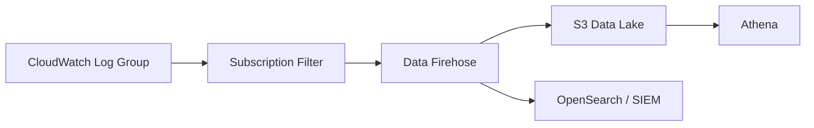
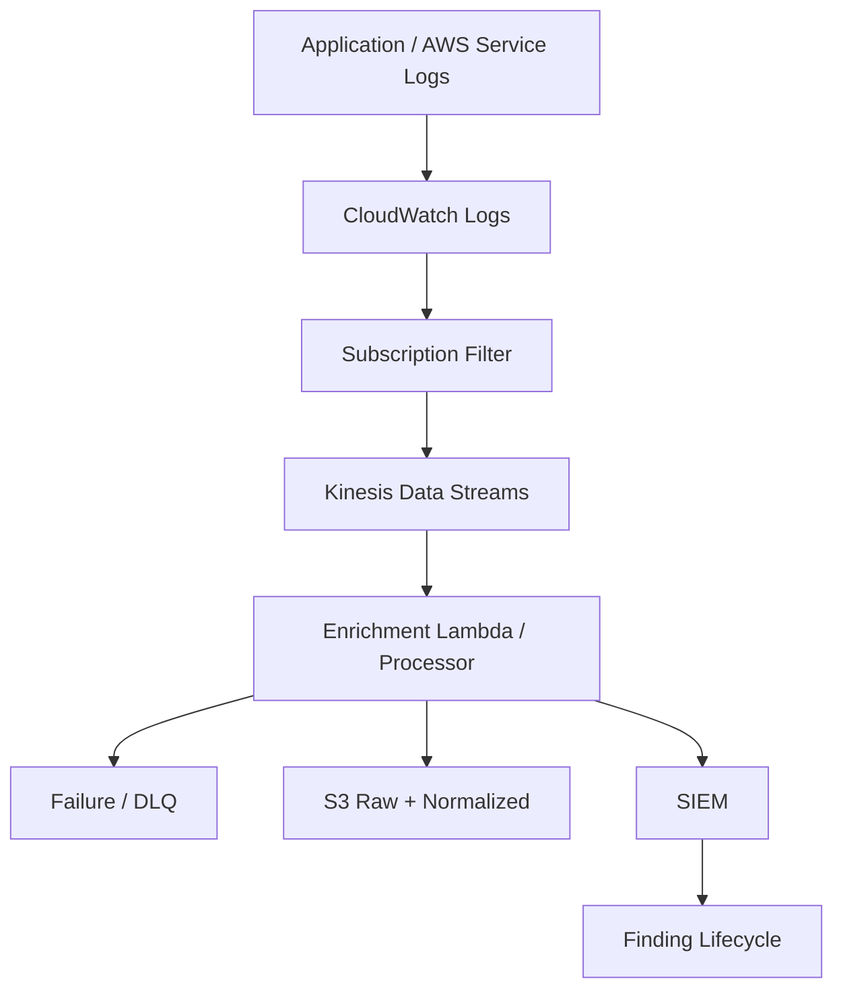
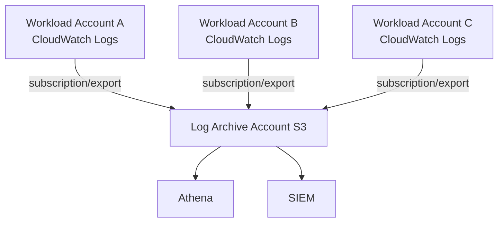
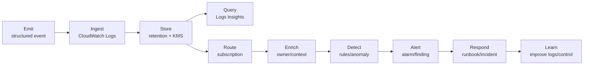
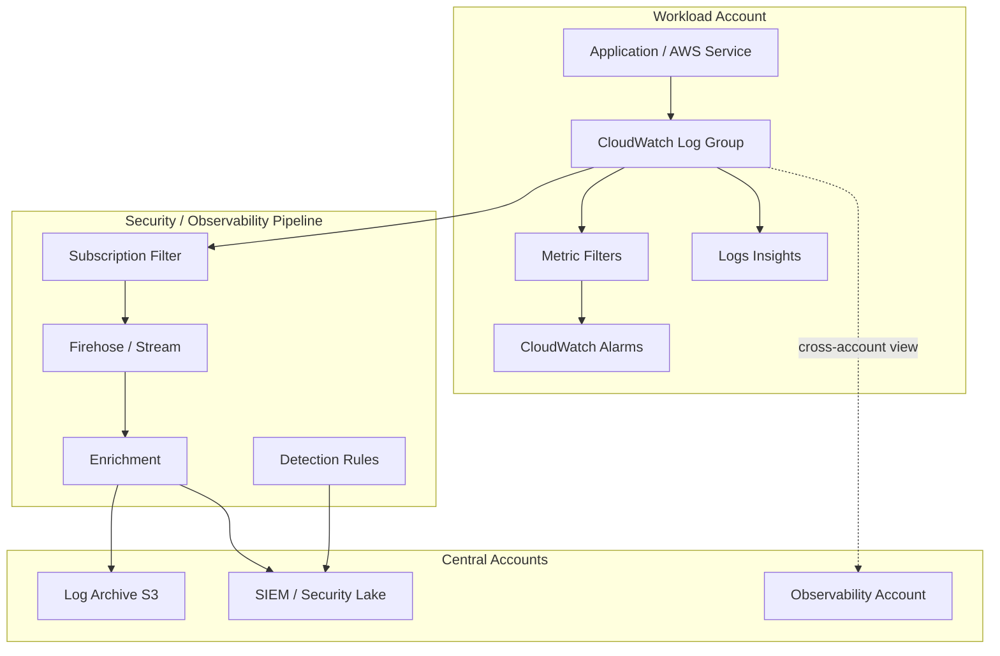

# Part 034 — CloudWatch Logs Architecture

## Tujuan Part Ini

CloudWatch Logs sering dipahami terlalu sempit sebagai “tempat log Lambda muncul”. Itu pemahaman yang dangkal.

Dalam production AWS, CloudWatch Logs adalah salah satu **operational telemetry bus** utama:

- aplikasi menulis log,
- AWS services mengirim log,
- metric filter menghasilkan signal,
- subscription filter mengalirkan log ke pipeline,
- Logs Insights dipakai untuk investigasi,
- log group policy mengatur delivery,
- retention mengatur biaya dan evidence window,
- KMS mengatur encryption boundary,
- IAM mengatur siapa boleh membaca data sensitif,
- log class menentukan cost/feature trade-off.

Part ini membahas CloudWatch Logs sebagai arsitektur, bukan sekadar console page.

Mental model:

```text
CloudWatch Logs is a managed log ingestion, storage, search, routing, and signal extraction layer.
```

Ia bukan pengganti semua logging system. Tetapi ia adalah default substrate yang hampir pasti Anda pakai di AWS.

---

## 1. Apa yang Harus Dijawab oleh Logging Architecture

Sebelum memilih log group name, agent, subscription, atau retention, jawab dulu pertanyaan inti:

1. **Apa yang harus diobservasi?**  
   Application behavior, AWS service activity, security signal, audit trail, operational error, business event, atau infrastructure state?

2. **Siapa pembacanya?**  
   Service owner, platform team, security team, auditor, SRE, incident commander, atau developer on-call?

3. **Berapa cepat harus tersedia?**  
   Real-time, near real-time, hourly, daily, atau hanya untuk audit?

4. **Berapa lama harus disimpan?**  
   7 hari, 30 hari, 90 hari, 1 tahun, 7 tahun?

5. **Apa sensitivitas datanya?**  
   Public, internal, confidential, regulated, secret?

6. **Apa query pattern-nya?**  
   Ad-hoc incident query, dashboard, alert, compliance evidence, forensic reconstruction?

7. **Ke mana harus dialirkan?**  
   CloudWatch only, S3 archive, OpenSearch, SIEM, data lake, third-party vendor?

8. **Bagaimana biaya dikendalikan?**  
   Ingestion volume, retention, query scanned bytes, subscription fan-out, duplicate storage?

Tanpa jawaban ini, logging akan tumbuh organik sampai menjadi mahal, noisy, dan sulit dipercaya.

---

## 2. Core Concepts

### 2.1 Log Event

Log event adalah unit data individual: timestamp + message.

Contoh:

```json
{
  "timestamp": "2026-07-06T10:14:23.456Z",
  "level": "ERROR",
  "service": "payment-api",
  "traceId": "1-668bb9ff-abc123",
  "requestId": "req-9b2a",
  "tenantId": "tenant-42",
  "operation": "AuthorizePayment",
  "errorCode": "PAYMENT_PROVIDER_TIMEOUT",
  "latencyMs": 2800
}
```

A log event should be queryable. Jika log event hanya string bebas tanpa struktur, Anda memaksa manusia melakukan parsing manual saat incident.

### 2.2 Log Stream

Log stream adalah sequence log events dari source tertentu.

Contoh source:

- satu Lambda execution environment,
- satu ECS task,
- satu EC2 agent stream,
- satu AWS service delivery stream.

Jangan membangun reasoning terlalu banyak pada log stream. Untuk banyak service modern, stream bisa ephemeral dan berubah cepat.

### 2.3 Log Group

Log group adalah boundary utama untuk:

- retention,
- KMS encryption,
- access control,
- subscription filter,
- metric filter,
- log class,
- tagging,
- query selection,
- operational ownership.

Dalam desain CloudWatch Logs, log group adalah unit governance.

Jika log group Anda kacau, retention kacau. Jika retention kacau, biaya kacau. Jika access control kacau, data sensitif bocor. Jika naming kacau, incident query lambat.

---

## 3. Log Group Naming as Architecture

Nama log group bukan kosmetik. Ia adalah search index manusia dan policy surface.

Bad naming:

```text
/app/logs
/test
/lambda/foo
/service1
/tmp
```

Better naming:

```text
/org/{org}/env/{env}/service/{service}/component/{component}
/aws/lambda/{function-name}
/aws/ecs/{cluster}/{service}
/aws/apigateway/{api-name}/{stage}
/aws/vpc/flowlogs/{account}/{region}/{vpc-id}
/security/{source}/{account}/{region}
/platform/{capability}/{component}
```

### 3.1 Naming Requirements

A production naming convention should encode:

- environment,
- service or platform capability,
- component,
- account or workload boundary,
- region if centralized,
- source type,
- owner tag.

Namun jangan terlalu banyak memasukkan metadata ke nama jika sudah tersedia sebagai tag atau log field. Nama yang terlalu panjang membuat UX buruk.

Recommended balance:

```text
/aws/{source}/{workload}/{component}/{env}
```

Example:

```text
/aws/ecs/payments/payment-api/prod
/aws/lambda/risk/fraud-score/prod
/aws/vpc-flowlogs/prod-payments/ap-southeast-1/vpc-0abc123
/security/cloudtrail/org/ap-southeast-1
/platform/eks/cluster-a/control-plane
```

---

## 4. Tagging Log Groups

Log groups perlu tags seperti resource lain.

Minimal tags:

```yaml
Environment: prod
Service: payment-api
OwnerTeam: payments-platform
DataClassification: confidential
Criticality: tier-1
RetentionClass: prod-standard-90d
CostCenter: cc-1234
ManagedBy: terraform
```

Tags digunakan untuk:

- cost allocation,
- access policy automation,
- retention automation,
- compliance reporting,
- exception discovery,
- lifecycle management.

Jika log groups tidak punya ownership metadata, tidak ada yang merasa bertanggung jawab atas volume, retention, atau sensitive data exposure.

---

## 5. Log Data Classes

CloudWatch Logs mendukung log classes. AWS mendokumentasikan bahwa Standard log class adalah opsi full-featured untuk log yang perlu real-time monitoring atau sering diakses. Infrequent Access class didesain untuk log yang lebih jarang diakses dengan subset fitur berbeda.

Mental model:

| Log Class | Cocok Untuk | Hindari Untuk |
|---|---|---|
| Standard | hot operational logs, alarms, metric filters, subscription, frequent query | long-term archive murah tanpa kebutuhan hot access |
| Infrequent Access | logs yang tetap perlu disimpan di CloudWatch tetapi jarang diakses | logs yang butuh semua fitur Standard atau real-time operational workflow |

Prinsip:

```text
Hot logs need features and speed.
Cold logs need retention and cost control.
```

Untuk archive jangka panjang, S3 sering lebih tepat daripada memaksa semua data tetap di CloudWatch.

---

## 6. Retention as a Control

By default, CloudWatch Logs dapat menyimpan log indefinitely jika retention tidak diatur. Ini berbahaya dari sisi biaya dan data minimization.

Retention adalah control, bukan housekeeping.

### 6.1 Retention Matrix

| Log Category | Example | Suggested Hot Retention | Archive |
|---|---|---:|---|
| Tier-1 app logs | payment-api prod | 30–90 days | S3 1–7 years if required |
| Security detection logs | GuardDuty/SecurityHub exports | 90 days | S3/SIEM according to policy |
| CloudTrail to CloudWatch | selected alert source | 30–90 days | S3 is source of record |
| VPC Flow Logs hot subset | critical VPC/ENI | 14–90 days | S3 long-term |
| Dev logs | dev service logs | 7–14 days | usually no archive |
| Debug verbose logs | temporary investigation | 1–7 days | only if incident evidence |
| PII-heavy app logs | avoid if possible | minimal | controlled archive only |

### 6.2 Retention Failure Modes

| Failure | Consequence |
|---|---|
| No retention set | runaway cost, over-retention of sensitive data |
| Too short retention | incident evidence gone before investigation |
| Same retention for all logs | cost/compliance mismatch |
| Manual retention changes | drift and inconsistent evidence windows |
| No archive path | hot store abused as archive |

### 6.3 Retention Automation

Pattern:

1. All log groups must have `RetentionClass` tag.
2. EventBridge detects `CreateLogGroup`.
3. Lambda/automation applies retention based on tag or naming convention.
4. Config custom rule detects log groups with no retention.
5. Exceptions require owner and expiry.

Pseudo-policy:

```text
IF log group is prod tier-1 THEN retention >= 30 days
IF log group is dev THEN retention <= 14 days unless exception
IF log group has DataClassification=regulated THEN archive required
IF log group has no owner THEN non-compliant
```

---

## 7. Encryption and KMS Design

CloudWatch Logs encrypts log data, and you can associate KMS keys with log groups when customer-managed key control is required.

Use customer-managed KMS keys when:

- logs contain sensitive/regulatory data,
- auditor requires key ownership,
- cross-account access must be tightly governed,
- separation of duties matters,
- key usage must be auditable.

### 7.1 KMS Key Per What?

Options:

| Model | Pros | Cons |
|---|---|---|
| One key per account/region | Simple | Coarse blast radius |
| One key per environment | Better isolation | More keys/policy management |
| One key per high-value service | Strong isolation | More operational overhead |
| Centralized logging key | Easier central policy | Cross-account complexity |

Recommended baseline:

```text
Use account/region/environment keys for normal workloads.
Use dedicated keys for regulated or high-sensitivity log groups.
```

### 7.2 Key Policy Considerations

Key policy must allow CloudWatch Logs service principal for the region and the right encryption context. Avoid broad key usage that lets unrelated principals decrypt logs.

Security invariant:

```text
Workload write access to logs must not imply broad read/decrypt access to logs.
```

Application role may write logs. That does not mean it should read all logs.

---

## 8. IAM Access Model for Logs

Logs often contain sensitive data:

- user IDs,
- tenant IDs,
- IP addresses,
- emails,
- request payload fragments,
- error details,
- tokens accidentally logged,
- internal topology,
- security findings.

So log read access is security-sensitive.

### 8.1 Access Personas

| Persona | Access |
|---|---|
| Service developer | read own service logs in non-prod; controlled prod read |
| On-call engineer | time-bound prod read for owned services |
| Security analyst | read security logs and incident-scope app logs |
| Auditor | read evidence/export, not arbitrary live debug |
| Platform admin | manage log infrastructure, not necessarily read all sensitive content |
| Automation role | write/route/retain, least privilege only |

### 8.2 Separate Manage from Read

Do not equate `logs:*` with operational access.

Separate:

- create log group,
- put log events,
- put retention policy,
- put subscription filter,
- query logs,
- get log events,
- delete log group,
- associate KMS key.

A deployment role may need to create log groups and write logs. It does not need to query all production logs.

### 8.3 Dangerous Permissions

Be careful with:

```text
logs:DeleteLogGroup
logs:DeleteLogStream
logs:PutRetentionPolicy
logs:DeleteRetentionPolicy
logs:PutSubscriptionFilter
logs:DeleteSubscriptionFilter
logs:AssociateKmsKey
logs:DisassociateKmsKey
logs:PutResourcePolicy
logs:StartQuery
logs:GetQueryResults
logs:FilterLogEvents
```

For production, destructive logging permissions should be limited to automation roles with approval and full CloudTrail audit.

---

## 9. Structured Logging Contract

CloudWatch Logs stores messages. Query quality depends on structure.

Bad log:

```text
error happened while processing payment
```

Better log:

```json
{
  "timestamp": "2026-07-06T10:14:23.456Z",
  "level": "ERROR",
  "service": "payment-api",
  "env": "prod",
  "version": "2026.07.06.3",
  "traceId": "1-668bb9ff-abc123",
  "requestId": "req-9b2a",
  "tenantId": "tenant-42",
  "operation": "AuthorizePayment",
  "outcome": "failure",
  "errorCode": "PAYMENT_PROVIDER_TIMEOUT",
  "latencyMs": 2800,
  "dependency": "provider-x"
}
```

### 9.1 Required Fields

For application logs:

```yaml
timestamp: required
level: required
service: required
environment: required
version: recommended
traceId: required for distributed systems
requestId: required
operation: required
outcome: required
errorCode: recommended
tenantId: if multi-tenant and policy allows
userId: only if safe and necessary
latencyMs: for request/dependency logs
dependency: for outbound calls
```

### 9.2 Sensitive Data Rules

Never log:

- password,
- access token,
- refresh token,
- session cookie,
- private key,
- raw authorization header,
- full payment card data,
- secrets,
- MFA codes.

Be careful with:

- email,
- phone,
- address,
- national ID,
- account number,
- IP address,
- payload fragments,
- stack traces containing data.

Logging architecture must include **redaction** and **schema review**. Otherwise CloudWatch becomes a sensitive data lake by accident.

---

## 10. Ingestion Patterns

### 10.1 AWS Service Native Logs

Many AWS services can deliver logs to CloudWatch Logs:

- Lambda logs,
- API Gateway execution/access logs,
- Route 53 Resolver query logs,
- VPC Flow Logs,
- CloudTrail selected delivery,
- ECS/Container logs via awslogs driver,
- EKS/container logs via agents,
- custom app logs through CloudWatch agent.

Native integration is convenient, but defaults may not match your architecture.

Always check:

- log group naming,
- retention,
- KMS,
- permissions,
- field structure,
- volume,
- subscription behavior,
- centralization requirement.

### 10.2 CloudWatch Agent

For EC2 and on-prem/hybrid, CloudWatch Agent can collect logs and metrics.

Use it when:

- EC2 app writes file logs,
- OS logs matter,
- custom metrics needed,
- legacy apps cannot directly write structured logs to stdout.

Pitfalls:

- duplicate logs,
- wrong multiline parsing,
- too broad file glob,
- no retention policy,
- no owner tagging,
- agent IAM role too broad,
- noisy debug logs shipped indefinitely.

### 10.3 Container Logs

For ECS/EKS, prefer stdout/stderr with structured JSON where possible.

Do not let every container invent its own schema. Define platform logging contract:

```text
Application writes structured logs to stdout.
Runtime/agent ships logs.
CloudWatch log group is owned by service.
Retention and subscription are managed by platform.
Sensitive data is blocked by library/review/testing.
```

---

## 11. Subscription Filters as Routing Layer

CloudWatch Logs subscription filters can deliver log events to destinations such as Kinesis Data Streams, Lambda, or Firehose. This turns log groups into routing sources.

Use subscription filters for:

- central log pipeline,
- SIEM forwarding,
- real-time enrichment,
- security detection,
- data lake delivery,
- redaction/transformation,
- fan-out through stream architecture.

### 11.1 Basic Pattern



### 11.2 Security Pipeline Pattern



### 11.3 Subscription Filter Risks

| Risk | Consequence |
|---|---|
| Filter too broad | massive cost and downstream pressure |
| Filter too narrow | missed security signal |
| Destination failure | log forwarding gap |
| No DLQ/retry awareness | silent loss in derived pipeline |
| Multiple pipelines unmanaged | duplicate cost and inconsistent evidence |
| Workload can change subscription | bypass security pipeline |

Guardrail:

```text
Production log groups that are security-relevant must have approved subscription routing or approved exception.
```

---

## 12. Metric Filters: Turning Logs into Metrics

Metric filters transform matching log events into CloudWatch metrics. AWS documents metric filters as a way to transform log data into actionable metrics.

Use metric filters when:

- pattern is simple,
- signal should become alarmable metric,
- you need count/rate over time,
- full stream processing is overkill.

Examples:

- count authentication failures,
- count root account usage from CloudTrail logs,
- count application `ERROR`,
- count payment provider timeout,
- count denied authorization decisions,
- count WAF blocked requests,
- count VPC Flow Logs REJECT to admin ports.

### 12.1 Good Metric Filter Candidate

```json
{ $.level = "ERROR" && $.service = "payment-api" && $.errorCode = "PAYMENT_PROVIDER_TIMEOUT" }
```

Metric:

```text
Namespace: App/Payments
MetricName: PaymentProviderTimeout
Dimensions: Service, Environment
```

### 12.2 Bad Metric Filter Candidate

A complex fraud detection rule requiring state, joins, baselines, threat intel, and enrichment does not belong in simple metric filters.

Use stream processing/SIEM/data lake for that.

### 12.3 Metric Filter Failure Modes

- unstructured logs break pattern,
- schema changes silently reduce matches,
- high-cardinality dimensions cause cost/issues,
- pattern matches too broadly,
- no alarm owner,
- no runbook,
- metric exists but no one responds.

A metric without owner and runbook is not monitoring. It is decoration.

---

## 13. Logs Insights Query Architecture

CloudWatch Logs Insights is an interactive query engine for CloudWatch Logs.

It is ideal for:

- incident debugging,
- operational analysis,
- short/medium time windows,
- structured log search,
- aggregation by field,
- quick hypothesis testing.

It is less ideal for:

- multi-year forensic over huge data,
- complex joins,
- long-term data lake analytics,
- massive SIEM correlation,
- permanent business reporting.

### 13.1 Query Principles

1. Always restrict time window.
2. Query smallest relevant log groups.
3. Parse structured JSON instead of regex where possible.
4. Avoid scanning huge volumes repeatedly.
5. Save common queries in runbooks.
6. Use field indexes where supported and useful.
7. Treat query cost as an operational concern.

### 13.2 Application Error Rate

```sql
fields @timestamp, service, level, errorCode, requestId
| filter service = "payment-api"
| filter level = "ERROR"
| stats count(*) as errors by errorCode
| sort errors desc
| limit 20
```

### 13.3 Latency Distribution by Operation

```sql
fields @timestamp, operation, latencyMs
| filter service = "payment-api"
| filter ispresent(latencyMs)
| stats pct(latencyMs, 50) as p50, pct(latencyMs, 90) as p90, pct(latencyMs, 99) as p99 by operation
| sort p99 desc
```

### 13.4 Trace Correlation

```sql
fields @timestamp, service, traceId, requestId, level, message
| filter traceId = "1-668bb9ff-abc123"
| sort @timestamp asc
```

### 13.5 Security Deny Events

```sql
fields @timestamp, actor, action, resource, decision, reason
| filter decision = "DENY"
| stats count(*) as denies by action, reason
| sort denies desc
```

---

## 14. Log Group Resource Policies

Some AWS services need resource policies to write to CloudWatch Logs. These policies define which service principals can put logs into specific log groups.

Failure mode:

```text
Service configured to deliver logs, but resource policy does not allow delivery.
```

Security concern:

```text
Overly broad resource policy allows unexpected log delivery or weakens boundary.
```

Design principles:

- restrict service principal,
- restrict source account where supported,
- restrict source ARN where supported,
- manage via IaC,
- audit changes via CloudTrail,
- validate delivery after deployment.

---

## 15. Centralized Logging Patterns

### 15.1 Decentralized Hot Logs + Central Archive



Pros:

- service teams query hot logs locally,
- central account holds archive,
- better ownership boundaries,
- less cross-account operational friction.

Cons:

- need consistent policy automation,
- cross-account visibility requires setup,
- duplicate storage if not controlled.

### 15.2 Centralized CloudWatch Logs Account

All logs forwarded to log account CloudWatch.

Pros:

- central query experience,
- security team visibility,
- common subscription pipeline.

Cons:

- cross-account delivery complexity,
- possible central bottleneck,
- IAM access model gets sensitive,
- cost attribution harder,
- noisy if all teams query same account.

### 15.3 Recommended Hybrid

```text
Keep hot operational logs near workload ownership.
Forward security-relevant and archive-required logs to central custody/pipeline.
Use cross-account observability where it improves visibility without destroying ownership.
```

---

## 16. Cross-Account Observability

In multi-account AWS, central teams often need visibility without copying every log into one place.

Use cases:

- platform team monitors shared services,
- security team investigates incident across accounts,
- SRE team sees service health across workloads,
- operations account hosts dashboards.

Design concerns:

- who can query which accounts,
- whether sensitive logs are exposed broadly,
- cost attribution of queries,
- access expiry during incident,
- auditability of reads,
- region coverage.

Pattern:

```text
Use central observability account for dashboards and incident views.
Keep source log groups owned by workload accounts.
Grant read/query access through controlled roles and observability links.
```

Do not solve visibility by giving everyone `AdministratorAccess` in production accounts.

---

## 17. Log Lifecycle: From Emission to Action

A mature log architecture has lifecycle stages:



Most teams stop at `INGEST`. Strong teams close the loop to `LEARN`.

---

## 18. Designing Logs for Incidents

During incident, logs must support:

- timeline reconstruction,
- blast radius analysis,
- actor/resource attribution,
- dependency tracing,
- error classification,
- customer impact estimation,
- decision audit,
- post-incident learning.

Application logs should include:

- request ID,
- trace ID,
- tenant/customer impact key where allowed,
- operation,
- outcome,
- error code,
- dependency,
- latency,
- version/build,
- region/AZ if useful,
- safe actor identifier where relevant.

Security logs should include:

- principal,
- action,
- resource,
- decision,
- policy/rule ID,
- reason,
- source IP/context,
- correlation ID,
- session identity.

Avoid logs like:

```text
Access denied.
```

Prefer:

```json
{
  "eventType": "authorization_decision",
  "decision": "DENY",
  "principalType": "role",
  "principalId": "session/payment-worker",
  "action": "RefundPayment",
  "resourceType": "payment",
  "resourceIdHash": "sha256:...",
  "reason": "missing_scope",
  "policyVersion": "2026-07-01",
  "traceId": "1-668bb9ff-abc123"
}
```

---

## 19. CloudWatch Logs and Alarms

CloudWatch Logs itself is not alerting unless you extract signals.

Alert paths:

1. Metric filter → CloudWatch Metric → Alarm.
2. Logs Insights scheduled query or managed query workflow.
3. Subscription pipeline → detection engine → finding/incident.
4. AWS service native metric/alarm.

Do not alarm on every error log. Alarm on user impact or violated invariant.

Bad alarm:

```text
Any ERROR in payment-api > 0
```

Better alarm:

```text
Payment authorization failure rate > 5% for 5 minutes AND request volume > 100
```

Security alarm example:

```text
Root user activity observed in CloudTrail log group
```

This is an invariant violation, not a noisy operational symptom.

---

## 20. Log Schema Governance

A platform team should define logging contract:

- required fields,
- allowed sensitive fields,
- redaction libraries,
- error code taxonomy,
- correlation field names,
- timestamp format,
- level semantics,
- sampling rules,
- debug logging policy,
- schema versioning.

### 20.1 Level Semantics

| Level | Meaning |
|---|---|
| DEBUG | detailed development/investigation; usually disabled in prod unless scoped |
| INFO | normal important lifecycle event |
| WARN | unexpected but handled condition requiring attention if persistent |
| ERROR | operation failed or user/system impact occurred |
| FATAL | process/service cannot continue |

If teams use `ERROR` for harmless business declines, alarms become useless.

### 20.2 Error Code Taxonomy

Prefer stable error codes over free text.

```text
PAYMENT_PROVIDER_TIMEOUT
AUTHZ_MISSING_SCOPE
ORDER_STATE_CONFLICT
DATABASE_CONNECTION_POOL_EXHAUSTED
DEPENDENCY_RATE_LIMITED
```

Stable error codes make dashboards, alarms, and queries durable across message wording changes.

---

## 21. Sampling and Volume Control

High-volume systems cannot log everything at full detail forever.

Volume controls:

- log levels,
- sampling,
- dynamic debug windows,
- payload omission,
- aggregation metrics,
- separate audit events from debug events,
- retention tiering,
- route only selected logs to expensive SIEM,
- structured error counters.

But be careful: sampling security/audit events can destroy evidence.

Rule of thumb:

```text
Debug logs can be sampled.
Business/audit/security decision logs usually should not be sampled without explicit risk acceptance.
```

---

## 22. CloudWatch Logs vs S3 vs OpenSearch vs SIEM

| System | Best Use |
|---|---|
| CloudWatch Logs | hot operational logs, AWS-native query, metric filters, alarms, short/medium investigation |
| S3 | long-term archive, data lake, low-cost retention, Athena queries |
| OpenSearch | indexed search, dashboards, exploratory text search |
| SIEM | security correlation, detections, case management, threat hunting |
| Metrics | low-cardinality time series and alarms |
| Tracing | request path and dependency latency |

Do not force logs to do metrics' job. Do not force metrics to do logs' job. Do not force CloudWatch to be your compliance archive if S3 is more appropriate.

---

## 23. Production Logging Reference Architecture



Architecture invariants:

```text
Every production log group has owner, retention, classification, and managed lifecycle.
Security-relevant logs are routed to central pipeline.
Long-term evidence is stored outside workload admin control.
Read access is least privilege and auditable.
Log schema supports incident reconstruction.
```

---

## 24. Failure Modes and How to Detect Them

### 24.1 Log Group Created Without Retention

Detection:

- EventBridge on `CreateLogGroup`,
- Config custom rule,
- scheduled inventory.

Remediation:

- apply retention by tag/convention,
- notify owner,
- block production promotion if missing.

### 24.2 Application Stops Emitting Logs

Detection:

- heartbeat log metric,
- expected log volume anomaly,
- service health alarm,
- deployment correlation.

Be careful: no logs could mean no traffic, app dead, logging broken, permission broken, or ingestion throttled.

### 24.3 Subscription Pipeline Broken

Detection:

- delivery error metrics,
- downstream freshness check,
- missing partition alarm,
- SIEM ingestion gap.

Remediation:

- replay from source if retained,
- fix destination permission,
- scale stream processor,
- inspect DLQ.

### 24.4 Sensitive Data Logged

Detection:

- log scanning,
- Macie/S3 archive scan,
- regex/classifier pipeline,
- code review/static rules,
- runtime redaction tests.

Response:

- stop source,
- rotate exposed secrets if any,
- restrict access,
- purge if allowed/required,
- document incident,
- add regression control.

### 24.5 Query Access Too Broad

Detection:

- IAM Access Analyzer,
- CloudTrail query activity,
- periodic access review,
- role assignment review.

Remediation:

- split roles,
- reduce read scope,
- add time-bound access,
- require incident ID for elevated access.

---

## 25. Runbook: New Service Logging Onboarding

When a new production service launches:

1. Define log group naming.
2. Define owner tags.
3. Define data classification.
4. Define retention class.
5. Associate KMS key if required.
6. Define structured log schema.
7. Confirm trace/request correlation fields.
8. Define error code taxonomy.
9. Configure subscription to central pipeline if required.
10. Configure metric filters for critical invariant violations.
11. Configure dashboards and saved queries.
12. Validate no sensitive fields are logged.
13. Validate access model.
14. Run sample incident query.
15. Add log group to service operational documentation.

Definition of done:

```text
A new service is not production-ready until its logs are queryable, retained, protected, owned, and useful during an incident.
```

---

## 26. Runbook: Incident Query Pack

Every tier-1 service should maintain a query pack.

Minimum queries:

### 26.1 Errors by Code

```sql
fields @timestamp, errorCode, operation, requestId
| filter level = "ERROR"
| stats count(*) as count by errorCode, operation
| sort count desc
```

### 26.2 Requests for a Trace

```sql
fields @timestamp, service, operation, level, message
| filter traceId = "<trace-id>"
| sort @timestamp asc
```

### 26.3 Slow Operations

```sql
fields @timestamp, operation, latencyMs, requestId
| filter latencyMs > 1000
| stats count(*) as count, pct(latencyMs, 95) as p95, max(latencyMs) as max by operation
| sort p95 desc
```

### 26.4 Dependency Failures

```sql
fields @timestamp, dependency, errorCode, latencyMs
| filter outcome = "failure"
| filter ispresent(dependency)
| stats count(*) as failures by dependency, errorCode
| sort failures desc
```

### 26.5 Customer/Tenant Impact

Only if allowed by data policy:

```sql
fields @timestamp, tenantId, operation, outcome, errorCode
| filter outcome = "failure"
| stats count(*) as failures by tenantId, errorCode
| sort failures desc
| limit 50
```

---

## 27. Controls Checklist

```mdx-code-block
- [ ] All production log groups are created by IaC or approved automation
- [ ] Naming convention is consistent
- [ ] Owner tags exist
- [ ] Environment tags exist
- [ ] Data classification tags exist
- [ ] Retention is explicit
- [ ] KMS key is associated where required
- [ ] Destructive log permissions are restricted
- [ ] Read access is least privilege
- [ ] Subscription filters are managed and monitored
- [ ] Security-relevant logs route to central pipeline
- [ ] Long-term archive exists where required
- [ ] Metric filters have owners and runbooks
- [ ] Saved queries exist for incident response
- [ ] Sensitive data logging controls exist
- [ ] Delivery freshness is monitored
- [ ] Cost dashboards exist
- [ ] Exceptions have owner and expiry
```

---

## 28. What Top Engineers Internalize

Top engineers do not say “we have logs” as if that means anything.

They ask:

- Are logs structured?
- Are they retained long enough?
- Are they protected from tampering?
- Are they safe from sensitive data leakage?
- Can the right people query them during an incident?
- Can the wrong people not query them?
- Are they routed to detection systems?
- Are alerts derived from meaningful invariants?
- Can we reconstruct a timeline?
- Can we control cost?
- Can we prove evidence custody?

CloudWatch Logs is powerful because it sits close to AWS services. But that same convenience creates sprawl unless governed.

The target state:

```text
Every important log stream has purpose, owner, schema, retention, access boundary, routing path, and incident value.
```

If a log cannot help operate, secure, debug, prove, or learn, it is probably waste.

If a missing log would make an incident impossible to investigate, it is probably critical evidence.

---

## 29. References

- Amazon CloudWatch Logs User Guide — https://docs.aws.amazon.com/AmazonCloudWatch/latest/logs/WhatIsCloudWatchLogs.html
- Working with Log Groups and Log Streams — https://docs.aws.amazon.com/AmazonCloudWatch/latest/logs/Working-with-log-groups-and-streams.html
- CloudWatch Logs Log Classes — https://docs.aws.amazon.com/AmazonCloudWatch/latest/logs/CloudWatch_Logs_Log_Classes.html
- CloudWatch Logs Subscription Filters — https://docs.aws.amazon.com/AmazonCloudWatch/latest/logs/SubscriptionFilters.html
- Real-time Processing of Log Data with Subscriptions — https://docs.aws.amazon.com/AmazonCloudWatch/latest/logs/Subscriptions.html
- Filter and Pattern Syntax for Metric Filters and Subscription Filters — https://docs.aws.amazon.com/AmazonCloudWatch/latest/logs/FilterAndPatternSyntax.html
- CloudWatch Logs Insights Query Syntax — https://docs.aws.amazon.com/AmazonCloudWatch/latest/logs/CWL_QuerySyntax.html
- AWS Security Reference Architecture — https://docs.aws.amazon.com/prescriptive-guidance/latest/security-reference-architecture/welcome.html
