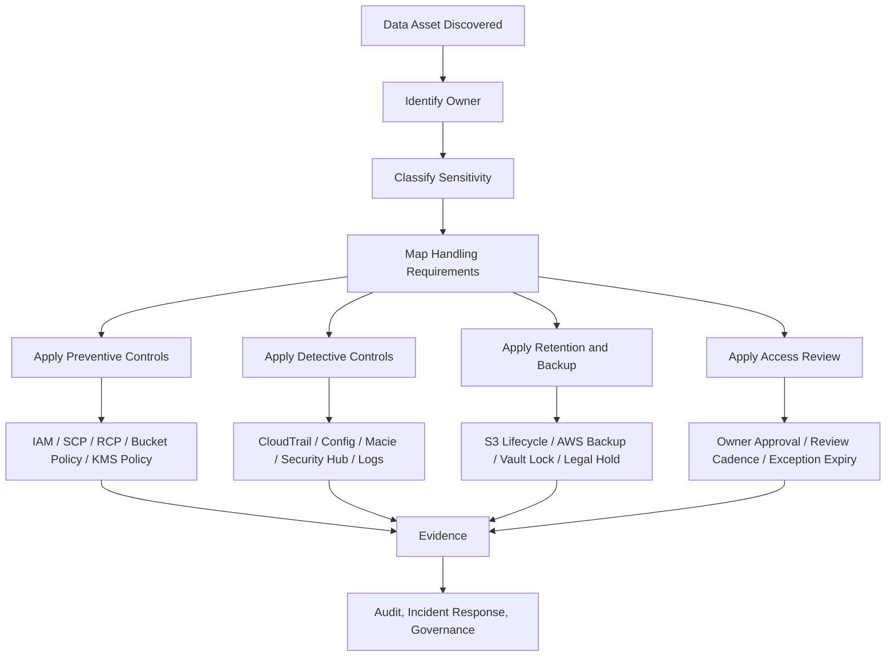
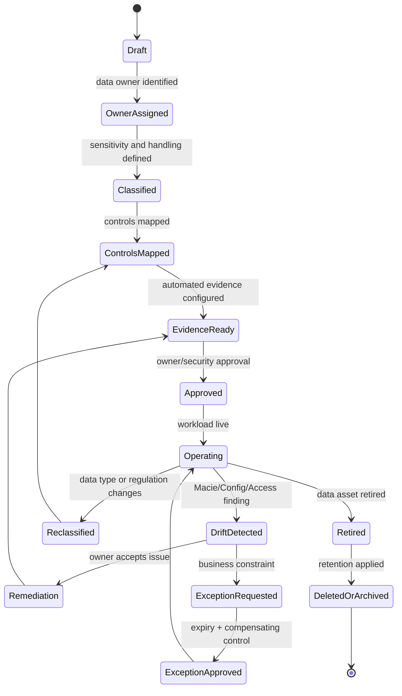

# Part 035 — Data Classification for AWS

## Tujuan Part Ini

Banyak organisasi mulai data protection dari pertanyaan yang salah:

> “Service AWS mana yang bisa encrypt data?”

Pertanyaan yang lebih tepat:

> “Data apa yang sedang kita proses, siapa pemiliknya, seberapa sensitif, di mana ia mengalir, siapa boleh mengaksesnya, berapa lama harus disimpan, bagaimana ia bisa bocor, dan bukti apa yang harus tersedia bila terjadi audit atau insiden?”

Encryption, KMS, Macie, bucket policy, IAM, backup, retention, logging, dan DLP hanyalah mekanisme. Mekanisme tanpa klasifikasi data akan berubah menjadi checklist acak.

Part ini membangun data classification sebagai **control routing system** untuk AWS.

Mental model:

```text
Data classification is not a label.
It is a decision engine for protection, retention, access, monitoring, and evidence.
```

AWS Well-Architected Security Pillar menempatkan data classification sebagai cara mengategorikan data berdasarkan criticality dan sensitivity agar protection dan retention controls dapat ditentukan. AWS juga menegaskan bahwa pelanggan bertanggung jawab mengklasifikasikan data dan menerapkan kontrol yang sesuai di cloud environment.

---

## 1. Mengapa Data Classification Wajib Ada Sebelum Data Protection

Tanpa data classification, tim biasanya melakukan salah satu dari dua hal ekstrem:

1. **Over-protect everything**  
   Semua data diperlakukan seperti data paling sensitif. Hasilnya: biaya tinggi, friction tinggi, developer mencari jalan pintas, exception menumpuk.

2. **Under-protect unknown data**  
   Tim tidak tahu mana yang sensitif. Hasilnya: public exposure, log leakage, backup retention salah, unauthorized analytics copy, dan incident response lambat.

Data classification memberi jawaban eksplisit untuk pertanyaan berikut:

| Pertanyaan | Tanpa klasifikasi | Dengan klasifikasi |
|---|---|---|
| Apakah data boleh public? | Dugaan | Berdasarkan label dan owner |
| Apakah harus dienkripsi dengan customer managed KMS key? | Tergantung engineer | Berdasarkan classification policy |
| Apakah boleh masuk log aplikasi? | Tidak jelas | Dilarang untuk class tertentu |
| Berapa lama retention? | Default service | Berdasarkan legal/compliance requirement |
| Siapa boleh membaca? | IAM role historis | Berdasarkan data owner dan access model |
| Apakah perlu Macie scan? | Manual | Berdasarkan bucket/data class |
| Apakah perlu immutable backup? | Setelah insiden | Berdasarkan recovery dan regulatory requirement |
| Bagaimana membuktikan compliance? | Screenshot | Evidence pipeline |

Klasifikasi data mengubah security dari opini menjadi kontrak.

---

## 2. Data Classification Bukan Sekadar Tag

Tag seperti ini berguna:

```text
DataClassification=Restricted
DataOwner=payments-platform
ComplianceScope=PCI-DSS
RetentionClass=seven-years
```

Tetapi tag bukan klasifikasi. Tag hanyalah representasi machine-readable dari keputusan klasifikasi.

Klasifikasi yang matang minimal berisi:

| Field | Makna |
|---|---|
| `data_asset_id` | Identitas asset data, bukan hanya resource AWS |
| `data_owner` | Pihak yang accountable atas akses dan retention |
| `system_owner` | Tim yang mengoperasikan workload |
| `classification` | Public, Internal, Confidential, Restricted, Secret |
| `data_subject` | Customer, employee, partner, citizen, merchant, device |
| `data_type` | PII, credential, payment, health, financial, legal, telemetry |
| `storage_location` | S3, RDS, DynamoDB, OpenSearch, CloudWatch Logs, Redshift, EBS |
| `processing_location` | Account, Region, runtime, analytics workspace |
| `access_pattern` | Human read, service read, batch export, support access |
| `retention` | TTL, archival period, legal hold, deletion expectation |
| `backup_requirement` | RPO/RTO, immutable backup, cross-region copy |
| `encryption_requirement` | AWS-owned, AWS-managed, customer managed, HSM/external key |
| `monitoring_requirement` | Macie, CloudTrail data events, access logs, query audit |
| `sharing_boundary` | Same account, same org, partner, public, regulator |
| `exception_status` | Approved exception, expiry, compensating control |

Jika hanya punya tag tanpa owner, lifecycle, dan policy consequence, Anda baru punya metadata, belum punya classification program.

---

## 3. Classification Level yang Praktis untuk AWS

Gunakan skema yang cukup sederhana agar bisa dioperasikan, tetapi cukup kuat untuk membedakan kontrol.

Contoh skema lima level:

| Level | Nama | Contoh | Dampak Jika Bocor | Default Control |
|---:|---|---|---|---|
| 1 | Public | Marketing assets, public documentation, public price list | Rendah | Integrity, availability, cache control |
| 2 | Internal | Internal dashboard, non-sensitive operational metadata | Sedang | IAM authenticated access, encryption default, logging |
| 3 | Confidential | Customer profile, business metrics, contracts, support notes | Tinggi | Strict IAM, customer managed KMS where needed, access audit |
| 4 | Restricted | PII regulated, payment-related data, health data, financial records | Sangat tinggi | Strong isolation, explicit owner approval, enhanced logging, retention policy |
| 5 | Secret | Credentials, private keys, root secrets, signing keys, break-glass material | Kritis | Secrets manager/HSM/KMS, no logging, tightly scoped runtime access |

Jangan membuat terlalu banyak level. Jika organisasi punya 11 label tetapi tidak punya enforcement otomatis, label itu akan diabaikan.

Rule of thumb:

```text
Classification level is useful only if it changes engineering behavior.
```

Jika `Confidential` dan `Restricted` memiliki kontrol yang sama persis, gabungkan atau perjelas bedanya.

---

## 4. Mermaid — Data Classification sebagai Control Router



Data classification bukan akhir proses. Ia adalah input ke semua control plane berikutnya.

---

## 5. Data Asset vs AWS Resource

Satu kesalahan umum adalah menyamakan **data asset** dengan **AWS resource**.

Contoh:

```text
s3://prod-payments-exports
```

Itu resource.

Data asset-nya mungkin:

```text
Daily payment settlement export containing merchant ID, transaction amount, masked card data, settlement status, and reconciliation metadata.
```

Satu data asset bisa berada di banyak resource:

- S3 raw bucket,
- S3 curated bucket,
- Redshift table,
- Glue catalog,
- Athena query result bucket,
- CloudWatch application logs,
- backup vault,
- developer sample dataset,
- support export,
- BI dashboard cache.

Klasifikasi harus mengikuti data, bukan hanya resource.

Jika `customer_email` berpindah dari RDS ke S3 analytics bucket, class-nya tidak turun hanya karena storage-nya berubah.

---

## 6. Data Lifecycle di AWS

Gunakan lifecycle berikut untuk menemukan tempat kontrol harus diterapkan.

```text
Collect -> Ingest -> Store -> Process -> Derive -> Replicate -> Share -> Archive -> Delete
```

### 6.1 Collect

Data masuk dari:

- public API,
- internal API,
- batch upload,
- partner integration,
- event stream,
- IoT/device telemetry,
- support tooling,
- admin console,
- migration import.

Pertanyaan:

- Apakah consent/legal basis sudah jelas?
- Apakah data minimization diterapkan?
- Apakah input mengandung secret yang tidak boleh disimpan?
- Apakah field sensitif langsung dipisahkan?

### 6.2 Ingest

Data melewati:

- API Gateway,
- ALB/NLB,
- Lambda,
- ECS/EKS service,
- Kinesis,
- SQS,
- EventBridge,
- Glue job,
- DataSync,
- Transfer Family.

Pertanyaan:

- Apakah payload masuk ke logs?
- Apakah failed request menyimpan raw data?
- Apakah dead-letter queue menyimpan data sensitif?
- Apakah tracing menangkap body/header sensitif?

### 6.3 Store

Data berada di:

- S3,
- RDS/Aurora,
- DynamoDB,
- EBS/EFS/FSx,
- OpenSearch,
- Redshift,
- ElastiCache,
- DocumentDB,
- Neptune,
- Timestream,
- CloudWatch Logs.

Pertanyaan:

- Apakah encryption at rest sesuai class?
- Apakah key owner sesuai?
- Apakah access path manusia diaudit?
- Apakah backup memiliki class yang sama?

### 6.4 Process

Data dipakai oleh:

- application runtime,
- analytics job,
- ETL pipeline,
- ML training,
- support tooling,
- reporting,
- fraud engine,
- reconciliation job.

Pertanyaan:

- Apakah runtime role terlalu luas?
- Apakah derived output lebih rendah class-nya atau tetap sama?
- Apakah temporary files terenkripsi?
- Apakah job output masuk lokasi yang benar?

### 6.5 Derive

Derived data sering lebih berbahaya daripada data asal.

Contoh:

- skor risiko fraud,
- customer segmentation,
- behavioral profile,
- aggregated financial exposure,
- support case history,
- access pattern anomaly.

Jangan menganggap agregasi otomatis menurunkan sensitivity. Kadang agregasi justru menciptakan intelligence baru.

### 6.6 Replicate

Data direplikasi ke:

- cross-region backup,
- read replica,
- analytics account,
- disaster recovery account,
- partner S3 bucket,
- warehouse,
- developer environment.

Pertanyaan:

- Apakah destination account punya klasifikasi sama?
- Apakah cross-region copy memenuhi residency requirement?
- Apakah replica memakai KMS key yang benar?
- Apakah deletion di source tercermin di replica jika diperlukan?

### 6.7 Share

Data dibagikan melalui:

- presigned URL,
- S3 bucket policy,
- Lake Formation grant,
- Redshift data sharing,
- external account IAM role,
- support export,
- Athena result,
- email/manual download.

Pertanyaan:

- Apakah sharing explicit, approved, dan time-bound?
- Apakah external principal dianalisis IAM Access Analyzer?
- Apakah data egress tercatat?
- Apakah class-nya memungkinkan sharing?

### 6.8 Archive

Data disimpan untuk:

- compliance retention,
- audit evidence,
- legal hold,
- disaster recovery,
- investigation.

Pertanyaan:

- Apakah retention terlalu lama?
- Apakah Object Lock/Vault Lock diperlukan?
- Apakah restore path diuji?
- Apakah archive tetap terenkripsi dengan key yang lifecycle-nya aman?

### 6.9 Delete

Deletion sering lebih sulit daripada encryption.

Pertanyaan:

- Apakah data punya TTL?
- Apakah backup retention membuat data tetap ada?
- Apakah legal hold menunda deletion?
- Apakah derived data juga perlu dihapus?
- Apakah deletion dapat dibuktikan?

---

## 7. Classification Control Matrix

Gunakan matrix sebagai starting point, bukan dogma.

| Control Area | Public | Internal | Confidential | Restricted | Secret |
|---|---|---|---|---|---|
| Encryption at rest | Service default | Required | Required | Required CMK where justified | Required, specialized store |
| Encryption in transit | Required | Required | Required | Required | Required |
| Human access | Public/read-only | Authenticated | Owner-approved | Just-in-time / reviewed | Break-glass only |
| Workload access | Normal IAM | Least privilege | Scoped role | Dedicated role + conditions | Runtime-only, no broad read |
| Logging | Access logs | Access logs | Access logs + query audit | Data events + owner review | No secret value logging |
| Monitoring | Availability | Access anomaly | Access + exfiltration | DLP/sensitive discovery | Secret access alerting |
| External sharing | Allowed | Limited | Approved | Exceptional | Prohibited by default |
| Backup | Optional | Standard | Required | Immutable where needed | Controlled restore only |
| Retention | Business | Business | Policy based | Legal/compliance based | Minimal necessary |
| Development copy | Allowed | Masked if needed | Masked/tokenized | Synthetic only | Never |

Satu prinsip penting:

```text
Controls should intensify with sensitivity, but remain operable.
```

Security yang terlalu sulit dipakai akan dilompati. Security yang terlalu longgar akan gagal saat insiden.

---

## 8. AWS Service Mapping Berdasarkan Data Class

### 8.1 Amazon S3

S3 adalah salah satu tempat paling sering terjadi classification drift karena mudah membuat bucket, copy object, export Athena, dump report, atau generate file sementara.

Kontrol yang perlu dipetakan:

- Block Public Access wajib untuk non-public bucket.
- Bucket policy harus membatasi principal, org boundary, source VPC endpoint bila perlu.
- Server-side encryption harus sesuai data class.
- Customer managed KMS key untuk class tinggi jika perlu separation dan audit key usage.
- Object Lock untuk immutable evidence atau backup tertentu.
- Lifecycle rules untuk retention dan archival.
- CloudTrail data events untuk bucket sensitif.
- S3 access logs atau CloudTrail object-level events untuk investigation need.
- Macie discovery untuk bucket yang mungkin berisi PII/sensitive data.
- Access Analyzer untuk mendeteksi external access.

Anti-pattern:

```text
Bucket name says “logs”, but objects contain raw customer payload.
```

Nama bucket bukan klasifikasi.

### 8.2 RDS / Aurora

RDS sering menyimpan data dengan model schema jelas, tetapi copy-nya menyebar melalui snapshot, read replica, export, dan restore ke non-prod.

Kontrol:

- Encryption at rest saat create database.
- KMS key sesuai environment dan data class.
- Snapshot sharing dibatasi.
- Automated backup retention sesuai policy.
- Database activity monitoring untuk class tertentu.
- IAM DB authentication bila sesuai.
- Parameter group dan audit logs disesuaikan.
- Non-prod restore harus masking/tokenization jika data sensitif.

Anti-pattern:

```text
Production snapshot restored to dev account for debugging without masking.
```

### 8.3 DynamoDB

DynamoDB sering dipakai untuk high-scale operational data. Risiko utamanya: table-level access terlalu luas, export ke S3, stream replication, dan backup.

Kontrol:

- Table encryption.
- IAM condition per table/index jika memungkinkan.
- Point-in-time recovery untuk data penting.
- Export destination classification.
- Stream consumer access review.
- Global table residency review.
- Fine-grained access hanya jika benar-benar matang.

Anti-pattern:

```text
Analytics role can Scan every production table.
```

### 8.4 CloudWatch Logs

Log sering menjadi shadow database untuk data sensitif.

Kontrol:

- Redaction di aplikasi sebelum log ditulis.
- Structured logging tanpa raw payload.
- Retention per class.
- KMS encryption untuk log group sensitif.
- Subscription ke SIEM dengan filtering.
- Access review untuk log reader.
- Alarm untuk secret pattern jika memungkinkan.

Anti-pattern:

```text
Application masks database column, but logs full request body on validation error.
```

### 8.5 OpenSearch

OpenSearch sering menyimpan searchable text, termasuk support note, logs, user behavior, atau analytics records.

Kontrol:

- Domain access policy.
- Fine-grained access control.
- Encryption at rest dan node-to-node encryption.
- Index-level retention.
- Query access audit.
- PII minimization.

Anti-pattern:

```text
Restricted data copied into OpenSearch because “search is convenient”.
```

### 8.6 Redshift / Athena / Glue / Lake Formation

Data lake adalah tempat classification harus paling eksplisit.

Kontrol:

- Glue Data Catalog classification metadata.
- Lake Formation permission model.
- Column/row-level access where needed.
- Athena query result bucket classification.
- Workgroup-level controls.
- S3 prefix strategy.
- Macie/Glue classification alignment.
- Data sharing approval.

Anti-pattern:

```text
Raw zone is restricted, curated zone is treated as internal without proof of de-identification.
```

### 8.7 SQS, SNS, EventBridge, Kinesis

Event payload sering membawa data yang tim lupa klasifikasikan.

Kontrol:

- Payload minimization.
- Encryption.
- DLQ retention.
- Replay/archive access.
- Consumer role restriction.
- Event schema registry with sensitivity annotation.
- Avoid secrets in events.

Anti-pattern:

```text
Event bus becomes hidden data exfiltration route.
```

### 8.8 Secrets Manager and Parameter Store

Secret bukan hanya password. Secret adalah nilai yang jika diketahui pihak salah memberi capability.

Contoh:

- database password,
- API token,
- signing key,
- private key,
- OAuth client secret,
- webhook secret,
- break-glass credential,
- encryption seed,
- third-party integration token.

Kontrol:

- Store secret only in Secrets Manager/secure parameter.
- Rotation where possible.
- No secret in logs, env dumps, user-data, AMI, container image.
- Strict resource policy.
- KMS key if needed.
- Access alerting.

Anti-pattern:

```text
Secret stored as encrypted config file in S3 but every workload role can decrypt it.
```

---

## 9. Tagging Strategy untuk Classification

Tag harus menjadi policy input.

Contoh taxonomy:

```yaml
DataClassification: Public | Internal | Confidential | Restricted | Secret
DataOwner: team-slug
SystemOwner: team-slug
ComplianceScope: none | pci | pii | hipaa | sox | gdpr | local-regulator
RetentionClass: none | 30d | 90d | 1y | 7y | legal-hold
DataResidency: global | eu | us | id | regulated-region
BackupClass: none | standard | immutable | cross-region
AccessReview: none | quarterly | monthly | per-release
```

Tetapi tag classification harus dilindungi.

Jika developer bisa mengubah:

```text
DataClassification=Restricted
```

menjadi:

```text
DataClassification=Internal
```

agar policy longgar, maka tag bukan control input yang aman.

### 9.1 Protected Tag Mutation

Gunakan kombinasi:

- IAM deny terhadap perubahan protected tags kecuali role tertentu,
- SCP untuk mencegah bypass lintas account,
- permission boundary untuk delegated teams,
- Config rule untuk mendeteksi missing/invalid tags,
- EventBridge remediation untuk revert/notify,
- change approval untuk downgrade classification.

Classification downgrade harus lebih sulit daripada upgrade.

```text
Upgrade sensitivity: easy and fast.
Downgrade sensitivity: approved and evidenced.
```

---

## 10. Preventive Controls Berdasarkan Classification

### 10.1 SCP

SCP bisa mencegah pola berbahaya secara luas:

- disable CloudTrail,
- disable Config,
- remove bucket encryption,
- public S3 outside approved OU,
- create access key for high-privilege user,
- deploy outside allowed Regions,
- delete backup vault protection.

SCP tidak tahu isi data. SCP tahu account, OU, action, condition, tag tertentu, dan service context.

Jadi SCP cocok untuk guardrail struktural, bukan data discovery.

### 10.2 Resource Policy

Resource policy cocok untuk membatasi sharing:

- S3 bucket policy,
- KMS key policy,
- SQS queue policy,
- SNS topic policy,
- Secrets Manager resource policy,
- Lambda function URL/resource policy.

Untuk data class tinggi, resource policy harus menjawab:

```text
Who can access this resource from outside its owning account?
```

Jika jawabannya “tidak tahu”, policy itu belum selesai.

### 10.3 KMS Key Policy

Customer managed KMS key memberi kemampuan:

- memisahkan key administrator dari key user,
- audit decrypt usage,
- condition terhadap encryption context,
- cross-account key usage secara eksplisit,
- disable key sebagai emergency containment.

Tetapi CMK juga menambah operational responsibility.

Jangan membuat CMK per resource secara membabi buta. Buat berdasarkan boundary yang bermakna:

- data class,
- application,
- environment,
- account,
- regulatory domain,
- blast radius.

### 10.4 VPC Endpoint Policy

Untuk class tinggi, pertimbangkan resource access hanya dari private path tertentu.

Contoh:

- S3 access hanya via gateway/interface endpoint tertentu,
- Secrets Manager access via PrivateLink,
- KMS calls dari VPC endpoint untuk workloads tertentu,
- deny public internet egress untuk data processing account.

Endpoint policy bukan pengganti IAM/resource policy. Ia adalah boundary tambahan.

---

## 11. Detective Controls Berdasarkan Classification

### 11.1 CloudTrail

CloudTrail menjawab:

```text
Who called which AWS API, from where, against what resource, and what happened?
```

Untuk data class tinggi, perhatikan:

- S3 data events,
- Lambda invocation events bila relevan,
- KMS decrypt events,
- Secrets Manager GetSecretValue,
- RDS snapshot sharing,
- IAM changes yang membuka access path,
- Config changes terhadap encryption/public access.

### 11.2 AWS Config

Config menjawab:

```text
What was the resource state at a point in time?
```

Useful checks:

- encryption enabled,
- public access disabled,
- backup enabled,
- log retention set,
- required tags present,
- KMS key configured,
- security service enabled,
- bucket versioning/Object Lock where required.

### 11.3 Macie

Macie membantu menemukan sensitive data di S3. Jangan jadikan Macie sebagai satu-satunya classification source. Jadikan ia feedback loop.

Pattern yang sehat:

```text
Declared classification + discovered content + access posture = risk signal
```

Contoh finding penting:

- bucket tagged `Internal` tetapi Macie menemukan PII,
- bucket public/external dengan sensitive data,
- bucket restricted tanpa data event logging,
- sensitive object di analytics/temp prefix.

### 11.4 Security Hub

Security Hub bisa menjadi aggregation layer untuk compliance/finding, tetapi classification context harus diperkaya.

Finding “S3 bucket public” berbeda severity-nya jika:

- bucket public berisi public website assets,
- bucket public berisi customer export,
- bucket public berisi payment reconciliation.

Tanpa classification, prioritization buta.

---

## 12. Classification dan Access Review

Akses data harus punya owner.

Minimal review matrix:

| Data Class | Human Access Review | Workload Access Review | External Sharing Review |
|---|---|---|---|
| Public | Optional | Optional | Optional |
| Internal | Semiannual | Annual | On change |
| Confidential | Quarterly | Quarterly | Per approval |
| Restricted | Monthly or quarterly | Monthly/quarterly | Strict exception |
| Secret | Per use / break-glass | Per runtime capability | Prohibited by default |

Review bukan hanya “siapa punya IAM role”. Review harus mencakup:

- direct identity policy,
- resource policy,
- cross-account role,
- KMS decrypt permission,
- Lake Formation grant,
- query workspace,
- BI dashboard,
- support tool,
- backup restore permission,
- export job permission.

Data access sering bocor melalui restore/export path, bukan primary application path.

---

## 13. Classification dan Logging Hygiene

Data class tinggi tidak boleh bocor ke telemetry.

Hindari log field berikut:

- password,
- token,
- authorization header,
- session cookie,
- private key,
- full PAN/payment credential,
- government ID,
- health diagnosis,
- raw biometric value,
- recovery code,
- MFA seed,
- complete request body untuk endpoint sensitif.

Gunakan pattern:

```json
{
  "event": "payment_failed",
  "tenant_id": "t-123",
  "customer_ref": "cust_hash_abc",
  "payment_ref": "pay_456",
  "failure_code": "issuer_declined",
  "request_id": "req-789"
}
```

Bukan:

```json
{
  "event": "payment_failed",
  "request_body": "{ full raw sensitive payload }"
}
```

Log harus cukup untuk debugging dan audit, tetapi tidak menjadi secondary breach surface.

---

## 14. Classification untuk Non-Prod

Non-prod sering menjadi tempat pelanggaran data karena dianggap “bukan production”.

Prinsip:

```text
If production data is copied into non-prod, non-prod inherits the data classification.
```

Pilihan aman:

1. Synthetic data.
2. Masked data.
3. Tokenized data.
4. Subset data dengan approval.
5. Time-limited isolated debug environment.
6. No production data in developer laptops.

Jangan membuat kontrol berdasarkan environment saja.

Yang benar:

```text
Environment risk = environment criticality + data sensitivity + access breadth
```

Dev account dengan restricted production data bisa lebih berisiko daripada prod account dengan internal-only telemetry.

---

## 15. Classification untuk Backup dan Restore

Backup mewarisi classification dari source.

Jika source `Restricted`, maka backup juga `Restricted`.

Kontrol yang perlu dipikirkan:

- backup vault access,
- restore role,
- cross-account copy,
- cross-region copy,
- vault lock,
- backup retention,
- legal hold,
- restore test evidence,
- restore into non-prod policy,
- KMS key lifecycle.

Failure mode umum:

```text
Production database protected well, but backup restore role can restore restricted data into broad-access account.
```

Jadi access review harus mencakup restore permission.

---

## 16. Classification untuk AI/ML dan Analytics

Data analytics membuat classification menjadi lebih kompleks karena data dipindahkan, digabung, diproses, dan diturunkan menjadi feature baru.

Pertanyaan wajib:

- Apakah training data berisi PII?
- Apakah feature store menyimpan derived sensitive attributes?
- Apakah model output bisa mengungkap data asal?
- Apakah prompt/log inference menyimpan customer data?
- Apakah notebook user bisa export data?
- Apakah query result bucket dienkripsi dan punya retention?
- Apakah data scientist access time-bound?

Untuk seri ini, detail AI security tidak dibahas penuh. Tetapi invariant-nya jelas:

```text
Analytics convenience must not silently downgrade data classification.
```

---

## 17. Classification-Driven Architecture Review

Sebelum production readiness, minta setiap workload menjawab:

1. Data apa saja yang dikumpulkan?
2. Data mana yang personal, financial, health, credential, legal, regulated?
3. Di mana data disimpan?
4. Di mana data diproses?
5. Di mana data direplikasi?
6. Siapa data owner?
7. Siapa boleh human-read?
8. Workload role mana yang bisa read/write/delete?
9. Apakah data masuk log, trace, metric, DLQ, event bus?
10. Apakah data masuk backup?
11. Apakah data keluar account/Region/organization?
12. Apakah ada public/external access path?
13. Berapa retention dan deletion expectation?
14. Apa control evidence-nya?
15. Apa exception-nya dan kapan expired?

Jika tim tidak bisa menjawab, workload belum siap untuk data sensitif.

---

## 18. Mermaid — Classification Review State Machine



Klasifikasi bukan one-time questionnaire. Ia state machine.

---

## 19. Common Failure Modes

### 19.1 Classification Exists Only in Spreadsheet

Jika classification tidak mengalir ke IAM, KMS, S3, Config, Macie, Security Hub, backup, dan monitoring, ia hanya dokumentasi.

Fix:

- jadikan classification tag wajib,
- enforce via IaC module,
- detect via Config,
- enrich findings dengan metadata classification,
- review perubahan tag.

### 19.2 Data Owner Tidak Jelas

Jika semua data owner adalah “platform team”, maka owner sebenarnya tidak ada.

Fix:

- owner harus business/system accountable,
- platform team menyediakan control plane,
- security team menetapkan policy,
- workload team mengimplementasikan handling.

### 19.3 Non-Prod Menjadi Data Swamp

Production data dicopy ke dev/test untuk debugging.

Fix:

- synthetic data by default,
- masking pipeline,
- temporary isolated debug account,
- expiration policy,
- approval evidence.

### 19.4 Logs Berisi Data Sensitif

Application payload bocor ke CloudWatch Logs, OpenSearch, SIEM, vendor telemetry.

Fix:

- logging contract,
- redaction library,
- schema validation,
- secret scanning,
- retention class per log group,
- access restriction.

### 19.5 Backup Tidak Masuk Scope

Tim mengamankan primary store tetapi lupa backup, snapshots, exports.

Fix:

- backup inherits classification,
- restore role review,
- snapshot sharing guardrail,
- vault lock for critical backups.

### 19.6 KMS Key Lifecycle Tidak Dipikirkan

Data disimpan 7 tahun, tetapi key deletion/permission/rotation tidak dikelola.

Fix:

- key lifecycle follows data lifecycle,
- disable before delete,
- ownership registry,
- backup restore test.

---

## 20. Implementation Blueprint

### Step 1 — Define Minimal Classification Scheme

Mulai dari lima level:

```text
Public, Internal, Confidential, Restricted, Secret
```

Tuliskan bedanya dalam control consequence, bukan definisi legal panjang.

### Step 2 — Define Required Metadata

Minimal:

```yaml
DataClassification: required
DataOwner: required
SystemOwner: required
RetentionClass: required
ComplianceScope: optional-but-controlled
```

### Step 3 — Bind Metadata to IaC

Setiap module S3/RDS/DynamoDB/LogGroup/Queue/Topic harus menerima metadata classification.

Contoh interface konseptual:

```hcl
module "settlement_export_bucket" {
  source = "../modules/secure-s3-bucket"

  name                = "prod-settlement-export"
  data_classification = "Restricted"
  data_owner          = "payments-platform"
  retention_class     = "7y"
  compliance_scope    = ["pci", "financial-record"]
}
```

### Step 4 — Generate Controls from Classification

Module harus menerjemahkan class menjadi:

- encryption mode,
- KMS key selection,
- bucket public access block,
- logging requirement,
- lifecycle rule,
- backup plan,
- data event logging,
- Macie scan inclusion,
- Config compliance expectations.

### Step 5 — Detect Drift

Deteksi:

- missing tags,
- tag downgrade,
- encryption disabled,
- public access enabled,
- retention removed,
- CloudTrail data events missing,
- Macie finding inconsistent with declared class.

### Step 6 — Build Exception Registry

Exception harus punya:

- owner,
- reason,
- affected resource,
- risk statement,
- compensating control,
- expiry date,
- approver,
- review cadence.

Exception tanpa expiry adalah policy change tersembunyi.

### Step 7 — Feed Findings Into Security Hub / Ticketing

Prioritization harus memakai classification.

Pseudo-severity:

```text
severity = base_finding_severity + data_class_weight + exposure_weight + exploitability_weight
```

Bucket public dengan `Public` class tidak sama dengan bucket public berisi `Restricted` data.

---

## 21. Query dan Evidence Cookbook

### 21.1 Cari Resource Tanpa Classification Tag

Conceptual AWS Config advanced query:

```sql
SELECT
  resourceId,
  resourceType,
  accountId,
  awsRegion,
  tags
WHERE
  tags.DataClassification IS NULL
```

### 21.2 Cari Bucket Restricted Tanpa CloudTrail Data Events

Ini biasanya perlu join antara registry, CloudTrail configuration, dan bucket tags. Jika belum punya query engine, minimal buat report periodik:

```text
for each bucket where DataClassification in [Restricted, Secret-like]
  verify CloudTrail data events enabled
  verify Macie scan enabled or explicitly exempted
  verify bucket policy has no external principal unless approved
```

### 21.3 Cari Log Group Tanpa Retention

```text
List log groups where retentionInDays is null
classify by service/application
raise finding if workload class >= Confidential
```

### 21.4 Cari KMS Key Tanpa Owner

```text
List customer managed keys
join tags
raise finding if DataOwner/SystemOwner missing
raise finding if key scheduled for deletion and active encrypted assets still reference it
```

---

## 22. Production Readiness Checklist

Sebuah workload yang memproses data sensitif harus memenuhi ini:

- [ ] Semua data asset utama terdokumentasi.
- [ ] Data owner dan system owner jelas.
- [ ] Classification level disetujui.
- [ ] Storage location terdaftar.
- [ ] Processing path terpetakan.
- [ ] Backup dan replica masuk scope.
- [ ] Logs, traces, DLQ, event bus diperiksa untuk leakage.
- [ ] Encryption at rest dan in transit sesuai class.
- [ ] KMS key ownership dan policy sesuai.
- [ ] Human access owner-approved.
- [ ] Workload role least privilege.
- [ ] External sharing dianalisis.
- [ ] Retention/deletion policy jelas.
- [ ] Macie/Config/CloudTrail evidence tersedia.
- [ ] Exception punya expiry.
- [ ] Restore path tidak menurunkan classification.

---

## 23. Engineering Invariants

Gunakan invariant berikut sebagai baseline:

```text
No data asset without owner.
No sensitive resource without classification tag.
No classification downgrade without approval.
No restricted data in non-prod without masking or approved isolation.
No secret value in logs, traces, metrics, events, images, or user-data.
No backup with weaker controls than source data.
No external sharing without explicit owner approval and evidence.
No high-sensitivity data store without retention and deletion decision.
No customer managed key without owner, purpose, policy, rotation/deletion plan.
```

Invariant ini lebih berguna daripada slogan “encrypt everything”.

---

## 24. Kesimpulan

Data classification adalah fondasi data protection di AWS.

Ia menjawab:

- data apa yang ada,
- siapa pemiliknya,
- seberapa sensitif,
- di mana ia mengalir,
- bagaimana ia harus dilindungi,
- siapa boleh mengakses,
- berapa lama disimpan,
- bagaimana pelanggaran dideteksi,
- bukti apa yang tersedia.

Tanpa classification, security control menjadi generic. Dengan classification, security control menjadi context-aware.

Part berikutnya masuk ke AWS KMS secara mendalam. KMS adalah salah satu control utama untuk encryption, key governance, decrypt authorization, dan auditability. Tetapi KMS hanya efektif jika desain key mengikuti data boundary yang sudah dipahami.

---

## Referensi Resmi

- AWS Well-Architected Security Pillar — Data classification: https://docs.aws.amazon.com/wellarchitected/latest/security-pillar/data-classification.html
- SEC07-BP01 Understand your data classification scheme: https://docs.aws.amazon.com/wellarchitected/latest/security-pillar/sec_data_classification_identify_data.html
- SEC07-BP02 Apply data protection controls based on data classification: https://docs.aws.amazon.com/wellarchitected/latest/security-pillar/sec_data_classification_define_protection.html
- AWS Data Classification Whitepaper: https://docs.aws.amazon.com/whitepapers/latest/data-classification/data-classification.html
- Using AWS Cloud to support data classification: https://docs.aws.amazon.com/whitepapers/latest/data-classification/using-aws-cloud-to-support-data-classification.html
- AWS Cloud Adoption Framework — Data protection: https://docs.aws.amazon.com/whitepapers/latest/aws-caf-security-perspective/data-protection.html
- Tagging Best Practices — Data security and risk management: https://docs.aws.amazon.com/whitepapers/latest/tagging-best-practices/data-security-and-risk-management.html
