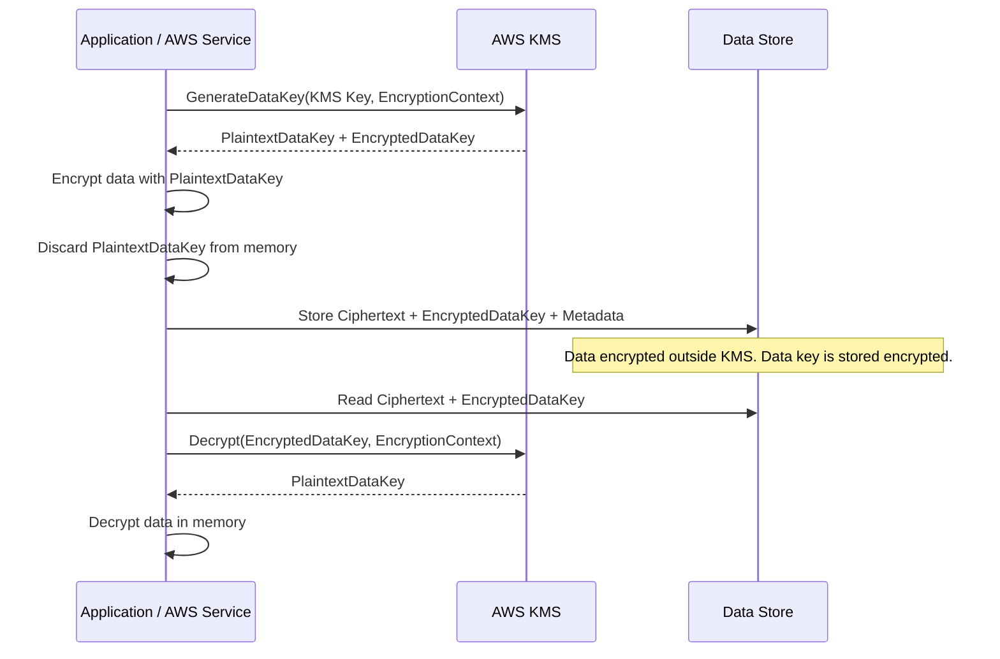
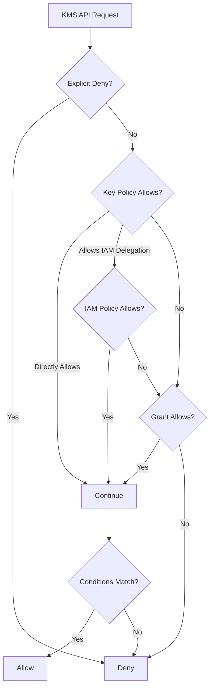
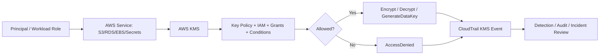
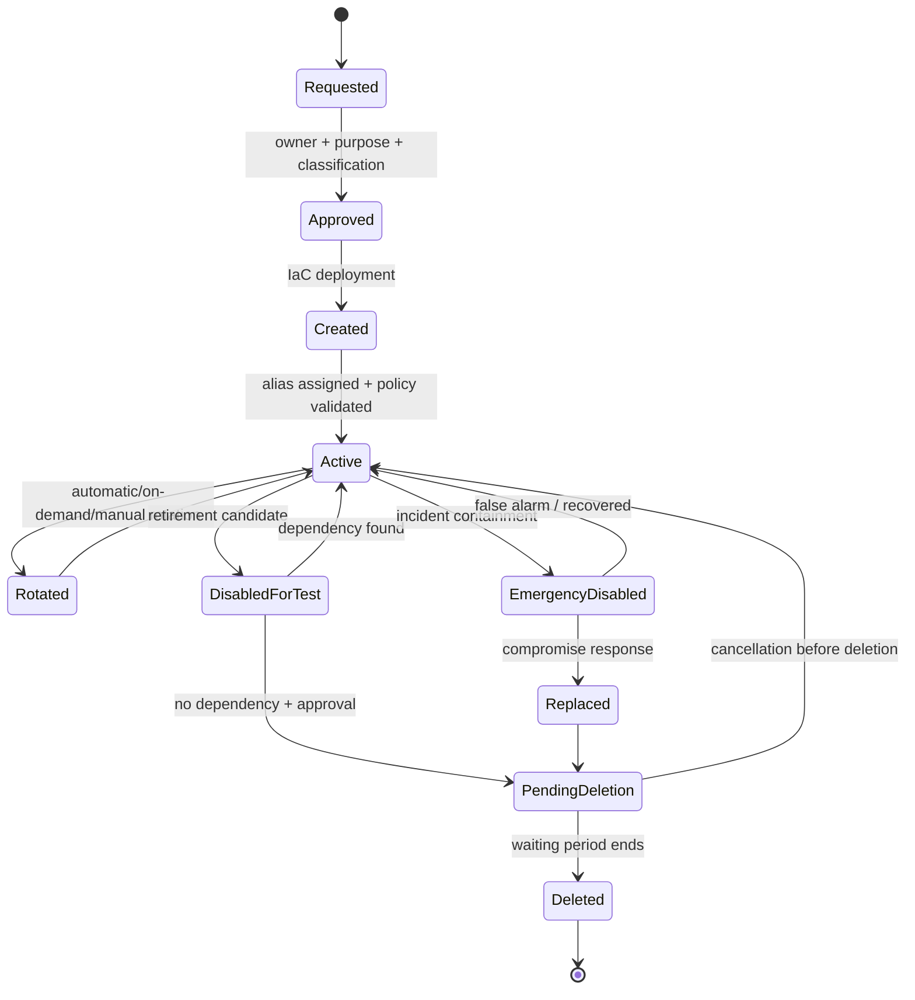

# Part 036 — AWS KMS Deep Dive

## Tujuan Part Ini

AWS KMS sering dipahami terlalu sempit:

> “KMS dipakai untuk encryption.”

Benar, tetapi tidak cukup.

Dalam production AWS, AWS KMS adalah **cryptographic authorization and audit boundary**.

KMS menentukan:

- siapa bisa memakai key,
- service mana bisa encrypt/decrypt,
- account mana boleh cross-account decrypt,
- data class mana memakai key mana,
- kapan decrypt terjadi,
- konteks apa yang harus menyertai decrypt,
- apakah key bisa dinonaktifkan saat incident,
- apakah ciphertext lama masih bisa dibuka setelah rotation,
- apakah backup masih bisa direstore 5 tahun lagi,
- apakah auditor bisa melihat bukti penggunaan key.

Mental model:

```text
AWS KMS is not just encryption.
It is a managed control plane for cryptographic keys, key usage authorization, and key usage evidence.
```

AWS KMS adalah managed service untuk membuat dan mengontrol key yang digunakan untuk encrypt, decrypt, sign, verify, generate data keys, dan cryptographic operations lain. KMS keys yang dibuat di AWS KMS dilindungi oleh AWS-managed HSM dan key material tidak keluar dari KMS dalam bentuk plaintext.

---

## 1. Apa yang Dilindungi KMS?

KMS tidak secara ajaib membuat semua data aman.

KMS membantu melindungi **key material** dan mengontrol operasi cryptographic terhadap key tersebut.

Ada tiga hal berbeda:

| Layer | Contoh | Siapa Mengelola |
|---|---|---|
| Data | Object S3, row database, EBS block, secret value | Service/application |
| Data key | Symmetric key untuk encrypt data secara langsung | Service/application, sering generated by KMS |
| KMS key | Long-term key yang melindungi data key atau melakukan crypto operation | AWS KMS + customer policy |

KMS key biasanya tidak mengenkripsi data besar secara langsung. Untuk banyak use case, yang terjadi adalah **envelope encryption**.

---

## 2. Envelope Encryption dari Prinsip Dasar

Jika data besar dienkripsi langsung oleh satu master key, banyak masalah muncul:

- performa buruk,
- blast radius besar,
- key rotation sulit,
- audit kurang granular,
- aplikasi harus memegang key jangka panjang.

Envelope encryption memecah masalah itu.



Dalam model ini:

- KMS key melindungi data key.
- Data key mengenkripsi data.
- Encrypted data key dapat disimpan bersama ciphertext.
- Plaintext data key hanya digunakan sementara.
- KMS dapat mengaudit `GenerateDataKey` dan `Decrypt`.

Implikasi penting:

```text
Whoever can call Decrypt on the encrypted data key can potentially read the protected data.
```

Jadi KMS permission adalah data access permission, bukan sekadar infra permission.

---

## 3. Jenis KMS Key

### 3.1 AWS Owned Keys

AWS owned keys dibuat, dimiliki, dan dikelola oleh AWS untuk digunakan beberapa AWS services. Anda tidak melihat, mengelola, atau mengaudit policy key ini secara langsung.

Cocok untuk:

- default encryption sederhana,
- data rendah sensitivitas,
- workload yang tidak butuh customer control atas key lifecycle.

Tidak cocok jika Anda butuh:

- key usage audit detail,
- customer-controlled key policy,
- separation of duties,
- disable key sebagai containment,
- cross-account policy control.

### 3.2 AWS Managed Keys

AWS managed keys berada di account Anda, dibuat/dikelola oleh AWS service untuk service tertentu. Alias biasanya seperti:

```text
aws/s3
aws/ebs
aws/rds
aws/secretsmanager
```

Anda dapat melihatnya, tetapi kontrol policy dan rotation-nya terbatas dibanding customer managed key.

Cocok untuk:

- default service encryption,
- medium sensitivity,
- operational simplicity.

### 3.3 Customer Managed Keys

Customer managed key adalah KMS key yang Anda buat, miliki, dan kelola di AWS account Anda.

Anda mengontrol:

- key policy,
- IAM integration,
- grants,
- aliases,
- tags,
- enable/disable,
- rotation,
- deletion scheduling,
- cross-account access,
- multi-Region configuration,
- imported/external key material options tertentu.

Gunakan customer managed key jika Anda butuh control dan auditability lebih tinggi.

Tetapi ingat:

```text
Customer managed keys increase governance power and operational responsibility.
```

Key yang salah policy bisa membuka data. Key yang salah delete bisa membuat data tidak bisa didekripsi.

### 3.4 Symmetric Encryption Keys

Ini key paling umum di KMS.

Dipakai untuk:

- encrypt/decrypt,
- generate data key,
- envelope encryption,
- service-integrated encryption.

Mayoritas AWS service integrations memakai symmetric KMS key.

### 3.5 Asymmetric Keys

Asymmetric KMS key memiliki public/private key pair.

Use case:

- signing,
- signature verification,
- asymmetric encryption/decryption,
- public key dapat digunakan di luar KMS untuk encrypt/verify tergantung key spec dan usage.

Gunakan hanya jika benar-benar butuh asymmetric cryptography. Jangan memakai asymmetric key untuk sekadar “lebih aman”. Ia punya operasi, algoritma, dan integrasi berbeda.

### 3.6 HMAC Keys

HMAC KMS key digunakan untuk generate dan verify message authentication code.

Use case:

- integrity/authenticity check,
- token/message validation pattern tertentu,
- sistem yang perlu MAC tanpa mengekspor key material.

### 3.7 Multi-Region Keys

Multi-Region key adalah set KMS keys dengan key ID dan key material yang sama di beberapa Region. Related multi-Region keys interoperable: ciphertext yang dibuat dengan satu related key bisa didekripsi oleh related key di Region lain.

Use case:

- disaster recovery,
- active-active multi-region application,
- global data processing,
- backup restore lintas Region.

Tetapi security property-nya berbeda dari single-Region key. Jika key material tersedia di lebih dari satu Region, blast radius dan authorization model harus dipikirkan lintas Region.

### 3.8 Custom Key Store dan External Key Store

Untuk requirement khusus, KMS mendukung model seperti custom key store berbasis CloudHSM dan external key store. Ini relevan untuk organisasi dengan requirement control atas key material yang lebih ketat.

Namun jangan memakainya hanya karena terdengar enterprise.

Tanyakan:

- Apakah requirement compliance benar-benar memerlukan ini?
- Siapa yang mengoperasikan HSM/external key manager?
- Apa failure mode jika external key manager unavailable?
- Bagaimana latency dan availability impact?
- Bagaimana incident recovery?

Default yang baik untuk banyak workload: customer managed KMS key dengan policy kuat, bukan external key store.

---

## 4. KMS Key Anatomy

Sebuah customer managed KMS key memiliki beberapa elemen:

| Elemen | Fungsi |
|---|---|
| Key ID | Identifier unik key |
| ARN | Identifier lintas AWS |
| Alias | Nama manusiawi dan stable pointer |
| Key policy | Resource policy utama untuk key |
| Key spec | Symmetric/asymmetric/HMAC dan algoritma terkait |
| Key usage | Encrypt/decrypt, sign/verify, generate/verify MAC |
| Origin | AWS_KMS, imported, CloudHSM, external key store |
| Tags | Owner, classification, environment, purpose |
| State | Enabled, disabled, pending deletion, pending import, dll |
| Rotation setting | Automatic/on-demand/manual strategy |
| Grants | Delegated permissions, sering untuk service integration |

Alias penting karena aplikasi sebaiknya tidak hard-code raw key ID kecuali ada alasan kuat.

Contoh alias:

```text
alias/prod/payments/restricted-data
alias/prod/log-archive/cloudtrail
alias/prod/security/secrets
alias/nonprod/platform/default
```

Alias bisa dipindahkan ke key lain untuk manual rotation pattern, tetapi perubahan alias tidak otomatis re-encrypt data lama.

---

## 5. Key Policy adalah Control Utama

KMS berbeda dari banyak AWS resource lain.

Untuk KMS key, **key policy adalah primary access control**.

Setiap KMS key memiliki tepat satu key policy. IAM policy dapat memberi akses ke KMS key hanya jika key policy memungkinkan account/IAM untuk melakukan itu.

Mental model:

```text
IAM alone is not enough for KMS.
The key policy must allow the access path directly or allow IAM in the account to delegate it.
```

### 5.1 Key Administrator vs Key User

Pisahkan:

| Role | Boleh | Tidak Boleh |
|---|---|---|
| Key administrator | Manage key policy, alias, rotation, tags | Decrypt data kecuali eksplisit perlu |
| Key user | Encrypt/decrypt/generate data key | Mengubah key policy atau schedule deletion |
| Auditor | Describe/List/View CloudTrail evidence | Decrypt |
| Automation role | Create/update keys sesuai pipeline | Broad decrypt |

Jangan memberi admin key permission yang otomatis bisa decrypt semua data kecuali memang dimaksudkan.

### 5.2 Dangerous Permissions

Perhatikan permission berikut:

```text
kms:PutKeyPolicy
kms:ScheduleKeyDeletion
kms:DisableKey
kms:CreateGrant
kms:Decrypt
kms:GenerateDataKey
kms:ReEncryptFrom
kms:ReEncryptTo
```

`kms:Decrypt` jelas sensitif.

Tetapi `kms:CreateGrant` juga sensitif karena dapat mendelegasikan penggunaan key.

`kms:PutKeyPolicy` sangat sensitif karena bisa membuka ulang seluruh key.

`kms:ScheduleKeyDeletion` berbahaya karena dapat membuat data tidak dapat dipulihkan setelah deletion final.

---

## 6. IAM Policy, Key Policy, Grants: Tiga Jalur Authorization

KMS authorization bisa datang dari kombinasi:

1. key policy,
2. IAM policy,
3. grants.



Diagram ini konseptual. Evaluasi nyata mengikuti policy evaluation AWS, tetapi model ini membantu debugging.

### 6.1 Key Policy

Key policy cocok untuk:

- root/account delegation,
- key admin role,
- service principal conditions,
- cross-account allow,
- break-glass constraints,
- explicit deny untuk dangerous path.

### 6.2 IAM Policy

IAM policy cocok untuk:

- memberi role aplikasi permission memakai key,
- membatasi action KMS,
- condition berdasarkan tag, alias, resource ARN, encryption context,
- permission boundary integration.

### 6.3 Grants

Grant adalah policy instrument yang memberi principal atau AWS service principal izin memakai KMS key untuk operasi tertentu. Grants sering digunakan oleh AWS services untuk temporary/delegated access tanpa mengubah key policy atau IAM policy.

Use case:

- EBS volume encryption,
- RDS snapshot/backup operation,
- AWS service workflow yang perlu memakai key atas nama Anda,
- temporary permission untuk job tertentu.

Grant harus dikelola karena grant yang terlalu luas bisa menjadi hidden access path.

Checklist grant:

- grantee principal spesifik,
- operation minimal,
- constraint bila mungkin,
- retirement/revocation path jelas,
- ListGrants dimonitor untuk key sensitif.

---

## 7. Encryption Context

Encryption context adalah key-value pair non-secret yang disertakan dalam operasi cryptographic untuk symmetric KMS keys.

Contoh:

```json
{
  "aws:s3:arn": "arn:aws:s3:::prod-payments-exports/2026/settlement.csv",
  "application": "payments",
  "data_classification": "Restricted",
  "tenant_id": "t-123"
}
```

Encryption context punya dua fungsi besar:

1. **Additional authenticated data**  
   Context menjadi bagian dari cryptographic binding. Decrypt harus memakai context yang sesuai.

2. **Authorization and audit context**  
   Policy bisa memakai condition terhadap encryption context, dan CloudTrail dapat menunjukkan context untuk investigation.

Jangan masukkan secret ke encryption context.

Encryption context bukan terenkripsi sebagai secret. Perlakukan sebagai metadata yang bisa muncul di audit/log.

### 7.1 Policy dengan Encryption Context

Conceptual policy condition:

```json
{
  "Condition": {
    "StringEquals": {
      "kms:EncryptionContext:application": "payments",
      "kms:EncryptionContext:data_classification": "Restricted"
    }
  }
}
```

Manfaat:

- mencegah key dipakai untuk data di luar konteks,
- meningkatkan auditability,
- membatasi confused usage,
- membantu forensic reconstruction.

Risiko:

- aplikasi harus konsisten menyertakan context,
- service integration punya context format sendiri,
- salah context bisa menyebabkan decrypt gagal.

---

## 8. Designing Key Boundaries

Pertanyaan utama:

```text
How many KMS keys should we create, and where should each key live?
```

Jawaban buruk:

```text
One key for everything.
```

Jawaban buruk lain:

```text
One key per resource, always.
```

Desain yang matang menggunakan boundary bermakna.

### 8.1 Boundary Berdasarkan Environment

Minimal pisahkan:

- prod,
- non-prod,
- sandbox,
- security tooling,
- log archive,
- backup.

Prod dan non-prod tidak boleh berbagi key untuk sensitive data.

### 8.2 Boundary Berdasarkan Application

Gunakan jika:

- aplikasi punya owner berbeda,
- blast radius perlu dipisah,
- akses decrypt berbeda,
- incident containment berbeda.

Contoh:

```text
alias/prod/payments/data
alias/prod/onboarding/data
alias/prod/support/data
```

### 8.3 Boundary Berdasarkan Data Class

Gunakan jika data classification mengubah kontrol.

Contoh:

```text
alias/prod/payments/internal
alias/prod/payments/restricted
alias/prod/payments/secrets
```

Tetapi jangan membuat terlalu banyak key sehingga operasi tidak sanggup mengelolanya.

### 8.4 Boundary Berdasarkan Regulatory Domain

Gunakan jika ada aturan khusus:

- PCI,
- healthcare,
- financial record,
- government data,
- regional residency.

### 8.5 Boundary Berdasarkan Account

Sering kali key sebaiknya berada di account yang memiliki data.

Keuntungan:

- blast radius mengikuti account,
- ownership jelas,
- CloudTrail key usage lokal,
- SCP/account lifecycle lebih mudah.

Centralized key account bisa berguna untuk kasus tertentu, tetapi dapat menciptakan coupling, cross-account complexity, dan availability/permission bottleneck.

Rule praktis:

```text
Default to workload-owned keys for workload-owned data.
Centralize only when the governance reason is stronger than the coupling cost.
```

---

## 9. KMS untuk AWS Services

### 9.1 S3

S3 mendukung server-side encryption dengan S3-managed keys, KMS keys, dan mode lain tergantung requirement.

Jika memakai SSE-KMS:

- S3 memanggil KMS atas nama request,
- principal butuh permission S3 dan KMS yang sesuai,
- bucket policy dapat require encryption,
- KMS key policy harus memungkinkan service/principal path,
- CloudTrail dapat menunjukkan KMS usage.

Failure mode:

```text
User has s3:GetObject but lacks kms:Decrypt, so object read fails.
```

Ini bukan bug. Ini defense-in-depth.

### 9.2 EBS

EBS encryption memakai KMS. EC2/EBS dapat membuat grants untuk memakai key saat attach/volume operations.

Failure mode:

```text
Instance cannot start because role/service path cannot use the KMS key for encrypted volume.
```

Pastikan launch template, AMI, snapshot, Auto Scaling, dan key policy selaras.

### 9.3 RDS / Aurora

RDS encryption harus dipilih saat create untuk banyak engine/configuration. Snapshot, backup, replica, dan cross-region copy melibatkan KMS.

Failure mode:

```text
Cross-account snapshot copy gagal karena destination account/key policy tidak benar.
```

### 9.4 DynamoDB

DynamoDB encryption terintegrasi dengan KMS. Customer managed key memberi kontrol lebih, tetapi perhatikan availability dan permission impact.

### 9.5 Secrets Manager

Secrets Manager memakai envelope encryption dengan KMS. Jika memakai customer managed key, principal yang membaca secret juga perlu access path KMS yang sesuai.

Failure mode:

```text
Role has secretsmanager:GetSecretValue but not kms:Decrypt.
```

### 9.6 CloudWatch Logs

Log group dapat diasosiasikan dengan KMS key untuk encryption. Untuk log sensitif, ini membantu separation dan audit, tetapi policy key harus memungkinkan CloudWatch Logs service principal di Region terkait.

### 9.7 Lambda

Lambda dapat memakai KMS untuk environment variables dan integrations tertentu. Perhatikan bahwa secret sebaiknya tetap di Secrets Manager/Parameter Store, bukan sekadar env var terenkripsi.

---

## 10. Cross-Account KMS Access

Cross-account KMS access butuh dua sisi:

1. key policy di account pemilik key mengizinkan external account/principal,
2. IAM policy di external account mengizinkan principal memakai key.

Jika salah satu tidak ada, akses gagal.

Contoh use case:

- centralized log archive bucket memakai key di log archive account,
- workload account menulis encrypted logs ke central bucket,
- analytics account membaca data dari data owner account,
- backup copy lintas account,
- security tooling membaca encrypted evidence.

Prinsip:

```text
Cross-account decrypt is cross-account data access.
Treat it as data sharing, not infrastructure plumbing.
```

Checklist cross-account:

- external principal spesifik,
- action minimal,
- encryption context condition bila mungkin,
- source account/source ARN condition untuk service integration bila didukung,
- CloudTrail monitored in both accounts,
- owner approval,
- expiry/periodic review.

---

## 11. Rotation Strategy

Rotation sering disalahpahami.

Ada dua jenis besar:

### 11.1 Automatic / On-Demand Rotation of Key Material

Untuk customer managed KMS keys yang mendukung rotation, AWS KMS dapat membuat cryptographic material baru untuk KMS key yang sama.

Implikasi:

- key ID/ARN tetap,
- alias tetap,
- aplikasi tidak perlu berubah,
- data lama tetap bisa didekripsi karena KMS menyimpan old key material untuk decrypt,
- data lama tidak otomatis re-encrypted.

Ini bagus untuk hygiene cryptographic tanpa migration besar.

### 11.2 Manual Rotation by Creating a New Key

Pattern:

1. create new KMS key,
2. update alias/config aplikasi,
3. new writes memakai key baru,
4. old data tetap butuh key lama sampai re-encrypted/deleted,
5. migrate/re-encrypt data jika diperlukan,
6. retire old key setelah aman.

Manual rotation diperlukan jika:

- key type tidak mendukung automatic rotation,
- ingin mengubah key policy boundary,
- ingin memindahkan account/Region/key origin,
- perlu crypto-separation baru setelah incident.

### 11.3 Rotation Bukan Pengganti Incident Response

Jika plaintext data key atau application credential bocor, key rotation mungkin tidak cukup.

Tanyakan:

- ciphertext mana yang terpapar?
- apakah attacker punya `kms:Decrypt`?
- apakah attacker punya data key plaintext?
- apakah logs menunjukkan decrypt abuse?
- apakah perlu disable key sementara?
- apakah perlu re-encrypt data?
- apakah downstream copies juga terdampak?

---

## 12. Disable, Delete, dan Recovery Risk

### 12.1 Disable Key

Disable key adalah containment tool.

Dampak:

- encrypt/decrypt dengan key gagal,
- aplikasi bisa down,
- restore bisa gagal,
- dependent services bisa error.

Gunakan saat:

- suspected key misuse,
- emergency containment,
- testing dependency mapping sebelum deletion,
- planned decommission.

### 12.2 Schedule Key Deletion

Key deletion berbahaya.

AWS KMS menggunakan waiting period sebelum deletion final. Setelah key dihapus, data yang hanya bisa didekripsi dengan key itu tidak dapat dipulihkan.

Safe deletion workflow:

1. inventory semua resource yang memakai key,
2. disable key sementara,
3. monitor error/decrypt attempts,
4. pastikan backup/archives tidak membutuhkan key,
5. pastikan legal retention selesai,
6. schedule deletion,
7. document approval,
8. keep evidence.

Invariant:

```text
Never schedule deletion for a KMS key unless encrypted data dependency has been proven retired, re-encrypted, or intentionally destroyed.
```

---

## 13. KMS Auditing with CloudTrail

KMS API calls dicatat di CloudTrail.

Event penting:

- `CreateKey`,
- `PutKeyPolicy`,
- `ScheduleKeyDeletion`,
- `DisableKey`,
- `EnableKey`,
- `CreateGrant`,
- `RetireGrant`,
- `RevokeGrant`,
- `Encrypt`,
- `Decrypt`,
- `GenerateDataKey`,
- `ReEncrypt`,
- `RotateKeyOnDemand` / rotation-related operations where applicable.

Untuk key sensitif, buat detection:

```text
Alert if kms:Decrypt spikes unexpectedly.
Alert if kms:Decrypt called by human role outside break-glass workflow.
Alert if PutKeyPolicy occurs outside pipeline.
Alert if ScheduleKeyDeletion occurs.
Alert if DisableKey occurs.
Alert if CreateGrant occurs for unrecognized grantee.
Alert if cross-account principal uses restricted key unexpectedly.
```

CloudTrail event harus dikorelasikan dengan:

- IAM role session,
- source IP/VPC endpoint,
- encryption context,
- resource owner,
- data classification,
- deployment window,
- incident ticket.

---

## 14. KMS and Incident Response

Saat ada dugaan data exposure, KMS membantu menjawab:

1. Siapa punya `kms:Decrypt`?
2. Siapa benar-benar melakukan `Decrypt`?
3. Dari account/role/session mana?
4. Dengan encryption context apa?
5. Untuk key mana?
6. Apakah ada policy/grant change sebelum kejadian?
7. Apakah key dipakai oleh service normal atau principal abnormal?
8. Apakah perlu disable key?
9. Apa impact jika key disabled?
10. Apakah data perlu re-encrypted?

### 14.1 Containment Decision

Disable key adalah langkah keras.

Gunakan decision table:

| Kondisi | Aksi Awal |
|---|---|
| Suspicious human decrypt on restricted key | Revoke session/access, investigate CloudTrail, consider temporary deny |
| Key policy modified unexpectedly | Roll back policy, alert owner, inspect grants |
| Massive decrypt spike from workload role | Isolate workload role, inspect app compromise |
| Key material concern for imported/external key | Follow key-origin specific response |
| Confirmed broad data compromise | Disable key only if impact understood, plan outage/recovery |

Jangan disable production key tanpa dependency map kecuali risiko aktif lebih besar daripada outage.

---

## 15. KMS Performance, Cost, dan Quota

KMS adalah managed service, tetapi tetap punya quota dan cost consideration.

Masalah umum:

- aplikasi memanggil KMS untuk setiap record kecil,
- high-volume encryption tanpa data key caching,
- burst decrypt saat batch job,
- retry storm saat KMS throttling,
- global service dependency saat regional design tidak matang.

Pattern:

- gunakan envelope encryption,
- gunakan AWS Encryption SDK/data key caching jika sesuai dan aman,
- batch operations bila memungkinkan,
- monitor KMS errors/throttles,
- design fallback yang tidak menurunkan security,
- jangan log plaintext saat decrypt gagal.

Trade-off data key caching:

| Benefit | Risk |
|---|---|
| Mengurangi KMS calls | Plaintext data key hidup lebih lama di memory/cache |
| Mengurangi latency | Compromise window bertambah |
| Mengurangi cost | Perlu cache policy yang aman |

Untuk data class tinggi, caching harus sangat hati-hati.

---

## 16. KMS Policy Design Smells

### 16.1 Wildcard Principal

```json
"Principal": "*"
```

Bisa valid hanya jika condition sangat ketat dan use case jelas. Jika tidak, ini smell besar.

### 16.2 Broad Admin Equals Broad Decrypt

Admin key tidak seharusnya otomatis bisa decrypt.

Pisahkan:

- management permission,
- usage permission.

### 16.3 No Owner Tag

Key tanpa owner akan menjadi zombie.

Wajib:

```text
Owner, System, Environment, DataClassification, Purpose, RotationStrategy
```

### 16.4 Key Shared Across Unrelated Systems

Satu key untuk semua workload membuat blast radius besar dan audit kabur.

### 16.5 No Deletion Protection Workflow

Jika siapa pun bisa `ScheduleKeyDeletion`, Anda punya availability risk besar.

### 16.6 No Grant Monitoring

AWS services sering memakai grants. Itu normal. Tetapi pada key sensitif, grant yang tidak dikenal harus terlihat.

### 16.7 Encryption Context Ignored

Tanpa encryption context, decrypt audit kehilangan konteks bisnis.

### 16.8 Key Policy Edited Manually

Manual console edits terhadap key policy sensitif harus dianggap high-risk change.

---

## 17. Example Key Strategy by Data Class

| Data Class | Suggested Key Strategy | Notes |
|---|---|---|
| Public | AWS owned/managed often enough | Focus integrity/availability |
| Internal | AWS managed or shared app CMK | Simplicity usually wins |
| Confidential | App/env customer managed key | Owner and audit needed |
| Restricted | Dedicated CMK per app/domain/class | Strong policy, monitoring, data events |
| Secret | Secrets-specific CMK or specialized store | No broad decrypt, rotation, alerting |

Jangan memakai tabel ini secara buta. Gunakan sebagai starting point untuk threat model.

---

## 18. Example Production Key Layout

```text
Security Tooling Account
  alias/prod/security/securityhub-findings
  alias/prod/security/automation-secrets

Log Archive Account
  alias/prod/log-archive/cloudtrail
  alias/prod/log-archive/config
  alias/prod/log-archive/vpc-flow-logs

Payments Prod Account
  alias/prod/payments/rds-restricted
  alias/prod/payments/s3-settlement-restricted
  alias/prod/payments/secrets

Platform Prod Account
  alias/prod/platform/cloudwatch-logs
  alias/prod/platform/shared-internal

Backup Account
  alias/prod/backup/restricted-vault
```

Perhatikan bahwa layout mengikuti:

- account boundary,
- data class,
- purpose,
- owner,
- restore/investigation path.

---

## 19. Mermaid — KMS Usage in Service-Integrated Encryption



Service-integrated encryption tetap membutuhkan authorization path yang benar. Jika S3/RDS/EBS/Secrets gagal decrypt, sering penyebabnya ada di KMS key policy, grant, atau IAM.

---

## 20. Practical Debugging: AccessDenied KMS

Saat melihat error KMS, jangan langsung menambah wildcard permission.

Gunakan urutan berikut:

1. Key ARN mana yang dipakai?
2. Principal mana yang memanggil?
3. Apakah caller role benar?
4. Apakah request via AWS service?
5. Apakah key policy mengizinkan principal/account/service?
6. Apakah IAM policy caller mengizinkan action?
7. Apakah permission boundary/SCP/RCP menolak?
8. Apakah grant diperlukan?
9. Apakah encryption context cocok?
10. Apakah key enabled?
11. Apakah key ada di Region yang benar?
12. Apakah ciphertext dibuat oleh related multi-Region key atau key lain?
13. Apakah alias menunjuk key yang diharapkan?
14. Apakah CloudTrail menunjukkan explicit deny atau missing allow?

Anti-fix:

```json
{
  "Action": "kms:*",
  "Resource": "*",
  "Effect": "Allow"
}
```

Ini bukan debugging. Ini membuat breach surface.

---

## 21. KMS as Code

KMS key harus dibuat dan dikelola dengan IaC untuk environment production.

Minimal module interface:

```hcl
module "payments_restricted_key" {
  source = "../modules/kms-key"

  alias               = "alias/prod/payments/restricted"
  owner               = "payments-platform"
  data_classification = "Restricted"
  environment         = "prod"
  key_admin_roles     = ["arn:aws:iam::111122223333:role/security-key-admin"]
  key_user_roles      = ["arn:aws:iam::111122223333:role/payments-api"]
  audit_roles         = ["arn:aws:iam::444455556666:role/security-auditor"]
  rotation_enabled    = true
  deletion_protection = true
}
```

Module harus menghasilkan:

- key,
- alias,
- key policy,
- tags,
- rotation setting,
- deletion guardrail,
- CloudWatch/EventBridge alert hooks,
- Config expectations if applicable.

Manual key creation akan membuat policy drift.

---

## 22. Key Lifecycle State Machine



Key lifecycle harus mengikuti data lifecycle.

Jika data masih harus direstore, key masih harus hidup.

---

## 23. Production Readiness Checklist

Untuk setiap customer managed KMS key:

- [ ] Purpose jelas.
- [ ] Data classification jelas.
- [ ] Owner jelas.
- [ ] Environment jelas.
- [ ] Key admin dan key user dipisahkan.
- [ ] Key policy dikelola via IaC.
- [ ] Broad wildcard principal tidak ada kecuali justified.
- [ ] `kms:Decrypt` hanya untuk role yang benar-benar perlu.
- [ ] `kms:CreateGrant` dibatasi.
- [ ] `kms:PutKeyPolicy` sangat terbatas.
- [ ] `kms:ScheduleKeyDeletion` dilindungi.
- [ ] Rotation strategy jelas.
- [ ] Deletion workflow jelas.
- [ ] CloudTrail monitoring tersedia.
- [ ] Alert untuk policy/grant/deletion/disable changes.
- [ ] Cross-account access terdokumentasi.
- [ ] Encryption context digunakan bila relevan.
- [ ] Backup/restore dependency dipahami.
- [ ] Quota/cost/performance risk dipahami.

---

## 24. Engineering Invariants

Gunakan invariant berikut:

```text
No customer managed key without owner and purpose.
No key policy managed only by console for production.
No key admin automatically gets decrypt unless intended.
No restricted data key without CloudTrail monitoring.
No broad cross-account decrypt without owner approval.
No ScheduleKeyDeletion without dependency proof.
No manual alias switch without rollout plan.
No secret value in encryption context.
No production sensitive data encrypted with non-prod key.
No backup encrypted with a key whose lifecycle is shorter than backup retention.
```

---

## 25. Kesimpulan

AWS KMS adalah salah satu control plane paling penting di AWS security.

Ia bukan sekadar “centang encryption”. Ia adalah sistem untuk:

- mengontrol cryptographic key,
- menentukan siapa boleh decrypt,
- membangun boundary antar application/account/environment,
- menyediakan audit trail key usage,
- mendukung incident containment,
- mengikat encryption ke classification dan ownership.

KMS yang baik membuat data protection kuat dan dapat diaudit.

KMS yang buruk memberi rasa aman palsu: data “terenkripsi”, tetapi decrypt permission terlalu luas, key policy liar, grant tidak dimonitor, dan backup tidak bisa direstore karena key lifecycle salah.

Part berikutnya akan masuk ke **KMS Policy Design Patterns**: bagaimana menulis key policy yang defensible untuk admin/user separation, service integration, cross-account decrypt, log archive, backup, Secrets Manager, S3, dan restricted data boundary.

---

## Referensi Resmi

- AWS KMS overview: https://docs.aws.amazon.com/kms/latest/developerguide/overview.html
- AWS KMS concepts: https://docs.aws.amazon.com/kms/latest/developerguide/concepts.html
- AWS KMS cryptography essentials: https://docs.aws.amazon.com/kms/latest/developerguide/kms-cryptography.html
- Generate data keys: https://docs.aws.amazon.com/kms/latest/developerguide/data-keys.html
- Key policies in AWS KMS: https://docs.aws.amazon.com/kms/latest/developerguide/key-policies.html
- KMS key access and permissions: https://docs.aws.amazon.com/kms/latest/developerguide/control-access.html
- Grants in AWS KMS: https://docs.aws.amazon.com/kms/latest/developerguide/grants.html
- Best practices for AWS KMS grants: https://docs.aws.amazon.com/kms/latest/developerguide/grant-best-practices.html
- Encryption context: https://docs.aws.amazon.com/kms/latest/developerguide/encrypt_context.html
- Rotate AWS KMS keys: https://docs.aws.amazon.com/kms/latest/developerguide/rotate-keys.html
- Multi-Region keys: https://docs.aws.amazon.com/kms/latest/developerguide/multi-region-keys-overview.html
- Control access to multi-Region keys: https://docs.aws.amazon.com/kms/latest/developerguide/multi-region-keys-auth.html
- Data protection in AWS KMS: https://docs.aws.amazon.com/kms/latest/developerguide/data-protection.html
