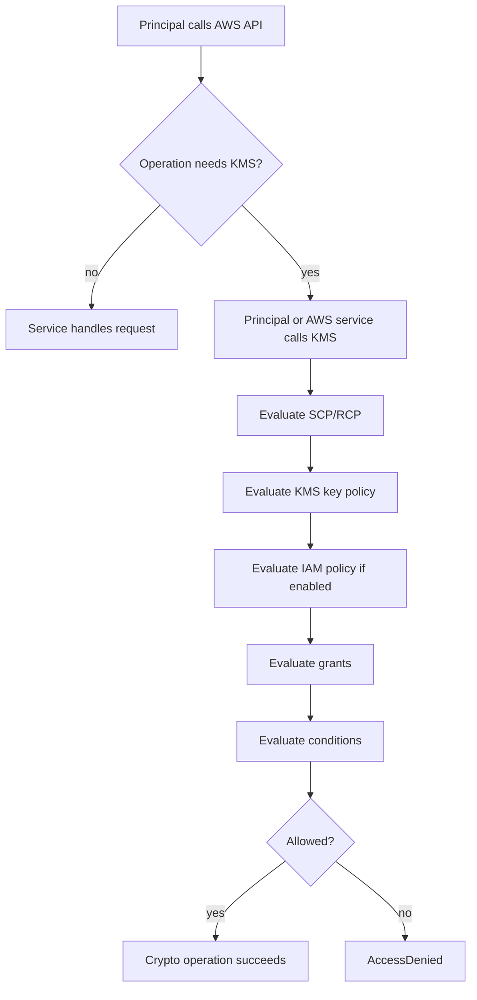
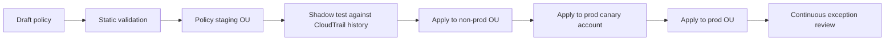
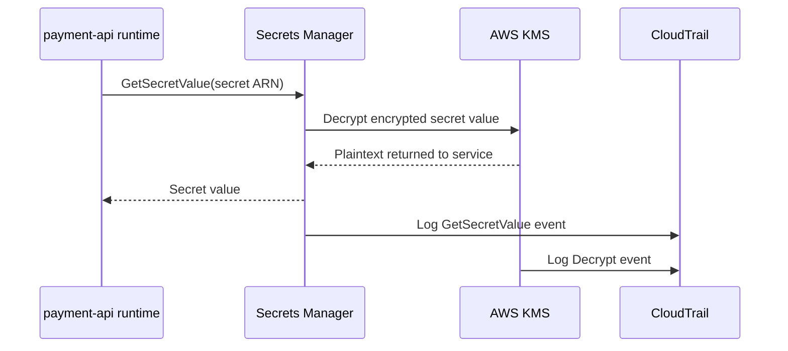
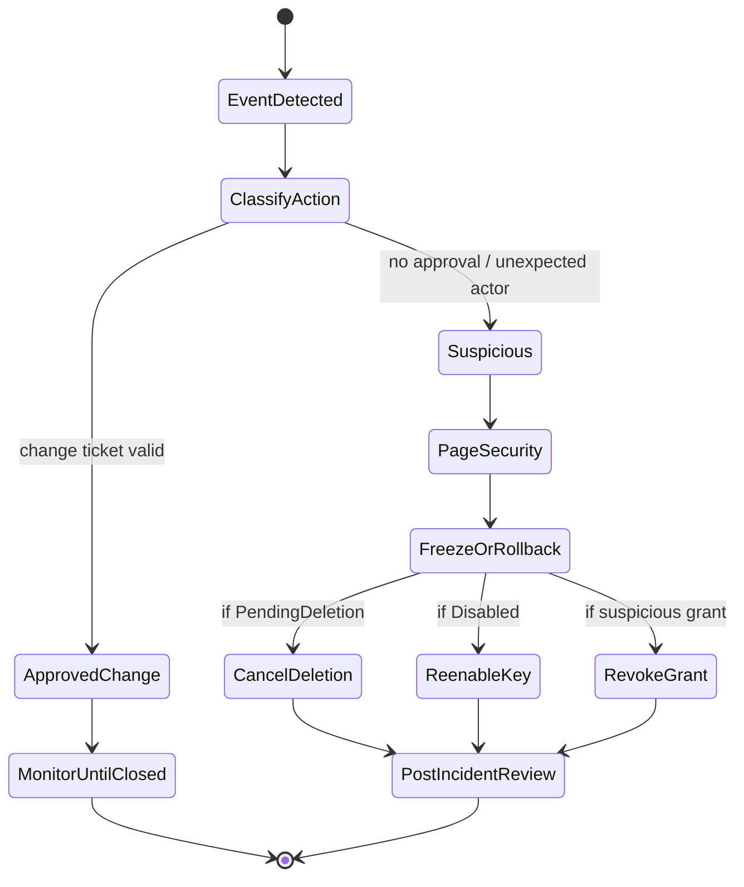

# Part 037 — KMS Policy Design Patterns

KMS sering disalahpahami sebagai fitur enkripsi. Di production, KMS adalah **authorization boundary untuk operasi kriptografi**.

Sebuah KMS key menjawab pertanyaan konkret:

> Principal mana yang boleh membuat ciphertext menjadi plaintext, untuk data apa, lewat service apa, dalam konteks apa, dari account mana, dan bagaimana semua itu bisa diaudit?

Kalau jawabannya tidak jelas, sistem mungkin terlihat terenkripsi, tetapi belum tentu aman.

AWS KMS bukan hanya melindungi data. Ia mempertemukan ownership, separation of duty, audit evidence, dan blast-radius control.

---

## 1. Mental Model

KMS key punya dua sisi:

| Sisi | Makna |
|---|---|
| Cryptographic capability | Key dapat dipakai untuk `Encrypt`, `Decrypt`, `GenerateDataKey`, `ReEncrypt`, `Sign`, `Verify`, dan operasi lain sesuai key type. |
| Authorization surface | Key policy, IAM policy, grants, condition keys, encryption context, service integration, SCP/RCP menentukan siapa boleh memakai capability tersebut. |

Jangan mulai desain KMS dari pertanyaan:

> “Pakai AWS managed key atau customer managed key?”

Mulai dari:

> “Apa invariant akses plaintext untuk data ini?”

Contoh invariant:

```text
Hanya runtime role payment-api-prod yang boleh decrypt secret database payment.
Security admin boleh disable key saat incident, tetapi tidak boleh decrypt data aplikasi.
Application deployer boleh attach KMS key ke resource, tetapi tidak boleh membaca plaintext.
CloudTrail boleh encrypt log, tetapi workload account tidak boleh decrypt log archive.
Cross-account decrypt hanya boleh dari role tertentu dan hanya melalui service tertentu.
Key deletion harus mustahil dilakukan tanpa break-glass dan multi-person review.
```

---

## 2. Komponen Evaluasi Akses KMS

| Mekanisme | Peran | Catatan |
|---|---|---|
| Key policy | Resource policy utama untuk KMS key | Setiap KMS key wajib punya tepat satu key policy. |
| IAM policy | Memberi izin ke principal jika key policy mengizinkan IAM ikut menentukan akses | IAM saja tidak cukup jika key policy tidak membuka jalur. |
| Grants | Delegasi permission KMS, sering dipakai AWS services | Cocok untuk service-managed usage atau permission sementara. |
| Encryption context | Non-secret key-value context untuk authenticated encryption dan audit | Bisa dipakai dalam condition policy. |
| SCP/RCP | Guardrail organisasi | Tidak memberi izin, hanya membatasi izin maksimum. |
| Service integration | Cara S3, EBS, CloudTrail, Secrets Manager, dan service lain memakai KMS | Sering membutuhkan service principal, `kms:ViaService`, atau grants. |

Diagram evaluasi:



KMS access debugging sulit kalau hanya membaca IAM policy. Untuk KMS, key policy adalah pusat gravitasi.

---

## 3. Key Policy adalah Primary Control

AWS KMS key policy adalah resource policy untuk KMS key. Policy ini menentukan siapa yang dapat mengelola dan memakai key. IAM policy dan grants dapat membantu, tetapi key policy tetap fundamental.

Default console policy biasanya punya statement seperti ini:

```json
{
  "Sid": "EnableIAMUserPermissions",
  "Effect": "Allow",
  "Principal": {
    "AWS": "arn:aws:iam::111122223333:root"
  },
  "Action": "kms:*",
  "Resource": "*"
}
```

Statement ini sering disalahpahami.

`arn:aws:iam::<account-id>:root` di key policy bukan berarti hanya root user manusia. Dalam konteks key policy, principal account ini memungkinkan IAM policies di account tersebut ikut mengatur akses ke key.

Artinya:

```text
Key policy membuka pintu agar IAM policy bisa berlaku.
IAM policy tetap harus memberi permission eksplisit.
Explicit deny tetap menang.
SCP tetap bisa membatasi principal di member account.
Untuk cross-account, account pemilik key dan account pemakai biasanya sama-sama perlu policy yang benar.
```

Production pattern yang defensible biasanya memecah akses menjadi:

1. key administration;
2. cryptographic usage;
3. grant management;
4. read-only audit metadata;
5. break-glass lifecycle control.

---

## 4. Pattern 1 — Pisahkan Key Administrator dan Key User

Kesalahan umum: satu role diberi `kms:*` karena “tim ini owner datanya”.

Itu berbahaya karena admin key dan reader plaintext adalah dua kemampuan yang berbeda.

| Capability | Contoh action | Risiko |
|---|---|---|
| Key administration | `kms:PutKeyPolicy`, `kms:ScheduleKeyDeletion`, `kms:DisableKey`, `kms:EnableKeyRotation` | Bisa merusak availability dan mengubah trust boundary. |
| Key usage | `kms:Decrypt`, `kms:GenerateDataKey`, `kms:Encrypt` | Bisa membaca atau memproses plaintext. |
| Grant management | `kms:CreateGrant`, `kms:RevokeGrant` | Bisa memberi akses tidak langsung ke service/principal. |
| Audit metadata | `kms:DescribeKey`, `kms:ListAliases`, `kms:GetKeyRotationStatus` | Perlu untuk observability, biasanya aman dengan scope terbatas. |

Baseline pattern:

```json
{
  "Version": "2012-10-17",
  "Statement": [
    {
      "Sid": "AllowSecurityKeyAdministratorsButNotCryptoUsage",
      "Effect": "Allow",
      "Principal": {
        "AWS": "arn:aws:iam::111122223333:role/security-kms-admin"
      },
      "Action": [
        "kms:CreateAlias",
        "kms:UpdateAlias",
        "kms:DeleteAlias",
        "kms:DescribeKey",
        "kms:EnableKeyRotation",
        "kms:GetKeyRotationStatus",
        "kms:PutKeyPolicy",
        "kms:TagResource",
        "kms:UntagResource"
      ],
      "Resource": "*"
    },
    {
      "Sid": "AllowApplicationRuntimeCryptoUsage",
      "Effect": "Allow",
      "Principal": {
        "AWS": "arn:aws:iam::111122223333:role/payment-api-prod-runtime"
      },
      "Action": [
        "kms:Decrypt",
        "kms:GenerateDataKey",
        "kms:Encrypt",
        "kms:ReEncryptFrom",
        "kms:ReEncryptTo"
      ],
      "Resource": "*"
    }
  ]
}
```

Policy ini belum final production policy. Ia belum membatasi service path, encryption context, atau deletion safety. Namun ia menegakkan invariant awal:

```text
Admin boleh mengelola lifecycle key.
Runtime boleh memakai key.
Admin tidak otomatis boleh decrypt.
Runtime tidak boleh mengubah key policy atau lifecycle key.
```

---

## 5. Pattern 2 — Deny Dangerous Administration by Default

Action ini jarang seharusnya terjadi di operasi harian:

```text
kms:ScheduleKeyDeletion
kms:DisableKey
kms:PutKeyPolicy
kms:CreateGrant
kms:ReplicateKey
kms:ImportKeyMaterial
kms:DeleteImportedKeyMaterial
```

Untuk key bernilai tinggi, action tersebut adalah **change with blast radius**.

Contoh SCP/IAM guardrail:

```json
{
  "Sid": "DenyKMSDestructiveActionsExceptBreakGlass",
  "Effect": "Deny",
  "Action": [
    "kms:ScheduleKeyDeletion",
    "kms:DisableKey",
    "kms:PutKeyPolicy",
    "kms:DeleteAlias",
    "kms:DeleteImportedKeyMaterial"
  ],
  "Resource": "*",
  "Condition": {
    "ArnNotLike": {
      "aws:PrincipalArn": "arn:aws:iam::*:role/break-glass-security-admin"
    }
  }
}
```

Rollout jangan langsung ke seluruh organization. Gunakan staging.



---

## 6. Pattern 3 — Batasi Pemakaian Key Lewat Service Tertentu

Banyak workload tidak perlu memanggil KMS langsung. Workload memakai S3, EBS, Secrets Manager, CloudTrail, RDS, atau service lain; service itulah yang memakai KMS di belakang layar.

Dalam kasus seperti ini, batasi KMS usage dengan `kms:ViaService`.

Intent:

```text
Role aplikasi boleh decrypt secret hanya jika request KMS datang melalui Secrets Manager di region yang benar.
```

Contoh:

```json
{
  "Sid": "AllowDecryptOnlyViaSecretsManager",
  "Effect": "Allow",
  "Principal": {
    "AWS": "arn:aws:iam::111122223333:role/payment-api-prod-runtime"
  },
  "Action": [
    "kms:Decrypt",
    "kms:DescribeKey"
  ],
  "Resource": "*",
  "Condition": {
    "StringEquals": {
      "kms:ViaService": "secretsmanager.ap-southeast-1.amazonaws.com"
    }
  }
}
```

Manfaat:

```text
Role tidak bisa memakai key untuk decrypt ciphertext arbitrary secara langsung.
Path akses plaintext lebih mudah diaudit.
Policy mengikuti arsitektur runtime, bukan memberi crypto privilege bebas.
Incident response lebih jelas karena akses bisa dicabut di service path tertentu.
```

Failure mode:

```text
Service integration tidak memakai kms:ViaService seperti asumsi awal.
Multi-region workload gagal karena condition hanya satu region.
Developer membuat fallback direct KMS decrypt dan gagal di production.
Policy terlalu ketat tanpa canary test.
```

---

## 7. Pattern 4 — Gunakan Encryption Context sebagai Data Boundary

Encryption context adalah key-value non-secret yang ikut dalam operasi KMS. Untuk symmetric encryption, context ini menjadi additional authenticated data. Jika context saat decrypt tidak cocok dengan context saat encrypt, decrypt gagal.

Secara security engineering, encryption context berguna untuk:

1. **authorization narrowing** — policy dapat mengizinkan decrypt hanya jika context tertentu hadir;
2. **audit enrichment** — CloudTrail event KMS dapat memuat context sehingga investigator tahu data boundary yang disentuh.

Intent:

```text
Runtime payment hanya boleh decrypt data dengan context domain=payment dan environment=prod.
```

Contoh condition:

```json
{
  "Sid": "AllowDecryptForPaymentProdContextOnly",
  "Effect": "Allow",
  "Principal": {
    "AWS": "arn:aws:iam::111122223333:role/payment-api-prod-runtime"
  },
  "Action": "kms:Decrypt",
  "Resource": "*",
  "Condition": {
    "StringEquals": {
      "kms:EncryptionContext:domain": "payment",
      "kms:EncryptionContext:environment": "prod"
    }
  }
}
```

Jangan masukkan secret ke encryption context. Context bukan tempat menyimpan password, token, PII, atau payload sensitif.

Good context:

```text
service=payment-api
environment=prod
data-classification=confidential
purpose=database-secret
```

Bad context:

```text
password=...
access-token=...
email=customer@example.com
credit-card=...
```

---

## 8. Pattern 5 — KMS untuk Secrets Manager

Secrets Manager mengenkripsi secret dengan KMS. KMS policy harus mendukung dua hal:

1. Secrets Manager service path dapat memakai key;
2. runtime role dapat membaca secret melalui Secrets Manager, bukan direct decrypt arbitrary ciphertext.

Flow:



Runtime IAM policy:

```json
{
  "Version": "2012-10-17",
  "Statement": [
    {
      "Sid": "ReadSpecificPaymentSecret",
      "Effect": "Allow",
      "Action": [
        "secretsmanager:GetSecretValue",
        "secretsmanager:DescribeSecret"
      ],
      "Resource": "arn:aws:secretsmanager:ap-southeast-1:111122223333:secret:/prod/payment/db-*"
    },
    {
      "Sid": "AllowKMSDecryptViaSecretsManagerOnly",
      "Effect": "Allow",
      "Action": "kms:Decrypt",
      "Resource": "arn:aws:kms:ap-southeast-1:111122223333:key/KEY_ID",
      "Condition": {
        "StringEquals": {
          "kms:ViaService": "secretsmanager.ap-southeast-1.amazonaws.com"
        }
      }
    }
  ]
}
```

Invariant:

```text
Aplikasi membaca secret melalui Secrets Manager.
KMS decrypt hanya sah jika lewat Secrets Manager.
Secret access dan KMS decrypt sama-sama masuk CloudTrail.
Human operator tidak otomatis bisa membaca secret hanya karena bisa deploy aplikasi.
```

---

## 9. Pattern 6 — KMS untuk S3 dengan Bucket Boundary

S3 SSE-KMS sering gagal bukan karena S3 policy, tetapi karena KMS key policy tidak sinkron.

Tiga policy harus sejajar:

1. IAM policy principal yang melakukan `s3:GetObject` atau `s3:PutObject`;
2. S3 bucket policy;
3. KMS key policy/IAM permission untuk `kms:Decrypt` atau `kms:GenerateDataKey`.

Invariant:

```text
Object hanya boleh ditulis jika memakai SSE-KMS key yang benar.
Object hanya boleh dibaca oleh role yang juga boleh decrypt dengan key tersebut.
Decrypt tidak boleh dipakai di luar path S3 yang sah.
```

Bucket policy untuk memaksa key tertentu:

```json
{
  "Sid": "DenyObjectUploadWithoutExpectedKMSKey",
  "Effect": "Deny",
  "Principal": "*",
  "Action": "s3:PutObject",
  "Resource": "arn:aws:s3:::prod-payment-evidence/*",
  "Condition": {
    "StringNotEquals": {
      "s3:x-amz-server-side-encryption": "aws:kms",
      "s3:x-amz-server-side-encryption-aws-kms-key-id": "arn:aws:kms:ap-southeast-1:111122223333:key/KEY_ID"
    }
  }
}
```

KMS usage via S3:

```json
{
  "Sid": "AllowUseOfKeyViaS3Only",
  "Effect": "Allow",
  "Principal": {
    "AWS": "arn:aws:iam::111122223333:role/evidence-writer"
  },
  "Action": [
    "kms:Encrypt",
    "kms:Decrypt",
    "kms:ReEncrypt*",
    "kms:GenerateDataKey*",
    "kms:DescribeKey"
  ],
  "Resource": "*",
  "Condition": {
    "StringEquals": {
      "kms:ViaService": "s3.ap-southeast-1.amazonaws.com"
    }
  }
}
```

Untuk log archive, writer dan reader biasanya dipisah lebih keras:

```text
Security services boleh write encrypted logs.
Investigator role boleh read dengan approval.
Application team tidak boleh decrypt log archive.
Key admin tidak otomatis boleh decrypt logs.
```

---

## 10. Pattern 7 — Cross-Account KMS Access

Cross-account KMS access membutuhkan dua sisi:

```text
Key policy di account pemilik key mengizinkan principal eksternal.
IAM policy di account principal mengizinkan action KMS terhadap key tersebut.
```

Misal:

```text
Key ada di security account 111122223333.
Workload role ada di workload account 444455556666.
Workload role perlu kms:Decrypt.
```

Key policy di security account:

```json
{
  "Sid": "AllowWorkloadAccountRoleToDecrypt",
  "Effect": "Allow",
  "Principal": {
    "AWS": "arn:aws:iam::444455556666:role/prod-payment-reader"
  },
  "Action": [
    "kms:Decrypt",
    "kms:DescribeKey"
  ],
  "Resource": "*",
  "Condition": {
    "StringEquals": {
      "kms:ViaService": "s3.ap-southeast-1.amazonaws.com"
    }
  }
}
```

IAM policy di workload account:

```json
{
  "Sid": "AllowDecryptUsingCentralEvidenceKey",
  "Effect": "Allow",
  "Action": [
    "kms:Decrypt",
    "kms:DescribeKey"
  ],
  "Resource": "arn:aws:kms:ap-southeast-1:111122223333:key/KEY_ID"
}
```

Common failure:

```text
Hanya menambah IAM policy di workload account, tetapi key policy di security account belum allow.
Key policy allow account root terlalu luas.
kms:ViaService salah region.
Principal ARN berubah karena role di-recreate oleh IaC.
SCP di workload account menolak KMS action.
KMS key disabled atau pending deletion.
Alias dipakai sebagai boundary, padahal alias bisa berubah.
```

Runbook debugging:

```text
1. Identify caller principal from CloudTrail.
2. Confirm requested KMS key ARN, not only alias.
3. Check caller IAM policy.
4. Check key policy in key-owning account.
5. Check grants.
6. Check SCP/RCP in both relevant accounts/OUs.
7. Check kms:ViaService region and service name.
8. Check encryption context condition.
9. Check key state.
10. Reproduce with minimal CLI call or service action.
```

---

## 11. Pattern 8 — Safe Grants for AWS Services

KMS grants adalah mekanisme untuk memberi permission terhadap KMS key, sering dipakai AWS services saat resource perlu memakai key. Grants dapat lebih dinamis daripada key policy.

Risikonya: `kms:CreateGrant` terlalu luas dapat menjadi jalur privilege expansion.

Guardrail umum:

```json
{
  "Sid": "AllowGrantCreationOnlyForAWSResources",
  "Effect": "Allow",
  "Action": [
    "kms:CreateGrant",
    "kms:ListGrants",
    "kms:RevokeGrant"
  ],
  "Resource": "arn:aws:kms:ap-southeast-1:111122223333:key/KEY_ID",
  "Condition": {
    "Bool": {
      "kms:GrantIsForAWSResource": "true"
    }
  }
}
```

Checklist grant governance:

```text
Siapa boleh create grant?
Apakah grant terbatas untuk AWS resource?
Apakah grant constraint memakai encryption context?
Apakah grant direvoke saat resource lifecycle selesai?
Apakah CloudTrail alert dibuat untuk CreateGrant, RetireGrant, RevokeGrant?
Apakah jumlah grants dimonitor untuk anomali?
```

---

## 12. Pattern 9 — Alias sebagai Stable Reference, Bukan Security Boundary

KMS alias berguna untuk mengurangi coupling ke key ID.

Contoh:

```text
alias/prod/payment/database-secret
alias/prod/log-archive/cloudtrail
alias/security/macie/classification
```

Namun alias bukan boundary keamanan yang kuat.

Risiko alias:

```text
Alias bisa diarahkan ke key lain oleh principal yang punya permission alias management.
Policy berbasis alias bisa sulit dipahami saat incident.
Data lama tetap terenkripsi dengan key lama.
Rotation manual via new key + alias switch perlu migrasi dan operational plan.
```

Gunakan alias untuk ergonomics. Gunakan key policy, IAM policy, encryption context, `kms:ViaService`, SCP, dan monitoring untuk security boundary.

---

## 13. Pattern 10 — Key per Data Boundary, Bukan Key per Resource Sembarangan

Terlalu sedikit key membuat blast radius terlalu besar. Terlalu banyak key membuat governance, quota, cost, dan debugging sulit.

Desain key berdasarkan boundary yang punya arti:

| Boundary | Kapan cocok |
|---|---|
| Per account + environment | Default baik untuk kebanyakan workload. |
| Per domain sensitif | Payment, identity, fraud, regulatory evidence. |
| Per data classification | Confidential, regulated, secret. |
| Per shared service | Log archive, backup vault, security tooling. |
| Per tenant | Hanya untuk tenant dengan isolation/compliance tinggi; mahal secara operasional. |
| Per resource | Jarang perlu kecuali ada requirement spesifik. |

Rule praktis:

```text
Buat key baru jika key lama tidak bisa mengekspresikan boundary akses, audit, lifecycle, atau compliance yang berbeda.
Jangan buat key baru hanya karena resource baru dibuat.
```

---

## 14. Pattern 11 — Deletion Safety dan Availability Protection

KMS key deletion berdampak besar. Jika key dihapus, data yang hanya bisa didecrypt dengan key itu bisa menjadi tidak dapat dipulihkan.

Production invariant:

```text
Tidak ada customer managed key production yang bisa masuk PendingDeletion tanpa approval, alert, dan rollback window.
```

Kontrol:

```text
Deny kms:ScheduleKeyDeletion kecuali break-glass role.
CloudTrail/EventBridge alert untuk ScheduleKeyDeletion, DisableKey, PutKeyPolicy.
AWS Config/custom rule untuk key state.
Backup metadata key/alias/policy.
Incident runbook untuk CancelKeyDeletion.
Pre-deletion dependency analysis.
```

EventBridge pattern:

```json
{
  "source": ["aws.kms"],
  "detail-type": ["AWS API Call via CloudTrail"],
  "detail": {
    "eventSource": ["kms.amazonaws.com"],
    "eventName": [
      "ScheduleKeyDeletion",
      "DisableKey",
      "PutKeyPolicy",
      "CreateGrant"
    ]
  }
}
```

Remediation flow:



---

## 15. Pattern 12 — Key Policy as Code

KMS policy tidak boleh diedit manual dari console tanpa jejak.

Minimum practice:

```text
Definisikan key, alias, policy, rotation, tags dalam IaC.
Simpan owner, data classification, environment, exception ID dalam tag.
Gunakan module standar untuk common patterns.
Validasi policy sebelum merge.
Deploy bertahap.
Audit drift.
```

Contoh module contract:

```yaml
key:
  name: prod-payment-secret
  alias: alias/prod/payment/secret
  owner: payment-platform
  environment: prod
  dataClassification: confidential
  administrators:
    - arn:aws:iam::111122223333:role/security-kms-admin
  users:
    - arn:aws:iam::111122223333:role/payment-api-prod-runtime
  allowedViaServices:
    - secretsmanager.ap-southeast-1.amazonaws.com
  allowDirectDecrypt: false
  deletion:
    allowScheduleDeletion: false
  rotation:
    enabled: true
```

Ini jauh lebih aman daripada setiap team menulis policy bebas.

---

## 16. Operational Query Pack

Pertanyaan yang harus bisa dijawab saat audit/incident:

```text
Siapa melakukan Decrypt terhadap key X dalam 24 jam terakhir?
Apakah ada Decrypt dari principal manusia?
Apakah ada Decrypt tanpa expected kms:ViaService?
Apakah ada CreateGrant yang tidak berasal dari expected AWS service?
Apakah ada PutKeyPolicy terhadap production key?
Apakah ada DisableKey/ScheduleKeyDeletion?
Apakah ada region tak biasa yang memakai key multi-region?
Apakah ada decrypt spike setelah deployment?
```

CloudTrail event untuk KMS harus masuk pipeline audit. Jangan hanya mengandalkan aplikasi log.

---

## 17. Common KMS AccessDenied Root Causes

| Symptom | Kemungkinan penyebab |
|---|---|
| IAM policy allow tetapi tetap AccessDenied | Key policy tidak mengizinkan principal/account. |
| S3 GetObject gagal untuk object SSE-KMS | Principal boleh `s3:GetObject`, tetapi tidak boleh `kms:Decrypt`. |
| Secrets Manager GetSecretValue gagal | Secret policy/IAM allow, tetapi KMS key policy atau `kms:ViaService` salah. |
| Cross-account decrypt gagal | Salah satu dari key policy atau caller IAM policy belum allow. |
| Hanya gagal di region tertentu | `kms:ViaService` hardcoded region atau key bukan multi-region. |
| Setelah IaC recreate role, akses gagal | Key policy menunjuk role ARN/principal lama. |
| Service gagal attach encrypted resource | Tidak boleh `kms:CreateGrant` atau grant condition terlalu ketat. |
| Incident response tidak bisa disable key | Break-glass role tidak punya key admin path. |

Untuk service-integrated use case, reproduksi lewat service path yang sama. Direct `aws kms decrypt` bisa gagal by design jika policy memakai `kms:ViaService`.

---

## 18. Anti-Patterns

### Satu key untuk seluruh production

Dampak:

```text
Blast radius decrypt terlalu besar.
Audit tidak jelas.
Exception sulit.
Rotation/deletion risk besar.
```

### Key admin juga secret reader

Dampak:

```text
Separation of duty hilang.
Audit finding sulit dijelaskan.
Insider risk meningkat.
```

### Wildcard principal di key policy

```json
"Principal": "*"
```

Kadang valid jika condition sangat ketat, tetapi salah condition dapat membuka akses luas.

### Membatasi resource data dengan `Resource` di key policy

Di key policy, `Resource` biasanya `"*"` karena policy melekat pada key itu sendiri. Jangan mengira bisa membatasi object/data dengan `Resource` KMS. Gunakan encryption context, `kms:ViaService`, IAM/resource policy service, dan service-specific conditions.

### Menganggap encryption = authorization

Data terenkripsi tetapi semua role bisa decrypt bukan data protected. Itu hanya data encoded dengan centralized decrypt API.

### Tidak memonitor `PutKeyPolicy`

`PutKeyPolicy` dapat mengubah seluruh trust boundary key. Ini high-severity control-plane event.

---

## 19. Production Checklist

Untuk setiap customer managed key production:

```text
[ ] Apa data boundary key ini?
[ ] Siapa owner bisnis dan owner teknisnya?
[ ] Siapa boleh administer key?
[ ] Apakah admin bisa decrypt? Jika iya, mengapa?
[ ] Siapa boleh decrypt/generate data key?
[ ] Apakah usage dibatasi dengan kms:ViaService?
[ ] Apakah encryption context dipakai untuk boundary/audit?
[ ] Apakah cross-account usage eksplisit dan terdokumentasi?
[ ] Apakah CreateGrant dibatasi?
[ ] Apakah deletion/disable/PutKeyPolicy diawasi?
[ ] Apakah CloudTrail event masuk ke log archive?
[ ] Apakah key punya alias dan tags standar?
[ ] Apakah policy dikelola via IaC?
[ ] Apakah ada runbook AccessDenied?
[ ] Apakah ada runbook key compromise / suspicious decrypt?
[ ] Apakah dependent resources diketahui?
```

---

## 20. Final Mental Model

KMS policy design bukan tentang membuat JSON yang “bisa jalan”.

KMS policy design adalah menjaga invariant ini:

```text
Plaintext hanya muncul pada principal, service path, context, account, dan waktu yang memang sah.
Semua crypto operation penting bisa diaudit.
Semua perubahan lifecycle key bisa dideteksi.
Tidak ada satu role normal yang bisa sekaligus membaca data, mengubah trust boundary, dan menghancurkan availability key.
```

Kalau invariant itu tidak bisa dibuktikan, sistem belum punya key governance yang matang.

---

## Official References

- AWS KMS Developer Guide — Key policies: https://docs.aws.amazon.com/kms/latest/developerguide/key-policies.html
- AWS KMS Developer Guide — Grants: https://docs.aws.amazon.com/kms/latest/developerguide/grants.html
- AWS KMS Developer Guide — Encryption context: https://docs.aws.amazon.com/kms/latest/developerguide/encrypt_context.html
- AWS KMS Developer Guide — AWS KMS keys: https://docs.aws.amazon.com/kms/latest/developerguide/concepts.html
- Amazon S3 User Guide — Using server-side encryption with AWS KMS keys: https://docs.aws.amazon.com/AmazonS3/latest/userguide/UsingKMSEncryption.html
