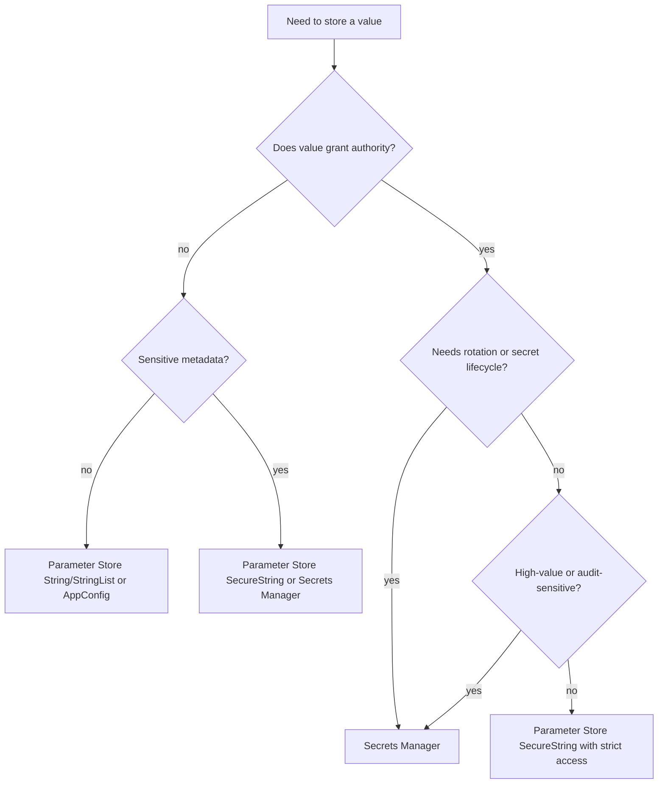
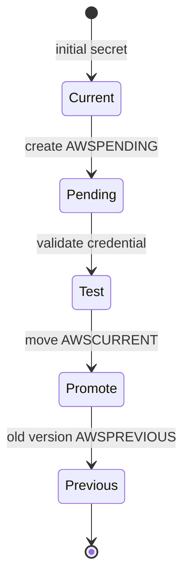
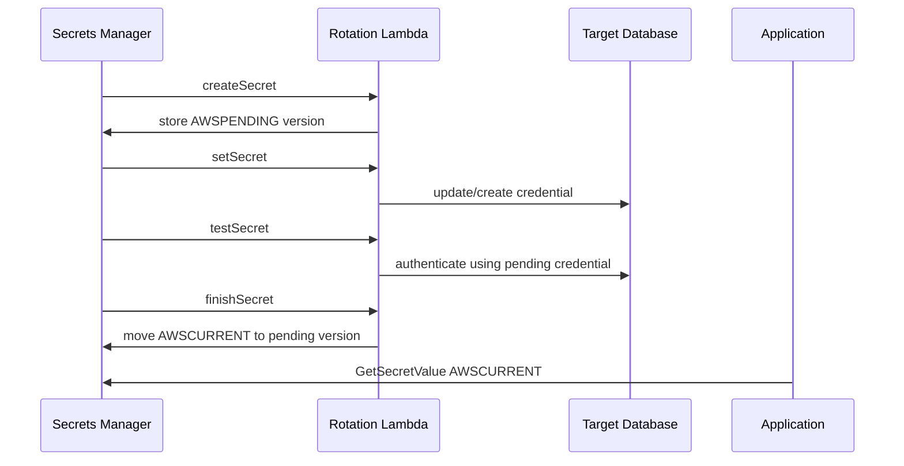
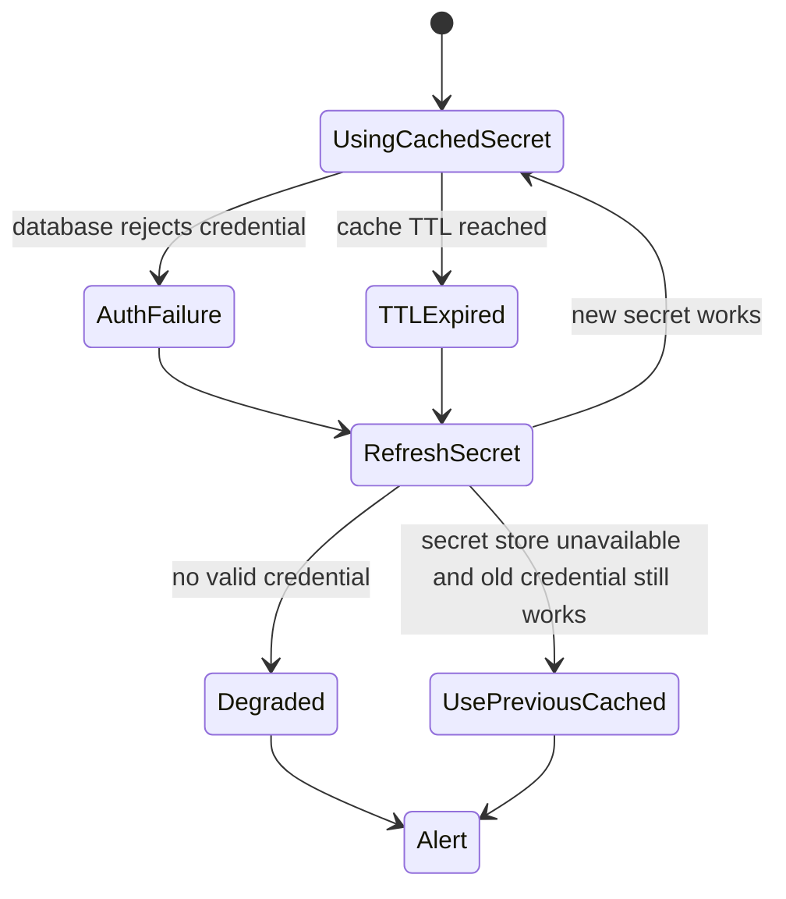
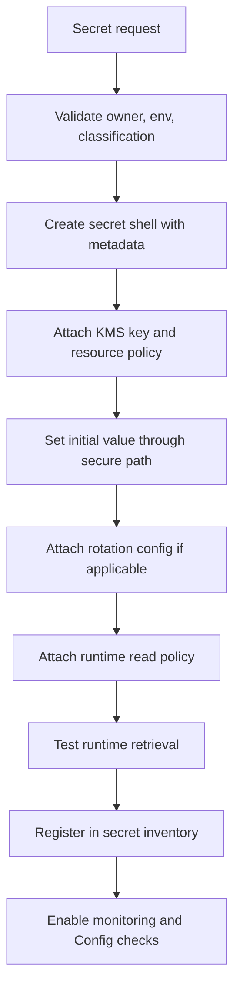
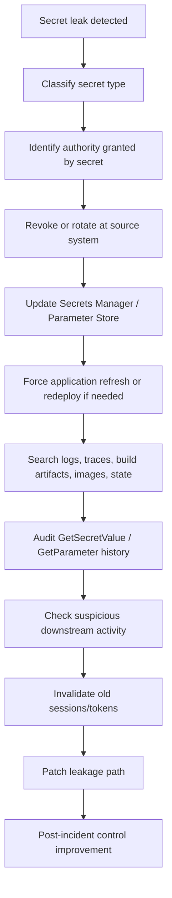

# Part 038 — Secrets Manager and Parameter Store

Secret management bukan sekadar “taruh password di tempat aman”.

Dalam production, secret adalah **runtime authority**. Siapa pun yang memegang secret sering kali bisa bertindak sebagai aplikasi, database user, third-party integration, atau service account.

Karena itu, desain secret management harus menjawab:

```text
Apa yang dianggap secret?
Siapa boleh menulis secret?
Siapa boleh membaca secret?
Apakah secret bisa dirotasi?
Bagaimana aplikasi mengambil secret?
Apa yang terjadi ketika secret bocor?
Apakah akses secret bisa diaudit?
Apakah secret muncul di log, env var, build artifact, container image, atau Terraform state?
```

AWS memberi dua building block yang sering dibandingkan:

- **AWS Secrets Manager**
- **AWS Systems Manager Parameter Store**

Keduanya bisa menyimpan nilai sensitif. Tetapi operating model-nya berbeda.

---

## 1. Mental Model: Secret vs Configuration

Pisahkan konsepnya.

| Jenis nilai | Contoh | Risiko utama | Tempat umum |
|---|---|---|---|
| Configuration biasa | endpoint URL, timeout, feature toggle non-sensitif | salah konfigurasi | Parameter Store, AppConfig, config repo |
| Sensitive configuration | internal endpoint, tenant mapping, non-public identifier | leakage metadata, misrouting | Parameter Store SecureString atau Secrets Manager |
| Secret | DB password, API token, private key, OAuth client secret | impersonation, data breach, lateral movement | Secrets Manager |
| Derived runtime credential | STS credential, DB auth token, short-lived token | replay sementara | tidak disimpan lama; diterbitkan saat runtime |

Rule praktis:

```text
Jika nilai memberi authority untuk bertindak sebagai sistem lain, perlakukan sebagai secret.
Jika nilai harus dirotasi, diaudit aksesnya, dan punya lifecycle sensitif, default ke Secrets Manager.
Jika nilai adalah konfigurasi hierarkis yang jarang sensitif dan tidak butuh rotation workflow, Parameter Store lebih natural.
```

Secret bukan hanya password. Secret adalah nilai yang jika bocor memberi kemampuan.

---

## 2. Secrets Manager vs Parameter Store

| Aspek | Secrets Manager | Parameter Store |
|---|---|---|
| Fokus utama | Secret lifecycle management | Hierarchical configuration store dan lightweight secret storage |
| Rotation | Built-in rotation workflow, termasuk Lambda rotation | Tidak punya workflow rotation setara Secrets Manager; bisa dibuat manual/automation |
| Versioning | Secret versions dengan staging label seperti `AWSCURRENT`, `AWSPREVIOUS`, `AWSPENDING` | Parameter version dan label |
| Tipe data | Secret string/binary | String, StringList, SecureString |
| KMS integration | Secret encrypted dengan KMS | SecureString encrypted dengan KMS |
| Hierarchy | Bisa pakai naming convention | Hierarchical path native seperti `/prod/payment/db/host` |
| Parameter policies | Tidak sama modelnya | Advanced parameters dapat memakai policies seperti expiration/no-change notification |
| Cost/throughput | Umumnya lebih mahal, cocok untuk high-value secrets | Cocok untuk banyak config sederhana; tier/throughput perlu diperhatikan |
| Ideal use | DB credential, API key, private credential, rotating secret | App config, endpoint, non-sensitive value, low-complexity SecureString |

Keputusan bukan soal mana yang “lebih aman”. Keputusan harus mengikuti lifecycle.



---

## 3. Secret Management Invariants

Production system harus punya invariant berikut:

```text
Secret tidak disimpan di source code.
Secret tidak disimpan di container image.
Secret tidak muncul di build log.
Secret tidak muncul di application log.
Secret tidak disimpan plaintext di Terraform state.
Secret tidak dibaca manusia secara rutin.
Secret runtime dibaca oleh workload identity, bukan shared human credential.
Secret punya owner, classification, rotation policy, dan incident runbook.
Secret access tercatat di CloudTrail.
Secret bisa dicabut/dirotasi tanpa redeploy besar jika memungkinkan.
```

Kalau invariant ini belum benar, Secrets Manager atau Parameter Store hanya menjadi “tempat baru untuk menaruh password lama”.

---

## 4. AWS Secrets Manager Building Blocks

| Konsep | Arti |
|---|---|
| Secret | Container logical untuk nilai secret dan metadata. |
| Secret value | String atau binary value. |
| Version | Versi immutable dari nilai secret. |
| Staging label | Label yang menunjuk versi tertentu, misalnya `AWSCURRENT`, `AWSPREVIOUS`, `AWSPENDING`. |
| Rotation | Proses mengganti credential lama dengan credential baru. |
| Rotation Lambda | Function yang menjalankan step rotation untuk target tertentu. |
| Resource policy | Policy pada secret untuk mengatur akses resource-side/cross-account. |
| KMS key | Key yang mengenkripsi secret value. |
| Replication | Secret dapat direplikasi ke region lain untuk multi-region design. |

Version staging penting. Aplikasi biasanya membaca `AWSCURRENT`. Saat rotation berjalan, Secrets Manager dapat memakai `AWSPENDING`, lalu mempromosikannya menjadi `AWSCURRENT` setelah valid.



---

## 5. Rotation Model

Rotation bukan hanya mengganti nilai di store. Rotation harus sinkron dengan target sistem.

Untuk database password, sistem harus:

```text
1. Membuat credential baru.
2. Menyimpan versi pending.
3. Mengubah credential di database.
4. Menguji credential baru.
5. Mempromosikan versi baru menjadi current.
6. Menjaga rollback path sementara.
7. Memastikan aplikasi memakai current value.
```

Generic sequence:



Rotation failure modes:

| Failure | Dampak |
|---|---|
| Rotation Lambda tidak bisa reach target DB | Secret pending dibuat tapi target tidak berubah. |
| Password berubah di DB tapi staging label tidak promote | Aplikasi tetap membaca old credential. |
| App cache terlalu lama | Aplikasi tetap memakai credential lama setelah rotation. |
| Test step lemah | Secret promoted walau tidak benar-benar valid. |
| Rollback tidak diuji | Incident credential outage lebih lama. |
| Multi-user rotation salah | Credential lama dimatikan sebelum semua app berpindah. |

Secret rotation harus diuji seperti database migration: ada backward compatibility, rollback, dan observability.

---

## 6. Parameter Store Building Blocks

Parameter Store adalah bagian dari AWS Systems Manager. Ia menyediakan storage hierarkis untuk configuration data dan lightweight secrets.

Tipe parameter:

| Type | Gunakan untuk |
|---|---|
| `String` | Nilai konfigurasi biasa. |
| `StringList` | List sederhana, bukan struktur kompleks besar. |
| `SecureString` | Nilai sensitif yang dienkripsi KMS. |

Contoh hierarchy:

```text
/prod/payment/api/base-url
/prod/payment/api/timeout-ms
/prod/payment/db/host
/prod/payment/db/port
/prod/payment/feature/enable-risk-check
/prod/payment/integration/vendor-x/api-token
```

Hierarchy bukan security boundary penuh jika IAM policy terlalu luas.

IAM path-based access:

```json
{
  "Sid": "AllowReadPaymentProdParameters",
  "Effect": "Allow",
  "Action": [
    "ssm:GetParameter",
    "ssm:GetParameters",
    "ssm:GetParametersByPath"
  ],
  "Resource": "arn:aws:ssm:ap-southeast-1:111122223333:parameter/prod/payment/*"
}
```

Risiko:

```text
GetParametersByPath terhadap parent path bisa membaca banyak parameter.
Path salah desain bisa memberi akses terlalu luas.
SecureString tetap membutuhkan KMS permission.
Parameter name bisa membocorkan informasi sensitif meskipun value terenkripsi.
```

---

## 7. SecureString dan KMS

Parameter Store `SecureString` memakai KMS untuk enkripsi. Dari sisi operating model, pertanyaannya:

```text
Role mana boleh membaca parameter?
Role mana boleh decrypt dengan KMS key?
Apakah decrypt dibatasi melalui SSM?
Apakah parameter path terlalu luas?
Apakah akses tercatat dan bisa dicari?
```

IAM policy untuk SecureString harus mencakup SSM read dan KMS decrypt.

```json
{
  "Version": "2012-10-17",
  "Statement": [
    {
      "Sid": "ReadSpecificSecureParameter",
      "Effect": "Allow",
      "Action": [
        "ssm:GetParameter"
      ],
      "Resource": "arn:aws:ssm:ap-southeast-1:111122223333:parameter/prod/payment/vendor-x/api-token"
    },
    {
      "Sid": "DecryptParameterViaSSMOnly",
      "Effect": "Allow",
      "Action": "kms:Decrypt",
      "Resource": "arn:aws:kms:ap-southeast-1:111122223333:key/KEY_ID",
      "Condition": {
        "StringEquals": {
          "kms:ViaService": "ssm.ap-southeast-1.amazonaws.com"
        }
      }
    }
  ]
}
```

Jangan memberi `ssm:GetParametersByPath` ke `/prod` untuk role aplikasi. Itu sama seperti memberi aplikasi akses membaca hampir semua konfigurasi production.

---

## 8. Naming Strategy

Nama secret/parameter harus membantu operability tanpa membocorkan informasi berlebihan.

Format baik:

```text
/<env>/<domain>/<service>/<purpose>
/prod/payment/payment-api/database-main
/prod/payment/payment-api/vendor-x-api-token
/prod/identity/session-service/jwt-signing-key
```

Tag wajib:

```yaml
environment: prod
domain: payment
service: payment-api
data-classification: confidential
owner: payment-platform
rotation-required: "true"
rotation-period-days: "30"
break-glass-required: "true"
```

Jangan masukkan nilai rahasia ke nama.

Buruk:

```text
/prod/payment/db-password-for-customer-john@example.com
/prod/vendor/token-live-sk-abc123
```

Nama resource sering muncul di CloudTrail, console, metric, alert, ticket, dan screenshot.

---

## 9. Access Model: Human vs Workload vs Pipeline

Pisahkan akses berdasarkan actor.

| Actor | Boleh membaca secret? | Boleh menulis secret? | Catatan |
|---|---:|---:|---|
| Runtime workload role | Ya, hanya secret spesifik | Tidak | Membaca saat runtime. |
| CI/CD deployment role | Biasanya tidak | Kadang update metadata/reference | Jangan jadikan pipeline sebagai secret reader kecuali perlu. |
| Secret provisioning role | Tidak harus membaca | Ya | Bisa create/update secret dari secure channel. |
| Developer human | Tidak by default | Tidak by default | Gunakan temporary approval jika perlu. |
| Security break-glass | Ya, terbatas dan audited | Ya, untuk incident | Harus high-friction dan alert. |
| Rotation Lambda role | Ya, secret tertentu | Ya, secret tertentu dan target credential | Role paling sensitif untuk secret itu. |

Runtime IAM policy:

```json
{
  "Sid": "RuntimeReadOnlySpecificSecret",
  "Effect": "Allow",
  "Action": [
    "secretsmanager:GetSecretValue",
    "secretsmanager:DescribeSecret"
  ],
  "Resource": "arn:aws:secretsmanager:ap-southeast-1:111122223333:secret:/prod/payment/payment-api/db-main-*"
}
```

Write operations harus lebih terbatas:

```text
secretsmanager:PutSecretValue
secretsmanager:UpdateSecret
secretsmanager:DeleteSecret
secretsmanager:RestoreSecret
secretsmanager:RotateSecret
secretsmanager:UpdateSecretVersionStage
ssm:PutParameter
ssm:DeleteParameter
ssm:LabelParameterVersion
```

`UpdateSecretVersionStage` sangat sensitif karena bisa mengubah versi mana yang dianggap current.

---

## 10. Retrieval Pattern di Aplikasi

Beberapa cara aplikasi mendapat secret:

| Pattern | Kelebihan | Risiko |
|---|---|---|
| Fetch at startup | Sederhana | Rotation butuh restart atau cache refresh. |
| Fetch on demand with cache | Lebih adaptif | Butuh TTL, retry, fallback design. |
| Sidecar/agent | Centralized retrieval | Tambah moving part. |
| Inject env var saat deploy | Mudah | Secret hidup lama di env/process; rotation buruk; bisa bocor ke diagnostic. |
| Bake into image | Tidak boleh | Secret bocor permanen di artifact. |

Production recommendation:

```text
Runtime role mengambil secret dari Secrets Manager/Parameter Store menggunakan SDK.
Gunakan client-side caching dengan TTL pendek yang sesuai rotation policy.
Jangan log secret value.
Jangan expose secret dalam health endpoint, metrics label, trace attribute, atau exception message.
```

Pseudocode Java-ish:

```java
class SecretProvider {
    private final SecretsManagerClient client;
    private final LoadingCache<String, String> cache;

    SecretProvider(SecretsManagerClient client) {
        this.client = client;
        this.cache = Caffeine.newBuilder()
            .expireAfterWrite(Duration.ofMinutes(5))
            .maximumSize(100)
            .build(this::loadSecret);
    }

    String get(String secretId) {
        return cache.get(secretId);
    }

    private String loadSecret(String secretId) {
        GetSecretValueResponse response = client.getSecretValue(
            GetSecretValueRequest.builder()
                .secretId(secretId)
                .versionStage("AWSCURRENT")
                .build()
        );
        return response.secretString();
    }
}
```

Engineering questions:

```text
Apa TTL cache?
Apa yang terjadi jika Secrets Manager timeout?
Apakah aplikasi fail closed atau memakai cached previous value?
Berapa lama old credential masih valid setelah rotation?
Apakah database connection pool bisa refresh credential?
Apakah secret refresh menyebabkan thundering herd?
```

---

## 11. Rotation-Aware Application Design

Secret rotation gagal kalau aplikasi didesain seolah credential tidak pernah berubah.

Untuk DB credential:

```text
Connection pool harus bisa reconnect.
Stale connections harus expire.
App harus handle authentication failure dengan refresh secret.
Old credential mungkin perlu overlap window.
Rotation schedule jangan bentrok dengan peak traffic tanpa confidence.
```

State machine runtime:



Jangan jadikan rotation sebagai cron job yang “semoga aman”. Treat rotation as production change.

---

## 12. Secret Creation and Provisioning Flow

Secret creation harus punya clear source of truth.



Secret inventory minimal:

| Field | Contoh |
|---|---|
| secret name | `/prod/payment/payment-api/db-main` |
| owner | `payment-platform` |
| system of record | `production aurora cluster payment-main` |
| classification | `confidential` |
| rotation | `enabled / 30 days` |
| runtime role | `payment-api-prod-runtime` |
| KMS key | `alias/prod/payment/secrets` |
| break-glass policy | `SEC-ACCESS-004` |
| last access review | `2026-07-01` |

---

## 13. Resource Policies and Cross-Account Secrets

Secrets Manager supports resource-based policies. Use them carefully.

Use case:

```text
Secret owned in shared security account.
Workload role in workload account reads it.
KMS key policy also allows decrypt path.
```

Secret resource policy:

```json
{
  "Version": "2012-10-17",
  "Statement": [
    {
      "Sid": "AllowSpecificWorkloadRoleReadSecret",
      "Effect": "Allow",
      "Principal": {
        "AWS": "arn:aws:iam::444455556666:role/prod-payment-api-runtime"
      },
      "Action": [
        "secretsmanager:GetSecretValue",
        "secretsmanager:DescribeSecret"
      ],
      "Resource": "*"
    }
  ]
}
```

Checklist cross-account:

```text
[ ] Secret resource policy allows exact external role.
[ ] Caller IAM policy allows GetSecretValue on secret ARN.
[ ] KMS key policy allows decrypt for caller/service path.
[ ] Caller IAM policy allows kms:Decrypt if needed.
[ ] SCP in caller account does not block access.
[ ] Secret ARN suffix wildcard handled correctly.
[ ] CloudTrail in both accounts is available for investigation.
```

Avoid broad principals unless condition strategy has been formally reviewed.

---

## 14. Terraform, IaC, and Secret State Leakage

Mistake umum: menulis secret value melalui Terraform dan menyimpannya di state.

Bad pattern:

```hcl
resource "aws_secretsmanager_secret_version" "db" {
  secret_id     = aws_secretsmanager_secret.db.id
  secret_string = var.database_password
}
```

Secret value bisa berakhir di Terraform state, plan output, logs, atau drift tooling.

Safer patterns:

| Pattern | Description |
|---|---|
| IaC creates secret metadata only | Terraform creates secret container, KMS key, policy, tags, rotation config. Value inserted through controlled secure process. |
| External secret bootstrap | Initial value injected from secure CI secret store with strict masking and no plan output. |
| Target-generated credential | RDS/rotation flow generates and rotates credential. |
| Dynamic credential | Prefer IAM auth/STS/token-based auth when supported. |

IaC harus own structure and policy. IaC tidak boleh casual menjadi plaintext secret pipeline.

---

## 15. Monitoring and Audit

Secrets Manager API calls direkam di CloudTrail. Parameter Store operations juga auditable sebagai AWS API events.

High-signal events:

```text
secretsmanager:GetSecretValue
secretsmanager:PutSecretValue
secretsmanager:UpdateSecret
secretsmanager:DeleteSecret
secretsmanager:RestoreSecret
secretsmanager:RotateSecret
secretsmanager:CancelRotateSecret
secretsmanager:UpdateSecretVersionStage
ssm:GetParameter
ssm:GetParameters
ssm:GetParametersByPath
ssm:PutParameter
ssm:DeleteParameter
kms:Decrypt
kms:GenerateDataKey
kms:CreateGrant
```

Detection ideas:

| Signal | Meaning |
|---|---|
| Human principal calls `GetSecretValue` in prod | Possible break-glass, debugging smell, or exfiltration. |
| New principal reads high-value secret | Access expansion. |
| Secret value updated outside deployment window | Unauthorized change risk. |
| `UpdateSecretVersionStage` unexpected | Current version hijack risk. |
| DeleteSecret scheduled | Availability and recovery risk. |
| GetParametersByPath over broad prod path | Potential mass config/secret enumeration. |
| KMS decrypt spike | Possible secret scraping or retry storm. |

EventBridge example:

```json
{
  "source": ["aws.secretsmanager"],
  "detail-type": ["AWS API Call via CloudTrail"],
  "detail": {
    "eventSource": ["secretsmanager.amazonaws.com"],
    "eventName": [
      "DeleteSecret",
      "PutSecretValue",
      "UpdateSecret",
      "UpdateSecretVersionStage",
      "GetSecretValue"
    ]
  }
}
```

Untuk `GetSecretValue`, jangan page semua event. Banyak aplikasi membaca secret secara normal. Alert harus context-aware:

```text
principal type = human OR unknown role
AND environment = prod
AND secret classification = confidential/secret
AND outside approved break-glass window
```

---

## 16. Config and Compliance Controls

Useful controls:

```text
Secrets must use customer managed KMS key for confidential/regulated data.
Secrets must have rotation enabled if rotation-required=true.
Secrets must rotate within max age.
Secrets must not be scheduled for deletion without approved exception.
Secrets must have owner/environment/classification tags.
Secrets resource policy must not allow broad public/cross-account access.
Parameter Store SecureString must use approved KMS key for prod sensitive values.
No application role may read parent path /prod/* unless explicitly approved.
```

AWS Config managed rules can help check rotation age and scheduled rotation success for Secrets Manager. For organization-specific invariants, use custom Config rules or Security Hub custom findings.

---

## 17. Incident Response: Secret Leak

Secret leak is not solved by deleting the line from Git.

Runbook:



Key distinction:

| Action | Meaning |
|---|---|
| Update secret store value | Aplikasi akan membaca nilai baru. |
| Rotate target credential | Credential lama tidak lagi valid di target system. |
| Revoke token | Old token/session benar-benar dimatikan. |
| Delete leaked file | Mengurangi exposure, tetapi tidak mencabut authority. |

Jika secret bocor, prioritasnya adalah mencabut authority, bukan membersihkan tampilan.

---

## 18. Decision Cookbook

### Database password untuk production service

Use Secrets Manager.

```text
KMS customer managed key.
Rotation enabled.
Runtime role can GetSecretValue only for specific secret.
Decrypt via Secrets Manager only.
Human read denied except break-glass.
App uses cache and handles rotation.
CloudTrail detection for human read and value update.
```

### Feature flag non-sensitive

Use Parameter Store String or AppConfig.

```text
No KMS needed.
Read path scoped to service/environment.
Do not put business-sensitive targeting data casually.
```

### Third-party API token with manual rotation

Usually Secrets Manager.

```text
Manual rotation runbook.
Owner and expiry metadata.
Alert if not rotated within policy.
Runtime read only.
No pipeline log exposure.
```

### Internal service endpoint URL

Parameter Store String.

```text
Hierarchical name.
Read-only runtime role.
Change audit.
No secret handling overhead unless endpoint itself is sensitive.
```

### JWT signing private key

Secrets Manager or dedicated key management design.

```text
Treat as high-value cryptographic material.
Strict human access.
Rotation and key-rollover plan.
Consumers support key ID / JWKS rollover if applicable.
Audit all reads.
```

### App wants AWS credentials stored as secret

Challenge the premise.

```text
Prefer IAM role, STS, workload identity, IRSA, Pod Identity, ECS task role, Lambda execution role, or instance profile.
Long-lived AWS access keys in Secrets Manager are still long-lived AWS access keys.
```

---

## 19. Anti-Patterns

### Secret in environment variable forever

Environment variables are easy but sticky. They can appear in process dumps, diagnostics, task definitions, deployment manifests, and debugging output. They also make rotation harder.

### One mega-secret JSON

```json
{
  "dbPassword": "...",
  "vendorToken": "...",
  "jwtPrivateKey": "...",
  "adminPassword": "..."
}
```

Dampak:

```text
Aplikasi yang butuh satu credential mendapat semua credential.
Rotation per credential sulit.
Audit tidak granular.
Blast radius membesar.
```

### `/prod/*` read access

Path-based convenience sering berubah menjadi mass-read permission.

### Developer bisa `GetSecretValue` di production by default

Ini membuat secret store menjadi shared password manager, bukan runtime secret boundary.

### Rotation tanpa application readiness

Secret rotated, aplikasi down karena connection pool tidak refresh.

### Secret value di Terraform state

State backend menjadi secret database tidak resmi.

### Menganggap SecureString otomatis cukup

SecureString terenkripsi, tetapi jika IAM path terlalu luas dan KMS decrypt terbuka, semua tetap bisa dibaca.

---

## 20. Production Checklist

Untuk setiap secret production:

```text
[ ] Apakah ini benar-benar secret atau config?
[ ] Apakah secret punya owner?
[ ] Apakah secret punya environment/domain/service tag?
[ ] Apakah classification jelas?
[ ] Apakah runtime role terbatas ke secret spesifik?
[ ] Apakah human access default denied?
[ ] Apakah break-glass path ada dan audited?
[ ] Apakah KMS key customer managed jika high-value?
[ ] Apakah KMS decrypt dibatasi via service jika memungkinkan?
[ ] Apakah rotation enabled jika credential bisa dirotasi?
[ ] Apakah aplikasi rotation-aware?
[ ] Apakah cache TTL selaras dengan rotation policy?
[ ] Apakah secret tidak masuk Terraform state?
[ ] Apakah secret tidak muncul di logs/traces/metrics?
[ ] Apakah CloudTrail event dipantau?
[ ] Apakah DeleteSecret/UpdateSecretVersionStage alert aktif?
[ ] Apakah ada incident runbook untuk leak?
[ ] Apakah last access review tercatat?
```

---

## 21. Final Mental Model

Secrets Manager dan Parameter Store bukan pengganti desain akses.

Keduanya hanya aman jika dipakai dalam sistem yang benar:

```text
Workload identity yang tepat.
IAM scope yang sempit.
KMS boundary yang jelas.
Rotation lifecycle yang diuji.
Runtime retrieval yang sadar failure.
Audit trail yang searchable.
Incident response yang bisa mencabut authority.
```

Secret management matang bukan ketika password tersembunyi.

Secret management matang ketika authority bisa diberikan, dipakai, dipantau, dirotasi, dan dicabut dengan aman.

---

## Official References

- AWS Secrets Manager User Guide — What is AWS Secrets Manager: https://docs.aws.amazon.com/secretsmanager/latest/userguide/intro.html
- AWS Secrets Manager User Guide — Best practices: https://docs.aws.amazon.com/secretsmanager/latest/userguide/best-practices.html
- AWS Secrets Manager User Guide — Log events with CloudTrail: https://docs.aws.amazon.com/secretsmanager/latest/userguide/monitoring-cloudtrail.html
- AWS Secrets Manager User Guide — CloudTrail entries: https://docs.aws.amazon.com/secretsmanager/latest/userguide/cloudtrail_log_entries.html
- AWS Systems Manager User Guide — Parameter Store: https://docs.aws.amazon.com/systems-manager/latest/userguide/systems-manager-parameter-store.html
- AWS Systems Manager User Guide — SecureString and KMS: https://docs.aws.amazon.com/systems-manager/latest/userguide/secure-string-parameter-kms-encryption.html
- AWS Systems Manager User Guide — Restricting Parameter Store access: https://docs.aws.amazon.com/systems-manager/latest/userguide/sysman-paramstore-access.html
- AWS Systems Manager User Guide — Parameter policies: https://docs.aws.amazon.com/systems-manager/latest/userguide/parameter-store-policies.html
- AWS Config Developer Guide — secretsmanager-secret-periodic-rotation: https://docs.aws.amazon.com/config/latest/developerguide/secretsmanager-secret-periodic-rotation.html
- AWS Config Developer Guide — secretsmanager-scheduled-rotation-success-check: https://docs.aws.amazon.com/config/latest/developerguide/secretsmanager-scheduled-rotation-success-check.html
