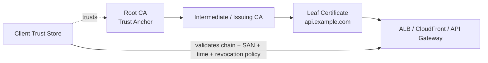
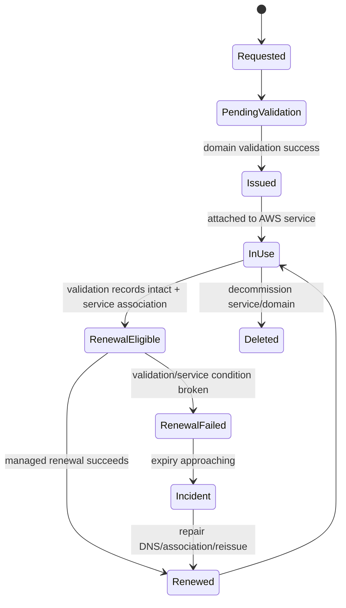
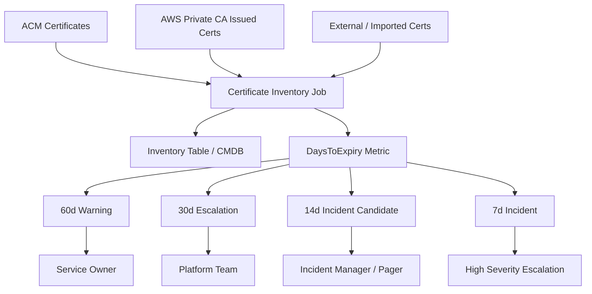
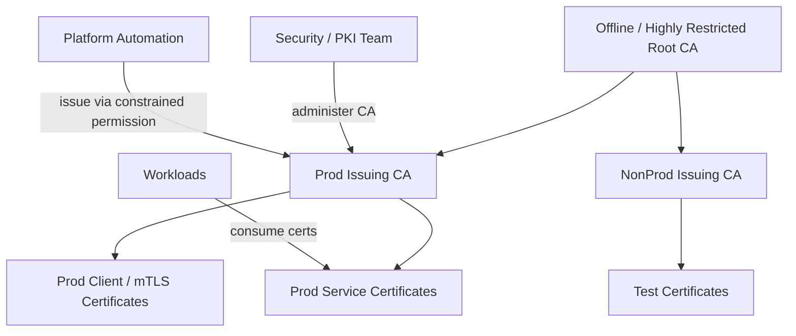
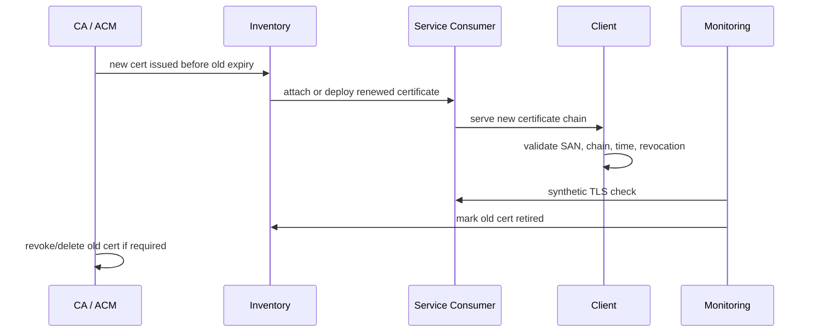
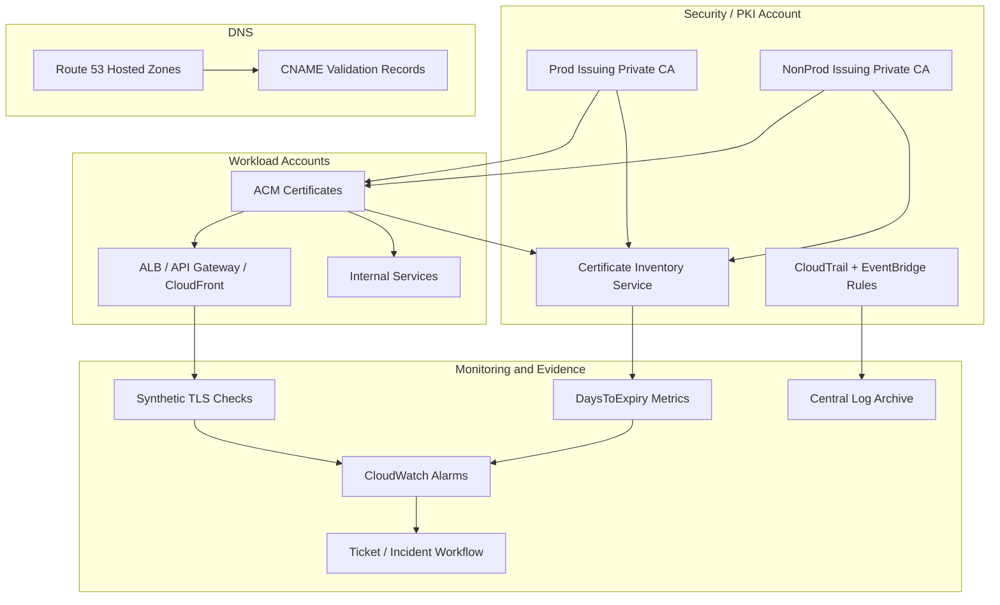

# Part 039 — Certificate and Private CA Management

Certificate management terlihat sederhana sampai production outage terjadi karena satu sertifikat expired, private key bocor, chain salah, CA tidak dipercaya, atau revocation tidak bekerja.

Di sistem modern, certificate bukan sekadar file `.crt`.

Certificate adalah **kontrak identitas kriptografis**.

Ia menjawab:

```text
Endpoint ini siapa?
Siapa yang menyatakan identitas itu valid?
Apakah private key-nya masih dipercaya?
Apakah certificate masih dalam masa berlaku?
Apakah certificate sudah dicabut?
Client mana yang mempercayai issuing CA?
Service AWS mana yang memakai certificate ini?
Siapa yang bertanggung jawab memperbaruinya sebelum expiry?
```

Dalam AWS, certificate lifecycle biasanya melibatkan:

- **AWS Certificate Manager / ACM** untuk public dan private TLS certificate yang dipakai oleh AWS-integrated services.
- **AWS Private CA** untuk membangun private certificate authority.
- **Route 53 / DNS provider** untuk domain validation.
- **Elastic Load Balancing, CloudFront, API Gateway, App Runner, Cognito, atau service lain** sebagai consumer certificate.
- **CloudTrail, EventBridge, AWS Config, CloudWatch, Security Hub, dan inventory system** sebagai control plane observability.

Tujuan part ini: membangun certificate management sebagai **lifecycle system**, bukan sebagai task manual.

---

## 1. Mental Model: Certificate Is Identity, Not Encryption Alone

TLS sering dijelaskan sebagai encryption. Itu benar, tetapi tidak lengkap.

TLS server certificate melakukan tiga hal utama:

| Fungsi | Makna engineering |
|---|---|
| Identity assertion | Server membuktikan bahwa ia memiliki private key yang cocok dengan public key di certificate. |
| Trust delegation | Client percaya karena certificate ditandatangani CA yang dipercaya. |
| Secure channel bootstrap | Setelah identity diverifikasi, TLS membentuk encrypted session. |

Jadi certificate outage bukan hanya masalah crypto. Ia bisa menjadi:

- availability incident karena client menolak koneksi;
- security incident karena private key compromise;
- compliance incident karena certificate tidak sesuai policy;
- governance incident karena tidak ada owner, inventory, atau expiry alert;
- architecture incident karena trust boundary salah.

Prinsip penting:

```text
Certificate adalah identitas runtime.
Private key adalah authority untuk menggunakan identitas itu.
CA adalah authority untuk menerbitkan identitas itu.
```

Kalau private key bocor, attacker bisa menyamar sebagai endpoint.
Kalau CA disalahgunakan, attacker bisa menerbitkan identitas palsu.
Kalau certificate expired, endpoint sah pun dianggap tidak valid.

---

## 2. Certificate Anatomy yang Harus Dipahami Engineer

Minimal field yang penting secara operasional:

| Elemen | Fungsi | Failure mode |
|---|---|---|
| Subject | Identitas utama certificate | Di TLS modern sering kalah penting dibanding SAN. |
| Subject Alternative Name / SAN | Domain/IP yang valid untuk certificate | Domain tidak cocok menyebabkan hostname verification gagal. |
| Issuer | CA yang menerbitkan certificate | Client tidak percaya jika chain tidak dikenal. |
| Validity period | `notBefore` dan `notAfter` | Expiry menyebabkan outage. |
| Public key | Key yang dipublikasikan di certificate | Algorithm/key size tidak sesuai policy. |
| Signature algorithm | Algorithm yang dipakai issuer | Algorithm lama bisa ditolak client. |
| Key usage / extended key usage | Batas penggunaan certificate | Salah usage bisa gagal di beberapa client. |
| CRL distribution point | Lokasi certificate revocation list | Client tidak bisa cek revocation jika unreachable. |
| OCSP endpoint | Online certificate status protocol | Revocation checking lambat/gagal jika endpoint bermasalah. |
| Chain/intermediate | Rantai trust dari leaf ke root | Missing intermediate sering menyebabkan failure di client tertentu. |

Mental model chain:



Root CA adalah trust anchor. Jangan sering dipakai untuk issue leaf certificate. Pola production yang lebih aman adalah root CA menandatangani subordinate/issuing CA, lalu issuing CA menerbitkan leaf certificate.

---

## 3. AWS Building Blocks

| Building block | Kapan dipakai | Catatan operasi |
|---|---|---|
| ACM public certificate | TLS public untuk domain publik pada service AWS yang terintegrasi | Managed renewal jika syarat terpenuhi. Cocok untuk ALB, CloudFront, API Gateway, dan integrasi lain. |
| ACM imported certificate | Certificate diterbitkan di luar ACM lalu diimpor | Renewal menjadi tanggung jawab Anda. Cocok jika memakai CA eksternal atau kebutuhan khusus. |
| ACM private certificate | Certificate private yang diterbitkan melalui AWS Private CA | Cocok untuk internal TLS, mTLS, service identity, device identity. |
| AWS Private CA | Managed private certificate authority | Perlu desain hierarchy, policy, revocation, audit, dan cost. |
| Route 53/DNS validation | Validasi domain untuk ACM public certificate | DNS CNAME harus tetap ada agar renewal otomatis stabil. |
| CloudTrail | Audit API ACM/Private CA | Bukti siapa request/import/delete/issue/revoke certificate. |
| AWS Config | Compliance state | Deteksi certificate mendekati expiry atau resource config drift. |
| EventBridge | Event routing | Notifikasi expiry, automation, incident trigger. |

ACM sebaiknya menjadi default untuk certificate yang dipakai service AWS terintegrasi. Jangan mengelola private key sendiri jika tidak ada kebutuhan kuat.

---

## 4. Decision Table: Public, Imported, atau Private CA?

Gunakan table ini sebagai starting point.

| Kebutuhan | Pilihan awal | Alasan |
|---|---|---|
| Public HTTPS untuk ALB/API Gateway/CloudFront | ACM public certificate | Managed lifecycle dan integrasi native. |
| Public HTTPS dengan CA eksternal yang diwajibkan regulator/client | Imported certificate | Authority eksternal, tetapi lifecycle Anda tanggung. |
| Internal service-to-service TLS | ACM private certificate dari AWS Private CA | Private trust domain dan integrasi AWS. |
| Mutual TLS untuk internal clients | AWS Private CA + ACM/private cert distribution | Perlu client certificate issuance dan revocation model. |
| Device certificate | AWS Private CA atau IoT-oriented CA model | Butuh lifecycle per device dan revocation. |
| Certificate harus diekspor private key-nya | Jangan default ke ACM public issued certificate | Desain ulang consumer atau gunakan CA/issuance yang memang mendukung key handling sesuai policy. |
| Legacy appliance butuh certificate file manual | Imported/public CA eksternal atau private CA issuance | Harus punya inventory dan renewal automation sendiri. |

Rule praktis:

```text
Jika certificate dipakai oleh AWS managed edge/service, default ke ACM.
Jika trust domain internal dan Anda butuh private identity issuance, gunakan AWS Private CA.
Jika private key harus keluar dari managed boundary, perlakukan sebagai exception berisiko tinggi.
```

---

## 5. ACM Public Certificate Lifecycle

Lifecycle production:



Important invariants:

1. **DNS validation records are production assets**. Jangan hapus CNAME validation hanya karena certificate sudah issued.
2. **Certificate must be attached to a supported AWS service** agar lifecycle-nya relevan dan renewal otomatis bisa berjalan sesuai kondisi ACM.
3. **Certificate expiry alert harus independen dari managed renewal**. Managed renewal mengurangi toil, bukan mengganti monitoring.
4. **Domain ownership harus jelas**. Certificate untuk `*.example.com` adalah authority besar, bukan sekadar convenience.
5. **Wildcard certificate memperbesar blast radius**. Gunakan ketika operational benefit lebih besar daripada risiko.

ACM public certificate dengan DNS validation dapat otomatis diperbarui selama syarat renewal terpenuhi. Tetapi kalau DNS validation record hilang, domain tidak resolve, certificate tidak lagi digunakan oleh service, atau domain ownership berubah, renewal bisa gagal.

---

## 6. Certificate Ownership Model

Sertifikat tanpa owner adalah bom waktu.

Setiap certificate harus punya metadata:

| Field | Contoh |
|---|---|
| `certificate_id` | ACM ARN atau serial number |
| `domain_names` | `api.prod.example.com`, `*.internal.example.com` |
| `environment` | prod/staging/dev |
| `consumer_service` | ALB payment-prod, CloudFront app-edge |
| `business_owner` | payments-platform |
| `technical_owner` | platform-edge-team |
| `issuing_authority` | ACM public, DigiCert, AWS Private CA subordinate X |
| `validation_method` | DNS/email/imported/manual |
| `renewal_mode` | managed/manual/automated pipeline |
| `expiry_slo` | alert at 60/30/14/7 days |
| `revocation_model` | none/CRL/OCSP/short-lived |
| `data_classification` | public/internal/regulated |
| `rotation_runbook` | link to procedure |

Untuk AWS, sebagian metadata bisa berasal dari tags dan ACM APIs. Untuk imported/non-AWS certificates, Anda perlu inventory eksternal atau CMDB.

Tag minimal:

```yaml
Owner: platform-edge
Environment: prod
Service: payment-api
CertificatePurpose: public-tls
RenewalMode: acm-managed-dns
Criticality: tier-1
DataClassification: public-endpoint
ExceptionId: none
```

---

## 7. Expiry Monitoring Pattern

Jangan hanya mengandalkan email expiry notification.

Production pattern:



Minimum alarm thresholds:

| Threshold | Meaning | Action |
|---:|---|---|
| 60 days | planning warning | validate owner and renewal mode |
| 30 days | operational escalation | confirm renewal path, test replacement |
| 14 days | incident candidate | assign daily tracking |
| 7 days | production incident | emergency renewal / failover |

Untuk public endpoint tier-1, Anda boleh memakai threshold lebih agresif.

Important: expiry monitoring harus mencakup:

- ACM certificates;
- imported certificates;
- certificates di load balancer;
- CloudFront certificates;
- API Gateway custom domain certificates;
- private certificates;
- certificate chain/intermediate expiry;
- external partner certificates;
- mTLS client CA bundles.

Sering terjadi leaf certificate masih valid, tetapi intermediate/root chain bermasalah di client tertentu.

---

## 8. AWS Private CA Mental Model

AWS Private CA memberi managed CA capability. Tetapi ia tidak menghapus kebutuhan PKI design.

Anda tetap harus memutuskan:

```text
Apakah AWS Private CA menjadi root CA atau subordinate CA?
Berapa CA hierarchy-nya?
Siapa boleh issue certificate?
Certificate template apa yang boleh digunakan?
Berapa validity leaf certificate?
Apakah revocation memakai CRL, OCSP, short-lived certificate, atau kombinasi?
Bagaimana audit issuance dilakukan?
Bagaimana CA dilindungi dari misuse?
Bagaimana CA didecommission?
```

Pola umum:



Root CA harus sangat jarang digunakan. Issuing CA dipakai untuk operational issuance. Jika satu issuing CA compromise, Anda bisa revoke/replace issuing CA tanpa mengganti seluruh trust anchor, tergantung trust model client.

---

## 9. Private CA Account Placement

Jangan asal menaruh CA di workload account.

Recommended operating pattern:

| CA type | Account placement | Rationale |
|---|---|---|
| Organization root private CA | Security tooling / dedicated PKI account | High impact, low frequency operation. |
| Production issuing CA | Security or shared services account | Centralized governance, controlled issuance. |
| Non-production issuing CA | Shared services or non-prod security account | Separation from prod trust. |
| Workload-specific issuing CA | Dedicated regulated workload account jika perlu | Hanya untuk boundary compliance yang jelas. |

CA adalah security control plane. Jika workload team bisa mengubah CA policy tanpa review, mereka bisa menerbitkan identity yang lebih luas dari yang seharusnya.

---

## 10. Issuance Policy: Siapa Boleh Menerbitkan Apa?

Private CA harus punya issuance guardrail.

Contoh policy rule:

```text
Platform automation boleh issue certificate untuk *.svc.prod.internal.example.com.
Team aplikasi tidak boleh issue wildcard certificate.
Non-prod CA tidak boleh issue certificate untuk domain prod.
Certificate validity maksimal 90 hari untuk service-to-service TLS.
Client certificate harus menyertakan OU/team identifier.
Certificate template harus dibatasi berdasarkan use case.
```

Authorization surface:

| Layer | Fungsi |
|---|---|
| IAM policy | Siapa boleh memanggil `IssueCertificate`, `GetCertificate`, `RevokeCertificate`. |
| CA resource policy / permission | Service principal mana yang boleh memakai CA. |
| Certificate template | Batas tipe certificate dan extension. |
| Domain naming convention | Batas identitas yang boleh diterbitkan. |
| Approval workflow | Human control untuk high-risk issuance. |
| CloudTrail detection | Bukti semua issuance/revocation. |

Anti-pattern:

```text
Memberi broad IssueCertificate ke pipeline umum tanpa membatasi template, domain, environment, atau owner.
```

Itu sama seperti memberi kemampuan menerbitkan passport internal tanpa kontrol.

---

## 11. Revocation: CRL, OCSP, atau Short-Lived Certificates?

Revocation bukan checkbox. Ia harus sesuai client behavior.

| Model | Cocok untuk | Kelemahan |
|---|---|---|
| CRL | Client yang bisa download list berkala | Latency propagasi, distribusi CRL, ukuran CRL. |
| OCSP | Client yang melakukan online status check | Endpoint dependency, client behavior beragam. |
| Short-lived certificate | Service mesh/internal workload dengan automation kuat | Butuh issuance automation stabil. |
| Manual replacement tanpa revocation | Low-risk internal use case tertentu | Tidak cukup untuk compromise scenario serius. |

Untuk AWS Private CA, revocation bisa dirancang dengan CRL dan/atau OCSP. Saat memakai CRL, AWS Private CA mempublikasikan CRL ke S3 bucket yang harus diberi policy agar service principal Private CA bisa menulis. Untuk OCSP, pastikan client memang melakukan OCSP checking dan endpoint reachable.

Prinsip:

```text
Revocation hanya berguna jika relying party benar-benar memeriksanya.
```

Jika client tidak pernah cek CRL/OCSP, maka revocation hanya menjadi catatan administratif, bukan kontrol runtime.

---

## 12. Certificate Rotation Without Outage

Rotation aman membutuhkan overlap.



Checklist rotation:

- Certificate diterbitkan sebelum old certificate memasuki danger window.
- SAN sama atau sengaja berubah dengan migration plan.
- Chain lengkap dan dipercaya client.
- Certificate attached ke semua consumer.
- Synthetic check memvalidasi TLS handshake dari lokasi/client penting.
- Old certificate tidak lagi dipakai.
- Inventory update.
- Audit event tersimpan.

Jangan menghapus old certificate sebelum semua consumer berpindah.

---

## 13. Monitoring Certificate Runtime, Bukan Hanya Inventory

Inventory mengatakan certificate seharusnya valid.
Runtime check membuktikan endpoint benar-benar menyajikan certificate yang valid.

Monitoring layer:

| Layer | Contoh check |
|---|---|
| Inventory | ACM `NotAfter`, issuer, domain, attachment. |
| Resource mapping | ALB listener certificate, CloudFront distribution cert, API Gateway custom domain. |
| External synthetic | TLS handshake ke `https://api.example.com`. |
| Chain validation | Leaf + intermediate + root trust. |
| Hostname validation | SAN cocok dengan hostname. |
| Expiry metric | Days until expiry. |
| Revocation path | CRL/OCSP endpoint reachable jika digunakan. |
| Audit event | Request/import/delete/revoke certificate. |

Untuk critical public endpoints, synthetic check harus berjalan dari luar VPC. Untuk private endpoints, jalankan dari network yang merepresentasikan client internal.

---

## 14. Certificate Incident Runbooks

### 14.1 Expired Public Certificate

Diagnosis:

```text
Apakah certificate benar-benar expired di endpoint runtime?
Apakah ACM certificate expired atau endpoint masih menyajikan old cert?
Apakah DNS validation CNAME hilang?
Apakah certificate tidak lagi associated dengan service?
Apakah renewal gagal karena domain validation?
Apakah ada CloudFront/ALB propagation delay?
```

Response:

1. Validasi dari client perspective dengan `openssl s_client` atau synthetic tool.
2. Cek certificate ARN yang attached ke resource.
3. Cek ACM status dan renewal status.
4. Perbaiki DNS validation jika hilang.
5. Request/reissue certificate jika renewal tidak bisa menunggu.
6. Attach certificate baru ke consumer.
7. Jalankan synthetic test.
8. Tutup incident setelah semua path terverifikasi.
9. Tambahkan control agar CNAME validation tidak bisa dihapus tanpa review.

### 14.2 Private Key Compromise

Diagnosis:

```text
Private key mana yang compromise?
Certificate mana yang terkait?
Apakah key pernah keluar dari managed boundary?
Endpoint mana yang menggunakan certificate itu?
Client mana yang mempercayai certificate/CA tersebut?
Apakah perlu revoke leaf certificate atau issuing CA?
```

Response:

1. Stop penggunaan certificate/key.
2. Issue certificate baru dengan key baru.
3. Rotate endpoint.
4. Revoke certificate lama jika revocation model efektif.
5. Investigasi log access ke secret/key material.
6. Review pipeline/log/build artifact untuk leakage.
7. Perbarui trust store jika CA/issuing CA terdampak.

### 14.3 Private CA Misuse

High-severity scenario:

```text
Principal tidak sah menerbitkan certificate untuk nama domain internal yang sensitif.
```

Response:

1. Disable issuance permission untuk principal terkait.
2. Query CloudTrail `IssueCertificate` events.
3. Enumerasi certificate yang diterbitkan pada window risiko.
4. Revoke certificate yang tidak sah.
5. Rotate relying service jika ada impersonation risk.
6. Review CA policy, IAM permission, template, dan automation boundary.
7. Tambahkan detection untuk unexpected issuance pattern.

---

## 15. Detection Rules yang Harus Ada

Minimal detection:

| Detection | Signal | Severity |
|---|---|---|
| Certificate expires within 30 days | ACM/API inventory | Medium/High depending criticality |
| Certificate expires within 7 days | ACM/API inventory | High/Critical |
| DNS validation record missing | DNS inventory + ACM renewal status | High for public prod cert |
| Imported certificate near expiry | ACM inventory | High because no managed renewal |
| Unexpected `RequestCertificate` or `ImportCertificate` | CloudTrail | Medium |
| Unexpected `DeleteCertificate` | CloudTrail | High |
| Unexpected `IssueCertificate` in Private CA | CloudTrail | High |
| `RevokeCertificate` called | CloudTrail | Medium/High |
| CA policy changed | CloudTrail / Config | High |
| CRL/OCSP config changed | CloudTrail / Config | High |
| Certificate attached to wrong resource/environment | Config/custom inventory | Medium/High |
| Wildcard certificate issued for prod | ACM/PCA event | High unless approved |

Detection should route to owner, not only central security. Security can own policy; service teams own certificate consumption.

---

## 16. Governance Controls

### Preventive Controls

- Restrict who can request/import/delete certificate.
- Restrict Private CA issuance to approved automation roles.
- Use SCP to block disabling audit/security services.
- Use permission boundaries for platform teams that create TLS resources.
- Require tags on certificate resources where supported.
- Protect DNS validation records with change management.
- Separate prod and non-prod CA hierarchy.

### Detective Controls

- Certificate expiry scan.
- CloudTrail event detection.
- Config rules for certificate expiration.
- Synthetic TLS check.
- CA issuance report.
- Unexpected wildcard/SAN detection.

### Corrective Controls

- Automated ticket creation.
- Renewal pipeline.
- Owner escalation.
- Emergency certificate issuance.
- Automatic detach/delete only after safe conditions.

### Recovery Controls

- Break-glass DNS access.
- Emergency ACM certificate request path.
- Pre-approved CA administrator procedure.
- Rollback from certificate deployment.
- Documented client trust store update path.

---

## 17. Common Anti-Patterns

| Anti-pattern | Why dangerous | Better design |
|---|---|---|
| Manual spreadsheet certificate inventory | Becomes stale quickly | API-driven inventory + tags + CMDB sync. |
| Email-only expiry alert | Missed by teams, no SLA | Metrics, alarms, escalation, tickets. |
| One wildcard certificate everywhere | Huge blast radius | Use scoped certs per service/domain group. |
| Root CA directly issues leaf certs | Root exposure and governance risk | Root signs issuing CA; issuing CA issues leaf. |
| Same private CA for prod and dev | Trust contamination | Separate CA hierarchy or strict issuing boundaries. |
| Imported certs without renewal owner | Guaranteed future outage | Owner, expiry alarm, renewal pipeline. |
| Deleting DNS validation records after issuance | Breaks future managed renewal | Treat validation CNAME as managed infra. |
| No runtime TLS check | Inventory says OK but endpoint serves old/bad chain | Synthetic handshake monitoring. |
| Revocation configured but clients do not check | False sense of control | Validate relying party behavior. |
| Broad `IssueCertificate` permission | Internal identity forgery risk | Constrained roles, templates, approvals, detection. |

---

## 18. Production Reference Architecture



Key properties:

- CA authority is centralized and protected.
- Certificate consumption happens in workload accounts.
- DNS validation is managed as infrastructure.
- Expiry is monitored as a metric.
- Runtime TLS is validated independently.
- CloudTrail evidence is centralized.
- Incident paths exist before expiry happens.

---

## 19. Engineering Checklist

Use this as implementation checklist.

### Inventory

- [ ] Semua certificate ACM terdaftar dengan owner.
- [ ] Imported/non-AWS certificate masuk inventory.
- [ ] Certificate consumer resource terhubung ke certificate ID.
- [ ] SAN, issuer, expiry, renewal mode, environment, dan criticality tersimpan.

### Renewal

- [ ] ACM DNS validation record dipertahankan.
- [ ] Imported certificate punya renewal pipeline.
- [ ] Expiry thresholds 60/30/14/7 hari aktif.
- [ ] Synthetic TLS check memvalidasi endpoint runtime.

### Private CA

- [ ] Prod dan non-prod CA dipisahkan.
- [ ] Root CA tidak dipakai untuk frequent issuance.
- [ ] `IssueCertificate` dibatasi ke automation roles.
- [ ] Certificate templates dibatasi.
- [ ] CRL/OCSP/short-lived strategy jelas.
- [ ] CloudTrail detection untuk issuance/revocation aktif.

### Governance

- [ ] DNS validation record dilindungi dari perubahan tidak sah.
- [ ] Wildcard certificate butuh approval.
- [ ] Delete/import/request certificate event dimonitor.
- [ ] Runbook expiry, key compromise, dan CA misuse tersedia.

---

## 20. Mental Model Final

Certificate management yang matang bukan tentang membuat certificate.

Ia tentang menjaga invariant berikut:

```text
Every runtime identity is issued by the right authority,
used only by the right service,
trusted only by the right clients,
rotated before expiry,
revocable when compromised,
auditable after every change,
and owned by a team that can respond.
```

Jika salah satu bagian hilang, certificate berubah dari security control menjadi outage trigger.

---

## References

- AWS Certificate Manager User Guide — Managed renewal: https://docs.aws.amazon.com/acm/latest/userguide/managed-renewal.html
- AWS Certificate Manager User Guide — DNS validation and renewal: https://docs.aws.amazon.com/acm/latest/userguide/dns-validation.html
- AWS Private Certificate Authority User Guide — Create a private CA: https://docs.aws.amazon.com/privateca/latest/userguide/create-CA.html
- AWS Private Certificate Authority User Guide — Certificate revocation options: https://docs.aws.amazon.com/privateca/latest/userguide/revocation-setup.html
- AWS Private Certificate Authority User Guide — Set up a CRL: https://docs.aws.amazon.com/privateca/latest/userguide/crl-planning.html
- AWS Private Certificate Authority User Guide — Revoke a private certificate: https://docs.aws.amazon.com/privateca/latest/userguide/PcaRevokeCert.html
- AWS Well-Architected Framework — Data protection: https://docs.aws.amazon.com/wellarchitected/latest/framework/sec-dataprot.html
