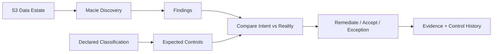
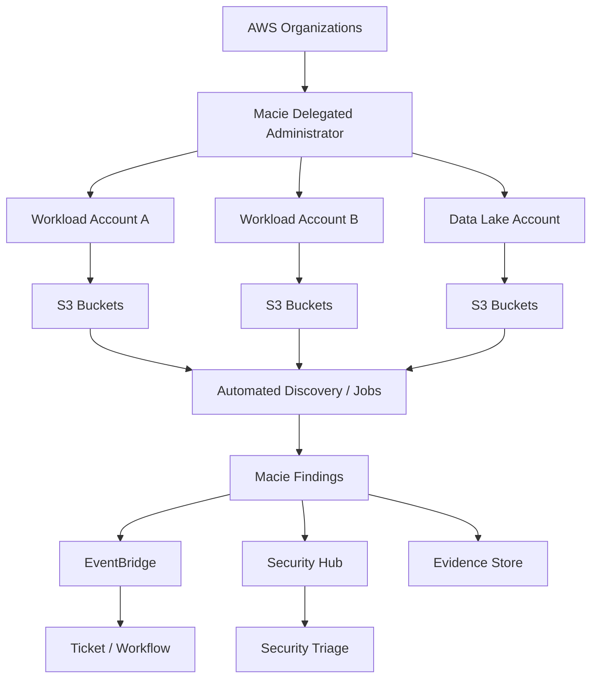
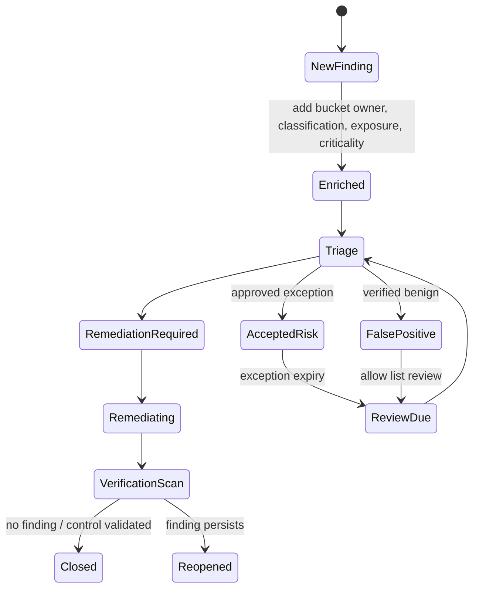
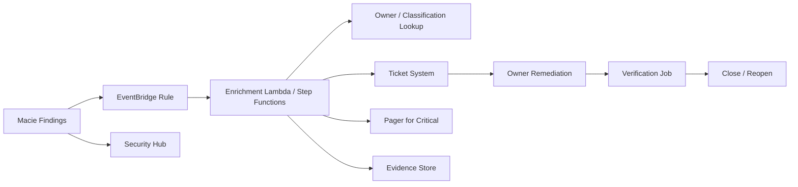

# Part 040 — Sensitive Data Discovery With Macie

Data classification yang hanya hidup di dokumen arsitektur tidak cukup.

Production system berubah terus:

- developer menambahkan export baru;
- batch job membuat dump sementara;
- data lake menerima object dari partner;
- incident debugging menghasilkan log berisi PII;
- backup masuk bucket yang salah;
- tenant data berpindah ke prefix yang tidak sesuai;
- file CSV lama tidak pernah dihapus;
- access policy berubah dan bucket menjadi lebih terbuka dari seharusnya.

Karena itu, data protection membutuhkan **discovery loop**.

Amazon Macie membantu discovery dan reporting sensitive data di Amazon S3. Macie bukan pengganti desain akses, encryption, retention, atau data classification. Macie adalah **sensor dan evidence generator** yang memberi tahu apakah data yang benar-benar tersimpan sesuai dengan asumsi security Anda.

Tujuan part ini: membangun Macie sebagai bagian dari **sensitive data control system**, bukan sekadar tombol scan S3.

---

## 1. Mental Model: Classification Is Intent, Discovery Is Feedback

Bedakan dua hal:

| Konsep | Pertanyaan | Contoh |
|---|---|---|
| Data classification | Data ini seharusnya masuk kategori apa? | `customer_profile` = confidential/PII. |
| Sensitive data discovery | Data sensitif apa yang benar-benar ditemukan? | Macie menemukan passport number di bucket analytics. |
| Access posture | Siapa bisa mengakses lokasi data itu? | Bucket policy mengizinkan cross-account read. |
| Control decision | Apa yang harus dilakukan? | Restrict policy, encrypt, move, delete, ticket, exception. |

Classification adalah deklarasi.
Discovery adalah observasi.
Governance adalah proses menyelesaikan gap di antara keduanya.



Jika Macie menemukan sensitive data di bucket yang diklasifikasikan sebagai public/static-assets, masalahnya bukan hanya finding. Masalahnya adalah **classification drift** atau **data routing failure**.

---

## 2. Apa yang Macie Lakukan dan Tidak Lakukan

Macie terutama berfokus pada Amazon S3 data estate.

Macie dapat:

- mengevaluasi S3 bucket inventory;
- melakukan automated sensitive data discovery;
- menjalankan sensitive data discovery jobs;
- memakai managed data identifiers untuk tipe data umum;
- memakai custom data identifiers untuk pola organisasi;
- menggunakan allow lists untuk mengurangi false positive;
- menghasilkan sensitive data findings;
- memberi visibility atas S3 security dan access posture tertentu;
- bekerja dalam organisasi dengan administrator/member account model;
- mengirim findings ke EventBridge/Security Hub untuk workflow lanjutan.

Macie tidak secara otomatis:

- memperbaiki access policy;
- mengenkripsi object;
- memindahkan data;
- menghapus data;
- menggantikan IAM least privilege;
- menggantikan DLP endpoint;
- menggantikan schema governance di database;
- mengerti semua konteks bisnis tanpa identifier/custom rule;
- menjamin tidak ada sensitive data jika tidak ditemukan.

Rule praktis:

```text
Macie tells you where sensitive data probably exists in S3.
It does not prove sensitive data cannot exist elsewhere.
```

---

## 3. Macie Architecture in a Multi-Account Organization

Production AWS organization sebaiknya tidak mengaktifkan Macie secara ad hoc di tiap workload account tanpa governance.

Pattern:



Recommended operating model:

| Area | Owner |
|---|---|
| Macie administrator | Security/data protection platform team |
| Bucket owner | Workload or data platform team |
| Data classification taxonomy | Security + data governance + legal/compliance |
| Remediation decision | Bucket owner with security oversight |
| Exception approval | Risk/compliance owner |
| Finding routing | Security platform automation |
| Evidence retention | Audit/log archive owner |

Macie harus di-enable dan dikonfigurasi per Region yang relevan. Jangan menganggap satu Region scan mencakup semua bucket global. S3 bucket region dan Macie region harus dipikirkan secara eksplisit.

---

## 4. Discovery Modes: Automated Discovery vs Discovery Jobs

Macie punya dua operating mode utama untuk sensitive data discovery.

| Mode | Kapan dipakai | Karakter |
|---|---|---|
| Automated sensitive data discovery | Continuous broad visibility | Macie mengevaluasi bucket inventory dan memilih object representatif dengan sampling. |
| Sensitive data discovery job | Targeted scan | Anda menentukan bucket/scope/schedule/identifiers untuk analisis lebih spesifik. |

### 4.1 Automated Sensitive Data Discovery

Gunakan untuk baseline visibility.

Cocok untuk:

- organization-wide discovery;
- mendeteksi bucket/prefix yang unexpectedly berisi PII/credential/financial data;
- menemukan drift dari data classification;
- memberi data map awal sebelum targeted jobs.

Tetapi pahami batasnya:

```text
Automated discovery menggunakan sampling dan representasi object.
Itu bagus untuk continuous visibility, bukan bukti exhaustiveness 100% terhadap setiap object.
```

### 4.2 Sensitive Data Discovery Jobs

Gunakan untuk precision dan evidence.

Cocok untuk:

- bucket regulated;
- audit evidence;
- post-incident investigation;
- migration validation;
- before/after remediation verification;
- scan prefix tertentu;
- scheduled scan pada data lake zone;
- mencari custom pattern organisasi.

Job design harus punya tujuan jelas:

```text
Apakah job ini mencari credential leakage?
Apakah job ini membuktikan bucket analytics tidak memuat raw PII?
Apakah job ini memvalidasi data lake bronze/silver/gold boundary?
Apakah job ini mencari identifier regulator-specific?
```

---

## 5. Managed Data Identifiers

Managed data identifiers adalah detection criteria bawaan Macie untuk tipe data sensitif umum.

Kategori umum meliputi:

- credentials;
- financial information;
- personal health information / PHI;
- personally identifiable information / PII.

Contoh risiko yang bisa dideteksi:

| Kategori | Contoh risiko |
|---|---|
| Credentials | AWS secret access key, private key, database credential. |
| Financial | credit card number, bank account number. |
| Personal information | passport, driver license, national identifier, address-like information. |
| Health | insurance/medical identifiers. |

Tetapi managed identifiers bukan magic.

Failure modes:

- format data terlalu custom;
- data terenkripsi sebelum disimpan dan Macie tidak punya akses plaintext;
- data compressed/encoded dalam format yang tidak dianalisis sesuai harapan;
- value mirip PII tetapi sebenarnya test data;
- value valid secara pattern tetapi tidak sensitif dalam konteks tertentu;
- sensitive data berupa semantic content yang tidak cocok regex/pattern;
- data berada di service selain S3.

Karena itu managed identifiers harus dipasangkan dengan custom identifiers dan human governance.

---

## 6. Custom Data Identifiers

Custom data identifier digunakan untuk pola organisasi.

Contoh:

| Use case | Pattern |
|---|---|
| Internal customer ID | `CUST-[0-9]{10}` |
| Case/enforcement ID | `CASE-[A-Z]{3}-[0-9]{8}` |
| Regulator reference | custom prefix + checksum-like pattern |
| Internal API token | org-specific token prefix |
| Tenant ID | structured tenant key |
| Legacy national ID variant | localized format not covered sufficiently by managed identifiers |

Custom identifier biasanya terdiri dari:

- regex;
- optional keywords;
- proximity rule;
- maximum match distance;
- severity interpretation;
- owner;
- test corpus.

Good custom identifier design:

```text
High signal > broad regex.
A noisy detector becomes alert fatigue.
A precise detector becomes engineering evidence.
```

Contoh pendekatan:

```yaml
name: internal-case-id
regex: "CASE-[A-Z]{3}-[0-9]{8}"
keywords:
  - case
  - enforcement
  - violation
  - investigation
maximumMatchDistance: 50
severity: medium
owner: regulatory-data-governance
```

Jangan langsung memasang regex terlalu luas seperti `[0-9]{16}` tanpa keyword/proximity. Itu akan menghasilkan noise tinggi.

---

## 7. Allow Lists: Mengurangi Noise Secara Terkontrol

Allow list digunakan untuk mengecualikan text yang memang aman atau false positive yang sudah diketahui.

Contoh:

- test credit card numbers;
- public documentation sample keys;
- dummy passport number;
- known non-sensitive ID pattern;
- synthetic dataset marker.

Governance allow list:

| Rule | Reason |
|---|---|
| Allow list harus punya owner | Agar tidak menjadi tempat menyembunyikan finding. |
| Allow list harus versioned | Perubahan harus auditable. |
| Allow list harus punya expiry/review | False positive hari ini bisa menjadi risk besok. |
| Allow list tidak boleh terlalu broad | Bisa menutup data sensitif nyata. |
| Allow list harus diuji | Pastikan tidak menekan true positive. |

Anti-pattern:

```text
Menambahkan pattern besar ke allow list karena tim lelah menerima finding.
```

Itu bukan remediation. Itu mematikan sensor.

---

## 8. Bucket Prioritization Model

Tidak semua bucket harus diperlakukan sama.

Buat scoring sebelum menjalankan scan mahal atau remediation besar.

| Faktor | Contoh nilai | Dampak |
|---|---|---|
| Exposure | public, cross-account, internal only | Public/cross-account naik prioritas. |
| Classification intent | public/internal/confidential/regulated | Regulated naik prioritas. |
| Business criticality | tier-0/tier-1/tier-2 | Critical naik prioritas. |
| Data zone | raw/bronze/silver/gold/export/temp | Raw/export/temp lebih risk-prone. |
| Encryption | SSE-S3/SSE-KMS/customer-managed | Lack of expected encryption naik prioritas. |
| Access volume | high/low/unknown | Unknown/high butuh observability. |
| Owner quality | known/unknown/stale | Unknown owner naik prioritas. |
| Previous findings | none/medium/high | Repeat findings naik prioritas. |

Simple priority formula:

```text
Priority = sensitivity_signal × exposure_risk × business_criticality × owner_uncertainty
```

Bucket public dengan PII finding harus jauh lebih cepat direspons dibanding bucket private dengan low-confidence test-data finding.

---

## 9. Sensitive Data Finding Lifecycle

Finding lifecycle harus eksplisit.



Finding fields yang harus ditambahkan oleh enrichment pipeline:

| Field | Why |
|---|---|
| account id/name | ownership and blast radius |
| bucket name | resource target |
| bucket owner tag | routing |
| object key/prefix | locality |
| object classification tag | compare intent vs reality |
| public/cross-account status | exposure priority |
| KMS/encryption status | protection context |
| finding type | detector |
| severity | SLA |
| sample/redacted evidence | human triage |
| data zone | lake governance |
| exception status | risk lifecycle |
| ticket id | remediation trace |

Finding tanpa owner akan berhenti di dashboard. Finding dengan owner dan SLA berubah menjadi work item.

---

## 10. Response Patterns

### 10.1 Public Bucket Contains Sensitive Data

High-risk path.

Actions:

1. Confirm exposure state.
2. Temporarily block public access if safe and policy permits.
3. Identify object prefix and data source.
4. Notify bucket owner and security incident channel.
5. Determine whether data was accessed using S3 server access logs/CloudTrail data events if available.
6. Remove/move/quarantine object.
7. Fix upstream pipeline.
8. Run verification job.
9. Record evidence and post-incident action.

Preventive follow-up:

- S3 Block Public Access;
- bucket policy guardrail;
- data lake zone validation;
- pre-ingestion scanning;
- stronger object tagging/classification.

### 10.2 Credentials Found in S3

Treat as credential compromise until proven otherwise.

Actions:

1. Identify credential type.
2. Revoke/rotate credential immediately.
3. Search for additional copies.
4. Check access logs for use.
5. Remove/quarantine object.
6. Fix source that wrote credential.
7. Add detector/pre-commit/IaC/logging guardrail.

### 10.3 Regulated Data in Wrong Zone

Example: raw PII found in analytics export bucket.

Actions:

1. Confirm classification mismatch.
2. Identify producer pipeline.
3. Stop further writes if necessary.
4. Move/delete object according to retention/legal policy.
5. Add transformation/redaction/tokenization step.
6. Re-run targeted Macie job.
7. Update data contract.

---

## 11. Integrating Macie with Security Hub and EventBridge

Macie findings should not live only in Macie console.

Pattern:



EventBridge cocok untuk automation routing. Security Hub cocok untuk centralized security posture/finding correlation.

Enrichment wajib dilakukan sebelum ticket:

```text
Raw finding + no owner = abandoned alert.
Enriched finding + owner + SLA = operational control.
```

---

## 12. Macie and Data Lake Zones

Untuk data lake, Macie harus dipetakan ke zone.

| Zone | Expected data | Macie stance |
|---|---|---|
| Landing | raw inbound, unknown quality | broad discovery, high attention. |
| Bronze/raw | raw source data | sensitive expected, access tightly controlled. |
| Silver/cleaned | normalized/filtered | verify masking/redaction/tokenization. |
| Gold/serving | curated analytics | sensitive data should be intentional and documented. |
| Export/share | data leaving internal domain | strict scan before release. |
| Temp/debug | transient data | aggressive retention and scan for leakage. |

Important invariant:

```text
The later the data zone, the more intentional sensitive data should be.
```

Jika PII muncul di export zone tanpa approved purpose, itu governance failure.

---

## 13. Cost and Scope Control

Sensitive data discovery bisa mahal jika scope tidak dirancang.

Cost control principles:

- gunakan automated discovery untuk broad visibility;
- gunakan targeted jobs untuk high-risk buckets/prefixes;
- jangan scan ulang object yang sama tanpa alasan;
- gunakan sampling untuk exploratory discovery;
- gunakan scheduled jobs untuk regulated zones;
- scope berdasarkan prefix, object criteria, tag, dan bucket risk;
- ukur finding value per scan cost;
- review noisy custom identifiers;
- exclude known irrelevant data secara hati-hati.

Cost anti-pattern:

```text
Scan seluruh S3 estate setiap hari tanpa classification, risk model, atau remediation capacity.
```

Security scanning tanpa kapasitas remediation akan menghasilkan backlog, bukan risk reduction.

---

## 14. Evidence Model for Audit

Macie bisa menjadi evidence source, tetapi evidence harus dikelola.

Audit question:

```text
Bagaimana Anda tahu bucket regulated tidak mengandung unapproved sensitive data?
```

Evidence package:

| Evidence | Source |
|---|---|
| Macie enabled accounts/regions | Macie admin / AWS Organizations |
| Bucket inventory | Macie/S3 inventory |
| Discovery job definition | Macie job config |
| Managed/custom identifiers used | Macie config |
| Scan schedule | Macie job schedule |
| Findings summary | Macie findings/export |
| Remediation ticket | Ticket system |
| Verification scan result | Macie follow-up job |
| Exception approval | Risk register |
| Retention/deletion proof | S3 lifecycle/object audit |
| Access posture | S3 policy/Config/IAM Access Analyzer |

Evidence harus menjawab bukan hanya “kami scan”, tetapi:

```text
Kami tahu apa yang kami scan,
kenapa scope itu dipilih,
apa yang ditemukan,
siapa yang memperbaiki,
bagaimana kami memverifikasi,
dan apa risiko residualnya.
```

---

## 15. Control Mapping

| Risk | Preventive control | Detective control | Corrective control |
|---|---|---|---|
| PII masuk public bucket | S3 Block Public Access, bucket policy guardrail | Macie sensitive finding + public exposure enrichment | Block access, move/delete object, fix producer |
| Credential stored in S3 | Secret scanning before upload, CI guardrail | Macie credential identifier | Revoke credential, delete object, investigate use |
| Raw data enters analytics export | Data contract, pipeline validation | Macie job on export prefix | Stop export, redact/tokenize, verify |
| Unknown owner bucket contains sensitive data | Account/bucket tagging policy | Macie + owner enrichment failure | Assign owner, restrict access, exception or remediation |
| Sensitive data retained too long | Lifecycle policy, retention policy | Macie repeated finding in expired prefix | Delete/archive according to policy |
| False positives overwhelm team | Identifier testing, allow list governance | Finding quality metrics | Tune identifier/allow list with approval |

---

## 16. Operational Metrics

Security team harus mengukur outcome, bukan jumlah scan.

Useful metrics:

| Metric | Meaning |
|---|---|
| percentage of accounts with Macie enabled | coverage |
| percentage of relevant regions configured | regional coverage |
| buckets inventoried | visibility |
| high-risk buckets scanned | risk-driven coverage |
| findings by category | risk distribution |
| findings by owner/team | accountability |
| mean time to triage | operational responsiveness |
| mean time to remediate | risk reduction speed |
| repeat findings by bucket | systemic issue |
| false positive rate by identifier | detector quality |
| findings without owner | governance gap |
| exceptions past review date | risk debt |

A mature program optimizes for:

```text
lower unknown data risk,
faster remediation,
fewer repeat findings,
better owner attribution,
and clearer evidence.
```

---

## 17. Failure Modes and How to Handle Them

| Failure mode | Symptom | Mitigation |
|---|---|---|
| Macie not enabled in all relevant regions | buckets missing from visibility | Region enablement policy and inventory check. |
| No delegated admin model | fragmented findings | Central Macie administrator. |
| Findings have no owner | no remediation | Tag enforcement + ownership registry. |
| Too many false positives | alert fatigue | Tune identifiers, keywords, allow lists. |
| Custom regex too broad | noisy results | Test corpus and precision review. |
| Automated discovery assumed exhaustive | false assurance | Use targeted jobs for audit-critical scope. |
| Sensitive data encrypted in inaccessible form | Macie cannot inspect plaintext | Ensure intended access or use upstream scanning. |
| No CloudTrail data events/S3 logs | cannot assess access after finding | Enable logging for high-risk buckets. |
| Ticket closed without verification | data remains | Verification job required before closure. |
| Exception never expires | permanent risk | Exception TTL and review workflow. |

---

## 18. Implementation Blueprint

### Step 1 — Define Classification Taxonomy

At minimum:

```yaml
classificationLevels:
  - public
  - internal
  - confidential
  - regulated
  - secret
```

For each level define:

- allowed storage locations;
- encryption requirement;
- access model;
- retention rule;
- discovery requirement;
- incident severity;
- exception approver.

### Step 2 — Enable Macie Centrally

- Use delegated administrator.
- Enroll member accounts.
- Configure relevant Regions.
- Define finding export and integration.
- Decide default automated discovery settings.

### Step 3 — Build Bucket Inventory and Ownership Map

Required fields:

```yaml
bucket: prod-payment-exports
account: 123456789012
environment: prod
owner: payment-platform
classificationIntent: confidential
businessCriticality: tier-1
publicAccessExpected: false
crossAccountAccessExpected: true
kmsRequired: true
dataZone: export
```

### Step 4 — Configure Identifiers

- Start with managed identifiers.
- Add custom identifiers for internal IDs and regulated domain concepts.
- Build allow lists for known synthetic/test patterns.
- Test on sample objects before broad deployment.

### Step 5 — Run Broad Discovery

- Enable automated discovery.
- Review top risky buckets.
- Identify unknown owners and classification mismatches.

### Step 6 — Run Targeted Jobs

- Regulated buckets.
- Public/cross-account buckets.
- Export zones.
- Migration validation.
- Incident scope.

### Step 7 — Automate Finding Routing

- EventBridge rule for Macie findings.
- Enrich with account/bucket owner and exposure.
- Create ticket with severity and SLA.
- Escalate critical findings.

### Step 8 — Verify Remediation

- Re-run targeted job.
- Validate access posture.
- Attach evidence to ticket.
- Close only after verification.

---

## 19. Example Severity Model

| Condition | Suggested severity |
|---|---|
| Credential found in any bucket | Critical |
| PII/PHI/financial data in public bucket | Critical |
| PII in cross-account bucket without approved sharing | High |
| Regulated data in wrong data lake zone | High |
| Sensitive data in non-prod bucket | Medium/High depending real data policy |
| Sensitive data in expected regulated bucket with correct controls | Informational/accepted |
| Test data false positive | Low/false positive with allow list review |

Severity should combine:

```text
sensitive_data_type + exposure + classification_mismatch + business_context + exploitability
```

Do not rank all sensitive data equally. PII in a correctly protected regulated bucket is not the same as credentials in a public bucket.

---

## 20. Final Mental Model

Macie is not a data protection program by itself.

Macie becomes valuable when connected to:

- classification taxonomy;
- bucket ownership;
- access posture;
- incident workflow;
- remediation verification;
- exception governance;
- evidence retention.

The invariant:

```text
Sensitive data must be known,
owned,
classified,
protected,
monitored,
remediated when misplaced,
and provable during audit.
```

If Macie only produces findings that nobody owns, it is a dashboard.
If Macie produces findings that enter an evidence-backed control loop, it becomes a security system.

---

## References

- Amazon Macie User Guide — What is Amazon Macie: https://docs.aws.amazon.com/macie/latest/user/what-is-macie.html
- Amazon Macie User Guide — Automated sensitive data discovery: https://docs.aws.amazon.com/macie/latest/user/discovery-asdd.html
- Amazon Macie User Guide — How automated sensitive data discovery works: https://docs.aws.amazon.com/macie/latest/user/discovery-asdd-how-it-works.html
- Amazon Macie User Guide — Managed data identifiers: https://docs.aws.amazon.com/macie/latest/user/managed-data-identifiers.html
- Amazon Macie User Guide — Custom data identifiers: https://docs.aws.amazon.com/macie/latest/user/custom-data-identifiers.html
- Amazon Macie User Guide — Types of findings: https://docs.aws.amazon.com/macie/latest/user/findings-types.html
- AWS Well-Architected Framework — Data classification: https://docs.aws.amazon.com/wellarchitected/latest/security-pillar/data-classification.html
- AWS Well-Architected Framework — Data protection: https://docs.aws.amazon.com/wellarchitected/latest/framework/sec-dataprot.html
