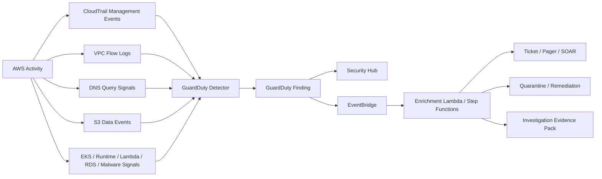
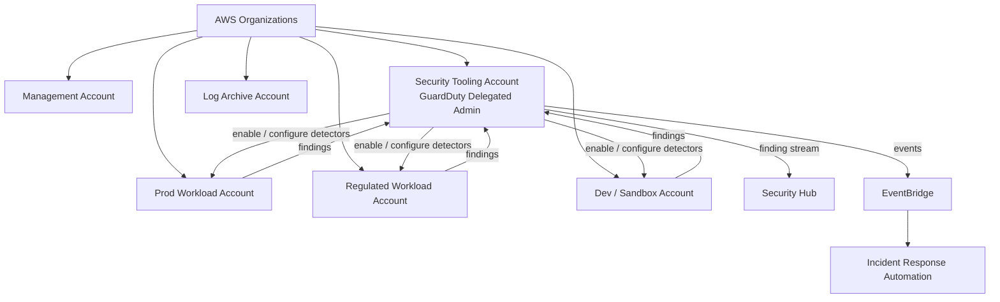
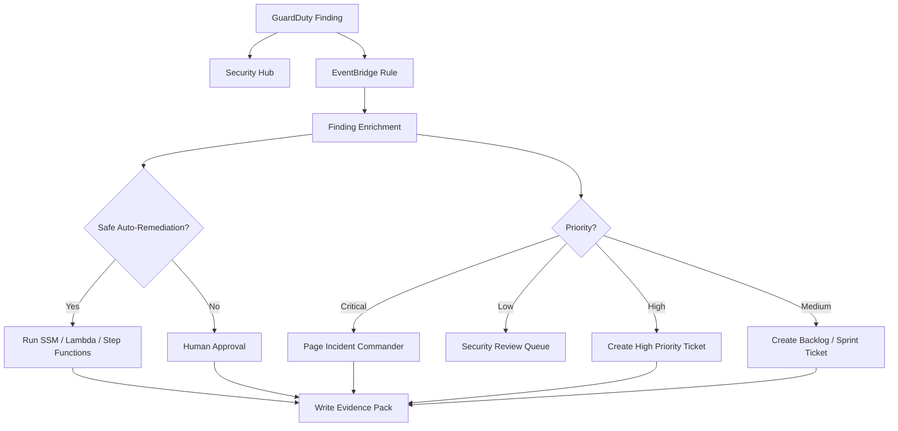

# Part 041 — GuardDuty Threat Detection Model

GuardDuty is not “the AWS antivirus”. It is a managed threat detection layer for AWS accounts, workloads, and data. Its job is to consume AWS-native telemetry, apply threat intelligence and anomaly detection, and emit security findings when behavior looks malicious, suspicious, or materially risky.

The correct mental model:

> GuardDuty turns raw AWS activity into threat hypotheses.

It does **not** prove an incident by itself. It gives you a high-quality starting point for investigation and response.

A strong AWS security program treats GuardDuty as one component in a larger detection pipeline:



The goal is not to “turn on GuardDuty and feel safe”. The goal is to build a detection operating model where every meaningful finding has an owner, severity policy, enrichment path, response playbook, evidence trail, suppression rule, and closure condition.

---

## 1. What GuardDuty Is Actually Detecting

GuardDuty detects suspicious behavior from AWS telemetry. That behavior usually falls into one of these categories:

| Category | Example Suspicion | Why It Matters |
|---|---|---|
| Credential compromise | API calls from unusual geolocation, TOR, malicious IP, impossible pattern, or newly observed behavior | Attacker may have AWS credentials. |
| Instance compromise | EC2 communicating with known command-and-control infrastructure | Workload may be executing attacker-controlled code. |
| Container/runtime compromise | Suspicious process, privilege escalation, crypto-mining, reverse shell behavior | Application runtime may be compromised. |
| Data exfiltration | Unusual S3 object access, enumeration, or API pattern | Sensitive data may be leaving expected access path. |
| Reconnaissance | Port scans, API enumeration, account probing | Attacker may be mapping environment. |
| Malware indicators | Malware detected in EBS volumes or S3 objects, depending on enabled protection plan | Malicious payload may exist in storage or workload artifacts. |
| Database auth anomaly | Suspicious RDS login activity | Database identity or network access may be abused. |
| Lambda network anomaly | Suspicious network behavior from Lambda workloads | Serverless workload may be contacting malicious destination. |

GuardDuty is strongest when you preserve the surrounding evidence. A finding without CloudTrail, Config, Flow Logs, application logs, and workload context becomes hard to prove and hard to remediate.

---

## 2. GuardDuty Is Not a Replacement for Logs

A common mistake is assuming GuardDuty stores all source logs for later forensic analysis. That is not the operating model.

GuardDuty analyzes supported telemetry sources and emits findings. You still need your own log architecture for evidence retention, search, and audit reconstruction.

GuardDuty answers:

```text
Something suspicious may be happening here.
```

CloudTrail, VPC Flow Logs, DNS logs, CloudWatch Logs, Config, EDR/runtime logs, application logs, and workload metadata answer:

```text
What exactly happened, who caused it, what changed, what data was touched, and what must be restored or revoked?
```

Do not confuse detection with evidence custody.

---

## 3. Detector Architecture

GuardDuty uses a **detector** per account and Region. In an organization, the production pattern is to designate a delegated administrator account and manage GuardDuty centrally across member accounts.



The delegated administrator pattern matters because threat detection is not something every workload team should configure independently. Workload teams should own remediation, but the security organization should own detection baseline, central visibility, and exception governance.

### Production invariants

A production AWS organization should enforce these invariants:

```text
GuardDuty is enabled in all supported Regions where accounts may operate.
GuardDuty is centrally managed from a delegated security account.
New accounts are automatically enrolled.
Suspended and transitional accounts are still considered from a risk perspective.
Findings are forwarded to Security Hub and EventBridge.
High-severity findings create an operational response, not just a dashboard item.
Suppression rules are versioned, reviewed, and time-bound.
```

---

## 4. Data Sources and Protection Plans

GuardDuty detection quality depends on enabled sources. Treat the source set as a control surface.

### 4.1 Foundational data sources

Foundational sources generally include signals such as:

| Source | Detection Value | Example Question It Helps Answer |
|---|---|---|
| CloudTrail management events | AWS API behavior | Is a principal making suspicious API calls? |
| VPC Flow Logs | Network communication pattern | Is an instance talking to malicious IPs? |
| DNS query signals | Domain resolution behavior | Is a workload resolving known malicious domains? |

Foundational sources are important because credential abuse and instance compromise often leave API and network traces before business impact is obvious.

### 4.2 Optional protection plans

Optional protection plans deepen coverage for specific resource classes.

| Protection Area | What It Adds | Risk Covered |
|---|---|---|
| S3 Protection | CloudTrail S3 data event analysis | Suspicious object access, enumeration, exfiltration pattern. |
| EKS Protection | Kubernetes audit log analysis | Suspicious Kubernetes API activity. |
| Runtime Monitoring | Runtime behavior for supported workloads such as containers and instances | Process, network, privilege, and runtime compromise indicators. |
| Malware Protection for EC2 | Malware scan of EBS volumes | Malware on compute storage. |
| Malware Protection for S3 | Malware evaluation for S3 objects | Malicious uploaded objects or payload staging. |
| RDS Protection | Login activity anomaly analysis | Suspicious database authentication patterns. |
| Lambda Protection | Lambda network activity analysis | Suspicious outbound network behavior from serverless functions. |

The operating decision is not “enable everything blindly”. The decision is:

```text
For this account and workload class, which threat paths are realistic, which data sources cover them, what cost does that create, and who owns the resulting findings?
```

For regulated or internet-facing production workloads, the default should be broad coverage unless a specific source creates unacceptable cost/noise and has an approved compensating control.

---

## 5. Finding Anatomy

A GuardDuty finding is a structured threat hypothesis. You should parse it as an investigation object.

Typical fields to reason about:

| Field | Meaning | Investigation Use |
|---|---|---|
| Finding type | Category and behavior pattern | Select playbook. |
| Severity | GuardDuty risk estimate | Determine response urgency. |
| Account ID | Where the signal occurred | Map owner and environment. |
| Region | Where the signal occurred | Locate telemetry and resource. |
| Resource | Affected principal, instance, bucket, cluster, database, etc. | Determine blast radius. |
| Service/action details | Behavior observed | Reconstruct event path. |
| Remote IP/domain | External endpoint | Check reputation and exposure. |
| First seen / last seen | Time window | Scope search period. |
| Count | Repetition | Distinguish isolated signal vs ongoing activity. |
| Archived/suppressed state | Lifecycle state | Avoid reopening known false positive incorrectly. |

A finding should be enriched before paging humans whenever possible.

Useful enrichment dimensions:

```text
Account metadata: environment, OU, owner, cost center, data classification.
Resource metadata: tags, criticality, public exposure, backup coverage.
Identity metadata: role type, permission boundary, last used, source identity.
Network metadata: VPC, subnet, security group, route table, endpoint path.
Data metadata: bucket classification, Macie result, KMS key, object sensitivity.
Historical metadata: previous findings on same resource/principal/IP.
Change metadata: recent CloudTrail and Config changes near firstSeen.
```

---

## 6. Severity Is a Starting Point, Not Your Final Priority

GuardDuty severity is useful, but your incident priority should combine GuardDuty severity with business context.

A medium finding in a regulated production account may deserve more urgency than a high finding in an isolated sandbox.

Use a composite priority model:

```text
Incident Priority = Detection Severity
                  × Environment Criticality
                  × Data Sensitivity
                  × Exposure Level
                  × Privilege Level
                  × Active Exploitation Confidence
                  × Recurrence / Spread
```

Example:

| Finding | Raw Severity | Context | Operational Priority |
|---|---:|---|---:|
| Crypto-mining signal on disposable dev instance | High | No data, isolated subnet | Medium |
| Suspicious S3 data access in regulated prod bucket | Medium | PII bucket, public internet role assumption | Critical |
| Reconnaissance against sandbox EC2 | Low | No sensitive data, known pen test window | Low / Suppress during approved window |
| Root credential API call from unknown location | High | Any account | Critical |

Severity normalization should happen in Security Hub/SOAR/ticketing, not by manually reading the GuardDuty console.

---

## 7. Threat Model by Finding Family

GuardDuty finding types are many and evolve. Instead of memorizing all names, group them by threat path.

### 7.1 Credential compromise

Suspicious identity activity may indicate leaked access keys, stolen temporary credentials, compromised CI/CD runners, malicious insiders, or confused deputy paths.

Investigation questions:

```text
Which principal made the call?
Was it an IAM user, assumed role, federated role, workload role, or service role?
Was the source IP/geolocation expected?
Was SourceIdentity or role session name present?
Was MFA present for human-sensitive actions?
What actions were attempted and succeeded?
Were new access keys, users, roles, policies, security groups, or buckets created?
Did the principal read secrets, decrypt KMS data, or enumerate S3?
Was the same principal active in other Regions/accounts?
```

Immediate response options:

```text
Revoke active sessions when feasible.
Disable or delete compromised access keys.
Detach dangerous policies.
Add temporary explicit deny to affected principal.
Rotate secrets that the principal could access.
Search CloudTrail for the principal across all accounts and Regions.
Review KMS decrypt, Secrets Manager GetSecretValue, S3 GetObject, IAM changes.
```

### 7.2 Instance compromise

An EC2 instance communicating with malicious infrastructure or showing suspicious network behavior should be handled as a workload compromise until disproven.

Investigation questions:

```text
What instance profile is attached?
What data stores can that role access?
Is the instance internet-facing?
What security groups and route tables apply?
What AMI and patch level are used?
Was there a recent deployment, package install, or user login?
Did the instance call STS or AWS APIs unexpectedly?
Are there sibling instances with same image or launch template?
```

Immediate response options:

```text
Isolate the instance security group.
Snapshot EBS volumes for forensics before termination if evidence matters.
Detach or restrict instance profile.
Rotate credentials/secrets accessible from the instance.
Block egress to malicious endpoints at network layer.
Launch clean replacement from known-good image.
```

### 7.3 S3 data threat

Suspicious S3 activity is a data event, not merely an infrastructure event. Treat it as potential confidentiality impact.

Investigation questions:

```text
Which bucket and object prefixes were accessed?
What is the data classification of those prefixes?
Was access via IAM identity, cross-account principal, pre-signed URL, VPC endpoint, or service role?
Was access expected by application path?
Was there unusual listing before object reads?
Was KMS decrypt involved?
Were object ACL, bucket policy, or public access block changed recently?
```

Immediate response options:

```text
Block public access if misconfigured.
Apply temporary deny on suspicious principal or source network.
Disable compromised key/role path.
Rotate application credentials.
Preserve CloudTrail data events and S3 server access logs if available.
Use Macie classification to estimate sensitivity.
```

### 7.4 Runtime compromise

Runtime findings matter because control-plane logs often miss what happens inside the process boundary. A compromised container may not immediately call AWS APIs, but it may spawn shells, scan networks, or attempt privilege escalation.

Investigation questions:

```text
Which pod/task/instance/process triggered the signal?
What image digest or AMI is running?
Was the workload privileged?
What mounted secrets or service account credentials exist?
What outbound connections happened after firstSeen?
Was there lateral movement to metadata service, kubelet, Docker socket, or internal services?
```

Immediate response options:

```text
Quarantine workload.
Scale down or replace from clean artifact.
Revoke workload identity credentials if exposed.
Patch image and dependency vulnerability.
Review admission controls and runtime restrictions.
```

---

## 8. Multi-Account Rollout Pattern

GuardDuty should be baseline infrastructure, not an application team option.

Recommended rollout sequence:

```text
1. Designate delegated administrator in Security Tooling account.
2. Enable organization integration.
3. Auto-enable GuardDuty for new accounts.
4. Define Regions in scope.
5. Enable foundational detection everywhere.
6. Enable protection plans based on workload/account class.
7. Integrate findings with Security Hub.
8. Route findings via EventBridge to enrichment and ticketing.
9. Define severity-to-SLA policy.
10. Test with sample findings.
11. Run exception review.
12. Monitor cost and finding volume.
```

### Account class policy

| Account Class | GuardDuty Baseline |
|---|---|
| Security Tooling | Enabled, central admin, high monitoring. |
| Log Archive | Enabled, strict alerting on tamper signals. |
| Production Workload | Enabled, broad protection plans by default. |
| Regulated Workload | Enabled, broad protection, stricter SLA. |
| Development | Enabled, tuned suppression, lower SLA. |
| Sandbox | Enabled, cost-aware, strong egress and crypto-mining detection. |
| Suspended / Quarantine | Enabled or monitored depending lifecycle, no blind spots. |

---

## 9. Finding Routing Architecture

A finding only matters if it reaches the correct response path.



Routing policy should be explicit.

Example policy:

| Condition | Response |
|---|---|
| Root usage, IAM credential compromise, or public data exfiltration signal in prod | Page immediately. |
| EC2 crypto-mining in non-prod with no sensitive access | Quarantine automatically, create ticket. |
| Recon activity against public dev instance | Ticket unless repeated or attached to sensitive workload. |
| Known approved penetration test window | Suppress only if source, account, time, and scope match approved record. |
| S3 suspicious access on classified bucket | Page or high-priority incident depending object sensitivity and volume. |

---

## 10. Suppression Rules

Suppression is necessary, but dangerous.

A suppression rule is a control exception. Treat it with the same discipline as firewall exceptions.

A valid suppression record needs:

```text
finding type
account / OU / Region scope
resource scope
reason
owner
expiration date
compensating control
approval reference
review cadence
metrics impact
```

Bad suppression:

```text
Suppress all Recon findings in dev forever.
```

Better suppression:

```text
Suppress Recon:EC2/PortProbeUnprotectedPort for account 123456789012, instance tag Environment=PenTestLab, only for source CIDR 203.0.113.0/24, until 2026-07-31, linked to approved test window PT-2026-071.
```

Suppression should reduce noise without hiding unknown attack paths.

---

## 11. Cost Model

GuardDuty cost is not just a finance issue. Cost affects detection coverage.

If a protection plan is expensive and unowned, teams may disable it. The better approach is to model cost before rollout.

Cost drivers commonly include:

```text
volume of analyzed events
number of accounts and Regions
data event volume for S3
runtime monitoring coverage
malware scanning volume
RDS login activity volume
Lambda network event volume
```

Production control questions:

```text
Which accounts produce the highest GuardDuty cost?
Is the cost aligned with risk?
Are noisy workloads misconfigured?
Are high-volume S3 buckets classified and scoped correctly?
Can account classes use different protection plan defaults?
Are there cheaper compensating controls for low-risk sandboxes?
```

Never solve cost by silently disabling detection in sensitive accounts. Solve it with workload classification, event scoping where supported, ownership, and exception governance.

---

## 12. GuardDuty Investigation Runbook

Every finding should be investigated through a consistent shape.

### Step 1 — Confirm context

```text
Account
Region
Environment
Resource
Owner
Data classification
Public exposure
Recent deployments
Recent policy changes
```

### Step 2 — Establish timeline

```text
firstSeen
lastSeen
finding count
CloudTrail events ± 30 minutes
Config changes ± 24 hours
VPC Flow Logs ± 30 minutes
application logs ± incident window
previous findings on same entity
```

### Step 3 — Determine threat path

```text
credential abuse?
workload compromise?
data exfiltration?
reconnaissance?
malware?
false positive / approved activity?
```

### Step 4 — Contain safely

Containment must not destroy evidence unless business safety requires it.

```text
isolate network
restrict role
disable access key
quarantine object
block egress
snapshot volume
preserve logs
```

### Step 5 — Eradicate and recover

```text
patch vulnerability
replace workload
rotate secrets
remove malicious artifact
fix IAM path
tighten bucket/key/network policy
restore clean state
```

### Step 6 — Prove closure

```text
no new finding after containment
CloudTrail shows access stopped
Config shows desired control state
vulnerability patched
secret rotated
owner signs off
post-incident action created
```

---

## 13. Example: Credential Compromise Investigation

Suppose GuardDuty reports suspicious API behavior for an assumed role in production.

Do not start with “is this a false positive?” Start with blast radius.

```text
Principal: arn:aws:sts::111122223333:assumed-role/prod-app-role/session-x
Finding: suspicious API behavior
Account: prod-payments
Region: ap-southeast-1
Resource role: prod-app-role
```

Immediate questions:

```text
What service normally assumes prod-app-role?
Was this session created by EC2, ECS, Lambda, EKS, CI/CD, or human federation?
What did this session do after creation?
Did it call iam:*, sts:*, kms:Decrypt, secretsmanager:GetSecretValue, s3:GetObject?
Was the source IP expected for the workload?
Was SourceIdentity present?
Were session tags present and correct?
```

Containment path:

```text
1. Add temporary explicit deny to dangerous actions for the role if production impact allows.
2. Rotate secrets accessible to the role.
3. Review CloudTrail for the session across all Regions.
4. Check whether credentials came from metadata service, task metadata, CI/CD, or local developer machine.
5. Patch the source exposure.
6. Remove temporary deny after clean replacement and validation.
```

The important part is not the exact finding name. The important part is the identity path.

---

## 14. Example: EC2 Command-and-Control Signal

Suppose an EC2 instance is communicating with a known malicious domain.

Investigation shape:

```text
Instance ID
AMI ID
Launch template
Instance profile
Security groups
Subnet route table
Recent user data changes
Recent package updates
Outbound destination
Process evidence if runtime/EDR exists
Application logs
VPC Flow Logs
DNS query timeline
```

Containment decision:

```text
If instance is stateless: isolate, snapshot if needed, terminate, replace from clean image.
If instance is stateful: isolate, snapshot, preserve memory/process evidence if tooling exists, rebuild carefully.
If instance has privileged IAM role: restrict role immediately and rotate reachable secrets.
```

Do not simply block the domain and move on. Blocking a destination may stop one symptom while leaving the compromised workload alive.

---

## 15. Failure Modes

GuardDuty failure is usually operational, not technical.

| Failure Mode | Consequence | Prevention |
|---|---|---|
| Not enabled in all active Regions | Blind spot | Region governance and auto-enrollment. |
| New accounts not enrolled | Shadow accounts | Account vending baseline. |
| Findings only visible in console | No response | EventBridge/Security Hub/ticket integration. |
| No enrichment | Too much manual triage | Account/resource/identity enrichment. |
| No owner mapping | Findings rot | Mandatory account/resource ownership tags. |
| Broad suppression rules | Hidden incidents | Time-bound scoped suppression review. |
| No severity policy | Inconsistent response | Severity × context priority model. |
| No log retention | Cannot investigate | CloudTrail, Flow Logs, Config, app log custody. |
| Auto-remediation too aggressive | Outage | Safe-action catalog and approval gates. |
| Cost shock | Detection disabled | Account-class rollout and cost monitoring. |

---

## 16. GuardDuty Readiness Checklist

Use this as a production checklist.

```text
[ ] GuardDuty delegated administrator configured.
[ ] Auto-enable for new organization accounts enabled.
[ ] Enabled in all governed Regions.
[ ] Foundational sources active.
[ ] Protection plans mapped to account/workload class.
[ ] Findings integrated with Security Hub.
[ ] EventBridge rules route findings to enrichment pipeline.
[ ] Account registry provides owner, environment, data classification.
[ ] Severity-to-SLA policy documented.
[ ] Critical finding page path tested.
[ ] Sample findings tested end-to-end.
[ ] Suppression rules reviewed and expiring.
[ ] GuardDuty usage/cost monitored.
[ ] Incident runbooks exist for credential compromise, EC2 compromise, S3 exfiltration, runtime compromise.
[ ] CloudTrail/Config/Flow Logs retention supports investigation windows.
```

---

## 17. The Core Lesson

GuardDuty is useful only when it is embedded in an operating system.

The mature pattern is:

```text
Telemetry -> GuardDuty Finding -> Enrichment -> Priority -> Owner -> Response -> Evidence -> Control Improvement
```

The immature pattern is:

```text
Enable GuardDuty -> Look at dashboard sometimes -> Ignore noisy findings -> Disable expensive sources
```

Top-tier AWS engineering teams do not treat GuardDuty as a console feature. They treat it as a managed detection sensor connected to governance, identity, logging, incident response, and remediation automation.

---

## References

- Amazon GuardDuty User Guide — What is Amazon GuardDuty?
- Amazon GuardDuty User Guide — GuardDuty foundational data sources
- Amazon GuardDuty User Guide — Runtime Monitoring
- Amazon GuardDuty User Guide — GuardDuty finding types
- Amazon GuardDuty User Guide — Getting started with GuardDuty
- Amazon GuardDuty User Guide — Monitoring GuardDuty usage and estimating costs
- AWS Security Reference Architecture
- AWS Well-Architected Framework — Security Pillar
