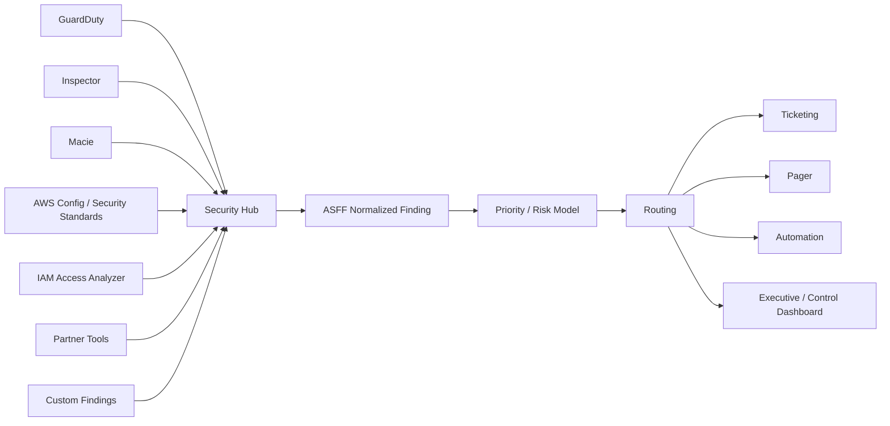
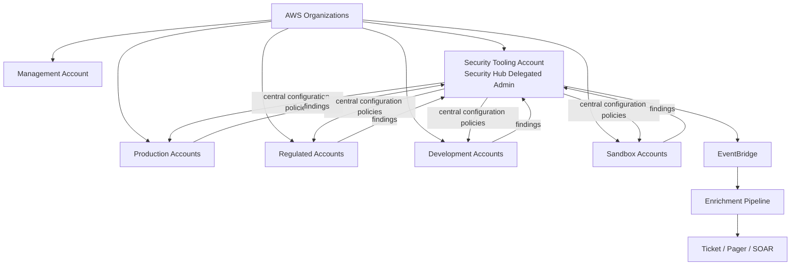
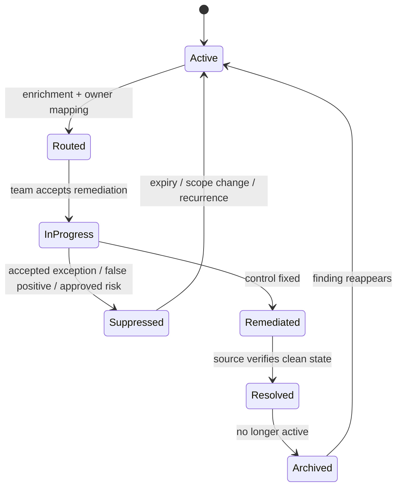
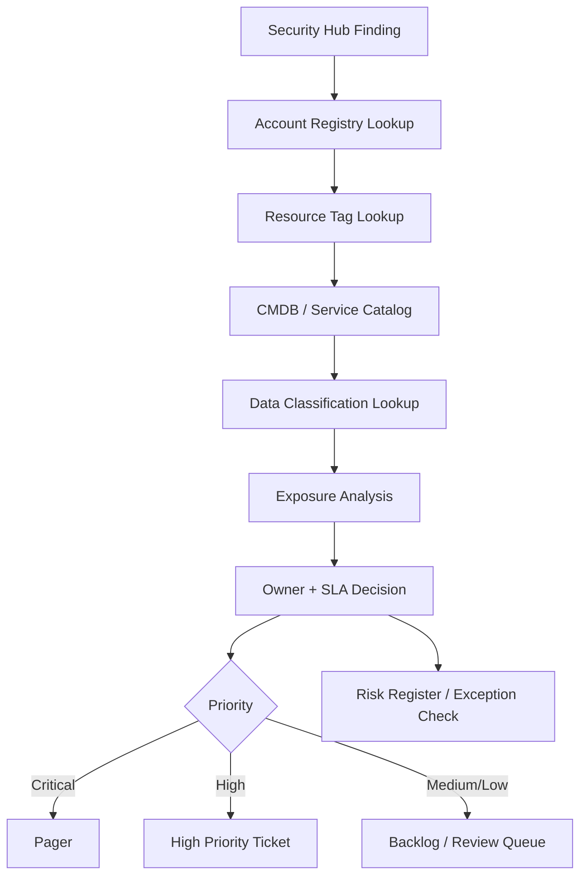
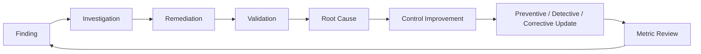

# Part 042 — Security Hub as Risk Correlation Layer

Security Hub is often misunderstood as “the AWS security dashboard”. That framing is too weak.

The stronger mental model:

> Security Hub is a normalized finding plane and cloud security posture correlation layer.

It receives security findings from AWS services, partner integrations, and its own standards/controls, normalizes them into a common shape, helps correlate risk, and provides a central place to route posture and threat signals into operations.

Security Hub should not be the final destination for findings. It should be the **junction** between detection, posture, ownership, and response.



Security Hub does not replace incident response, compliance management, vulnerability management, or SIEM. It provides a normalized control and finding layer that those systems can consume.

---

## 1. What Problem Security Hub Solves

Without Security Hub, every security service emits its own shape of data.

GuardDuty findings look different from Inspector findings. Macie findings look different from Config rule evaluations. Partner findings have their own schemas. Custom controls may produce entirely different payloads.

That creates operational fragmentation:

```text
Different schemas
Different severity models
Different resource identifiers
Different lifecycle states
Different account/Region handling
Different duplicate behavior
Different routing logic
Different dashboards
```

Security Hub solves part of this by normalizing findings into **AWS Security Finding Format**.

That gives the organization a common object to reason about:

```text
finding id
product / generator
account
Region
resource
severity
compliance status
workflow status
record state
timestamps
remediation guidance
network / malware / vulnerability / process details
```

The point is not that ASFF is perfect. The point is that it becomes a workable contract between security telemetry and operational response.

---

## 2. Security Hub as a Finding Router, Not a Human Queue

A weak implementation uses Security Hub like this:

```text
Open Security Hub console.
Sort findings by severity.
Manually click around.
Maybe export CSV before audit.
```

A production implementation uses Security Hub like this:

```text
Normalize findings.
Correlate findings with account/resource/business context.
Apply severity and ownership policy.
Route to the correct team.
Suppress known accepted findings with governance.
Trigger remediation where safe.
Generate evidence for audit and control review.
Measure aging, SLA, recurrence, and control health.
```

Security Hub is not where findings go to die. It is where findings become governable.

---

## 3. Core Concepts

| Concept | Meaning | Engineering Consequence |
|---|---|---|
| Finding | A security-relevant observation | Must have owner, severity, lifecycle, and closure criteria. |
| ASFF | Common finding schema | Enables shared routing/enrichment logic. |
| Product | Source system that created/imported finding | Determines trust level and playbook. |
| Standard | Set of security requirements mapped to controls | Drives posture assessment. |
| Control | Specific check against resource/account state | Must map to risk and remediation. |
| Aggregation Region | Region where findings can be aggregated | Simplifies central operations. |
| Delegated admin | Organization-level management account for Security Hub | Avoids daily use of management account. |
| Central configuration | Organization-level configuration of Security Hub, standards, controls | Reduces drift across accounts/Regions. |
| Suppression | Hiding selected findings from active workflow | Must be governed as exception. |

---

## 4. Security Hub Architecture in a Multi-Account Organization

In production, Security Hub should be managed centrally from a delegated administrator account.



The delegated administrator should own:

```text
Security Hub enablement policy
standards and control baseline
central configuration policies
cross-Region aggregation
integration registration
suppression governance
finding routing
metrics and reporting
```

Workload teams should own:

```text
resource remediation
exception justification
service-specific fixes
application-level evidence
post-remediation validation
```

This separation is important. Security owns the control system. Application teams own the resources that violate controls.

---

## 5. Standards and Controls

Security Hub CSPM includes security standards. A standard is a collection of requirements mapped to controls. Controls evaluate AWS resources or account settings and generate findings.

Examples of standard categories include:

```text
AWS foundational best-practice controls
industry benchmark controls
regulatory or compliance-oriented controls
custom organizational controls through imported findings or adjacent control systems
```

The operating mistake is enabling every standard without mapping ownership.

A control must answer:

```text
What risk does this represent?
Which account/resource classes does it apply to?
Who owns remediation?
What is the SLA?
What evidence proves closure?
When is exception acceptable?
Is it preventive, detective, or corrective?
```

### Control interpretation example

Suppose a control flags public S3 bucket exposure.

Bad response:

```text
Security Hub says S3 control failed. Please fix.
```

Good response:

```text
Control: S3 public access block disabled
Risk: public data exposure
Account: prod-customer-data
Resource: arn:aws:s3:::example-customer-data
Classification: regulated personal data
Owner: data-platform
SLA: 4 hours
Required remediation: enable account/bucket public access block unless exception exists
Evidence: Config item showing block enabled, Security Hub finding resolved, CloudTrail event for change
Exception path: requires data owner + security approval, max 7 days, compensating CloudFront/OAC or explicit deny policy
```

Security Hub is useful only when controls are translated into operational contracts.

---

## 6. AWS Security Finding Format as Contract

ASFF matters because it gives you a common shape for automation.

A simplified ASFF mental model:

```text
Id
ProductArn
GeneratorId
AwsAccountId
Region
Types
FirstObservedAt
LastObservedAt
CreatedAt
UpdatedAt
Severity
Title
Description
Resources
Compliance
Workflow
RecordState
Remediation
ProductFields
```

You do not need to memorize every ASFF field. You need to know which fields are stable enough for automation and which require product-specific interpretation.

Automation-safe fields usually include:

```text
AwsAccountId
Region
ProductArn / ProductName
GeneratorId
Severity.Normalized or Severity.Label
Resources[].Type
Resources[].Id
Compliance.Status
Workflow.Status
RecordState
UpdatedAt
```

Be careful with free-form fields such as title and description. They are useful for humans, but brittle for policy logic.

---

## 7. Finding Lifecycle

A finding lifecycle is separate from the underlying resource state.



You need to distinguish at least four states:

| State Dimension | Meaning |
|---|---|
| Detection state | Does the source still observe the issue? |
| Workflow state | What has the response team done with it? |
| Compliance state | Does the control pass or fail? |
| Risk acceptance state | Is the risk accepted, rejected, expired, or under review? |

Confusing these states causes bad reporting.

For example:

```text
A finding can be suppressed but still risky.
A finding can be resolved by the source but still require post-incident work.
A control can be compliant now but still reveal a process failure if it was non-compliant for 30 days.
A duplicate-looking finding may represent a recurring failure mode, not noise.
```

---

## 8. Prioritization Model

Raw severity is not enough.

Security Hub should feed a priority calculation that considers business and exposure context.

```text
Priority = Finding Severity
         × Environment Criticality
         × Resource Criticality
         × Data Sensitivity
         × Internet Exposure
         × Privilege Level
         × Exploitability
         × Recurrence
         × Compensating Controls
```

Example model:

| Signal | Context | Priority |
|---|---|---|
| Failed CIS control in sandbox | No sensitive data, isolated | Low |
| Same failed control in production | Customer data, internet-facing | High |
| GuardDuty credential finding in prod | Privileged role, unusual source | Critical |
| Inspector critical CVE | Internal-only unused package | Medium until exploitability proven |
| Macie sensitive data finding | Public bucket, personal data | Critical |

The goal is not to create a mathematically perfect score. The goal is to stop treating all findings of the same vendor severity as operationally equal.

---

## 9. Enrichment Pipeline

Security Hub findings become useful when enriched.

A typical enrichment pipeline:



Minimum enrichment fields:

```text
service owner
technical owner
environment
OU/account class
resource criticality
data classification
internet exposure
last changed by
IaC owner/repository
existing exception status
remediation runbook link
```

Without enrichment, security teams become manual routers. That does not scale.

---

## 10. Ownership Model

Findings need owners. “Security team owns all findings” is usually wrong.

Better split:

| Responsibility | Owner |
|---|---|
| Security Hub platform and configuration | Security platform team |
| Standards baseline | Security governance + platform |
| Control interpretation | Security architecture/risk |
| Resource remediation | Workload/resource owner |
| Vulnerability patching | Workload/platform owner depending layer |
| Exception approval | Risk owner + security |
| Evidence collection | Automated pipeline + owner confirmation |
| Metrics/reporting | Security operations/governance |

If the account and resource registry cannot map a finding to an owner, that is itself a governance defect.

Create a meta-control:

```text
Every production account and every routable resource must have owner metadata sufficient to route security findings.
```

---

## 11. Suppression and Exception Governance

Suppression is not deletion. It is a statement that an active finding should not appear in normal workflow under specific conditions.

A suppression rule must include:

```text
finding source
generator/control id
account / OU / Region scope
resource scope
reason
owner
risk acceptance reference
expiration date
compensating control
audit evidence
review cadence
```

Bad suppression:

```text
Suppress all IAM password policy findings because we use SSO.
```

Better suppression:

```text
Suppress IAM password policy findings only in accounts where no IAM users are allowed by SCP, IAM Identity Center is the approved human access path, root is MFA protected, and Access Analyzer confirms no active IAM users except break-glass exceptions. Review quarterly.
```

Suppression should encode reality, not hide laziness.

---

## 12. Central Configuration Strategy

Central configuration reduces drift across accounts and Regions.

A mature organization uses configuration policies by account class:

| Account Class | Security Hub Policy |
|---|---|
| Security Tooling | Full visibility, strict controls, no self-management. |
| Log Archive | Strict tamper/evidence controls, limited integrations. |
| Production | Full baseline standards, high severity routing. |
| Regulated | Production baseline + regulatory control overlays. |
| Development | Baseline controls, reduced SLA, tuned noise handling. |
| Sandbox | Cost-aware controls, strong guardrails for public exposure and crypto-mining. |
| Transitional | Temporary policy with migration deadline. |
| Exception OU | Explicitly reviewed controls with risk acceptance. |

Policy design questions:

```text
Which standards are mandatory everywhere?
Which controls differ by environment?
Which accounts are centrally managed vs self-managed?
Which Region is the aggregation Region?
How are new accounts enrolled?
How are disabled controls justified?
How are control updates reviewed when AWS changes a standard?
```

---

## 13. Security Hub and AWS Config

Many Security Hub CSPM controls depend on AWS Config evaluations. That means Security Hub posture accuracy depends on Config health.

If Config is disabled, mis-scoped, not recording required resources, or broken in a Region, Security Hub posture can lie by omission.

Operational invariant:

```text
Security Hub posture controls require AWS Config recorder health to be monitored as a first-class dependency.
```

Checklist:

```text
[ ] Config enabled in governed accounts and Regions.
[ ] Required resource types recorded.
[ ] Delivery channel healthy.
[ ] Aggregator configured if needed.
[ ] Config costs monitored.
[ ] Security Hub prerequisite checks pass.
[ ] Controls relying on Config are not treated as reliable if Config is unhealthy.
```

---

## 14. Integration With Other Services

Security Hub works best as a correlation layer.

| Source | Finding Type | Security Hub Role |
|---|---|---|
| GuardDuty | Threat detection | Normalize and route security incidents. |
| Inspector | Vulnerabilities | Route by workload owner and exploitability context. |
| Macie | Sensitive data exposure | Combine data sensitivity with exposure and access path. |
| IAM Access Analyzer | External/unused access | Route permission risk and least-privilege improvements. |
| Config/Security Standards | Posture controls | Track compliance and control health. |
| Partner tools | External findings | Normalize third-party signals. |
| Custom controls | Organization-specific risks | Bring internal governance into same workflow. |

Do not use Security Hub as a dumping ground. Every integrated product should have a routing policy and closure criteria.

---

## 15. Automation Patterns

### 15.1 Safe automatic remediation

Some findings can be safely remediated automatically.

Examples:

```text
Disable public access block violation on non-exempt S3 bucket.
Re-enable CloudTrail where protected by policy and expected to be on.
Revert security group ingress from 0.0.0.0/0 on forbidden ports.
Tag and quarantine suspicious EC2 instance in sandbox.
Archive duplicate low-risk findings after ticket linkage.
```

### 15.2 Human-gated remediation

Some findings require approval.

Examples:

```text
Disable production IAM role.
Rotate customer-facing database credentials.
Terminate stateful EC2 instance.
Modify critical security group used by legacy application.
Change KMS key policy.
Block cross-account resource policy used by business partner.
```

### 15.3 Never automate blindly

Do not auto-remediate when:

```text
business impact is unknown
resource ownership is unknown
data loss is possible
evidence would be destroyed
finding confidence is low
control exception may exist
remediation could create outage larger than current risk
```

Automation should be encoded as a safe-action catalog.

---

## 16. Metrics That Matter

Security Hub dashboards should not stop at “number of findings”.

Useful metrics:

```text
critical findings by age
high findings beyond SLA
findings by account class
findings by owner
recurring findings by control id
top failing controls
mean time to acknowledge
mean time to remediate
suppressed findings nearing expiry
findings with no owner
controls disabled by policy
Config-dependent controls with unhealthy Config
exceptions by business unit
```

Bad metric:

```text
We reduced total findings by 80%.
```

Better metric:

```text
We reduced production high-risk public exposure findings older than 7 days from 43 to 2, without increasing suppressed exceptions.
```

Reduction by suppression is not improvement unless risk is actually accepted and controlled.

---

## 17. Failure Modes

| Failure Mode | Consequence | Prevention |
|---|---|---|
| Security Hub enabled manually per account | Drift and blind spots | Organization central configuration. |
| No delegated admin | Management account overused | Dedicated security tooling account. |
| Standards enabled without owner mapping | Backlog explosion | Control-to-owner registry. |
| Findings not enriched | Manual routing bottleneck | Enrichment pipeline. |
| Severity used without context | Wrong prioritization | Composite priority model. |
| Suppression rules broad/permanent | Hidden risk | Scoped expiring exceptions. |
| Config unhealthy | False sense of compliance | Monitor Config as dependency. |
| No ticket integration | Console-only findings | EventBridge/SOAR/ticketing. |
| Auto-remediation unsafe | Outage | Safe-action catalog and approval gates. |
| No recurrence analysis | Same issue repeats | Control improvement backlog. |
| Disabled controls undocumented | Audit failure | Control exception registry. |

---

## 18. Example: Public S3 Finding Flow

A Security Hub control detects a public S3 bucket configuration in production.

### Raw finding

```text
Product: Security Hub CSPM
Control: S3 public access control
Account: prod-data
Resource: arn:aws:s3:::customer-export-prod
Severity: High
Compliance: FAILED
```

### Enrichment

```text
Environment: production
Data classification: confidential / regulated
Owner: data-platform
IaC repo: github.com/example/data-platform-infra
Recent change: bucket policy modified 12 minutes before finding
Macie status: sensitive data discovered in prefix /exports/
Public exposure: yes
Exception: none
```

### Priority

```text
Raw severity: High
Context: regulated data + public exposure + recent policy change
Operational priority: Critical
```

### Response

```text
1. Page data-platform on-call and security incident lead.
2. Apply emergency public access block if safe.
3. Preserve CloudTrail, Config timeline, S3 data events.
4. Identify principal that changed policy.
5. Determine object access during exposure window.
6. Rotate exposed credentials if any pre-signed URL or access path involved.
7. File post-incident action to prevent IaC drift or policy bypass.
8. Close finding only after Security Hub passes and exposure window is documented.
```

Security Hub is the junction. The real work is the response system around it.

---

## 19. Example: Inspector Critical CVE Finding Flow

A critical vulnerability appears on an EC2 instance.

Bad response:

```text
Patch all critical vulnerabilities immediately.
```

Better response:

```text
Instance criticality: production payment worker
Internet exposure: no direct ingress
Privilege: instance role can read payment queue and decrypt KMS data
Exploitability: package reachable through uploaded file parser
Image lineage: shared AMI used by 48 instances
Compensating controls: WAF irrelevant, network internal only
Priority: High / Critical depending exploit activity
```

Response may include:

```text
patch golden image
redeploy fleet
validate package version
check whether workload was exploited
search GuardDuty and application logs for related behavior
update image build pipeline control
```

Security Hub should connect the vulnerability finding to deployment ownership and fleet management. Otherwise vulnerability findings become endless noise.

---

## 20. Control Improvement Loop

Every meaningful finding should feed a control improvement loop.



Examples:

| Finding | Root Cause | Control Improvement |
|---|---|---|
| Public security group ingress | Manual console change | SCP/IAM deny + Config remediation + IaC drift alert. |
| Repeated unencrypted bucket | Missing module default | Terraform module requires encryption and public access block. |
| IAM wildcard policy | Platform team template issue | Permission boundary and policy validation in CI. |
| Macie sensitive data in wrong bucket | No data classification gate | Data routing policy and upload-time classification. |
| GuardDuty credential finding | Long-lived key leaked | Eliminate IAM user key, enforce temporary credentials. |

The best finding is not one that gets closed fast. The best finding is one that cannot recur through the same path.

---

## 21. Production Readiness Checklist

```text
[ ] Security Hub delegated administrator configured.
[ ] Central configuration enabled for organization accounts/OUs.
[ ] Aggregation Region selected and documented.
[ ] Mandatory standards and controls mapped by account class.
[ ] AWS Config prerequisites healthy in all governed accounts/Regions.
[ ] GuardDuty, Inspector, Macie, IAM Access Analyzer, and custom sources integrated as appropriate.
[ ] ASFF fields used consistently for automation.
[ ] Enrichment pipeline maps account/resource to owner and context.
[ ] Severity-to-priority model defined.
[ ] Critical/high findings route to ticket/pager/SOAR.
[ ] Suppression rules are scoped, expiring, and approved.
[ ] Disabled controls are documented as exceptions.
[ ] SLA metrics measured by owner, account class, and control.
[ ] Recurring findings trigger control improvement backlog.
[ ] Executive dashboard separates risk reduction from suppression.
```

---

## 22. The Core Lesson

Security Hub is not a magic security brain. It is a correlation layer.

The mature pattern is:

```text
Detection + Posture Findings -> ASFF -> Enrichment -> Priority -> Owner -> Response -> Evidence -> Control Improvement
```

The immature pattern is:

```text
Enable standards -> Accumulate thousands of findings -> Export CSV -> Panic before audit
```

Top-tier AWS teams use Security Hub to make findings governable. They treat every finding as part of a lifecycle: source, context, owner, remediation, exception, validation, evidence, and systemic improvement.

---

## References

- AWS Security Hub User Guide — Introduction to AWS Security Hub CSPM
- AWS Security Hub User Guide — AWS Security Finding Format
- AWS Security Hub User Guide — Creating and updating findings
- AWS Security Hub User Guide — Central configuration
- AWS Security Hub User Guide — Standards reference
- AWS Security Hub User Guide — Control reference
- AWS Security Hub User Guide — AWS Config prerequisites
- AWS Security Reference Architecture
- AWS Well-Architected Framework — Security Pillar
