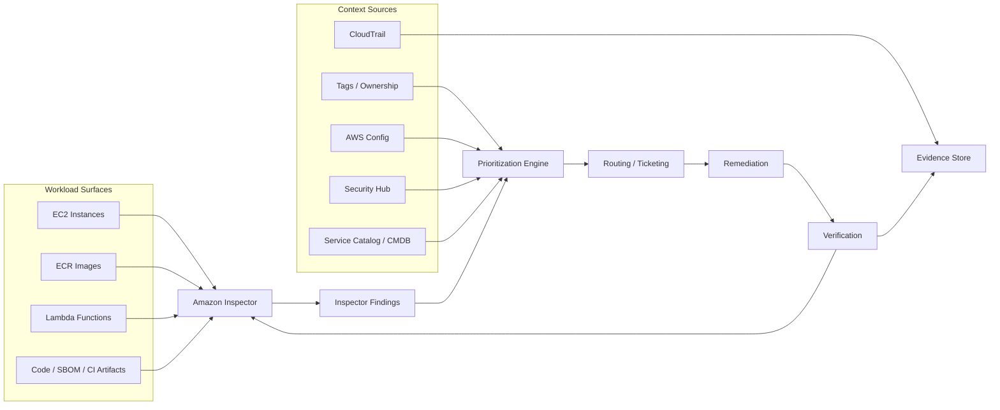
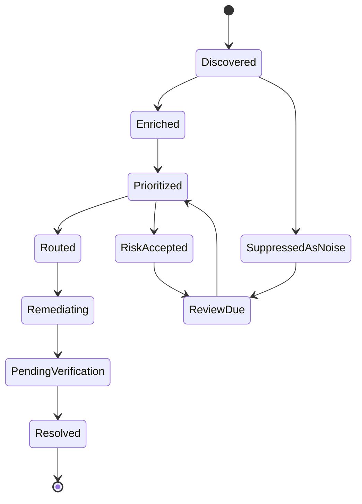
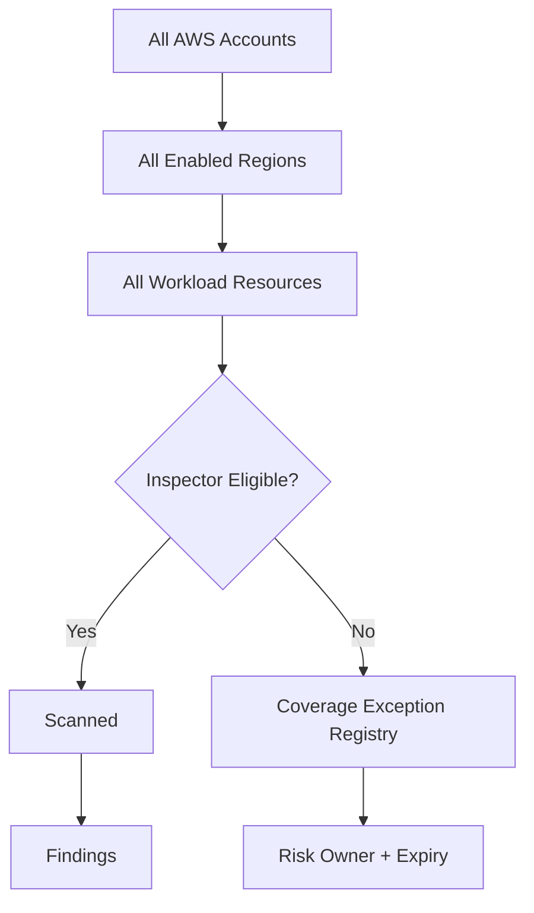
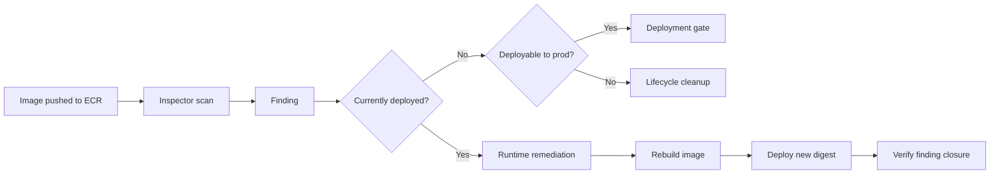
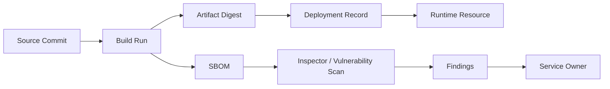
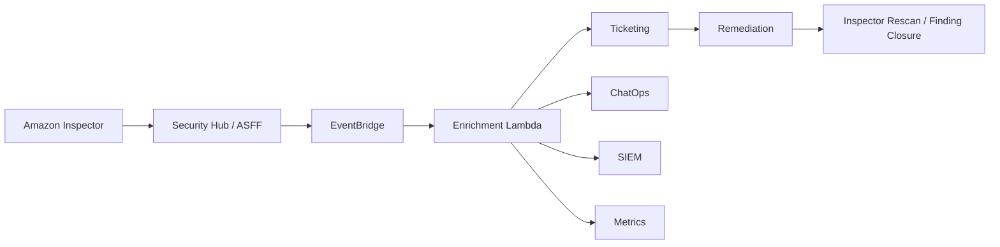
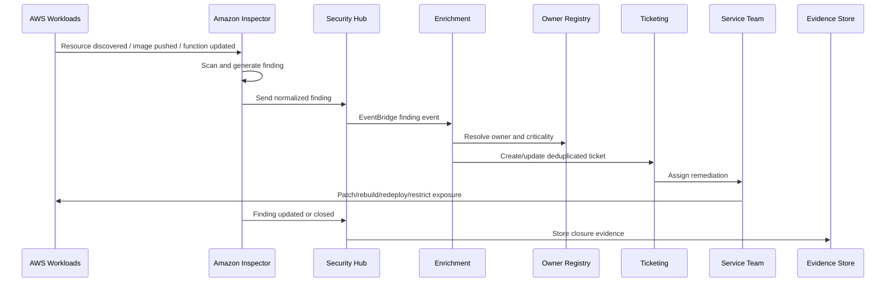

# Part 043 — Inspector Vulnerability Management

Vulnerability management di AWS bukan aktivitas “scan lalu kirim CSV ke engineer”. Itu model lama. Di cloud, aset berubah cepat, container image berganti tiap deploy, Lambda package berganti tiap release, EC2 bisa muncul/hilang otomatis, dan exposure bisa berubah karena security group, route, endpoint, atau public IP. Kalau vulnerability management masih berbasis inventory manual, hasilnya hampir pasti salah.

Amazon Inspector harus dipahami sebagai **continuous vulnerability intelligence layer** untuk workload AWS. Ia menghubungkan resource discovery, package/software vulnerability, container image vulnerability, Lambda dependency/code risk, network exposure, finding severity, exploit signal, fix availability, owner routing, remediation SLA, dan evidence.

Tujuan part ini: membuat kamu bisa mendesain vulnerability management yang bisa dipakai oleh security team, platform team, dan service owner tanpa berubah menjadi ticket noise machine.

---

## 1. Mental Model: Vulnerability Is Not a Finding; It Is an Unresolved System State

Finding hanya representasi. Risiko sebenarnya adalah state:

```txt
resource X menjalankan component Y versi Z
component Y versi Z punya weakness atau CVE tertentu
resource X reachable dalam konteks tertentu
resource X dimiliki oleh service/team tertentu
resource X punya business criticality tertentu
fix tersedia atau belum tersedia
risk accepted atau belum accepted
status sudah diverifikasi atau belum diverifikasi
```

Jadi vulnerability management bukan “jumlah critical findings”. Yang penting adalah:

1. **asset coverage** — apakah semua asset yang relevan discan?
2. **risk prioritization** — mana yang benar-benar harus diperbaiki dulu?
3. **ownership** — siapa yang bertanggung jawab?
4. **remediation path** — apa tindakan teknisnya?
5. **verification** — apakah finding benar-benar hilang setelah perbaikan?
6. **evidence** — apakah organisasi bisa membuktikan SLA dan keputusan risk acceptance?

Kalau salah satu hilang, kamu punya dashboard, bukan vulnerability management system.

---

## 2. What Amazon Inspector Actually Gives You

Amazon Inspector adalah managed vulnerability management service yang melakukan discovery dan scanning secara continuous untuk beberapa jenis workload AWS. Cakupan utama yang perlu kamu modelkan:

| Surface | Apa yang diperiksa | Output utama |
|---|---|---|
| EC2 | OS/package vulnerabilities, network reachability, CIS-style host configuration checks pada skenario yang didukung | CVE findings, network exposure findings, CIS findings |
| ECR container images | Package vulnerabilities di image container | Image vulnerability findings |
| Lambda | Dependency/package vulnerabilities, dan pada fitur tertentu code vulnerability analysis | Lambda vulnerability findings |
| Code/artifact scanning path | SBOM/code/artifact-related scanning pada flow yang didukung | Pre-runtime vulnerability signal |
| Network exposure | Reachability/intentional exposure yang tidak diinginkan | Exposure findings |

Kata pentingnya: **continuous** dan **asset-aware**. Inspector tidak seharusnya dipakai sebagai scanner sekali jalan setelah audit. Ia menjadi bagian dari sistem operasi keamanan harian.

---

## 3. Inspector in the Security Architecture

Inspector berada di antara asset inventory, software supply chain, runtime posture, dan risk workflow.



Inspector sendiri menghasilkan signal. Sistem yang matang menambahkan konteks:

- `service_name`
- `owner_team`
- `environment`
- `data_classification`
- `internet_exposed`
- `business_criticality`
- `runtime_reachability`
- `fix_available`
- `exploit_available`
- `exception_status`
- `deployment_path`

Tanpa konteks ini, semua critical terlihat sama. Dalam sistem besar, itu tidak berguna.

---

## 4. The Vulnerability Lifecycle

Gunakan lifecycle ini sebagai invariant operasional:



Setiap transisi harus punya event dan owner.

| State | Pertanyaan yang harus dijawab |
|---|---|
| Discovered | Inspector menemukan apa, pada resource apa, kapan? |
| Enriched | Resource ini milik siapa, environment apa, data apa, exposed atau tidak? |
| Prioritized | Apakah ini urgent, high, backlog, atau false/accepted? |
| Routed | Ticket/alert dikirim ke tim yang benar? |
| Remediating | Patch/image/package/config change sedang dilakukan? |
| PendingVerification | Sudah deploy, tinggal menunggu scan ulang? |
| Resolved | Finding hilang atau resource tidak lagi vulnerable? |
| RiskAccepted | Ada alasan bisnis/teknis, expiry date, dan approver? |
| ReviewDue | Acceptance sudah kadaluarsa dan harus dievaluasi ulang? |

Anti-pattern utama: finding dibuat, ticket dibuat, lalu tidak ada state machine. Hasilnya backlog ribuan ticket yang tidak lagi dipercaya engineer.

---

## 5. Inspector Finding Anatomy

Secara operasional, finding harus dibaca sebagai struktur data, bukan sekadar severity label.

Bidang yang biasanya penting:

| Field | Mengapa penting |
|---|---|
| Finding ARN/ID | Stable reference untuk deduplication dan evidence |
| Account/Region | Boundary ownership dan delegated admin |
| Resource type | EC2, ECR image, Lambda, package, network exposure |
| Resource ID | Target remediation |
| Package/component | Apa yang harus dipatch/diupgrade |
| Installed version | Versi vulnerable saat ini |
| Fixed version | Versi minimum untuk remediation jika tersedia |
| CVE/CWE | Weakness/vulnerability identity |
| CVSS | Technical severity baseline |
| EPSS/exploit signals | Likelihood/exploitability enrichment jika tersedia |
| Fix available | Apakah path remediation jelas? |
| First observed | SLA clock start |
| Last observed | Apakah masih aktif? |
| Updated at | Apakah metadata risiko berubah? |
| Status | Active, suppressed, closed, atau sejenisnya |

Jangan memakai `severity` saja sebagai basis SLA. Severity adalah input, bukan keputusan final.

---

## 6. Coverage First: No Coverage, No Security

Sebelum membahas remediation SLA, pastikan coverage. Pertanyaan yang harus bisa dijawab:

1. Berapa banyak EC2 yang eligible tetapi tidak discan?
2. Berapa banyak ECR repository yang tidak masuk scanning policy?
3. Berapa banyak Lambda function yang tidak discan karena runtime/package/region/permission constraint?
4. Apakah semua account dan region sudah enabled?
5. Apakah delegated administrator sudah aktif untuk organization?
6. Apakah resource baru otomatis masuk coverage?
7. Apakah finding dikirim ke Security Hub/SIEM/ticketing?

Coverage gap lebih berbahaya daripada critical finding, karena ia menciptakan ilusi aman.



Coverage harus menjadi dashboard sendiri, terpisah dari vulnerability count.

---

## 7. EC2 Vulnerability Management

EC2 adalah surface paling klasik, tetapi juga paling mudah salah.

### 7.1 EC2 Questions

Untuk setiap EC2 instance, sistem harus tahu:

- OS dan version apa?
- Package manager apa?
- Apakah instance managed oleh SSM?
- Apakah instance stopped/running?
- Apakah instance ephemeral atau long-lived?
- Apakah instance internet-exposed?
- Apakah instance memegang high-privilege instance profile?
- Apakah instance memproses sensitive data?
- Apakah patching dilakukan in-place atau via immutable image replacement?

### 7.2 Patch Strategy: In-Place vs Immutable

Ada dua pola besar.

#### In-place patching

Cocok untuk:

- fleet tradisional
- stateful server
- third-party appliance
- instance yang tidak mudah direbuild

Risiko:

- configuration drift
- patch rollback sulit
- instance lama tetap hidup bertahun-tahun
- remediation evidence sering manual

#### Immutable replacement

Cocok untuk:

- ASG-backed service
- golden AMI pipeline
- container host
- stateless workload

Risiko:

- butuh image pipeline matang
- butuh deployment automation
- perlu capacity dan rollback strategy

Production-grade policy:

```txt
If EC2 is stateless and ASG-backed, prefer immutable replacement.
If EC2 is stateful or appliance-like, use SSM Patch Manager with explicit maintenance windows and verification.
No unmanaged EC2 is allowed in production without documented exception.
```

### 7.3 EC2 Prioritization Rules

Contoh scoring:

| Condition | Priority impact |
|---|---|
| Critical CVE + exploit available + public exposure | P0/P1 |
| Critical CVE + privileged instance role | P1 |
| Critical CVE + no fix available | Compensating control path |
| High CVE + internal only + no sensitive data | P2/P3 |
| Medium CVE + ephemeral dev instance | Backlog or scheduled patch |
| Stopped instance with finding | Validate lifecycle; terminate or patch before start |

Jangan menganggap stopped instance otomatis aman. Ia masih bisa menjadi risk jika dapat dinyalakan ulang dengan vulnerable state.

---

## 8. ECR Container Image Vulnerability Management

Container vulnerability management punya karakter berbeda. Resource yang vulnerable bisa berupa image yang belum pernah dijalankan, image lama yang masih ada di registry, image yang sedang berjalan di ECS/EKS, atau image base layer yang dipakai banyak service.

### 8.1 The Important Distinction

```txt
image exists != image deployed
image vulnerable != runtime risk high
image old != irrelevant
image unused != safe if pullable by production role
```

Prioritization harus tahu apakah image:

- baru dipush
- currently deployed
- deployable ke production
- berasal dari base image bersama
- memiliki fix available
- punya exploit available
- dipakai oleh service critical

### 8.2 ECR Finding Lifecycle



### 8.3 Good Container Policy

```txt
Critical exploitable vulnerability in running production image must trigger urgent remediation.
Critical vulnerability in non-running image must block future production deployment unless accepted.
Old images not needed for rollback must be expired.
Base image owners must be separate from application owners but both must receive impact data.
```

### 8.4 Anti-Patterns

| Anti-pattern | Consequence |
|---|---|
| Treat every image finding equally | Massive noise |
| Ignore unused images forever | Registry becomes vulnerability graveyard |
| Patch only app dependencies but not base image | OS-layer risk remains |
| Rebuild image but do not redeploy | Finding remains in runtime |
| Tag-based deployment without digest evidence | You cannot prove what version ran |

For production, record image digest in deployment metadata. Tags are mutable labels; digests are evidence.

---

## 9. Lambda Vulnerability Management

Lambda shifts vulnerability management from host patching to dependency, runtime, permission, and packaging discipline.

Important questions:

- Runtime version supported?
- Dependencies vulnerable?
- Layer vulnerable?
- Function has excessive execution role permission?
- Function handles sensitive data?
- Function has public or cross-account invocation path?
- Function code/package generated by which pipeline?
- Is the finding in dependency, code, or configuration context?

Lambda remediation biasanya:

1. upgrade dependency
2. upgrade runtime
3. rebuild package
4. publish new version
5. move alias/traffic
6. verify Inspector finding closure
7. remove vulnerable layer/function version if no longer needed

### 9.1 Lambda Layer Risk

Layer adalah dependency distribution mechanism. Ia juga bisa menjadi vulnerability distribution mechanism.

Kalau satu layer dipakai 200 function dan layer itu vulnerable, ownership harus jelas:

- siapa pemilik layer?
- siapa pemilik function?
- apakah layer patch otomatis aman?
- apakah function perlu redeploy untuk mengambil layer version baru?
- apakah old layer version masih referenced?

### 9.2 Lambda Code Findings

Untuk code-level findings, remediation lebih dekat ke secure coding daripada patching. Jangan route semua ke platform team. Route berdasarkan repository ownership.

Contoh:

| Finding nature | Owner |
|---|---|
| Vulnerable dependency | Application team |
| Vulnerable shared layer | Platform/shared library team |
| Weak crypto in code | Application/security engineering |
| Missing encryption logic | Application team + architecture review |
| Runtime deprecated | Application team + platform runtime policy |

---

## 10. CIS Scans and Configuration Hardening

Inspector juga dapat digunakan untuk host configuration checks berbasis CIS Benchmark pada skenario yang didukung. Ini berbeda dari CVE scanning.

| CVE scanning | CIS-style scanning |
|---|---|
| Menjawab “package/version rentan apa?” | Menjawab “konfigurasi host sesuai baseline atau tidak?” |
| Remediation sering upgrade package | Remediation sering hardening config |
| Bisa diprioritaskan dengan exploit/fix signal | Diprioritaskan dengan control criticality |
| Cocok untuk vulnerability SLA | Cocok untuk baseline compliance SLA |

Jangan campur total count CVE dan CIS misconfiguration dalam satu KPI tanpa klasifikasi. Mereka punya owner dan remediation berbeda.

---

## 11. SBOM as Evidence, Not Decoration

Software Bill of Materials berguna jika dipakai untuk keputusan:

- package inventory
- vulnerability correlation
- dependency ownership
- audit evidence
- incident impact analysis
- supplier risk
- build provenance

Inspector mendukung ekspor SBOM dalam format standar seperti CycloneDX dan SPDX pada cakupan yang didukung. Tetapi SBOM bukan silver bullet. SBOM yang tidak dikaitkan ke deployed artifact hanya menjadi dokumen inventaris yang cepat basi.

Production invariant:

```txt
Every production artifact should have a linkable identity:
source commit -> build run -> artifact digest -> SBOM -> deployment record -> runtime resource.
```

Diagram:



Tanpa chain ini, kamu tahu ada vulnerable package, tetapi tidak tahu package itu benar-benar berjalan di mana.

---

## 12. Prioritization Model

Jangan pakai CVSS mentah sebagai satu-satunya prioritas. CVSS menjawab technical severity. Production priority harus menjawab “apa risiko nyata untuk sistem ini sekarang?”.

### 12.1 Inputs

| Input | Example |
|---|---|
| Inspector severity | Critical, High, Medium |
| CVSS score | 9.8 |
| Exploit available | Yes/No |
| Fix available | Yes/No/Partial |
| EPSS or exploit likelihood | Higher/lower likelihood if available |
| Asset exposure | Internet-facing, partner-facing, internal, private |
| Asset criticality | Tier 0, Tier 1, Tier 2 |
| Data classification | regulated, confidential, internal |
| Privilege | admin role, read-only role, no AWS privilege |
| Runtime state | running, deployed, unused, stopped |
| Compensating controls | WAF, network segmentation, egress block, read-only mode |
| Age | first observed date |

### 12.2 Example Decision Matrix

| Finding context | Operational priority |
|---|---|
| Critical + exploit available + internet-exposed prod EC2 | P0/P1 emergency remediation |
| Critical + fix available + running prod Lambda with sensitive data | P1 |
| High + deployed prod image + no public exposure | P2 |
| High + unused image older than rollback window | Clean up, not patch |
| Critical + no fix available + exposed | Mitigate exposure + vendor tracking + risk acceptance |
| Medium + sandbox + no sensitive data | Scheduled backlog |

### 12.3 SLA Example

| Priority | Target response | Target remediation |
|---|---:|---:|
| P0 | immediate | 24 hours or compensating control |
| P1 | same business day | 3–7 days |
| P2 | 2 business days | 14–30 days |
| P3 | backlog triage | 30–90 days |
| Accepted | documented | expiry required |

SLA harus dimulai dari `firstObservedAt` atau saat finding masuk sistem prioritisasi, tergantung policy organisasi. Pilih satu dan konsisten.

---

## 13. Remediation Patterns

### 13.1 EC2

| Cause | Remediation |
|---|---|
| OS package vulnerable | Patch package or replace AMI |
| App dependency vulnerable | Deploy updated app artifact |
| Unsupported OS | Migrate OS/image |
| Network exposure finding | Restrict security group, route, endpoint, public IP, or load balancer policy |
| CIS failure | Apply hardening baseline via SSM/AMI pipeline |

### 13.2 ECR

| Cause | Remediation |
|---|---|
| Base image vulnerable | Rebuild from patched base image |
| App dependency vulnerable | Upgrade dependency and rebuild image |
| Unused vulnerable image | Expire/delete via lifecycle policy after rollback window |
| Running vulnerable image | Rebuild, redeploy, verify runtime digest |

### 13.3 Lambda

| Cause | Remediation |
|---|---|
| Dependency vulnerable | Upgrade dependency and redeploy |
| Layer vulnerable | Publish patched layer version and update functions |
| Runtime old | Upgrade runtime and test compatibility |
| Code vulnerability | Fix code, review pattern, redeploy |

### 13.4 No Fix Available

No fix available bukan berarti no action. Pilihan:

- reduce exposure
- disable feature path
- add WAF/rate-limit control
- restrict egress
- add monitoring/detection
- vendor escalation
- remove component
- risk accept with expiry

Jangan membuat exception tanpa compensating control jika asset exposed dan critical.

---

## 14. Routing Findings to Owners

Finding tanpa owner akan menjadi noise. Ownership harus diambil dari kombinasi:

- AWS account owner
- tags: `Owner`, `Service`, `Environment`, `CostCenter`, `DataClass`
- deployment metadata
- ECR repository mapping
- Lambda function repository mapping
- CMDB/service catalog
- IaC stack owner

Contoh enrichment rule:

```txt
if resource.type == ECR_IMAGE:
  owner = repository.owner or image.label.org.opencontainers.image.source owner
elif resource.type == LAMBDA_FUNCTION:
  owner = tag.ServiceOwner or deployment registry mapping
elif resource.type == EC2_INSTANCE:
  owner = tag.Owner or autoscaling group/service mapping
else:
  owner = account.defaultSecurityContact
```

Jika owner tidak ditemukan, finding harus masuk **ownership defect queue**, bukan hilang.

---

## 15. Inspector + Security Hub + EventBridge

Inspector dapat mengirim findings ke Security Hub. Dari sana, findings bisa distandardisasi, dikorelasikan, dan di-route.



Good rule: Security Hub menjadi correlation layer; jangan biarkan setiap service security membuat ticket langsung tanpa dedup dan prioritization.

---

## 16. Deduplication and Noise Control

Noise biasanya datang dari:

- satu CVE muncul di ribuan image lama
- image tidak berjalan tetap diticket seperti production runtime
- finding closed lalu re-open karena redeploy image lama
- dependency transitive muncul di banyak function
- owner tag salah
- exception tanpa expiry
- false positive tidak punya suppression governance

Dedup key bisa berupa:

```txt
account + region + resource_id + package + vulnerability_id + fixed_version
```

Untuk container, tambahkan digest:

```txt
account + region + repository + image_digest + package + cve
```

Untuk Lambda:

```txt
account + region + function_arn + version_or_alias + dependency + cve
```

Ticket harus mewakili unit kerja yang bisa diperbaiki. Jika 50 findings diselesaikan dengan satu base image rebuild, buat satu ticket untuk base image, bukan 50 ticket untuk aplikasi downstream tanpa konteks.

---

## 17. Exceptions and Risk Acceptance

Exception yang sehat punya struktur:

| Field | Required? | Reason |
|---|---:|---|
| Finding/resource | Yes | Scope harus jelas |
| Owner | Yes | Accountability |
| Business reason | Yes | Menghindari “nanti saja” |
| Compensating control | Usually | Terutama untuk high/critical |
| Expiry date | Yes | Tidak boleh permanen secara diam-diam |
| Approver | Yes | Separation of duty |
| Review history | Yes | Audit evidence |

Exception anti-pattern:

```txt
"Accepted because not exploitable"
```

Kalimat itu belum cukup. Harus ada bukti:

- mengapa tidak exploitable?
- siapa menyimpulkan?
- berdasarkan exposure apa?
- apa yang berubah jika network path berubah?
- kapan dievaluasi ulang?

---

## 18. Metrics That Matter

Jangan pakai “number of findings” sebagai KPI utama. Itu bisa naik karena coverage membaik, bukan security memburuk.

### 18.1 Better Metrics

| Metric | Mengapa penting |
|---|---|
| Coverage percentage by account/resource type | Apakah scanner melihat asset? |
| Critical findings on running prod assets | Risiko nyata |
| Mean time to triage | Kecepatan ownership/prioritization |
| Mean time to remediate by priority | Efektivitas remediation |
| Age of open critical/high findings | Risk accumulation |
| Reopened findings | Regression/redeploy vulnerable artifact |
| Findings with unknown owner | Operating model defect |
| Accepted risks expiring in 30 days | Governance health |
| Critical with fix available but overdue | Execution failure |
| Critical without fix but no compensating control | Risk management failure |

### 18.2 Dashboard Layout

Buat dashboard per audience:

| Audience | View |
|---|---|
| Security leadership | risk trend, overdue, coverage, exceptions |
| Platform team | coverage gap, automation failures, base image impact |
| Service owner | findings by service, SLA, remediation instructions |
| Audit/compliance | evidence, closure, acceptance, control mapping |

---

## 19. Failure Modes

| Failure mode | What happens | Control |
|---|---|---|
| Inspector not enabled in all accounts/regions | Blind spots | Org-wide enablement and coverage monitor |
| Resources missing tags | Findings cannot route | Tagging policy + ownership defect queue |
| Too many stale images | Findings explode | ECR lifecycle + deployment-aware prioritization |
| No remediation ownership | Security team becomes bottleneck | Service ownership registry |
| Suppression without expiry | Real risk hidden | Exception workflow with review date |
| Severity-only SLA | Wrong work prioritized | Context-aware priority model |
| Fix deployed but finding remains | Verification gap | Post-remediation scan/status check |
| Vulnerable image redeployed | Regression | Deployment gate on digest/finding status |
| KMS/logging not configured | Evidence weak | Central logging and audit pipeline |
| No cost control | Scanning becomes politically blocked | Scan scope and lifecycle policy |

---

## 20. Production Reference Workflow



Invariant:

```txt
A finding is not done when a ticket is closed.
A finding is done when the vulnerable state is gone or accepted with explicit, expiring risk ownership.
```

---

## 21. Implementation Checklist

### Organization Setup

- [ ] Inspector delegated administrator configured.
- [ ] All required accounts enrolled.
- [ ] All required regions enabled or explicitly excluded.
- [ ] Security Hub integration enabled.
- [ ] EventBridge routing configured.
- [ ] Central evidence/logging path defined.

### Coverage

- [ ] EC2 coverage dashboard.
- [ ] ECR repository/image coverage dashboard.
- [ ] Lambda coverage dashboard.
- [ ] Unsupported/ineligible resources tracked.
- [ ] Coverage exceptions have owner and expiry.

### Prioritization

- [ ] Priority is not based only on severity.
- [ ] Exposure, exploitability, fix availability, owner, environment, and data class included.
- [ ] SLA defined by priority.
- [ ] Risk acceptance workflow exists.

### Remediation

- [ ] EC2 patch/rebuild path defined.
- [ ] ECR rebuild/redeploy path defined.
- [ ] Lambda dependency/runtime/layer remediation path defined.
- [ ] Deployment gates prevent known-critical regressions.
- [ ] Post-remediation verification automated.

### Governance

- [ ] Findings with unknown owner tracked.
- [ ] Suppression requires reason, approver, and expiry.
- [ ] Metrics reviewed regularly.
- [ ] Exception aging monitored.
- [ ] Critical overdue findings escalated.

---

## 22. Practical Engineering Rules

1. **Scan coverage is a control.** Treat disabled scanning as a security finding.
2. **Findings need context.** Severity without exposure and ownership is insufficient.
3. **Runtime beats registry.** Running vulnerable artifacts usually matter more than unused artifacts.
4. **Fix deployed is not fix verified.** Wait for finding closure or explicit validation.
5. **Old artifacts are liabilities.** Remove images/functions/layers outside rollback needs.
6. **Exceptions must expire.** Permanent exceptions are undocumented policy changes.
7. **Do not make security team the patch team.** They own detection and governance; service owners own remediation.
8. **Never optimize for low finding count.** Optimize for low unresolved risk and high coverage.

---

## 23. What Top-Tier Engineers Should Internalize

Amazon Inspector is not the vulnerability management program. It is the sensing layer.

The program is the system around it:

```txt
discovery -> findings -> enrichment -> prioritization -> ownership -> remediation -> verification -> evidence -> learning
```

A weak team asks:

```txt
How many critical vulnerabilities do we have?
```

A strong team asks:

```txt
Which exploitable vulnerabilities exist on running production assets that are reachable, privileged, sensitive, fixable, and overdue by owner?
```

That second question is the actual operating question.

---

## References

- Amazon Inspector User Guide — What is Amazon Inspector: https://docs.aws.amazon.com/inspector/latest/user/what-is-inspector.html
- Amazon Inspector — Understanding findings: https://docs.aws.amazon.com/inspector/latest/user/findings-understanding.html
- Amazon Inspector — Finding details: https://docs.aws.amazon.com/inspector/latest/user/findings-understanding-details.html
- Amazon Inspector — Security Hub integration: https://docs.aws.amazon.com/inspector/latest/user/securityhub-integration.html
- Amazon Inspector — SBOM export: https://docs.aws.amazon.com/inspector/latest/user/sbom-export.html
- Amazon Inspector — CIS scans for EC2: https://docs.aws.amazon.com/inspector/latest/user/scanning-cis.html
- AWS Security Hub — AWS service integrations: https://docs.aws.amazon.com/securityhub/latest/userguide/securityhub-internal-providers.html
