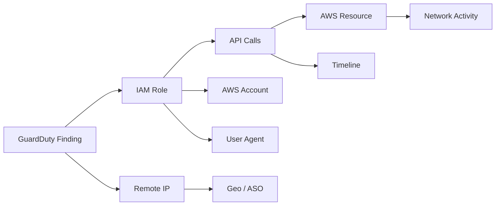
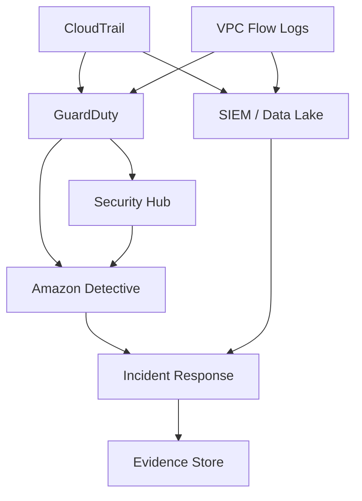
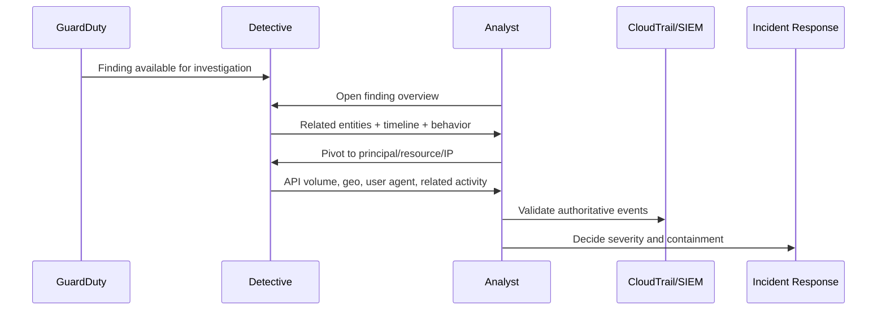
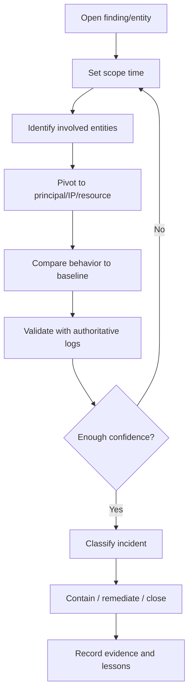
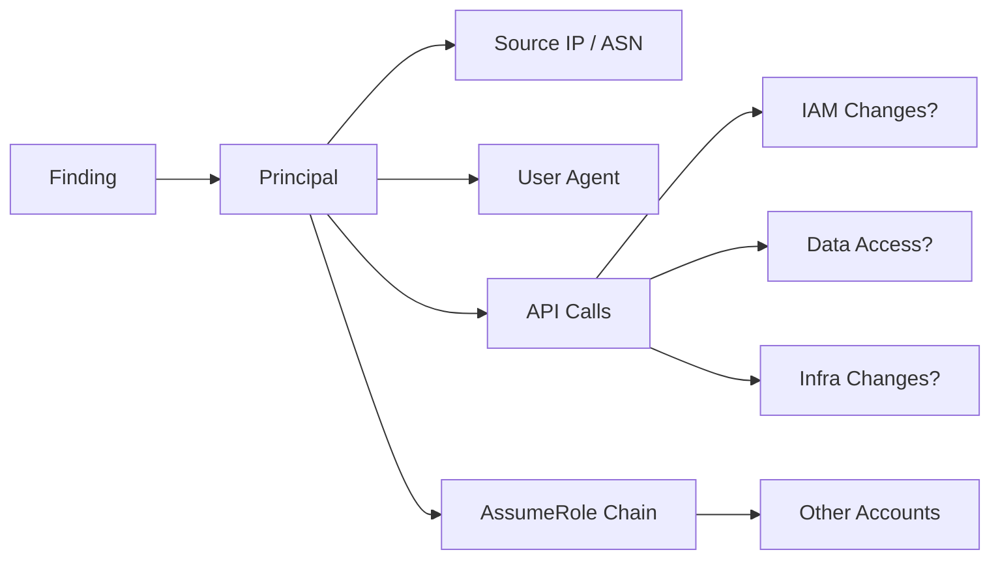
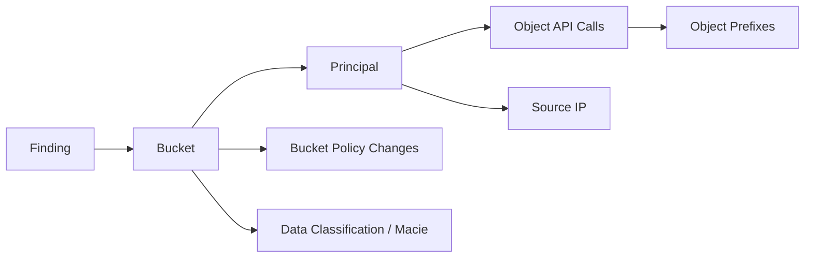
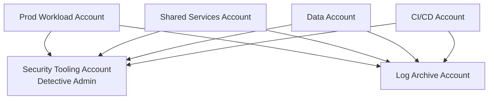
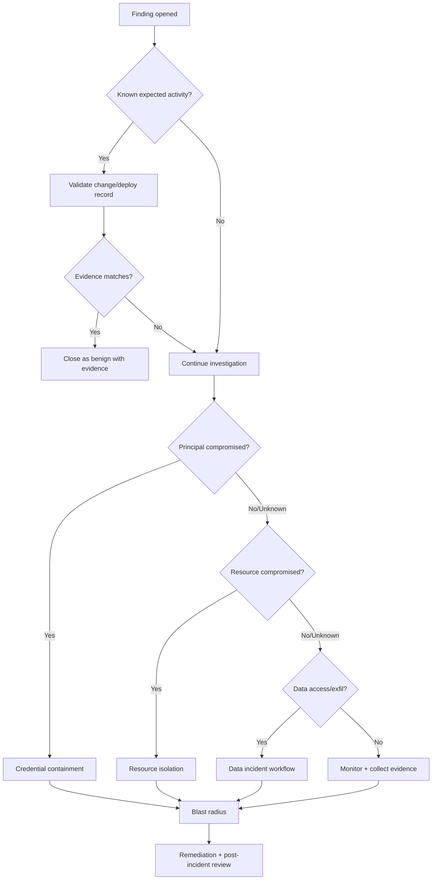
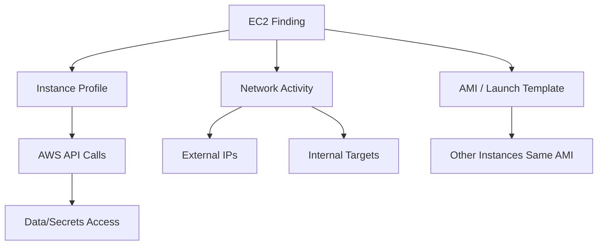
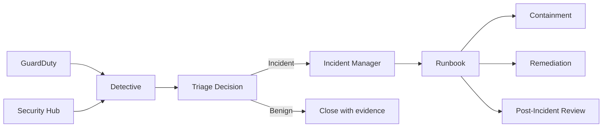

# Part 044 — Detective Investigation Graph

Security detection answers: “something suspicious happened.” Investigation answers: “what happened, how far did it go, what is affected, and what should we do next?”

Amazon Detective exists for the second problem. It builds a behavior graph from AWS telemetry and helps analysts pivot across entities, accounts, IP addresses, roles, resources, API activity, GuardDuty findings, and related signals. Detective is not a replacement for CloudTrail, GuardDuty, Security Hub, or SIEM. It is an **investigation acceleration layer**.

This part explains how to use Detective as an investigation graph, how to reason from finding to entity to timeline, and how to avoid shallow “click-through” investigation.

---

## 1. Mental Model: Investigation Is Graph Reconstruction

An AWS incident is rarely a single event. It is usually a chain:

```txt
identity used -> API called -> resource changed -> network path opened -> data accessed -> persistence created -> evidence altered
```

The investigator needs to reconstruct this chain under uncertainty.

Detective helps by turning telemetry into a graph of entities and relationships.



The key shift:

```txt
From: search logs one query at a time
To: follow relationships between entities over time
```

---

## 2. What Detective Is Good At

Detective is useful when the question is relational:

- What role/user/resource is involved in this GuardDuty finding?
- What else did the same principal do around the finding time?
- Is this activity normal for the entity?
- What IPs, geos, user agents, or API calls are associated?
- Are multiple findings related?
- Which accounts/resources are connected to the same behavior?
- Did a suspicious principal touch sensitive resources?
- Is this isolated noise or part of an attack path?

It is less useful when the question is purely archival or raw query heavy:

- “Give me every event for this account for 365 days.”
- “Run a custom SQL join across all CloudTrail Lake partitions.”
- “Export full evidence package for auditors.”

For that, use CloudTrail Lake, S3/Athena, SIEM, or dedicated data lake pipelines.

---

## 3. Detective in the AWS Security Stack



Role masing-masing:

| Layer | Main purpose |
|---|---|
| CloudTrail | Authoritative API audit events |
| VPC Flow Logs | Network flow evidence |
| GuardDuty | Managed threat detection |
| Security Hub | Finding aggregation and posture correlation |
| Detective | Investigation graph and entity behavior analysis |
| SIEM/Data lake | Long-term search, custom correlation, evidence retention |
| Incident response workflow | Decisions, containment, remediation, communication |

Detective mempercepat reasoning. Ia tidak menggantikan evidence custody.

---

## 4. Behavior Graph

Detective behavior graph adalah linked set of data dari source telemetry yang diingest dari satu atau lebih AWS accounts. Graph ini menghubungkan entities dan aktivitasnya dari waktu ke waktu.

Entity examples:

- AWS account
- IAM role
- IAM user
- Federated principal/session context
- EC2 instance
- EKS/containers where supported by source data
- IP address
- User agent
- API method
- GuardDuty finding
- Security Hub-related finding context

Graph menjawab pertanyaan seperti:

| Entity | Questions |
|---|---|
| Account | API calls apa yang umum/tidak umum? Region/geography apa yang muncul? |
| Role | API apa yang digunakan role ini? Dari user agent/IP mana? |
| IP address | Resource/principal apa yang berinteraksi dengan IP ini? |
| EC2 instance | Network activity, associated finding, suspicious connections |
| Finding | Entity mana yang terlibat, apa timeline-nya, apa related findings? |

---

## 5. Investigation Starts With Scope Time

Salah satu konsep paling penting di Detective adalah **scope time**. Jangan investigasi dengan time window acak.

Mulai dari:

```txt
finding time ± investigation window
```

Lalu perluas jika ditemukan indikasi:

- reconnaissance sebelum finding
- privilege escalation sebelum action utama
- lateral movement setelah compromise
- cleanup/evidence tampering setelah action
- repeated attempts di window lebih panjang

Example:

| Finding type | Initial scope | Expand if |
|---|---:|---|
| Suspicious API call | ± 2 hours | ada role assumption sebelumnya |
| Credential exfiltration suspicion | ± 24 hours | ada anomalous geography/user agent |
| EC2 crypto mining | 24–72 hours | ada outbound traffic sebelum alert |
| S3 exfiltration | ± 6 hours | ada List/GetObject burst atau policy changes |
| Privilege escalation | ± 12 hours | ada IAM policy changes sebelumnya |

Scope terlalu pendek membuat chain hilang. Scope terlalu panjang membuat noise meningkat.

---

## 6. Finding-First Workflow

Typical flow dari GuardDuty finding:



Finding-first is efficient for triage, but dangerous if the analyst stops at the finding page. Always pivot.

---

## 7. Entity-First Workflow

Sometimes investigation starts from a resource or principal, not a finding.

Examples:

- “This IAM role looks overprivileged and used from unusual IP.”
- “This EC2 instance generated suspicious outbound traffic.”
- “This S3 bucket had unusual object access.”
- “This account suddenly called APIs in a new Region.”

Entity-first investigation flow:

```txt
entity -> normal behavior baseline -> anomaly -> related entities -> timeline -> evidence -> decision
```

Questions:

1. What is normal for this entity?
2. What changed in the scope time?
3. Which other entities interacted with it?
4. Did the activity cross account, region, network, or privilege boundary?
5. Does CloudTrail confirm the event sequence?
6. What containment action is safe?

---

## 8. The Investigation Loop

Investigation is iterative.



Mature analysts do not ask “what page should I click next?”. They ask “which hypothesis does this pivot test?”.

---

## 9. Hypothesis-Driven Investigation

Detective becomes powerful when paired with hypotheses.

### Hypothesis examples

| Alert | Hypothesis |
|---|---|
| GuardDuty credential exfiltration | Temporary credentials were used from an unusual ASN/geography |
| Suspicious IAM API calls | Principal attempted privilege escalation or persistence |
| EC2 malware finding | Instance is compromised and communicating externally |
| S3 unusual access | Data exfiltration or unexpected bulk access occurred |
| Recon finding | Attacker enumerated APIs/resources after gaining credentials |

### Each hypothesis needs evidence

Example: credential compromise hypothesis.

Evidence to collect:

- principal ARN/session name/source identity
- first suspicious API event
- source IP / ASN / geo / user agent
- role assumption path
- actions performed after compromise
- resources touched
- attempted failures/denies
- persistence attempts
- data access attempts
- containment action taken

Detective accelerates discovery; CloudTrail and other logs provide authoritative event evidence.

---

## 10. Common Investigation Patterns

## 10.1 IAM Credential Compromise

Symptoms:

- GuardDuty finding involving unusual API calls
- API calls from unexpected geography/ASN
- unfamiliar user agent
- sudden failed calls due to permission boundary/SCP
- IAM policy/list/describe bursts
- access key or session usage outside expected path

Investigation path:



Questions:

1. Is this principal human, workload, or automation?
2. Is the source IP normal for this principal?
3. Is the user agent expected?
4. What was the first suspicious event?
5. Did the principal attempt privilege escalation?
6. Did it create persistence?
7. Did it access data?
8. Did it touch logs/security services?
9. Does the session still exist or can it be revoked/contained?

Containment options:

- deactivate access key
- revoke/limit role session where applicable
- detach/deny permissions
- rotate secrets
- block source network where useful
- quarantine affected workloads
- add temporary SCP for high-risk action class

Do not contain blindly if the principal is production automation. Validate blast radius first unless active damage is clear.

---

## 10.2 EC2 Instance Compromise

Symptoms:

- suspicious outbound traffic
- crypto mining indicators
- command-and-control signal
- unusual port scanning
- GuardDuty EC2 finding
- high CPU/network anomaly

Investigation path:

```txt
finding -> EC2 instance -> network peers -> IAM role -> API calls -> image/AMI -> recent changes -> blast radius
```

Questions:

- What security groups and routes expose the instance?
- What instance profile does it have?
- Did instance credentials call AWS APIs?
- What external IPs did it contact?
- Was there lateral movement to internal IPs?
- What AMI/image is it based on?
- Is the compromise isolated to one instance or replicated across ASG?
- Are logs intact?

Containment options:

- isolate instance security group
- detach from load balancer
- snapshot for forensics if policy allows
- replace instance from clean image
- rotate credentials/secrets accessible from instance
- invalidate sessions/tokens where applicable

For auto-scaling groups, do not just terminate one instance. If the AMI or bootstrap script is compromised, replacement can recreate compromise.

---

## 10.3 S3 Data Exfiltration Suspicion

Symptoms:

- unusual `GetObject`/`ListBucket` volume
- access from unusual principal/IP
- bucket policy changed
- public access block disabled
- GuardDuty S3 finding
- Macie sensitive data findings in same bucket

Investigation path:



Questions:

1. Which objects/prefixes were accessed?
2. Was access expected by workload design?
3. Did bucket policy or ACL change before access?
4. Was Block Public Access altered?
5. Was KMS key policy involved?
6. Does Macie indicate sensitive data in accessed prefixes?
7. Was access via VPC endpoint or public internet?
8. Was data transferred outside expected account/network?

Evidence sources:

- CloudTrail data events for S3 if enabled
- S3 server access logs or CloudTrail Lake/S3 analytics where available
- Macie findings
- Config history for bucket policy/block public access
- KMS decrypt events if SSE-KMS

Detective can help pivot entities, but S3 object-level evidence depends heavily on whether data events/logging were enabled.

---

## 10.4 IAM Privilege Escalation

Symptoms:

- `AttachRolePolicy`, `PutRolePolicy`, `CreatePolicyVersion`, `PassRole`, `UpdateAssumeRolePolicy`
- failed IAM calls followed by successful alternative
- new role/user/key creation
- policy boundary changes
- suspicious CloudFormation/Service Catalog deployment

Investigation questions:

- Who changed the policy/trust relationship?
- Was the change done by expected deployment pipeline?
- Was permission boundary removed or bypassed?
- Did the principal use newly gained permission afterward?
- Was a new role created for persistence?
- Did any SCP/permission boundary deny attempts occur?
- Did the change affect cross-account trust?

Privilege escalation is not proven by policy change alone. It is proven by chain:

```txt
actor -> permission change -> new capability -> capability used or persistence created
```

---

## 11. Finding Groups

Detective can group related findings to show a broader attack story. Treat finding groups as a triage accelerator.

Useful questions:

- Are multiple findings tied to same principal/IP/resource?
- Do findings represent kill-chain progression?
- Which finding is earliest?
- Which entity connects them?
- Is there one containment point that reduces all related risk?

Example:

```txt
Recon:IAMUser -> UnauthorizedAccess:IAMUser -> Exfiltration:S3 -> PolicyChange:IAM
```

This is not four isolated tickets. It is one incident candidate.

---

## 12. Investigation Graph vs Timeline

Graph shows relationships. Timeline shows sequence. You need both.

| Question | Better representation |
|---|---|
| What entities are connected? | Graph |
| What happened first? | Timeline |
| Did API call precede finding? | Timeline |
| Which principal touched multiple resources? | Graph |
| Did role assumption happen before S3 access? | Timeline + graph |
| What containment point affects many nodes? | Graph |

A graph without time can create false causality. A timeline without relationships can miss the attack path.

---

## 13. Analyst Runbook Template

Use this as investigation note structure.

```mdx
## Investigation Summary

- Finding:
- Severity:
- Account:
- Region:
- Scope time:
- Initial entity:
- Current classification:

## Hypotheses

1.
2.
3.

## Entity Pivots

| Entity | Why inspected | Observation | Evidence link |
|---|---|---|---|

## Timeline

| Time | Event | Source | Interpretation |
|---|---|---|---|

## Blast Radius

- Accounts:
- Regions:
- Principals:
- Resources:
- Data stores:
- Network paths:

## Containment

- Action:
- Owner:
- Time:
- Risk:

## Remediation

- Root cause:
- Fix:
- Verification:

## Evidence

- Detective profile screenshots/links:
- CloudTrail queries:
- Config history:
- GuardDuty findings:
- Security Hub findings:
- Ticket references:

## Decision

- Closed as benign / security incident / policy violation / false positive / accepted risk
- Reason:
- Follow-up actions:
```

Do not let investigation knowledge live only in console clicks.

---

## 14. Detective and CloudTrail: Trust Boundary

Detective is derived/processed investigation data. CloudTrail is closer to authoritative API event evidence.

Operational rule:

```txt
Use Detective to find the path.
Use CloudTrail/log archive to prove the path.
```

Example:

Detective suggests role `AppDeployRole` made unusual calls from a new user agent. Investigator then queries CloudTrail for:

```txt
principalArn = AppDeployRole
sourceIPAddress = suspicious IP
eventTime between scope start and end
```

Then confirms exact API calls, request parameters, response status, and resources.

---

## 15. Data Quality and Blind Spots

Detective depends on source data. Bad telemetry design creates blind spots.

| Blind spot | Consequence |
|---|---|
| GuardDuty not enabled in all accounts/regions | No finding pivot for some incidents |
| CloudTrail gaps | Investigation path incomplete |
| Missing S3 data events | Object access unclear |
| Missing VPC Flow Logs | Network behavior unclear |
| No owner tags/account registry | Entity cannot route to owner |
| Short retention outside Detective/SIEM | Evidence unavailable after investigation window |
| No delegated admin model | Cross-account investigation fragmented |

Do not discover logging gaps during incidents. Test investigation readiness before incidents.

---

## 16. Multi-Account Investigation Model

In serious AWS environments, incidents cross account boundaries:

- workload account uses shared services
- CI/CD account assumes deployment role
- security tooling account receives findings
- log archive stores audit data
- network account controls egress/inspection
- data account stores S3/RDS/DynamoDB resources

Detective should be enabled with the right administrator/member model so investigation can cross accounts where policy allows.



Rule:

```txt
Investigation visibility must be centralized enough for security response, but access to raw evidence must still follow least privilege and evidence custody rules.
```

---

## 17. Common Analyst Mistakes

| Mistake | Why dangerous |
|---|---|
| Closing finding because one entity looks normal | Related entities may show compromise |
| Using default time window blindly | Attack chain may start earlier |
| Trusting severity without business context | Wrong escalation |
| Not validating in CloudTrail | Weak evidence |
| Ignoring failed API calls | Failed calls often reveal attacker intent |
| Ignoring user agent/ASN shifts | Credential compromise indicator missed |
| Treating grouped findings as noise | Kill-chain pattern missed |
| Containing production role without blast analysis | Outage risk |
| Not recording evidence | No learning, no auditability |

---

## 18. Investigation Decision Tree



The important point: every branch needs evidence, not vibes.

---

## 19. Example: Credential Compromise Investigation

Scenario:

```txt
GuardDuty reports anomalous API activity for an assumed role in production.
```

### Step 1 — Open finding overview

Collect:

- finding type
- severity
- account
- region
- principal
- source IP
- scope time

### Step 2 — Pivot to role profile

Look for:

- API calls during scope
- unusual API methods
- new geography/ASN
- user agent deviation
- session timing
- role assumption chain

### Step 3 — Validate first suspicious event

Query authoritative logs:

```sql
-- conceptual CloudTrail Lake style query
SELECT eventTime, eventName, sourceIPAddress, userAgent, userIdentity.arn, errorCode
FROM cloudtrail
WHERE userIdentity.arn LIKE '%RoleName%'
  AND eventTime BETWEEN 'scope_start' AND 'scope_end'
ORDER BY eventTime ASC;
```

### Step 4 — Look for attacker intent

Pay attention to:

- `List*`, `Describe*`, `Get*` reconnaissance
- IAM modification attempts
- STS role chaining
- S3 listing/getting
- KMS decrypt attempts
- CloudTrail/Config/security service tampering
- new access keys/secrets

### Step 5 — Decide severity

Classification examples:

| Evidence | Classification |
|---|---|
| Expected CI/CD role from expected IP/user agent | Benign/known activity |
| Unknown IP but only failed low-risk calls | Suspicious, monitor/contain depending context |
| Unknown IP + successful data access | Security incident |
| Unknown IP + IAM changes | High severity incident |
| Unknown IP + security logging disabled | Critical incident |

### Step 6 — Contain safely

If active compromise likely:

- deny or restrict role temporarily
- rotate credentials/secrets reachable by role
- revoke related sessions where possible
- block source if useful
- investigate downstream resources
- preserve evidence

### Step 7 — Close with evidence

Closure must include:

- final classification
- root cause
- timeline
- affected resources
- containment actions
- remediation actions
- evidence links
- preventive follow-ups

---

## 20. Example: EC2 Compromise Investigation

Scenario:

```txt
GuardDuty reports EC2 instance communicating with known malicious IP.
```

### Initial questions

- Which instance?
- Which subnet/VPC/account?
- What security group?
- What instance profile?
- What AMI?
- Which Auto Scaling Group or service owns it?
- What outbound connections exist around finding time?
- Did the instance role call AWS APIs after suspected compromise?

### Investigation flow



Containment decision:

| Condition | Action |
|---|---|
| Single instance, no critical role, active malicious traffic | isolate security group, snapshot, replace |
| ASG fleet using same vulnerable AMI | halt rollout, replace image, recycle fleet |
| Instance role accessed secrets/data | rotate secrets and investigate data access |
| Internal lateral movement | network containment and broader incident escalation |

---

## 21. Integration With Incident Manager and Runbooks

Detective findings should connect to incident workflow.



Detective is not the runbook system. It provides investigation context that informs the runbook.

---

## 22. Metrics for Investigation Quality

| Metric | Good signal |
|---|---|
| Mean time to triage GuardDuty finding | Investigation efficiency |
| Percent findings with evidence notes | Discipline |
| Percent incidents with reconstructed timeline | Forensic quality |
| False positive rate by finding type | Detection tuning |
| Findings reopened/escalated after closure | Bad triage indicator |
| Time from finding to containment | Response performance |
| Unknown owner investigation count | Ownership model defect |
| Missing logs discovered during incident | Readiness gap |

Do not measure analysts by number of closed findings alone. That incentivizes shallow closure.

---

## 23. Operational Controls Around Detective

### Access model

Detective access should be role-based:

| Role | Access |
|---|---|
| Security analyst | Investigate findings/entities |
| Incident commander | Read investigation context and severity |
| Service owner | Limited evidence relevant to their service where appropriate |
| Auditor | Evidence package, not necessarily full console graph |
| Platform admin | Enable/configure Detective, not necessarily close findings |

### Evidence handling

Because Detective visualizes sensitive security telemetry, access should be auditable. Investigation notes should not leak secrets, customer data, or unnecessary raw logs.

### Retention model

Do not rely solely on Detective for long-term evidence. Maintain log archive/SIEM/CloudTrail Lake retention according to incident and compliance requirements.

---

## 24. Failure Modes

| Failure mode | Impact | Control |
|---|---|---|
| Detective not enabled org-wide | Cross-account investigation blind spots | delegated admin + coverage dashboard |
| Analysts treat Detective as final evidence | Weak audit defensibility | validate with CloudTrail/log archive |
| No scope-time discipline | missed or noisy investigation | runbook time-window rules |
| No owner registry | slow containment | account/service ownership mapping |
| Missing data events | object-level investigation weak | enable relevant CloudTrail data events |
| No investigation notes | knowledge lost | mandatory incident template |
| Overbroad access to Detective | sensitive telemetry exposure | least privilege and audit |
| No false-positive tuning | analyst fatigue | suppression/review workflow |
| No connection to remediation | same incidents repeat | post-incident action tracking |

---

## 25. Production Readiness Checklist

### Enablement

- [ ] Detective administrator account selected intentionally.
- [ ] Member accounts enrolled according to organization/security policy.
- [ ] GuardDuty integration validated.
- [ ] Security Hub pivot path validated.
- [ ] Regions covered or exceptions documented.

### Investigation Workflow

- [ ] GuardDuty-to-Detective triage runbook exists.
- [ ] Scope-time rules defined.
- [ ] Hypothesis-driven investigation template used.
- [ ] CloudTrail validation queries documented.
- [ ] Entity pivot procedures documented.
- [ ] Containment decision tree approved.

### Evidence

- [ ] Investigation notes stored outside console.
- [ ] CloudTrail/log archive links included.
- [ ] Timeline required for incidents.
- [ ] Closure reason mandatory.
- [ ] False positive/suppression review exists.

### Access

- [ ] Analyst roles scoped.
- [ ] Break-glass access defined.
- [ ] Detective access audited.
- [ ] Service owner visibility model defined.

---

## 26. Practical Engineering Rules

1. **A finding is a starting point, not a conclusion.**
2. **Always pivot from finding to entity.**
3. **Always pivot from entity to timeline.**
4. **Always validate material claims in authoritative logs.**
5. **Failed API calls matter.** They reveal intent and permission boundaries.
6. **User agent and geography shifts are strong context, not proof by themselves.**
7. **Group related findings before assigning tickets.** One incident can generate many findings.
8. **Do not contain blindly.** Containment is a production change with blast radius.
9. **Record evidence while investigating.** Memory is not an audit trail.
10. **Investigation readiness is designed before incidents.**

---

## 27. What Top-Tier Engineers Should Internalize

Detective is not magic. It is a graph lens over security telemetry.

Weak investigation asks:

```txt
What does this GuardDuty finding say?
```

Strong investigation asks:

```txt
What entity behavior changed, what relationships connect this finding to other activity, what timeline proves or disproves compromise, and what containment action reduces risk without unnecessary outage?
```

That is the mental model that separates dashboard operators from real incident investigators.

---

## References

- Amazon Detective User Guide — What is Amazon Detective: https://docs.aws.amazon.com/detective/latest/userguide/what-is-detective.html
- Amazon Detective — Behavior graph data: https://docs.aws.amazon.com/detective/latest/userguide/behavior-graph-data-about.html
- Amazon Detective — Behavior graph data structure: https://docs.aws.amazon.com/detective/latest/userguide/graph-data-structure-overview.html
- Amazon Detective — Finding overview: https://docs.aws.amazon.com/detective/latest/userguide/finding-overview.html
- Amazon Detective — Finding groups: https://docs.aws.amazon.com/detective/latest/userguide/understanding-groups.html
- Amazon GuardDuty — Integration with Detective: https://docs.aws.amazon.com/guardduty/latest/ug/detective-integration.html
- AWS CloudTrail User Guide: https://docs.aws.amazon.com/awscloudtrail/latest/userguide/cloudtrail-user-guide.html
