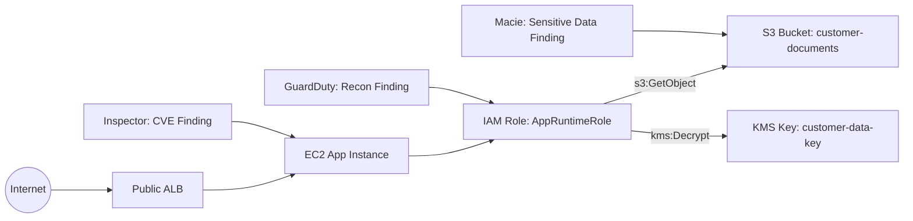
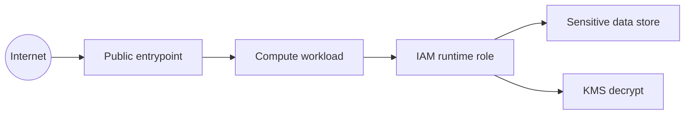
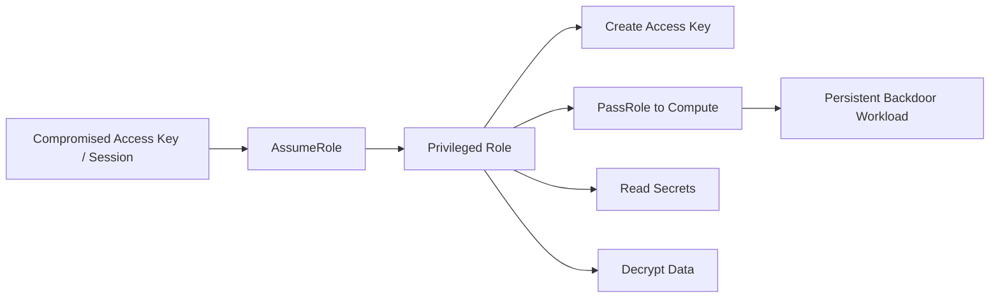
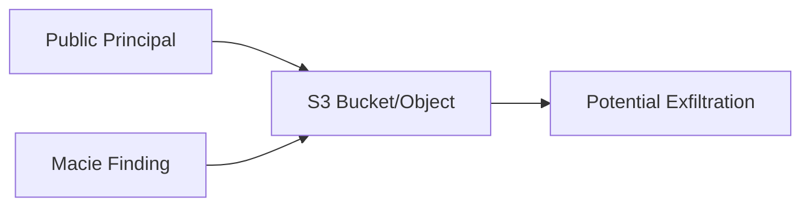
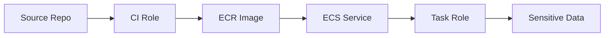
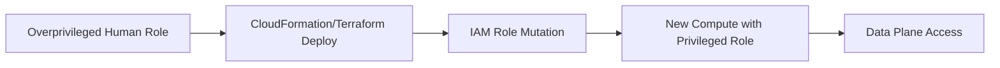
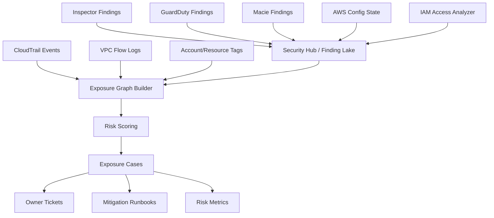
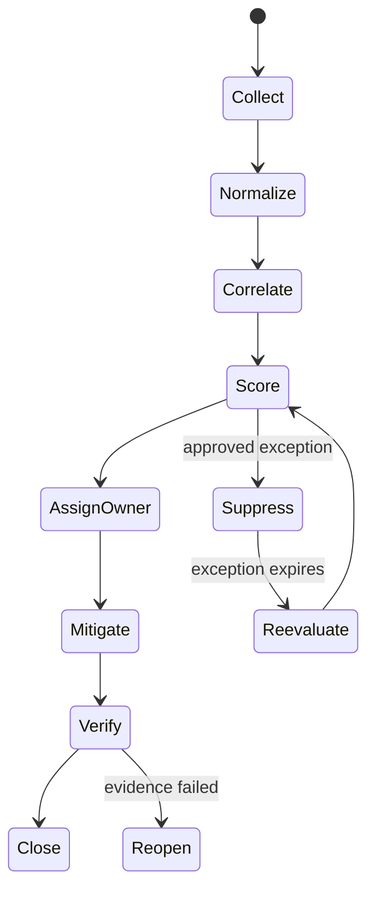

# Part 045 — Exposure Management and Attack Path Thinking

Security team yang matang tidak lagi hanya bertanya:

> “Ada finding apa hari ini?”

Pertanyaan itu terlalu dangkal. Finding adalah unit observasi, bukan unit risiko.

Pertanyaan yang lebih kuat adalah:

> “Dari semua kondisi yang kita punya, jalur mana yang paling mungkin dipakai attacker untuk mencapai aset bernilai tinggi?”

Itulah inti **exposure management**.

Vulnerability management bertanya: “software mana yang rentan?”  
Posture management bertanya: “konfigurasi mana yang tidak compliant?”  
Threat detection bertanya: “aktivitas mana yang mencurigakan?”  
Exposure management menggabungkan semuanya dan bertanya:

> “Kombinasi exposure + exploitability + privilege + data sensitivity + active signal mana yang membentuk attack path nyata?”

Di AWS, ini penting karena resource jarang berdiri sendiri. Sebuah EC2 instance bukan hanya EC2 instance. Ia punya security group, subnet, route, IAM role, instance profile, EBS volume, SSM state, tags, CloudTrail history, Inspector findings, VPC Flow Logs, GuardDuty signals, KMS usage, dan mungkin akses ke S3 bucket berisi data sensitif.

Attack path muncul dari hubungan antar-entity itu.

---

## 1. Mental Model: Finding Bukan Risiko

Finding adalah pernyataan observasi:

```txt
Resource X memiliki kondisi Y pada waktu T.
```

Contoh:

```txt
EC2 i-123 memiliki CVE critical.
S3 bucket abc tidak memblokir public access.
IAM role AppRole punya s3:GetObject ke bucket customer-data.
Security group sg-123 membuka TCP 22 dari 0.0.0.0/0.
GuardDuty mendeteksi anomalous API call dari role tertentu.
```

Masing-masing finding berguna. Tetapi risiko sebenarnya biasanya muncul dari **kombinasi**:

```txt
Publicly reachable EC2
+ critical remote code execution CVE
+ attached IAM role with broad S3 access
+ bucket contains sensitive data
+ recent suspicious reconnaissance
= high-priority attack path
```

Kalau hanya melihat CVE severity, kamu bisa salah prioritas. CVE critical di instance private tanpa route, tanpa privilege, dan tanpa data mungkin kalah penting dibanding CVE high di internet-facing workload yang punya akses decrypt ke data regulated.

Prinsipnya:

```txt
Risk = Exposure × Exploitability × Reachability × Privilege × Asset Value × Threat Activity × Control Weakness
```

Bukan formula matematika presisi. Ini model berpikir untuk memaksa tim melihat konteks.

---

## 2. Exposure Management vs Vulnerability Management

| Aspek | Vulnerability Management | Exposure Management |
|---|---|---|
| Unit utama | CVE, package, image, runtime | Attack path, exposed asset, reachable privilege, sensitive data path |
| Pertanyaan | “Apa yang perlu dipatch?” | “Apa yang paling mungkin dieksploitasi untuk mencapai impact?” |
| Sumber data | Inspector, scanner, SBOM | Inspector, Config, IAM, Macie, GuardDuty, Security Hub, CloudTrail, VPC Flow Logs, tags, CMDB |
| Output | Patch queue | Risk-prioritized remediation plan |
| Prioritas | CVSS/severity | Severity + reachability + privilege + data sensitivity + active threat + business criticality |
| Failure mode | Patch critical yang tidak reachable, abaikan high yang reachable | Salah korelasi, stale graph, owner salah, over-automation |

Vulnerability management tetap penting. Tetapi ia hanya satu lapisan. Exposure management memaksa kamu melihat **attack feasibility** dan **business impact**.

---

## 3. AWS Resource Adalah Graph, Bukan List

AWS environment harus dibaca sebagai graph.



Kalau kamu melihat node secara terpisah, masing-masing tampak biasa:

- ALB public memang wajar.
- EC2 punya CVE mungkin biasa.
- Role punya akses S3 mungkin memang dibutuhkan.
- Bucket berisi data sensitif memang bagian dari sistem.
- GuardDuty finding mungkin masih medium.

Tetapi sebagai graph, jalurnya menjadi serius:

```txt
Internet → Public ALB → vulnerable EC2 → runtime IAM role → sensitive S3 bucket → KMS decrypt
```

Itulah attack path.

---

## 4. Core Entity dalam AWS Exposure Graph

Exposure graph minimal harus punya entity berikut.

### 4.1 Account

Account adalah blast-radius boundary.

Field penting:

```yaml
accountId: "123456789012"
accountName: "prod-payments"
ou: "/Workloads/Production/Regulated"
environment: "prod"
criticality: "tier-0"
owners:
  service: "payments-platform"
  security: "cloud-security"
  escalation: "payments-oncall"
```

Account context menaikkan atau menurunkan prioritas. Finding yang sama di sandbox dan regulated-prod tidak boleh diprioritaskan sama.

### 4.2 Resource

Resource adalah node teknis.

```yaml
resourceArn: "arn:aws:ec2:ap-southeast-1:123456789012:instance/i-abc"
resourceType: "AWS::EC2::Instance"
region: "ap-southeast-1"
tags:
  Application: "payments-api"
  Environment: "prod"
  DataClass: "confidential"
  Owner: "payments-platform"
```

Tags bukan dekorasi. Dalam exposure management, tags adalah cara menghubungkan resource ke ownership, business context, dan data class.

### 4.3 Network Reachability

Reachability menjawab:

```txt
Dari mana resource ini dapat dicapai?
```

Pertanyaan detail:

- Apakah reachable dari internet?
- Apakah reachable dari corporate network?
- Apakah reachable dari peered VPC?
- Apakah reachable dari shared services VPC?
- Apakah hanya reachable dari private subnet tertentu?
- Apakah ada path via ALB/NLB/API Gateway/CloudFront?
- Apakah DNS publik menunjuk ke resource ini?
- Apakah route table dan security group benar-benar mengizinkan path itu?

Amazon Inspector EC2 scanning dapat menghasilkan finding untuk package vulnerabilities dan network reachability. Untuk network reachability, severity bergantung pada service, port/protocol, dan jenis open path. Referensi: <https://docs.aws.amazon.com/inspector/latest/user/scanning-ec2.html> dan <https://docs.aws.amazon.com/inspector/latest/user/findings-understanding-severity.html>

### 4.4 Identity and Privilege

Privilege menjawab:

```txt
Kalau resource ini dikompromikan, apa yang bisa dilakukan attacker?
```

Untuk EC2/ECS/Lambda/EKS, lihat runtime identity:

- EC2 instance profile.
- ECS task role.
- Lambda execution role.
- EKS pod identity / IRSA role.
- KMS grants.
- resource policies.
- cross-account trust.
- `iam:PassRole` paths.
- permission boundary presence.
- SCP/RCP constraints.

Privilege graph sering lebih penting daripada CVE severity.

Instance dengan CVE medium tetapi role `AdministratorAccess` lebih berbahaya daripada instance dengan CVE critical tetapi role hanya bisa menulis metric custom.

### 4.5 Data Sensitivity

Data sensitivity menjawab:

```txt
Apa yang bisa dicuri, dimodifikasi, atau dihancurkan?
```

Sumber sinyal:

- Macie findings untuk S3 sensitive data.
- S3 object tags.
- Glue Data Catalog classification.
- database tags.
- backup vault tags.
- KMS key alias dan key policy context.
- account/OU classification.
- application registry.

Macie tidak menggantikan data classification. Ia membantu menemukan data sensitif yang mungkin tidak sesuai label.

### 4.6 Active Threat Signal

Threat signal menjawab:

```txt
Apakah ada tanda bahwa jalur ini sedang atau telah disentuh attacker?
```

Sumber:

- GuardDuty credential compromise.
- GuardDuty reconnaissance.
- GuardDuty S3 exfiltration signals.
- CloudTrail anomalous API pattern.
- Detective behavior graph.
- VPC Flow Logs unusual outbound traffic.
- WAF blocked spikes.
- failed authentication bursts.
- unusual STS `AssumeRole` patterns.
- IAM Access Analyzer new external access findings.

Aset yang exposed dan punya vulnerability menjadi lebih prioritas ketika ada active threat signal.

---

## 5. Exposure Risk Equation

Gunakan scoring sederhana yang bisa dijelaskan.

```txt
Exposure Priority = Base Severity
                  + Reachability Weight
                  + Privilege Weight
                  + Data Sensitivity Weight
                  + Asset Criticality Weight
                  + Active Threat Weight
                  + Compensating Control Penalty/Reduction
```

Contoh bobot:

| Dimensi | Nilai Rendah | Nilai Tinggi |
|---|---|---|
| Base severity | Info/Low | Critical CVE, critical Security Hub control |
| Reachability | private-only | internet reachable |
| Exploitability | theoretical | known exploited / exploit available |
| Privilege | read-only local | admin / decrypt / cross-account / pass role |
| Data sensitivity | public/internal | regulated/PII/financial/secret |
| Asset criticality | dev utility | tier-0 production |
| Threat activity | none | GuardDuty active finding / suspicious CloudTrail |
| Control health | monitored and segmented | no logs, no owner, no patch path |

Lebih baik punya scoring kasar tetapi konsisten daripada severity mentah yang tidak pernah dikontekstualisasi.

---

## 6. Minimum Data Model

Exposure management butuh data model eksplisit. Tanpa itu, semua korelasi menjadi spreadsheet manual.

```yaml
ExposureCase:
  caseId: EXP-2026-000123
  status: OPEN
  priority: P1
  title: Internet reachable EC2 with exploitable CVE and S3 sensitive data access
  account:
    id: "123456789012"
    ou: "/Workloads/Production/Regulated"
    environment: prod
  primaryResource:
    arn: arn:aws:ec2:ap-southeast-1:123456789012:instance/i-abc
    type: AWS::EC2::Instance
  attackPath:
    - Internet
    - ALB:app-prod-public
    - EC2:i-abc
    - IAMRole:AppRuntimeRole
    - S3:customer-documents
    - KMS:customer-data-key
  signals:
    vulnerabilities:
      - source: Inspector
        id: CVE-2026-XXXXX
        severity: CRITICAL
        fixAvailable: true
    exposure:
      - source: Inspector
        type: NETWORK_REACHABILITY
        path: INTERNET
    data:
      - source: Macie
        type: PII
        bucket: customer-documents
    threat:
      - source: GuardDuty
        type: Recon:EC2/PortProbeUnprotectedPort
    posture:
      - source: Config
        rule: restricted-ssh
        compliance: NON_COMPLIANT
  owner:
    team: payments-platform
    escalation: payments-oncall
  requiredActions:
    - patch affected package
    - restrict inbound path
    - reduce runtime IAM role scope
    - verify no S3 data access anomaly
  evidence:
    - CloudTrail query link
    - Inspector finding ARN
    - Security Hub finding ID
    - Macie finding ID
    - Config timeline
  sla:
    firstResponse: 4h
    mitigation: 24h
    fullRemediation: 7d
```

Kalau sistem kamu tidak punya struktur seperti ini, “risk prioritization” akan berubah menjadi meeting mingguan penuh opini.

---

## 7. Attack Path Pattern 1 — Public Compute to Sensitive Data

Pattern paling klasik di AWS:



Contoh konkret:

```txt
Internet → ALB → ECS task → TaskRole → S3 bucket with PII → KMS decrypt
```

Sinyal yang harus dikorelasikan:

| Layer | AWS Signal |
|---|---|
| Internet entry | ALB, CloudFront, API Gateway, route table, public IP, Security Group |
| Compute vulnerability | Inspector EC2/ECR/Lambda finding |
| Runtime identity | IAM role policy, trust policy, session activity |
| Data sensitivity | Macie, tags, data catalog |
| Crypto access | KMS key policy, grants, CloudTrail decrypt events |
| Active threat | GuardDuty, CloudTrail, WAF, Flow Logs |

Prioritas tinggi jika:

- entrypoint public;
- workload vulnerable;
- role punya akses data sensitif;
- KMS decrypt diizinkan;
- tidak ada segmentation kuat;
- ada threat signal aktif.

Remediation tidak selalu “patch dulu”. Kadang mitigasi tercepat adalah:

1. remove public reachability;
2. block exploit path at WAF/security group;
3. reduce IAM role;
4. disable risky feature;
5. patch;
6. verify no exfiltration.

---

## 8. Attack Path Pattern 2 — Compromised Credential to Lateral Movement

Credential compromise sering lebih berbahaya daripada network exploit.



Sinyal:

- GuardDuty credential compromise finding.
- CloudTrail `AssumeRole` from unusual IP/user agent.
- IAM Access Analyzer external access finding.
- sudden `CreateAccessKey`.
- `AttachUserPolicy` / `PutRolePolicy`.
- `PassRole` to new compute resource.
- Secrets Manager `GetSecretValue` spike.
- KMS `Decrypt` anomaly.

Invariant:

```txt
A compromised low-privilege principal must not be able to mint persistence, escalate, pass privileged role, or read regulated secrets.
```

Controls:

- no long-lived access keys for humans;
- permission boundaries for delegated role creation;
- SCP deny privilege escalation primitives;
- Access Analyzer checks;
- CloudTrail alerts for IAM mutation;
- GuardDuty response runbook;
- session duration limits;
- source identity/session tag attribution.

---

## 9. Attack Path Pattern 3 — Public Storage to Data Breach

S3 public exposure is not automatically data breach, but it can become one when combined with sensitive data.



Correlate:

- S3 Block Public Access configuration.
- bucket policy.
- ACL/object ACL if relevant.
- access point policy.
- Access Analyzer external access finding.
- Macie sensitive data finding.
- CloudTrail S3 data events.
- S3 server access logs / CloudTrail data event query.
- KMS key policy if encrypted.

Prioritas menjadi P1 jika:

```txt
publicly accessible bucket/object + sensitive data + external reads observed
```

Prioritas bisa tetap tinggi meskipun belum ada external reads, karena public data exposure sering punya regulatory impact.

---

## 10. Attack Path Pattern 4 — Build Artifact to Production Runtime

Supply chain exposure sering tidak terlihat jika hanya melihat runtime.



Sinyal:

- ECR image vulnerability from Inspector.
- image pushed by unexpected principal.
- mutable tags like `latest` in prod.
- CI role can push to prod repository.
- deployment role can pass broad task role.
- task role has data access.
- no image signing / no deployment provenance.

Invariant:

```txt
A non-production build principal must not be able to deploy or mutate production runtime artifacts without controlled promotion and audit trail.
```

Mitigation:

- separate prod/non-prod artifact repositories;
- immutable image tags/digests;
- Inspector scan gate with exception process;
- restricted deploy role;
- permission boundary for CI roles;
- CloudTrail alert on ECR policy or image mutation;
- deployment evidence retained.

---

## 11. Attack Path Pattern 5 — Weak Management Plane to Resource Takeover

Di AWS, banyak breach tidak lewat port aplikasi. Mereka lewat control plane.



Sinyal:

- broad admin permission in prod.
- missing approval for IAM mutation.
- no permission boundary enforcement.
- CloudFormation execution role too broad.
- terraform state contains secrets.
- management account used for daily operation.
- no CloudTrail Lake query pack for IAM changes.

Controls:

- deployment role separated by environment;
- IAM mutation pipeline guarded;
- permission boundary mandatory;
- CloudFormation execution role scoped;
- `iam:PassRole` constrained;
- `aws:CalledVia`/service constraints where appropriate;
- SCP deny unsafe primitives outside pipeline role;
- emergency access logged separately.

---

## 12. Building an Exposure Correlation Pipeline

Minimal pipeline:



Security Hub bagus sebagai normalization layer karena ia memakai AWS Security Finding Format. Tetapi jangan menganggap Security Hub otomatis menjadi exposure graph penuh. Kamu masih perlu enrichment dan correlation layer.

---

## 13. Correlation Rules yang Praktis

Mulai dari rule yang sederhana dan bernilai tinggi.

### Rule 1 — Internet Reachable + Critical Vulnerability

```txt
IF Inspector finding severity in [CRITICAL, HIGH]
AND resource is internet reachable
AND environment = prod
THEN priority >= P1/P2
```

Tambahkan bobot jika fix tersedia.

### Rule 2 — Vulnerable Runtime + Broad IAM Role

```txt
IF compute resource has exploitable CVE
AND attached role allows sensitive actions
THEN raise priority
```

Sensitive actions contoh:

```txt
s3:GetObject on regulated buckets
secretsmanager:GetSecretValue
kms:Decrypt
iam:PassRole
dynamodb:Scan on customer tables
rds-db:connect to prod DB
```

### Rule 3 — Public Storage + Sensitive Data

```txt
IF S3 bucket/object has external access finding
AND Macie detected sensitive data
THEN priority = P1 unless explicit approved exception exists
```

### Rule 4 — GuardDuty + Privileged Principal

```txt
IF GuardDuty finding involves principal
AND principal can mutate IAM, KMS, S3 policy, or network controls
THEN priority = P1
```

### Rule 5 — Non-Compliant Control + Active Change

```txt
IF Config detects audit/logging/security-control disabled
AND CloudTrail shows recent mutation by non-platform principal
THEN create investigation case
```

### Rule 6 — Sensitive Data + Weak KMS Boundary

```txt
IF sensitive datastore uses CMK
AND key policy allows broad decrypt
AND role is reachable from exposed compute
THEN raise priority
```

---

## 14. Severity vs Priority

Severity belongs to the finding provider. Priority belongs to your operating model.

| Concept | Meaning | Owner |
|---|---|---|
| Severity | Technical seriousness of individual finding | Finding provider / scanner |
| Criticality | Business importance of asset | Service/platform owner |
| Exposure | Whether attacker can reach/use the weakness | Security/platform |
| Priority | Order in which organization must act | Security operations + owner |
| SLA | Maximum acceptable response/remediation time | Governance/risk owner |

Do not blindly copy severity into ticket priority.

Example:

```txt
Inspector severity: HIGH
Resource: prod internet-facing API
Role: can decrypt PII bucket
GuardDuty: suspicious recon seen
Priority: P1
```

Another:

```txt
Inspector severity: CRITICAL
Resource: isolated dev instance
Role: no data access
No internet reachability
Priority: P3/P4, unless exploit is actively exploited or environment is shared
```

---

## 15. Exposure Management Operating Loop



Loop detail:

1. **Collect** — ingest findings and resource state.
2. **Normalize** — align fields: account, region, resource ARN, severity, tags, timestamps.
3. **Correlate** — build relation graph.
4. **Score** — compute priority.
5. **Assign owner** — map to service team.
6. **Mitigate** — reduce reachable risk quickly.
7. **Verify** — check signal is gone and path broken.
8. **Close** — retain evidence.
9. **Reopen** — if resource drifts or finding returns.

---

## 16. What Makes an Attack Path Actionable?

Attack path is actionable only if it identifies:

```txt
entrypoint → weakness → privilege/data → impact → owner → mitigation
```

Bad case:

```txt
Critical vulnerability found in EC2.
```

Better case:

```txt
Public ALB routes traffic to EC2 i-abc running vulnerable package CVE-X.
The instance role allows s3:GetObject on bucket customer-documents and kms:Decrypt on key customer-data-key.
Macie detected PII in that bucket.
Mitigation: remove public path via ALB target group or security group, patch package, restrict role to prefix-level access, verify CloudTrail S3 data events for exfiltration.
Owner: payments-platform.
```

The second case can be executed.

---

## 17. Building the Attack Path Graph

A simple graph model:

```txt
Node types:
- Account
- OU
- VPC
- Subnet
- RouteTable
- SecurityGroup
- LoadBalancer
- Compute
- IAMRole
- Policy
- DataStore
- KMSKey
- Secret
- Finding
- Principal

Edge types:
- CONTAINS
- ROUTES_TO
- ALLOWS_NETWORK
- RUNS_AS
- ALLOWS_ACTION
- TRUSTS
- ENCRYPTED_BY
- CONTAINS_SENSITIVE_DATA
- HAS_FINDING
- CALLED_API
- ASSUMED_ROLE
```

Example edges:

```txt
ALB ROUTES_TO EC2
EC2 RUNS_AS IAMRole
IAMRole ALLOWS_ACTION s3:GetObject Bucket
Bucket ENCRYPTED_BY KMSKey
MacieFinding CONTAINS_SENSITIVE_DATA Bucket
InspectorFinding HAS_FINDING EC2
GuardDutyFinding INVOLVES IAMRole
```

The graph does not need to be perfect on day one. Start with five high-value relationships:

1. public reachability;
2. compute → runtime role;
3. role → data actions;
4. data store → sensitivity;
5. finding → resource.

---

## 18. Owner Mapping

Exposure management fails when ownership is unresolved.

Recommended owner resolution order:

```txt
1. resource tag Owner / Application / Service
2. account registry owner
3. deployment pipeline metadata
4. CMDB/service catalog
5. last modifying principal from CloudTrail
6. fallback platform team
7. security escalation owner
```

Never allow findings to stay ownerless.

A good owner record:

```yaml
owner:
  service: payments-api
  team: payments-platform
  slack: '#payments-oncall'
  pagerDuty: payments-sev2
  engineeringManager: person@example.com
  securityChampion: person@example.com
```

---

## 19. SLA Model

Use priority, not raw severity.

| Priority | Example | First Response | Mitigation | Full Remediation |
|---|---|---:|---:|---:|
| P0 | active exfiltration / active compromise | immediate | immediate | post-incident plan |
| P1 | internet reachable + sensitive data path + critical vuln | 4h | 24h | 7d |
| P2 | prod high-risk exposure without active threat | 1 business day | 3d | 14d |
| P3 | non-prod exposure / low criticality | 3 business days | 14d | 30d |
| P4 | hygiene / informational | backlog | backlog | backlog |

SLA must be tied to mitigation, not only final patch.

For example, if patching takes 7 days but removing public reachability takes 30 minutes, the risk should be mitigated quickly.

---

## 20. Mitigation vs Remediation

Do not confuse them.

| Term | Meaning | Example |
|---|---|---|
| Mitigation | Reduce immediate risk | Remove internet exposure, block WAF path, revoke credential, restrict role |
| Remediation | Fix root condition | Patch package, refactor IAM policy, rotate secret, change architecture |
| Verification | Prove condition no longer exists | Inspector clean scan, Config compliant, CloudTrail no suspicious use |
| Evidence | Retain proof | finding IDs, timestamps, diff, query results, approval |

For high exposure paths, mitigation comes first.

---

## 21. Common AWS Exposure Signals

| Signal | AWS Source | Meaning |
|---|---|---|
| CVE/package vuln | Inspector | Software risk |
| Network reachability | Inspector / Config / EC2 APIs | Reachable path |
| External access | IAM Access Analyzer | Cross-account/public resource policy risk |
| Sensitive data | Macie | Data impact |
| Active threat | GuardDuty | Suspicious/malicious behavior |
| Config non-compliance | AWS Config / Security Hub | Control weakness |
| IAM broad privilege | IAM Access Analyzer / IAM policy analysis | Blast radius |
| Runtime API use | CloudTrail | Actual behavior |
| Network behavior | VPC Flow Logs | Traffic path / exfil hint |
| Owner/business context | Tags/account registry | Prioritization |

---

## 22. What to Do With “Noisy” Findings

Noise is usually not a finding problem. It is a context problem.

Typical root causes:

- no owner mapping;
- no environment classification;
- no criticality model;
- scanner severity copied directly to tickets;
- no deduplication;
- no suppression lifecycle;
- no exception expiry;
- no verification loop;
- no asset graph;
- no mitigation path.

Fixing noise means adding context and lifecycle, not deleting findings.

---

## 23. False Positives vs Accepted Risk

Do not use “false positive” as a trash bin.

| Label | Meaning |
|---|---|
| False positive | Finding is factually wrong |
| Not exploitable | Condition exists but cannot be reached or used under current controls |
| Accepted risk | Risk exists and business accepts it temporarily/permanently |
| Compensating control | Risk exists but alternate control reduces it |
| Duplicate | Same underlying condition already tracked |
| Out of scope | Resource not governed by this program |

Each label needs evidence.

Bad suppression:

```txt
Suppress because team says not relevant.
```

Good suppression:

```txt
Suppress until 2026-08-31 because resource is not internet reachable, security group allows only corporate CIDR, role has no data access, and compensating WAF control is in place. Re-evaluate automatically on expiration or reachability change.
```

---

## 24. Exposure Dashboard That Actually Helps

Avoid dashboards that only show finding counts.

Useful dashboard sections:

```txt
1. Top open attack paths by priority
2. P1/P2 exposure by owner team
3. Internet reachable vulnerable workloads
4. Sensitive data stores with external access
5. Privileged roles involved in threat findings
6. Aging by priority and owner
7. Exception inventory expiring soon
8. Reopened findings after remediation
9. Mean time to mitigation
10. Control failure clusters by OU/account
```

Counts alone can mislead. A team with 100 low findings may be lower risk than a team with 2 P1 attack paths.

---

## 25. Example Priority Decision Table

| Condition | Priority |
|---|---:|
| GuardDuty credential compromise involving admin-like role | P0/P1 |
| Public S3 + Macie PII + external read evidence | P1 |
| Internet reachable EC2 + critical exploitable CVE + data role | P1 |
| Internet reachable EC2 + high CVE + no sensitive privilege | P2 |
| Private EC2 + critical CVE + no lateral path | P3 |
| Dev ECR image critical CVE not deployed | P3/P4 |
| Prod ECR image critical CVE deployed to internet-facing service | P1/P2 |
| Security Hub control failed on sandbox with expiry exception | P4 or suppressed with expiry |

---

## 26. Investigation Query Pack

### 26.1 CloudTrail — Did the Runtime Role Read Sensitive Data?

Pseudo-query intent:

```sql
SELECT eventTime, eventName, userIdentity.sessionContext.sessionIssuer.arn, requestParameters.bucketName, sourceIPAddress
FROM cloudtrail
WHERE userIdentity.sessionContext.sessionIssuer.arn = 'arn:aws:iam::123456789012:role/AppRuntimeRole'
AND eventSource = 's3.amazonaws.com'
AND eventName IN ('GetObject', 'ListBucket')
AND eventTime BETWEEN incidentStart AND incidentEnd;
```

### 26.2 CloudTrail — Was KMS Decrypt Used?

```sql
SELECT eventTime, userIdentity.arn, requestParameters.encryptionContext, sourceIPAddress
FROM cloudtrail
WHERE eventSource = 'kms.amazonaws.com'
AND eventName = 'Decrypt'
AND resources.ARN = 'arn:aws:kms:ap-southeast-1:123456789012:key/...';
```

### 26.3 VPC Flow Logs — Was There Unusual Egress?

```sql
SELECT srcAddr, dstAddr, dstPort, action, bytes, packets
FROM vpc_flow_logs
WHERE interfaceId = 'eni-...'
AND action = 'ACCEPT'
AND bytes > threshold
ORDER BY bytes DESC;
```

### 26.4 IAM — What Can This Role Do?

Use IAM policy simulation/Access Analyzer and manually inspect:

```txt
identity policies
managed policies
inline policies
permissions boundary
SCP/RCP
resource policies
KMS key policy
session policy
```

---

## 27. Engineering Runbook: Internet Reachable Vulnerable Compute

### Trigger

```txt
Inspector HIGH/CRITICAL finding on internet reachable compute resource in production.
```

### Triage

1. Identify resource ARN, account, region, owner.
2. Determine internet path: ALB/NLB/public IP/security group/API Gateway/CloudFront.
3. Determine vulnerability exploitability and fix availability.
4. Identify runtime role.
5. Identify accessible data stores and KMS keys.
6. Check GuardDuty/CloudTrail/VPC Flow Logs for active signal.
7. Compute priority.

### Immediate mitigation options

Choose least disruptive control that breaks attack path:

```txt
- remove resource from public target group
- block exploit path at WAF
- restrict security group ingress
- isolate instance
- reduce IAM role permission
- rotate/revoke credentials if compromise suspected
- disable risky feature endpoint
```

### Remediation

```txt
- patch package/base image
- redeploy immutable artifact
- verify Inspector finding resolved
- review role policy
- add regression guardrail
- document evidence
```

### Closure evidence

```txt
- Inspector finding status
- Config compliance
- CloudTrail queries for no suspicious access
- deployment ID
- security group/IAM diff
- owner sign-off
```

---

## 28. Engineering Runbook: Public S3 With Sensitive Data

### Trigger

```txt
S3 external access finding + Macie sensitive data finding.
```

### Triage

1. Confirm public path: bucket policy, ACL, access point, block public access.
2. Confirm object scope and sensitivity.
3. Check CloudTrail S3 data events for access.
4. Check requester identity/IPs.
5. Determine encryption and KMS access.
6. Notify data owner and legal/compliance if needed.

### Immediate mitigation

```txt
- enable Block Public Access
- remove public policy statements
- disable public access point policy
- rotate exposed credentials/secrets if data contains them
- preserve logs before lifecycle deletion
```

### Remediation

```txt
- fix data placement/classification
- add bucket policy guardrail
- add Macie discovery job or automated discovery
- add Config rule / Security Hub control
- implement exception process for intentional public buckets
```

---

## 29. Production Invariants

Use these as baseline invariants:

```txt
1. No production sensitive datastore may be externally accessible without explicit approved exception.
2. No internet reachable production compute may run critical exploitable vulnerability beyond mitigation SLA.
3. No compromised or suspicious principal may retain privilege while investigation is active.
4. No runtime role attached to public compute may have broad data access unless justified and monitored.
5. Every P1/P2 exposure must have owner, mitigation path, verification evidence, and expiry if exception exists.
6. Suppressed findings must expire or be re-evaluated on resource state change.
7. Attack path closure requires proof that at least one critical edge in the path is broken.
```

---

## 30. Failure Modes

### 30.1 Severity-Only Prioritization

Result:

```txt
Teams patch many CVEs while exposed data paths remain open.
```

Fix:

```txt
Prioritize by attack path and business impact.
```

### 30.2 Stale Asset Graph

Result:

```txt
Risk engine says resource is private, but route/security group changed yesterday.
```

Fix:

```txt
Use Config/CloudTrail/event-driven updates and define data freshness SLA.
```

### 30.3 Missing Ownership

Result:

```txt
Critical finding sits open because nobody owns it.
```

Fix:

```txt
Enforce owner tags at account vending/deployment time and fallback to account owner.
```

### 30.4 Unbounded Suppression

Result:

```txt
Real risks disappear forever.
```

Fix:

```txt
Require expiry, reason, owner, compensating control, and re-evaluation trigger.
```

### 30.5 Graph Without Remediation

Result:

```txt
Beautiful attack path visualization, no operational outcome.
```

Fix:

```txt
Every path must produce owner, mitigation, SLA, verification evidence.
```

### 30.6 Over-Automated Response

Result:

```txt
Automation isolates production resource and causes outage without reducing actual risk.
```

Fix:

```txt
Separate auto-mitigation, human-approved mitigation, and notify-only paths.
```

---

## 31. Lab: Build a Minimal Exposure Correlator

### Goal

Build a small script/job that joins Security Hub/Inspector/Macie/Config/IAM data into exposure cases.

### Input

```txt
- Inspector findings exported from Security Hub
- Macie findings for S3 buckets
- list of EC2 instances with tags and instance profiles
- IAM role permission summary
- public reachability signal
- account registry
```

### Output

```json
{
  "caseId": "EXP-001",
  "priority": "P1",
  "path": [
    "Internet",
    "ALB/app-public",
    "EC2/i-abc",
    "IAMRole/AppRuntimeRole",
    "S3/customer-documents",
    "KMS/customer-data-key"
  ],
  "reason": "internet reachable vulnerable compute with sensitive data access",
  "owner": "payments-platform",
  "mitigation": [
    "remove public reachability",
    "patch CVE",
    "restrict IAM role"
  ]
}
```

### Acceptance Criteria

```txt
- Same resource findings are deduplicated.
- Priority changes when environment changes from dev to prod.
- Priority changes when role access changes from read-only logs to sensitive S3.
- Suppressed case requires expiry.
- Closed case requires verification evidence.
```

---

## 32. Review Questions

1. Why is CVSS insufficient for AWS risk prioritization?
2. What is the difference between severity and priority?
3. What five relationships are enough to start an exposure graph?
4. Why does runtime IAM role matter for compute vulnerability prioritization?
5. How does Macie change priority for S3 external access?
6. Why should suppression have expiry?
7. What does it mean to break an attack path?
8. Why can mitigation be more urgent than remediation?
9. What happens if owner mapping is missing?
10. How would you score a private EC2 with critical CVE but no privilege vs public EC2 with high CVE and broad data access?

---

## 33. Key Takeaways

Exposure management is the bridge between scanner output and actual security engineering.

The mature AWS question is not:

```txt
How many critical findings do we have?
```

It is:

```txt
Which attack paths can realistically reach high-value assets, and what is the fastest safe way to break them?
```

The minimum viable exposure program needs:

```txt
resource graph
+ finding normalization
+ owner mapping
+ business criticality
+ data sensitivity
+ privilege analysis
+ reachability analysis
+ threat signal
+ lifecycle and evidence
```

Once you can produce attack paths, Security Hub findings, Inspector CVEs, GuardDuty alerts, Macie discoveries, IAM findings, Config non-compliance, and CloudTrail evidence stop being separate queues. They become one operating model.

---

## References

- Amazon Inspector finding types: <https://docs.aws.amazon.com/inspector/latest/user/findings-types.html>
- Scanning Amazon EC2 instances with Amazon Inspector: <https://docs.aws.amazon.com/inspector/latest/user/scanning-ec2.html>
- Understanding severity levels for Amazon Inspector findings: <https://docs.aws.amazon.com/inspector/latest/user/findings-understanding-severity.html>
- AWS Security Finding Format: <https://docs.aws.amazon.com/securityhub/latest/userguide/securityhub-findings-format.html>
- AWS Security Hub findings: <https://docs.aws.amazon.com/securityhub/latest/userguide/securityhub-findings.html>
- Amazon GuardDuty User Guide: <https://docs.aws.amazon.com/guardduty/latest/ug/what-is-guardduty.html>
- Amazon Macie User Guide: <https://docs.aws.amazon.com/macie/latest/user/what-is-macie.html>
- IAM Access Analyzer User Guide: <https://docs.aws.amazon.com/IAM/latest/UserGuide/what-is-access-analyzer.html>
