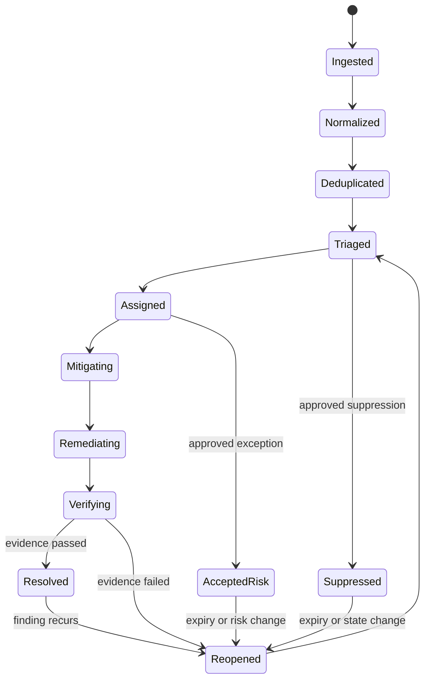
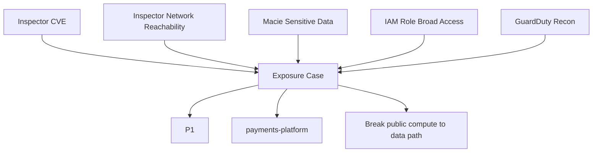
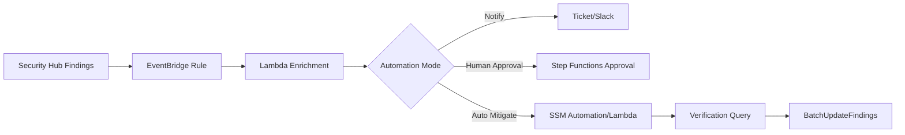
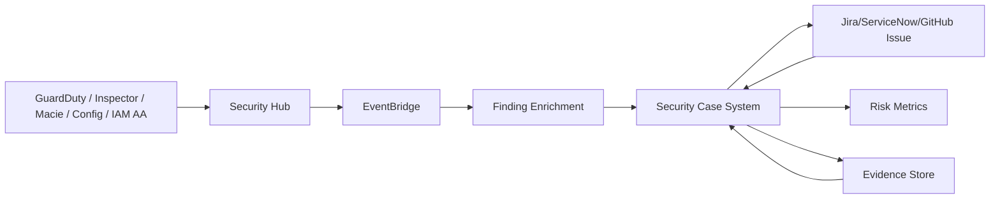

# Part 046 — Security Finding Lifecycle

Security finding yang tidak punya lifecycle akan berubah menjadi noise.

Noise bukan berarti finding tidak penting. Noise berarti organisasi tidak punya mekanisme yang jelas untuk menjawab:

```txt
Apa ini?
Siapa pemiliknya?
Seberapa urgent?
Apa tindakan pertama?
Kapan harus selesai?
Bagaimana membuktikan sudah selesai?
Kapan boleh suppress?
Kapan harus reopen?
```

Security Hub, GuardDuty, Inspector, Macie, Config, IAM Access Analyzer, dan custom detector bisa menghasilkan banyak finding. Masalahnya bukan jumlah. Masalahnya adalah **finding tanpa state machine**.

Part ini membangun lifecycle production-grade untuk security finding di AWS.

---

## 1. Finding Adalah Work Item, Evidence, dan Signal

Satu finding punya tiga peran.

### 1.1 Finding sebagai Signal

Finding memberi tahu bahwa ada kondisi atau aktivitas yang perlu diperiksa.

Contoh:

```txt
GuardDuty: credential used from anomalous location.
Inspector: EC2 instance has critical CVE.
Macie: S3 object contains PII.
Config: CloudTrail logging disabled.
Security Hub: S3 Block Public Access control failed.
```

### 1.2 Finding sebagai Work Item

Finding harus masuk ke alur kerja:

```txt
triage → assign → mitigate → remediate → verify → close
```

Tanpa work item, finding hanya angka di dashboard.

### 1.3 Finding sebagai Evidence

Finding juga menjadi bukti bahwa organisasi memiliki detective control.

Audit akan bertanya:

```txt
- kapan finding muncul?
- siapa menanganinya?
- apa keputusan triage?
- apakah ada exception?
- apa bukti remediation?
- berapa lama sampai mitigasi?
- apakah finding muncul lagi?
```

Karena itu lifecycle harus auditable.

---

## 2. AWS Finding Sources

| Source | Finding Type | Typical Meaning |
|---|---|---|
| GuardDuty | Threat detection | suspicious/malicious behavior |
| Inspector | Vulnerability / unintended exposure | software vulnerability, network reachability |
| Macie | Sensitive data | S3 data classification/discovery issue |
| AWS Config | Configuration compliance | resource state violates rule |
| Security Hub controls | CSPM compliance | benchmark/control failed |
| IAM Access Analyzer | External/unused/internal access | policy/access risk |
| CloudTrail Lake queries | Custom audit detections | dangerous API pattern |
| EventBridge rules | Custom operational detection | state-change driven security signal |
| Third-party tools | EDR/SIEM/CSPM/CWPP | external normalized findings |

Security Hub can normalize findings from AWS services and third-party products into AWS Security Finding Format. AWS describes ASFF as the standard format Security Hub uses to process findings from integrated sources.

Reference: <https://docs.aws.amazon.com/securityhub/latest/userguide/securityhub-findings-format.html>

---

## 3. Finding Lifecycle State Machine

A good lifecycle is explicit.



Security Hub memiliki `Workflow.Status`, tetapi organisasi tetap perlu lifecycle operasional di atasnya.

AWS Security Hub workflow statuses include states such as `NEW`, `NOTIFIED`, `SUPPRESSED`, and `RESOLVED`. `Workflow` tracks investigation status, while `RecordState` is different and is intended for provider-side active/archive semantics.

Reference: <https://docs.aws.amazon.com/securityhub/latest/userguide/findings-workflow-status.html>

---

## 4. Security Hub Concepts: RecordState vs Workflow

Ini sering membingungkan.

### 4.1 RecordState

`RecordState` menjawab:

```txt
Apakah finding record ini masih aktif menurut provider?
```

Contoh:

```txt
ACTIVE
ARCHIVED
```

Provider dapat mengubah record state ketika finding sudah tidak relevan.

### 4.2 Workflow.Status

`Workflow.Status` menjawab:

```txt
Di mana status investigasi/remediation menurut tim security?
```

Contoh:

```txt
NEW
NOTIFIED
SUPPRESSED
RESOLVED
```

Jangan memakai `RecordState` untuk melacak pekerjaan tim. Gunakan workflow/ticket lifecycle.

### 4.3 Important Behavior

Security Hub dapat mengubah workflow status otomatis dalam kondisi tertentu. Misalnya, jika finding kontrol berubah dari compliant ke failed/warning/not available, workflow dapat reset ke `NEW`; jika compliance status `PASSED`, Security Hub dapat mengatur workflow ke `RESOLVED` untuk control findings.

Konsekuensi engineering:

```txt
Closure process tidak boleh hanya mengandalkan status manual.
Harus ada verification rule dan reopen behavior.
```

---

## 5. Lifecycle Stage 1 — Ingestion

Ingestion menjawab:

```txt
Finding masuk dari mana, kapan, dengan format apa, dan apakah lengkap?
```

Minimal metadata:

```yaml
source: GuardDuty | Inspector | Macie | Config | SecurityHub | Custom
productArn: arn:aws:securityhub:...
findingId: ...
awsAccountId: ...
region: ...
resourceArn: ...
resourceType: ...
severity: ...
createdAt: ...
updatedAt: ...
firstObservedAt: ...
lastObservedAt: ...
recordState: ACTIVE
workflowStatus: NEW
```

Ingestion anti-pattern:

```txt
Sending everything directly to Slack.
```

Slack is not a finding lifecycle system. It is a notification channel.

---

## 6. Lifecycle Stage 2 — Normalization

Normalization menyamakan bahasa.

Fields yang perlu distandarkan:

```yaml
normalized:
  provider: inspector
  category: vulnerability
  controlDomain: compute-security
  resourceKey: arn:aws:ec2:ap-southeast-1:123456789012:instance/i-abc
  accountId: "123456789012"
  region: ap-southeast-1
  environment: prod
  ownerTeam: payments-platform
  technicalSeverity: HIGH
  priority: P2
  dataClass: confidential
  slaClass: production-sensitive
```

Security Hub ASFF membantu karena menyediakan format umum. Tetapi ASFF bukan final data model. Kamu tetap perlu enrichment organisasi:

- owner team;
- environment;
- criticality;
- data classification;
- remediation SLA;
- exception status;
- ticket link;
- verification evidence.

---

## 7. Lifecycle Stage 3 — Deduplication

Tanpa dedup, satu akar masalah bisa menghasilkan 20 tiket.

Dedup key bisa berupa:

```txt
source + findingType + normalizedResourceId + vulnerabilityId/controlId + account + region
```

Contoh:

```txt
Inspector + CVE-2026-1234 + i-abc + 123456789012 + ap-southeast-1
SecurityHub + S3.8 + bucket/customer-documents + 123456789012 + ap-southeast-1
GuardDuty + UnauthorizedAccess:IAMUser/InstanceCredentialExfiltration + role/session + account + region
```

Dedup tidak berarti membuang update. Update harus memperbarui:

```txt
lastObservedAt
severity
affectedResources
workflow state
count
related findings
evidence
```

---

## 8. Lifecycle Stage 4 — Correlation

Correlation menggabungkan finding terkait menjadi case.



Correlation is where findings become security engineering.

Bad:

```txt
Five separate tickets for five tools.
```

Good:

```txt
One exposure case: public vulnerable compute has access to sensitive S3 and is under recon.
```

---

## 9. Lifecycle Stage 5 — Severity-to-Priority

Do not route by severity alone.

Recommended mapping:

```txt
priority = f(severity, environment, reachability, privilege, data sensitivity, active threat, asset criticality, exploitability, compensating controls)
```

Example matrix:

| Technical Severity | Context | Priority |
|---|---|---:|
| Critical | prod + internet reachable + sensitive data path | P1 |
| Critical | isolated dev + no data + no lateral path | P3 |
| High | prod + GuardDuty active signal | P1/P2 |
| Medium | privileged IAM mutation path | P2 |
| Low | regulated asset + no owner + audit control missing | P2/P3 |
| Informational | accepted baseline noise | P4/Suppressed with reason |

Priority must be explainable. Every P1 should answer:

```txt
Why this over other findings?
```

---

## 10. Lifecycle Stage 6 — Ownership Assignment

Finding owner is not always the same as AWS account owner.

Resolution order:

```txt
1. resource Owner tag
2. Application/Service tag
3. account registry owner
4. deployment pipeline metadata
5. service catalog / CMDB
6. CloudTrail last modifier
7. platform team fallback
8. security escalation owner
```

Owner record:

```yaml
owner:
  team: payments-platform
  oncall: payments-sev2
  slack: '#payments-oncall'
  engineeringManager: person@example.com
  securityChampion: person@example.com
  fallback: cloud-platform
```

Invariant:

```txt
No P1/P2 finding may remain ownerless beyond triage SLA.
```

---

## 11. Lifecycle Stage 7 — Notification

Notification is not assignment.

A good notification includes:

```txt
- priority
- owner
- account/region/resource
- why it matters
- attack path context
- required first action
- SLA
- links to evidence
- runbook
- escalation path
```

Bad notification:

```txt
Critical finding found. Please investigate.
```

Good notification:

```txt
P1: Internet reachable EC2 i-abc in prod-payments has critical exploitable CVE and role access to customer-documents S3 bucket containing PII. Remove public path or isolate instance within 24h, patch within 7d, verify no S3/KMS abnormal access via linked CloudTrail queries.
```

---

## 12. Lifecycle Stage 8 — Mitigation

Mitigation reduces immediate risk.

Examples:

| Finding | Fast Mitigation |
|---|---|
| Public vulnerable EC2 | remove from public target group, restrict SG, WAF block |
| Credential compromise | revoke/rotate credential, disable principal, restrict role |
| Public S3 with PII | enable Block Public Access, remove public policy |
| Broad KMS decrypt path | restrict key policy/grant, disable risky principal |
| Malicious egress | isolate instance/subnet, block route/SG/NACL/firewall |
| CloudTrail disabled | re-enable trail, protect with SCP, investigate gap |

Mitigation SLA should be shorter than remediation SLA.

---

## 13. Lifecycle Stage 9 — Remediation

Remediation fixes root cause.

Examples:

| Finding | Remediation |
|---|---|
| CVE | patch package, rebuild image, redeploy immutable artifact |
| Public access | change architecture/policy to least exposure |
| IAM overprivilege | replace wildcard policy with scoped permission |
| Secret exposure | rotate secret, remove from logs/state, update retrieval path |
| Missing logging | deploy baseline, add drift guardrail |
| Repeated misconfiguration | add IaC check and preventive control |

A remediation without regression control is incomplete.

Ask:

```txt
Why was this possible?
What guardrail prevents recurrence?
What test detects it earlier next time?
```

---

## 14. Lifecycle Stage 10 — Verification

Closure requires proof.

Verification examples:

| Finding Type | Verification Evidence |
|---|---|
| Inspector CVE | finding closed/updated, package version fixed, deployment ID |
| Security Hub control | control status passed, Config compliant |
| GuardDuty credential | credentials revoked, no further suspicious API calls |
| Macie sensitive exposure | public access removed, access logs checked |
| IAM overprivilege | policy diff, Access Analyzer validation |
| KMS exposure | key policy diff, decrypt event review |
| CloudTrail disabled | org trail active, delivery validated |

Do not close based only on owner comment.

Good closure:

```txt
Resolved after deployment 2026.07.06.3. Inspector finding no longer active. Security group diff removed 0.0.0.0/0. CloudTrail query from 2026-07-05T00:00Z to 2026-07-06T12:00Z shows no GetObject from suspicious principal. Evidence attached.
```

---

## 15. Suppression Lifecycle

Suppression means:

```txt
We reviewed this and no action is needed now.
```

It does **not** mean:

```txt
Delete this forever.
```

Suppression must include:

```yaml
suppression:
  reasonCode: COMPENSATING_CONTROL | FALSE_POSITIVE | ACCEPTED_BASELINE | NOT_APPLICABLE
  explanation: ...
  owner: ...
  approvedBy: ...
  expiresAt: 2026-09-30
  evidence:
    - compensating control link
    - architecture decision record
  reopenTriggers:
    - resource becomes internet reachable
    - environment tag changes to prod
    - data classification changes to regulated
    - control changes state
```

Security Hub automation rules can automatically update/suppress findings based on criteria. However, automation rules should not replace risk acceptance governance. AWS documents that automation rules can update fields such as severity, note, verification state, and workflow based on matching criteria, and they are managed from the administrator account with regional behavior.

Reference: <https://docs.aws.amazon.com/securityhub/latest/userguide/automation-rules.html>

---

## 16. Exception Lifecycle

Exception is different from suppression.

| Term | Meaning |
|---|---|
| Suppression | Hide or reduce workflow noise because action not needed now |
| Exception | Risk/control violation accepted for a defined period |
| False positive | Finding is factually incorrect |
| Compensating control | Alternative control reduces risk |

Exception record:

```yaml
exceptionId: EXC-2026-00091
findingType: SecurityHub:S3.8
resource: arn:aws:s3:::partner-public-assets
businessJustification: Bucket intentionally hosts public marketing assets
risk: Public read allowed
compensatingControls:
  - no sensitive data allowed
  - Macie daily discovery job
  - bucket prefix allowlist
  - CloudTrail S3 data events enabled
owner: marketing-platform
approvedBy: security-governance
expiresAt: 2026-12-31
reviewCadence: monthly
```

Exception tanpa expiry adalah control failure.

---

## 17. Reopen Rules

A finding/case should reopen when:

```txt
- provider sends ACTIVE again
- compliance changes from PASSED to FAILED/WARNING/NOT_AVAILABLE
- resource becomes public/reachable
- data classification increases
- owner changes
- threat signal appears
- exception expires
- suppression criteria no longer match
- remediation evidence fails
```

Reopen should preserve history. Do not create a fresh case that loses prior context.

---

## 18. EventBridge and Automated Response

Security Hub sends new and updated findings to EventBridge, enabling automated response and remediation flows. EventBridge targets can include Lambda, SSM Run Command, Step Functions, SNS/SQS, Kinesis, or third-party ticketing/SIEM/incident systems.

Reference: <https://docs.aws.amazon.com/securityhub/latest/userguide/securityhub-cloudwatch-events.html>

Basic routing architecture:



Automation modes:

| Mode | Use When | Example |
|---|---|---|
| Notify only | risk uncertain or high blast radius | create ticket for owner |
| Human-approved | mitigation may impact production | isolate instance after approval |
| Auto-mitigate | low blast radius and high confidence | remove public ACL, quarantine access key |
| Auto-close | deterministic compliance pass | close after Config confirms compliance |

---

## 19. Finding Enrichment Layer

Before creating tickets, enrich findings.

Enrichment sources:

```txt
- account registry
- OU/environment
- owner tags
- resource tags
- business criticality
- data classification
- IAM role privilege summary
- internet reachability
- active threat signals
- related findings
- exception registry
- previous case history
```

Enriched finding:

```yaml
findingId: arn:aws:securityhub:...
source: Inspector
resource: i-abc
technicalSeverity: HIGH
priority: P1
reason: internet reachable prod compute with data role and sensitive bucket access
owner: payments-platform
sla:
  firstResponse: 4h
  mitigation: 24h
relatedFindings:
  - Macie finding for customer-documents
  - GuardDuty recon finding
  - Config unrestricted ingress finding
recommendedRunbook: RUNBOOK-COMPUTE-PUBLIC-CVE
```

---

## 20. Ticket Creation Contract

A ticket should be executable.

Minimum ticket fields:

```yaml
title: P1 - Public vulnerable EC2 has sensitive data access
priority: P1
ownerTeam: payments-platform
account: prod-payments / 123456789012
region: ap-southeast-1
resourceArn: arn:aws:ec2:...
findingSources:
  - Inspector
  - SecurityHub
  - Macie
attackPath: Internet -> ALB -> EC2 -> IAMRole -> S3 -> KMS
requiredMitigation: restrict public path or isolate instance
requiredRemediation: patch package and reduce role scope
verificationRequired:
  - Inspector clean
  - SG diff
  - CloudTrail S3/KMS query
sla:
  mitigationDue: 2026-07-07T12:00:00+07:00
  remediationDue: 2026-07-13T12:00:00+07:00
links:
  securityHub: ...
  runbook: ...
  dashboard: ...
```

If the ticket cannot tell the owner what to do next, enrichment failed.

---

## 21. SLA and Escalation

SLA should be priority-based.

| Priority | First Response | Mitigation | Remediation | Escalation |
|---|---:|---:|---:|---|
| P0 | immediate | immediate | incident-specific | incident commander |
| P1 | 4h | 24h | 7d | service owner + security lead |
| P2 | 1 business day | 3d | 14d | team lead |
| P3 | 3 business days | 14d | 30d | normal backlog |
| P4 | backlog | backlog | backlog | none |

Escalation is not punishment. It is risk visibility.

Escalate when:

```txt
- no owner assigned
- SLA breach likely
- owner disputes priority without evidence
- finding indicates active compromise
- exception requested for P1/P0
- remediation requires platform change
```

---

## 22. Metrics That Matter

Bad metrics:

```txt
Total number of findings.
Number of critical findings.
Number of suppressed findings.
```

These are incomplete.

Better metrics:

```txt
- open P1/P2 attack paths
- mean time to triage
- mean time to mitigation
- mean time to verified remediation
- reopened finding rate
- ownerless finding count
- SLA breach by team/account/OU
- exceptions expiring in 30 days
- suppression age distribution
- repeat finding rate
- percent findings with owner and runbook
- percent high-priority cases with verification evidence
```

The strongest metric is not how many findings you closed. It is how quickly you break high-impact attack paths and prevent recurrence.

---

## 23. Finding Lifecycle Database Schema

Minimal schema:

```sql
CREATE TABLE security_findings (
  finding_id TEXT PRIMARY KEY,
  provider TEXT NOT NULL,
  product_arn TEXT,
  account_id TEXT NOT NULL,
  region TEXT NOT NULL,
  resource_arn TEXT,
  resource_type TEXT,
  title TEXT,
  description TEXT,
  technical_severity TEXT,
  normalized_category TEXT,
  record_state TEXT,
  workflow_status TEXT,
  created_at TIMESTAMP,
  updated_at TIMESTAMP,
  first_observed_at TIMESTAMP,
  last_observed_at TIMESTAMP,
  raw_asff JSONB
);

CREATE TABLE security_cases (
  case_id TEXT PRIMARY KEY,
  priority TEXT NOT NULL,
  status TEXT NOT NULL,
  title TEXT NOT NULL,
  owner_team TEXT,
  account_id TEXT,
  environment TEXT,
  attack_path JSONB,
  mitigation_due TIMESTAMP,
  remediation_due TIMESTAMP,
  exception_id TEXT,
  created_at TIMESTAMP,
  updated_at TIMESTAMP
);

CREATE TABLE case_findings (
  case_id TEXT REFERENCES security_cases(case_id),
  finding_id TEXT REFERENCES security_findings(finding_id),
  relationship TEXT,
  PRIMARY KEY (case_id, finding_id)
);

CREATE TABLE security_exceptions (
  exception_id TEXT PRIMARY KEY,
  status TEXT,
  reason_code TEXT,
  owner_team TEXT,
  approved_by TEXT,
  expires_at TIMESTAMP,
  compensating_controls JSONB,
  evidence JSONB
);
```

This does not need to be your final architecture. It forces the right questions.

---

## 24. Control Ownership Model

Not every finding belongs to application teams.

| Finding Type | Likely Owner |
|---|---|
| Workload CVE | service team |
| Base image vulnerability | platform/container team + service team |
| Security group public exposure | service team or network platform |
| Organization trail disabled | cloud security/platform |
| Config recorder disabled | cloud security/platform |
| GuardDuty delegated admin issue | cloud security |
| Public bucket with app data | service/data owner |
| Missing Macie coverage | data security/cloud security |
| IAM permission boundary missing | platform/IAM team |
| Bad SCP exception | cloud governance |

Ownership must reflect who can actually fix the issue.

---

## 25. Runbook Library

Create runbooks by finding family.

Minimum runbook set:

```txt
RUNBOOK-001 GuardDuty credential compromise
RUNBOOK-002 Public S3 with sensitive data
RUNBOOK-003 Internet reachable vulnerable compute
RUNBOOK-004 IAM privilege escalation path
RUNBOOK-005 CloudTrail/Config disabled
RUNBOOK-006 KMS key policy exposure
RUNBOOK-007 Secrets exposure
RUNBOOK-008 Malware/compromised EC2
RUNBOOK-009 Public database exposure
RUNBOOK-010 ECR critical image deployed to prod
```

Every runbook should include:

```txt
trigger
impact
triage questions
immediate mitigation
remediation
verification
rollback/risk
communications
evidence to retain
```

---

## 26. Human Workflow vs Machine Workflow

Machines are good at:

```txt
- ingestion
- normalization
- deduplication
- enrichment
- simple suppression
- deterministic mitigation
- evidence collection
- SLA tracking
```

Humans are needed for:

```txt
- business risk acceptance
- complex blast-radius judgment
- architecture trade-off
- customer/regulatory communication
- ambiguous threat investigation
- production-impacting remediation decisions
```

Do not automate decisions that require accountability unless the blast radius is small and the rule is deterministic.

---

## 27. Example: Full Finding Lifecycle

### 27.1 Ingested

Inspector reports:

```txt
EC2 i-abc has HIGH package vulnerability CVE-X.
```

### 27.2 Normalized

```yaml
resource: i-abc
environment: prod
owner: payments-platform
technicalSeverity: HIGH
```

### 27.3 Correlated

Additional signals:

```txt
- Inspector network reachability says exposed path exists.
- IAM role allows s3:GetObject on customer-documents.
- Macie says customer-documents contains PII.
```

### 27.4 Prioritized

```yaml
priority: P1
reason: vulnerable internet reachable compute can reach sensitive data
```

### 27.5 Assigned

Ticket goes to payments-platform with mitigation SLA.

### 27.6 Mitigated

Team removes instance from public target group.

### 27.7 Remediated

Team patches AMI/base image and redeploys.

### 27.8 Verified

Evidence:

```txt
- Inspector finding no longer active.
- ALB target group no longer routes to vulnerable instance.
- IAM role reduced to prefix-specific S3 access.
- CloudTrail query shows no abnormal S3/KMS access.
```

### 27.9 Closed

Case closed with evidence.

### 27.10 Reopened

If same vulnerable image is redeployed or resource becomes public again, case reopens or new linked case is created.

---

## 28. Common Anti-Patterns

### 28.1 Ticket Storm

Symptom:

```txt
Every raw finding creates a ticket.
```

Fix:

```txt
Deduplicate and correlate into cases.
```

### 28.2 Dashboard Theater

Symptom:

```txt
Beautiful dashboard, no owner/action/SLA.
```

Fix:

```txt
Track lifecycle and outcomes.
```

### 28.3 Severity Worship

Symptom:

```txt
All critical findings are treated equally.
```

Fix:

```txt
Prioritize by exposure and impact.
```

### 28.4 Permanent Suppression

Symptom:

```txt
Suppressed findings disappear forever.
```

Fix:

```txt
Require expiry and reopen triggers.
```

### 28.5 Closing Without Evidence

Symptom:

```txt
Owner says fixed, ticket closed.
```

Fix:

```txt
Require technical verification.
```

### 28.6 Wrong Owner

Symptom:

```txt
Security team owns everything, app teams ignore findings.
```

Fix:

```txt
Map responsibility to the team that can change the resource.
```

---

## 29. Design Pattern: Security Hub as Normalization, Case System as Lifecycle

Security Hub is excellent for:

```txt
- aggregating findings
- normalizing ASFF
- central view
- automation rules
- EventBridge emission
- compliance/control visibility
```

But a mature organization often still needs a case/ticket/risk layer for:

```txt
- owner mapping
- attack path correlation
- business priority
- exception registry
- SLA tracking
- remediation evidence
- cross-finding lifecycle
- engineering workflow integration
```

Pattern:



---

## 30. Production Checklist

Use this checklist to evaluate your finding lifecycle.

```txt
[ ] All enabled AWS security services send findings to a central place.
[ ] Findings are normalized into a consistent schema.
[ ] Every finding has account, region, resource, owner, severity, and category.
[ ] Raw findings are deduplicated.
[ ] Related findings can be grouped into cases.
[ ] Severity is converted to priority using environment, exposure, privilege, data, and threat signal.
[ ] P1/P2 findings have SLA.
[ ] P1/P2 findings cannot be ownerless.
[ ] Suppression requires reason, owner, approval, evidence, and expiry.
[ ] Exceptions are tracked separately from false positives.
[ ] Closure requires verification evidence.
[ ] Reopen rules exist.
[ ] EventBridge routing exists for high-risk findings.
[ ] Automation blast radius is classified.
[ ] Metrics track MTTA, MTTM, MTTR, reopen rate, ownerless findings, SLA breaches.
[ ] Findings and evidence are retained according to audit requirements.
```

---

## 31. Lab: Build a Finding Lifecycle Processor

### Goal

Create a small processor that reads Security Hub findings and outputs prioritized security cases.

### Input

```json
{
  "Id": "arn:aws:securityhub:.../finding/...",
  "AwsAccountId": "123456789012",
  "Region": "ap-southeast-1",
  "ProductName": "Inspector",
  "Title": "CVE-X affects package Y",
  "Severity": { "Label": "HIGH" },
  "Resources": [
    {
      "Type": "AwsEc2Instance",
      "Id": "i-abc"
    }
  ],
  "Workflow": { "Status": "NEW" },
  "RecordState": "ACTIVE"
}
```

### Enrichment

```yaml
account:
  environment: prod
  criticality: tier-1
resource:
  owner: payments-platform
  internetReachable: true
  role: AppRuntimeRole
role:
  sensitiveAccess: true
macie:
  relatedSensitiveBucket: customer-documents
```

### Output

```yaml
case:
  id: SEC-CASE-0001
  priority: P1
  status: ASSIGNED
  owner: payments-platform
  reason: high vulnerability on internet reachable prod compute with sensitive data access
  sla:
    mitigationDue: 24h
    remediationDue: 7d
  verification:
    - Inspector finding resolved
    - public path removed or justified
    - IAM access reduced or accepted
```

### Acceptance Criteria

```txt
- Duplicate findings update existing case, not create duplicate tickets.
- Owner is resolved from tags/account registry.
- Priority changes if environment changes.
- Suppression requires expiry.
- Case cannot close without verification evidence.
- Reopen occurs if provider sends active finding again.
```

---

## 32. Review Questions

1. Why is a finding not enough without lifecycle?
2. What is the difference between `RecordState` and `Workflow.Status`?
3. Why should suppression have expiry?
4. Why should severity not map directly to priority?
5. What evidence is required to close an Inspector CVE finding?
6. What evidence is required to close public S3 sensitive data exposure?
7. Why does EventBridge matter in a finding lifecycle?
8. When should remediation be human-approved instead of automated?
9. What metrics reveal whether the program is actually reducing risk?
10. What makes a finding ticket executable?

---

## 33. Key Takeaways

A mature AWS security program does not just enable detectors. It operates findings through a lifecycle.

Minimum lifecycle:

```txt
ingest → normalize → deduplicate → correlate → prioritize → assign → notify → mitigate → remediate → verify → close/reopen
```

The hard parts are not technical ingestion. The hard parts are:

```txt
ownership
priority
exception governance
verification evidence
reopen behavior
metrics
```

Security Hub gives you a strong normalization and automation foundation. But the organization must still define the operating contract: who owns the risk, how fast they must act, what counts as proof, and when a finding is allowed to disappear.

---

## References

- AWS Security Finding Format: <https://docs.aws.amazon.com/securityhub/latest/userguide/securityhub-findings-format.html>
- Creating and updating findings in Security Hub: <https://docs.aws.amazon.com/securityhub/latest/userguide/securityhub-findings.html>
- Setting workflow status of findings: <https://docs.aws.amazon.com/securityhub/latest/userguide/findings-workflow-status.html>
- Understanding automation rules in Security Hub: <https://docs.aws.amazon.com/securityhub/latest/userguide/automation-rules.html>
- EventBridge automated response and remediation for Security Hub: <https://docs.aws.amazon.com/securityhub/latest/userguide/securityhub-cloudwatch-events.html>
- Amazon Inspector findings: <https://docs.aws.amazon.com/inspector/latest/user/findings-types.html>
- Amazon GuardDuty findings: <https://docs.aws.amazon.com/guardduty/latest/ug/guardduty_findings.html>
- Amazon Macie findings: <https://docs.aws.amazon.com/macie/latest/user/findings-about.html>
