# Part 047 — Security Automation With EventBridge

Security automation yang matang bukan berarti semua finding langsung diperbaiki otomatis.

Itu asumsi yang berbahaya.

Security automation yang matang berarti organisasi punya **event pipeline** yang bisa mengambil sinyal dari AWS, memfilter sinyal dengan presisi, memperkaya konteksnya, mengubahnya menjadi keputusan operasional, lalu mengeksekusi aksi yang sesuai tingkat risikonya.

Kadang aksinya hanya membuat ticket.

Kadang aksinya memberi label `requires-human-review`.

Kadang aksinya mengisolasi instance.

Kadang aksinya memblokir public bucket.

Kadang aksinya justru **tidak melakukan apa-apa** karena event tersebut berasal dari exception yang sudah disetujui.

Amazon EventBridge adalah salah satu komponen utama untuk membangun jalur itu di AWS.

Namun EventBridge bukan security brain. Ia adalah **event router**. Brain-nya adalah kombinasi antara rule, enrichment, policy decision, approval model, runbook, dan ownership model.

Part ini membahas EventBridge sebagai **security automation fabric**.

Kita tidak akan membahas EventBridge sebagai event-driven application architecture secara umum. Fokusnya adalah pemakaian EventBridge untuk security, monitoring, compliance, dan response workflow di AWS environment yang multi-account dan production-grade.

---

## 1. Mental Model: Security Automation Is Event-Driven Governance

Dalam AWS, hampir semua hal penting muncul sebagai event atau bisa diubah menjadi event:

- GuardDuty menemukan indikasi credential compromise.
- Security Hub menerima finding baru.
- AWS Config mendeteksi resource non-compliant.
- CloudTrail mencatat seseorang memanggil `DisableKey` pada KMS key.
- Inspector menemukan CVE critical pada EC2 atau container image.
- Macie menemukan object S3 dengan sensitive data.
- IAM Access Analyzer menemukan external access.
- CloudWatch alarm berubah menjadi `ALARM`.
- Systems Manager menemukan node patch-nya non-compliant.

Security automation mulai dari satu pertanyaan:

> Saat sinyal ini muncul, siapa atau apa yang harus bereaksi?

EventBridge membantu menjawab sisi routing-nya:

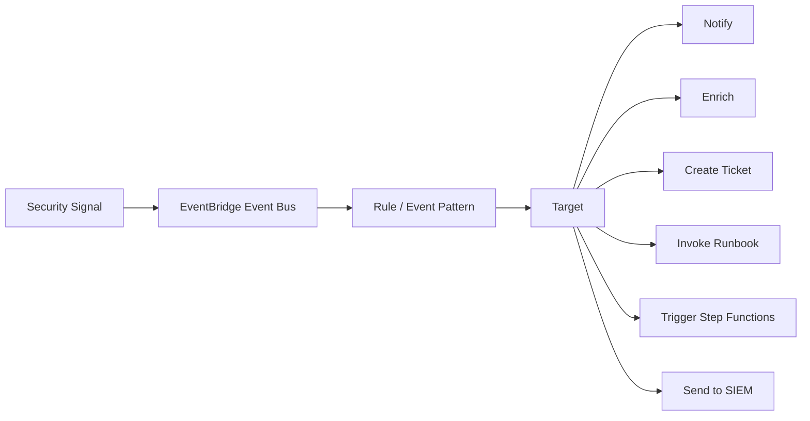

Tetapi routing saja belum cukup.

Security automation yang defensible membutuhkan lima lapisan:

1. **Signal layer**: sumber event.
2. **Routing layer**: EventBridge rule, bus, filtering.
3. **Context layer**: enrichment dan correlation.
4. **Decision layer**: menentukan aksi berdasarkan risk, confidence, owner, environment, dan exception.
5. **Action layer**: notification, ticket, suppression, mitigation, remediation, rollback, evidence update.

EventBridge paling kuat ketika dipakai sebagai routing layer yang tipis, eksplisit, dan mudah diaudit.

---

## 2. EventBridge in One Page

Amazon EventBridge menyediakan event bus serverless untuk menerima event dari AWS services, aplikasi sendiri, dan SaaS/partner sources, lalu mengirimkannya ke target berdasarkan rule.

Komponen penting:

| Komponen | Fungsi |
|---|---|
| Event | JSON message yang merepresentasikan sesuatu yang terjadi. |
| Event bus | Router yang menerima event dan mengevaluasi rules. |
| Rule | Filter berbasis event pattern. Jika match, event dikirim ke target. |
| Event pattern | Deklarasi matching terhadap field event. |
| Target | Tujuan event: Lambda, Step Functions, SNS, SQS, Kinesis, Systems Manager, API destination, dan lain-lain. |
| Input transformer | Transformasi payload sebelum dikirim ke target. |
| Archive/replay | Menyimpan event agar bisa diputar ulang untuk debugging atau reprocessing. |
| Dead-letter queue | SQS queue untuk event yang gagal dikirim ke target. |
| Retry policy | Konfigurasi retry delivery ke target. |

EventBridge bukan queue durable untuk workflow panjang.

EventBridge bukan database.

EventBridge bukan policy engine.

EventBridge adalah router event.

Gunakan ia untuk memilih dan mengirim event. Jangan memaksanya menjadi tempat menyimpan state remediation yang kompleks.

---

## 3. Why EventBridge Matters for Security

Security response di AWS punya masalah klasik:

- sinyal tersebar di banyak service;
- akun tersebar di banyak account;
- finding memiliki schema berbeda;
- tiap tim punya ownership berbeda;
- severity bawaan service belum tentu sama dengan risk bisnis;
- remediation bisa berbahaya jika dieksekusi tanpa konteks;
- audit membutuhkan bukti bahwa event ditangani.

EventBridge membantu karena ia bisa menjadi **common reaction plane**.

Contoh:

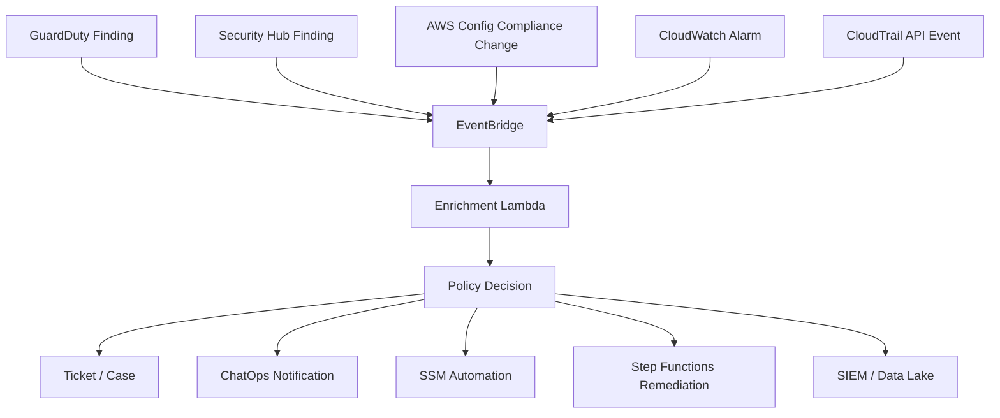

Yang penting: EventBridge membuat reaksi security menjadi **event-driven**, bukan bergantung pada manusia yang membuka dashboard setiap hari.

---

## 4. The Security Automation Pipeline

Security automation pipeline yang baik biasanya seperti ini:

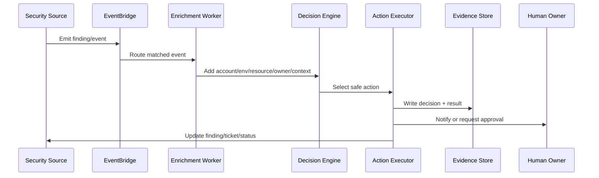

Pipeline ini memisahkan concerns:

- EventBridge hanya memilih event.
- Enrichment worker mengumpulkan konteks.
- Decision engine menentukan aksi.
- Action executor melakukan aksi.
- Evidence store menyimpan jejak keputusan.
- Human owner tetap ada untuk aksi yang berisiko.

Kesalahan umum adalah membuat Lambda target EventBridge langsung melakukan remediation destruktif tanpa enrichment, approval, idempotency, dan rollback.

Itu bukan automation. Itu distributed foot-gun.

---

## 5. Event Sources for AWS Security Automation

### 5.1 Security Hub Findings

Security Hub mengirim finding baru dan update finding ke EventBridge. Dalam banyak desain, Security Hub menjadi aggregation layer sebelum event dirutekan ke remediation.

Gunakan Security Hub ketika:

- ingin normalize finding dari banyak service;
- ingin severity/control/finding lifecycle dikelola terpusat;
- ingin routing berbasis account, product, control ID, workflow status, atau compliance status;
- ingin integrasi dengan GuardDuty, Inspector, Macie, Config, dan custom findings.

Contoh high-level:

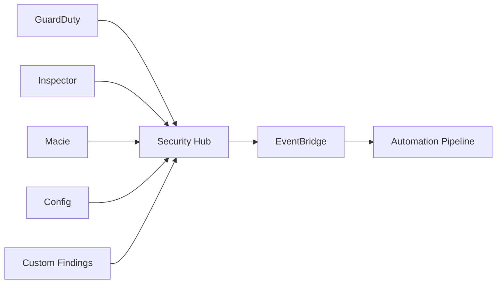

Security Hub cocok sebagai **finding normalization gateway**.

Namun jangan bergantung buta pada severity bawaan. Severity harus digabung dengan business context.

### 5.2 GuardDuty Direct Events

GuardDuty findings juga bisa muncul sebagai EventBridge events. Gunakan direct GuardDuty events saat response harus sangat cepat atau sebelum finding dinormalisasi ke Security Hub.

Contoh:

- credential exfiltration finding;
- crypto mining finding;
- malware-related signal;
- unusual API call behavior;
- suspicious network behavior.

Dalam environment besar, direct GuardDuty events biasanya tetap dikirim ke pipeline yang sama dengan findings dari Security Hub agar lifecycle dan evidence tetap konsisten.

### 5.3 AWS Config Compliance Change

AWS Config berguna untuk remediation berbasis state.

Contoh:

- S3 bucket public;
- security group membuka port berbahaya;
- EBS volume tidak encrypted;
- CloudTrail disabled;
- KMS key rotation disabled;
- root account MFA disabled;
- resource tidak memiliki mandatory tag.

Config event bagus untuk **detective compliance automation**.

Namun hati-hati: Config compliance tidak selalu sama dengan exploitability. Jangan langsung menghapus resource hanya karena `NON_COMPLIANT`.

### 5.4 CloudTrail API Events

CloudTrail API activity dapat dipakai untuk trigger response terhadap control-plane action penting.

Contoh event yang layak dimonitor:

- `StopLogging` pada CloudTrail;
- `DeleteTrail`;
- `PutBucketPolicy` pada bucket sensitif;
- `DisableKey` atau `ScheduleKeyDeletion` pada KMS key;
- `AuthorizeSecurityGroupIngress` dengan public CIDR;
- `CreateAccessKey` untuk IAM user;
- `PutRolePolicy` atau `AttachRolePolicy` untuk privilege escalation;
- `UpdateAssumeRolePolicy`;
- `DisableAlarmActions`;
- `DeleteDetector` pada GuardDuty;
- `BatchDisableStandards` pada Security Hub.

Ini adalah contoh **control-plane tamper detection**.

### 5.5 CloudWatch Alarm State Change

CloudWatch alarm state changes bisa masuk ke EventBridge.

Gunakan untuk:

- latency/error budget breach;
- unusual authentication failure rate;
- data transfer spike;
- WAF blocked request anomaly;
- Lambda error spike pada remediation worker;
- DLQ depth naik;
- log delivery failure.

Security automation juga butuh monitoring untuk dirinya sendiri.

---

## 6. Security Event Schema: Normalize Early, Preserve Raw

Event dari AWS services berbeda-beda bentuknya.

Security Hub memakai AWS Security Finding Format. GuardDuty punya finding schema sendiri. Config punya compliance event schema sendiri. CloudTrail punya `eventName`, `eventSource`, `userIdentity`, `requestParameters`, dan seterusnya.

Prinsipnya:

1. Simpan raw event.
2. Normalize ke internal security event model.
3. Jangan buang field asli.
4. Tambahkan enrichment sebagai field baru.
5. Simpan versi schema.

Contoh internal normalized model:

```json
{
  "event_id": "uuid",
  "source_service": "securityhub",
  "source_product": "guardduty",
  "aws_account_id": "111122223333",
  "region": "ap-southeast-1",
  "environment": "prod",
  "resource_type": "AwsEc2Instance",
  "resource_id": "i-0123456789abcdef0",
  "finding_type": "UnauthorizedAccess:IAMUser/InstanceCredentialExfiltration",
  "severity": "HIGH",
  "business_priority": "P1",
  "confidence": 0.91,
  "owner_team": "payments-platform",
  "action_policy": "isolate-instance-require-approval",
  "raw_event_ref": "s3://security-events-archive/..."
}
```

Normalized model memudahkan:

- routing lintas source;
- SLA;
- deduplication;
- ownership;
- reporting;
- case management;
- correlation;
- audit.

Namun raw event tetap wajib disimpan untuk forensic integrity.

---

## 7. EventBridge Rule Design

EventBridge rule harus presisi.

Rule yang terlalu luas akan membuat noise. Rule yang terlalu sempit akan melewatkan insiden.

### 7.1 Pattern by Source and Detail Type

Contoh pola awal untuk Security Hub findings versi klasik:

```json
{
  "source": ["aws.securityhub"],
  "detail-type": ["Security Hub Findings - Imported"]
}
```

Dalam beberapa konfigurasi Security Hub terbaru, event type v2 dapat berbeda. Untuk environment nyata, selalu validasi event sample dari account sendiri dan buat contract test untuk event pattern.

### 7.2 Pattern by Product and Severity

Contoh routing finding GuardDuty dari Security Hub dengan severity tinggi:

```json
{
  "source": ["aws.securityhub"],
  "detail-type": ["Security Hub Findings - Imported"],
  "detail": {
    "findings": {
      "ProductName": ["GuardDuty"],
      "Severity": {
        "Label": ["HIGH", "CRITICAL"]
      },
      "Workflow": {
        "Status": ["NEW"]
      }
    }
  }
}
```

Catatan penting: struktur event harus diuji terhadap sample aktual. Jangan menyalin event pattern dari internet tanpa event contract test.

### 7.3 Pattern by Control ID

Untuk Security Hub controls, routing sebaiknya memakai control ID, bukan title.

Title/deskripsi bisa berubah. Control ID jauh lebih stabil.

Contoh konseptual:

```json
{
  "source": ["aws.securityhub"],
  "detail-type": ["Security Hub Findings - Imported"],
  "detail": {
    "findings": {
      "GeneratorId": ["security-control/S3.8"]
    }
  }
}
```

Di environment production, validasi apakah field yang dipakai adalah `GeneratorId`, `Compliance.SecurityControlId`, atau field lain sesuai event version yang dipakai.

### 7.4 Pattern by Account and Region

Gunakan account/region untuk routing ownership:

```json
{
  "account": ["111122223333", "444455556666"],
  "region": ["ap-southeast-1", "us-east-1"],
  "source": ["aws.securityhub"]
}
```

Tetapi hindari hardcode daftar account terlalu banyak. Untuk organisasi besar, enrichment layer lebih baik mengambil account metadata dari account registry.

---

## 8. EventBridge Should Not Encode Business Logic Too Deeply

EventBridge event pattern kuat, tetapi jangan jadikan ia policy engine kompleks.

Gunakan EventBridge untuk:

- memisahkan source;
- memisahkan event type;
- memisahkan severity kasar;
- memisahkan account/region penting;
- memisahkan event yang jelas tidak relevan.

Jangan gunakan EventBridge untuk:

- menghitung risk score kompleks;
- mengambil exception approval;
- memutuskan remediation destruktif;
- menyimpan state workflow;
- melakukan deduplication berat;
- melakukan correlation lintas 10 sumber.

Rule harus mudah dibaca oleh engineer on-call pada pukul 03:00.

Jika rule sulit dipahami, pindahkan logika ke enrichment/decision layer.

---

## 9. Enrichment Layer

Security event jarang cukup dengan dirinya sendiri.

Finding seperti:

```text
S3 bucket is public
```

belum menjawab:

- bucket ini milik tim siapa?
- environment apa?
- ada data sensitif tidak?
- bucket ini internet-facing by design tidak?
- ada approved exception tidak?
- bucket ini baru dibuat atau sudah lama?
- bucket ini dipakai workload kritikal tidak?
- bucket policy berubah oleh siapa?
- apakah public access baru terjadi setelah deployment tertentu?

Enrichment layer mengambil konteks dari:

- account registry;
- tag registry;
- CMDB/service catalog;
- AWS Organizations;
- AWS Config relationship/history;
- CloudTrail recent events;
- Security Hub related findings;
- Macie sensitive data signal;
- Inspector vulnerability signal;
- IAM Access Analyzer external access;
- deployment metadata;
- incident/ticket system;
- exception registry;
- ownership registry.

Contoh enrichment flow:

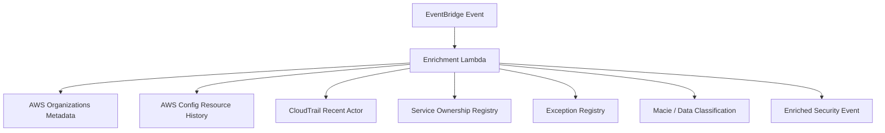

Tanpa enrichment, automation hanya melihat resource ID.

Dengan enrichment, automation melihat risk context.

---

## 10. Decision Layer

Decision layer menjawab:

> Dengan konteks ini, aksi apa yang aman dan proporsional?

Input keputusan:

- severity teknis;
- confidence;
- asset criticality;
- environment;
- data classification;
- internet exposure;
- privilege level;
- active threat signal;
- exploitability;
- owner;
- exception status;
- change window;
- remediation reversibility;
- business impact;
- blast radius;
- historical false positive rate.

Output keputusan:

| Decision | Meaning |
|---|---|
| `ignore` | Event tidak relevan atau sudah di-suppress secara valid. |
| `notify` | Kirim notifikasi, tidak buat ticket. |
| `create-case` | Buat ticket/case dengan SLA. |
| `enrich-only` | Tambahkan metadata ke finding. |
| `manual-approval` | Tunggu approval sebelum aksi. |
| `auto-mitigate` | Lakukan mitigasi reversible. |
| `auto-remediate` | Lakukan perbaikan penuh. |
| `escalate-incident` | Naikkan ke incident response. |

Decision layer bisa berupa Lambda sederhana, Step Functions, policy-as-code engine, atau security orchestration platform.

Yang penting: keputusan harus bisa dijelaskan ulang.

Setiap keputusan minimal menyimpan:

```json
{
  "event_id": "...",
  "decision": "auto-mitigate",
  "reason": "prod instance credential exfiltration finding with high confidence",
  "inputs": {
    "severity": "HIGH",
    "environment": "prod",
    "owner_team": "payments-platform",
    "exception": false,
    "action_reversibility": "medium"
  },
  "approved_by": null,
  "decided_at": "2026-07-06T10:15:30+07:00"
}
```

---

## 11. Action Layer

Action layer menjalankan keputusan.

Target umum EventBridge untuk security automation:

| Target | Use Case |
|---|---|
| Lambda | Enrichment ringan, routing, small remediation. |
| Step Functions | Multi-step remediation, approval, rollback path. |
| Systems Manager Automation | AWS resource remediation runbooks. |
| SNS | Notification fan-out. |
| SQS | Buffering, retry, backpressure. |
| API Destination | Ticketing/SOAR/external webhook. |
| Kinesis/Firehose | SIEM/data lake ingestion. |
| Incident Manager | Incident response escalation. |

Prinsip penting:

- Lambda bagus untuk aksi kecil.
- Step Functions bagus untuk workflow panjang.
- SSM Automation bagus untuk AWS operations/runbook.
- SQS bagus sebagai buffer jika downstream lambat.
- API Destination bagus untuk integrasi SaaS, tetapi butuh auth/secret governance.
- Jangan gunakan satu Lambda raksasa untuk semua remediation.

---

## 12. Idempotency Is Not Optional

Event delivery bisa retry.

Event bisa duplicate.

Finding bisa update berkali-kali.

Rule bisa match ulang.

Automation harus idempotent.

Idempotency berarti aksi yang sama bisa dijalankan lebih dari sekali tanpa menyebabkan kerusakan tambahan.

Contoh:

| Aksi | Idempotent Check |
|---|---|
| Create ticket | Cek `finding_id` sudah punya ticket belum. |
| Isolate instance | Cek instance sudah berada di quarantine SG belum. |
| Block public S3 | Cek Public Access Block sudah enabled. |
| Disable access key | Cek key masih active. |
| Add tag | Cek tag sudah ada. |
| Update finding workflow | Cek status saat ini. |

Gunakan idempotency key seperti:

```text
<source-service>/<finding-id>/<resource-id>/<action-type>
```

Simpan di DynamoDB atau case system.

Tanpa idempotency, retry bisa membuat incident kedua di atas incident pertama.

---

## 13. Deduplication and Correlation

Security Hub finding update bisa muncul sebagai event baru.

GuardDuty finding bisa memiliki sequence update.

Config compliance bisa flapping.

CloudWatch alarm bisa berubah `OK -> ALARM -> OK -> ALARM`.

Automasi harus membedakan:

- finding baru;
- finding update;
- duplicate event;
- repeated event;
- correlated event;
- reopened risk;
- new risk instance.

Dedup key yang sering dipakai:

```text
source_product + finding_type + resource_id + account_id + region
```

Untuk finding Security Hub, gunakan finding ID jika cocok. Namun kadang satu resource memiliki banyak finding dengan tipe berbeda, dan satu finding bisa update berkali-kali.

Correlation berguna untuk menaikkan prioritas.

Contoh:

```text
S3 bucket public
+ Macie sensitive data finding
+ CloudTrail PutBucketPolicy by non-deployment role
= escalate to P1
```

EventBridge tidak ideal untuk correlation kompleks. Gunakan enrichment/decision layer.

---

## 14. Centralized vs Local Event Routing

Dalam multi-account AWS, ada dua pola besar.

### 14.1 Local Account Routing

Setiap account punya EventBridge rules dan targets lokal.

Kelebihan:

- dekat dengan resource;
- latency rendah;
- permission lebih lokal;
- blast radius rule kecil.

Kekurangan:

- sulit konsisten;
- banyak deployment;
- sulit update rule global;
- observability automation tersebar.

### 14.2 Centralized Security Event Bus

Member accounts mengirim event ke central security account.

Kelebihan:

- governance terpusat;
- enrichment dan decision seragam;
- SIEM/case integration lebih mudah;
- security team punya visibility lintas account.

Kekurangan:

- perlu cross-account event bus policy;
- perlu desain permission target lintas account;
- central bus menjadi dependency penting;
- butuh routing balik untuk remediation lokal.

### 14.3 Hybrid Pattern

Pola yang biasanya paling kuat:

- detection/finding routing terpusat;
- enrichment/decision terpusat;
- execution bisa lokal melalui delegated role atau SSM Automation;
- emergency local controls tetap ada untuk failure mode central plane.

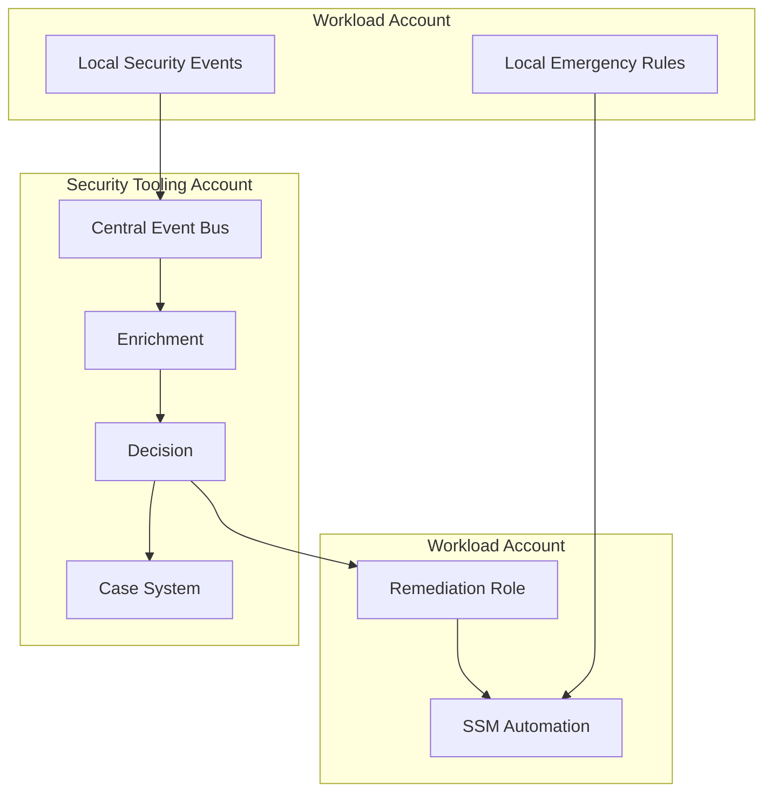

Pola ini menjaga central visibility tanpa kehilangan local response capability.

---

## 15. EventBridge Permissions and Cross-Account Trust

Security automation sering gagal bukan karena rule salah, tetapi karena trust salah.

Yang perlu dipikirkan:

- siapa boleh put event ke central bus;
- account mana yang dipercaya;
- event bus policy membatasi organization ID atau account IDs;
- target role apa yang dipakai EventBridge;
- Lambda/Step Functions/SSM target punya permission apa;
- remediation role di workload account boleh melakukan aksi apa;
- apakah target role bisa disalahgunakan untuk privilege escalation.

Gunakan prinsip:

> Routing permission should not imply remediation permission.

Account boleh mengirim event ke bus, tetapi tidak otomatis boleh memicu remediation destruktif.

Decision layer harus menjadi gate.

---

## 16. Input Transformer: Useful, But Keep It Simple

Input transformer berguna untuk mengubah event menjadi payload target yang lebih ringkas.

Contoh pemakaian:

- membuat pesan SNS/Slack singkat;
- mengambil finding ID, severity, account, resource;
- mengubah event ke payload API destination;
- mengurangi ukuran payload.

Namun jangan jadikan input transformer sebagai logic engine.

Jika transformasi membutuhkan kondisi kompleks, enrichment, atau lookup eksternal, gunakan Lambda/Step Functions.

---

## 17. Retry, DLQ, and Failure Semantics

Security automation harus punya failure design.

Pertanyaan wajib:

- Jika target Lambda gagal, event hilang atau retry?
- Jika ticketing system down, event masuk DLQ?
- Jika SSM Automation gagal, siapa diberi tahu?
- Jika EventBridge rule terlalu luas, bagaimana mematikan rule dengan aman?
- Jika automation menciptakan loop, bagaimana mendeteksinya?

Gunakan:

- retry policy;
- dead-letter queue;
- target-level error alarm;
- DLQ depth alarm;
- replay strategy;
- circuit breaker;
- kill switch;
- max concurrent execution;
- idempotency table;
- audit log untuk every decision and action.

Automation yang tidak punya failure handling akan menjadi sumber incident.

---

## 18. Avoid Automation Loops

Loop umum:

1. Security Hub finding dikirim ke EventBridge.
2. Lambda update finding status.
3. Update finding menghasilkan event baru.
4. Event baru match rule yang sama.
5. Lambda update lagi.
6. Loop.

Cara mencegah:

- filter `Workflow.Status = NEW`;
- tag action metadata;
- cek idempotency table;
- jangan route event yang berasal dari automation role tertentu;
- gunakan action state machine;
- pisahkan event bus untuk raw findings dan processed findings;
- simpan `processed_by` dan `processed_at`.

Automation loop bukan masalah teoretis. Dalam environment besar, loop bisa membuat biaya, spam, rate limit, dan noisy incident.

---

## 19. EventBridge Security Automation Patterns

### Pattern 1: Notify Only

Dipakai untuk low-risk atau early rollout.

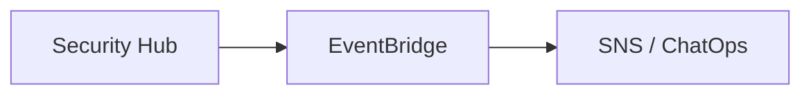

Cocok untuk:

- rule baru;
- service baru;
- high false-positive signal;
- onboarding awal.

### Pattern 2: Create Ticket with Enrichment

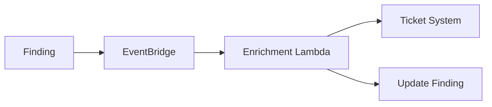

Cocok untuk:

- compliance violation;
- medium severity vulnerability;
- owner-driven remediation;
- actions requiring application context.

### Pattern 3: Manual Approval Before Remediation

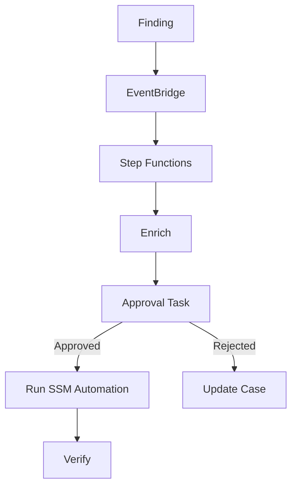

Cocok untuk:

- production resources;
- potentially disruptive remediation;
- uncertain ownership;
- reversible but impactful action.

### Pattern 4: Auto-Mitigation, Human Remediation

Automation melakukan mitigasi cepat, tetapi perbaikan root cause tetap oleh owner.

Contoh:

- remove public ingress sementara;
- quarantine instance;
- block public access;
- disable leaked access key;
- apply temporary deny policy.

Setelah mitigasi, ticket dibuat untuk root-cause remediation.

### Pattern 5: Auto-Remediation with Verification

Dipakai hanya untuk aksi yang:

- high confidence;
- low blast radius;
- reversible;
- punya verification step;
- punya idempotency;
- punya exception model.

Contoh:

- enable S3 Block Public Access pada bucket non-exempt;
- set CloudWatch log retention default;
- add missing mandatory tag jika owner dapat disimpulkan;
- re-enable GuardDuty detector;
- re-enable Config recorder;
- restore default EBS encryption.

---

## 20. Case Study: Public S3 Bucket Finding

### 20.1 Naive Automation

```text
If S3 bucket public, immediately delete bucket policy.
```

Ini buruk.

Kenapa?

- Bucket bisa saja memang public static website yang disetujui.
- Menghapus policy bisa mematikan production traffic.
- Finding bisa stale.
- Public exposure bisa berasal dari ACL, bucket policy, access point, atau block public access setting.
- Perlu tahu apakah bucket berisi sensitive data.

### 20.2 Better Automation

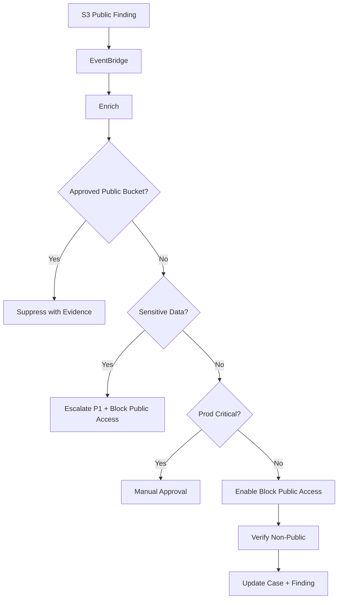

Aksi berbeda berdasarkan konteks.

Inilah security automation yang matang.

---

## 21. Case Study: IAM Access Key Created for IAM User

Static access key untuk IAM user sering menjadi risiko.

Pipeline:

1. CloudTrail event `CreateAccessKey` muncul.
2. EventBridge rule match event.
3. Enrichment cek user, account, environment, ticket/approval.
4. Decision:
   - approved service account? create evidence and monitor;
   - unapproved human user? disable key or escalate;
   - prod account? high priority;
   - root user? incident.
5. Action:
   - notify security;
   - create ticket;
   - optionally deactivate key;
   - update risk register.

Event pattern konseptual:

```json
{
  "source": ["aws.iam"],
  "detail-type": ["AWS API Call via CloudTrail"],
  "detail": {
    "eventSource": ["iam.amazonaws.com"],
    "eventName": ["CreateAccessKey"]
  }
}
```

Ingat: event shape CloudTrail lewat EventBridge harus diuji di account sendiri.

---

## 22. Case Study: CloudTrail Tampering Attempt

Jika seseorang memanggil `StopLogging`, `DeleteTrail`, atau mengubah bucket delivery audit, ini harus dianggap serius.

Pipeline:

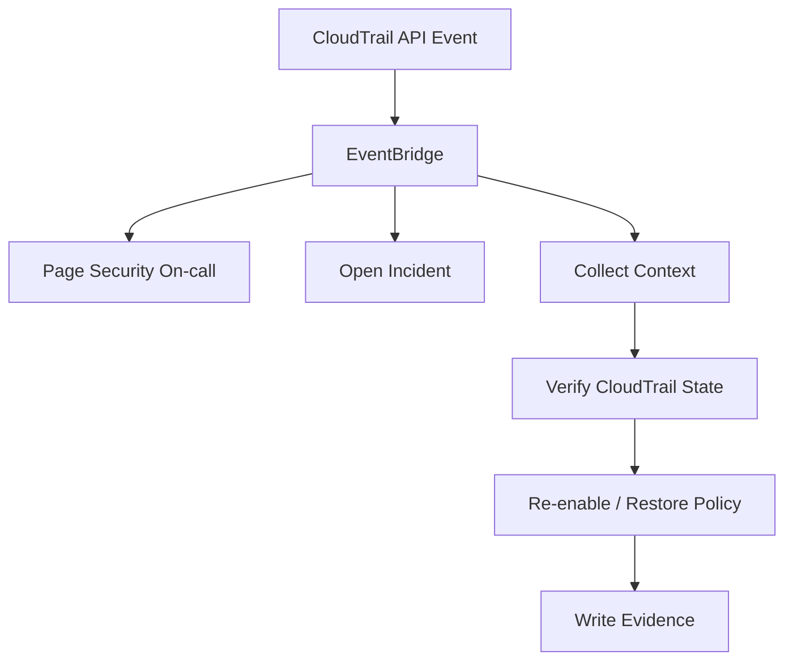

Untuk audit control, mitigation biasanya lebih aman daripada menunggu jam kerja.

Namun tetap perlu guardrail:

- re-enable hanya jika event terkonfirmasi;
- jangan overwrite intentional maintenance tanpa approval;
- simpan actor dan source IP;
- cek apakah role automation yang melakukan perubahan.

---

## 23. Testing EventBridge Security Automation

Security automation harus dites seperti production code.

Minimal test suite:

| Test | Tujuan |
|---|---|
| Event pattern test | Memastikan event penting match dan noise tidak match. |
| Schema contract test | Memastikan field yang dipakai masih ada. |
| Idempotency test | Event duplicate tidak membuat aksi ganda. |
| Permission test | Target punya permission cukup tapi tidak berlebihan. |
| Failure test | Target gagal masuk DLQ dan alarm menyala. |
| Replay test | Event archive bisa diputar ulang aman. |
| Dry-run test | Action dapat disimulasikan. |
| Rollback test | Remediation bisa dibalik jika salah. |
| Exception test | Approved exception tidak dieksekusi. |
| Chaos test | Downstream ticketing/SIEM down tidak menghilangkan event. |

Jangan deploy automation tanpa sample events.

Simpan sample event dalam repository sebagai test fixture.

---

## 24. Deployment Strategy

Rollout yang aman:

1. **Observe mode**: hanya log event matched.
2. **Notify mode**: kirim notifikasi.
3. **Ticket mode**: buat case dengan owner.
4. **Suggest mode**: lampirkan remediation recommended.
5. **Manual approval mode**: jalankan remediation setelah approval.
6. **Auto-mitigate mode**: aksi reversible untuk high-confidence cases.
7. **Auto-remediate mode**: full remediation untuk safe patterns.

Jangan langsung lompat ke auto-remediate.

Gunakan feature flag per:

- account;
- OU;
- region;
- finding type;
- environment;
- owner team;
- resource type;
- remediation action.

---

## 25. Observability for the Automation Itself

Security automation juga harus dimonitor.

Metrics penting:

- events matched per rule;
- events processed;
- enrichment success/failure;
- decision distribution;
- actions executed;
- actions failed;
- DLQ depth;
- retry count;
- duplicate event count;
- mean time to notify;
- mean time to mitigate;
- mean time to remediate;
- false positive rate;
- automation rollback count;
- suppressed finding count;
- manual approval latency.

Alarm penting:

- EventBridge target failure;
- DLQ depth > 0;
- enrichment Lambda error spike;
- Step Functions failed execution;
- SSM Automation failed execution;
- no security events received for unexpected long period;
- abnormal spike in event volume;
- automation role AccessDenied spike.

Security automation yang tidak dimonitor adalah blind robot.

---

## 26. Security Automation Governance

Setiap automation rule harus punya metadata:

```yaml
rule_id: sec-auto-s3-public-bucket-v1
owner: cloud-security-platform
purpose: Route non-exempt public S3 findings to remediation pipeline
source: aws.securityhub
action_mode: manual-approval
risk: medium
blast_radius: account-local
rollback: supported
exception_registry: security-exceptions/s3-public-bucket
last_reviewed: 2026-07-06
```

Governance fields:

- owner;
- purpose;
- input event type;
- action target;
- permission used;
- expected volume;
- failure behavior;
- rollback plan;
- evidence location;
- approval model;
- exception model;
- change history;
- last reviewed date.

Tanpa metadata ini, automation menjadi legacy system yang tidak berani disentuh.

---

## 27. Anti-Patterns

### 27.1 One Lambda to Rule Them All

Satu Lambda menerima semua findings, semua sumber, semua remediation.

Masalah:

- sulit diuji;
- blast radius besar;
- permission membengkak;
- ownership tidak jelas;
- rollback sulit;
- log sulit dibaca.

Pisahkan berdasarkan domain aksi.

### 27.2 Direct Destructive Remediation

Finding masuk, resource langsung dihapus.

Ini biasanya salah.

Mitigation harus proporsional dan reversible jika mungkin.

### 27.3 No Exception Model

Tanpa exception model, tim aplikasi akan mematikan rule atau mengabaikan notifikasi.

Exception harus:

- time-bound;
- owner-bound;
- reason-bound;
- risk-accepted;
- auditable;
- auto-expiring.

### 27.4 Severity-Only Routing

`HIGH` tidak selalu P1.

Risk butuh konteks.

### 27.5 No Replay Safety

Jika event diputar ulang dan remediation berjalan lagi tanpa idempotency, replay menjadi berbahaya.

Replay harus bisa dilakukan dalam dry-run mode.

---

## 28. Production Checklist

Sebelum sebuah security EventBridge automation dianggap production-ready:

- [ ] Event pattern diuji dengan sample event nyata.
- [ ] Rule punya owner dan purpose.
- [ ] Target punya IAM permission minimal.
- [ ] Input schema punya contract test.
- [ ] Event raw disimpan atau bisa direferensikan.
- [ ] Enrichment source jelas.
- [ ] Decision reason disimpan.
- [ ] Idempotency diterapkan.
- [ ] Duplicate events aman.
- [ ] Retry policy jelas.
- [ ] DLQ dikonfigurasi.
- [ ] DLQ punya alarm.
- [ ] Target failure punya alarm.
- [ ] Automation action punya dry-run mode.
- [ ] Manual approval tersedia untuk aksi berisiko.
- [ ] Rollback path terdokumentasi.
- [ ] Exception registry tersedia.
- [ ] Metrics dan dashboard tersedia.
- [ ] Audit evidence tersimpan.
- [ ] Kill switch tersedia.
- [ ] Change review dilakukan.

---

## 29. Minimal Reference Architecture

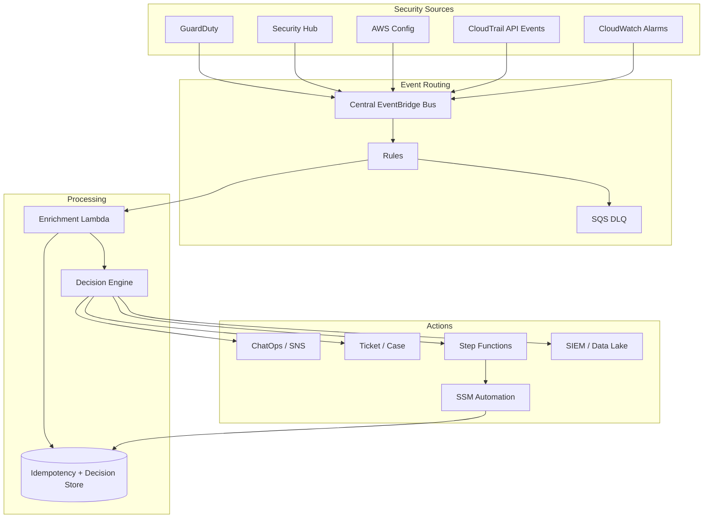

Ini bukan satu-satunya arsitektur, tetapi pola ini menjaga separation of concern:

- EventBridge: routing;
- Lambda: enrichment ringan;
- DynamoDB: idempotency/decision record;
- Decision engine: policy decision;
- Step Functions/SSM: controlled action;
- ticket/SIEM: human workflow dan evidence.

---

## 30. Key Takeaways

Security automation dengan EventBridge harus dipahami sebagai **event-driven governance pipeline**.

Hal yang penting bukan hanya “membuat rule”. Yang penting adalah memastikan event yang tepat masuk, diproses dengan konteks, diputuskan secara proporsional, dieksekusi dengan aman, dan meninggalkan evidence.

Ingat invariant berikut:

> EventBridge routes events. It should not become an opaque, destructive security brain.

Gunakan EventBridge untuk membuat security response lebih cepat, lebih konsisten, dan lebih auditable. Jangan gunakan EventBridge untuk melewati pemikiran risiko, approval, ownership, dan rollback.

Part berikutnya akan membahas pola automated remediation konkret: quarantine, revoke, block, isolate, re-enable, tag, suppress, rollback, dan verification.

---

## References

- Amazon EventBridge User Guide — What is Amazon EventBridge: https://docs.aws.amazon.com/eventbridge/latest/userguide/eb-what-is.html
- Amazon EventBridge rules: https://docs.aws.amazon.com/eventbridge/latest/userguide/eb-rules.html
- Amazon EventBridge event patterns: https://docs.aws.amazon.com/eventbridge/latest/userguide/eb-event-patterns.html
- Amazon EventBridge event pattern syntax and content filtering: https://docs.aws.amazon.com/eventbridge/latest/userguide/eb-create-pattern.html
- Amazon EventBridge input transformer: https://docs.aws.amazon.com/eventbridge/latest/userguide/eb-transform-target-input.html
- Amazon EventBridge dead-letter queues: https://docs.aws.amazon.com/eventbridge/latest/userguide/eb-rule-dlq.html
- AWS Security Hub — Using EventBridge for automated response and remediation: https://docs.aws.amazon.com/securityhub/latest/userguide/securityhub-cloudwatch-events.html
- AWS Security Hub event types in EventBridge: https://docs.aws.amazon.com/securityhub/latest/userguide/securityhub-cwe-integration-types.html
- AWS Security Hub automation rules: https://docs.aws.amazon.com/securityhub/latest/userguide/automations.html
- AWS Systems Manager Automation: https://docs.aws.amazon.com/systems-manager/latest/userguide/systems-manager-automation.html
