# Part 048 — Automated Remediation Patterns

Automated remediation adalah bagian security engineering yang paling mudah terlihat keren, tetapi juga paling mudah menghancurkan produksi.

Menutup security group otomatis terdengar bagus sampai ternyata port itu dipakai traffic production.

Men-disable access key otomatis terdengar benar sampai ternyata key itu dipakai legacy batch pembayaran yang belum dimigrasi.

Menghapus bucket policy otomatis terdengar aman sampai static website customer-facing mati.

Mengisolasi EC2 instance otomatis terdengar defensif sampai instance itu adalah node penting dalam cluster stateful.

Jadi tujuan part ini bukan membuat robot agresif.

Tujuannya adalah membuat **remediation system yang aman, proporsional, reversible, observable, auditable, dan bisa dijelaskan**.

Automated remediation yang matang tidak bertanya:

> Bisa kita otomatis perbaiki ini?

Ia bertanya:

> Dalam kondisi apa aksi ini aman, bagaimana kita membuktikannya, bagaimana kita membaliknya, dan siapa bertanggung jawab jika salah?

---

## 1. Remediation vs Mitigation vs Containment

Jangan campur tiga istilah ini.

| Istilah | Arti | Contoh |
|---|---|---|
| Mitigation | Mengurangi risiko sementara. | Enable S3 Block Public Access sementara. |
| Containment | Membatasi penyebaran atau dampak insiden. | Quarantine EC2 instance. |
| Remediation | Memperbaiki root cause. | Mengubah IaC agar security group tidak membuka port publik lagi. |

Banyak “automated remediation” sebenarnya hanya automated mitigation.

Itu tidak salah.

Yang salah adalah menganggap mitigasi sementara sebagai root-cause fix.

Contoh:

```text
Finding: security group exposes SSH to 0.0.0.0/0
Auto action: remove ingress rule
Root cause: IaC module masih membuat rule itu
Real remediation: fix Terraform/CloudFormation/CDK source, redeploy, verify drift closed
```

Jika automation hanya memperbaiki runtime state tetapi IaC tetap salah, issue akan kembali pada deployment berikutnya.

---

## 2. The Remediation Safety Ladder

Gunakan ladder ini sebelum memilih aksi.

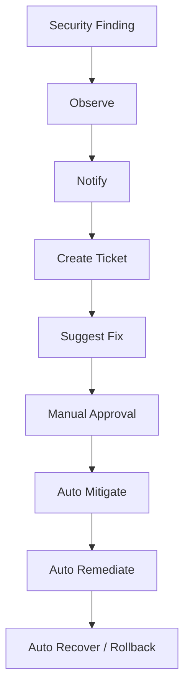

Semakin ke bawah, semakin tinggi risiko operasional.

Jangan otomatisasi pada level lebih rendah sebelum level di atasnya stabil.

| Level | Kapan Dipakai |
|---|---|
| Observe | Rule baru, belum tahu false positive rate. |
| Notify | Risiko rendah, perlu awareness. |
| Create Ticket | Owner perlu mengambil aksi. |
| Suggest Fix | Remediation jelas tetapi perlu manusia. |
| Manual Approval | Aksi berisiko, production, impact tidak pasti. |
| Auto Mitigate | Risiko tinggi, aksi reversible, confidence tinggi. |
| Auto Remediate | Aksi aman, deterministik, teruji, low blast radius. |
| Auto Recover | Ada rollback teruji jika aksi salah. |

---

## 3. Golden Rules for Automated Remediation

### Rule 1: Never automate what you cannot explain

Setiap aksi harus punya alasan yang bisa dibaca manusia.

Buruk:

```text
Automation changed security group.
```

Baik:

```text
Automation removed ingress tcp/22 from 0.0.0.0/0 because resource is in prod OU, no approved exception exists, rule was created outside deployment role, and security control EC2.19 requires restricted SSH exposure.
```

### Rule 2: Prefer reversible actions

Aksi yang bisa dibalik lebih aman untuk otomatisasi.

Contoh reversible:

- add deny tag;
- attach quarantine SG;
- disable key sementara;
- enable block public access;
- change finding workflow status;
- create snapshot before modification;
- detach risky policy after preserving previous state.

Contoh kurang reversible:

- delete resource;
- delete bucket policy tanpa backup;
- schedule KMS key deletion;
- terminate instance;
- permanently delete secret;
- purge queue.

### Rule 3: Always preserve pre-state

Sebelum mengubah resource, simpan state lama.

Minimal:

```json
{
  "resource_id": "sg-0123456789abcdef0",
  "action": "remove-ingress-rule",
  "previous_state": {
    "ip_protocol": "tcp",
    "from_port": 22,
    "to_port": 22,
    "cidr": "0.0.0.0/0"
  },
  "restore_command": "aws ec2 authorize-security-group-ingress ...",
  "captured_at": "2026-07-06T10:00:00+07:00"
}
```

Tanpa pre-state, rollback menjadi tebak-tebakan.

### Rule 4: Verify after action

Remediation belum selesai ketika API call sukses.

Remediation selesai ketika control state sudah berubah.

Contoh:

- API `PutPublicAccessBlock` sukses;
- lalu cek bucket benar-benar tidak public;
- lalu cek Security Hub/Config finding resolved;
- lalu update ticket.

### Rule 5: Separate emergency containment from root cause remediation

Emergency containment bisa otomatis.

Root cause fix sering harus dilakukan di source code/IaC.

Jangan biarkan automation menutupi technical debt.

---

## 4. Reference Remediation Architecture

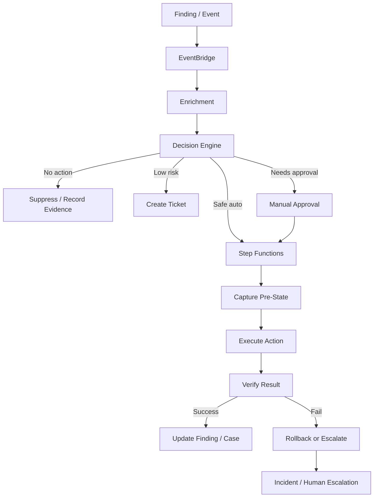

Aksi remediasi harus punya state machine.

Step Functions cocok untuk:

- multi-step flow;
- approval;
- retry;
- compensation;
- timeout;
- branching;
- audit trail;
- integration dengan SSM Automation/Lambda.

Systems Manager Automation cocok untuk:

- operasi AWS resource;
- runbook yang reusable;
- parameterized remediation;
- execution history;
- integration dengan Incident Manager/Config remediation.

Lambda cocok untuk:

- aksi kecil;
- enrichment;
- policy decision;
- glue logic.

---

## 5. Remediation Decision Matrix

Gunakan matrix ini sebagai baseline.

| Finding Type | Confidence | Business Impact if Wrong | Recommended Mode |
|---|---:|---:|---|
| Missing tag | High | Low | Auto-remediate if owner derivable. |
| Log retention missing | High | Low | Auto-remediate. |
| Public S3 with no sensitive data | Medium | Medium | Manual approval or auto-mitigate non-prod. |
| Public S3 with sensitive data | High | High | Auto-mitigate + incident escalation. |
| SSH open to world | High | Medium | Auto-mitigate if non-prod; approval for prod. |
| CloudTrail disabled | High | High | Auto-reenable + incident. |
| GuardDuty disabled | High | Medium | Auto-reenable + incident/ticket. |
| IAM access key created | Medium | Medium | Ticket; auto-disable only for disallowed principal class. |
| Instance credential exfiltration | High | High | Contain quickly; approval optional depending policy. |
| KMS key scheduled deletion | High | Very High | Cancel deletion if protected key; incident. |
| Critical CVE on prod workload | High | High | Ticket/incident; automation should not blindly patch unless patch policy allows. |

Yang menentukan bukan service, tetapi kombinasi:

- confidence;
- reversibility;
- blast radius;
- exploitability;
- environment;
- data sensitivity;
- operational dependency;
- exception state.

---

## 6. Pattern: S3 Public Access Mitigation

### Problem

S3 bucket menjadi public melalui bucket policy, ACL, access point, atau konfigurasi Public Access Block yang lemah.

### Invariant

```text
No non-exempt bucket containing internal/confidential/regulated data may be publicly accessible.
```

### Detection Sources

- Security Hub S3 controls;
- AWS Config S3 public read/write rules;
- IAM Access Analyzer external access findings;
- Macie sensitive data discovery;
- CloudTrail `PutBucketPolicy`, `PutBucketAcl`, `PutPublicAccessBlock`.

### Safe Action Ladder

1. Enrich bucket with owner, environment, classification, Macie signal.
2. Check exception registry.
3. Capture current bucket policy, ACL, access point, Public Access Block settings.
4. If sensitive data and no exception: enable account/bucket Public Access Block.
5. If approved public bucket: suppress with expiry and evidence.
6. Verify access is blocked.
7. Update finding and create root-cause ticket.

### Mermaid Flow

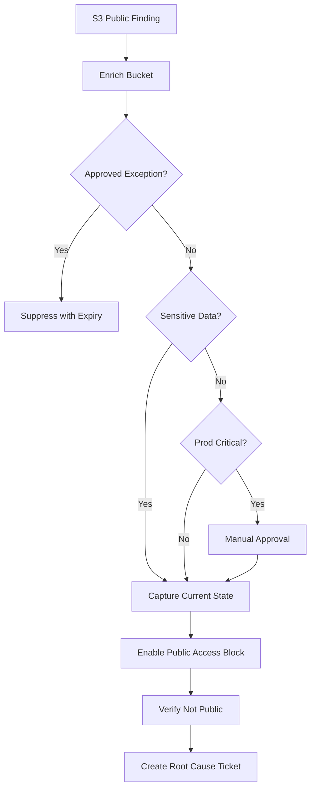

### Failure Modes

- Static website intentionally public.
- Bucket policy generated by deployment pipeline and will revert.
- Access point remains public after bucket-level change.
- Cross-account access required but looks public-like.
- Macie has not scanned bucket yet.

### Rollback

- Restore captured Public Access Block settings.
- Restore bucket policy only if approved.
- Require security approval if sensitive data exists.

---

## 7. Pattern: Security Group Public Ingress Mitigation

### Problem

Security group allows public ingress to risky ports.

Examples:

- SSH `22` from `0.0.0.0/0`;
- RDP `3389` from `0.0.0.0/0`;
- database port from internet;
- admin UI exposed publicly.

### Invariant

```text
No administrative or database port may be reachable from the public internet unless explicitly approved with expiry.
```

### Detection Sources

- Security Hub controls;
- AWS Config restricted common ports;
- Inspector network reachability;
- CloudTrail `AuthorizeSecurityGroupIngress`;
- VPC Flow Logs for observed traffic.

### Remediation Options

| Option | Risk | Notes |
|---|---:|---|
| Notify owner | Low | Good first stage. |
| Create ticket | Low | Good for planned remediation. |
| Remove exact ingress rule | Medium | Reversible if state captured. |
| Replace with approved corporate CIDR | Medium | Needs source-of-truth. |
| Attach quarantine SG | High | Can disrupt service. |
| Deny via NACL/firewall | High | Broad blast radius. |

### Safer Auto-Mitigation

- Only remove exact risky ingress rule.
- Do not rewrite entire security group.
- Capture pre-state.
- Verify resource attachment.
- Avoid removing rules created by approved deployment role in active change window unless policy says so.

### Flow

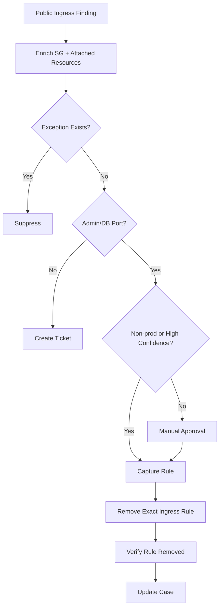

### Failure Modes

- Shared security group affects many workloads.
- Rule is required for emergency maintenance.
- Application uses non-standard port that looks risky.
- IaC redeploy reintroduces rule.
- Removal breaks health checks.

### Root Cause Fix

- Update IaC module.
- Replace public admin access with SSM Session Manager, VPN, private endpoint, or controlled access path.
- Add policy-as-code check in deployment pipeline.

---

## 8. Pattern: EC2 Instance Quarantine

### Problem

Instance suspected compromised.

Signals:

- GuardDuty instance compromise finding;
- malware detection;
- unusual outbound traffic;
- credential exfiltration;
- crypto mining behavior;
- command-and-control indicator.

### Goal

Contain the instance while preserving forensic evidence.

### Bad Automation

```text
Terminate instance immediately.
```

This destroys evidence and may break production.

### Safer Containment Actions

- Snapshot EBS volumes before modification if appropriate.
- Capture instance metadata, tags, security groups, IAM role, ENIs.
- Attach quarantine security group with no outbound except approved forensic endpoints.
- Detach from load balancer target group if needed.
- Preserve disk and memory evidence if process supports it.
- Disable instance profile credentials only if policy allows and impact understood.
- Create incident.

### Architecture

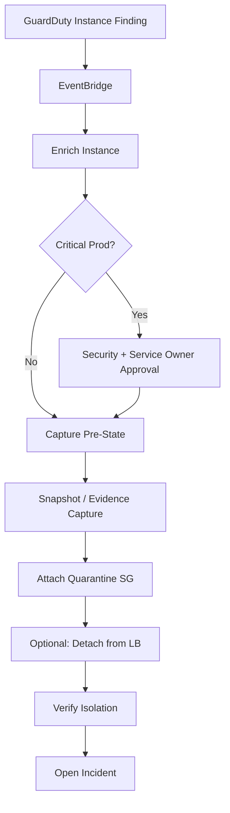

### Preconditions

- Quarantine SG exists in every VPC.
- Remediation role can modify ENI/security groups.
- Forensic bucket/log archive exists.
- Snapshot KMS key policy allows forensic account access.
- Incident escalation path exists.

### Failure Modes

- Instance has multiple ENIs.
- Security group is shared with other instances.
- Quarantine SG not present in VPC.
- Instance is part of Auto Scaling Group and replacement launches immediately.
- EBS snapshot policy violates data residency requirement.
- Attached IAM role continues to be usable from metadata until network blocked.

### Rollback

- Restore previous SG attachment.
- Re-register target if detached.
- Mark rollback reason.
- Keep forensic snapshot unless explicitly approved for deletion.

---

## 9. Pattern: IAM Access Key Disablement

### Problem

IAM user access key is created, exposed, unused, anomalous, or used from suspicious location.

### Detection Sources

- CloudTrail `CreateAccessKey`;
- GuardDuty credential compromise finding;
- IAM Access Analyzer unused access;
- credential leak scanner;
- CloudTrail anomalous API activity;
- AWS Config/IAM controls.

### Decision Dimensions

- Is this a human IAM user?
- Is key creation approved?
- Is account production?
- Is key actively used by critical workload?
- Is there evidence of compromise?
- Is there a migration path to role-based access?

### Action Ladder

| Situation | Action |
|---|---|
| Key created for root user | Incident. Delete/disable according to emergency runbook. |
| Human user creates key in prod without approval | Disable key or require approval depending policy. |
| Key found in public leak | Disable immediately, incident. |
| Unused old key | Notify, then disable after grace period. |
| Approved legacy service key | Ticket migration to role, monitor usage. |

### Flow

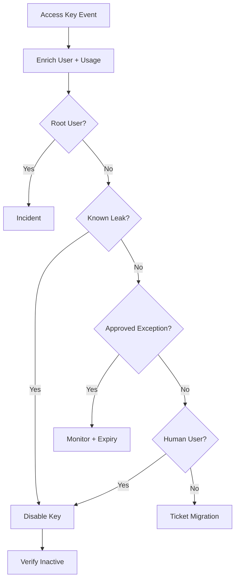

### Important Caution

Disabling an access key is reversible, but it can still break production.

For known compromise, security wins.

For policy cleanup, use staged deactivation:

1. notify owner;
2. observe last used;
3. deactivate;
4. monitor errors;
5. delete only after safe window.

---

## 10. Pattern: Re-enable Security Service Tampering

### Problem

Someone disables or tampers with security controls.

Targets:

- CloudTrail;
- Config recorder;
- GuardDuty detector;
- Security Hub standard/control;
- Macie;
- Inspector;
- CloudWatch alarm actions;
- S3 log bucket policy;
- KMS key used for logs.

### Invariant

```text
Baseline security services must not be disabled outside approved break-glass or maintenance workflows.
```

### Detection

CloudTrail API events:

- `StopLogging`;
- `DeleteTrail`;
- `StopConfigurationRecorder`;
- `DeleteDetector`;
- `DisableSecurityHub`;
- `BatchDisableStandards`;
- `DisableAlarmActions`;
- `ScheduleKeyDeletion`;
- `PutBucketPolicy` on log archive bucket.

### Action

- Page security on-call.
- Create incident.
- Capture actor, source IP, user agent, assumed role, session context.
- Re-enable control if safe and baseline policy says mandatory.
- Verify service state.
- Lock down further modification if needed.

### Flow

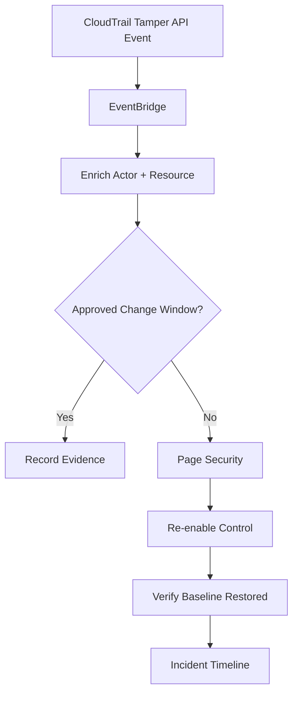

### Failure Modes

- Event arrives after service already disabled for several minutes.
- Automation lacks permission because SCP/key policy changed.
- Actor is break-glass role but change not recorded.
- Re-enable conflicts with maintenance.
- Cross-region service state differs.

### Guardrail

This pattern should be backed by SCP/RCP preventing disablement where possible. EventBridge remediation is a detective/responsive layer, not the only defense.

---

## 11. Pattern: KMS Key Deletion Cancellation

### Problem

A KMS key used by production data is scheduled for deletion or disabled.

This can become catastrophic because encrypted data may become unrecoverable if key material is deleted.

### Detection

- CloudTrail `ScheduleKeyDeletion`;
- CloudTrail `DisableKey`;
- AWS Config custom rule;
- Security Hub custom finding.

### Action

For protected keys:

- cancel key deletion;
- re-enable key if policy allows;
- page security/platform owner;
- create incident;
- capture actor/session;
- verify dependent services.

### Flow

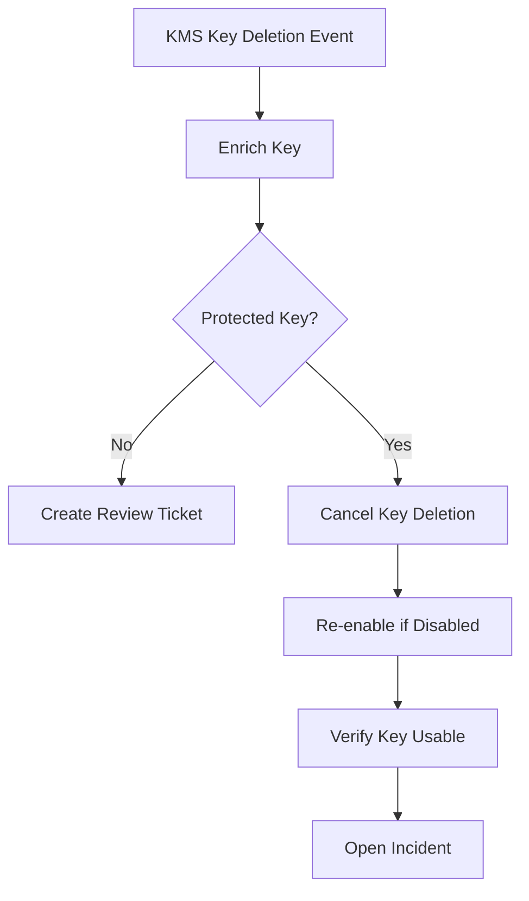

### Caution

Do not indiscriminately re-enable every KMS key. Some keys may be intentionally retired.

Use a protected key registry:

```yaml
key_id: arn:aws:kms:ap-southeast-1:111122223333:key/...
classification: production-critical
used_by:
  - rds-prod-payments
  - s3-audit-logs
owner: cloud-platform
allowed_actions:
  schedule_deletion: false
  disable: false
emergency_restore: true
```

---

## 12. Pattern: Missing Log Retention Auto-Fix

### Problem

CloudWatch log group has indefinite retention or does not meet policy.

### Why This Is Safe

Setting retention is usually low-risk compared with security group or IAM changes.

### Detection

- Config rule;
- scheduled inventory;
- CloudWatch Logs API scan;
- Security Hub control if applicable.

### Action

- infer environment/classification;
- choose retention policy;
- set retention days;
- tag log group with policy version;
- verify.

### Example Policy

| Environment | Default Retention |
|---|---:|
| Sandbox | 14 days |
| Dev | 30 days |
| Staging | 90 days |
| Prod application logs | 180 days |
| Security/audit logs | 1+ years or archive-specific policy |

### Flow

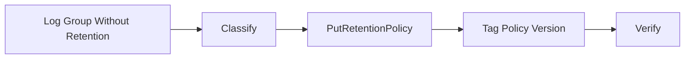

### Failure Modes

- Audit log group accidentally treated as app log.
- Regulated workload needs longer retention.
- Application team expects short retention for privacy requirement.

Mitigation: classification first, policy table explicit.

---

## 13. Pattern: Missing Mandatory Tags

### Problem

Resource missing owner, environment, cost center, data classification, or service tag.

### Why This Matters

Tags drive:

- ownership;
- ABAC;
- cost allocation;
- incident routing;
- exception policy;
- backup policy;
- retention policy;
- data classification.

### Auto-Remediation Mode

Auto-add tags only if value is derivable with high confidence.

Derivation sources:

- account metadata;
- deployment role;
- IaC stack tag;
- CloudFormation stack;
- service catalog;
- parent resource;
- Kubernetes namespace labels;
- ECS service tags;
- owner registry.

### Flow

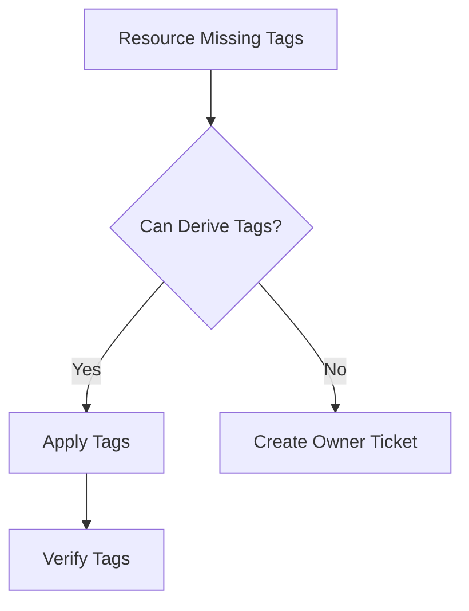

### Anti-Pattern

Do not assign fake `owner=unknown` to satisfy compliance. That destroys ownership signal.

Better:

```yaml
owner: unresolved
owner_resolution_required: true
owner_resolution_due: 2026-07-13
```

---

## 14. Pattern: Public AMI or Snapshot Exposure

### Problem

AMI, EBS snapshot, or RDS snapshot shared publicly or with unintended account.

### Risk

This can expose full filesystem, database copy, credentials, logs, or customer data.

### Detection

- AWS Config rules;
- CloudTrail `ModifySnapshotAttribute`;
- Security Hub controls;
- periodic inventory;
- custom Access Analyzer-like checks.

### Action

- capture sharing attributes;
- check exception;
- remove public sharing;
- notify owner;
- create incident if sensitive/prod;
- verify attribute no longer public.

### Flow

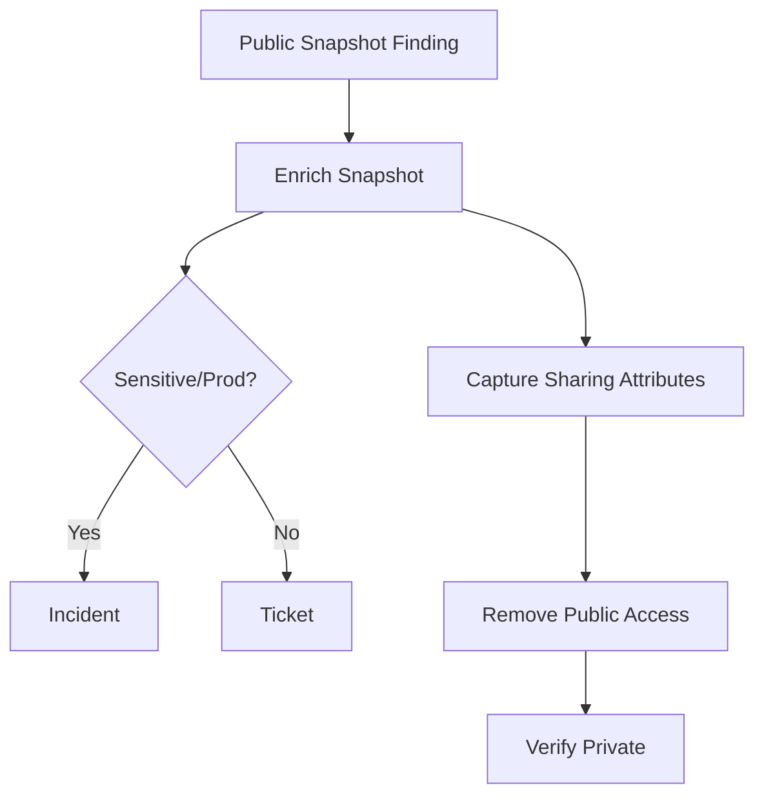

### Failure Mode

A snapshot can be copied while public. Even if you make it private later, assume potential exposure and follow incident process if sensitive.

---

## 15. Pattern: Vulnerability Remediation With Inspector

### Problem

Inspector finds critical vulnerability in EC2, ECR image, or Lambda.

### Temptation

Automatically patch everything.

### Problem With Blind Patching

- patch can break runtime;
- container image patch requires rebuild/redeploy;
- Lambda dependency patch requires package update;
- EC2 patch may require reboot;
- ASG immutable image may need AMI rebuild;
- workload owner must validate application behavior.

### Better Pattern

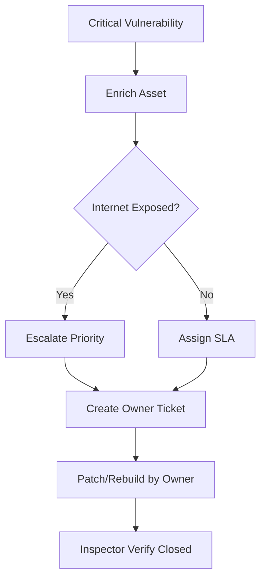

### Auto Actions That Are Safer

- create ticket with package/CVE/resource details;
- attach affected deployment artifact;
- raise priority if internet-exposed;
- block promotion of vulnerable image in CI/CD;
- quarantine only if active exploitation signal exists;
- patch automatically only for approved managed fleet class.

### Exception

For managed EC2 fleets with strong patch policy, automatic patching via Systems Manager Patch Manager can be valid. But that is fleet operations policy, not ad hoc remediation from a finding.

---

## 16. Pattern: GuardDuty Credential Exfiltration

### Problem

GuardDuty indicates AWS credentials are used from outside AWS or anomalous location.

### Risk

Credential misuse can lead to lateral movement, data exfiltration, privilege escalation, resource creation, or security control tampering.

### Action Strategy

Depends on credential type:

| Credential Type | Response |
|---|---|
| IAM user access key | Disable key, incident, investigate usage. |
| Assumed role temporary credential | Revoke session where possible, reduce trust, investigate source role. |
| Instance profile credential | Quarantine instance, rotate/replace role if needed. |
| Root credential | Emergency incident. |

### Flow

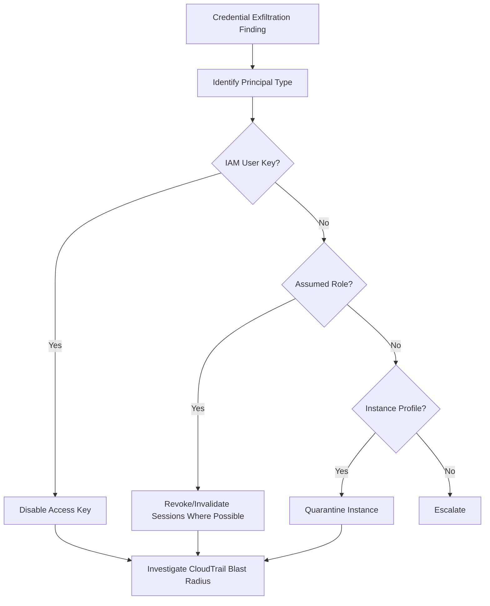

### Investigation Must Follow

Containment is not enough.

You must answer:

- what API calls were made?
- what data was accessed?
- what resources changed?
- were new users/roles/keys created?
- were logs/security controls modified?
- did attacker move cross-account?
- did attacker create persistence?

---

## 17. Pattern: Auto-Suppression With Governance

Not every finding should create a ticket.

Some findings are known, accepted, or intentionally designed.

But suppression is dangerous if uncontrolled.

### Good Suppression

```yaml
finding_type: S3_BUCKET_PUBLIC_READ
resource: arn:aws:s3:::public-docs-example
reason: Public documentation bucket
approved_by: security-review-board
owner: developer-platform
expires_at: 2026-09-30
evidence: ticket://SEC-12345
conditions:
  - no_macie_sensitive_data
  - bucket_name_prefix: public-docs-
  - cloudfront_origin_access_expected: false
```

### Bad Suppression

```yaml
finding_type: '*'
reason: noisy
expires_at: never
```

### Automation Flow

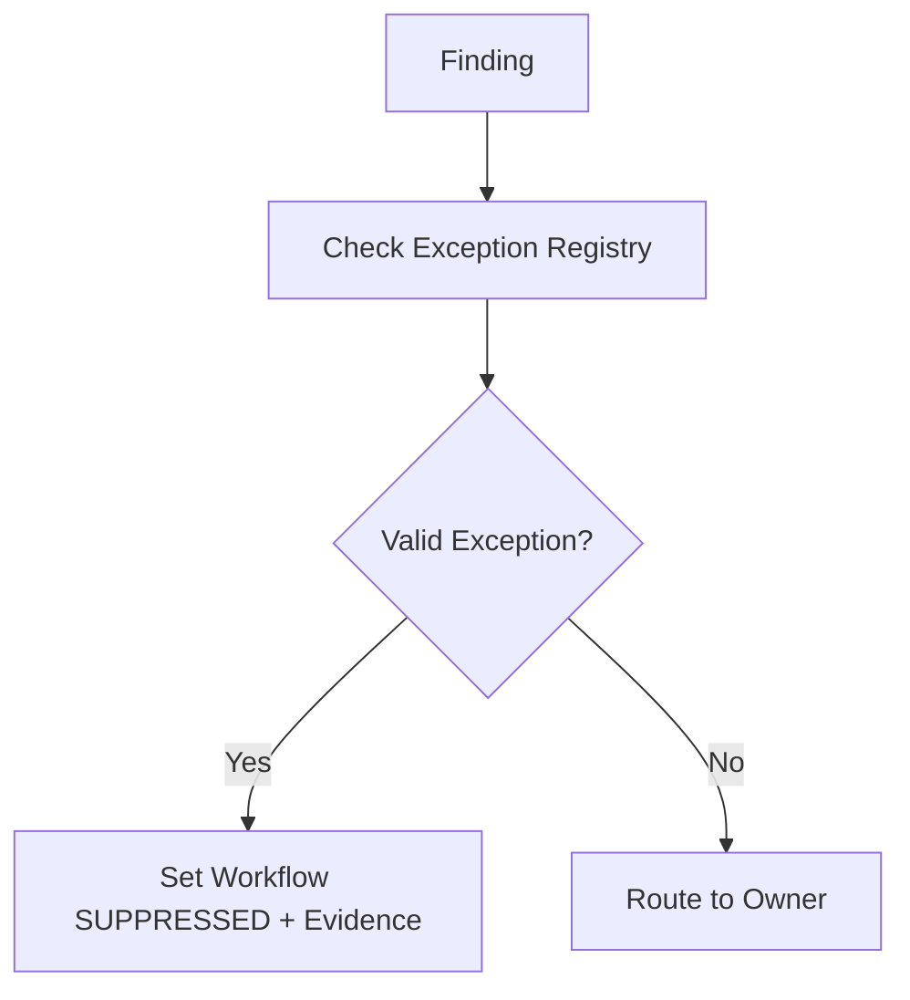

### Rules

- suppression must be time-bound;
- suppression must be resource or condition scoped;
- suppression must have owner;
- suppression must have evidence;
- suppression must auto-expire;
- expired suppression reopens finding.

---

## 18. Pattern: Auto-Reopen on Drift or Regression

A finding can be closed, then return.

Automation should detect regression.

Example:

- security group fixed;
- IaC deploy reopens public ingress;
- Config detects noncompliance again;
- finding reopened;
- ticket should link previous issue and mark recurrence.

### Flow

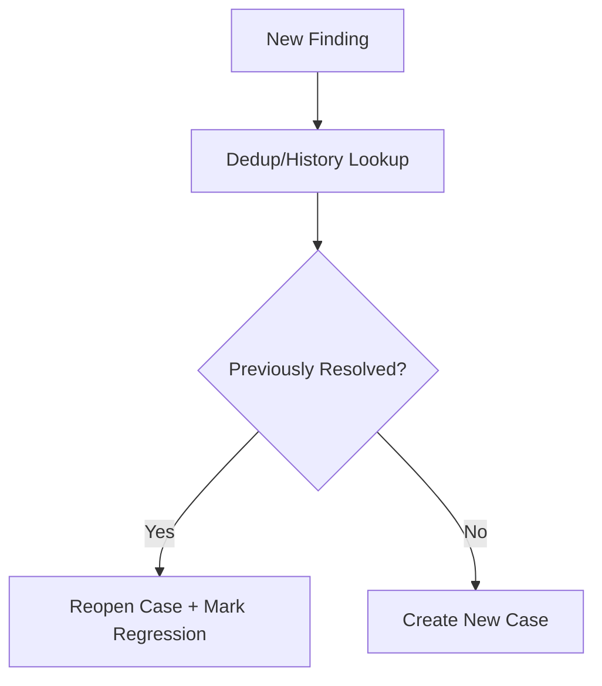

Regression is more serious than first occurrence because it indicates weak control at source.

Recurring security drift should trigger platform/IaC fix, not endless runtime cleanup.

---

## 19. Pattern: Rollback as First-Class Workflow

Every remediation action needs rollback classification.

| Rollback Class | Meaning | Example |
|---|---|---|
| Trivial | Easy to undo. | Restore tag value. |
| Simple | State captured, one API call. | Restore SG ingress rule. |
| Complex | Multiple resources/state. | Restore bucket policy/access points. |
| Risky | Undo may reintroduce threat. | Re-enable compromised key. |
| Impossible | Cannot safely undo. | Delete resource, purge data. |

Automation should reject auto-remediation if rollback class is too high for the confidence level.

Pseudo-policy:

```text
if confidence < high and rollback_class in [complex, risky, impossible]:
  require_manual_approval

if environment == prod and blast_radius == high:
  require_manual_approval

if active_threat == true and action == containment and reversible == true:
  allow_auto_mitigate
```

---

## 20. Systems Manager Automation Runbooks

Systems Manager Automation runbooks are useful for AWS remediation because they provide:

- parameterized workflows;
- sequential steps;
- AWS API actions;
- execution history;
- IAM-controlled execution role;
- reusable documents;
- integration with Config remediation and Incident Manager.

A remediation runbook should include:

```yaml
schemaVersion: '0.3'
description: Quarantine an EC2 instance after security finding validation
parameters:
  InstanceId:
    type: String
  FindingId:
    type: String
  DryRun:
    type: Boolean
mainSteps:
  - name: CapturePreState
    action: aws:executeScript
  - name: AttachQuarantineSecurityGroup
    action: aws:executeAwsApi
  - name: VerifyIsolation
    action: aws:executeScript
  - name: WriteEvidence
    action: aws:executeScript
```

Runbook design principles:

- support dry-run;
- validate parameters;
- capture pre-state;
- use least privilege execution role;
- write evidence;
- verify result;
- fail safe;
- emit metrics;
- include rollback document reference.

---

## 21. Permission Design for Remediation Roles

Remediation role is dangerous.

It should not be admin.

Use per-action roles:

| Role | Permission Scope |
|---|---|
| `RemediateS3PublicAccessRole` | S3 public access block/bucket policy read/write for tagged resources. |
| `RemediateSecurityGroupIngressRole` | Describe SG, revoke exact ingress rules, limited to allowed ports/resources. |
| `QuarantineEC2Role` | Describe/modify ENI SGs, snapshot volumes if approved. |
| `DisableIAMAccessKeyRole` | UpdateAccessKey for disallowed IAM users only. |
| `RestoreSecurityBaselineRole` | Re-enable GuardDuty/Config/CloudTrail where mandatory. |

Trust policy should restrict who can assume role:

- central automation account;
- specific automation role ARN;
- external ID if third-party;
- organization conditions if applicable;
- session tags;
- source identity;
- permission boundary.

Add explicit deny where possible.

---

## 22. Human Approval Design

Manual approval is not failure. It is a control.

Use approval when:

- production blast radius high;
- remediation may disrupt traffic;
- data loss possible;
- rollback complex;
- finding confidence medium/low;
- resource criticality high;
- owner context missing;
- action touches IAM/KMS/network perimeter broadly.

Approval request should include:

- finding summary;
- resource;
- environment;
- owner;
- proposed action;
- blast radius;
- rollback plan;
- expiration;
- evidence links;
- approve/reject buttons or process.

Approval should time out. Timeout should escalate or choose safe default based on risk.

---

## 23. Evidence Model

Every remediation should write evidence.

Minimum evidence fields:

```json
{
  "remediation_id": "rem-20260706-000123",
  "finding_id": "arn:aws:securityhub:...",
  "source_event_id": "...",
  "account_id": "111122223333",
  "region": "ap-southeast-1",
  "resource_id": "...",
  "decision": "auto-mitigate",
  "reason": "public admin port with no exception",
  "pre_state_ref": "s3://security-evidence/pre/...json",
  "action": "revoke-security-group-ingress",
  "executor_role": "arn:aws:iam::...:role/RemediateSecurityGroupIngressRole",
  "started_at": "2026-07-06T10:00:00+07:00",
  "completed_at": "2026-07-06T10:00:12+07:00",
  "result": "success",
  "verification": "rule_absent",
  "rollback_ref": "s3://security-evidence/rollback/...json"
}
```

Evidence must be stored somewhere tamper-resistant enough for your compliance needs, usually log archive/security account with controlled write/read access.

---

## 24. Verification Patterns

Do not trust only API success.

Verification examples:

| Action | Verification |
|---|---|
| Enable S3 Block Public Access | `GetPublicAccessBlock` and Access Analyzer/Config status. |
| Remove SG ingress | `DescribeSecurityGroups` exact rule absent. |
| Disable IAM key | `GetAccessKeyLastUsed`/`ListAccessKeys` status inactive. |
| Re-enable GuardDuty | Detector exists and status enabled. |
| Restore Config recorder | Recorder status recording. |
| Cancel KMS deletion | Key state no longer pending deletion. |
| Set log retention | Log group retention days equals policy. |

Verification may be eventual-consistent. Build retries with bounded timeout.

---

## 25. Dry-Run Mode

Every remediation should support dry-run.

Dry-run answers:

- would this event match?
- what resource would be changed?
- what pre-state would be captured?
- what action would run?
- what permission would be needed?
- what rollback would be generated?
- would approval be required?

Dry-run output example:

```json
{
  "mode": "dry-run",
  "would_execute": true,
  "action": "remove-security-group-ingress",
  "resource": "sg-0123456789abcdef0",
  "rule": "tcp/22 from 0.0.0.0/0",
  "requires_approval": false,
  "reason": "non-prod admin port public with no exception",
  "rollback_available": true
}
```

Roll out every remediation in dry-run first.

---

## 26. Kill Switches and Circuit Breakers

Automation must be stoppable.

Kill switch examples:

- global parameter in SSM Parameter Store;
- DynamoDB feature flag;
- EventBridge rule disabled;
- Step Functions choice state checking flag;
- per-action feature flag;
- per-account blocklist;
- emergency SCP preventing automation role from assuming remediation roles.

Circuit breaker triggers:

- action failure rate above threshold;
- number of remediations exceeds expected volume;
- same resource remediated repeatedly;
- downstream ticketing unavailable;
- DLQ growing;
- AccessDenied spike;
- rollback count non-zero;
- critical account affected unexpectedly.

Automation without kill switch is operationally irresponsible.

---

## 27. Avoiding IaC Drift Wars

Runtime remediation can fight IaC.

Example:

1. Terraform deploys public security group rule.
2. Automation removes it.
3. Terraform next apply adds it again.
4. Automation removes again.
5. Infinite governance war.

Better:

- runtime mitigation stops immediate risk;
- ticket points to IaC source;
- CI/CD policy check blocks reintroduction;
- owner fixes module;
- Config/Security Hub verifies stable closure.

Architecture:

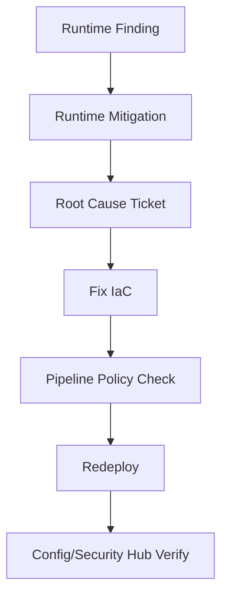

Automated remediation must not become a broom sweeping IaC mistakes forever.

---

## 28. Metrics That Matter

Measure remediation quality, not vanity volume.

| Metric | Meaning |
|---|---|
| Mean time to detect | Finding/event latency. |
| Mean time to notify | Owner notification speed. |
| Mean time to mitigate | Time until risk reduced. |
| Mean time to remediate | Time until root cause closed. |
| Auto-action success rate | Reliability of automation. |
| Rollback rate | Safety signal. |
| False positive rate | Detection quality. |
| Exception count | Risk acceptance load. |
| Reopen rate | Root cause quality. |
| Manual approval latency | Human bottleneck. |
| Remediation drift recurrence | IaC/process weakness. |

High auto-remediation count is not automatically good. It may mean your preventive controls are weak.

---

## 29. Production Readiness Checklist

For each automated remediation pattern:

- [ ] Finding source is defined.
- [ ] Event schema is tested.
- [ ] Matching rule is precise.
- [ ] Resource ownership can be resolved.
- [ ] Environment can be resolved.
- [ ] Exception model exists.
- [ ] Pre-state capture exists.
- [ ] Action is idempotent.
- [ ] Action has least privilege role.
- [ ] Dry-run mode exists.
- [ ] Manual approval path exists if needed.
- [ ] Verification exists.
- [ ] Rollback exists or limitation is explicit.
- [ ] Evidence is written.
- [ ] Metrics are emitted.
- [ ] DLQ/retry configured.
- [ ] Failure alarm exists.
- [ ] Kill switch exists.
- [ ] Runbook is documented.
- [ ] Owner and SLA are defined.
- [ ] IaC root-cause path exists.

---

## 30. What Should Be Automated First?

Start with controls that are:

- low blast radius;
- highly deterministic;
- reversible;
- common;
- easy to verify;
- low false positive;
- clearly owned by platform/security.

Good first candidates:

- set CloudWatch log retention;
- add missing tags when derivable;
- re-enable mandatory GuardDuty/Config/Security Hub settings;
- restore baseline CloudTrail logging;
- enable S3 Block Public Access on non-exempt non-prod buckets;
- remove public SSH/RDP in non-prod;
- suppress known approved findings with expiry;
- create enriched tickets for vulnerabilities.

Avoid early automation for:

- broad IAM policy changes;
- KMS key disable/delete decisions;
- production network path changes;
- terminating instances;
- deleting data;
- patching production stateful systems;
- modifying shared security groups without impact analysis.

---

## 31. Key Takeaways

Automated remediation is not about speed alone.

It is about **safe speed**.

A good remediation system has:

- precise detection;
- contextual enrichment;
- explicit decision logic;
- proportional action;
- idempotency;
- pre-state capture;
- verification;
- rollback;
- evidence;
- observability;
- human approval where needed;
- root-cause closure path.

The most important invariant:

> Do not automate destruction. Automate controlled risk reduction.

After this part, the threat detection and security response phase is complete. The next phase moves into infrastructure security controls: network security control plane, egress control, WAF/Shield, Firewall Manager, Network Firewall, and private access/resource perimeter.

---

## References

- AWS Security Hub — Using EventBridge for automated response and remediation: https://docs.aws.amazon.com/securityhub/latest/userguide/securityhub-cloudwatch-events.html
- AWS Security Hub — Automatically modifying and acting on findings: https://docs.aws.amazon.com/securityhub/latest/userguide/automations.html
- AWS Security Hub event types in EventBridge: https://docs.aws.amazon.com/securityhub/latest/userguide/securityhub-cwe-integration-types.html
- AWS Systems Manager Automation: https://docs.aws.amazon.com/systems-manager/latest/userguide/systems-manager-automation.html
- AWS Systems Manager Automation runbook reference for Security Hub CSPM: https://docs.aws.amazon.com/systems-manager-automation-runbooks/latest/userguide/automation-ref-ash.html
- AWS Config remediation with Systems Manager Automation: https://docs.aws.amazon.com/config/latest/developerguide/remediation.html
- Amazon EventBridge rules: https://docs.aws.amazon.com/eventbridge/latest/userguide/eb-rules.html
- Amazon EventBridge dead-letter queues: https://docs.aws.amazon.com/eventbridge/latest/userguide/eb-rule-dlq.html
