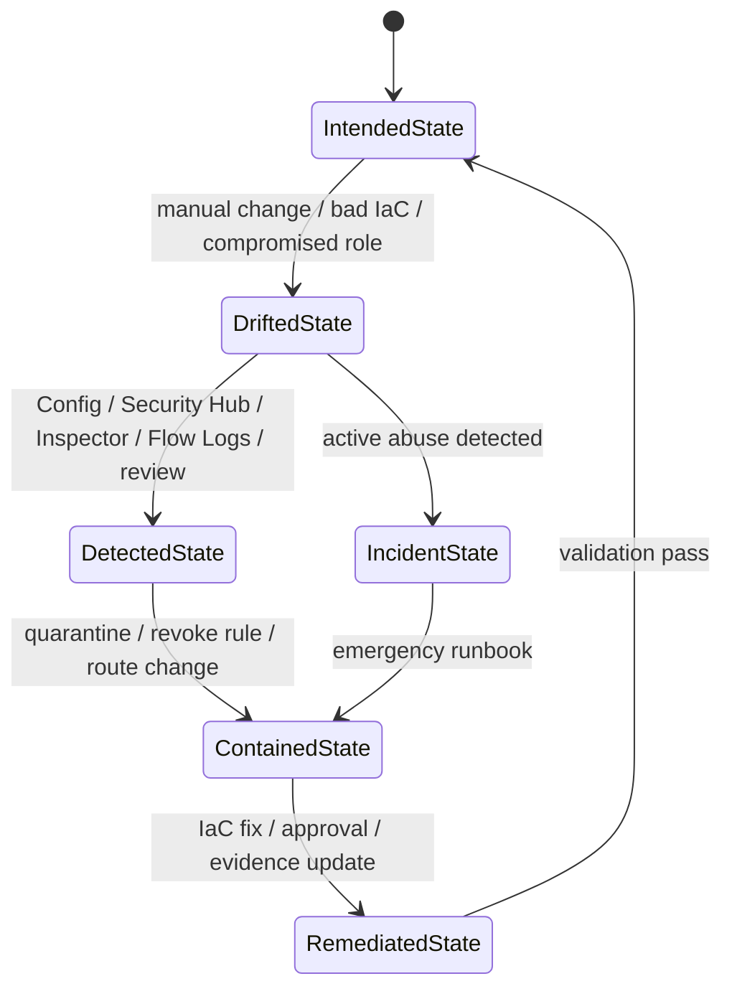
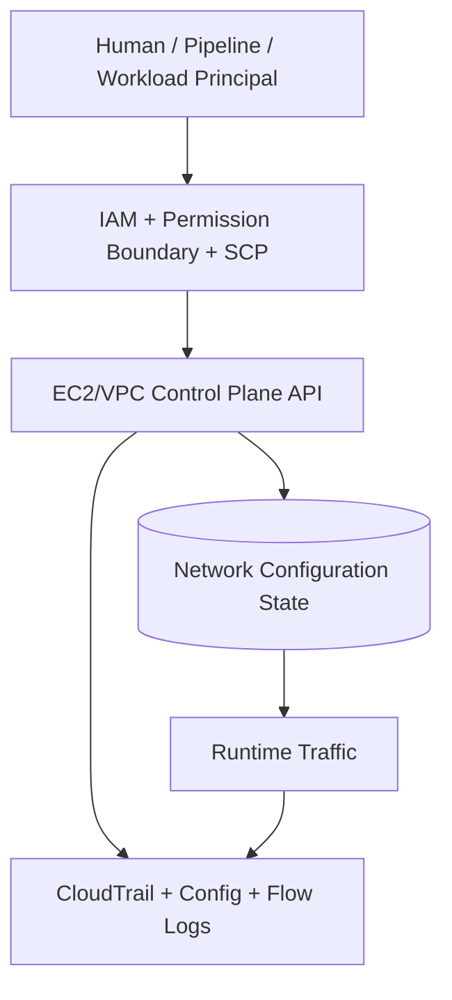
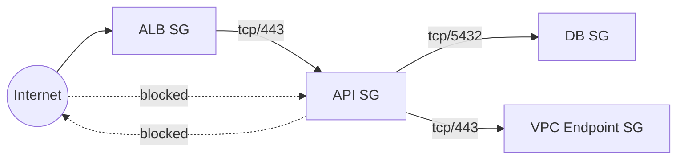
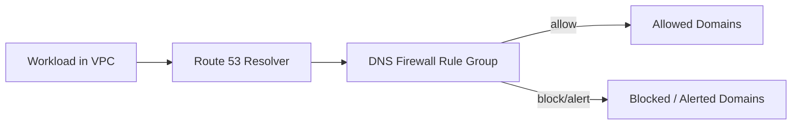
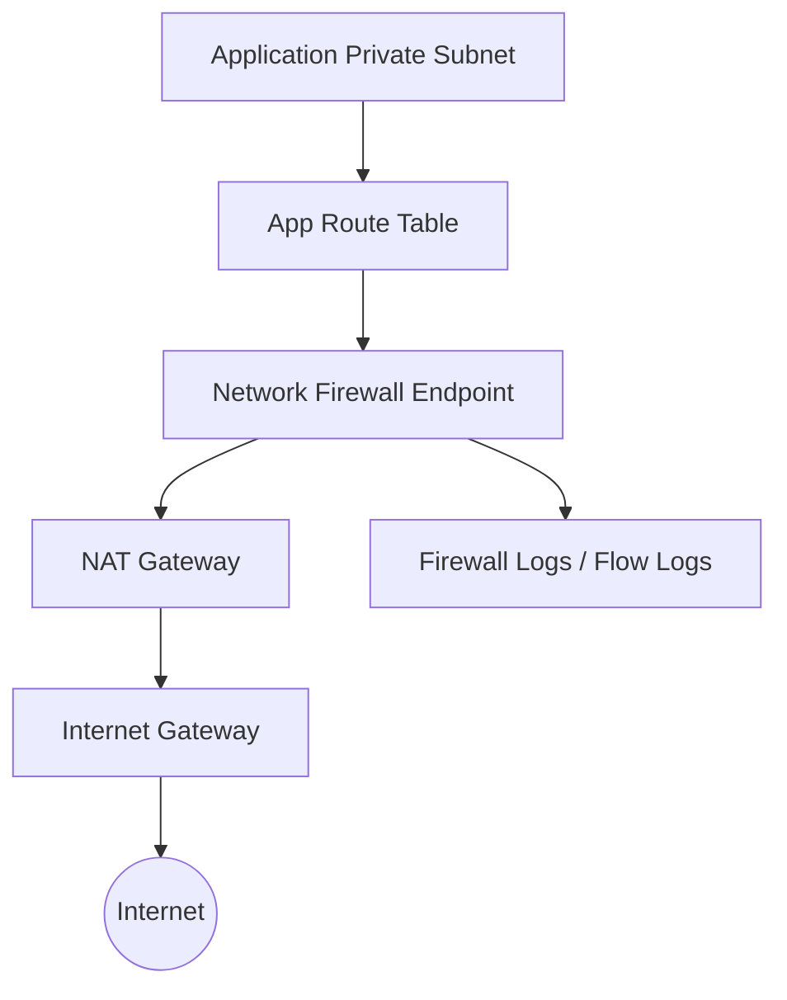
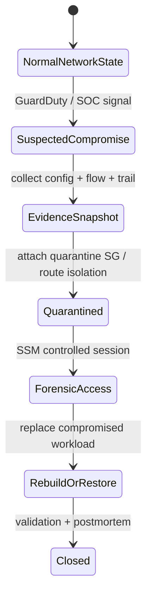
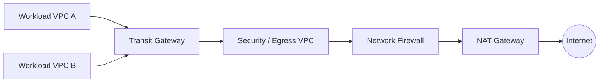

# Part 049 — Network Security Control Plane

Di seri networking sebelumnya, VPC biasanya dipelajari sebagai desain konektivitas: subnet, route table, NAT, peering, Transit Gateway, load balancer, private connectivity, dan sebagainya. Di bagian ini, kita tidak mengulang itu.

Di sini VPC dibaca sebagai **security control plane**.

Pertanyaannya bukan lagi:

> Bagaimana instance A bisa connect ke database B?

Pertanyaannya menjadi:

> Siapa yang boleh membuka jalur? Jalur apa yang terbuka? Jalur itu bisa berubah lewat API apa? Perubahannya terekam di mana? Guardrail apa yang mencegah jalur berbahaya? Bukti apa yang menunjukkan traffic benar-benar mengikuti jalur yang kita klaim?

Network security di AWS bukan hanya firewall. Ia adalah gabungan beberapa control surface:

- **identity control**: siapa boleh mengubah network state;
- **resource control**: security group, route table, endpoint, firewall policy, hosted zone, resolver rule;
- **traffic control**: apa yang boleh lewat;
- **audit control**: siapa mengubah apa;
- **evidence control**: apa traffic yang benar-benar terjadi;
- **governance control**: mana konfigurasi yang tidak boleh dilanggar;
- **incident control**: bagaimana isolate resource tanpa menghancurkan evidence.

Network security yang matang selalu menjawab tiga hal:

1. **Intent** — arsitektur mengatakan traffic seharusnya ke mana.
2. **Enforcement** — AWS control benar-benar membatasi traffic sesuai intent.
3. **Evidence** — log dan telemetry membuktikan traffic aktual tidak menyimpang.

Tanpa ketiganya, desain network hanya diagram.

---

## 1. Mental Model: Network Security sebagai State Machine

VPC network bukan benda statis. Ia adalah state machine yang bisa berubah lewat API.

Contoh state:

```txt
security-group: sg-api-prod
inbound:
  - tcp/443 from alb-sg
outbound:
  - tcp/5432 to db-sg
```

Satu API call bisa mengubah state itu:

```txt
AuthorizeSecurityGroupIngress:
  group: sg-api-prod
  port: 22
  cidr: 0.0.0.0/0
```

Dari sudut pandang security, ini adalah **state transition**:

```txt
SAFE_STATE -> EXPOSED_STATE
```

Maka kontrol network harus dipikirkan seperti ini:



Network security control yang baik bukan hanya membuat state awal benar. Ia harus punya mekanisme untuk:

- mencegah state berbahaya;
- mendeteksi drift;
- mengembalikan state;
- membuktikan state historical;
- menahan abuse ketika state sudah telanjur salah.

---

## 2. Control Surface di AWS Network

AWS network security terdiri dari beberapa lapisan. Masing-masing punya fungsi berbeda. Kesalahan umum adalah menganggap satu lapisan bisa menggantikan semua lapisan lain.

| Control Surface | Level | Fungsi Utama | Strength | Weakness |
|---|---:|---|---|---|
| IAM/SCP | API/control plane | Membatasi siapa boleh mengubah network | Prevent drift | Tidak memfilter packet runtime |
| Security Group | ENI/resource | Stateful allow-list traffic | Workload-level control | Tidak punya explicit deny |
| Network ACL | Subnet | Stateless allow/deny subnet traffic | Explicit deny subnet-level | Sulit dikelola granular |
| Route Table | Subnet/gateway | Menentukan next hop | Mengontrol reachability path | Salah route bisa bypass inspection |
| VPC Endpoint Policy | Endpoint | Membatasi AWS API access via endpoint | Data perimeter | Tidak berlaku untuk semua traffic |
| DNS Firewall | Resolver | Filter outbound DNS query | Cegah domain-level abuse | DNS bukan satu-satunya egress path |
| Network Firewall | VPC path | L3-L7 inspection/filtering | Central inspection | Perlu routing benar |
| WAF | HTTP layer | L7 edge/app protection | App-layer rules | Tidak melindungi non-HTTP |
| Flow Logs | Evidence | Bukti traffic accepted/rejected | Investigation visibility | Bukan preventive control |
| CloudTrail/Config | Audit/state | Bukti perubahan network config | Governance/audit | Tidak melihat semua packet |

Prinsip praktis:

> Gunakan IAM/SCP untuk mencegah perubahan berbahaya, security group untuk workload allow-list, endpoint policy untuk AWS service perimeter, route table untuk jalur inspeksi, firewall untuk traffic inspection, dan logs untuk evidence.

---

## 3. Control Plane vs Data Plane dalam Network Security

Network control biasanya gagal karena tim mencampur dua pertanyaan:

1. **Data plane**: apakah packet bisa lewat?
2. **Control plane**: siapa boleh membuat packet itu bisa lewat?

Contoh:

- security group rule membuka `0.0.0.0/0:22` adalah data-plane exposure;
- IAM permission `ec2:AuthorizeSecurityGroupIngress` adalah control-plane exposure;
- Terraform role yang bisa modify route table adalah control-plane exposure;
- NAT Gateway yang memberi internet egress adalah data-plane capability;
- SCP yang melarang disable VPC Flow Logs adalah control-plane guardrail.

Diagramnya:



Security group yang bagus tidak cukup jika terlalu banyak principal bisa mengubahnya. IAM yang bagus tidak cukup jika traffic path aktual tidak terlihat. Cloud security harus memegang kedua sisi.

---

## 4. Security Group: Stateful Workload Boundary

Security group adalah virtual firewall stateful yang diasosiasikan ke resource seperti ENI/EC2, load balancer, RDS, interface endpoint, dan banyak resource lain.

Yang perlu diingat:

- security group hanya berisi **allow rules**;
- tidak ada explicit deny;
- ia stateful, response traffic untuk request yang diizinkan akan diizinkan balik;
- rule bisa refer ke CIDR atau security group lain;
- outbound default sering terlalu permisif;
- security group adalah resource yang bisa dimutasi oleh API.

### 4.1 Security Group sebagai Contract

Security group produksi sebaiknya dibaca sebagai kontrak:

```txt
API service boleh menerima HTTPS hanya dari ALB.
API service boleh connect ke database hanya ke DB security group pada port 5432.
API service boleh connect ke AWS APIs hanya melalui VPC endpoint/proxy yang disetujui.
```

Contoh model:



Security group yang baik tidak mengatakan “API boleh outbound ke semua”. Ia mengatakan “API boleh outbound ke dependency yang valid”.

### 4.2 Anti-Pattern Security Group

| Anti-Pattern | Kenapa Berbahaya | Perbaikan |
|---|---|---|
| `0.0.0.0/0` inbound untuk admin port | Internet-wide attack surface | Session Manager, VPN/ZTNA, private access |
| Default outbound all traffic | Egress tidak terkontrol | Dependency allow-list, endpoint/proxy/firewall |
| Shared SG untuk banyak aplikasi | Blast radius dan ownership kabur | SG per role/per service |
| Manual mutation di console | Drift dari IaC | IaC-only + detection/remediation |
| Rule pakai CIDR besar internal | Lateral movement besar | SG reference, segmentation |
| SG bernama `allow-all-temp` permanen | Temporary menjadi permanent | TTL tag + Config rule + auto cleanup |
| Rule tanpa deskripsi | Tidak bisa audit intent | Mandatory rule description/owner/ticket |

### 4.3 Security Group Rule Ownership

Rule yang matang punya metadata operasional:

```txt
source: sg-alb-prod
port: 443
protocol: tcp
owner: team-platform-api
reason: ALB forwards HTTPS to API
approvedBy: secops-1234
expiresAt: none
lastReviewedAt: 2026-07-01
```

Tidak semua metadata bisa ditempel langsung ke rule dalam bentuk tag, tetapi bisa dikelola lewat:

- IaC module variable;
- pull request approval;
- security group rule description;
- account registry;
- exception registry;
- periodic review report.

### 4.4 Control Plane Guardrail untuk Security Group

Control yang diperlukan:

- deny `ec2:AuthorizeSecurityGroupIngress` untuk public admin ports kecuali role khusus;
- Config rule untuk detect public ingress;
- Security Hub control untuk exposed security group;
- automation untuk revoke high-risk rule;
- approval flow untuk exception;
- IaC drift detection.

Contoh invariant:

```txt
No production security group may allow 0.0.0.0/0 or ::/0 inbound to administrative ports.
```

Control mapping:

| Layer | Control |
|---|---|
| Preventive | SCP/IAM deny for risky SG mutation |
| Detective | AWS Config managed/custom rule |
| Responsive | EventBridge -> remediation Lambda/SSM Automation |
| Evidence | CloudTrail + Config timeline + ticket |
| Governance | exception registry with expiry |

---

## 5. Network ACL: Stateless Subnet Boundary

Network ACL bekerja di subnet level dan bersifat stateless. Ia bisa allow dan deny inbound/outbound berdasarkan rule order.

NACL bukan pengganti security group. Ia cocok untuk:

- coarse subnet-level guardrail;
- blocking known bad CIDR;
- enforcing deny untuk boundary tertentu;
- memberi lapisan tambahan ketika SG terlalu dekat dengan workload;
- blast-radius protection untuk subnet class tertentu.

### 5.1 Kapan NACL Berguna

Gunakan NACL ketika policy-nya subnet-wide dan stabil:

```txt
Subnet database tidak boleh menerima traffic langsung dari subnet internet-facing.
Subnet workload regulated tidak boleh egress ke CIDR non-approved.
Subnet quarantine hanya boleh bicara ke forensic collector.
```

Jangan gunakan NACL untuk menggantikan service-level dependency matrix. Stateless rule, ephemeral port, dan rule ordering membuat NACL sulit dipakai untuk kontrol sangat granular.

### 5.2 Failure Mode NACL

| Failure Mode | Dampak |
|---|---|
| Lupa ephemeral ports | Aplikasi gagal secara sporadis |
| Rule order salah | Deny/allow tidak sesuai intent |
| Default NACL terlalu permissive | Subnet boundary tidak memberi nilai tambahan |
| NACL dipakai untuk app segmentation detail | Complexity tinggi, debugging sulit |
| Tidak ada Config/CloudTrail monitoring | Perubahan subnet boundary tidak terdeteksi |

Prinsip:

> NACL adalah subnet guardrail. Security group adalah workload contract.

---

## 6. Route Table: Reachability Control

Route table menentukan next hop. Di security architecture, route table adalah mekanisme yang menentukan apakah traffic:

- keluar langsung ke internet;
- melewati NAT;
- melewati firewall;
- ke Transit Gateway;
- ke VPC endpoint;
- ke blackhole;
- ke appliance inspection;
- ke peering/private path.

Route table adalah salah satu control paling sensitif karena satu route bisa membypass inspeksi.

### 6.1 Route sebagai Security Decision

Contoh:

```txt
0.0.0.0/0 -> nat-gateway
```

Ini bukan hanya connectivity. Ini berarti subnet punya internet egress path.

```txt
0.0.0.0/0 -> network-firewall-endpoint
```

Ini berarti egress harus melewati inspection.

```txt
pl-aws-s3 -> gateway-vpc-endpoint
```

Ini berarti akses S3 memakai private AWS path, bukan internet.

### 6.2 Route Table Invariant

Contoh invariant:

```txt
Production private subnets must not route 0.0.0.0/0 directly to an Internet Gateway.
```

```txt
Regulated workload subnets must send default egress to centralized inspection.
```

```txt
Database subnets must not have default route to NAT Gateway unless explicitly approved.
```

### 6.3 Route Drift Detection

Untuk route table, deteksi harus menjawab:

- subnet mana yang affected;
- route mana yang berubah;
- siapa yang mengubah;
- apakah route menciptakan internet path;
- apakah route melewati inspection;
- apakah change berasal dari IaC pipeline;
- apakah ada open incident/ticket.

Evidence sources:

- CloudTrail `CreateRoute`, `ReplaceRoute`, `DeleteRoute`, `AssociateRouteTable`;
- AWS Config resource history;
- VPC Reachability Analyzer untuk verifikasi path;
- route table snapshot di IaC state;
- VPC Flow Logs untuk traffic aktual.

---

## 7. VPC Endpoint dan Endpoint Policy

VPC endpoint memberi private connectivity dari VPC ke AWS services atau endpoint services tanpa perlu traffic keluar lewat public internet path. Dari security perspective, endpoint penting karena ia bisa menjadi **AWS API egress choke point**.

Ada dua konsep berbeda:

1. **Connectivity** — resource bisa mencapai AWS service secara private.
2. **Authorization boundary** — endpoint policy membatasi request apa yang bisa lewat endpoint.

### 7.1 Endpoint Policy sebagai Egress Control

Endpoint policy adalah resource-based IAM policy di endpoint. Ia menjawab:

```txt
Dari network path ini, AWS API call apa yang boleh dilakukan ke resource mana?
```

Contoh intent:

```txt
Workload subnet boleh mengakses S3 hanya untuk bucket milik organisasi.
Workload subnet tidak boleh menulis ke S3 bucket pribadi di luar organisasi.
Workload subnet boleh membaca Secrets Manager hanya secret dengan tag environment=prod dan app=payments.
```

Endpoint policy bukan satu-satunya authorization layer. Request tetap harus lolos IAM identity policy, resource policy, SCP/RCP, KMS policy, dan service-specific authorization.

### 7.2 Gateway Endpoint vs Interface Endpoint

| Tipe | Umum untuk | Security Consideration |
|---|---|---|
| Gateway endpoint | S3, DynamoDB | Route table association + endpoint policy |
| Interface endpoint | Banyak AWS services via PrivateLink | Endpoint ENI SG + endpoint policy + private DNS |

Interface endpoint punya security group sendiri. Artinya endpoint bukan hanya “jalan private”; ia juga resource yang harus diamankan.

### 7.3 Endpoint Anti-Pattern

| Anti-Pattern | Dampak |
|---|---|
| Endpoint policy `*` tanpa batas resource | Workload bisa akses resource tidak diinginkan melalui private path |
| Tidak pakai `aws:ResourceOrgID`/condition perimeter saat relevan | Exfil ke resource luar organisasi tetap mungkin |
| Semua subnet punya endpoint sama tanpa ownership | Sulit audit siapa butuh apa |
| Private DNS enable tanpa migration plan | Aplikasi berubah path tanpa disadari |
| Endpoint SG allow dari seluruh VPC | Terlalu luas untuk service sensitif |
| Tidak monitor `CreateVpcEndpoint`/`ModifyVpcEndpoint` | Shadow endpoint bisa muncul |

---

## 8. DNS sebagai Security Boundary yang Sering Diremehkan

Banyak sistem menganggap DNS hanya name resolution. Dalam incident nyata, DNS sering menjadi:

- command and control lookup;
- exfiltration channel via DNS tunneling;
- bypass untuk domain allow-list buruk;
- dependency availability risk;
- source of confusion ketika private/public hosted zone overlap.

Route 53 Resolver DNS Firewall memberi filtering untuk outbound DNS query dari VPC melalui Route 53 Resolver.

### 8.1 DNS Control Model



DNS Firewall cocok untuk:

- block known malicious domains;
- allow-list domain untuk high-security environment;
- detect DNS tunneling/DGA patterns jika advanced rules tersedia;
- segment DNS policy per VPC/OU;
- centralize DNS threat prevention.

### 8.2 DNS Failure Mode

| Failure Mode | Dampak |
|---|---|
| Tidak log DNS query | C2/exfil sulit diinvestigasi |
| Allow all domains dari prod | Egress policy lemah |
| Overlap private hosted zone | Traffic salah resolve |
| Split-horizon tidak terdokumentasi | Debugging incident lambat |
| DNS Firewall terlalu agresif tanpa test | Outage dependency |
| Bypass via custom resolver | Policy tidak efektif |

Prinsip:

> DNS policy harus sinkron dengan egress policy. Kalau network firewall hanya allow domain tertentu, DNS juga harus membuktikan domain resolution sesuai intent.

---

## 9. Network Firewall sebagai Inspection Boundary

AWS Network Firewall digunakan ketika security requirement membutuhkan inspection dan filtering lebih kuat daripada security group/NACL/route table.

Ia cocok untuk:

- centralized egress inspection;
- ingress/egress filtering;
- domain-based egress control;
- intrusion prevention style rules;
- segmentation antar VPC;
- regulated workload boundary;
- traffic visibility di layer 3-7.

Namun Network Firewall hanya efektif jika routing memaksa traffic melewatinya.

### 9.1 Firewall Bukan Magic

Firewall gagal jika:

- subnet punya route bypass ke NAT/IGW;
- peering/TGW route bypass inspection;
- AWS service access lewat endpoint tanpa endpoint policy;
- DNS tidak dikontrol;
- rule terlalu broad;
- logging tidak aktif;
- rule update tidak lewat review;
- default action terlalu permissive.

### 9.2 Inspection Path



Invariant:

```txt
No production private subnet may reach internet without passing the approved inspection path.
```

Evidence:

- route table state;
- firewall endpoint association;
- firewall logs;
- NAT metrics/log-adjacent evidence;
- VPC Flow Logs;
- CloudTrail changes.

---

## 10. Network Control Ownership Model

Network security sering gagal bukan karena AWS kurang fitur, tetapi karena ownership kabur.

Contoh konflik:

- application team butuh buka port cepat;
- platform team mengelola Terraform module;
- network team punya Transit Gateway;
- security team punya policy;
- SRE team menangani outage;
- compliance team meminta evidence;
- incident team butuh quarantine.

Tanpa ownership model, semua perubahan menjadi ad hoc.

### 10.1 RACI Praktis

| Control | Owner | Approver | Operator | Evidence Consumer |
|---|---|---|---|---|
| SG app rule | App team | Platform/SecOps untuk risky rule | IaC pipeline | SecOps/Audit |
| Route table | Network/platform | Network security | IaC pipeline | SRE/SecOps |
| Network Firewall policy | Network security | SecOps | Firewall pipeline | SOC |
| Endpoint policy | Platform/security | Data owner/SecOps | IaC pipeline | Audit/SecOps |
| DNS Firewall rules | Network security | SecOps | Central DNS pipeline | SOC |
| NACL | Network/platform | Security | IaC pipeline | Audit |
| VPC Flow Logs | Platform/security | Security | Landing zone baseline | SOC/Audit |

### 10.2 Change Classes

Tidak semua network change sama.

| Change Type | Example | Risk | Process |
|---|---|---:|---|
| Low risk | Add SG reference from ALB to app | Low | PR + automated checks |
| Medium risk | Add outbound dependency to internal service | Medium | PR + owner approval |
| High risk | Public inbound CIDR | High | Security review + exception expiry |
| Critical | Route bypass firewall | Critical | Emergency-only / blocked by SCP |
| Emergency | Quarantine compromised host | Critical but protective | Break-glass runbook + evidence |

---

## 11. Policy as Code untuk Network Security

Manual network review tidak cukup. Guardrail harus berjalan sebelum dan sesudah deploy.

### 11.1 Pre-Deployment Controls

Contoh checks:

- no `0.0.0.0/0` inbound except allowed ports/resources;
- no unrestricted outbound from regulated workloads;
- route table cannot send private subnet directly to IGW;
- VPC endpoint policy must include organization/resource restriction;
- Network Firewall logging must be enabled;
- Flow Logs must be enabled;
- SG rule must have description;
- exception must have expiry;
- security group per app role, not shared broad SG.

Tools bisa berupa:

- Terraform validation;
- Checkov/tfsec-like scanners;
- OPA/conftest;
- CloudFormation Guard;
- custom CI policy;
- AWS Config proactive controls;
- Control Tower proactive controls.

### 11.2 Post-Deployment Controls

Contoh:

- AWS Config rules;
- Security Hub CSPM controls;
- Access Analyzer where relevant;
- CloudTrail EventBridge detection;
- periodic route/SG inventory;
- Reachability Analyzer scheduled validation untuk critical path;
- drift detection against IaC state.

---

## 12. Observability untuk Network Security Control Plane

Network security tidak bisa dioperasikan tanpa telemetry.

Minimal telemetry:

| Signal | Use Case |
|---|---|
| CloudTrail EC2/VPC events | Siapa mengubah SG, route, endpoint, NACL |
| AWS Config | Timeline konfigurasi dan compliance |
| VPC Flow Logs | Traffic evidence |
| Route 53 Resolver query logs | DNS evidence |
| DNS Firewall logs/metrics | Block/alert DNS events |
| Network Firewall logs | Inspection decision |
| CloudWatch metrics | NAT/firewall/endpoint health |
| Security Hub findings | Correlated posture issue |
| GuardDuty findings | Threat signal |

### 12.1 Query yang Harus Siap

Security team harus bisa menjawab cepat:

```txt
Siapa membuka port 22 ke internet dalam 24 jam terakhir?
```

```txt
Subnet mana yang punya route 0.0.0.0/0 ke IGW?
```

```txt
Resource mana yang mengirim traffic ke IP/domain mencurigakan?
```

```txt
Endpoint policy mana yang masih allow *?
```

```txt
VPC mana yang tidak punya Flow Logs?
```

```txt
Apakah workload ini melewati Network Firewall sebelum internet egress?
```

---

## 13. Incident Pattern: Quarantine tanpa Menghancurkan Evidence

Ketika workload dicurigai compromise, respons umum adalah “matikan instance”. Itu kadang benar, tetapi bisa menghancurkan evidence volatile atau mengganggu produksi tanpa containment yang rapi.

Network-level containment yang lebih defensible:

1. Snapshot evidence state:
   - instance metadata;
   - attached SG;
   - ENI;
   - route path;
   - flow logs time window;
   - CloudTrail identity.
2. Attach quarantine SG atau replace SG.
3. Route traffic hanya ke forensic collector/SSM endpoint.
4. Blok egress internet.
5. Preserve volume snapshot.
6. Tag resource as incident evidence.
7. Record action in incident timeline.
8. Create remediation PR after containment.

Quarantine SG example intent:

```txt
inbound: none
outbound:
  - tcp/443 to SSM endpoint SG
  - tcp/443 to logging/forensic endpoint SG
  - dns only to approved resolver if needed
```

State transition:



---

## 14. Common Design Patterns

### 14.1 Tiered Security Groups

```txt
alb-sg -> api-sg -> worker-sg -> db-sg
```

Benefit:

- clear dependency graph;
- narrow blast radius;
- easier review;
- easier change ownership;
- better incident containment.

### 14.2 Dedicated Endpoint Subnets

Use dedicated subnets/security groups for interface endpoints when:

- endpoint access must be centrally controlled;
- many workloads share endpoint;
- endpoint traffic needs separate inspection/logging model;
- regulated workloads require stricter path control.

### 14.3 Centralized Egress VPC



Good for:

- consistent inspection;
- centralized policy;
- shared SOC visibility;
- regulated environments;
- reducing NAT sprawl.

Risks:

- routing complexity;
- asymmetric routing;
- inspection bottleneck;
- shared failure domain;
- cost visibility complexity;
- exception pressure.

### 14.4 Isolated Admin Access

Prefer:

- IAM Identity Center + Session Manager;
- no public SSH/RDP;
- no shared bastion unless formally justified;
- session logging;
- break-glass path;
- private endpoints for SSM.

---

## 15. Failure Modes yang Harus Didesain Sejak Awal

| Failure Mode | Root Cause | Control |
|---|---|---|
| Public admin port | Emergency manual change | SCP + Config + auto revoke |
| Firewall bypass | Route table drift | IaC check + Config + route audit |
| Endpoint exfiltration | Permissive endpoint policy | Data perimeter policy |
| Lateral movement | Broad internal CIDR allow | SG references + segmentation |
| DNS exfiltration | No DNS filtering/logging | Resolver logs + DNS Firewall |
| Shadow VPC endpoint | Developer creates endpoint | SCP/IAM + inventory |
| Lost evidence | Flow Logs disabled | SCP protect logging + Config |
| Quarantine outage | Manual incident action wrong | Tested SSM Automation runbook |
| Central egress outage | Shared dependency failure | HA route/firewall design + runbook |
| Policy exception never expires | No exception lifecycle | Expiry + review + auto-ticket |

---

## 16. Production Checklist

Minimum checklist untuk network security control plane:

- [ ] Semua VPC punya owner, environment, data classification, dan business criticality.
- [ ] Semua VPC punya Flow Logs aktif ke central log archive.
- [ ] Semua production SG dikelola via IaC.
- [ ] Public inbound rule dibatasi dan punya exception expiry.
- [ ] Administrative ports tidak terbuka ke internet.
- [ ] Private subnets tidak punya direct IGW route.
- [ ] Regulated workloads punya defined egress path.
- [ ] Endpoint policy tidak default permissive untuk service sensitif.
- [ ] Route table drift dimonitor.
- [ ] DNS query logging aktif untuk environment penting.
- [ ] DNS Firewall policy diterapkan untuk high-risk workloads.
- [ ] Network Firewall logging aktif jika dipakai.
- [ ] Security group rule description wajib.
- [ ] CloudTrail event untuk VPC/EC2 control plane masuk alerting pipeline.
- [ ] Quarantine runbook sudah diuji.
- [ ] Exception registry punya owner dan expiry.

---

## 17. The Real Lesson

Network security di AWS bukan tentang menumpuk firewall.

Ia tentang mengontrol **state transition**.

Security group, NACL, route table, endpoint policy, DNS Firewall, Network Firewall, CloudTrail, Config, dan Flow Logs adalah bagian dari satu sistem:

```txt
desired network intent
  -> controlled deployment
  -> enforced runtime path
  -> continuous evidence
  -> drift detection
  -> safe remediation
```

Kalau hanya punya diagram, kamu belum punya security.

Kalau hanya punya firewall, kamu belum tentu punya security.

Kalau kamu bisa membuktikan siapa mengubah apa, jalur apa yang tersedia, traffic apa yang terjadi, guardrail apa yang mencegah penyimpangan, dan runbook apa yang mengembalikan sistem ke state aman — baru kamu punya network security control plane yang layak produksi.

---

## References

- AWS VPC Security Groups — https://docs.aws.amazon.com/vpc/latest/userguide/vpc-security-groups.html
- AWS VPC Network ACLs — https://docs.aws.amazon.com/vpc/latest/userguide/vpc-network-acls.html
- AWS VPC Endpoints / PrivateLink — https://docs.aws.amazon.com/vpc/latest/privatelink/create-interface-endpoint.html
- AWS Data Perimeters — https://docs.aws.amazon.com/IAM/latest/UserGuide/access_policies_data-perimeters.html
- Building a Data Perimeter on AWS — https://docs.aws.amazon.com/whitepapers/latest/building-a-data-perimeter-on-aws/perimeter-implementation.html
- Route 53 Resolver DNS Firewall — https://docs.aws.amazon.com/Route53/latest/DeveloperGuide/resolver-dns-firewall-overview.html
- Centralized Network Security — https://docs.aws.amazon.com/whitepapers/latest/building-scalable-secure-multi-vpc-network-infrastructure/centralized-network-security-for-vpc-to-vpc-and-on-premises-to-vpc-traffic.html
- VPC Flow Logs — https://docs.aws.amazon.com/vpc/latest/userguide/flow-logs.html
- AWS Config — https://docs.aws.amazon.com/config/latest/developerguide/WhatIsConfig.html
- AWS CloudTrail — https://docs.aws.amazon.com/awscloudtrail/latest/userguide/cloudtrail-user-guide.html
