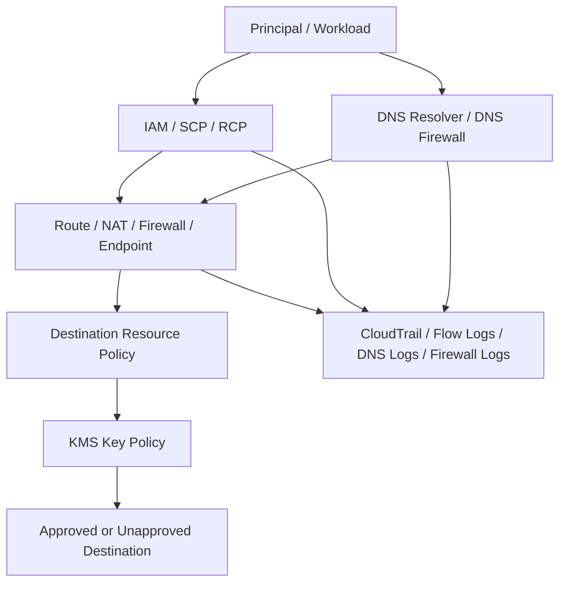
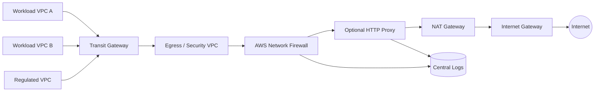
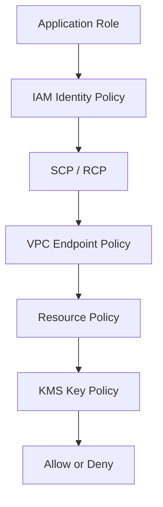
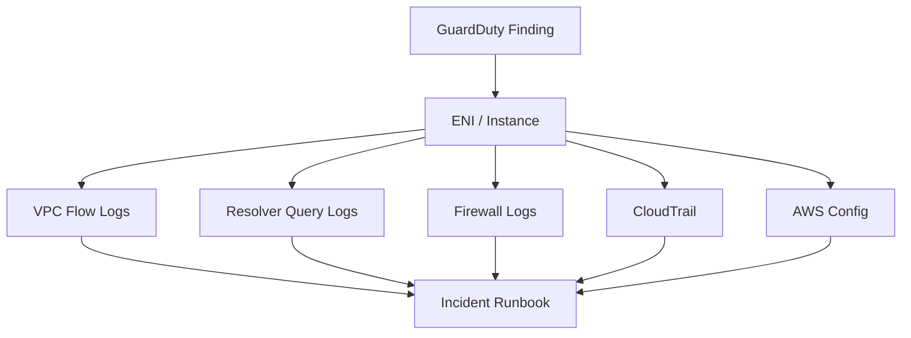

# Part 050 — Egress Control and Data Exfiltration Defense

Banyak tim cloud terlalu fokus pada ingress.

Mereka bertanya:

> Apakah internet bisa masuk ke workload kita?

Pertanyaan itu penting. Tapi untuk security engineering yang matang, pertanyaan yang sama pentingnya adalah:

> Ke mana workload, user, pipeline, atau compromised credential bisa mengirim data keluar?

Data breach sering bukan hanya soal attacker masuk. Breach selesai ketika data keluar, credential dipakai keluar, snapshot dibagikan keluar, object disalin keluar, atau traffic menuju command-and-control berhasil keluar.

Egress control adalah disiplin untuk mengendalikan **outbound capability**.

Data exfiltration defense adalah disiplin untuk mencegah, mendeteksi, membatasi, dan membuktikan percobaan pemindahan data ke tempat yang tidak dipercaya.

Di AWS, ini tidak bisa diselesaikan oleh satu fitur. Ia membutuhkan gabungan:

- network routing;
- NAT/proxy/firewall;
- VPC endpoints;
- endpoint policies;
- IAM/SCP/RCP data perimeter;
- bucket/key/resource policies;
- DNS Firewall;
- CloudTrail;
- VPC Flow Logs;
- Macie;
- GuardDuty;
- Security Hub;
- incident runbook.

Target akhirnya sederhana:

```txt
Workload hanya boleh mengirim data ke tujuan yang memang diperlukan, melalui jalur yang terlihat, dengan policy yang membatasi resource tujuan, dan dengan evidence yang cukup untuk investigasi.
```

---

## 1. Mental Model: Egress sebagai Capability

Inbound exposure adalah siapa bisa masuk.

Egress exposure adalah siapa bisa keluar.

Dua-duanya adalah capability.

Contoh capability:

```txt
Instance di private subnet punya route 0.0.0.0/0 ke NAT Gateway.
```

Artinya instance punya capability untuk membuat outbound internet connection.

```txt
Role aplikasi punya s3:PutObject ke arn:aws:s3:::*
```

Artinya aplikasi punya capability untuk menulis object ke bucket mana pun yang policy-nya mengizinkan.

```txt
VPC endpoint policy untuk S3 adalah Allow *.
```

Artinya private path ke S3 tidak membatasi resource tujuan.

```txt
DNS bebas resolve domain apa pun.
```

Artinya workload bisa menemukan endpoint eksternal tanpa kontrol domain.

Egress control harus menggabungkan semua capability ini.



Prinsip penting:

> Egress bukan hanya network. AWS API egress adalah authorization problem dan network problem sekaligus.

---

## 2. Tipe-Tipe Exfiltration di AWS

Sebelum mendesain kontrol, kita harus membedakan bentuk exfiltration.

| Tipe | Contoh | Primary Controls |
|---|---|---|
| Internet exfiltration | Workload upload ke external server | NAT/proxy/firewall, DNS Firewall, Flow Logs |
| AWS service exfiltration | Copy data ke S3 bucket luar organisasi | VPC endpoint policy, SCP/RCP, IAM, bucket policy |
| Cross-account exfiltration | Snapshot/shared AMI/resource policy ke account lain | SCP, RCP, resource policy guardrail, CloudTrail |
| Credential exfiltration | Access key/session token dipakai dari lokasi asing | IAM, STS, GuardDuty, CloudTrail, condition keys |
| DNS exfiltration | Data dikirim dalam DNS query | DNS Firewall, Resolver logs, GuardDuty signals |
| Logging-channel abuse | Data ditulis ke logs/event fields | IAM, log redaction, detection, data classification |
| Backup/snapshot exfiltration | Snapshot dibagikan atau dicopy | Backup policy, SCP, CloudTrail, KMS |
| KMS-assisted exfiltration | Data terenkripsi bisa didecrypt oleh pihak tak semestinya | KMS policy, grants, encryption context, audit |

Setiap tipe perlu kontrol berbeda. “Tidak ada public IP” hanya menyelesaikan sebagian kecil masalah.

---

## 3. Egress Policy Harus Berbasis Intent

Jangan mulai dari “kita perlu NAT atau tidak”. Mulai dari dependency inventory.

Untuk setiap workload, tulis egress intent:

```txt
Service: payments-api
Environment: prod
Data classification: regulated-confidential
Allowed outbound:
  - postgres to payments-db:5432
  - https to secretsmanager via VPC endpoint
  - https to kms via VPC endpoint
  - https to sts via VPC endpoint
  - https to internal ledger-api
  - https to approved payment gateway domains
Denied outbound:
  - direct internet except approved gateway domains
  - arbitrary S3 bucket outside organization
  - arbitrary external IP
  - public DNS resolver
Evidence required:
  - CloudTrail API events
  - VPC Flow Logs
  - DNS query logs
  - firewall allow/deny logs
```

Ini adalah egress contract.

Tanpa contract, firewall rule hanya tebakan.

---

## 4. NAT Gateway: Convenience, Not Security Boundary

NAT Gateway memungkinkan instance di private subnet membuat outbound connection ke internet tanpa menerima unsolicited inbound connection dari internet.

Itu berguna, tetapi NAT bukan security boundary yang cukup.

NAT tidak tahu:

- apakah domain tujuan approved;
- apakah payload berisi data sensitif;
- apakah koneksi dibuat oleh proses legitimate;
- apakah IP tujuan berubah;
- apakah API call menuju resource organisasi atau resource attacker;
- apakah traffic harus diblokir berdasarkan identity workload.

### 4.1 NAT Anti-Pattern

```txt
private subnet -> 0.0.0.0/0 -> NAT Gateway -> Internet
```

Jika semua workload punya ini, “private subnet” hanya berarti tidak menerima inbound langsung. Ia tidak berarti egress aman.

### 4.2 NAT yang Lebih Defensible

NAT boleh dipakai jika:

- dependency internet memang valid;
- egress path melewati inspection/proxy jika diperlukan;
- DNS dikontrol;
- Flow Logs aktif;
- allow-list domain/IP diterapkan di layer lain;
- exception jelas;
- workload sensitif memakai endpoint/private path untuk AWS services.

---

## 5. Centralized Egress Architecture

Centralized egress berarti outbound internet traffic dari banyak VPC/account diarahkan ke satu atau beberapa egress inspection point.

Tujuannya:

- policy konsisten;
- inspection terpusat;
- logging terpusat;
- domain/IP allow-list lebih mudah;
- SOC punya satu tempat membaca signal;
- NAT sprawl berkurang;
- regulated workload punya jalur keluar yang terkontrol.



### 5.1 Kapan Centralized Egress Masuk Akal

- multi-account sudah banyak;
- banyak workload butuh internet access;
- compliance butuh inspection evidence;
- security team ingin centralized policy;
- domain allow-list perlu konsisten;
- high-risk data environment;
- maturity logging sudah cukup.

### 5.2 Risiko Centralized Egress

| Risiko | Konsekuensi | Mitigasi |
|---|---|---|
| Shared failure domain | Banyak VPC terdampak | HA per AZ, tested failover |
| Asymmetric routing | Traffic drop | Route design review |
| Bottleneck inspection | Latency/capacity issue | Scale planning, metrics |
| Exception pressure | Policy jadi allow-all | Exception lifecycle |
| Blind AWS service egress | Endpoint bypass | Endpoint policy + route inventory |
| Cost allocation sulit | Chargeback kabur | Flow logs, NAT metrics, tags |

Centralized egress bukan tujuan akhir. Ia alat. Untuk sebagian workload, private endpoint + no internet egress lebih baik.

---

## 6. Private AWS Service Access dengan VPC Endpoints

Banyak exfiltration path di AWS bukan ke “internet server”, tetapi ke AWS service.

Contoh:

- copy object ke S3 bucket luar organisasi;
- put secret ke Secrets Manager account lain;
- publish data ke SNS/SQS eksternal;
- upload artifact ke ECR/ECS path yang tidak disetujui;
- assume role ke external account;
- invoke API Gateway eksternal.

VPC endpoint membantu karena traffic ke AWS service bisa melewati private path dan endpoint policy.

### 6.1 Endpoint Policy sebagai Data Exfiltration Control

Contoh konsep endpoint policy untuk S3:

```json
{
  "Version": "2012-10-17",
  "Statement": [
    {
      "Effect": "Deny",
      "Principal": "*",
      "Action": "s3:*",
      "Resource": "*",
      "Condition": {
        "StringNotEquals": {
          "aws:ResourceOrgID": "o-exampleorgid"
        }
      }
    }
  ]
}
```

Maknanya:

> Lewat endpoint ini, request ke S3 resource yang bukan milik organisasi ditolak.

Policy nyata harus diuji sesuai service support, exception, dan behavior aplikasi. Tapi mental model-nya penting: endpoint policy bisa menjadi choke point untuk AWS service egress.

### 6.2 Endpoint Policy Tidak Berdiri Sendiri

Request harus melewati beberapa gate:



Jika salah satu gate deny, request gagal. Jika endpoint policy terlalu permisif, gate itu tidak memberi nilai.

---

## 7. Data Perimeter: Bukan Sekadar Network Perimeter

Network perimeter tradisional bertanya:

```txt
Apakah traffic berasal dari network internal?
```

Data perimeter AWS harus bertanya lebih lengkap:

```txt
Apakah identity terpercaya?
Apakah resource tujuan milik organisasi?
Apakah network path terpercaya?
Apakah request context sesuai?
```

Data perimeter biasanya menggunakan kombinasi condition keys seperti:

- organization identity/resource condition;
- source VPC/VPC endpoint condition;
- principal org/account condition;
- requested region condition;
- resource tag condition;
- service-specific conditions.

### 7.1 Empat Boundary Data Perimeter

| Boundary | Pertanyaan | Example Control |
|---|---|---|
| Trusted identities | Principal dari organisasi kita? | SCP/IAM condition on PrincipalOrgID |
| Trusted resources | Resource target milik organisasi? | `aws:ResourceOrgID` where supported |
| Trusted networks | Request lewat network/VPC endpoint approved? | `aws:SourceVpce`, `aws:VpcSourceIp` where applicable |
| Trusted service access | AWS service bertindak sesuai context? | `aws:ViaAWSService`, service principal constraints |

### 7.2 Data Perimeter Failure Mode

| Failure Mode | Example |
|---|---|
| Resource boundary lupa | App bisa write ke S3 bucket luar org |
| Network boundary lupa | Stolen credential dipakai dari internet |
| Service exception salah | AWS service integration ikut terblokir |
| Condition key tidak supported | Policy terlihat benar tapi tidak efektif |
| Overblocking | Production outage saat service call legitimate denied |
| No monitoring | Deny event tidak dianalisis |

Prinsip:

> Data perimeter harus diuji dengan known-good dan known-bad request. Jangan percaya policy hanya karena terlihat benar.

---

## 8. DNS Egress Control

Jika workload bebas resolve domain apa pun, domain-based egress policy menjadi lemah.

DNS control dibutuhkan untuk:

- block known malicious domains;
- detect suspicious domain generation;
- prevent access to unapproved SaaS/external endpoints;
- reduce exfil via DNS tunneling;
- enforce allow-list for restricted workloads.

### 8.1 DNS Firewall Strategy

Tiering praktis:

| Environment | DNS Policy |
|---|---|
| Sandbox | Block known malicious + log all |
| Dev | Block malicious + alert suspicious |
| Prod standard | Block malicious + allow-list sensitive dependencies |
| Regulated prod | Default deny with explicit allow-list where feasible |
| Quarantine | Allow only forensic/SSM/logging endpoints |

### 8.2 Resolver Logs sebagai Evidence

Minimal query:

```txt
Workload mana resolve domain ini?
```

```txt
Domain apa saja yang diresolve workload sebelum GuardDuty finding?
```

```txt
Apakah ada domain entropy tinggi / DGA-like pattern?
```

```txt
Apakah ada query ke DNS resolver eksternal?
```

DNS logs harus dikorelasikan dengan:

- VPC Flow Logs;
- firewall logs;
- GuardDuty finding;
- workload identity;
- deployment timeline;
- incident timeline.

---

## 9. Network Firewall / Proxy untuk Internet Egress

Untuk internet egress, ada beberapa opsi:

| Approach | Strength | Weakness |
|---|---|---|
| NAT only | Simple | No domain/payload policy |
| NAT + Network Firewall | Central L3-L7 inspection | Routing/cost/ops complexity |
| Explicit HTTP proxy | Strong URL/domain/user-aware control | App compatibility burden |
| Private endpoint only | Strongest for AWS service access | Tidak menyelesaikan external SaaS |
| No internet egress | Best for isolated workloads | Butuh dependency redesign |

### 9.1 Domain Allow-List Problem

Domain allow-list tidak semudah kelihatannya:

- SaaS memakai banyak domain;
- CDN IP berubah;
- TLS SNI mungkin tidak selalu cukup;
- certificate/domain mismatch bisa terjadi;
- dependency third-party berubah tanpa notice;
- wildcard domain terlalu luas;
- IP-based allow-list cepat basi.

Karena itu, domain allow-list harus punya lifecycle:

```txt
request -> owner -> business justification -> risk review -> test -> deploy -> monitor -> expiry/review
```

### 9.2 Egress Firewall Rule Metadata

Rule harus punya:

```txt
ruleId: egress-prod-payments-stripe
owner: payments-platform
allowedDomain: api.stripe.com
protocol: https
source: payments-api-prod-subnets
reason: payment authorization
riskClass: external-payment-provider
reviewCycle: quarterly
expiresAt: none
lastValidatedAt: 2026-07-01
```

Tanpa metadata, rule akan menjadi fosil.

---

## 10. S3 Exfiltration Defense

S3 adalah jalur exfiltration paling penting karena banyak data berada di S3 dan API-nya mudah dipakai.

Attack patterns:

- copy object ke bucket attacker;
- create public bucket/object;
- attach permissive bucket policy;
- disable Block Public Access;
- generate pre-signed URL berlebihan;
- replicate ke account lain;
- share KMS decrypt path;
- use compromised role to read/write data.

### 10.1 Defense Layers untuk S3

| Layer | Control |
|---|---|
| IAM | Least privilege bucket/path action |
| SCP/RCP | Deny public exposure, deny cross-org exfil where possible |
| Bucket policy | Require org/source VPC endpoint/secure transport/encryption |
| VPC endpoint policy | Restrict accessible S3 resources |
| S3 Block Public Access | Prevent public exposure classes |
| KMS policy | Restrict decrypt/encrypt usage |
| Macie | Discover sensitive data |
| CloudTrail data events | Audit object-level access where enabled |
| GuardDuty S3 Protection | Threat detection on S3 activity |
| Security Hub | Posture findings |

### 10.2 S3 Endpoint Policy Intent

```txt
From regulated workload VPC endpoint:
  allow access only to buckets owned by org/account set;
  deny write to external buckets;
  deny requests not using TLS;
  deny if principal/account not approved;
  allow AWS service exceptions explicitly.
```

### 10.3 Bucket Policy Intent

```txt
For sensitive bucket:
  deny non-TLS;
  deny unencrypted put;
  deny access not from approved VPC endpoint if applicable;
  deny principals outside org unless approved exception;
  deny public ACL/policy;
  require KMS key with approved key policy;
  log data access for high-risk prefixes.
```

---

## 11. Snapshot, AMI, and Backup Exfiltration

Data exfiltration tidak selalu lewat network connection. Bisa lewat resource sharing.

Patterns:

- EBS snapshot shared to external account;
- AMI made public;
- RDS snapshot shared;
- backup copied to another account/region without control;
- KMS key grants allow external decrypt;
- S3 replication to untrusted destination.

Controls:

- SCP deny public AMI/snapshot sharing;
- Config/Security Hub detection;
- CloudTrail alerts for modify snapshot attribute;
- KMS key policy restrict external usage;
- backup vault lock for tamper resistance;
- approved backup destination accounts;
- exception registry;
- automated remediation to remove public/share attribute.

Invariant:

```txt
No production snapshot, AMI, or backup may be shared outside approved organization/accounts without explicit approved exception.
```

---

## 12. Credential Exfiltration and Abuse

Credential exfiltration terjadi ketika attacker mendapatkan:

- long-lived access key;
- temporary STS credentials;
- session token;
- container/task role credentials;
- instance metadata credentials;
- secret containing credential to third-party system.

Egress defense untuk credential bukan hanya mencegah token keluar, tetapi membatasi dampaknya jika token dipakai.

Controls:

- no long-lived keys for workloads;
- short session duration;
- IAM condition for source network/VPC endpoint where applicable;
- CloudTrail anomaly detection;
- GuardDuty credential compromise findings;
- disable key/runbook;
- STS regional endpoint strategy;
- IMDSv2 enforcement for EC2;
- task role isolation for ECS;
- EKS pod identity boundary;
- secret scanning in CI/logs.

Detection questions:

```txt
Apakah principal ini tiba-tiba dipakai dari ASN/region/IP yang tidak biasa?
```

```txt
Apakah session role workload dipakai untuk API yang tidak pernah dipakai sebelumnya?
```

```txt
Apakah access key melakukan List/Get/Put dalam volume abnormal?
```

```txt
Apakah GuardDuty menemukan credential exfiltration pattern?
```

---

## 13. CloudTrail sebagai Exfiltration Evidence

CloudTrail penting untuk AWS API exfiltration.

High-signal events:

| Service | Events |
|---|---|
| S3 | `PutBucketPolicy`, `PutBucketPublicAccessBlock`, object data events |
| EC2 | `ModifySnapshotAttribute`, `CreateSnapshot`, `CopySnapshot` |
| AMI | `ModifyImageAttribute` |
| RDS | `ModifyDBSnapshotAttribute`, `CopyDBSnapshot` |
| IAM | `CreateAccessKey`, `AttachRolePolicy`, `UpdateAssumeRolePolicy` |
| KMS | `CreateGrant`, `ScheduleKeyDeletion`, `DisableKey` |
| STS | `AssumeRole` from unusual source |
| Secrets Manager | `GetSecretValue`, `PutSecretValue`, policy changes |
| Lambda | env var update, role change, code update |
| Organizations | account/policy changes |

For high-risk data stores, enable data events selectively with cost awareness.

---

## 14. Flow Logs, Firewall Logs, and DNS Logs

CloudTrail tells you API activity. Flow/DNS/firewall logs tell you network behavior.

### 14.1 Evidence Correlation

Example incident:

```txt
GuardDuty: EC2 instance communicating with known C2 IP.
```

Correlation path:

1. GuardDuty finding identifies instance/ENI/IP/time.
2. VPC Flow Logs show destination IP/port/volume.
3. DNS logs show domain resolved before connection.
4. Firewall logs show allowed/denied decision.
5. CloudTrail shows who deployed/modified instance/SG/route.
6. Config shows network state at incident time.
7. SSM/EDR telemetry shows process if available.
8. Incident runbook quarantines resource.



### 14.2 Blind Spots

| Blind Spot | Consequence |
|---|---|
| Flow Logs disabled | Tidak bisa membuktikan traffic path |
| DNS logs disabled | Domain intent hilang |
| CloudTrail data events disabled | Object access tidak terlihat |
| Endpoint policy denies not monitored | Broken app or failed attack invisible |
| Firewall alert-only without owner | Findings menumpuk tanpa response |
| Logs retained too short | Investigation gagal setelah breach discovered late |

---

## 15. Egress Control by Workload Class

Tidak semua workload butuh kontrol sama.

### 15.1 Public Web Frontend

Allowed egress:

- internal API;
- telemetry/logging;
- approved third-party CDN/analytics if justified;
- AWS services via endpoint where possible.

Controls:

- no arbitrary S3 write;
- no database direct egress;
- DNS logging;
- security group outbound restricted where feasible.

### 15.2 Internal API

Allowed egress:

- internal dependencies;
- AWS APIs via VPC endpoints;
- specific SaaS endpoints if needed.

Controls:

- endpoint policies;
- no broad internet egress;
- service dependency inventory;
- CloudTrail data events for sensitive stores.

### 15.3 Regulated Data Processor

Allowed egress:

- strictly enumerated AWS services through endpoints;
- approved internal services;
- maybe no internet at all.

Controls:

- default deny outbound;
- data perimeter;
- DNS allow-list;
- centralized inspection;
- Macie/GuardDuty/Security Hub integration;
- restore/backup controls.

### 15.4 Build/CI Worker

Build systems often need internet. They are high risk because they handle source code, secrets, artifacts, and credentials.

Controls:

- ephemeral workers;
- dependency proxy/cache;
- artifact repository allow-list;
- no broad production credentials;
- secret scanning;
- egress proxy;
- DNS/firewall logs;
- restricted `AssumeRole` into prod.

### 15.5 Sandbox

Sandbox usually needs flexibility, but not uncontrolled exfil path into production data.

Controls:

- no access to prod data;
- budget/region guardrails;
- public exposure detection;
- broad internet allowed only with clear boundary;
- no organization-sensitive secrets.

---

## 16. Automated Response Patterns

### 16.1 Suspicious External Egress

Trigger:

- GuardDuty finding;
- firewall alert;
- DNS Firewall block/alert;
- anomalous Flow Logs query.

Response ladder:

1. Enrich with instance/ENI/SG/account/owner.
2. Check environment and criticality.
3. Snapshot network state.
4. Notify owner/SOC.
5. If high severity, quarantine SG.
6. Preserve logs and volume snapshot.
7. Open incident.
8. Remediate root cause.
9. Validate no repeated traffic.

### 16.2 Attempted S3 Exfiltration

Trigger:

- CloudTrail data event to external bucket;
- endpoint policy deny event/signals;
- GuardDuty S3 finding;
- Macie finding + suspicious access pattern.

Response:

1. Identify principal/session/source IP/VPC endpoint.
2. Identify object/prefix/data classification.
3. Disable or scope principal if active abuse.
4. Review endpoint/IAM/bucket/KMS policies.
5. Check similar events in lookback window.
6. Preserve evidence.
7. Add preventive guardrail.
8. Notify data owner and compliance if required.

### 16.3 Public Snapshot/AMI Share

Trigger:

- CloudTrail `ModifySnapshotAttribute` or equivalent;
- Config/Security Hub finding.

Response:

1. Remove public/share attribute if policy allows auto-remediation.
2. Tag resource as incident-reviewed.
3. Identify actor and ticket.
4. Check if snapshot contained sensitive data.
5. Rotate/decommission affected data if necessary.
6. Add/adjust SCP guardrail.

---

## 17. Metrics untuk Egress Program

Good egress program punya metrics.

| Metric | Meaning |
|---|---|
| % production workloads with documented egress contract | Coverage intent |
| % VPCs with Flow Logs | Evidence readiness |
| % critical VPCs with DNS logs | DNS visibility |
| # unrestricted outbound SG rules | Exposure |
| # endpoint policies with broad allow | AWS API exfil risk |
| # internet egress exceptions past expiry | Governance debt |
| # denied data perimeter attempts | Control effectiveness signal |
| MTTR for high-risk egress findings | Response maturity |
| # workloads with no internet egress | Reduction of attack surface |
| # third-party domains by owner | Vendor dependency risk |

Metrics harus dipakai untuk improvement, bukan vanity dashboard.

---

## 18. Production Checklist

- [ ] Setiap workload punya egress contract.
- [ ] NAT usage diketahui dan punya justification.
- [ ] Production private subnet tidak otomatis berarti “boleh internet”; route diaudit.
- [ ] Centralized egress dipakai jika requirement inspection konsisten.
- [ ] AWS service access memakai VPC endpoints untuk workload sensitif.
- [ ] Endpoint policy membatasi resource tujuan, bukan sekadar `Allow *`.
- [ ] Data perimeter policy diuji dengan known-good/known-bad request.
- [ ] DNS query logging aktif untuk prod/regulated.
- [ ] DNS Firewall policy diterapkan sesuai workload class.
- [ ] Network Firewall/proxy logs masuk central log archive.
- [ ] S3 sensitive buckets punya bucket policy/KMS/Block Public Access yang defensible.
- [ ] Snapshot/AMI/RDS sharing dimonitor dan dicegah.
- [ ] CloudTrail management events aktif organization-wide.
- [ ] CloudTrail data events aktif untuk high-risk buckets/resources.
- [ ] GuardDuty S3/Runtime/other relevant protection plans dievaluasi.
- [ ] Macie dipakai untuk sensitive S3 discovery.
- [ ] Exfiltration incident runbook diuji.
- [ ] Exception registry punya owner, reason, expiry, dan review.

---

## 19. The Real Lesson

Egress control bukan berarti memblokir semua outbound traffic.

Egress control berarti membuat outbound traffic menjadi:

```txt
intentional
bounded
observable
auditable
revocable
```

Kalau workload memang perlu akses internet, buat akses itu eksplisit.

Kalau workload hanya perlu AWS APIs, gunakan private endpoint dan policy.

Kalau data sensitif bisa keluar ke resource luar organisasi, perimeter kamu belum lengkap.

Kalau DNS, Flow Logs, CloudTrail, dan firewall logs tidak bisa menjawab “data keluar ke mana?”, maka kamu belum punya exfiltration defense; kamu hanya punya harapan.

Dalam AWS production environment yang matang, egress adalah kontrak. Setiap kontrak punya owner, enforcement, evidence, review, dan emergency brake.

---

## References

- AWS Prescriptive Guidance — Centralized Egress: https://docs.aws.amazon.com/prescriptive-guidance/latest/transitioning-to-multiple-aws-accounts/centralized-egress.html
- AWS Whitepaper — Using NAT gateway with AWS Network Firewall: https://docs.aws.amazon.com/whitepapers/latest/building-scalable-secure-multi-vpc-network-infrastructure/using-nat-gateway-with-firewall.html
- AWS Data Perimeters: https://docs.aws.amazon.com/IAM/latest/UserGuide/access_policies_data-perimeters.html
- Building a Data Perimeter on AWS: https://docs.aws.amazon.com/whitepapers/latest/building-a-data-perimeter-on-aws/perimeter-implementation.html
- VPC Endpoint Policies / PrivateLink: https://docs.aws.amazon.com/vpc/latest/privatelink/create-interface-endpoint.html
- Amazon Route 53 Resolver DNS Firewall: https://docs.aws.amazon.com/Route53/latest/DeveloperGuide/resolver-dns-firewall-overview.html
- VPC NAT Gateway: https://docs.aws.amazon.com/vpc/latest/userguide/vpc-nat-gateway.html
- VPC Flow Logs: https://docs.aws.amazon.com/vpc/latest/userguide/flow-logs.html
- Amazon GuardDuty: https://docs.aws.amazon.com/guardduty/latest/ug/what-is-guardduty.html
- Amazon Macie: https://docs.aws.amazon.com/macie/latest/user/what-is-macie.html
