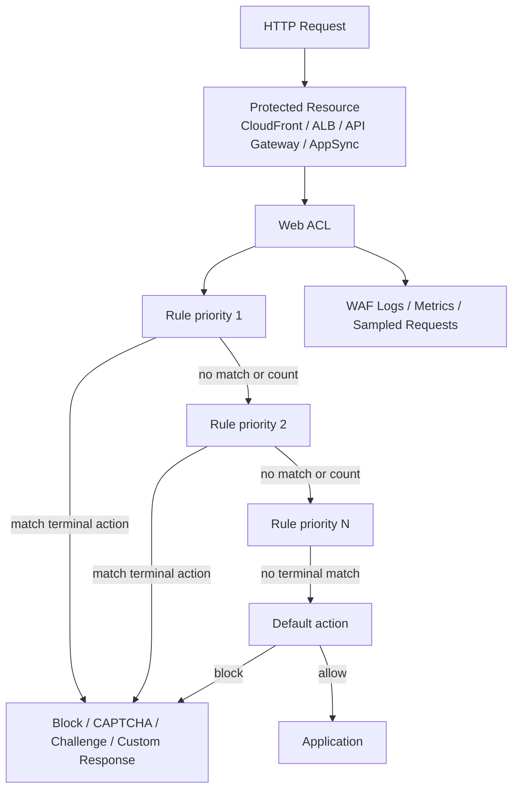
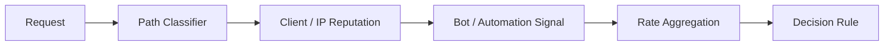
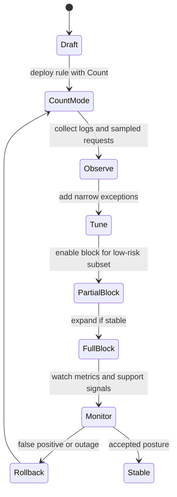
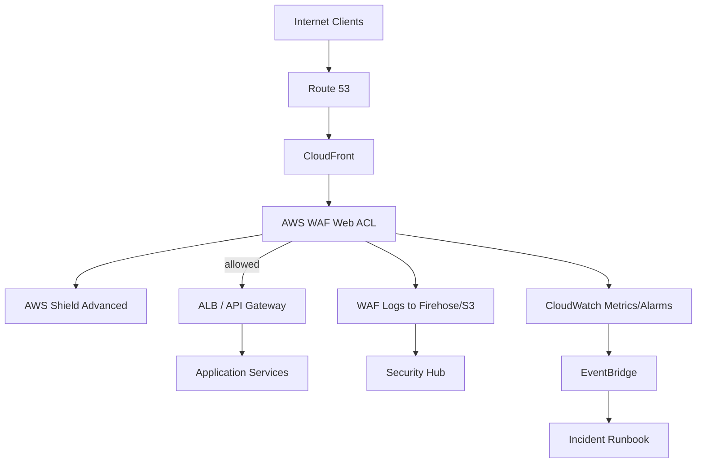

# Part 051 — WAF, Shield, and Edge Protection

Edge protection adalah lapisan kontrol untuk traffic HTTP(S) sebelum request menyentuh aplikasi.

Ia tidak menggantikan secure coding, authentication, authorization, input validation, rate limiting aplikasi, atau API contract. Ia adalah **kontrol perimeter aplikasi** yang membantu menahan abuse, exploit pattern umum, bot, HTTP flood, request aneh, dan serangan layer 7 yang terlalu mahal jika semuanya diproses oleh aplikasi.

Di AWS, tiga komponen inti yang sering dipakai bersama adalah:

- **AWS WAF** untuk inspect dan mengontrol HTTP(S) request;
- **AWS Shield Standard / Shield Advanced** untuk DDoS protection;
- **CloudFront / ALB / API Gateway / AppSync / Cognito / App Runner / Amplify / Verified Access** sebagai resource yang menerima proteksi WAF.

Target part ini bukan membuat daftar rule WAF sebanyak mungkin.

Targetnya adalah membangun mental model:

```txt
Edge protection yang matang = request classification + controlled blocking + safe rollout + observability + exception governance + DDoS readiness.
```

---

## 1. Masalah yang Diselesaikan Edge Protection

Aplikasi modern diekspos lewat endpoint publik.

Endpoint itu menerima traffic dari:

- browser user normal;
- mobile app;
- partner integration;
- crawler legal;
- scanner random internet;
- bot credential stuffing;
- scraper;
- exploit automation;
- DDoS traffic;
- misconfigured internal client;
- pentest;
- attacker yang sudah punya credential valid.

Tanpa edge protection, semua traffic ini sampai ke aplikasi.

Artinya aplikasi harus membayar semua biaya:

- CPU;
- memory;
- database connection;
- cache miss;
- downstream call;
- log volume;
- autoscaling;
- error budget;
- on-call noise.

Edge protection memindahkan sebagian keputusan lebih awal.

```txt
Request murah harus diproses aplikasi.
Request mahal, aneh, atau jelas berbahaya harus difilter sedini mungkin.
```

Namun edge protection juga berbahaya jika salah desain.

Rule yang terlalu agresif bisa memblokir user sah. Rate limit yang salah bisa mematikan tenant besar. Managed rule yang langsung di-block tanpa observability bisa menghentikan checkout, login, upload, atau webhook.

Karena itu edge protection harus diperlakukan sebagai **production control plane**, bukan dekorasi security.

---

## 2. AWS WAF dalam Satu Kalimat

AWS WAF adalah web application firewall yang menginspeksi HTTP(S) request yang diteruskan ke resource yang dilindungi, lalu mengambil action berdasarkan rule di dalam web ACL.

Sederhananya:

```txt
web request -> protected resource -> associated web ACL -> ordered rules -> action
```

Action bisa berupa:

- `ALLOW`;
- `BLOCK`;
- `COUNT`;
- `CAPTCHA`;
- `CHALLENGE`;
- custom response;
- label request untuk dipakai rule berikutnya.

Resource yang umum dilindungi:

- CloudFront distribution;
- Application Load Balancer;
- API Gateway REST API;
- AppSync GraphQL API;
- Cognito user pool;
- App Runner service;
- Amplify;
- Verified Access instance;
- beberapa resource regional lain sesuai dukungan AWS WAF saat ini.

Poin penting:

```txt
Satu protected resource hanya bisa dikaitkan dengan satu web ACL, tetapi satu web ACL bisa dikaitkan ke banyak resource sesuai batasan resource type dan scope.
```

Konsekuensinya, desain web ACL adalah desain shared control. Jika satu ACL dipakai banyak aplikasi, perubahan rule berdampak ke semua aplikasi yang memakai ACL itu.

---

## 3. Mental Model: WAF sebagai Request Decision Engine

AWS WAF bukan firewall layer 3/4.

Ia tidak melihat TCP handshake sebagai objek utama. Ia melihat HTTP request.

Request dapat diklasifikasi dari elemen seperti:

- source IP;
- country;
- URI path;
- query string;
- header;
- method;
- body;
- cookie;
- label dari rule sebelumnya;
- rate aggregation key;
- JA3/TLS fingerprint pada log tertentu;
- rule group managed/custom.

Flow-nya:



Rule dievaluasi berdasarkan priority.

Ini membuat urutan rule menjadi bagian dari correctness.

Contoh:

```txt
Allow partner webhook IP harus dievaluasi sebelum managed rule yang mungkin memblokir payload webhook.
```

Atau:

```txt
Block known abusive ASN harus dievaluasi sebelum expensive Bot Control rule untuk menekan biaya evaluasi.
```

---

## 4. Web ACL sebagai Protection Pack

Web ACL adalah unit konfigurasi proteksi.

Ia berisi:

- scope: CloudFront/global atau regional;
- default action;
- ordered rules;
- rule groups;
- capacity/WCU;
- logging configuration;
- metrics configuration;
- body inspection limit;
- associated resources;
- labels;
- token domain config untuk challenge/CAPTCHA use case tertentu;
- visibility configuration.

Cara berpikir yang benar:

```txt
Web ACL adalah policy bundle untuk satu kelas aplikasi, bukan tempat menumpuk semua aturan security organisasi.
```

Contoh kelas ACL:

| Web ACL | Dipakai Untuk | Karakteristik |
|---|---|---|
| `edge-public-web-baseline` | public website di CloudFront | managed rules, bot control ringan, rate limit umum |
| `edge-api-public-baseline` | public API di API Gateway/ALB | path-based rules, auth endpoint rate limit, JSON body rules |
| `edge-admin-private-baseline` | admin console | IP allowlist/VPN/Verified Access, stricter geo/rate rules |
| `edge-partner-webhook` | webhook partner | method/path allow, partner IP/rate constraints, payload exceptions |
| `edge-cognito-auth` | Cognito user pool | credential stuffing, ATP/CAPTCHA, auth rate controls |

Anti-pattern:

```txt
Satu web ACL global untuk semua aplikasi karena “biar gampang”.
```

Itu mudah di awal, tetapi sulit saat satu aplikasi butuh exception rule yang membahayakan aplikasi lain.

---

## 5. Rule Action: Jangan Langsung Block Semua

AWS WAF memberi banyak action, tetapi rollout yang aman biasanya mengikuti urutan:

```txt
COUNT -> observe -> tune -> partial BLOCK -> monitor -> broader BLOCK
```

### COUNT

`COUNT` berarti rule match dicatat, tetapi request tetap lanjut.

Gunakan untuk:

- rule baru;
- managed rule group baru;
- rule yang berpotensi false positive;
- rollout ke aplikasi critical;
- tuning threshold rate limit;
- audit mode.

### BLOCK

`BLOCK` menghentikan request.

Gunakan jika:

- false positive sudah dipahami;
- rule spesifik;
- ada owner yang menerima risiko;
- ada rollback cepat;
- log dan metrics aktif.

### CAPTCHA / CHALLENGE

`CAPTCHA` dan `CHALLENGE` berguna untuk menambah friction tanpa langsung hard block.

Cocok untuk:

- suspicious bot;
- scraping;
- login abuse;
- low-confidence signal;
- traffic yang mungkin manusia.

Namun jangan pakai ini sembarangan untuk API machine-to-machine. Partner webhook, mobile clients, dan backend client tidak bisa menyelesaikan CAPTCHA.

### ALLOW

`ALLOW` dapat dipakai sebagai explicit allow untuk traffic tertentu.

Hati-hati: allow rule yang terlalu awal bisa melewati proteksi lain.

Contoh buruk:

```txt
ALLOW semua request dari corporate NAT IP
```

Jika laptop user di corporate network compromised, semua traffic dari IP tersebut melewati rule berikutnya.

Lebih baik:

```txt
ALLOW corporate NAT only untuk /admin/* dan tetap biarkan baseline managed rules mengevaluasi request lain.
```

---

## 6. Managed Rules: Cepat, Berguna, tapi Bukan Tanpa Risiko

AWS Managed Rules memberi rule groups untuk proteksi umum seperti:

- common web exploits;
- known bad inputs;
- SQL injection;
- cross-site scripting;
- bad bots;
- account takeover prevention;
- anonymous IP list;
- admin protection;
- Linux/Unix/PHP/WordPress specific patterns;
- Amazon IP reputation.

Managed rules membantu karena AWS memperbarui rule group sesuai threat intelligence dan vulnerability pattern.

Tetapi managed rule group tetap harus diperlakukan sebagai dependency produksi.

Checklist rollout:

1. Aktifkan rule group dalam mode count/override count.
2. Monitor sampled requests dan WAF logs.
3. Identifikasi false positives berdasarkan endpoint, method, header, body, tenant, dan user agent.
4. Tambahkan exception sempit.
5. Ubah subset rule ke block.
6. Lakukan canary pada environment atau resource subset.
7. Dokumentasikan owner dan rollback.

Jangan memasang semua managed rule dalam mode block di hari pertama untuk aplikasi production.

Managed rules harus menjawab:

```txt
Serangan apa yang ingin ditahan?
False positive apa yang bisa diterima?
Aplikasi apa yang terdampak?
Siapa owner exception?
Bagaimana membuktikan rule bekerja?
```

---

## 7. Rule Priority dan Label-Based Composition

Rule priority menentukan urutan evaluasi.

AWS WAF juga mendukung label. Rule dapat memberi label pada request, lalu rule berikutnya dapat menggunakan label itu.

Ini membuat WAF bisa dipakai sebagai classifier bertahap.

Contoh mental model:

```txt
Rule 10: label request sebagai suspicious-login-path
Rule 20: label request sebagai anonymous-ip
Rule 30: jika suspicious-login-path + anonymous-ip + high-rate -> challenge/block
```

Dengan label, kita tidak harus membuat satu rule raksasa.

Kita bisa membuat pipeline:



Keuntungan:

- rule lebih mudah dibaca;
- false positive lebih mudah dianalisis;
- exception bisa lebih spesifik;
- metric per stage bisa dipisah;
- action final bisa disesuaikan.

---

## 8. Rate-Based Rules: Kontrol Murah untuk Abuse Mahal

Rate-based rule membatasi request berdasarkan count dalam window evaluasi yang dikelola AWS WAF.

Aggregation key bisa sederhana atau lebih granular, misalnya:

- source IP;
- forwarded IP;
- header;
- cookie;
- label namespace;
- custom keys sesuai fitur WAF yang tersedia.

Contoh use case:

| Endpoint | Risiko | Rate Strategy |
|---|---|---|
| `/login` | credential stuffing | rate by IP + username-ish signal jika tersedia |
| `/password-reset` | email abuse | rate by IP + target account/email hash di aplikasi |
| `/search` | scraper dan cost abuse | rate by IP, token, tenant, atau header |
| `/checkout` | bot/fraud spike | rate + challenge untuk suspicious traffic |
| `/api/public/*` | partner/client misbehaviour | rate per API key/tenant jika bisa diekspresikan |
| `/graphql` | expensive query abuse | WAF path/method + app-level complexity limit |

Hal penting:

```txt
Rate limit di WAF hanya melihat request envelope yang tersedia di edge. Ia tidak memahami business identity sedalam aplikasi.
```

Karena itu WAF rate limit harus dikombinasikan dengan application-level throttling.

WAF menahan abuse kasar. Aplikasi menahan abuse yang butuh konteks domain.

---

## 9. Bot Control: Jangan Samakan Semua Bot

Bot tidak selalu buruk.

Ada:

- search engine crawler;
- monitoring bot;
- partner integration;
- scraper;
- vulnerability scanner;
- credential stuffing automation;
- inventory bot internal;
- malicious headless browser.

Bot Control membantu mengklasifikasikan dan mengontrol bot traffic. Namun desainnya harus memisahkan kategori.

Policy yang sehat:

| Bot Type | Default Response |
|---|---|
| Verified search crawler | Allow atau count sesuai kebutuhan SEO |
| Monitoring bot resmi | Allow dengan path terbatas |
| Unknown scraper | Rate limit / challenge |
| Credential stuffing bot | Block / challenge |
| High-volume anonymous automation | Block atau progressive challenge |
| Partner bot | Explicit allowlist + path/method constraint |

Anti-pattern:

```txt
Block all bots.
```

Konsekuensinya bisa merusak SEO, uptime monitor, partner integration, atau synthetic checks.

Bot Control juga berdampak biaya. Jangan memakainya sebagai satu-satunya filter untuk semua traffic jika rule sederhana seperti IP reputation/rate limit/path constraint bisa menurunkan traffic lebih awal.

---

## 10. AWS Shield Standard dan Shield Advanced

AWS Shield Standard aktif secara default untuk AWS customers dan memberi proteksi DDoS dasar pada network/transport layer untuk layanan AWS.

AWS Shield Advanced memberi capability tambahan, seperti:

- proteksi resource tertentu seperti CloudFront, Route 53, Global Accelerator, ALB, Elastic IP, dan lainnya sesuai dukungan;
- enhanced detection dan visibility;
- DDoS cost protection untuk eligible usage;
- access ke AWS Shield Response Team pada paket/support tertentu;
- integrasi dengan AWS WAF;
- automatic application layer DDoS mitigation untuk resource tertentu jika dikonfigurasi;
- metrics dan event visibility lebih kaya.

Mental model:

```txt
Shield Standard = baseline DDoS protection.
Shield Advanced = operating model untuk aplikasi kritikal yang butuh DDoS readiness, visibility, response, dan cost protection.
```

DDoS readiness bukan hanya subscription.

Ia mencakup:

- resource enrollment;
- WAF web ACL association;
- rate-based rules;
- health checks;
- contact/escalation path;
- runbook;
- game day;
- baseline traffic understanding;
- dashboard;
- post-incident evidence.

---

## 11. Application Layer DDoS: Masalahnya Bukan Selalu Volume

Layer 3/4 DDoS sering terlihat sebagai volume traffic besar.

Layer 7 DDoS bisa lebih halus:

- request ke endpoint mahal;
- login flood;
- search flood;
- cache-busting query string;
- GraphQL expensive query;
- POST body besar;
- cart/checkout abuse;
- high-cardinality tenant attack;
- slow but distributed scrape.

Masalahnya bukan hanya request per second.

Masalahnya adalah **cost per request**.

```txt
100 rps ke /health mungkin murah.
10 rps ke /export-report?range=10y mungkin mahal.
```

Karena itu WAF rule harus memahami endpoint class.

Contoh:

```txt
/static/*        -> high rate allowed, cache optimized
/api/search      -> moderate rate, bot challenge, app-level query limit
/login           -> strict rate, ATP/Bot signal, MFA-aware flow
/admin/*         -> IP/identity restricted, strict WAF baseline
/webhook/payment -> partner IP + signature validation in app + WAF path/method guard
```

---

## 12. CloudFront + WAF: Edge-First Protection

CloudFront sering menjadi lokasi terbaik untuk WAF jika aplikasi public internet-facing.

Keuntungan:

- request difilter lebih dekat ke edge;
- origin menerima traffic lebih bersih;
- caching mengurangi beban origin;
- integration dengan Shield untuk DDoS posture;
- global scope untuk web ACL CloudFront;
- cocok untuk website, API edge, static/dynamic mix.

Namun CloudFront + WAF tidak otomatis aman jika origin masih bisa diakses langsung.

Invariant penting:

```txt
Jika CloudFront adalah edge resmi, origin tidak boleh bisa diakses langsung dari internet tanpa kontrol yang setara.
```

Kontrol origin:

- ALB security group hanya menerima CloudFront origin-facing prefix list jika sesuai;
- custom header secret dari CloudFront ke origin sebagai defense tambahan, bukan satu-satunya auth;
- Origin Access Control untuk S3 origin;
- private origin melalui VPC origin pattern jika tersedia dan cocok;
- Route 53/DNS tidak mengekspos origin raw;
- CloudTrail/Config alert jika ALB/S3 origin menjadi public langsung.

---

## 13. ALB + WAF: Regional Application Gate

ALB + WAF cocok untuk aplikasi regional.

Gunakan ketika:

- traffic tidak perlu CloudFront;
- aplikasi internal-ish tetapi tetap internet-facing;
- ada layer 7 routing ALB;
- aplikasi berjalan di ECS/EKS/EC2;
- regional latency lebih penting daripada edge caching.

Risiko:

- request sudah masuk region sebelum difilter;
- DDoS volumetrik lebih baik ditahan di edge jika memungkinkan;
- body inspection limit dan resource-specific WAF behavior harus dipahami;
- origin capacity tetap perlu autoscaling dan overload control.

ALB + WAF sering cukup untuk enterprise app. Namun untuk public high-traffic/consumer workload, CloudFront + WAF + Shield Advanced biasanya lebih matang.

---

## 14. API Gateway + WAF: Jangan Tumpuk Throttling Tanpa Model

API Gateway sudah punya throttling, quota, usage plans, authorizer, resource policy, dan integration control.

WAF memberi HTTP request filtering sebelum request diproses lebih jauh.

Gunakan WAF untuk:

- block malicious patterns;
- coarse rate abuse;
- IP reputation;
- bot signal;
- geo restriction;
- request size/method/path guard;
- credential stuffing protection pada auth endpoint;
- emergency block.

Gunakan API Gateway/application untuk:

- API key/tenant quota;
- JWT/auth context throttling;
- business-level rate limit;
- schema validation;
- idempotency;
- per-customer abuse policy.

Rule sederhana:

```txt
WAF tahu request envelope. API/application tahu identity dan domain intent.
```

Jangan membuat semua rate limit di WAF jika abuse sebenarnya per user/tenant/API key.

---

## 15. Cognito User Pool + WAF: Auth Endpoint Protection

Cognito user pool dapat dilindungi dengan AWS WAF.

Use case:

- credential stuffing;
- login abuse;
- signup abuse;
- password reset abuse;
- bot traffic;
- suspicious IP ranges;
- high-rate auth attempts.

Namun authentication flow sangat sensitif terhadap false positives.

Salah block pada auth endpoint berarti user tidak bisa masuk.

Rollout aman:

1. Aktifkan WAF logging.
2. Mulai managed rules dalam mode count.
3. Tambahkan rate limit konservatif.
4. Gunakan challenge/CAPTCHA dengan hati-hati.
5. Monitor login failure rate, signup conversion, password reset success, support ticket.
6. Buat emergency bypass process untuk incident false positive.

Auth protection harus dilihat sebagai gabungan:

- WAF/Bot Control;
- Cognito advanced security features jika digunakan;
- MFA/adaptive auth;
- breached password detection di layer identitas jika tersedia;
- application fraud/risk logic;
- SIEM correlation.

---

## 16. Geo Restriction: Kontrol Kasar, Bukan Security Sempurna

WAF bisa memfilter berdasarkan country.

Ini berguna untuk:

- compliance sederhana;
- bisnis yang hanya melayani negara tertentu;
- mengurangi noise dari region yang tidak relevan;
- emergency block selama attack spike.

Namun country-based blocking bukan boundary kuat.

Attacker bisa memakai proxy/VPN/residential network di negara allowed.

Gunakan geo rule sebagai:

```txt
noise reduction and risk filter
```

bukan sebagai:

```txt
primary authentication or authorization control
```

Jika user sah sering bepergian, geo blocking bisa menjadi reliability problem.

---

## 17. IP Reputation dan Anonymous IP

AWS Managed Rules menyediakan beberapa rule group untuk IP reputation dan anonymous networks.

Manfaat:

- menurunkan traffic dari known malicious source;
- memblokir TOR/proxy/VPN tertentu jika cocok dengan risk model;
- mengurangi scanner noise;
- meningkatkan sinyal untuk rate/challenge rule.

Namun jangan anggap IP reputation selalu benar.

False positive dapat terjadi karena:

- shared NAT;
- corporate proxy;
- mobile carrier NAT;
- cloud provider IP yang dipakai partner sah;
- VPN user sah;
- reused IP setelah reputasi lama.

Pola yang aman:

```txt
IP reputation low confidence -> COUNT/CHALLENGE
IP reputation high confidence + sensitive path -> BLOCK
IP reputation + high rate + auth path -> BLOCK
```

---

## 18. Request Body Inspection dan Oversize Handling

WAF dapat menginspeksi request body sampai limit tertentu yang berbeda berdasarkan resource type dan konfigurasi.

Ini penting untuk:

- SQL injection;
- XSS;
- malicious JSON/XML payload;
- file upload metadata;
- GraphQL request;
- form submission.

Namun request body besar adalah failure mode.

Pertanyaan desain:

- Apakah endpoint menerima upload besar?
- Apakah WAF perlu inspect body endpoint itu?
- Apa yang terjadi jika body melebihi inspection limit?
- Apakah oversize content di-continue, match, atau no-match sesuai rule behavior?
- Apakah aplikasi tetap melakukan validation setelah WAF?

Jangan bergantung pada WAF body inspection sebagai satu-satunya validation.

```txt
WAF filtering is early rejection. Application validation is correctness.
```

---

## 19. Logging: WAF Tanpa Log Itu Tebakan

WAF harus punya observability.

Minimal:

- CloudWatch metrics per web ACL dan rule;
- sampled requests;
- WAF logs ke Firehose/S3/CloudWatch destination sesuai arsitektur;
- dashboard block/count/challenge trend;
- alert untuk spike;
- correlation dengan CloudFront/ALB/API Gateway logs;
- runbook untuk false positive.

Log field penting:

- timestamp;
- web ACL;
- terminating rule;
- action;
- labels;
- client IP / forwarded IP;
- country;
- URI;
- method;
- headers yang relevan;
- JA3 fingerprint jika tersedia;
- request ID;
- source resource.

Query pertanyaan incident:

```txt
Rule apa yang memblokir user?
Path apa yang paling banyak di-block?
Country/IP/ASN mana yang spike?
Apakah block terjadi setelah deployment rule baru?
Apakah traffic blocked berkorelasi dengan 5xx turun atau naik?
Apakah CAPTCHA/challenge menyebabkan conversion drop?
```

---

## 20. Dashboard yang Berguna untuk WAF

Dashboard jangan hanya menampilkan total blocked request.

Tampilkan peta keputusan.

Metric yang berguna:

| Metric | Kenapa Penting |
|---|---|
| Allowed vs blocked vs counted | Melihat posture umum |
| Top terminating rules | Mengetahui rule yang benar-benar aktif |
| Block by path | Mendeteksi endpoint attack/false positive |
| Block by country/IP | Investigasi sumber traffic |
| Rate rule trigger | Abuse/flood signal |
| CAPTCHA/challenge solve rate | UX dan bot efficacy |
| 4xx/5xx aplikasi | Korelasi dengan health aplikasi |
| Origin request count | Apakah WAF menurunkan beban origin |
| WCU usage | Kapasitas rule dan cost risk |
| Managed rule updates impact | Perubahan behaviour setelah rule update |

Dashboard harus dipakai oleh:

- security team;
- application owner;
- SRE/on-call;
- platform team;
- incident commander.

---

## 21. Safe Rollout Pattern

Untuk web ACL production, gunakan rollout bertahap.



Checklist sebelum block:

- rule owner jelas;
- affected resource jelas;
- sample request sudah dianalisis;
- exception path terdokumentasi;
- rollback command tersedia;
- alert aktif;
- app owner setuju;
- support/customer impact channel siap.

---

## 22. Exception Governance

Exception WAF sering menjadi lubang permanen.

Contoh:

```txt
Exclude SQLi rule untuk /api/* karena satu endpoint false positive.
```

Itu terlalu luas.

Exception harus sempit:

- path spesifik;
- method spesifik;
- header/content-type spesifik;
- partner source spesifik;
- rule ID spesifik;
- TTL/expiry;
- owner;
- reason;
- compensating control.

Format exception registry:

| Field | Contoh |
|---|---|
| exceptionId | `waf-exc-2026-017` |
| webAcl | `edge-public-api-prod` |
| rule | `AWSManagedRulesCommonRuleSet:SizeRestrictions_BODY` |
| scope | `POST /api/v1/documents/upload` |
| condition | `Content-Type=multipart/form-data` |
| expiresAt | `2026-08-31` |
| owner | `document-platform-team` |
| compensatingControl | app-level file scanner + upload size limit |
| evidence | WAF sampled request + app validation doc |

Invariant:

```txt
Tidak ada WAF exception tanpa expiry dan owner.
```

---

## 23. WAF as Code

WAF harus dikelola sebagai code.

Bukan clickops.

Minimal artefak:

- web ACL definition;
- rule group definition;
- IP set/regex set;
- logging configuration;
- dashboard;
- alarm;
- exception registry;
- change review;
- test cases;
- rollback plan.

Testing WAF tidak mudah karena beberapa behavior tergantung runtime request.

Tetapi tetap bisa diuji:

- static validation untuk policy schema;
- lint untuk dangerous allow/exclusion;
- snapshot diff untuk rule changes;
- test request suite di staging;
- replay log sample ke test environment jika memungkinkan;
- canary endpoint;
- metric-based progressive rollout.

Contoh lint rules:

```txt
Deny rule exclusion at web ACL level without path condition.
Deny allowlist IP rule without path/method condition unless explicitly approved.
Deny disabling logging on production web ACL.
Deny managed rule group block rollout without prior count-mode evidence.
Deny exception without expiry.
```

---

## 24. WAF dan Application Security: Batas Tanggung Jawab

WAF tidak memperbaiki bug aplikasi.

Ia membantu mengurangi exploitability dan noise.

Contoh:

| Masalah | WAF Bisa Membantu? | Tetap Harus di Aplikasi? |
|---|---:|---:|
| SQL injection pattern umum | Ya | Ya, parameterized query wajib |
| XSS payload umum | Ya | Ya, output encoding wajib |
| Broken access control | Tidak cukup | Ya, authorization wajib |
| IDOR | Tidak cukup | Ya, object-level authorization wajib |
| Credential stuffing | Ya | Ya, MFA/risk auth/rate limit domain |
| File upload malware | Sedikit | Ya, scanning/storage isolation |
| GraphQL expensive query | Sedikit | Ya, complexity/depth limit |
| Business logic abuse | Tidak cukup | Ya, domain fraud control |

WAF adalah filter.

Aplikasi tetap harus benar.

---

## 25. DDoS Runbook

DDoS runbook harus ada sebelum serangan.

Minimal runbook:

1. Identifikasi resource terdampak.
2. Lihat CloudWatch metrics: request count, 4xx, 5xx, latency, origin health.
3. Lihat WAF top rules dan sampled requests.
4. Bedakan traffic legitimate spike vs attack.
5. Aktifkan/tingkatkan rate-based rule jika perlu.
6. Ubah rule mencurigakan dari count ke block/challenge.
7. Pastikan origin scaling dan connection pools sehat.
8. Jika memakai Shield Advanced, eskalasi sesuai support/SRT path.
9. Capture evidence: timeline, metrics, rules changed, impact.
10. Setelah stabil, lakukan post-incident tuning.

Runbook harus punya emergency controls:

- block country sementara;
- block ASN/IP set sementara;
- raise challenge pada suspicious paths;
- lower rate threshold untuk endpoint mahal;
- static maintenance/cached mode jika aplikasi degrade;
- partner/user communication plan.

---

## 26. Failure Modes

### 26.1 False Positive Memblokir User Sah

Penyebab:

- managed rule terlalu agresif;
- body size/format normal dianggap aneh;
- partner payload mirip attack pattern;
- bot rule memblokir monitoring/SEO;
- geo/IP reputation salah.

Mitigasi:

- count-mode rollout;
- sampled request analysis;
- exception sempit;
- dashboard conversion/login;
- rollback cepat.

### 26.2 Origin Tetap Bisa Diakses Langsung

WAF di CloudFront tidak berguna jika attacker bypass CloudFront dan memukul ALB langsung.

Mitigasi:

- restrict origin;
- Config rule/public exposure detection;
- security group guardrail;
- origin custom header;
- route/DNS hygiene.

### 26.3 Rule Sprawl

Terlalu banyak rule tanpa owner membuat WAF tidak bisa dioperasikan.

Mitigasi:

- web ACL per class;
- rule naming standard;
- exception registry;
- review cadence;
- metrics per rule.

### 26.4 WAF Menjadi Bottleneck Governance

Setiap perubahan aplikasi butuh security team manual edit WAF.

Mitigasi:

- platform-owned baseline;
- app-owned narrow overrides;
- policy-as-code;
- PR-based workflow;
- safe templates.

### 26.5 Biaya Naik Karena Rule Mahal

Bot Control, CAPTCHA, body inspection lebih besar, logging volume, dan rule evaluation bisa menambah biaya.

Mitigasi:

- pre-filter murah;
- scope Bot Control hanya path perlu;
- retention/log sampling strategy;
- WCU dan cost dashboard;
- evaluate managed rule value.

---

## 27. Production Reference Architecture



Baseline:

- CloudFront + WAF for public internet workload when suitable;
- Shield Advanced for critical public workloads;
- web ACL per application class;
- managed rules in count before block;
- rate-based rules on expensive endpoints;
- Bot Control only where needed;
- WAF logs enabled;
- dashboards and alarms;
- origin bypass prevention;
- WAF as code;
- exception registry;
- DDoS runbook.

---

## 28. Implementation Checklist

### Foundation

- [ ] Identify public HTTP(S) resources.
- [ ] Classify resources by criticality and traffic profile.
- [ ] Decide CloudFront vs regional WAF placement.
- [ ] Ensure origin bypass is blocked.
- [ ] Define baseline web ACL classes.

### Rule Design

- [ ] Enable common managed rules in count mode first.
- [ ] Add IP reputation rules.
- [ ] Add rate-based rules for expensive endpoints.
- [ ] Add Bot Control only where justified.
- [ ] Add path/method-specific rules.
- [ ] Avoid global allowlists.

### Observability

- [ ] Enable WAF logging.
- [ ] Create dashboard by rule/path/action.
- [ ] Alert on block spikes.
- [ ] Alert on origin 5xx/latency correlated with WAF events.
- [ ] Store logs in central archive or security analytics pipeline.

### Governance

- [ ] Manage web ACL as code.
- [ ] Maintain exception registry.
- [ ] Require expiry for exceptions.
- [ ] Review managed rule updates.
- [ ] Test rollout with count mode.
- [ ] Document rollback.

### DDoS Readiness

- [ ] Identify Shield Advanced protected resources if needed.
- [ ] Configure health checks where appropriate.
- [ ] Prepare runbook.
- [ ] Run game day.
- [ ] Confirm escalation path.

---

## 29. Engineering Heuristics

Gunakan heuristik berikut:

```txt
Do not block what you have not observed.
```

```txt
A WAF exception without expiry is future exposure.
```

```txt
Rate limit by cost, not only by request count.
```

```txt
WAF protects the envelope; application protects the domain.
```

```txt
CloudFront WAF is incomplete if origin bypass remains open.
```

```txt
DDoS readiness is a runbook, not a subscription.
```

```txt
Managed rules reduce toil, but they are still production dependencies.
```

---

## 30. Latihan Praktis

Desain proteksi untuk tiga endpoint:

```txt
GET  /catalog/search
POST /auth/login
POST /webhooks/payment-provider
```

Untuk masing-masing, tentukan:

- WAF rule yang relevan;
- managed rule group yang di-count dulu;
- rate-based rule;
- exception yang mungkin diperlukan;
- observability metric;
- false positive risk;
- rollback plan;
- kontrol aplikasi yang tetap wajib ada.

Expected reasoning:

- `/catalog/search` rentan scraper dan cost abuse;
- `/auth/login` rentan credential stuffing dan bot;
- `/webhooks/payment-provider` harus dibatasi path/method/source/signature tetapi tidak boleh CAPTCHA.

---

## 31. Ringkasan

AWS WAF, Shield, dan edge protection adalah lapisan penting untuk public workload.

Namun desain yang matang bukan sekadar mengaktifkan managed rules.

Desain yang matang menjawab:

- resource apa yang dilindungi;
- request apa yang dianggap normal;
- request apa yang dianggap mahal;
- rule apa yang hanya dihitung dulu;
- rule apa yang aman di-block;
- exception apa yang sah;
- bagaimana false positive dideteksi;
- bagaimana origin bypass dicegah;
- bagaimana DDoS response dijalankan;
- bagaimana semua perubahan diaudit.

Edge protection yang baik membuat aplikasi lebih tahan abuse tanpa mengorbankan user sah.

---

## References

- AWS WAF Developer Guide — https://docs.aws.amazon.com/waf/latest/developerguide/what-is-aws-waf.html
- Resources that you can protect with AWS WAF — https://docs.aws.amazon.com/waf/latest/developerguide/how-aws-waf-works-resources.html
- AWS Managed Rules rule groups — https://docs.aws.amazon.com/waf/latest/developerguide/aws-managed-rule-groups-list.html
- AWS WAF Bot Control — https://docs.aws.amazon.com/waf/latest/developerguide/waf-bot-control.html
- AWS WAF rate-based rule statements — https://docs.aws.amazon.com/waf/latest/developerguide/waf-rule-statement-type-rate-based.html
- AWS Shield and Shield Advanced — https://docs.aws.amazon.com/waf/latest/developerguide/ddos-overview.html
- AWS Shield Advanced automatic application layer DDoS mitigation — https://docs.aws.amazon.com/waf/latest/developerguide/ddos-automatic-app-layer-response.html
- AWS WAF logging fields — https://docs.aws.amazon.com/waf/latest/developerguide/logging-fields.html
