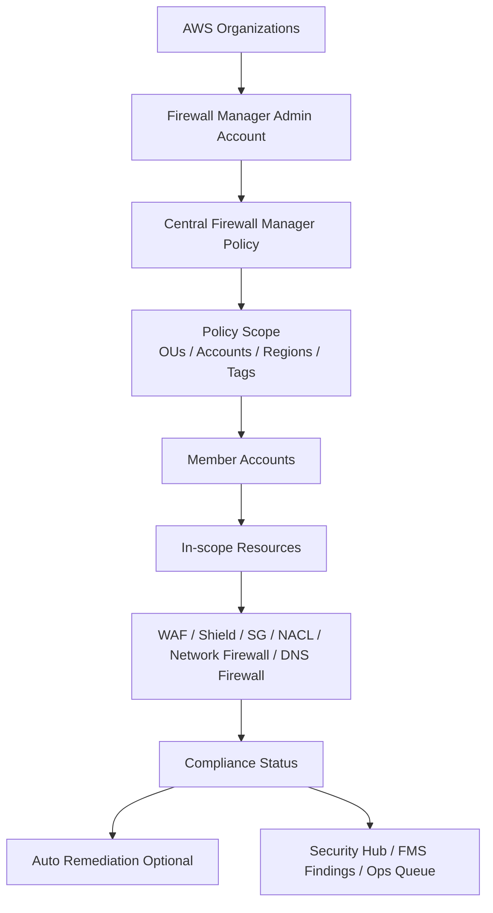
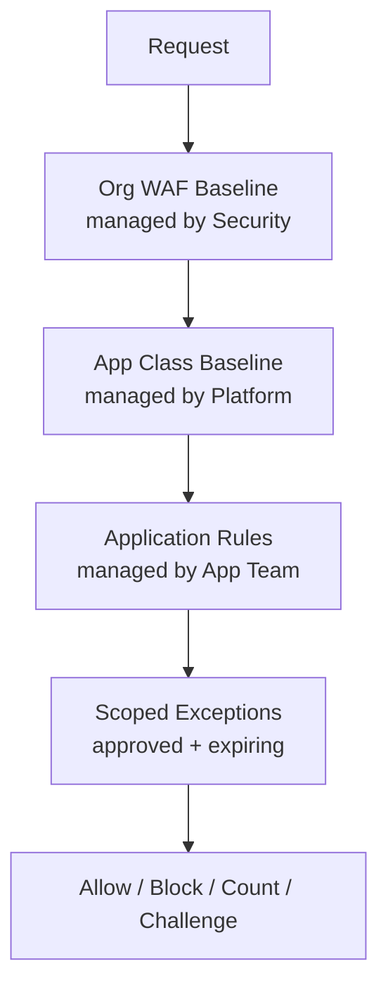
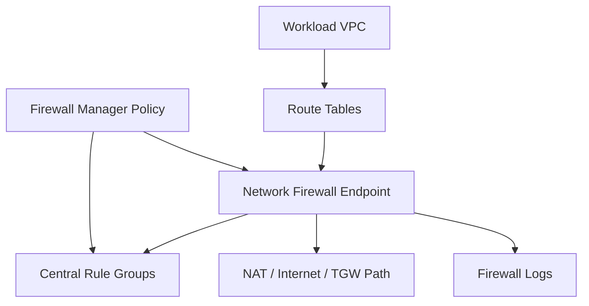
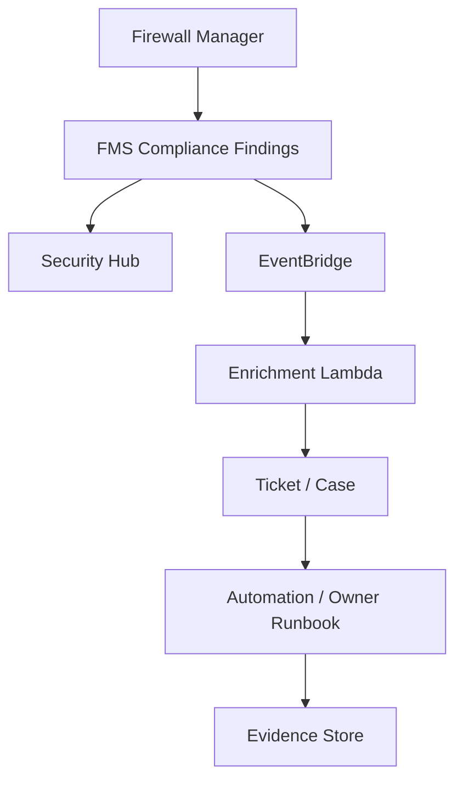

# Part 052 — Firewall Manager and Central Policy

Semakin banyak AWS account, semakin sulit memastikan semua workload punya proteksi network dan edge yang konsisten.

Masalahnya bukan hanya membuat WAF rule atau security group rule.

Masalah sebenarnya:

```txt
Bagaimana organisasi memastikan proteksi berlaku konsisten lintas account, region, resource, OU, dan workload lifecycle — tanpa security team harus mengejar satu per satu resource baru?
```

AWS Firewall Manager menjawab masalah itu sebagai **central policy distribution and compliance layer** untuk beberapa jenis proteksi.

Ia membantu mengelola policy untuk:

- AWS WAF;
- AWS Shield Advanced;
- VPC security groups;
- Network ACLs;
- AWS Network Firewall;
- Route 53 Resolver DNS Firewall;
- third-party firewall integrations tertentu;
- policy lain sesuai dukungan AWS Firewall Manager saat ini.

Part ini membahas Firewall Manager sebagai operating model, bukan sekadar fitur console.

---

## 1. Masalah Multi-Account Security Control

Di satu account, security engineer masih bisa melihat semua resource.

Di 100 account, model itu runtuh.

Resource muncul dari:

- platform pipeline;
- application team;
- sandbox;
- temporary environment;
- emergency deployment;
- M&A account migration;
- third-party product;
- legacy account;
- account vending machine.

Jika proteksi WAF, Shield, security group, DNS Firewall, atau Network Firewall diterapkan manual, maka drift pasti terjadi.

Contoh drift:

```txt
Aplikasi baru punya ALB publik, tetapi tidak punya WAF.
```

```txt
Team membuat security group dengan inbound 0.0.0.0/0 ke port admin.
```

```txt
Account baru dibuat, tetapi Shield Advanced policy tidak menjangkau resource kritikal.
```

```txt
DNS Firewall policy tidak diterapkan ke VPC baru.
```

```txt
Network Firewall route dibuat manual dan tidak konsisten antar workload account.
```

Firewall Manager mengubah model dari:

```txt
Security team mencari resource lalu memperbaiki satu per satu.
```

menjadi:

```txt
Security team mendefinisikan policy pusat, scope, dan remediation behavior; AWS menerapkannya ke resource yang sesuai.
```

---

## 2. Mental Model: Central Policy, Distributed Enforcement

Firewall Manager berada di atas AWS Organizations.

Ia membutuhkan:

- AWS Organizations;
- trusted access;
- Firewall Manager administrator account;
- resource/account scope;
- AWS Config untuk beberapa compliance/evaluation path;
- policy definition;
- remediation setting.

Flow umum:



Kuncinya:

```txt
Policy pusat tidak berarti semua resource punya aturan identik. Policy pusat berarti organisasi punya baseline dan scope yang eksplisit.
```

---

## 3. Firewall Manager Bukan Pengganti Semua Kontrol

Firewall Manager tidak menggantikan:

- IAM/SCP/RCP;
- AWS Config rules;
- Security Hub;
- IaC linting;
- network architecture;
- application security;
- incident response.

Ia mengisi gap:

```txt
Bagaimana menerapkan dan memonitor proteksi firewall/security policy secara konsisten lintas AWS Organizations?
```

Perbandingan:

| Kontrol | Fungsi Utama |
|---|---|
| SCP | Membatasi permission maksimum account/principal |
| RCP | Membatasi access maksimum ke resource organisasi |
| Config | Merekam state dan compliance resource |
| Security Hub | Normalisasi/correlation findings |
| Firewall Manager | Distribusi dan compliance policy untuk proteksi firewall/security tertentu |
| IaC | Desired state aplikasi/platform |
| EventBridge/Automation | Response dan remediation workflow |

Firewall Manager adalah **policy distribution plane**.

---

## 4. Administrator Account Design

Jangan jalankan Firewall Manager dari management account untuk operasi harian.

Pola yang lebih baik:

```txt
Management account: organisasi dan billing root control
Security tooling account: delegated admin untuk Firewall Manager dan security services
Log archive account: log custody
Network security account: centralized inspection infrastructure jika dipakai
```

Firewall Manager administrator harus punya:

- owner jelas;
- access via IAM Identity Center;
- break-glass terkontrol;
- change approval;
- CloudTrail monitoring;
- policy-as-code pipeline;
- dashboard compliance;
- incident runbook.

Failure mode:

```txt
Jika terlalu banyak orang bisa mengubah Firewall Manager policy, satu perubahan bisa memengaruhi seluruh organisasi.
```

Karena itu access model harus lebih mirip production platform control plane daripada admin console biasa.

---

## 5. Policy Scope: Bagian Paling Penting

Policy Firewall Manager selalu harus menjawab:

```txt
Policy ini berlaku untuk siapa, resource apa, region mana, dan dengan pengecualian apa?
```

Scope bisa didesain berdasarkan:

- Organization root;
- OU;
- account include/exclude;
- resource type;
- region;
- resource tag include/exclude;
- resource compliance state;
- application criticality;
- environment;
- ownership.

Contoh:

| Policy | Scope |
|---|---|
| `waf-public-alb-baseline` | Prod OU, ALB public tagged `internet-facing=true` |
| `shield-critical-edge` | Critical workloads OU, CloudFront/ALB tagged `ddos-protected=true` |
| `sg-admin-port-audit` | All OUs except sandbox, security groups with admin ports |
| `dns-malware-domain-block` | All workload VPCs except isolated lab OU |
| `network-firewall-egress-prod` | Prod workload accounts in selected regions |

Scope yang buruk:

```txt
Apply to all accounts and all resources because security baseline.
```

Itu bisa benar untuk beberapa guardrail sederhana, tetapi berisiko untuk policy yang mengubah traffic path atau memblokir request.

---

## 6. Auto Remediation: Powerful, tapi Harus Bertahap

Firewall Manager dapat menandai resource noncompliant. Untuk beberapa policy, ia juga bisa melakukan auto remediation.

Auto remediation harus dikendalikan.

Mode aman:

```txt
Detect only -> notify owner -> pilot auto remediation -> broaden scope -> enforce baseline
```

Gunakan auto remediation untuk kasus yang rendah risiko dan punya rollback jelas, misalnya:

- attach WAF baseline ke resource publik yang belum punya WAF;
- apply security group audit/correction sesuai policy tertentu;
- associate DNS Firewall rule group ke VPC in-scope;
- enforce Shield Advanced protection untuk resource critical.

Hati-hati untuk:

- policy yang mengubah route table;
- policy yang memengaruhi east-west traffic;
- WAF rule block mode langsung;
- security group cleanup yang bisa memutus traffic produksi;
- DNS blocklist yang bisa memblokir dependency sah.

Auto remediation bukan tujuan akhir. Tujuannya adalah **controlled convergence**.

---

## 7. AWS WAF Policies via Firewall Manager

Firewall Manager dapat mengelola WAF policy lintas account/resource.

Use case:

- semua public ALB wajib punya WAF baseline;
- semua CloudFront distribution production memakai managed rule baseline;
- auth endpoint memakai rate/Bot/ATP policy tertentu;
- web ACL logging/visibility konsisten;
- aplikasi baru otomatis masuk baseline.

Desain WAF policy:

```txt
Organization baseline rule group + application-owned override layer + exception governance.
```

Ada dua ekstrem yang harus dihindari:

### Ekstrem 1 — Terlalu Sentral

Security team mengontrol semua WAF rule detail untuk semua aplikasi.

Masalah:

- bottleneck;
- app owner tidak bisa tuning;
- false positive lambat diperbaiki;
- rule tidak memahami domain.

### Ekstrem 2 — Terlalu Lokal

Setiap team membuat WAF sendiri tanpa baseline.

Masalah:

- tidak konsisten;
- logging berbeda;
- managed rules tidak standar;
- tidak ada compliance view;
- proteksi resource baru terlewat.

Pola sehat:

- central baseline managed by platform/security;
- application-specific rules managed by app team dalam boundary;
- exception with expiry;
- Firewall Manager untuk scope dan compliance;
- WAF as code untuk perubahan.

---

## 8. WAF Policy Layering Pattern



Layer contoh:

| Layer | Owner | Isi |
|---|---|---|
| Org baseline | Security | IP reputation, common managed rules, logging requirement |
| App class baseline | Platform | API vs web vs admin vs webhook policy template |
| App rules | App team | path-specific rate limit, partner constraints |
| Exceptions | Joint | false positive suppression, TTL, compensating control |

Firewall Manager membantu memastikan baseline terpasang sesuai scope.

---

## 9. Shield Advanced Policies via Firewall Manager

Firewall Manager dapat membantu menerapkan Shield Advanced protection lintas resource.

Gunakan untuk:

- critical CloudFront distributions;
- critical ALBs;
- Route 53 hosted zones;
- Global Accelerator;
- Elastic IP resource sesuai support;
- resource yang harus masuk DDoS readiness program.

Policy harus menjawab:

- resource mana yang wajib protected;
- apakah auto remediation aktif;
- apakah WAF web ACL diperlukan untuk layer 7 monitoring;
- health check apa yang dipakai;
- siapa kontak eskalasi;
- dashboard apa yang dipakai;
- game day cadence.

Shield policy tidak boleh hanya ditempel sebagai compliance checkbox.

Resource yang dilindungi Shield Advanced harus punya runbook:

```txt
Traffic spike -> validate health -> inspect WAF/Shield metrics -> tune rate/challenge/block -> escalate if needed -> capture evidence.
```

---

## 10. Security Group Policies

Firewall Manager dapat mengelola security group policies untuk organisasi.

Jenis pola umum:

- common security group policy;
- auditing security group policy;
- usage security group policy.

Use case:

```txt
Semua ENI/ALB/RDS tertentu harus punya common security group baseline.
```

```txt
Security group tidak boleh membuka SSH/RDP/admin ports ke 0.0.0.0/0.
```

```txt
Security group unused atau overly permissive harus terdeteksi.
```

Security group policy sangat kuat karena langsung memengaruhi connectivity.

Rollout harus hati-hati:

1. Mulai audit-only.
2. Klasifikasi findings.
3. Mapping owner resource.
4. Remediasi manual untuk sample.
5. Aktifkan auto remediation hanya untuk kontrol yang jelas.
6. Exclude sandbox/lab jika perlu.
7. Monitor outage signal.

Anti-pattern:

```txt
Auto-remove all noncompliant security group rules globally.
```

Itu bisa memutus produksi jika dependency belum dipahami.

---

## 11. Network ACL Policies

Network ACL jarang menjadi kontrol utama aplikasi modern dibanding security group dan firewall inspection.

Namun dalam beberapa organisasi, NACL dipakai sebagai coarse subnet guardrail.

Firewall Manager dapat membantu mengelola NACL policy sesuai dukungan.

Gunakan dengan hati-hati.

Risiko:

- NACL stateless;
- ephemeral port handling mudah salah;
- perubahan bisa memutus banyak workload;
- sulit membaca impact jika subnet campuran;
- debugging lebih mahal.

Heuristik:

```txt
Gunakan NACL sebagai coarse guardrail, bukan sebagai tempat mengekspresikan rule aplikasi detail.
```

Jika butuh inspection detail, pertimbangkan Network Firewall atau service mesh/application controls sesuai konteks.

---

## 12. Network Firewall Policies

AWS Network Firewall dipakai untuk traffic inspection dan filtering pada network path.

Firewall Manager dapat membantu mengelola policy Network Firewall lintas accounts/VPCs.

Use case:

- centralized egress inspection;
- deny known bad domains/IPs;
- enforce outbound protocol rules;
- inspect east-west traffic untuk segment tertentu;
- regulated environment yang butuh firewall policy konsisten.

Namun Network Firewall bukan sekadar resource yang dibuat.

Ia membutuhkan architecture:

- firewall subnet;
- routing path;
- availability zone alignment;
- route table changes;
- stateless/stateful rule groups;
- logging;
- capacity planning;
- fail-open/fail-closed thinking;
- deployment blast radius.

Firewall Manager membantu policy governance, tetapi route correctness tetap tugas architecture.



Failure mode paling umum:

```txt
Policy deployed, tetapi routing tidak mengirim traffic melewati firewall.
```

Karena itu compliance harus memeriksa **resource + route path + logs**, bukan hanya existence firewall.

---

## 13. DNS Firewall Policies

Route 53 Resolver DNS Firewall membantu memblokir DNS query ke domain tertentu.

Firewall Manager dapat mendistribusikan DNS Firewall rule group association ke VPC in-scope.

Use case:

- block malware domains;
- block newly observed bad domains;
- restrict data exfiltration via DNS;
- prevent workload resolving non-approved domains;
- enforce domain allow/block policy di workload VPC.

DNS Firewall berguna karena banyak malware dan exfiltration flow membutuhkan DNS.

Namun DNS Firewall bukan kontrol lengkap:

- aplikasi bisa memakai hardcoded IP;
- aplikasi bisa memakai external DNS resolver jika egress bebas;
- encrypted DNS bisa melewati kontrol jika tidak dibatasi;
- domain category false positive bisa terjadi.

Karena itu DNS Firewall harus digabungkan dengan:

- egress route control;
- Network Firewall/proxy;
- VPC Flow Logs;
- Route 53 Resolver query logs;
- endpoint policies;
- IAM data perimeter.

---

## 14. Central Policy Naming and Versioning

Policy harus punya naming standard.

Contoh:

```txt
fms-waf-prod-public-alb-baseline-v3
fms-shield-critical-edge-v2
fms-sg-admin-port-audit-v1
fms-dns-malware-block-all-workloads-v4
fms-nfw-prod-egress-inspection-v2
```

Nama harus menunjukkan:

- service/control type;
- environment/scope;
- resource class;
- intent;
- version.

Jangan gunakan nama generik:

```txt
SecurityPolicy1
DefaultFirewall
WAF-Prod
```

Versioning penting karena policy change bisa berdampak luas.

Setiap versi harus punya:

- changelog;
- rollout date;
- owner;
- scope diff;
- rule diff;
- expected impact;
- rollback plan.

---

## 15. Policy-as-Code Workflow

Firewall Manager policy sebaiknya dikelola sebagai code.

Workflow:

```mermaid
flowchart LR
    Change[Policy Change PR]
    Lint[Static Policy Lint]
    Review[Security + Platform Review]
    Plan[Plan / Scope Diff]
    DeployCanary[Deploy to Policy Staging OU]
    Observe[Observe Compliance + Traffic]
    DeployProd[Deploy to Prod Scope]
    Monitor[Monitor + Evidence]

    Change --> Lint
    Lint --> Review
    Review --> Plan
    Plan --> DeployCanary
    DeployCanary --> Observe
    Observe --> DeployProd
    DeployProd --> Monitor
```



Static checks:

- policy has owner;
- policy has scope;
- auto remediation mode explicit;
- logging enabled when applicable;
- exception TTL present;
- no global prod rollout without canary;
- WAF block mode requires count evidence;
- security group auto remediation requires audit history;
- Network Firewall policy requires route validation plan.

---

## 16. Compliance Model

Firewall Manager menghasilkan compliance signal.

Tapi compliance harus dibaca dengan benar.

Resource compliant berarti:

```txt
Menurut policy Firewall Manager, resource memenuhi konfigurasi yang diperiksa.
```

Bukan berarti:

```txt
Resource pasti aman.
```

Contoh:

- ALB punya WAF baseline, tetapi aplikasi punya broken authorization;
- VPC punya DNS Firewall association, tetapi egress masih bisa langsung ke IP;
- resource punya Shield Advanced, tetapi runbook tidak ada;
- security group tidak membuka SSH public, tetapi membuka aplikasi rentan ke internet;
- Network Firewall ada, tetapi route bypass masih mungkin.

Karena itu FMS compliance harus masuk ke risk correlation layer:

- Security Hub;
- Config;
- GuardDuty;
- Inspector;
- Macie;
- CMDB/account registry;
- application criticality.

---

## 17. Exception Governance

Firewall Manager policy exception lebih berbahaya daripada single-resource exception karena scope-nya organisasi.

Exception harus eksplisit:

| Field | Contoh |
|---|---|
| exceptionId | `fms-exc-2026-044` |
| policy | `fms-waf-prod-public-alb-baseline-v3` |
| account | `prod-payments-123456789012` |
| resource | `alb/payments-web-prod` |
| reason | managed rule false positive pada payment redirect payload |
| expiry | `2026-08-15` |
| owner | `payments-platform` |
| compensating control | app validation + specific WAF path rule |
| approval | security + app owner |
| review cadence | weekly until closed |

Anti-pattern:

```txt
Exclude entire account from baseline forever.
```

Lebih baik:

```txt
Exclude specific resource from specific rule until date, with compensating control.
```

---

## 18. Resource Tagging Contract

Firewall Manager scope sering memakai tag.

Maka tag menjadi bagian dari security control.

Jika tag bisa dimanipulasi bebas, user bisa menghindari policy.

Contoh buruk:

```txt
Firewall Manager WAF policy berlaku untuk tag internet-facing=true.
Team menghapus tag itu dari ALB publik agar tidak kena policy.
```

Mitigasi:

- tag policy di AWS Organizations;
- SCP/IAM condition membatasi perubahan protected tags;
- Config rule mendeteksi resource public tanpa required tags;
- pipeline memaksa tag saat create;
- account vending machine memasang tag baseline;
- resource registry sebagai source of truth.

Invariant:

```txt
Jika tag menentukan security scope, tag mutation harus dikontrol dan diaudit.
```

---

## 19. Central Policy vs Application Autonomy

Organisasi harus menentukan batas:

- apa yang wajib oleh security/platform;
- apa yang boleh dikustomisasi app team;
- apa yang butuh approval;
- apa yang tidak boleh diubah.

Contoh model:

| Area | Central | App Team |
|---|---|---|
| WAF logging | wajib | tidak boleh disable |
| Common managed rules | baseline | bisa request exception sempit |
| Path-specific rate limit | template | owner utama |
| Shield enrollment | central for critical | bisa request inclusion |
| Security group public admin ports | central deny/audit | tidak boleh override tanpa exception |
| DNS Firewall malware blocklist | central | request false positive exception |
| Network Firewall app-specific allow | platform template | app supplies destination requirements |

Model ini mencegah dua masalah:

- security terlalu jauh dari domain aplikasi;
- aplikasi terlalu bebas melemahkan baseline.

---

## 20. Rollout Strategy per Policy Type

### WAF Policy

Rollout:

```txt
count mode -> sampled request review -> canary accounts -> prod OU -> block gradually
```

Risk:

- false positive;
- login/checkout impact;
- partner webhook broken;
- bot challenge UX issue.

### Shield Policy

Rollout:

```txt
identify critical resources -> enroll -> health checks -> WAF association -> runbook -> game day
```

Risk:

- incomplete resource coverage;
- missing contacts;
- false confidence.

### Security Group Policy

Rollout:

```txt
audit -> classify -> owner remediation -> auto-remediate narrow cases -> enforce
```

Risk:

- connectivity outage;
- hidden dependency;
- stateful connection drop.

### Network Firewall Policy

Rollout:

```txt
lab -> staging VPC -> non-critical prod -> critical prod -> central mandatory
```

Risk:

- route bypass;
- traffic blackhole;
- asymmetric routing;
- capacity/log volume issue.

### DNS Firewall Policy

Rollout:

```txt
monitor/query logs -> block malware high-confidence -> broader categories -> exception loop
```

Risk:

- domain false positive;
- app dependency blocked;
- bypass via external resolver.

---

## 21. Security Hub and EventBridge Integration

Firewall Manager compliance findings should not live in isolation.

Recommended flow:



Enrichment data:

- account owner;
- workload name;
- environment;
- criticality;
- public exposure;
- last changed by;
- related CloudTrail event;
- exception status;
- SLA.

Prioritization example:

```txt
Public prod ALB without WAF = P1/P2 depending criticality.
Sandbox ALB without WAF = P4 or allowed exception.
Prod security group with RDP open to 0.0.0.0/0 = P1.
DNS Firewall missing in dev VPC = P3.
Network Firewall route bypass in regulated prod = P1.
```

---

## 22. Metrics that Matter

Firewall Manager operating metrics:

| Metric | Meaning |
|---|---|
| resources in scope | expected protected surface |
| compliant resources | baseline coverage |
| noncompliant resources by policy | control gap |
| auto remediated count | convergence activity |
| remediation failures | operational issue |
| exception count | policy pressure |
| expired exceptions | governance failure |
| policy drift age | how long risk remains |
| accounts without service enabled | bootstrap failure |
| findings by OU | governance hotspot |
| false positive count | policy quality |

Executive dashboard should show:

```txt
Coverage, drift, aging, exceptions, and critical gaps.
```

Not just:

```txt
Number of policies deployed.
```

---

## 23. Failure Modes

### 23.1 Policy Scope Salah

Policy terlalu luas atau terlalu sempit.

Akibat:

- resource critical tidak terlindungi;
- sandbox terkena policy prod;
- workload non-HTTP terkena WAF expectation;
- legacy app break.

Mitigasi:

- scope diff before deploy;
- tag governance;
- policy staging OU;
- dry run/detect-only mode.

### 23.2 Auto Remediation Memutus Produksi

Akibat:

- security group rule dihapus;
- WAF block terlalu agresif;
- DNS domain dependency diblokir;
- Network Firewall route mem-blackhole traffic.

Mitigasi:

- staged rollout;
- audit mode first;
- rollback automation;
- app owner sign-off;
- SLO-aware deployment window.

### 23.3 Exception Menjadi Permanent Bypass

Akibat:

- account excluded selamanya;
- policy tidak berlaku pada resource critical;
- audit gagal.

Mitigasi:

- expiry required;
- weekly exception review;
- exception risk rating;
- compensating control;
- escalation for expired exception.

### 23.4 Tag-Based Evasion

Akibat:

- team mengubah tag agar keluar dari scope policy.

Mitigasi:

- protected tags;
- SCP/IAM condition;
- tag policy;
- Config detection;
- CloudTrail alert on protected tag mutation.

### 23.5 Central Team Bottleneck

Akibat:

- app team menunggu security untuk perubahan kecil;
- exception informal;
- shadow policy.

Mitigasi:

- baseline central;
- app override template;
- PR workflow;
- delegated ownership;
- clear escalation.

---

## 24. Reference Operating Model

Peran:

| Role | Responsibility |
|---|---|
| Security Platform | FMS admin, baseline policies, exception governance |
| Network Platform | Network Firewall/DNS Firewall architecture, routing validation |
| Application Team | App-specific WAF rules, endpoint context, false positive validation |
| SRE/Ops | dashboards, incident response, rollback execution |
| Compliance | evidence mapping, control testing, audit reporting |
| Account Owner | account bootstrap, tagging, resource ownership |

Meeting/cadence:

- weekly critical noncompliance review;
- monthly policy exception review;
- quarterly DDoS/game day review;
- quarterly WAF managed rule review;
- post-incident policy tuning;
- account onboarding validation.

---

## 25. Production Design Blueprint

```txt
Security Tooling Account
  ├── Firewall Manager delegated admin
  ├── WAF baseline policies
  ├── Shield Advanced policies
  ├── Security group audit policies
  ├── DNS Firewall policy distribution
  ├── Network Firewall policy distribution
  ├── Compliance dashboard
  └── EventBridge routing

Log Archive Account
  ├── WAF logs
  ├── Network Firewall logs
  ├── DNS query logs
  ├── CloudTrail
  └── immutable evidence retention

Workload Accounts
  ├── Protected resources
  ├── App-specific WAF rules where allowed
  ├── Resource tags
  ├── Local dashboards
  └── Owner remediation
```

Central invariant:

```txt
Any internet-facing production workload must be visible to central policy, protected by baseline controls, and have a known owner and exception state.
```

---

## 26. Implementation Checklist

### Foundation

- [ ] Enable AWS Organizations integration.
- [ ] Delegate Firewall Manager admin to security tooling account.
- [ ] Confirm AWS Config prerequisites where required.
- [ ] Define policy ownership and change workflow.
- [ ] Define target OUs and account categories.

### Scope

- [ ] Define protected resource classes.
- [ ] Define required tags and protected tag model.
- [ ] Define include/exclude accounts.
- [ ] Define regional scope.
- [ ] Define staging OU for policy test.

### Policies

- [ ] WAF baseline for public ALB/CloudFront/API resources.
- [ ] Shield Advanced policy for critical edge resources.
- [ ] Security group audit policy for public admin ports.
- [ ] DNS Firewall policy for malware/high-risk domains.
- [ ] Network Firewall policy for egress/inspection use cases.

### Observability

- [ ] Send findings to Security Hub/EventBridge.
- [ ] Build dashboard per policy/OU/account.
- [ ] Track noncompliance age.
- [ ] Track exception expiry.
- [ ] Alert on critical policy drift.

### Governance

- [ ] Require PR/change review for central policies.
- [ ] Require owner and expiry for exceptions.
- [ ] Require dry-run/count/audit mode for risky policies.
- [ ] Maintain rollback commands.
- [ ] Run quarterly policy review.

---

## 27. Practical Exercise

Ambil organisasi dengan struktur:

```txt
Security OU
Infrastructure OU
Workloads/Prod OU
Workloads/NonProd OU
Sandbox OU
```

Desain lima Firewall Manager policies:

1. Public ALB WAF baseline.
2. Critical CloudFront Shield Advanced policy.
3. Security group public admin port audit/remediation.
4. DNS Firewall malware domain block.
5. Network Firewall egress inspection untuk regulated workload.

Untuk tiap policy, tentukan:

- scope;
- owner;
- auto remediation mode;
- detection-only phase;
- exception model;
- logging;
- dashboard metric;
- false positive/outage risk;
- rollback.

Expected reasoning:

- WAF policy perlu count-mode dan app owner validation;
- Shield policy perlu runbook dan resource criticality registry;
- SG policy mulai audit-only;
- DNS Firewall perlu query log review;
- Network Firewall perlu route validation dan staged rollout.

---

## 28. Ringkasan

AWS Firewall Manager adalah control distribution layer untuk security policy lintas account dan resource.

Nilainya muncul ketika organisasi sudah punya banyak account dan workload lifecycle cepat.

Ia membuat security baseline lebih konsisten, tetapi juga memperbesar blast radius perubahan policy.

Karena itu desainnya harus punya:

- delegated admin yang benar;
- policy scope yang eksplisit;
- staged rollout;
- detect-only mode;
- auto remediation yang hati-hati;
- exception registry;
- policy-as-code;
- integration dengan Security Hub/EventBridge;
- dashboard coverage dan drift;
- ownership model lintas security, platform, network, app, dan ops.

Firewall Manager yang matang bukan sekadar “central firewall”.

Ia adalah **governance system untuk proteksi network dan edge di organisasi AWS multi-account**.

---

## References

- AWS Firewall Manager Developer Guide — https://docs.aws.amazon.com/waf/latest/developerguide/fms-chapter.html
- AWS Firewall Manager Documentation — https://docs.aws.amazon.com/firewall-manager/
- Using AWS Firewall Manager policies — https://docs.aws.amazon.com/waf/latest/developerguide/working-with-policies.html
- Creating an AWS Firewall Manager policy — https://docs.aws.amazon.com/waf/latest/developerguide/create-policy.html
- Using security group policies in Firewall Manager — https://docs.aws.amazon.com/waf/latest/developerguide/security-group-policies.html
- Using AWS Shield Advanced policies in Firewall Manager — https://docs.aws.amazon.com/waf/latest/developerguide/shield-policies.html
- AWS WAF Developer Guide — https://docs.aws.amazon.com/waf/latest/developerguide/what-is-aws-waf.html
- Route 53 Resolver DNS Firewall — https://docs.aws.amazon.com/Route53/latest/DeveloperGuide/resolver-dns-firewall.html
- AWS Network Firewall Developer Guide — https://docs.aws.amazon.com/network-firewall/latest/developerguide/what-is-aws-network-firewall.html
