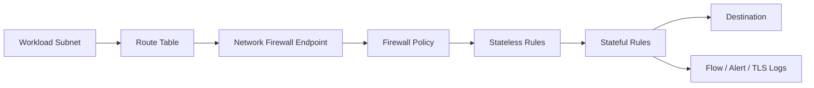
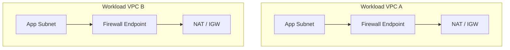
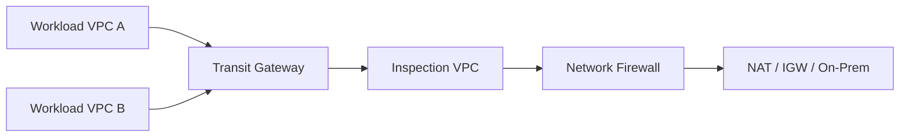
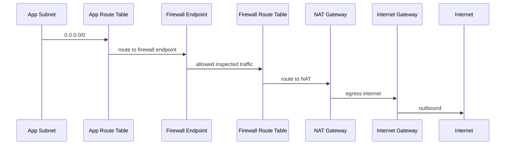
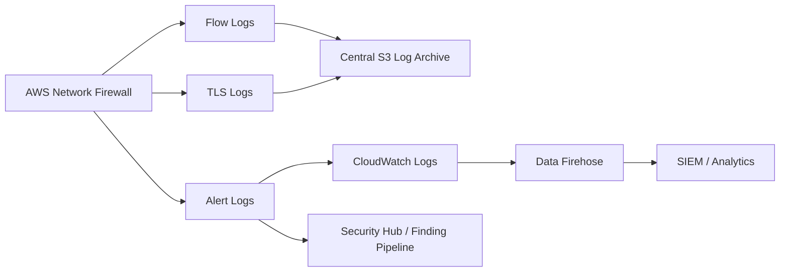
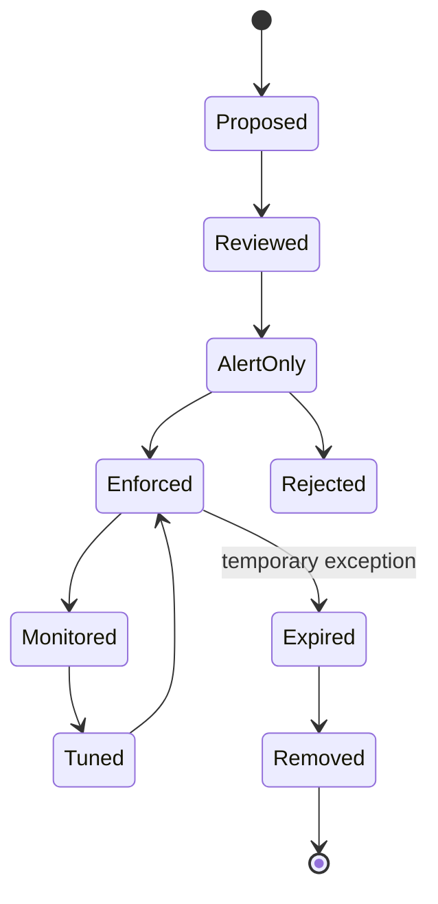
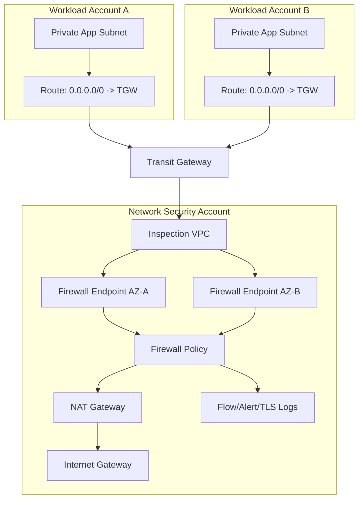

# Part 053 — Network Firewall and Segmentation

Di AWS, segmentation bukan hanya soal membuat banyak subnet.

Segmentation adalah keputusan arsitektural tentang **traffic mana yang boleh mengalir, lewat jalur mana, diperiksa oleh kontrol apa, dicatat di mana, dan dihentikan bagaimana ketika melanggar policy**.

Security group dan NACL memberi kontrol dasar. WAF memberi kontrol layer 7 untuk HTTP(S) edge. Route table menentukan jalur. VPC endpoint policy membatasi akses ke AWS services. Tetapi ketika organisasi butuh inspection lintas account, lintas VPC, lintas environment, dan lintas egress path, kita membutuhkan control point yang lebih eksplisit.

Di sinilah AWS Network Firewall masuk.

AWS Network Firewall bukan pengganti security group. Ia adalah **managed traffic inspection layer** yang bisa dipasang di jalur routing untuk memeriksa traffic menggunakan stateless rules, stateful rules, domain lists, Suricata-compatible rules, managed rule groups, TLS inspection, dan logging.

Part ini membahas Network Firewall sebagai komponen segmentation dan inspection architecture, bukan sekadar fitur firewall.

---

## 1. Mental Model: Firewall Bukan Boundary, Firewall Adalah Checkpoint

Salah satu kesalahan desain paling mahal adalah menganggap firewall sebagai boundary absolut.

Boundary sebenarnya terdiri dari beberapa lapis:

```txt
identity boundary
+ resource boundary
+ network path boundary
+ routing boundary
+ inspection boundary
+ logging boundary
+ remediation boundary
```

Network Firewall hanya satu bagian dari boundary itu.

Firewall bisa memeriksa traffic hanya jika traffic benar-benar melewatinya. Jika route table salah, jika ada alternate path, jika endpoint policy terlalu longgar, atau jika workload bisa langsung keluar lewat internet gateway lain, maka firewall tidak membantu.

Jadi invariant pertama:

```txt
Firewall policy tidak berarti apa-apa tanpa routing invariant.
```

Invariant kedua:

```txt
Segmentation tidak valid sampai bisa dibuktikan dari route table, flow logs, firewall logs, dan denied-path tests.
```

---

## 2. Apa yang AWS Network Firewall Kendalikan

AWS Network Firewall bekerja sebagai managed firewall service untuk VPC traffic inspection.

Komponen utamanya:

| Komponen | Fungsi |
|---|---|
| Firewall | Resource firewall yang ditempatkan di VPC tertentu. |
| Firewall endpoint | Endpoint per Availability Zone yang menjadi traffic hop untuk inspection. |
| Firewall policy | Kontrak perilaku firewall: rule group, default action, rule ordering, TLS inspection config. |
| Stateless rule group | Rule packet-level tanpa konteks flow. |
| Stateful rule group | Rule flow-aware, dapat memakai Suricata-compatible rules. |
| Managed rule group | Rule group yang dikelola AWS untuk coverage tertentu. |
| TLS inspection configuration | Konfigurasi decrypt-inspect-reencrypt untuk traffic TLS tertentu. |
| Logging configuration | Flow log, alert log, TLS log ke CloudWatch Logs, S3, atau Firehose. |

Model sederhananya:



Hal penting: firewall policy bukan route. Firewall policy menentukan apa yang terjadi jika traffic sampai ke firewall. Route table menentukan apakah traffic sampai ke firewall.

---

## 3. Stateless vs Stateful: Jangan Salah Pilih Mesin

Network Firewall punya dua engine evaluasi utama.

### 3.1 Stateless Rules

Stateless engine mengevaluasi packet secara individual.

Ia tidak peduli:

- apakah packet bagian dari connection yang sudah established;
- apakah arah traffic request atau response;
- apakah sebelumnya ada packet yang sudah diizinkan;
- konteks application flow.

Gunakan stateless rules untuk keputusan sederhana dan cepat:

- drop traffic dari CIDR tertentu;
- pass traffic tertentu ke stateful engine;
- alert/drop protocol atau port tertentu;
- coarse filtering sebelum stateful inspection.

Kelemahan stateless rule:

```txt
Stateless rule mudah salah jika dipakai untuk keputusan yang butuh konteks koneksi.
```

### 3.2 Stateful Rules

Stateful engine mengevaluasi packet dalam konteks traffic flow.

Ia cocok untuk:

- domain filtering;
- IDS/IPS rule;
- Suricata-compatible detection;
- application-aware inspection;
- alerting atas pattern tertentu;
- allow/drop berdasarkan flow context.

Namun stateful inspection punya konsekuensi:

- routing harus simetris;
- rule ordering harus jelas;
- existing flow bisa sudah masuk state table;
- perubahan rule tidak selalu langsung memengaruhi flow aktif;
- latency dan throughput harus dimonitor;
- TLS inspection menambah kompleksitas certificate dan client trust.

### 3.3 Decision Heuristic

```txt
Jika keputusan bisa dibuat dari satu packet → stateless mungkin cukup.
Jika keputusan butuh konteks koneksi/application → stateful.
Jika traffic encrypted dan konten perlu diperiksa → TLS inspection atau telemetry lain.
Jika traffic HTTP(S) edge → pertimbangkan WAF dulu.
```

---

## 4. Firewall Policy sebagai Kontrak Inspection

Firewall policy adalah kontrak yang menjawab:

```txt
Traffic apa yang diperiksa?
Rule group apa yang berlaku?
Apa default action jika tidak match?
Apakah rule dievaluasi dengan action order atau strict order?
Apakah TLS inspection aktif?
Log apa yang dihasilkan?
```

Policy yang buruk biasanya punya ciri:

- default allow tanpa observability;
- rule order tidak dipahami;
- alert-only selamanya tanpa enforcement roadmap;
- rule dibuat manual di console;
- tidak ada owner per rule group;
- tidak ada expiry untuk temporary allow;
- tidak ada test traffic;
- tidak ada rollback plan;
- tidak ada dashboard false positive;
- tidak ada evidence bahwa traffic benar-benar melewati firewall.

Policy yang baik punya struktur:

```txt
baseline deny/allow philosophy
+ default action eksplisit
+ managed rule group
+ custom high-confidence deny
+ custom alert-only candidate rules
+ domain allowlist/blocklist
+ exception registry
+ logging mandatory
+ staged rollout
+ test suite
```

---

## 5. Rule Ordering: Sumber Banyak Kejutan

Stateful rule bisa dievaluasi dengan pendekatan default action order atau strict rule order, tergantung konfigurasi policy.

Kesalahan umum:

```txt
Engineer menulis rule seolah-olah dievaluasi top-to-bottom, padahal engine memakai action order.
```

Akibatnya:

- pass rule bisa menang sebelum drop rule yang dianggap lebih spesifik;
- alert rule bisa tidak pernah berguna;
- rule baru tidak memberi efek sesuai ekspektasi;
- debugging menjadi debat, bukan analisis deterministic.

Prinsip praktis:

1. Untuk policy yang harus mudah diaudit, pilih rule ordering yang bisa dijelaskan ke reviewer.
2. Jangan mencampur terlalu banyak gaya rule dalam satu policy tanpa konvensi.
3. Setiap rule group harus punya comment, owner, tujuan, dan expiry jika exception.
4. Uji rule dengan traffic nyata di environment staging/inspection sandbox.
5. Simpan expected decision table di repository.

Contoh decision table:

| Source | Destination | Protocol | Expected | Evidence |
|---|---|---:|---|---|
| prod-app | internal-api | TCP/443 | allow | flow log + app health |
| prod-app | internet:any | TCP/22 | drop | firewall alert |
| dev-vpc | prod-db | TCP/5432 | drop | no route / firewall drop |
| prod-batch | approved-saas | TCP/443 | allow | firewall flow log |
| prod-batch | unknown-saas | TCP/443 | alert/drop sesuai phase | alert log |

---

## 6. Deployment Model

Network Firewall placement adalah keputusan arsitektur, bukan preferensi console.

Ada tiga model besar.

### 6.1 Distributed Firewall

Firewall ditempatkan di setiap VPC workload.



Kelebihan:

- blast radius kecil;
- routing lebih lokal;
- cocok untuk workload dengan kebutuhan khusus;
- tidak semua traffic harus melewati centralized inspection VPC.

Kelemahan:

- banyak firewall yang harus dikelola;
- policy drift lebih mudah terjadi;
- biaya dan log volume tersebar;
- sulit memastikan consistency tanpa Firewall Manager/IaC.

Cocok untuk:

- VPC critical yang butuh inspection dedicated;
- workload regulated;
- account yang tidak boleh bergantung pada shared network account;
- internet ingress distributed.

### 6.2 Centralized Inspection VPC

Firewall ditempatkan di inspection VPC. Workload VPC mengirim traffic melalui Transit Gateway atau Cloud WAN.



Kelebihan:

- policy lebih terpusat;
- logging lebih konsisten;
- operasi lebih sederhana untuk platform/security team;
- cocok untuk egress inspection dan east-west inspection skala organisasi.

Kelemahan:

- routing lebih kompleks;
- asymmetry risk lebih tinggi;
- inspection VPC menjadi dependency besar;
- perlu desain HA per AZ;
- latency dan cost path perlu dihitung;
- failure bisa berdampak banyak workload jika tidak ada fallback design.

Cocok untuk:

- organisasi multi-account besar;
- centralized egress;
- shared inspection service;
- enforceable network control plane.

### 6.3 Combined Model

Gabungan centralized dan distributed.

Contoh:

```txt
Centralized inspection untuk east-west dan egress umum.
Distributed firewall untuk internet ingress workload tertentu.
```

Ini sering paling realistis di enterprise karena tidak semua traffic punya karakteristik sama.

---

## 7. Segmentation Pattern

Segmentation bukan cuma “prod beda VPC”. Kita butuh jenis segmentation yang berbeda untuk risiko berbeda.

### 7.1 Environment Segmentation

```txt
prod ≠ staging ≠ dev ≠ sandbox
```

Tujuan:

- membatasi blast radius;
- menghindari lateral movement dari dev ke prod;
- membatasi data regulated;
- mengisolasi debugging tools;
- memastikan emergency exception tidak menyebar.

Network Firewall bisa dipakai untuk memastikan traffic antar environment hanya melewati approved chokepoint.

### 7.2 Tier Segmentation

```txt
edge → app → data → management
```

Traffic flow harus eksplisit.

Contoh invariant:

```txt
Edge tier tidak boleh langsung mengakses database tier.
Management subnet tidak boleh menerima inbound dari app subnet kecuali approved automation path.
Data tier tidak boleh punya default internet egress.
```

### 7.3 East-West Segmentation

East-west traffic adalah traffic antar VPC, antar account, atau antar segment internal.

Risikonya tinggi karena banyak organisasi terlalu fokus pada internet ingress dan lupa internal movement.

Use case:

- workload dev mencoba prod API;
- compromised app host scanning internal CIDR;
- lateral movement ke shared service;
- unintended peering path;
- data pipeline mengirim data ke account salah.

### 7.4 North-South Segmentation

North-south traffic adalah traffic ke/dari internet atau on-prem.

Use case:

- centralized egress allowlist;
- inbound inspection sebelum ALB/NLB;
- outbound malware callback detection;
- SaaS domain control;
- TLS inspection untuk regulated outbound.

### 7.5 Management Plane Segmentation

Management access seperti SSH/RDP/SSM/admin API tidak boleh bercampur dengan application traffic.

Invariant:

```txt
Tidak ada inbound administrative port dari internet.
Tidak ada direct admin access antar environment.
Semua administrative session harus auditable melalui Session Manager atau approved bastionless access pattern.
```

Network Firewall bisa mendeteksi atau drop port administratif, tetapi identity-based controls tetap utama.

---

## 8. Routing Invariant

Firewall inspection gagal jika routing tidak deterministik.

Untuk setiap protected route, harus ada jawaban jelas:

```txt
Dari subnet mana traffic berasal?
Route table mana yang dipakai?
Next hop apa?
Firewall endpoint AZ mana?
Setelah firewall, next hop ke mana?
Response traffic kembali lewat jalur yang sama atau tidak?
```

Mermaid sederhana untuk centralized egress:



Routing checks yang wajib:

| Check | Mengapa Penting |
|---|---|
| Subnet route table mengarah ke firewall endpoint | Tanpa ini traffic bypass. |
| Firewall subnet route table mengarah ke NAT/TGW/IGW sesuai flow | Jika salah, traffic blackhole. |
| Return path simetris | Stateful inspection butuh flow consistency. |
| Per-AZ endpoint dipakai lokal | Mengurangi cross-AZ traffic dan failure blast. |
| No alternate default route | Mencegah bypass melalui NAT/IGW lain. |
| TGW route table eksplisit | Menghindari east-west path tidak diperiksa. |

---

## 9. TLS Inspection: Visibility dengan Biaya Kompleksitas

Mayoritas traffic modern encrypted. Tanpa TLS inspection, firewall biasanya hanya melihat:

- source IP;
- destination IP;
- port;
- protocol metadata;
- sebagian domain/SNI dalam kondisi tertentu;
- flow behavior.

Dengan TLS inspection, Network Firewall dapat decrypt, inspect, lalu re-encrypt traffic sesuai konfigurasi.

Namun ini bukan fitur yang boleh diaktifkan sembarangan.

Biaya kompleksitasnya:

- certificate trust distribution;
- CA governance;
- application compatibility;
- privacy/legal review;
- exception untuk certificate pinning;
- performance and latency monitoring;
- key/certificate rotation;
- audit atas siapa bisa mengubah TLS inspection config;
- logging sensitive metadata;
- incident handling jika CA compromised.

Decision table:

| Kondisi | TLS Inspection? |
|---|---|
| Outbound regulated workload ke internet umum | Pertimbangkan kuat. |
| Internal service mesh dengan mTLS | Hati-hati, bisa konflik dengan identity model. |
| SaaS dengan certificate pinning | Biasanya perlu exception. |
| Traffic hanya butuh domain allowlist | Mungkin cukup domain/SNI/DNS control. |
| Privacy-sensitive user traffic | Butuh legal/privacy review. |
| High-throughput low-latency workload | Uji performa dulu. |

Invariant:

```txt
TLS inspection adalah security capability sekaligus cryptographic interception capability. Treat it like privileged infrastructure.
```

---

## 10. Domain Filtering dan DNS Reality

Domain-based controls sering terlihat sederhana tetapi penuh edge case.

Masalah umum:

- domain resolved ke IP dinamis;
- CDN shared IP;
- wildcard domain terlalu lebar;
- aplikasi memakai hardcoded IP;
- DNS over HTTPS;
- SNI tidak selalu tersedia/terpercaya;
- TLS 1.3/ECH bisa mengurangi visibility di masa depan;
- SaaS provider memakai banyak domain pendukung;
- rule allowlist memblokir update endpoint yang tidak terdokumentasi.

Jangan mengandalkan satu kontrol.

Untuk egress SaaS control, kombinasikan:

```txt
Route table chokepoint
+ Network Firewall domain/rule inspection
+ Route 53 Resolver DNS Firewall
+ VPC endpoint policy untuk AWS services
+ CloudTrail for API egress
+ Flow logs/firewall logs
+ exception registry
```

---

## 11. Logging Network Firewall

Firewall tanpa log adalah blind chokepoint.

Network Firewall mendukung beberapa log penting:

| Log | Fungsi |
|---|---|
| Flow logs | Melihat traffic flow yang melewati firewall. |
| Alert logs | Melihat rule match yang menghasilkan alert/drop/reject. |
| TLS logs | Melihat event terkait TLS inspection jika dikonfigurasi. |
| CloudTrail | Melihat perubahan resource Network Firewall API. |
| CloudWatch metrics | Melihat kesehatan dan volume. |

Minimum production posture:

```txt
flow logs enabled
+ alert logs enabled
+ CloudTrail organization trail
+ log retention defined
+ delivery failure alarm
+ dashboard traffic volume
+ top deny/alert query
+ change audit on firewall policy/rule group
```

Log architecture:



Prinsip penting:

```txt
Flow log menjawab “apa yang lewat”.
Alert log menjawab “rule apa yang melihat sesuatu”.
CloudTrail menjawab “siapa mengubah firewall”.
```

Ketiganya diperlukan untuk incident response.

---

## 12. Firewall Change Management

Firewall rule adalah production code.

Jangan ubah rule langsung di console tanpa:

- ticket/change request;
- owner;
- reason;
- blast radius analysis;
- test traffic;
- dry-run atau alert-only phase;
- rollback plan;
- expiry untuk exception;
- post-change verification.

Lifecycle yang sehat:



Rule metadata minimal:

```yaml
id: nfw-egress-deny-admin-ports
owner: security-platform
intent: deny administrative protocols to internet
scope: prod workload egress
mode: enforce
created: 2026-07-06
expires: null
evidence:
  - firewall-alert-query
  - flow-log-query
rollback:
  - revert terraform commit
  - disable rule group association
```

---

## 13. Segmentation Testing

Segmentation yang tidak dites adalah asumsi.

Test harus mencakup allowed path dan denied path.

Contoh matrix:

| Test | Expected | Evidence |
|---|---|---|
| App subnet → approved API 443 | allow | application success + flow log |
| App subnet → internet 22 | deny | firewall alert/drop |
| Dev VPC → prod DB 5432 | deny | no route/firewall drop |
| Prod VPC → S3 via public internet | deny | VPC endpoint required |
| Prod VPC → S3 via endpoint | allow | CloudTrail sourceVpce/context |
| Unknown domain egress | alert/drop | alert log |

Testing tool tidak harus rumit. Yang penting repeatable.

Buat `segmentation-test-runner` sederhana yang:

- menjalankan connectivity check dari test instance/container;
- mencatat source subnet/security group/role;
- menyimpan expected decision;
- mengambil evidence dari CloudWatch Logs/S3/Athena;
- gagal jika denied path menjadi allowed.

---

## 14. Failure Mode

Network Firewall menambah kontrol, tetapi juga menambah dependency.

Failure mode yang harus dimodelkan:

| Failure | Dampak | Mitigasi |
|---|---|---|
| Route table bypass | Traffic tidak diperiksa | Config rule + route audit + IaC guardrail |
| Asymmetric routing | Stateful inspection gagal | TGW route design + per-AZ path verification |
| Overbroad allow rule | Exfil path terbuka | Review + rule priority + automated lint |
| False positive drop | Production outage | Alert-only phase + emergency rollback |
| Log delivery failure | Blind spot | Delivery alarm + S3/CW monitoring |
| Rule update tidak memengaruhi existing flow | Policy terlihat tidak bekerja | Flow reset strategy untuk critical change |
| TLS inspection CA issue | App TLS failure | Certificate rollout plan + canary |
| Inspection VPC failure | Banyak workload terdampak | HA per AZ + dependency mapping |
| Cost explosion | Operasional tidak sustainable | volume dashboard + sampling/retention design |

---

## 15. Anti-Patterns

### Anti-Pattern 1: “Semua Traffic Lewat Firewall” Tanpa Bukti

Klaim ini harus dibuktikan dengan route table, flow log, dan denied-path tests.

### Anti-Pattern 2: Central Firewall sebagai Single Giant Policy

Satu policy besar untuk semua workload membuat change review lambat dan risiko blast radius tinggi.

Lebih baik gunakan policy modular:

```txt
baseline organization policy
+ environment overlay
+ workload-specific rule group
+ temporary exception group
```

### Anti-Pattern 3: Alert-Only Selamanya

Alert-only berguna untuk learning phase, bukan end state untuk high-confidence risk.

### Anti-Pattern 4: Firewall Menggantikan Identity Control

Firewall tidak tahu business intent sebaik IAM, SCP, RCP, KMS policy, dan endpoint policy.

### Anti-Pattern 5: TLS Inspection Tanpa Governance

TLS inspection tanpa certificate governance adalah incident yang menunggu waktu.

---

## 16. Reference Architecture: Centralized Egress Inspection



Operating invariant:

```txt
No workload VPC has direct internet egress.
All egress from protected workload accounts must route through inspection VPC.
All firewall policy changes are code-reviewed.
All denied/alerted traffic is logged centrally.
```

---

## 17. Production Checklist

Sebelum Network Firewall dianggap production-ready:

- [ ] Firewall placement dipilih dengan alasan eksplisit: distributed, centralized, atau combined.
- [ ] Route table untuk protected subnets sudah diverifikasi.
- [ ] Return path simetris untuk traffic stateful.
- [ ] Per-AZ firewall endpoint digunakan dengan benar.
- [ ] Firewall policy disimpan sebagai code.
- [ ] Rule group punya owner, intent, dan lifecycle.
- [ ] Default action dipahami dan terdokumentasi.
- [ ] Logging flow/alert/TLS dikonfigurasi sesuai kebutuhan.
- [ ] CloudTrail menangkap perubahan firewall resources.
- [ ] Dashboard traffic volume, top alert, top drop, delivery failure tersedia.
- [ ] Alert-only phase dilakukan sebelum enforce untuk rule berisiko.
- [ ] Denied-path test tersedia.
- [ ] Rollback runbook tersedia.
- [ ] Exception registry tersedia.
- [ ] Firewall cost dan throughput dimonitor.

---

## 18. Ringkasan

Network Firewall berguna ketika organisasi membutuhkan traffic inspection yang lebih kuat daripada security group/NACL, terutama untuk egress, east-west, dan centralized inspection.

Namun kekuatannya hanya valid jika routing, logging, policy lifecycle, dan testing juga matang.

Mental model yang harus dibawa:

```txt
Network Firewall bukan magic wall.
Ia adalah programmable inspection checkpoint yang hanya efektif jika traffic dipaksa melewatinya, rule-nya benar, log-nya tersedia, dan perubahannya dikelola seperti production code.
```

Setelah ini, kita masuk ke private access dan resource perimeter: bagaimana membuat workload mengakses AWS services dan resource internal melalui jalur privat dan policy boundary yang lebih sulit dibypass.

---

## Referensi Resmi

- AWS Network Firewall Developer Guide — https://docs.aws.amazon.com/network-firewall/latest/developerguide/what-is-aws-network-firewall.html
- AWS Network Firewall Rule Groups — https://docs.aws.amazon.com/network-firewall/latest/developerguide/rule-groups.html
- AWS Network Firewall Stateless and Stateful Rules Engines — https://docs.aws.amazon.com/network-firewall/latest/developerguide/firewall-rules-engines.html
- AWS Network Firewall Firewall Policies — https://docs.aws.amazon.com/network-firewall/latest/developerguide/firewall-policies.html
- AWS Network Firewall Logging — https://docs.aws.amazon.com/network-firewall/latest/developerguide/firewall-logging.html
- AWS Network Firewall TLS Inspection — https://docs.aws.amazon.com/network-firewall/latest/developerguide/tls-inspection-configurations.html
- AWS Network Firewall Best Practices — https://aws.github.io/aws-security-services-best-practices/guides/network-firewall/
- AWS Prescriptive Guidance: Centralized Network Firewall — https://docs.aws.amazon.com/prescriptive-guidance/latest/robust-network-design-control-tower/firewall.html
