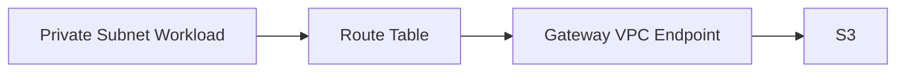
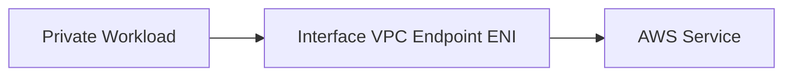
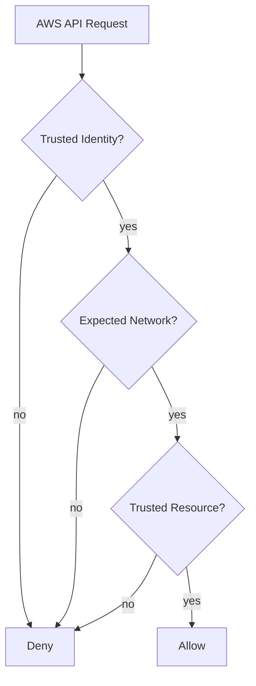
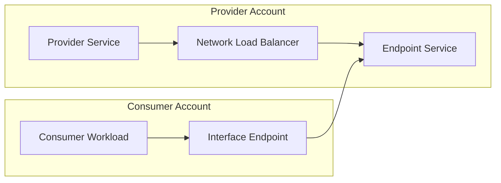
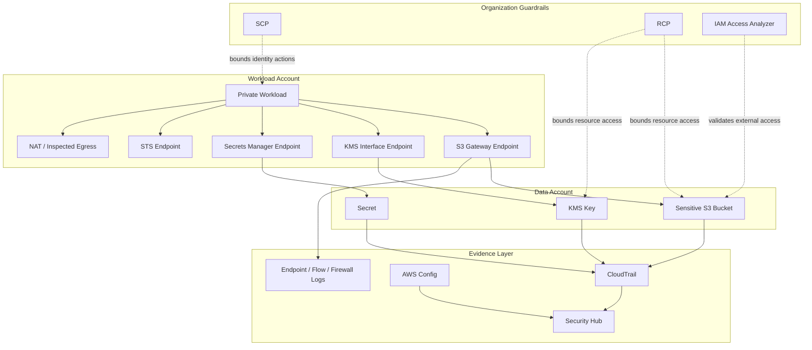

# Part 054 — Private Access and Resource Perimeter

Banyak organisasi menganggap “private subnet” berarti aman.

Itu tidak cukup.

Private subnet hanya mengatakan resource tidak punya route langsung dari internet ke ENI-nya. Ia tidak otomatis membatasi:

- workload mengakses AWS service publik;
- workload mengirim data ke bucket/account luar;
- principal luar mengakses resource internal via resource policy;
- workload memakai VPC endpoint yang tidak kita kontrol;
- data keluar melalui service-to-service call;
- identity kita digunakan dari network yang tidak diharapkan.

Private access dan resource perimeter menjawab masalah yang lebih dalam:

```txt
Bagaimana memastikan trusted identities hanya mengakses trusted resources melalui expected networks?
```

Part ini membahas VPC endpoints, AWS PrivateLink, endpoint policies, dan data perimeter guardrails sebagai sistem kontrol. Fokusnya bukan connectivity, tetapi **resource access boundary**.

---

## 1. Mental Model: Internet Path vs AWS API Path

Di AWS, banyak aksi penting bukan traffic ke server kita. Banyak aksi adalah request ke AWS API.

Contoh:

```txt
s3:PutObject
kms:Decrypt
secretsmanager:GetSecretValue
sts:AssumeRole
dynamodb:PutItem
sqs:SendMessage
```

Aksi-aksi ini bisa terjadi dari:

- internet public endpoint;
- NAT gateway;
- VPC endpoint;
- AWS service acting on behalf of principal;
- assumed role dari environment lain;
- CI/CD runner;
- compromised credential di laptop;
- external SaaS integration.

Jadi pertanyaan security-nya bukan hanya:

```txt
Apakah instance punya public IP?
```

Pertanyaan yang lebih tepat:

```txt
Dari network mana AWS API request boleh dibuat?
Principal mana yang boleh membuat request?
Resource mana yang boleh menjadi target?
Apakah resource target berada di organisasi kita?
Apakah request melewati endpoint yang kita kontrol?
Apakah service-to-service exception aman?
```

---

## 2. Private Access Bukan Sama dengan Resource Perimeter

Private access dan resource perimeter sering dicampuradukkan.

| Konsep | Pertanyaan | Contoh Kontrol |
|---|---|---|
| Private access | Jalur network privat apa yang dipakai? | Interface endpoint, gateway endpoint, PrivateLink. |
| Endpoint access control | Siapa boleh memakai endpoint untuk service tertentu? | VPC endpoint policy. |
| Identity perimeter | Identity mana yang dipercaya? | `aws:PrincipalOrgID`, SCP/RCP, resource policy. |
| Resource perimeter | Resource target mana yang dipercaya? | `aws:ResourceOrgID`, endpoint policy, SCP. |
| Network perimeter | Network asal mana yang dipercaya? | `aws:SourceVpc`, `aws:SourceVpce`, `aws:VpceOrgID`. |
| Service exception | Bagaimana AWS service bertindak atas nama principal? | `aws:ViaAWSService`, service principal conditions. |

PrivateLink memberi jalur privat.

Perimeter policy memberi batas authorization.

Keduanya harus digabung.

---

## 3. VPC Endpoint Pattern

Ada dua jenis VPC endpoint yang paling sering muncul dalam desain security.

### 3.1 Gateway Endpoint

Gateway endpoint umumnya digunakan untuk S3 dan DynamoDB.

Karakteristik:

- dipasang ke route table;
- tidak menggunakan ENI endpoint di subnet;
- mendukung endpoint policy;
- umum dipakai untuk mencegah S3/DynamoDB traffic keluar lewat NAT/public internet.

Pattern:



Invariant:

```txt
Workload private subnet yang mengakses S3/DynamoDB harus memakai gateway endpoint atau approved private path, bukan NAT internet path.
```

### 3.2 Interface Endpoint

Interface endpoint memakai AWS PrivateLink dan membuat ENI di subnet.

Cocok untuk banyak AWS services seperti Secrets Manager, KMS, STS, ECR, CloudWatch Logs, SSM, dan lain-lain sesuai dukungan service.

Pattern:



Security control yang terkait:

- endpoint security group;
- endpoint policy;
- private DNS;
- route/DNS design;
- CloudTrail context;
- IAM condition keys terkait network source;
- allowed endpoint creation policy.

---

## 4. Endpoint Policy sebagai Gate, Bukan IAM Pengganti

Endpoint policy adalah resource-based policy yang dipasang pada VPC endpoint.

Ia mengontrol principal dan action apa yang boleh memakai endpoint untuk mengakses service.

Namun endpoint policy tidak menggantikan IAM policy.

Evaluasi permission efektif tetap melibatkan kombinasi:

```txt
identity policy
+ resource policy
+ SCP/RCP
+ permission boundary/session policy jika ada
+ endpoint policy jika request lewat endpoint
+ service-specific authorization
```

Endpoint policy sebaiknya menjawab:

```txt
Endpoint ini boleh dipakai untuk action apa?
Oleh principal mana?
Ke resource mana?
Untuk environment apa?
Apakah target resource harus berada di organisasi kita?
```

Contoh pola untuk endpoint S3:

```json
{
  "Version": "2012-10-17",
  "Statement": [
    {
      "Sid": "AllowOnlyOrgBuckets",
      "Effect": "Allow",
      "Principal": "*",
      "Action": [
        "s3:GetObject",
        "s3:PutObject",
        "s3:ListBucket"
      ],
      "Resource": "*",
      "Condition": {
        "StringEquals": {
          "aws:ResourceOrgID": "o-exampleorgid"
        }
      }
    }
  ]
}
```

Catatan:

- Policy di atas adalah pola konseptual, bukan copy-paste production.
- Validasi dukungan condition key per service/action tetap wajib.
- Banyak service punya nuansa authorization sendiri.
- Selalu uji dengan IAM Access Analyzer policy validation dan CloudTrail denied events.

---

## 5. Data Perimeter: Tiga Boundary yang Harus Selaras

AWS data perimeter biasanya dipikirkan sebagai tiga kontrol besar:

```txt
trusted identities
+ trusted resources
+ expected networks
```

Diagram:



### 5.1 Identity Perimeter

Tujuan:

```txt
Hanya identity dari organisasi/account yang dipercaya boleh mengakses data.
```

Condition keys yang sering relevan:

- `aws:PrincipalOrgID`
- `aws:PrincipalOrgPaths`
- `aws:PrincipalAccount`
- `aws:PrincipalArn`

Use case:

- S3 bucket hanya boleh diakses principal dari AWS Organization kita;
- KMS key tidak boleh dipakai principal luar;
- Secrets Manager secret tidak boleh dibaca dari role eksternal;
- SQS queue tidak boleh menerima message dari account luar kecuali approved partner.

### 5.2 Resource Perimeter

Tujuan:

```txt
Identity kita tidak boleh mengirim data ke resource yang tidak dipercaya.
```

Condition keys yang sering relevan:

- `aws:ResourceOrgID`
- `aws:ResourceOrgPaths`
- `aws:ResourceAccount`

Use case:

- workload prod tidak boleh `s3:PutObject` ke bucket di luar organisasi;
- role internal tidak boleh encrypt data dengan KMS key milik account luar;
- pipeline tidak boleh publish ke SQS/SNS eksternal kecuali approved integration.

### 5.3 Network Perimeter

Tujuan:

```txt
Request ke resource sensitif hanya boleh datang dari network yang diharapkan.
```

Condition keys yang sering relevan:

- `aws:SourceIp`
- `aws:SourceVpc`
- `aws:SourceVpce`
- `aws:VpceAccount`
- `aws:VpceOrgID`
- `aws:VpceOrgPaths`
- `aws:ViaAWSService`

Key baru seperti `aws:VpceAccount`, `aws:VpceOrgID`, dan `aws:VpceOrgPaths` membantu membuat network perimeter yang lebih scalable karena policy tidak harus memuat daftar endpoint ID satu per satu.

---

## 6. Resource Perimeter untuk Mencegah Data Exfiltration

Contoh risiko:

```txt
Role internal punya s3:PutObject.
Attacker memakai credential role itu untuk menulis data ke bucket milik attacker.
```

IAM policy role mungkin terlihat “normal” karena action `s3:PutObject` memang dibutuhkan.

Masalahnya adalah resource target tidak dibatasi.

Resource perimeter menambahkan invariant:

```txt
Internal identity boleh menulis hanya ke resource yang berada dalam organisasi kita, kecuali resource eksternal yang terdaftar sebagai approved integration.
```

Pola kontrol:

```json
{
  "Sid": "DenyWriteToResourcesOutsideOrg",
  "Effect": "Deny",
  "Action": [
    "s3:PutObject"
  ],
  "Resource": "*",
  "Condition": {
    "StringNotEqualsIfExists": {
      "aws:ResourceOrgID": "o-exampleorgid"
    },
    "BoolIfExists": {
      "aws:ViaAWSService": "false"
    }
  }
}
```

Ini bisa ditempatkan sebagai SCP, identity policy, endpoint policy, atau kombinasi, tergantung use case dan dukungan service.

Caveat penting:

- Tidak semua AWS actions/services mendukung semua condition key.
- Beberapa service-to-service call membutuhkan exception `aws:ViaAWSService` atau service principal condition.
- Third-party integrations perlu allowlist formal.
- Deny guardrail harus diuji dengan CloudTrail impact analysis sebelum enforce.

---

## 7. Network Perimeter dengan VPC Endpoint Context

Network perimeter menjawab:

```txt
Apakah request berasal dari network yang kita kontrol?
```

Sebelum condition key organisasi untuk endpoint tersedia, banyak policy harus memakai daftar endpoint ID:

```json
"aws:SourceVpce": [
  "vpce-aaa",
  "vpce-bbb",
  "vpce-ccc"
]
```

Masalahnya:

- endpoint berubah saat account baru dibuat;
- policy sering tertinggal;
- endpoint di OU tertentu sulit dikelola;
- endpoint ID tidak menyampaikan ownership semantics.

Dengan `aws:VpceOrgID`, `aws:VpceAccount`, dan `aws:VpceOrgPaths`, policy bisa mengekspresikan ownership endpoint secara lebih scalable.

Contoh intent:

```txt
Bucket sensitif hanya boleh diakses melalui VPC endpoint yang dimiliki account dalam AWS Organization kita.
```

Pola konseptual:

```json
{
  "Sid": "DenyAccessUnlessFromOrgOwnedVpce",
  "Effect": "Deny",
  "Principal": "*",
  "Action": "s3:*",
  "Resource": [
    "arn:aws:s3:::example-sensitive-bucket",
    "arn:aws:s3:::example-sensitive-bucket/*"
  ],
  "Condition": {
    "StringNotEqualsIfExists": {
      "aws:VpceOrgID": "o-exampleorgid"
    },
    "BoolIfExists": {
      "aws:ViaAWSService": "false"
    }
  }
}
```

Sekali lagi: ini template pemikiran. Production policy harus divalidasi terhadap service/action support dan kebutuhan AWS service-to-service access.

---

## 8. PrivateLink untuk Internal Service Exposure

AWS PrivateLink memungkinkan consumer di VPC lain mengakses service provider secara privat, seperti service itu ada di VPC consumer.

Use case:

- platform team expose internal API ke banyak workload account;
- SaaS private connectivity;
- shared security service;
- internal control plane;
- regulated workload tanpa public ingress;
- cross-account service consumption tanpa VPC peering full mesh.

Pattern:



PrivateLink mengurangi blast radius connectivity karena consumer tidak mendapatkan route-level access ke seluruh VPC provider.

Namun kontrol tetap perlu:

- endpoint service acceptance policy;
- allowed principals;
- endpoint policy di sisi consumer jika service mendukung;
- NLB target security;
- authentication di application layer;
- logging;
- versioning API;
- consumer registry;
- revocation process.

Jangan anggap PrivateLink sebagai pengganti authentication.

```txt
PrivateLink membatasi jalur network.
Ia tidak otomatis membuktikan user/application intent.
```

---

## 9. AWS Service Access via Private Endpoints

Workload produksi biasanya butuh mengakses banyak AWS services:

- STS untuk assume role;
- KMS untuk decrypt;
- Secrets Manager untuk secret retrieval;
- ECR untuk image pull;
- CloudWatch Logs untuk log shipping;
- SSM untuk management;
- S3 untuk artifacts/data;
- DynamoDB/SQS/SNS/EventBridge untuk application flow.

Jika semua traffic ini lewat NAT/public endpoint, maka:

- egress path lebih lebar;
- cost NAT bisa besar;
- network perimeter lemah;
- CloudTrail source context kurang kuat;
- endpoint policy tidak bisa dipakai;
- private subnet “private” secara inbound tetapi outbound tetap longgar.

Production pattern:

```txt
Private workloads use VPC endpoints for required AWS services.
Internet egress is explicit, inspected, and minimized.
AWS API access is constrained by endpoint policy and IAM/data perimeter guardrails.
```

---

## 10. Endpoint Creation Governance

Kalau semua engineer bisa membuat endpoint sembarangan, maka network perimeter bisa bocor.

Misalnya:

```txt
Bucket policy mengizinkan access dari SourceVpce tertentu.
Engineer membuat endpoint baru di account dev dan policy belum mengenal endpoint itu.
```

Atau sebaliknya:

```txt
Resource policy terlalu percaya pada OrgID, tetapi tidak membatasi endpoint/account/OU yang boleh digunakan untuk data processing.
```

Governance yang dibutuhkan:

- siapa boleh membuat endpoint;
- service endpoint apa yang boleh dibuat;
- subnet/security group apa yang boleh dipakai;
- private DNS boleh/tidak;
- endpoint policy minimum;
- tag mandatory;
- Config detection untuk endpoint tanpa policy;
- approved endpoint registry;
- per-OU endpoint baseline;
- cleanup endpoint tidak dipakai.

SCP pattern:

```txt
Deny ec2:CreateVpcEndpoint unless request includes approved tags and caller is platform role.
```

Config pattern:

```txt
Detect VPC endpoint with default full-access policy.
Detect endpoint without mandatory owner/environment/data-classification tags.
Detect endpoint in unapproved subnet.
```

---

## 11. Service-to-Service Exception

Data perimeter yang terlalu sederhana sering memblokir AWS service yang sah.

Contoh:

- CloudTrail menulis ke S3 log archive;
- AWS Backup menulis ke vault;
- Lambda menarik image dari ECR;
- S3 menggunakan KMS key untuk encrypt object;
- EventBridge mengirim event ke target;
- CloudWatch Logs mengirim data ke subscription destination;
- Macie/GuardDuty/Inspector mengakses data/metadata untuk security service.

Karena itu, policy perimeter perlu memahami service-to-service path.

Condition seperti `aws:ViaAWSService` dapat membantu membedakan request yang dilakukan AWS service atas nama principal dalam Forward Access Session, tetapi tidak semua kasus sama.

Prinsip:

```txt
Jangan membuat perimeter policy tanpa inventory service-to-service dependencies.
```

Buat tabel:

| Source Service | Target Resource | Action | Required Condition/Exception | Evidence |
|---|---|---|---|---|
| CloudTrail | S3 log archive | PutObject | service principal + org trail constraint | CloudTrail delivery |
| AWS Backup | Backup vault/KMS | backup/copy/decrypt | service role + KMS condition | backup job |
| Lambda | ECR/KMS/Logs | image pull/log write | execution role + endpoint path | function invoke |
| S3 | KMS | Encrypt/Decrypt | `kms:ViaService` | KMS CloudTrail |
| Security Hub | EventBridge | finding event | service integration | event bus archive |

---

## 12. Implementation Phases

Jangan langsung enforce perimeter ke seluruh organisasi.

Gunakan fase.

### Phase 1 — Observe

Tujuan:

- aktifkan CloudTrail org trail;
- kumpulkan S3/KMS/Secrets/SQS access patterns;
- identifikasi external resources;
- identifikasi public endpoint usage;
- cari service-to-service dependencies.

Output:

```txt
access inventory
+ external target list
+ expected network list
+ endpoint inventory
+ service exception list
```

### Phase 2 — Design Boundary

Tentukan:

- trusted organization ID;
- trusted OU paths;
- trusted processing accounts;
- approved external partners;
- expected VPC/VPC endpoint ownership;
- sensitive resource classes;
- exception process.

### Phase 3 — Deploy in Monitor Mode

Gunakan:

- IAM Access Analyzer;
- CloudTrail queries;
- Security Hub custom findings;
- Config custom rules;
- policy simulator/custom access preview jika applicable;
- EventBridge alerts untuk suspicious access.

### Phase 4 — Enforce Narrow Scope

Mulai dari:

- satu bucket sensitif;
- satu KMS key class;
- satu OU prod;
- satu endpoint baseline;
- satu application group.

### Phase 5 — Expand and Automate

Baru perluas dengan:

- SCP/RCP;
- endpoint policy baseline;
- Config remediation;
- account vending integration;
- exception expiry;
- continuous evidence.

---

## 13. CloudTrail Evidence untuk Perimeter

Perimeter policy harus bisa diaudit.

Evidence yang perlu dicari:

```txt
request source
principal org/account/arn
resource account/org jika tersedia
source IP
source VPC endpoint
called service/action
error code AccessDenied
userAgent
session context
ViaAWSService context jika tersedia
```

Query investigasi:

```sql
-- Pseudocode Athena/CloudTrail Lake style
SELECT
  eventTime,
  eventSource,
  eventName,
  userIdentity.accountId,
  userIdentity.arn,
  sourceIPAddress,
  errorCode,
  requestParameters,
  resources
FROM cloudtrail
WHERE eventSource IN ('s3.amazonaws.com', 'kms.amazonaws.com', 'secretsmanager.amazonaws.com')
  AND eventTime > current_timestamp - interval '7' day
  AND errorCode = 'AccessDenied'
ORDER BY eventTime DESC;
```

Gunakan denied events untuk membedakan:

- policy bekerja sesuai harapan;
- application dependency belum terdaftar;
- attacker probing;
- service-to-service exception belum lengkap;
- endpoint path salah.

---

## 14. Common Failure Modes

| Failure | Dampak | Mitigasi |
|---|---|---|
| Endpoint policy default full access | Endpoint menjadi jalur terlalu longgar | Baseline endpoint policy + Config rule |
| NAT tetap tersedia untuk AWS API | Workload bypass private endpoint | Route/DNS governance + egress inspection |
| Bucket policy hanya cek `SourceVpce` | Endpoint list drift | Gunakan org/account endpoint condition jika supported |
| Tidak ada service exception | AWS service sah gagal | Dependency inventory + staged rollout |
| Terlalu percaya `PrincipalOrgID` | Internal compromised identity bisa exfil | Tambah resource/network perimeter |
| Terlalu percaya network | Credential dari trusted network masih bisa abuse | Identity least privilege + session context |
| PrivateLink tanpa auth | Consumer privat bisa abuse API | Application authn/authz tetap wajib |
| Policy copy-paste lintas service | Condition key tidak supported | IAM Access Analyzer validation + service docs |
| Tidak ada denied-event monitoring | Perimeter menjadi silent breaker | CloudTrail alert + owner routing |

---

## 15. Decision Table: Private Access Control

| Problem | Primary Control | Secondary Control |
|---|---|---|
| Workload harus akses S3 tanpa internet | Gateway VPC endpoint | Endpoint policy + bucket policy |
| Workload harus akses KMS/Secrets privately | Interface endpoint | Endpoint SG + endpoint policy + IAM |
| Internal service expose lintas account | PrivateLink endpoint service | Consumer allowlist + app auth |
| Cegah write ke bucket eksternal | Resource perimeter | SCP/RCP/endpoint policy |
| Cegah access dari network tidak dikenal | Network perimeter | `aws:SourceVpce`/`aws:VpceOrgID` |
| Cegah principal eksternal baca data | Identity perimeter | Resource policy + RCP |
| Cegah endpoint liar | SCP on endpoint creation | Config detection |
| Audit perimeter deny | CloudTrail | Security Hub/custom findings |

---

## 16. Reference Architecture



Operating invariant:

```txt
Sensitive data access must use trusted identity, trusted resource, and expected network controls together.
```

---

## 17. Production Checklist

- [ ] Data classes sudah dipetakan ke perimeter requirement.
- [ ] AWS Organization ID dan OU paths terdokumentasi.
- [ ] Account/OU yang boleh memproses data sensitif jelas.
- [ ] S3/DynamoDB gateway endpoint dipakai untuk workload yang relevan.
- [ ] Interface endpoints tersedia untuk KMS, Secrets Manager, STS, CloudWatch Logs, ECR, SSM, dan service runtime lain yang dibutuhkan.
- [ ] Endpoint policies tidak dibiarkan default full access untuk sensitive path.
- [ ] Bucket/KMS/Secrets policy memakai identity/resource/network conditions jika supported.
- [ ] `aws:PrincipalOrgID`, `aws:ResourceOrgID`, `aws:SourceVpce`, `aws:VpceAccount`, `aws:VpceOrgID`, atau `aws:VpceOrgPaths` dievaluasi sesuai use case dan support service.
- [ ] Service-to-service dependencies diinventarisasi.
- [ ] `aws:ViaAWSService` dan service principal exception diuji.
- [ ] CloudTrail denied events dimonitor.
- [ ] IAM Access Analyzer digunakan untuk external access dan policy validation.
- [ ] Endpoint creation dibatasi oleh SCP/permission boundary/platform role.
- [ ] Config rules mendeteksi endpoint/policy drift.
- [ ] Exception punya owner, reason, expiry, dan review cadence.

---

## 18. Ringkasan

Private access bukan sekadar membuat workload tidak punya public IP.

Resource perimeter bukan sekadar membuat bucket private.

Keduanya harus digabung menjadi sistem:

```txt
trusted identities
+ trusted resources
+ expected networks
+ endpoint policies
+ organization guardrails
+ service-to-service exceptions
+ audit evidence
```

Mental model yang paling penting:

```txt
Jalur privat memberi kontrol atas path.
Perimeter policy memberi kontrol atas intent.
CloudTrail memberi bukti atas request.
Ketiganya harus ada agar desain bisa dipertahankan saat insiden dan audit.
```

Dengan Part 054 ini, fase infrastructure security controls selesai. Part berikutnya masuk ke observability: bagaimana membangun monitoring dan signal architecture yang tidak hanya memberi alarm, tetapi membantu operasi produksi membuat keputusan cepat.

---

## Referensi Resmi

- AWS PrivateLink Concepts — https://docs.aws.amazon.com/vpc/latest/privatelink/concepts.html
- VPC Endpoint Policies — https://docs.aws.amazon.com/vpc/latest/privatelink/vpc-endpoints-access.html
- IAM Data Perimeters — https://docs.aws.amazon.com/IAM/latest/UserGuide/access_policies_data-perimeters.html
- AWS Global Condition Context Keys — https://docs.aws.amazon.com/IAM/latest/UserGuide/reference_policies_condition-keys.html
- Building a Data Perimeter on AWS — https://docs.aws.amazon.com/whitepapers/latest/building-a-data-perimeter-on-aws/perimeter-overview.html
- AWS Security Blog: Establishing a Data Perimeter on AWS — https://aws.amazon.com/blogs/security/establishing-a-data-perimeter-on-aws/
- AWS Security Blog: Allow Access to Company Data Only From Expected Networks — https://aws.amazon.com/blogs/security/establishing-a-data-perimeter-on-aws-allow-access-to-company-data-only-from-expected-networks/
- AWS IAM VPC Endpoint Condition Keys Announcement — https://aws.amazon.com/about-aws/whats-new/2025/08/aws-iam-new-vpc-endpoint-condition-keys/
