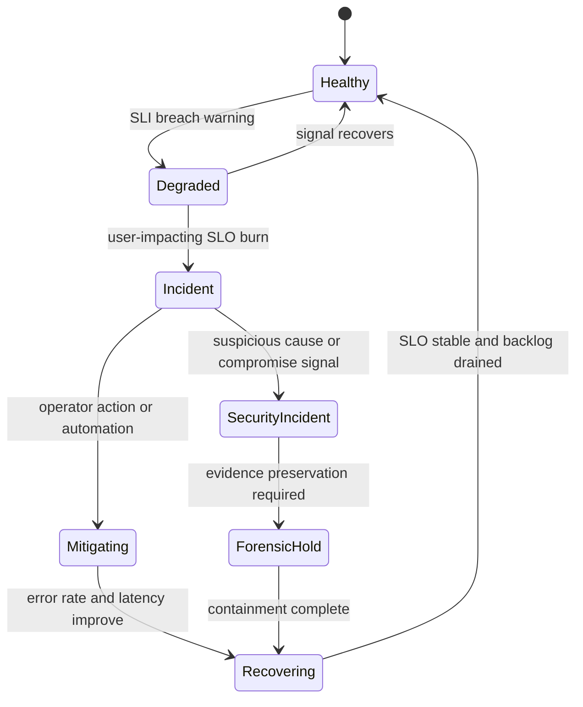
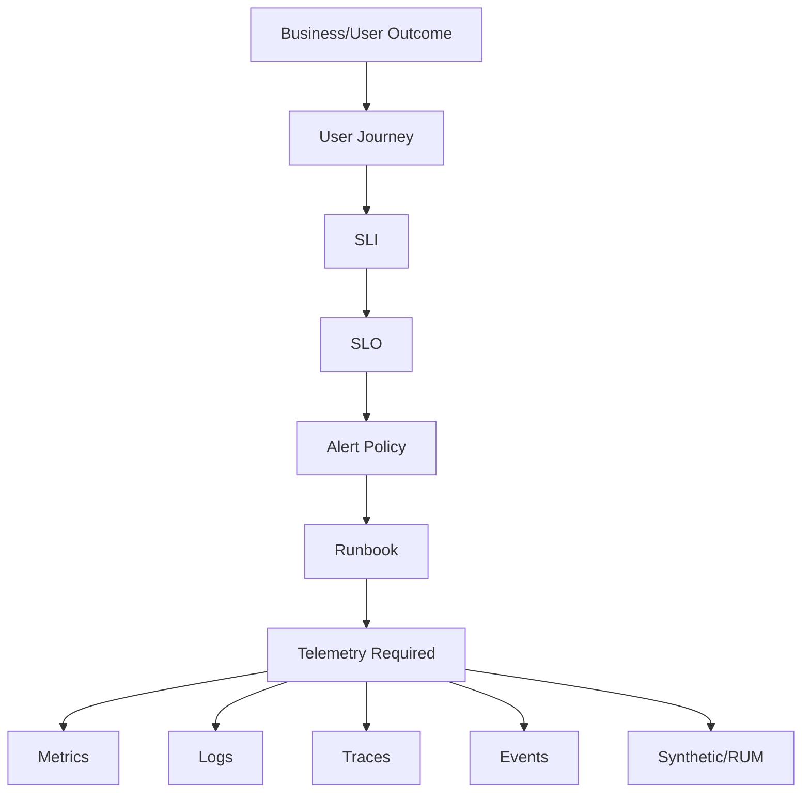
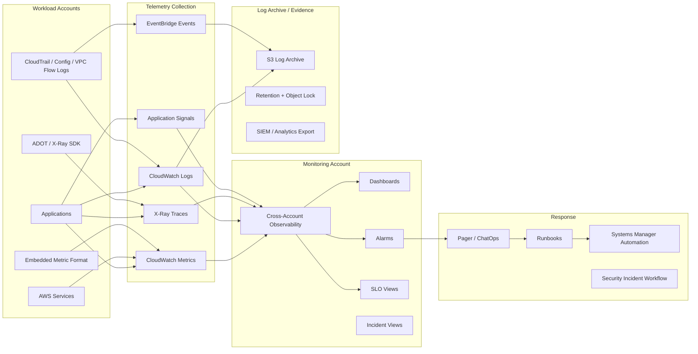
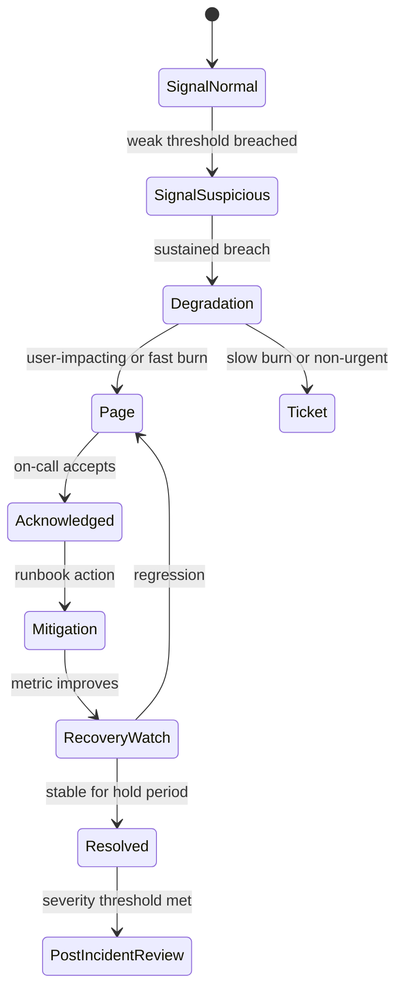
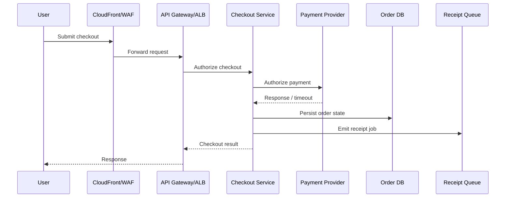

# Part 055 — Observability Mental Model

Observability is not the act of collecting logs.

It is the ability to answer hard questions about a running system **without deploying new code, SSH-ing into machines, or guessing from dashboards**.

In AWS, this matters because the system is split across many boundaries:

- multiple AWS accounts,
- multiple Regions,
- managed services you do not control internally,
- serverless runtimes you cannot SSH into,
- asynchronous queues,
- event buses,
- IAM roles,
- KMS keys,
- VPC endpoints,
- third-party APIs,
- and user-facing workflows that cross all of them.

A weak observability system says:

> CPU is fine. Maybe the database is slow. Maybe the API Gateway is dropping traffic. Maybe the customer is wrong.

A strong observability system says:

> Checkout latency for tenant `t-9421` in `ap-southeast-1` exceeded the 99th percentile SLO after the payment dependency started returning elevated `5xx`. The service is healthy internally, but dependency timeout retries are amplifying queue age. The immediate mitigation is to reduce retry concurrency and fail open for non-critical receipt generation.

That is the level we want.

This part builds the mental model. The next parts will go deeper into CloudWatch metrics, Logs Insights, dashboards, Application Signals, X-Ray, OpenTelemetry, synthetics, RUM, and Internet Monitor.

---

## 1. The Core Question

The real question is not:

> Do we have monitoring?

The real question is:

> Can we understand production behavior quickly enough to protect users, data, availability, security, and business outcomes?

Monitoring is usually about known symptoms:

- CPU is high.
- Disk is full.
- Error rate is above threshold.
- Lambda duration is above threshold.
- Queue depth is growing.

Observability is about unknown questions:

- Why did only one tenant experience checkout failures?
- Which dependency caused this latency spike?
- Did the deployment change behavior or only expose an old bottleneck?
- Is the alarm noisy because the system is broken or because the metric is badly modeled?
- Did the request fail before authentication, after authorization, during business validation, or during persistence?
- Did the incident affect revenue, only background jobs, or only internal admin workflows?
- Is this a production outage, a partial degradation, a security incident, or a customer-specific data issue?

Observability turns a distributed system from a black box into a system with interrogable behavior.

---

## 2. Monitoring vs Observability

The common distinction is simple but important.

| Dimension | Monitoring | Observability |
|---|---|---|
| Starting point | Known failure modes | Unknown questions |
| Primary object | Resource or service health | System behavior and user outcome |
| Typical signal | Metrics and alarms | Metrics, logs, traces, events, profiles, synthetic checks, user signals |
| Question | “Is X broken?” | “Why is the system behaving this way?” |
| Design style | Threshold-driven | Hypothesis-driven |
| Owner | Often platform/ops | Service team, platform team, security team, business owner |
| Failure mode | Alert fatigue | High cardinality chaos, poor correlation, poor semantic model |

Good production systems need both.

Monitoring is the smoke detector.

Observability is the investigation system.

---

## 3. AWS Observability Is Not One Service

A beginner mistake is to equate AWS observability with CloudWatch.

CloudWatch is central, but AWS observability is a **composition** of services and patterns:

| Capability | AWS Building Blocks |
|---|---|
| Metrics | CloudWatch Metrics, embedded metric format, OTLP metrics, service metrics |
| Logs | CloudWatch Logs, Logs Insights, subscription filters, S3 archive, OpenSearch/SIEM integration |
| Traces | AWS X-Ray, OpenTelemetry/ADOT, Application Signals |
| Application health | CloudWatch Application Signals, ServiceLens, Application Insights |
| SLOs | CloudWatch Application Signals SLOs, custom CloudWatch alarms, error budget dashboards |
| Synthetic checks | CloudWatch Synthetics |
| Real user visibility | CloudWatch RUM |
| Internet path visibility | CloudWatch Internet Monitor |
| Infrastructure events | EventBridge, CloudTrail, AWS Health, Config |
| Security telemetry | GuardDuty, Security Hub, Inspector, Macie, Detective |
| Fleet operations | Systems Manager, Patch Manager, Inventory, State Manager |
| Cross-account visibility | CloudWatch cross-account observability, Observability Access Manager |

The right mental model is not “Which observability service should I use?”

The right model is:

> What question must the system answer, at what speed, with what confidence, for which operator?

Then choose signals and tools.

---

## 4. The Observability Contract

Every production workload should expose a contract.

Not a documentation-only contract.

An operational contract.

It should answer:

1. **What is the workload supposed to do?**
2. **What user journeys matter most?**
3. **What does healthy mean?**
4. **What does degraded mean?**
5. **What does failed mean?**
6. **What signals prove each state?**
7. **Who owns each signal?**
8. **What action follows each signal?**
9. **How do we know the action worked?**
10. **What evidence remains after the incident?**

A system without this contract will still produce telemetry, but the telemetry will be mostly noise.

### Example Observability Contract

For a payment authorization service:

| Contract Field | Example |
|---|---|
| Primary user journey | Authorize card payment |
| Main SLI | Successful authorization rate |
| Latency SLI | p95 end-to-end authorization latency |
| Availability SLO | 99.95% successful authorization requests over 30 days |
| Latency SLO | p95 below 800 ms over 30 days |
| Degraded state | p95 above 800 ms for 10 minutes or dependency timeout above baseline |
| Failed state | Successful authorization rate below 99% for 5 minutes |
| Key dimensions | Region, merchant tier, payment provider, API route, error class |
| Operator action | Check dependency timeout, retry budget, circuit breaker, queue age |
| Evidence | Metric graph, traces, sampled failed requests, deployment event, dependency health |

Notice what is absent: CPU-first thinking.

CPU may matter, but the user journey matters first.

---

## 5. The Production Reality: AWS Workloads Are State Machines

In previous parts, we modeled security as identities, boundaries, evidence, and controls.

For observability, model the workload as a state machine.



The purpose of observability is to detect state transitions quickly and accurately.

Dashboards are just visualizations.

Alarms are just transition detectors.

Logs are just detailed event records.

Traces are just request path evidence.

The operating model is the real system.

---

## 6. Signal Taxonomy

A mature AWS system uses more than metrics/logs/traces.

It uses a portfolio of signals.

### 6.1 Metrics

Metrics are numerical measurements over time.

Examples:

- request count,
- error count,
- p95 latency,
- queue depth,
- throttled requests,
- rejected connections,
- consumed capacity,
- concurrent executions,
- retry count,
- cache hit ratio,
- authorization failures,
- customer-facing success rate.

Metrics are best for:

- dashboards,
- alarms,
- trend analysis,
- SLOs,
- anomaly detection,
- capacity planning,
- fast incident detection.

Metrics are bad for:

- detailed debugging,
- reconstructing a single request,
- understanding exact error context,
- explaining why a rare edge case happened.

### 6.2 Logs

Logs are event records.

Examples:

- request accepted,
- authorization denied,
- validation failed,
- payment provider timeout,
- retry exhausted,
- order state changed,
- secret rotation completed,
- policy evaluation failed.

Logs are best for:

- detailed debugging,
- forensic reconstruction,
- audit trails,
- rare events,
- contextual error analysis,
- query-driven investigation.

Logs are bad for:

- high-speed alerting if unstructured,
- trend analysis if every query scans huge volumes,
- production diagnosis if they omit correlation IDs,
- understanding distributed paths without trace context.

### 6.3 Traces

Traces show the path of a request through services and dependencies.

Examples:

- API Gateway → Lambda → DynamoDB,
- ALB → ECS service → RDS → Redis,
- AppSync → Lambda resolver → Step Functions,
- EventBridge → SQS → consumer → external API.

Traces are best for:

- dependency latency,
- bottleneck detection,
- distributed debugging,
- fan-out/fan-in behavior,
- request-level causality,
- service map generation.

Traces are bad for:

- full audit completeness,
- low-cardinality trend alerting,
- legal evidence by themselves,
- workloads where sampling hides rare failures unless designed carefully.

### 6.4 Events

Events represent discrete state changes.

Examples:

- deployment finished,
- Auto Scaling changed capacity,
- CloudTrail observed `PutBucketPolicy`,
- AWS Health announced service issue,
- Config marked resource noncompliant,
- Security Hub finding changed workflow status,
- EventBridge rule triggered remediation.

Events are best for:

- correlating changes with failures,
- triggering automation,
- audit timeline,
- remediation workflow,
- ownership routing.

### 6.5 Synthetic Checks

Synthetic checks simulate user behavior.

Examples:

- login flow,
- checkout flow,
- search flow,
- report download,
- static content retrieval,
- API health transaction.

Synthetic checks are best for:

- outside-in availability,
- early detection before users complain,
- validating network/DNS/TLS/CDN/API path,
- release smoke testing.

They are bad if they only call `/health` and never test real user outcomes.

### 6.6 Real User Monitoring

RUM captures actual client-side experience.

Examples:

- page load time,
- JavaScript errors,
- client geolocation latency,
- browser type,
- failed API calls from frontend,
- session-level performance.

RUM is best for:

- browser/mobile user experience,
- CDN and internet path issues,
- frontend regressions,
- user geography analysis.

### 6.7 Internet Path Signals

Internet path signals detect whether users are affected by ISP, route, CDN, or regional internet degradation.

This matters when AWS service health is fine, backend health is fine, but customers in one geography experience poor connectivity.

### 6.8 Security Signals

Security signals overlap with observability but have different semantics.

Examples:

- GuardDuty finding,
- CloudTrail unusual API activity,
- IAM access key used from unusual country,
- KMS decrypt spike,
- public S3 policy change,
- Security Hub control failure,
- Inspector critical CVE,
- Macie sensitive data discovery.

The key difference:

> Operational observability asks, “Is the system serving users correctly?”
>
> Security observability asks, “Is the system being used safely and legitimately?”

A strong production system connects both.

---

## 7. The Observability Pyramid

Do not start with dashboards.

Start with outcomes.



A dashboard-first organization usually produces wall screens.

An outcome-first organization produces action.

---

## 8. Golden Signals, RED, and USE

Three practical frameworks are worth keeping.

### 8.1 Golden Signals

For user-facing services:

| Signal | Question |
|---|---|
| Latency | How long does a request take? |
| Traffic | How much demand is the service receiving? |
| Errors | How many requests fail? |
| Saturation | How close is the system to a hard limit? |

This is a good default for APIs, web services, and synchronous request paths.

### 8.2 RED Method

For request-driven services:

| Signal | Meaning |
|---|---|
| Rate | Requests per second |
| Errors | Failed requests per second or percentage |
| Duration | Request latency distribution |

RED is useful because it starts from request semantics.

### 8.3 USE Method

For resources:

| Signal | Meaning |
|---|---|
| Utilization | How busy is the resource? |
| Saturation | How much work is queued because the resource is busy? |
| Errors | How many resource-level errors occur? |

USE is good for infrastructure and capacity.

Examples:

| AWS Resource | Utilization | Saturation | Errors |
|---|---|---|---|
| Lambda | Concurrent executions | Throttles | Invocation errors |
| ECS service | CPU/memory | pending tasks | task crashes |
| SQS | messages processed | ApproximateAgeOfOldestMessage | failed receives/deletes |
| RDS | CPU/IO/connection usage | queue depth/lock wait | deadlocks/timeouts |
| DynamoDB | consumed capacity | throttling | conditional/check failures |

Do not force one framework everywhere.

Use the framework that matches the question.

---

## 9. SLI, SLO, SLA, and Error Budget

Observability becomes operationally powerful when linked to SLOs.

### SLI

A **Service Level Indicator** is a measurement.

Examples:

- successful request ratio,
- p95 checkout latency,
- message processing delay,
- login success ratio,
- object upload completion rate.

### SLO

A **Service Level Objective** is a target over a window.

Examples:

- 99.9% of checkout requests succeed over 30 days.
- 95% of search requests complete below 500 ms over 7 days.
- 99% of messages are processed within 2 minutes over 24 hours.

### SLA

A **Service Level Agreement** is a contractual commitment.

SLOs are internal engineering control targets.

SLAs are external promises.

Do not confuse them.

### Error Budget

An error budget is the allowed amount of failure within the SLO window.

If your SLO is 99.9%, your error budget is 0.1%.

That means for every 1,000,000 requests, 1,000 can fail within the window before the SLO is exhausted.

The practical value:

- if budget is healthy, teams can ship faster;
- if budget burns too quickly, teams reduce risk;
- if budget is exhausted, reliability work outranks feature work.

This turns reliability from opinion into governance.

---

## 10. The Most Important Observability Design Decision: Dimensions

A metric without dimensions is often too broad.

A metric with too many dimensions becomes expensive and noisy.

The art is choosing the dimensions that match operational decisions.

### Useful Dimensions

| Dimension | Why It Matters |
|---|---|
| `service` | Ownership and routing |
| `environment` | Prod vs non-prod separation |
| `region` | Regional incident analysis |
| `api_route` | Which endpoint is degraded |
| `operation` | Business operation causing issue |
| `dependency` | Which downstream is slow/failing |
| `error_class` | Retryable vs non-retryable vs validation |
| `tenant_tier` | Customer impact and priority |
| `deployment_version` | Regression correlation |
| `az` | Zonal impairment analysis |

### Dangerous Dimensions

| Dimension | Risk |
|---|---|
| `request_id` | Explodes cardinality |
| `user_id` | High cardinality and privacy risk |
| `email` | PII leakage |
| `full_url` | High cardinality and secrets-in-query risk |
| `exception_message` | High cardinality and noisy grouping |
| `stack_trace_hash` | Can be useful, but often too granular for metrics |

A good rule:

> Put high-cardinality detail in logs/traces. Put low-cardinality decision dimensions in metrics.

---

## 11. Correlation Is the Difference Between Telemetry and Observability

The system must connect:

- metric spike,
- log events,
- trace samples,
- deployment event,
- AWS Health event,
- Config state change,
- CloudTrail API call,
- security finding,
- customer impact.

Without correlation, every incident becomes manual archaeology.

### Minimum Correlation Fields

Every application log should include:

| Field | Purpose |
|---|---|
| `timestamp` | Timeline reconstruction |
| `level` | Severity filtering |
| `service` | Ownership |
| `environment` | Prod/non-prod separation |
| `region` | Regional diagnosis |
| `account_id` | Multi-account diagnosis |
| `trace_id` | Trace correlation |
| `span_id` | Span correlation |
| `request_id` | Request correlation |
| `operation` | Business operation |
| `tenant_id` or tenant surrogate | Tenant-specific diagnosis, carefully governed |
| `error_class` | Grouping failures |
| `dependency` | Downstream attribution |
| `deployment_version` | Change correlation |

Do not log secrets.

Do not log raw credentials.

Do not log authorization tokens.

Do not log PII unless the control model explicitly allows it.

---

## 12. Observability Architecture in AWS

A typical production architecture looks like this:



The important architectural idea:

> Workload accounts own instrumentation. The monitoring account owns visibility. The log archive owns custody. The response layer owns action.

Do not mix all of these blindly into one account.

---

## 13. Multi-Account Observability

In a serious AWS environment, services live across accounts.

A single business transaction might touch:

- frontend account,
- API account,
- payment account,
- data account,
- security tooling account,
- shared network account,
- third-party integration account.

If every account has isolated dashboards, incident response slows down.

CloudWatch cross-account observability solves part of this by allowing a monitoring account to view telemetry from source accounts within a Region.

The design question is not only technical.

It is organizational:

| Design Decision | Good Default |
|---|---|
| Who owns source telemetry? | Workload account team |
| Who owns central visibility? | Platform/SRE/operations team |
| Who owns application SLO? | Service owner |
| Who owns security telemetry? | Security operations team |
| Who owns retention/evidence? | Security/audit/log archive owner |
| Who can query production logs? | Restricted, audited, least privilege |
| Who can create alarms? | Service team via code, reviewed by platform |

Cross-account observability does not remove ownership boundaries.

It makes them visible.

---

## 14. The Five Layers of Production Observability

Think of observability in layers.

### Layer 1 — Customer/User Outcome

Questions:

- Can users log in?
- Can customers pay?
- Can reports be generated?
- Can files be uploaded?
- Can admins complete case review?

Signals:

- synthetic checks,
- RUM,
- business success metrics,
- API success rate,
- SLO burn rate.

This is the most important layer.

### Layer 2 — Service Behavior

Questions:

- Which service is failing?
- Which endpoint is slow?
- Which operation has elevated errors?
- Is the issue local or dependency-driven?

Signals:

- RED metrics,
- application logs,
- traces,
- service maps,
- dependency telemetry.

### Layer 3 — Dependency Behavior

Questions:

- Is DynamoDB throttling?
- Is RDS connection pool exhausted?
- Is SQS age growing?
- Is an external API timing out?
- Is KMS decrypt latency affecting the path?

Signals:

- dependency metrics,
- trace spans,
- error classes,
- timeout logs,
- retry metrics.

### Layer 4 — Infrastructure/Runtime Behavior

Questions:

- Is Lambda throttled?
- Are ECS tasks restarting?
- Is EC2 CPU saturated?
- Are ALB target groups unhealthy?
- Is a subnet/AZ impaired?

Signals:

- CloudWatch service metrics,
- container metrics,
- instance metrics,
- health checks,
- AWS Health.

### Layer 5 — Control Plane and Change Events

Questions:

- Did a deployment happen?
- Did someone change a security group?
- Did Config detect drift?
- Did a route table change?
- Did a KMS policy change?
- Did an IAM role trust policy change?

Signals:

- CloudTrail,
- Config,
- EventBridge,
- deployment events,
- Security Hub findings,
- change calendar.

Most incident reviews fail because they only analyze Layer 4.

Top-tier teams connect all five layers.

---

## 15. Observability for Synchronous vs Asynchronous Systems

Synchronous and asynchronous workloads need different signals.

### Synchronous Request Path

Examples:

- REST API,
- GraphQL API,
- web checkout,
- login,
- internal admin API.

Primary signals:

- request rate,
- success/error rate,
- latency distribution,
- dependency latency,
- saturation,
- trace path,
- user-visible failure.

Main failure mode:

> User waits and receives an error or timeout.

### Asynchronous Path

Examples:

- SQS consumer,
- EventBridge workflow,
- Step Functions,
- batch processing,
- stream processing,
- notification sending,
- report generation.

Primary signals:

- queue age,
- backlog depth,
- processing rate,
- retry count,
- dead-letter count,
- poison message count,
- end-to-end processing delay,
- idempotency failure,
- partial failure rate.

Main failure mode:

> User does not see immediate error, but work silently delays or never completes.

For async systems, availability is often not “API returns 200”.

Availability is:

> Work is accepted, processed, completed, and visible within the promised time.

That changes your SLO design.

---

## 16. Observability for Serverless

Serverless observability has a specific trap:

> You cannot see the host, so you must instrument the behavior.

For Lambda-heavy systems, watch:

- invocation count,
- errors,
- duration,
- p95/p99 duration,
- throttles,
- concurrent executions,
- iterator age,
- dead-letter events,
- async event age,
- cold start impact,
- downstream latency,
- partial batch failures,
- memory utilization,
- timeout proximity.

For API Gateway + Lambda:

- API Gateway latency,
- integration latency,
- Lambda duration,
- Lambda error,
- API Gateway `4xx` vs `5xx`,
- authorizer failures,
- throttling,
- WAF block count.

For EventBridge + Lambda:

- matched events,
- invocations,
- failed invocations,
- retry count,
- DLQ depth,
- event age,
- target failure.

Serverless shifts the operational question from machine health to flow health.

---

## 17. Observability for Containers

Container observability has a different trap:

> Infrastructure metrics look healthy while one dependency or one pod/task is failing.

For ECS/EKS-style systems, watch:

- service desired vs running task/pod count,
- task restart count,
- container exit reason,
- CPU/memory utilization,
- memory reservation pressure,
- network errors,
- ALB target health,
- request latency and error rate,
- dependency spans,
- deployment rollout health,
- autoscaling behavior,
- image/version dimension,
- node/pod scheduling saturation if Kubernetes is involved.

Container observability must connect:

- orchestrator health,
- application health,
- network path,
- deployment identity,
- dependency path.

---

## 18. Observability for Managed Data Services

Managed services reduce operational burden, but they do not remove observability responsibilities.

### DynamoDB

Watch:

- throttled requests,
- consumed read/write capacity,
- successful request latency,
- system errors,
- conditional check failures,
- hot partition symptoms,
- stream iterator age,
- backup/restore events.

### RDS/Aurora

Watch:

- database connections,
- CPU,
- memory,
- storage,
- IOPS,
- read/write latency,
- deadlocks,
- lock waits,
- replication lag,
- failover events,
- slow query behavior.

### S3

Watch:

- request count,
- `4xx`/`5xx`,
- first byte latency,
- bucket size/object count,
- replication failures,
- lifecycle failures,
- access anomalies,
- Macie findings for sensitive data.

### SQS

Watch:

- visible messages,
- not-visible messages,
- age of oldest message,
- sent/received/deleted count,
- DLQ message count,
- consumer error rate,
- processing latency.

Managed service telemetry is often the first clue that your application-level design is wrong.

---

## 19. Logs: The Difference Between Useful and Expensive Noise

A log line should exist because it answers a question.

Bad log:

```text
Something went wrong
```

Better log:

```json
{
  "level": "ERROR",
  "service": "payment-authorizer",
  "environment": "prod",
  "region": "ap-southeast-1",
  "operation": "AuthorizePayment",
  "trace_id": "1-abc",
  "request_id": "req-93f",
  "tenant_tier": "enterprise",
  "dependency": "provider-x",
  "error_class": "DependencyTimeout",
  "retryable": true,
  "attempt": 3,
  "latency_ms": 2480,
  "timeout_ms": 2500,
  "deployment_version": "2026.07.06.3"
}
```

The second log lets an engineer ask:

- Which dependency?
- Which operation?
- Which tier?
- Retryable or final?
- Was the timeout near configured limit?
- Which deployment?
- Which trace?

Good logs reduce cognitive load during incidents.

---

## 20. Alert Design: Alert on Symptoms, Diagnose With Causes

A classic failure:

- CPU alarm fires.
- Memory alarm fires.
- thread count alarm fires.
- queue depth alarm fires.
- database connection alarm fires.
- service error alarm fires.

The on-call engineer receives 30 alerts.

That is not observability.

That is telemetry panic.

Better pattern:

1. Alert on user-impacting symptoms.
2. Use dashboards and runbooks for cause diagnosis.
3. Use composite alarms to reduce noise.
4. Page only when action is required.
5. Ticket or notify for non-urgent degradation.
6. Suppress known maintenance windows.
7. Attach runbook and ownership metadata.

### Paging Criteria

An alarm should page a human only when:

- it indicates user/business impact or high probability of imminent impact,
- it requires timely human action,
- the action is documented,
- the owner is clear,
- the signal is reliable enough to avoid repeated false positives.

Otherwise, it should be a dashboard, ticket, report, or automation input.

---

## 21. Alarm State as a State Machine

CloudWatch alarms have states, but your incident process also has states.



The CloudWatch alarm is only the first transition.

Your operating model must define the rest.

---

## 22. Change Events Are First-Class Observability Signals

Most incidents are caused by change.

Examples:

- deployment,
- configuration change,
- IAM policy change,
- security group change,
- WAF rule update,
- database parameter change,
- KMS key policy change,
- scaling policy change,
- feature flag rollout,
- secret rotation,
- certificate renewal failure.

A production dashboard without change markers is incomplete.

Every incident investigation should quickly answer:

> What changed before the signal moved?

AWS-native change signals include:

- CloudTrail events,
- AWS Config timeline,
- CodeDeploy/CodePipeline events,
- ECS deployment events,
- Lambda version/alias changes,
- CloudFormation stack events,
- EventBridge events,
- AWS Health events.

Top-tier teams graph change events alongside SLO signals.

---

## 23. Observability Anti-Patterns

### Anti-Pattern 1 — Resource-First Dashboards

A dashboard full of CPU, memory, and disk graphs may look serious but fail to answer user-impact questions.

Fix:

- start with user journeys,
- add service SLIs,
- then add resource signals.

### Anti-Pattern 2 — Every Error Pages

Not every error matters.

Some errors are validation failures.

Some errors are expected client behavior.

Some errors are retried successfully.

Some errors affect only non-critical background work.

Fix:

- classify error types,
- alert on error budget burn,
- reserve paging for actionable impact.

### Anti-Pattern 3 — Logs Without Structure

Plain-text logs are expensive to query and hard to correlate.

Fix:

- emit structured JSON,
- enforce required fields,
- include trace/request correlation,
- avoid secrets and PII.

### Anti-Pattern 4 — High-Cardinality Metrics

Using `user_id`, `request_id`, or full URL as metric dimensions creates cost and performance problems.

Fix:

- put high-cardinality detail in logs/traces,
- keep metric dimensions decision-oriented.

### Anti-Pattern 5 — No Ownership Metadata

An alarm without owner and runbook is operational debt.

Fix:

- tag alarms,
- attach runbook links,
- define service owner,
- review stale alarms.

### Anti-Pattern 6 — No Synthetic or RUM Signal

Backend looks healthy, but users cannot complete journeys.

Fix:

- add synthetic checks for critical flows,
- add RUM where frontend experience matters,
- measure outside-in behavior.

### Anti-Pattern 7 — Dashboard Sprawl

Hundreds of dashboards, none trusted.

Fix:

- define dashboard tiers:
  - executive health,
  - service owner,
  - incident commander,
  - dependency deep dive,
  - security operations.

### Anti-Pattern 8 — Security and Operations Telemetry Are Separate Universes

Operational team sees error spike.

Security team sees suspicious API activity.

Nobody correlates them.

Fix:

- connect CloudTrail, Config, GuardDuty, Security Hub, application telemetry, and deployment events.

---

## 24. Practical AWS Observability Blueprint

For each production service, implement this minimum blueprint.

### 24.1 Required Metrics

| Metric | Dimension Guidance |
|---|---|
| Request count | service, operation, region, environment |
| Error count | service, operation, error_class, region |
| Latency distribution | service, operation, dependency, region |
| Dependency timeout count | dependency, operation, region |
| Retry count | dependency, retry_reason |
| Saturation signal | resource-specific |
| Business success count | business operation, tenant tier if safe |
| Queue age/backlog | queue, consumer, region |

### 24.2 Required Logs

| Log Type | Purpose |
|---|---|
| request lifecycle | reconstruct single request |
| business state transition | audit user-impacting state |
| dependency failure | diagnose downstream issues |
| authorization failure | security and access diagnosis |
| retry exhaustion | async/sync reliability diagnosis |
| deployment marker | change correlation |

### 24.3 Required Traces

Trace:

- external entry point,
- service boundary,
- database call,
- queue publish/consume,
- external API call,
- cache call,
- KMS/Secrets access if relevant,
- critical business operation span.

### 24.4 Required Alarms

| Alarm Type | Page? |
|---|---|
| SLO fast burn | Yes |
| critical journey synthetic failure | Yes if confirmed/repeated |
| sustained error rate above budget | Yes |
| queue age violating processing SLO | Yes |
| dependency degradation | Usually notify/ticket, page if user-impacting |
| resource saturation | Usually ticket/page only if impact is imminent |
| log ingestion failure | Notify platform/security |
| trace ingestion failure | Notify platform |

### 24.5 Required Dashboards

| Dashboard | Audience |
|---|---|
| service health | service team/on-call |
| user journey health | product/business/SRE |
| dependency health | service team/platform |
| incident commander | incident lead |
| security correlation | security operations |
| executive reliability | leadership |

---

## 25. Example: Checkout Observability Model



Signals:

| Step | Metric | Log | Trace Span | Alarm Candidate |
|---|---|---|---|---|
| User to edge | synthetic/RUM latency | WAF block reason | edge span if available | critical journey failure |
| API entry | request count/error/latency | request accepted/failed | API span | error budget burn |
| App logic | operation latency/error | business validation/state | app span | p95 breach |
| Payment provider | timeout/error/latency | provider result | dependency span | dependency degradation |
| DB persist | DB latency/error | persistence failure | DB span | data write failure |
| Queue | message age/depth | receipt event emitted | async span | backlog SLO breach |

A useful incident question:

> Checkout failed. Was it edge, API, app validation, payment provider, database write, queue delay, or client-side problem?

The observability model should answer this in minutes.

---

## 26. How to Design Observability for a New Service

Use this sequence.

### Step 1 — Define User Journeys

Example:

- login,
- search,
- checkout,
- upload document,
- approve case,
- generate report.

### Step 2 — Define SLI per Journey

Example:

- successful login ratio,
- search p95 latency,
- checkout success rate,
- document upload completion rate,
- report generation completion within 5 minutes.

### Step 3 — Define SLO Window

Example:

- 99.9% success over 30 days,
- p95 below 1 second over 7 days,
- 99% async jobs complete within 2 minutes over 24 hours.

### Step 4 — Define Failure Classes

Example:

- client validation error,
- authentication error,
- authorization error,
- dependency timeout,
- database error,
- throttling,
- business rule rejection,
- unknown exception.

### Step 5 — Define Telemetry Schema

Required fields:

- service,
- environment,
- region,
- operation,
- error_class,
- dependency,
- trace_id,
- request_id,
- deployment_version.

### Step 6 — Define Alarm Strategy

Decide:

- page,
- ticket,
- chat notification,
- automation,
- dashboard-only.

### Step 7 — Define Runbooks

Every page-worthy alarm must link to:

- impact definition,
- first checks,
- dashboards,
- common causes,
- safe mitigations,
- rollback path,
- escalation path,
- evidence to preserve.

### Step 8 — Validate With Game Days

Do not trust observability until tested.

Simulate:

- dependency timeout,
- database throttle,
- queue backlog,
- bad deployment,
- missing IAM permission,
- KMS access denied,
- WAF false positive,
- network egress block,
- region-level dependency degradation.

---

## 27. Observability Review Checklist

For each production service, ask:

- [ ] Do we know the critical user journeys?
- [ ] Do we have SLIs for those journeys?
- [ ] Do we have SLOs and error budgets?
- [ ] Do alerts map to user impact or imminent impact?
- [ ] Do all page-worthy alerts have runbooks?
- [ ] Are logs structured?
- [ ] Are correlation IDs propagated?
- [ ] Can we correlate metrics, logs, traces, deployments, CloudTrail, and Config?
- [ ] Do we avoid high-cardinality metrics?
- [ ] Do we measure dependency latency and errors?
- [ ] Do we measure async backlog age, not only queue depth?
- [ ] Do we have synthetic checks for critical flows?
- [ ] Do we have RUM where frontend experience matters?
- [ ] Do dashboards have clear audiences?
- [ ] Are alarms owned and reviewed?
- [ ] Is telemetry retained according to operational/audit needs?
- [ ] Can we troubleshoot across accounts and Regions?
- [ ] Can we detect telemetry pipeline failure itself?
- [ ] Have we tested observability during game days?

---

## 28. The Top 1% Mental Model

The best engineers do not ask:

> What metrics should I collect?

They ask:

> What production question must I answer under pressure, and what telemetry makes the answer obvious?

They do not build dashboards as art.

They build decision systems.

They do not alert on everything.

They alert on actionable state transitions.

They do not treat logs, metrics, and traces as separate outputs.

They treat them as correlated evidence.

They do not wait for incidents to discover missing telemetry.

They test observability before production failure.

---

## 29. Summary

In AWS, observability must be designed across service, account, Region, identity, network, dependency, runtime, and control-plane boundaries.

A production-grade observability system has these properties:

- starts from user journeys,
- defines SLIs and SLOs,
- emits structured, correlated telemetry,
- separates metrics/logs/traces/events by purpose,
- uses low-cardinality metrics and high-context logs/traces,
- correlates changes with failures,
- supports multi-account visibility,
- distinguishes page-worthy alerts from informational signals,
- links alarms to runbooks,
- preserves evidence,
- and is tested through game days.

The next part goes deeper into CloudWatch Metrics and Alarms.

That is where the abstract signal model becomes concrete AWS implementation.

---

## References

- AWS Well-Architected Operational Excellence Pillar — Implement observability: https://docs.aws.amazon.com/wellarchitected/latest/operational-excellence-pillar/implement-observability.html
- AWS Well-Architected Operational Excellence Pillar — Utilizing workload observability: https://docs.aws.amazon.com/wellarchitected/latest/operational-excellence-pillar/utilizing-workload-observability.html
- Amazon CloudWatch concepts: https://docs.aws.amazon.com/AmazonCloudWatch/latest/monitoring/cloudwatch_concepts.html
- Amazon CloudWatch cross-account observability: https://docs.aws.amazon.com/AmazonCloudWatch/latest/monitoring/CloudWatch-Unified-Cross-Account.html
- Amazon CloudWatch Observability Access Manager: https://docs.aws.amazon.com/OAM/latest/APIReference/Welcome.html
