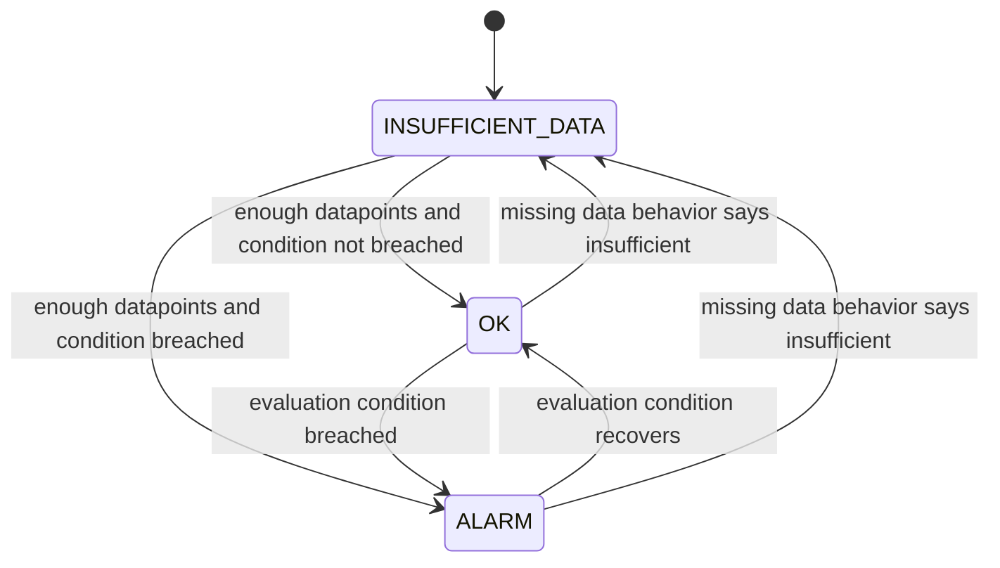
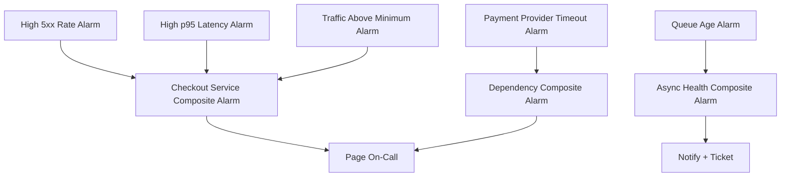
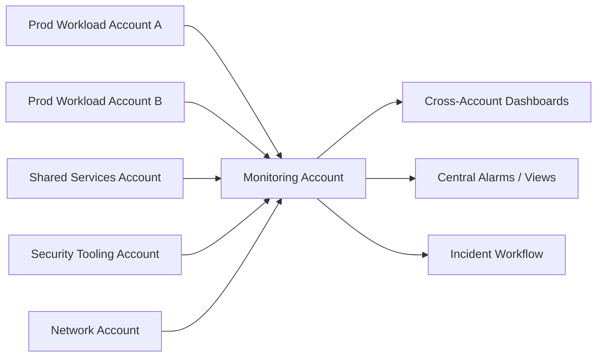

# Part 056 — CloudWatch Metrics and Alarms

CloudWatch Metrics and Alarms are often treated as simple features:

> Put numbers in CloudWatch. Add alarm. Done.

That is how noisy systems are born.

In production, metrics and alarms are part of the **operational decision engine**.

Metrics define what the system says about itself.

Alarms define when that statement becomes action.

If metric identity is wrong, alarms lie.

If dimensions are wrong, dashboards hide impact.

If thresholds are wrong, on-call becomes noise.

If missing data is wrong, outages disappear.

If alarm ownership is wrong, nobody acts.

This part builds a deep, practical model for CloudWatch Metrics and Alarms.

---

## 1. The Core Question

The real question is not:

> How do I create a CloudWatch alarm?

The real question is:

> How do I encode production health as reliable time-series signals and convert those signals into the right operational action?

That requires understanding:

- metric identity,
- namespace strategy,
- dimension strategy,
- statistic semantics,
- period and resolution,
- missing data behavior,
- alarm evaluation,
- metric math,
- anomaly detection,
- composite alarms,
- cross-account visibility,
- and alert governance.

---

## 2. CloudWatch Metric Mental Model

A CloudWatch metric is not just a name.

It is a time series identified by:

```text
Namespace + MetricName + DimensionSet
```

Example:

```text
Namespace: AWS/Lambda
MetricName: Errors
Dimensions:
  FunctionName = payment-authorizer-prod
```

Another dimension set is a different metric.

That detail matters.

These are not the same metric:

```text
AWS/Lambda Errors FunctionName=payment-authorizer-prod
AWS/Lambda Errors FunctionName=receipt-generator-prod
```

Nor are these the same metric:

```text
Custom/Checkout Latency Operation=AuthorizePayment Region=ap-southeast-1
Custom/Checkout Latency Operation=CreateReceipt Region=ap-southeast-1
```

Metric identity is the first design decision.

---

## 3. Namespaces

A namespace is the top-level container for metrics.

AWS service metrics use namespaces such as:

- `AWS/EC2`,
- `AWS/Lambda`,
- `AWS/ApplicationELB`,
- `AWS/RDS`,
- `AWS/DynamoDB`,
- `AWS/SQS`,
- `AWS/ApiGateway`,
- `AWS/ECS`,
- `AWS/EKS`,
- `AWS/States`.

Custom metrics should use namespaces that communicate ownership and domain.

Examples:

```text
Company/Checkout
Company/Payments
Company/CaseManagement
Company/Platform
Company/SecurityAutomation
Company/DataPipeline
```

Bad custom namespace:

```text
CustomMetrics
Application
Prod
Monitoring
```

Those names do not communicate ownership, domain, or purpose.

### Namespace Design Guidelines

| Guideline | Reason |
|---|---|
| Use domain-oriented names | Easier ownership and discovery |
| Avoid environment-only namespaces | Environment should usually be a dimension |
| Avoid team names that change often | Organizational changes should not break telemetry semantics |
| Do not mix unrelated services in one namespace | Prevent accidental aggregation |
| Keep naming stable | Metric identity changes break dashboards and alarms |

---

## 4. Metric Names

Metric names should describe the measured quantity.

Good examples:

```text
RequestCount
RequestLatency
AuthorizationFailureCount
PaymentProviderTimeoutCount
OrderPersistFailureCount
QueueProcessingDelay
BusinessTransactionSuccessCount
BusinessTransactionFailureCount
DependencyCallDuration
```

Bad examples:

```text
Error
BadThing
Metric1
LatencyMsProd
CheckoutStats
```

A metric name should not encode every dimension.

Bad:

```text
CheckoutAuthorizePaymentProviderXProdLatency
```

Better:

```text
MetricName: DependencyCallDuration
Dimensions:
  Service = checkout
  Operation = AuthorizePayment
  Dependency = provider-x
  Environment = prod
```

---

## 5. Dimensions

Dimensions are name/value pairs that identify a metric.

They are powerful and dangerous.

Useful dimensions let operators slice the system by decision boundary.

Dangerous dimensions create uncontrolled cardinality.

### 5.1 Good Dimension Candidates

| Dimension | Use |
|---|---|
| `Service` | owner and routing |
| `Environment` | prod/staging/dev separation |
| `Region` | regional diagnosis |
| `Operation` | business/API operation |
| `Dependency` | downstream diagnosis |
| `ErrorClass` | failure classification |
| `TenantTier` | impact prioritization without per-user cardinality |
| `DeploymentVersion` | regression diagnosis; use carefully |
| `QueueName` | async backlog diagnosis |
| `ConsumerGroup` | consumer ownership |

### 5.2 Dangerous Dimension Candidates

| Dimension | Problem |
|---|---|
| `RequestId` | nearly infinite cardinality |
| `UserId` | high cardinality and privacy risk |
| `Email` | PII leakage |
| `FullUrl` | high cardinality and secret leakage risk |
| `ExceptionMessage` | uncontrolled cardinality |
| `StackTrace` | massive cardinality and cost |
| `RawTenantId` | may be too high-cardinality unless carefully governed |

Metrics should represent aggregatable behavior.

Logs and traces should hold high-cardinality detail.

### 5.3 Dimension Cardinality Example

Assume these dimensions:

```text
Service: 20 values
Operation: 30 values
Region: 4 values
ErrorClass: 10 values
TenantTier: 4 values
```

Potential time series:

```text
20 * 30 * 4 * 10 * 4 = 96,000
```

That is before adding deployment version, dependency, or status code.

A single “simple” metric can become expensive and hard to query.

Design dimensions intentionally.

---

## 6. Datapoints, Periods, and Resolution

A metric is made of datapoints over time.

Each datapoint has:

- timestamp,
- value or statistic set,
- unit,
- metric identity.

The **period** is the aggregation interval used for graphing and alarm evaluation.

Examples:

- 1 minute,
- 5 minutes,
- 15 minutes,
- 1 hour.

### Period Trade-Off

| Short Period | Long Period |
|---|---|
| faster detection | smoother signal |
| more noise | slower detection |
| useful for incidents | useful for trend/capacity |
| higher risk of false positives | lower risk of alert noise |

For paging alarms, do not choose the shortest period blindly.

Choose the shortest period that is reliable enough to act on.

---

## 7. Standard Resolution vs High Resolution

CloudWatch supports standard-resolution and high-resolution custom metrics.

A normal operational pattern:

| Use Case | Resolution |
|---|---|
| business SLO over minutes | standard resolution usually enough |
| Lambda/API error rate | 1-minute alarms often enough |
| very fast autoscaling signal | high resolution may help |
| low-latency trading or realtime systems | high resolution may help |
| dashboard trend | standard resolution |

High resolution is not automatically better.

It can increase cost and noise.

Use it when the response loop really needs it.

---

## 8. Statistics

CloudWatch can calculate statistics over metric datapoints.

Common statistics:

| Statistic | Meaning | Good For |
|---|---|---|
| `Average` | mean value | stable utilization trends |
| `Sum` | total over period | request count, error count |
| `Minimum` | lowest datapoint | availability of floor behavior |
| `Maximum` | highest datapoint | saturation spikes |
| `SampleCount` | number of samples | traffic volume/context |
| percentiles | distribution threshold | latency/user experience |

### Average Can Lie

Suppose 100 requests:

- 99 requests finish in 100 ms,
- 1 request finishes in 10 seconds.

Average latency:

```text
(99 * 100 + 1 * 10000) / 100 = 199 ms
```

Average looks fine.

One user had a terrible experience.

For latency, prefer percentiles:

- p50 for typical behavior,
- p90/p95 for common tail behavior,
- p99 for severe tail behavior.

### Percentiles Need Sample Awareness

Percentiles with low sample count can be misleading.

If a service receives five requests in a period, p99 is not very meaningful.

Good dashboards pair latency percentile with request volume.

Good alarms often require both:

- p95 latency high,
- and request count above minimum threshold.

Metric math helps express this.

---

## 9. Units

Units are not decoration.

Units prevent accidental misinterpretation.

Examples:

| Metric | Unit |
|---|---|
| latency | Milliseconds or Seconds, but be consistent |
| request count | Count |
| bytes transferred | Bytes |
| percentage | Percent |
| queue delay | Seconds |
| CPU | Percent |
| memory | Bytes or Percent |

A common bug:

- application emits latency in milliseconds,
- alarm threshold assumes seconds,
- alarm never fires or always fires.

Unit discipline is operational safety.

---

## 10. AWS Service Metrics vs Custom Metrics

AWS service metrics tell you what AWS can observe.

Custom metrics tell you what your application understands.

You usually need both.

### AWS Service Metrics

Examples:

- Lambda `Errors`, `Duration`, `Throttles`, `ConcurrentExecutions`,
- ALB `HTTPCode_Target_5XX_Count`, `TargetResponseTime`, `UnHealthyHostCount`,
- API Gateway `4XXError`, `5XXError`, `Latency`, `IntegrationLatency`,
- SQS `ApproximateAgeOfOldestMessage`, `ApproximateNumberOfMessagesVisible`,
- DynamoDB `ThrottledRequests`, `ConsumedReadCapacityUnits`,
- RDS `DatabaseConnections`, `CPUUtilization`, `FreeableMemory`,
- ECS service CPU/memory and deployment health signals.

These are essential, but they do not know your business outcome.

### Custom Application Metrics

Examples:

- `CheckoutSuccessCount`,
- `CheckoutFailureCount`,
- `PaymentAuthorizationLatency`,
- `CaseEscalationCreatedCount`,
- `DocumentClassificationFailureCount`,
- `RegulatoryDeadlineBreachCount`,
- `IdempotencyConflictCount`,
- `BusinessRuleRejectionCount`.

These expose domain health.

A production-grade system should not depend only on AWS service metrics.

---

## 11. Embedded Metric Format

Embedded Metric Format, or EMF, lets applications emit structured logs that CloudWatch extracts into metrics.

This is useful because one emitted event can serve both:

- log investigation,
- metric aggregation.

Example conceptual event:

```json
{
  "_aws": {
    "Timestamp": 1783332000000,
    "CloudWatchMetrics": [
      {
        "Namespace": "Company/Checkout",
        "Dimensions": [["Service", "Environment", "Operation", "Region"]],
        "Metrics": [
          { "Name": "RequestCount", "Unit": "Count" },
          { "Name": "Latency", "Unit": "Milliseconds" }
        ]
      }
    ]
  },
  "Service": "checkout-api",
  "Environment": "prod",
  "Operation": "AuthorizePayment",
  "Region": "ap-southeast-1",
  "RequestCount": 1,
  "Latency": 432
}
```

Use EMF when:

- you want app metrics without separate `PutMetricData` calls,
- you already emit structured logs,
- you want CloudWatch-native custom metrics,
- you need correlation between log record and metric.

Be careful with dimensions.

EMF can create many time series if dimension values are uncontrolled.

---

## 12. OpenTelemetry Metrics in CloudWatch

AWS increasingly supports OpenTelemetry-based telemetry flows.

OpenTelemetry is useful when:

- you want vendor-neutral instrumentation,
- you run hybrid/multi-cloud systems,
- you already use OTLP collectors,
- you want consistent metrics/traces/logs semantics,
- you want future portability.

CloudWatch can ingest metrics through the CloudWatch API and OpenTelemetry paths depending on architecture.

Do not choose OpenTelemetry because it sounds modern.

Choose it when it simplifies instrumentation governance.

---

## 13. Alarm Mental Model

A CloudWatch alarm watches a metric or expression and transitions between states.

Main states:

| State | Meaning |
|---|---|
| `OK` | metric is within defined threshold behavior |
| `ALARM` | metric breached the alarm condition |
| `INSUFFICIENT_DATA` | alarm does not have enough data to determine state |

An alarm is a state machine.



Alarm design is state transition design.

---

## 14. Threshold Alarms

A threshold alarm compares a metric/statistic to a threshold.

Examples:

```text
Errors >= 10 for 3 out of 5 minutes
p95 Latency >= 1000 ms for 3 out of 5 minutes
QueueAge >= 300 seconds for 2 out of 3 periods
CPUUtilization >= 85% for 4 out of 5 periods
```

Threshold alarms are simple and useful when:

- the healthy range is well-known,
- the metric has stable behavior,
- the threshold maps to action,
- the signal is not strongly seasonal.

They are weak when:

- traffic is highly variable,
- baseline changes by hour/day,
- metric is sparse,
- threshold is arbitrary,
- business impact depends on rate not absolute count.

---

## 15. Evaluation Periods and Datapoints to Alarm

CloudWatch alarms can evaluate multiple periods and require only some datapoints to breach.

This is often called M out of N.

Example:

```text
EvaluationPeriods = 5
DatapointsToAlarm = 3
Period = 60 seconds
```

Meaning:

> Alarm if 3 out of the last 5 one-minute datapoints breach the threshold.

This helps reduce noise from single-period spikes.

### Examples

| Configuration | Behavior |
|---|---|
| 1 out of 1 | fastest, noisiest |
| 2 out of 3 | balanced for short sustained issues |
| 3 out of 5 | filters transient spikes |
| 5 out of 5 | only sustained continuous breach |

For paging alarms, 2/3 or 3/5 often works better than 1/1.

But for critical availability checks, 1/1 may be justified if the signal is highly reliable.

---

## 16. Missing Data Behavior

Missing data is one of the most dangerous alarm settings.

An alarm can treat missing data as:

- breaching,
- not breaching,
- ignore,
- missing/insufficient data.

### Choosing Missing Data Behavior

| Metric Type | Suggested Thinking |
|---|---|
| continuous metric like CPU | missing may indicate telemetry failure |
| error count metric emitted only on errors | missing should often mean zero, depending on emission model |
| heartbeat metric | missing should usually breach |
| low-traffic request metric | missing may be normal |
| security log ingestion metric | missing may be dangerous |
| batch job completion metric | missing may indicate failure if expected on schedule |

Example trap:

Application emits `ErrorCount` only when errors occur.

If you set missing data as breaching, the alarm fires continuously when there are no errors.

Another trap:

Application emits `Heartbeat=1` every minute.

If missing data is treated as not breaching, the service can disappear and alarm stays OK.

The metric emission contract determines missing data behavior.

---

## 17. Alarm Actions

CloudWatch alarms can trigger actions.

Common actions:

- SNS notification,
- EventBridge routing,
- Systems Manager OpsItem,
- incident management workflow,
- Auto Scaling action,
- Lambda remediation,
- ticket creation via integration,
- chat notification.

The action must match severity.

| Severity | Action |
|---|---|
| user-impacting incident | page on-call |
| SLO slow burn | ticket and notify service channel |
| dependency degradation | notify owner, enrich incident context |
| policy drift | route to platform/security workflow |
| telemetry pipeline degradation | notify platform operations |
| capacity trend | backlog/capacity planning ticket |

Not every alarm should page.

---

## 18. Metric Math

Metric math lets you create expressions from metrics.

This is where alarms become more meaningful.

### Error Rate

Instead of alarming on raw error count:

```text
ErrorRate = Errors / Requests * 100
```

Why?

10 errors with 10 requests is catastrophic.

10 errors with 10 million requests may be irrelevant.

### Success Rate

```text
SuccessRate = SuccessfulRequests / TotalRequests * 100
```

This maps better to SLO.

### Dependency Timeout Percentage

```text
TimeoutRate = DependencyTimeoutCount / DependencyCallCount * 100
```

This distinguishes high traffic from high failure.

### Queue Processing Lag

For async systems, combine:

- age of oldest message,
- processing rate,
- consumer error rate,
- visible message count.

A queue with 10,000 messages may be fine if consumers process fast.

A queue with 100 messages may be bad if the oldest message is 6 hours old.

### Guarding Against Low Traffic

Alarm only when:

```text
ErrorRate > 5% AND RequestCount > 100
```

This avoids paging on 1 failed request out of 1 total request during low traffic.

---

## 19. Composite Alarms

Composite alarms combine the states of other alarms using Boolean logic.

They are useful for reducing noise and representing higher-level health.

Example:

```text
ALARM(ServiceErrorRateHigh) AND ALARM(ServiceTrafficNormal)
```

Another example:

```text
ALARM(CheckoutSyntheticFailed) OR
(ALARM(CheckoutErrorRateHigh) AND ALARM(CheckoutLatencyHigh))
```

Composite alarms help build service health indicators.



Use composite alarms to page on meaningful combinations, not every raw symptom.

---

## 20. Anomaly Detection

Static thresholds fail when metric behavior is seasonal.

Examples:

- traffic spikes every morning,
- batch jobs run every night,
- e-commerce traffic changes by day of week,
- business activity drops on weekends,
- reporting jobs have predictable monthly peaks.

CloudWatch anomaly detection can model expected values based on historical patterns and alarm when values move outside the expected band.

Good use cases:

- request volume anomaly,
- latency baseline anomaly,
- error rate anomaly,
- cost-ish operational usage proxy,
- queue age that has predictable cycles.

Weak use cases:

- brand-new metric with no stable history,
- metric with chaotic behavior,
- sparse event count,
- security signal where any event is suspicious,
- metric where fixed threshold maps directly to business harm.

Anomaly detection helps when the question is:

> Is this metric unusual for this time and pattern?

It is not a replacement for SLOs.

---

## 21. Metrics Insights

Metrics Insights lets you query CloudWatch metrics using SQL-like queries.

This is useful for:

- finding top-N offenders,
- grouping by dimensions,
- comparing services,
- dashboard widgets,
- dynamic fleets,
- operational exploration.

Conceptual examples:

```sql
SELECT AVG(CPUUtilization)
FROM SCHEMA("AWS/EC2", InstanceId)
GROUP BY InstanceId
ORDER BY AVG() DESC
LIMIT 10
```

```sql
SELECT SUM(Errors)
FROM SCHEMA("AWS/Lambda", FunctionName)
GROUP BY FunctionName
ORDER BY SUM() DESC
LIMIT 20
```

Metrics Insights is valuable when resources are dynamic and static dashboards become stale.

---

## 22. Common AWS Metrics Worth Knowing

### 22.1 Lambda

| Metric | Meaning | Alarm Use |
|---|---|---|
| `Errors` | invocation failures | error rate with invocation count |
| `Duration` | execution time | p95/p99 latency and timeout proximity |
| `Throttles` | concurrency throttling | user impact or capacity issue |
| `ConcurrentExecutions` | active concurrency | saturation/capacity |
| `IteratorAge` | stream processing delay | async lag |
| `DeadLetterErrors` | DLQ delivery failures | critical async failure |

### 22.2 Application Load Balancer

| Metric | Meaning | Alarm Use |
|---|---|---|
| `RequestCount` | traffic volume | denominator/context |
| `TargetResponseTime` | backend latency | user path latency |
| `HTTPCode_Target_5XX_Count` | backend errors | service failure |
| `HTTPCode_ELB_5XX_Count` | load balancer errors | infrastructure/path failure |
| `UnHealthyHostCount` | unhealthy targets | capacity/availability |
| `TargetConnectionErrorCount` | connection failures | backend/network issue |

### 22.3 API Gateway

| Metric | Meaning | Alarm Use |
|---|---|---|
| `Count` | request count | denominator/context |
| `Latency` | full request latency | user experience |
| `IntegrationLatency` | backend integration time | dependency/backend issue |
| `4XXError` | client-side errors | usually not page unless abnormal |
| `5XXError` | server-side errors | page if sustained/impacting |

### 22.4 SQS

| Metric | Meaning | Alarm Use |
|---|---|---|
| `ApproximateNumberOfMessagesVisible` | backlog | capacity/context |
| `ApproximateAgeOfOldestMessage` | processing delay | primary async SLO signal |
| `NumberOfMessagesSent` | input rate | workload demand |
| `NumberOfMessagesDeleted` | processing completion | throughput |
| DLQ visible messages | failed work | page/ticket based on criticality |

### 22.5 DynamoDB

| Metric | Meaning | Alarm Use |
|---|---|---|
| `ConsumedReadCapacityUnits` | read usage | capacity trend |
| `ConsumedWriteCapacityUnits` | write usage | capacity trend |
| `ThrottledRequests` | throttling | user impact or scaling issue |
| `SystemErrors` | AWS-side errors | availability issue |
| latency metrics | request latency | user/dependency latency |

### 22.6 RDS/Aurora

| Metric | Meaning | Alarm Use |
|---|---|---|
| `CPUUtilization` | CPU pressure | saturation |
| `DatabaseConnections` | connection pressure | pool/config issue |
| `FreeableMemory` | memory pressure | saturation |
| `FreeStorageSpace` | storage risk | urgent capacity |
| `ReadLatency`/`WriteLatency` | IO performance | dependency latency |
| `ReplicaLag` | replication delay | read consistency/recovery risk |

---

## 23. Business Metrics Are First-Class Metrics

AWS service metrics do not know whether your regulatory case breached deadline.

They do not know whether payment succeeded.

They do not know whether customer onboarding completed.

Business metrics must be instrumented by the application.

Examples:

| Domain | Metric |
|---|---|
| payments | `PaymentAuthorizationSuccessCount` |
| case management | `CaseEscalationCreatedCount` |
| regulatory workflow | `DeadlineBreachCount` |
| file processing | `DocumentProcessingCompletedCount` |
| search | `SearchNoResultCount` |
| fraud/risk | `HighRiskDecisionCount` |
| notification | `NotificationDeliveryFailureCount` |

Business metrics should be treated carefully.

They can reveal sensitive behavior.

They need dimension governance.

They must not leak PII.

---

## 24. SLO-Aligned Alarm Design

A naïve alarm:

```text
Errors > 0
```

A better alarm:

```text
ErrorRate > 2% for 3 out of 5 minutes AND RequestCount > 100
```

An SLO-aligned alarm:

```text
FastBurnErrorBudgetBreach for checkout success SLO
```

A practical structure:

| Alarm | Purpose | Action |
|---|---|---|
| Fast burn | severe rapid SLO consumption | page |
| Medium burn | sustained degradation | page or urgent ticket |
| Slow burn | reliability trend | ticket/planning |
| Symptom alarm | user impact | page |
| Cause alarm | diagnosis | notify/context |
| Telemetry alarm | monitoring system broken | platform notification |

The best alarm strategy separates:

- symptom alarms,
- cause alarms,
- capacity alarms,
- telemetry health alarms,
- security alarms.

---

## 25. Example: Checkout CloudWatch Alarm Model

### Metrics

```text
Namespace: Company/Checkout
MetricName: RequestCount
Dimensions: Service, Environment, Region, Operation

Namespace: Company/Checkout
MetricName: RequestFailureCount
Dimensions: Service, Environment, Region, Operation, ErrorClass

Namespace: Company/Checkout
MetricName: RequestLatency
Dimensions: Service, Environment, Region, Operation

Namespace: Company/Checkout
MetricName: DependencyTimeoutCount
Dimensions: Service, Environment, Region, Operation, Dependency
```

### Metric Math

```text
FailureRate = RequestFailureCount / RequestCount * 100
```

### Alarm Rules

| Alarm | Condition | Action |
|---|---|---|
| Checkout high failure rate | failure rate > 2% and request count > 100 for 3/5 min | page |
| Checkout high p95 latency | p95 > 1200 ms and request count > 100 for 3/5 min | page if paired with symptom |
| Payment provider timeout | timeout rate > 5% for 3/5 min | notify dependency/channel |
| Receipt queue delay | oldest message age > 300 sec for 2/3 min | ticket or page depending criticality |
| Synthetic checkout failure | critical flow fails in two locations | page |

### Composite Alarm

```text
ALARM(CheckoutSyntheticFailure)
OR
(ALARM(CheckoutFailureRateHigh) AND ALARM(CheckoutTrafficNormal))
OR
(ALARM(CheckoutLatencyHigh) AND ALARM(CheckoutFailureRateHigh))
```

This pages on user-impacting states, not every supporting metric.

---

## 26. Metric Design for Async Workloads

For async systems, request latency is not enough.

Use:

- accepted count,
- processed count,
- failed count,
- retry count,
- DLQ count,
- processing age,
- end-to-end age,
- idempotency conflict count,
- poison message count.

### Queue Age Is Usually More Important Than Queue Depth

A queue with 100,000 messages may be healthy if consumers process 100,000 messages per minute.

A queue with 20 messages may be unhealthy if the oldest message is 6 hours old.

Alarm on age when the user promise is time-based.

Example:

```text
ApproximateAgeOfOldestMessage > 300 seconds for 2 of 3 periods
```

If the business says “document must be classified within 5 minutes,” then queue age maps directly to user outcome.

---

## 27. Metric Design for Security Operations

Security metrics are not only findings.

Examples:

| Metric | Purpose |
|---|---|
| `UnauthorizedApiCallCount` | unusual access attempts |
| `RootUserActivityCount` | root usage detection |
| `SecurityFindingCountBySeverity` | posture/threat volume |
| `RemediationFailureCount` | automation reliability |
| `PublicExposureFindingCount` | exposure posture |
| `KmsDecryptDeniedCount` | key access anomaly |
| `CloudTrailDeliveryFailureCount` | audit pipeline health |
| `ConfigRecorderStoppedCount` | compliance telemetry integrity |

Security alarms should distinguish:

- suspicious activity,
- control failure,
- detection pipeline failure,
- remediation failure,
- evidence integrity risk.

A security telemetry pipeline that cannot detect its own failure is not production-grade.

---

## 28. Alarm Ownership and Metadata

Every alarm should have metadata.

At minimum:

| Metadata | Purpose |
|---|---|
| service | owner routing |
| environment | severity/context |
| owner team | escalation |
| runbook URL | actionability |
| severity | page/ticket/report |
| SLO mapping | impact interpretation |
| dashboard URL | diagnosis |
| escalation policy | response path |
| created by | governance |
| expiry/review date | prevent stale alarms |

Use tags and IaC conventions.

Alarms created manually during emergencies should be backfilled into code or removed.

---

## 29. Cross-Account and Cross-Region Metrics

Production AWS environments are multi-account.

Metric visibility must match operational responsibility.

Typical pattern:



Design questions:

- Which account owns source metrics?
- Which monitoring account can view them?
- Which team can create alarms?
- Are alarms local, central, or both?
- How are dashboards shared?
- How are IAM permissions constrained?
- Are security logs and operational metrics separated appropriately?
- Are Regions covered consistently?

Cross-account observability improves visibility, but it does not replace ownership.

---

## 30. Dashboard vs Alarm

Do not alarm on every graph.

| Use Dashboard When | Use Alarm When |
|---|---|
| human exploration is needed | action is required |
| signal is diagnostic | signal represents state transition |
| trend matters | threshold breach matters |
| no immediate response needed | timely response needed |
| context for incidents | incident trigger |

A metric can be useful without being alarm-worthy.

---

## 31. Common Alarm Anti-Patterns

### Anti-Pattern 1 — `CPU > 80%` Pages Everyone

CPU may be high during normal load.

Fix:

- combine with saturation/error/latency,
- use as diagnostic or capacity alarm,
- page only if user impact or imminent failure.

### Anti-Pattern 2 — Raw Error Count Without Denominator

`Errors > 10` means different things at different traffic levels.

Fix:

- use error rate,
- require minimum request count.

### Anti-Pattern 3 — Missing Data Misconfigured

Wrong missing-data behavior can hide outages or create constant noise.

Fix:

- define metric emission contract,
- configure missing data per metric type.

### Anti-Pattern 4 — Alarm Without Runbook

If the operator does not know what to do, the alarm is incomplete.

Fix:

- attach runbook,
- include first checks,
- include rollback/mitigation.

### Anti-Pattern 5 — Static Threshold on Seasonal Metric

Traffic varies by time/day.

Fix:

- use anomaly detection,
- or compare to historical baseline,
- or use SLO/error rate instead of raw volume.

### Anti-Pattern 6 — High-Cardinality Custom Metrics

Dimensions explode cost and query complexity.

Fix:

- move high-cardinality fields to logs/traces,
- use controlled dimension dictionaries.

### Anti-Pattern 7 — Alarming on Causes Instead of Symptoms

Cause alarms are useful, but paging should usually start from user impact.

Fix:

- page on symptom,
- attach cause alarms to context dashboard.

### Anti-Pattern 8 — No Alarm Review

Old alarms remain after architecture changes.

Fix:

- quarterly review,
- stale alarm detection,
- alarm ownership registry.

---

## 32. CloudWatch Alarm Implementation Pattern

A practical IaC pattern:

```yaml
alarm:
  name: checkout-prod-high-failure-rate
  severity: sev2
  owner: payments-platform
  service: checkout-api
  environment: prod
  region: ap-southeast-1
  slo: checkout-success-rate-99.9
  runbook: https://runbooks.example.com/checkout/high-failure-rate
  dashboard: https://dashboards.example.com/checkout/prod
  metric:
    namespace: Company/Checkout
    expression: RequestFailureCount / RequestCount * 100
    threshold: 2
    comparison: GreaterThanThreshold
    period: 60
    evaluationPeriods: 5
    datapointsToAlarm: 3
    missingData: notBreaching
  action:
    page: true
    notify: payments-prod-alerts
```

The exact syntax depends on Terraform, CloudFormation, CDK, Pulumi, or internal tooling.

The important part is the contract.

---

## 33. Alarm Testing

An untested alarm is a hypothesis.

Test alarms by verifying:

- metric exists,
- dimensions match,
- threshold can actually be reached,
- missing data behaves correctly,
- alarm action triggers,
- routing works,
- runbook link works,
- dashboard link works,
- escalation works,
- recovery notification works,
- alarm is suppressed during maintenance if needed.

### Test Scenarios

| Scenario | Expected Outcome |
|---|---|
| emit synthetic error metric | error alarm enters ALARM |
| stop heartbeat metric | heartbeat alarm fires if configured |
| reduce traffic to zero | low-traffic alarm does not falsely page |
| trigger dependency timeout | dependency alarm and dashboard update |
| fill DLQ | DLQ alarm triggers correct owner |
| break telemetry permission | telemetry health alarm fires |

Observability needs its own game days.

---

## 34. Metric and Alarm Governance

In a large AWS environment, teams will create many metrics and alarms.

Governance prevents collapse.

### Required Standards

| Standard | Rule |
|---|---|
| naming | stable, domain-oriented |
| dimensions | approved dimension dictionary |
| ownership | every alarm has owner |
| runbook | every page alarm has runbook |
| severity | defined mapping |
| SLO mapping | required for user-impact alarms |
| IaC | alarms defined as code |
| review | periodic stale/noisy alarm review |
| cost | high-cardinality metrics reviewed |
| retention | dashboard and metric needs understood |

### Operational Metrics for the Alarm System

Track:

- alerts per service,
- pages per service,
- false positive rate,
- duplicate alert rate,
- mean time to acknowledge,
- mean time to mitigate,
- alarms without owner,
- alarms without runbook,
- alarms never triggered,
- alarms always in insufficient data,
- most noisy alarms.

The monitoring system itself must be monitored.

---

## 35. Practical Build: Minimal Production Metric Set

For every user-facing service, define:

```text
RequestCount
RequestSuccessCount
RequestFailureCount
RequestLatency
DependencyCallCount
DependencyFailureCount
DependencyLatency
BusinessOperationSuccessCount
BusinessOperationFailureCount
```

Recommended dimensions:

```text
Service
Environment
Region
Operation
Dependency
ErrorClass
```

Avoid by default:

```text
UserId
RequestId
Email
RawUrl
ExceptionMessage
StackTrace
```

Then define alarms:

| Alarm | Type |
|---|---|
| high failure rate with minimum traffic | symptom |
| high p95 latency with minimum traffic | symptom |
| critical synthetic failure | outside-in symptom |
| dependency timeout rate | cause/context |
| queue age/backlog SLO breach | async symptom |
| telemetry heartbeat missing | telemetry health |
| DLQ has messages | async failure |

---

## 36. Practical Build: Metric Review Questions

Before accepting a metric, ask:

1. What question does this metric answer?
2. Who owns it?
3. What dimensions are required?
4. What dimensions are forbidden?
5. Is it a symptom metric or cause metric?
6. Is it useful for alerting, dashboarding, SLO, capacity, or audit?
7. What is its unit?
8. What is its expected emission frequency?
9. What does missing data mean?
10. What action follows a threshold breach?
11. How will we test it?
12. How will we retire it?

Before accepting an alarm, ask:

1. Is this actionable?
2. Does it indicate user impact or imminent impact?
3. Is there a runbook?
4. Is the owner clear?
5. Is the severity correct?
6. Is missing data configured correctly?
7. Does it avoid low-traffic false positives?
8. Does it duplicate another alarm?
9. Does it need composite logic?
10. Has it been tested?

---

## 37. Failure Modes

### Failure Mode: Alarm Does Not Fire During Incident

Possible causes:

- wrong dimension set,
- metric not emitted,
- missing data treated as OK,
- threshold too high,
- statistic wrong,
- period too long,
- alarm created in wrong Region/account,
- insufficient traffic and no synthetic check,
- dashboard looked at aggregate hiding one tenant/operation.

### Failure Mode: Alarm Fires Constantly

Possible causes:

- threshold too low,
- metric too noisy,
- period too short,
- missing data treated as breaching incorrectly,
- expected client errors counted as server errors,
- maintenance not suppressed,
- cause alarm paging instead of symptom alarm.

### Failure Mode: Alarm Fires but Nobody Acts

Possible causes:

- no owner,
- no runbook,
- wrong severity,
- notification routed to dead channel,
- alert fatigue,
- alarm not trusted.

### Failure Mode: Metric Cost Explosion

Possible causes:

- high-cardinality dimensions,
- deployment version dimension with too many values,
- tenant/user/request dimensions,
- EMF emitting uncontrolled dimension combinations,
- per-resource custom metrics when service-level metric is enough.

### Failure Mode: Dashboard Hides Incident

Possible causes:

- aggregation across Regions,
- p50 latency only,
- no traffic denominator,
- no error class breakdown,
- no dependency view,
- no deployment/change markers,
- no synthetic/RUM signal.

---

## 38. Top 1% Engineering Heuristics

1. **Alert on symptoms; diagnose with causes.**
2. **Every page must be actionable.**
3. **Metrics are contracts; breaking metric identity breaks operations.**
4. **Cardinality is a design budget.**
5. **Missing data is a semantic decision, not a default.**
6. **Averages are dangerous for latency.**
7. **Request count is the denominator for most service alarms.**
8. **Queue age beats queue depth for async SLOs.**
9. **Business metrics are not optional for business systems.**
10. **If an alarm has no owner and no runbook, it is not production-ready.**
11. **Composite alarms reduce noise when designed around user impact.**
12. **Anomaly detection is useful for baseline deviation, not a replacement for SLOs.**
13. **Test alarms before incidents.**
14. **Review noisy and stale alarms as operational debt.**

---

## 39. Summary

CloudWatch Metrics and Alarms are not just AWS features.

They are the language your system uses to declare operational state.

Production-grade metric design requires:

- stable namespaces,
- precise metric names,
- controlled dimensions,
- correct units,
- thoughtful periods,
- appropriate statistics,
- low-cardinality design,
- metric math for ratios and SLOs,
- correct missing data behavior,
- composite alarms for meaningful state,
- anomaly detection for seasonal behavior,
- ownership metadata,
- runbooks,
- and regular review.

The next part goes deeper into CloudWatch Logs Insights.

Metrics tell you **that** the system is unhealthy.

Logs help you understand **why**.

---

## References

- Amazon CloudWatch metrics concepts: https://docs.aws.amazon.com/AmazonCloudWatch/latest/monitoring/cloudwatch_concepts.html
- Metrics in Amazon CloudWatch: https://docs.aws.amazon.com/AmazonCloudWatch/latest/monitoring/working_with_metrics.html
- Using Amazon CloudWatch alarms: https://docs.aws.amazon.com/AmazonCloudWatch/latest/monitoring/CloudWatch_Alarms.html
- Amazon CloudWatch alarm concepts: https://docs.aws.amazon.com/AmazonCloudWatch/latest/monitoring/alarm-concepts.html
- Amazon CloudWatch composite alarms: https://docs.aws.amazon.com/AmazonCloudWatch/latest/monitoring/alarm-combining.html
- Amazon CloudWatch anomaly detection: https://docs.aws.amazon.com/AmazonCloudWatch/latest/monitoring/CloudWatch_Anomaly_Detection.html
- Amazon CloudWatch cross-account observability: https://docs.aws.amazon.com/AmazonCloudWatch/latest/monitoring/CloudWatch-Unified-Cross-Account.html
