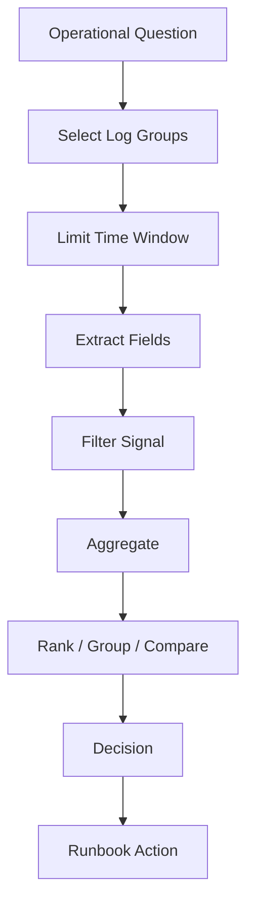
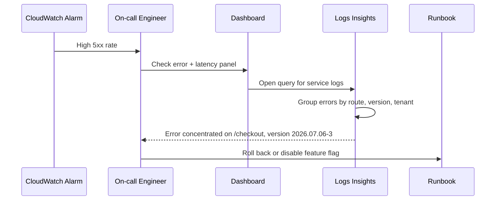
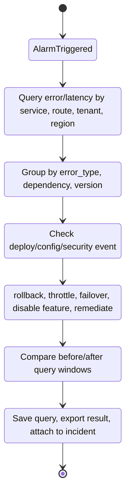

# Part 057 — CloudWatch Logs Insights

> Goal part ini: membuat kita bisa memakai **CloudWatch Logs Insights** sebagai _query engine_ untuk investigasi operasional dan security, bukan sekadar fitur console untuk mencari string error.

Di Part 034 kita membahas **CloudWatch Logs Architecture**: log group, log stream, retention, subscription filter, metric filter, dan routing. Di part ini kita masuk ke lapisan berikutnya: **bagaimana engineer membaca log saat sistem sedang bermasalah**.

CloudWatch Logs Insights adalah tool yang sering terlihat sederhana, tetapi dalam incident nyata ia bisa menjadi pembeda antara:

- “kita punya banyak log tapi tidak tahu apa yang terjadi”, dan
- “dalam 3 menit kita tahu user impact, komponen yang rusak, request pattern, error class, dan kandidat root cause”.

Part ini fokus ke penggunaan praktis, query design, correlation, debugging, security investigation, dan anti-pattern.

---

## 1. Mental Model: Logs Insights adalah Mesin Jawab Pertanyaan

Log bukan tujuan. Log adalah bahan mentah.

Yang dibutuhkan engineer saat incident bukan “lihat semua log”, tetapi jawaban untuk pertanyaan seperti:

- error rate naik dari service mana?
- apakah semua tenant terdampak atau hanya tenant tertentu?
- request mana yang paling lambat?
- deployment terakhir memperkenalkan error baru?
- principal IAM mana yang melakukan perubahan berbahaya?
- apakah ada traffic dari IP aneh?
- apakah timeout terjadi di dependency tertentu?
- apakah alarm disebabkan data hilang, error asli, throttling, atau downstream saturation?

CloudWatch Logs Insights harus dipandang sebagai **question execution engine**.



Jika query tidak menghasilkan keputusan, query itu hanya _log browsing_.

---

## 2. Posisi Logs Insights dalam Observability Stack

Logs Insights bukan pengganti metrics, traces, dashboard, atau SIEM.

Ia berada di titik ketika kita perlu menjawab pertanyaan detail yang tidak bisa dijawab oleh alarm agregat.

| Signal | Pertanyaan yang dijawab | Tool utama | Peran Logs Insights |
|---|---|---|---|
| Metrics | “Apakah sistem sehat?” | CloudWatch Metrics/Alarms | Drill-down dari alarm ke konteks log |
| Logs | “Apa yang terjadi?” | CloudWatch Logs Insights | Query, aggregation, forensic exploration |
| Traces | “Request melewati dependency mana?” | X-Ray / ADOT | Korelasi via trace/correlation ID |
| Events | “Apa yang berubah?” | CloudTrail/EventBridge | Query event operasional dan security |
| Findings | “Apa yang berisiko?” | Security Hub/GuardDuty | Validasi evidence tambahan |

Logs Insights biasanya dipakai setelah alarm berbunyi atau finding muncul.

Contoh flow:



---

## 3. Query Language yang Perlu Diketahui

CloudWatch Logs Insights mendukung beberapa query language. Yang paling umum untuk operasi harian adalah **Logs Insights QL**, dengan command seperti `fields`, `filter`, `parse`, `stats`, `sort`, dan `limit`.

Pola dasarnya:

```sql
fields @timestamp, @message
| filter @message like /ERROR/
| sort @timestamp desc
| limit 20
```

Walaupun sintaksnya terlihat seperti pipeline sederhana, cara berpikirnya penting:

1. pilih field yang relevan,
2. filter noise,
3. parse struktur yang belum otomatis dikenali,
4. agregasi,
5. urutkan berdasarkan dampak,
6. batasi output agar bisa dibaca manusia.

---

## 4. Field Bawaan yang Harus Dihafal

CloudWatch Logs Insights menyediakan field bawaan yang sangat sering dipakai.

| Field | Arti | Kapan dipakai |
|---|---|---|
| `@timestamp` | waktu event log | ordering, time bucket, incident window |
| `@message` | isi log asli | fallback parsing, regex, keyword search |
| `@logStream` | log stream asal | container/task/function/instance correlation |
| `@log` | log group identifier | query lintas log group |
| `@ingestionTime` | waktu log masuk ke CloudWatch | deteksi delay ingestion |
| `@ptr` | pointer ke log event | drill-down ke raw event |

Perbedaan `@timestamp` dan `@ingestionTime` penting.

`@timestamp` biasanya adalah waktu event terjadi. `@ingestionTime` adalah waktu event diterima CloudWatch. Jika pipeline log delay, kedua nilai ini bisa jauh berbeda.

Query delay ingestion:

```sql
fields @timestamp, @ingestionTime, (@ingestionTime - @timestamp) / 1000 as ingestion_delay_seconds, @message
| sort ingestion_delay_seconds desc
| limit 50
```

Gunakan ini ketika alarm terlihat terlambat, dashboard tampak kosong, atau sistem logging mengalami backlog.

---

## 5. Structured Logging: Syarat Agar Query Tidak Menyiksa

Logs Insights sangat kuat jika log berbentuk JSON terstruktur.

Contoh log buruk:

```text
checkout failed for user 48192 because payment timeout
```

Contoh log bagus:

```json
{
  "timestamp": "2026-07-06T10:15:30.120Z",
  "level": "ERROR",
  "service": "checkout-service",
  "environment": "prod",
  "region": "ap-southeast-1",
  "version": "2026.07.06-3",
  "trace_id": "1-668bbf42-abc123",
  "correlation_id": "req-9ef0",
  "tenant_id": "tenant-17",
  "route": "POST /checkout",
  "operation": "authorize-payment",
  "dependency": "payment-gateway",
  "outcome": "failure",
  "error_type": "TimeoutException",
  "latency_ms": 3150,
  "retry_count": 2
}
```

Query log bagus jauh lebih murah secara mental:

```sql
fields @timestamp, service, route, dependency, error_type, latency_ms, correlation_id
| filter level = "ERROR"
| stats count() as errors, pct(latency_ms, 95) as p95_latency by route, dependency, error_type
| sort errors desc
```

Log schema minimum untuk production workload:

| Field | Wajib? | Alasan |
|---|---:|---|
| `service` | Ya | ownership dan routing |
| `environment` | Ya | prod/non-prod separation |
| `region` | Ya | regional blast radius |
| `version` / `build_id` | Ya | deploy correlation |
| `level` | Ya | filtering |
| `trace_id` | Ya | log-trace correlation |
| `correlation_id` / `request_id` | Ya | user request reconstruction |
| `tenant_id` | Jika multi-tenant | tenant blast radius |
| `operation` | Ya | business operation context |
| `route` | Untuk API | endpoint impact |
| `dependency` | Untuk outbound call | downstream fault isolation |
| `latency_ms` | Untuk request/dependency | performance investigation |
| `outcome` | Ya | success/failure grouping |
| `error_type` | Untuk error | classification |

Invariant:

> Tidak ada service production yang boleh log error tanpa `service`, `environment`, `version`, `correlation_id`, dan `error_type`.

---

## 6. Query Anatomy: dari Noise ke Signal

Pola query yang efektif biasanya mengikuti struktur ini:

```sql
fields @timestamp, service, route, error_type, latency_ms, correlation_id
| filter environment = "prod"
| filter level in ["ERROR", "WARN"]
| stats count() as events, pct(latency_ms, 95) as p95 by service, route, error_type
| sort events desc
| limit 20
```

Yang sering salah:

```sql
filter @message like /error/
```

Masalahnya:

- `error` bisa muncul di log normal seperti `error_count=0`,
- casing berbeda,
- banyak false positive,
- tidak tahu service/route/error class,
- tidak ada aggregation.

Query production harus menjawab:

1. apa gejalanya?
2. seberapa besar dampaknya?
3. siapa owner-nya?
4. sejak kapan?
5. perubahan apa yang mungkin berkorelasi?
6. tindakan apa yang masuk akal?

---

## 7. Query Cookbook: Incident API 5xx

### 7.1 Cari endpoint penyumbang error terbesar

```sql
fields @timestamp, service, route, status, error_type, correlation_id
| filter environment = "prod"
| filter status >= 500
| stats count() as errors by service, route, status, error_type
| sort errors desc
| limit 20
```

Interpretasi:

- Jika satu route dominan, masalah mungkin spesifik code path.
- Jika semua route naik, masalah mungkin dependency global, config, auth, network, atau resource saturation.
- Jika satu status dominan, arah investigasi lebih jelas.

### 7.2 Lihat error timeline per 5 menit

```sql
fields @timestamp, status, route
| filter environment = "prod"
| filter status >= 500
| stats count() as errors by bin(5m), route
| sort bin(5m) asc
```

Gunakan untuk melihat apakah error spike dimulai setelah deployment, traffic pattern, failover, atau perubahan config.

### 7.3 Error baru setelah deployment

```sql
fields @timestamp, version, route, error_type, message
| filter environment = "prod"
| filter level = "ERROR"
| stats count() as errors by version, route, error_type
| sort errors desc
```

Jika version baru mendominasi, rollback sering lebih aman daripada debugging panjang.

---

## 8. Query Cookbook: Latency dan Timeout

### 8.1 P95/P99 latency per route

```sql
fields @timestamp, route, latency_ms
| filter environment = "prod"
| filter ispresent(latency_ms)
| stats count() as requests,
        avg(latency_ms) as avg_latency,
        pct(latency_ms, 95) as p95_latency,
        pct(latency_ms, 99) as p99_latency
  by route
| sort p99_latency desc
| limit 20
```

Jangan hanya melihat average. Average sering menyembunyikan tail latency.

### 8.2 Dependency paling lambat

```sql
fields @timestamp, dependency, operation, dependency_latency_ms, outcome
| filter environment = "prod"
| filter ispresent(dependency_latency_ms)
| stats count() as calls,
        pct(dependency_latency_ms, 95) as p95,
        pct(dependency_latency_ms, 99) as p99,
        sum(if(outcome="failure", 1, 0)) as failures
  by dependency, operation
| sort p99 desc
| limit 20
```

Jika dependency latency naik sebelum service latency naik, dependency adalah kandidat kuat.

### 8.3 Timeout by dependency

```sql
fields @timestamp, dependency, error_type, route, correlation_id
| filter environment = "prod"
| filter error_type like /Timeout/
| stats count() as timeouts by dependency, route, error_type
| sort timeouts desc
```

---

## 9. Query Cookbook: Tenant/User Blast Radius

Multi-tenant systems butuh blast radius analysis cepat.

### 9.1 Error per tenant

```sql
fields @timestamp, tenant_id, route, error_type
| filter environment = "prod"
| filter level = "ERROR"
| stats count() as errors by tenant_id, route, error_type
| sort errors desc
| limit 50
```

Interpretasi:

- satu tenant terdampak: kemungkinan data-specific, entitlement-specific, quota-specific, config-specific;
- banyak tenant: kemungkinan platform/service-level issue;
- tenant tertentu selalu muncul: mungkin abuse, malformed data, atau custom integration buruk.

### 9.2 Latency per tenant

```sql
fields tenant_id, latency_ms, route
| filter environment = "prod"
| filter ispresent(tenant_id) and ispresent(latency_ms)
| stats count() as requests,
        pct(latency_ms, 95) as p95,
        pct(latency_ms, 99) as p99
  by tenant_id, route
| sort p99 desc
| limit 50
```

Jangan langsung menuduh tenant besar. Periksa juga request volume.

---

## 10. Query Cookbook: Correlation ID Reconstruction

Saat user memberi komplain dengan request ID/correlation ID, query harus bisa langsung membangun timeline.

```sql
fields @timestamp, service, operation, route, dependency, outcome, error_type, latency_ms, @message
| filter correlation_id = "req-9ef0"
| sort @timestamp asc
| limit 200
```

Jika log schema menyertakan `trace_id`, hubungkan ke X-Ray/Application Signals/ADOT.

```sql
fields @timestamp, service, operation, trace_id, correlation_id, @message
| filter trace_id = "1-668bbf42-abc123"
| sort @timestamp asc
```

Operational rule:

> Setiap customer-facing request harus bisa direkonstruksi lintas service dengan satu identifier.

Tanpa ini, incident response berubah menjadi tebakan.

---

## 11. Query Cookbook: Lambda

Lambda log biasanya mengandung application logs plus platform logs seperti `START`, `END`, dan `REPORT`.

### 11.1 Error dan exception function

```sql
fields @timestamp, @message
| filter @message like /ERROR|Exception|Task timed out|Runtime exited/
| sort @timestamp desc
| limit 100
```

Ini berguna sebagai awal, tetapi lebih baik jika aplikasi log JSON.

### 11.2 Parse Lambda REPORT untuk duration dan memory

Format `REPORT` bisa diparse untuk melihat duration dan memory pressure.

```sql
fields @timestamp, @message
| filter @message like /REPORT RequestId/
| parse @message /Duration: (?<duration_ms>[0-9.]+) ms\s+Billed Duration: (?<billed_ms>[0-9]+) ms\s+Memory Size: (?<memory_mb>[0-9]+) MB\s+Max Memory Used: (?<max_memory_mb>[0-9]+) MB/
| stats avg(duration_ms) as avg_duration,
        pct(duration_ms, 95) as p95_duration,
        max(max_memory_mb) as peak_memory_used
  by memory_mb
```

### 11.3 Timeout symptoms

```sql
fields @timestamp, @message
| filter @message like /Task timed out/
| stats count() as timeouts by bin(5m)
| sort bin(5m) asc
```

Jika timeout naik bersama downstream latency, tuning timeout saja bisa menyembunyikan root cause.

---

## 12. Query Cookbook: ECS / Container Logs

Untuk ECS, pastikan log menyertakan container/task metadata jika memungkinkan.

### 12.1 Error by task version

```sql
fields @timestamp, service, task_definition, container_name, version, error_type, @logStream
| filter environment = "prod"
| filter level = "ERROR"
| stats count() as errors by task_definition, container_name, version, error_type
| sort errors desc
```

### 12.2 Restart/crash symptoms

```sql
fields @timestamp, @message, @logStream
| filter @message like /OutOfMemory|Killed|panic|segmentation fault|exited|CannotPullContainer|ResourceInitializationError/
| sort @timestamp desc
| limit 100
```

ECS task crash sering terlihat sebagai kombinasi application error, container runtime error, dan service event. Jangan hanya query app log; korelasikan dengan ECS service event dan CloudWatch metrics.

---

## 13. Query Cookbook: CloudTrail Investigation

Jika CloudTrail dikirim ke CloudWatch Logs atau query dilakukan via CloudTrail Lake terpisah, prinsip pertanyaannya sama: cari actor, action, resource, source, dan result.

### 13.1 Siapa melakukan destructive action?

```sql
fields @timestamp, eventSource, eventName, userIdentity.type, userIdentity.arn, sourceIPAddress, errorCode, requestParameters
| filter eventName in ["DeleteBucket", "DeleteTrail", "StopLogging", "DeleteKey", "ScheduleKeyDeletion", "AuthorizeSecurityGroupIngress"]
| sort @timestamp desc
| limit 100
```

### 13.2 Access denied spike

```sql
fields @timestamp, eventSource, eventName, userIdentity.arn, errorCode, errorMessage
| filter ispresent(errorCode)
| filter errorCode like /AccessDenied|UnauthorizedOperation|Client.UnauthorizedOperation/
| stats count() as denied by userIdentity.arn, eventSource, eventName, errorCode
| sort denied desc
| limit 50
```

Interpretasi:

- spike pada satu role setelah deployment: kemungkinan permission baru belum diberikan;
- spike lintas banyak action: kemungkinan credential misuse atau automation salah account;
- denied pada security service disable action: mungkin percobaan tampering.

### 13.3 Console login tanpa MFA

```sql
fields @timestamp, userIdentity.arn, sourceIPAddress, responseElements.ConsoleLogin, additionalEventData.MFAUsed
| filter eventName = "ConsoleLogin"
| filter additionalEventData.MFAUsed != "Yes"
| sort @timestamp desc
| limit 100
```

---

## 14. Query Cookbook: VPC Flow Logs

VPC Flow Logs bisa memiliki format default atau custom. Query berikut asumsi field sudah diparse atau format JSON/custom.

### 14.1 Top rejected traffic

```sql
fields @timestamp, srcAddr, dstAddr, dstPort, protocol, action
| filter action = "REJECT"
| stats count() as rejects by srcAddr, dstAddr, dstPort, protocol
| sort rejects desc
| limit 50
```

### 14.2 Outbound traffic ke port tidak biasa

```sql
fields @timestamp, srcAddr, dstAddr, dstPort, bytes, action
| filter action = "ACCEPT"
| filter dstPort not in [80, 443, 53, 123]
| stats sum(bytes) as total_bytes, count() as flows by srcAddr, dstAddr, dstPort
| sort total_bytes desc
| limit 50
```

### 14.3 Data transfer besar keluar

```sql
fields @timestamp, srcAddr, dstAddr, dstPort, bytes, action
| filter action = "ACCEPT"
| stats sum(bytes) as total_bytes by srcAddr, dstAddr, dstPort, bin(5m)
| sort total_bytes desc
| limit 100
```

Query ini bukan bukti exfiltration sendiri. Ia sinyal untuk dikorelasikan dengan CloudTrail, GuardDuty, endpoint policy, dan data classification.

---

## 15. Parsing: Ketika Log Belum JSON

Parsing diperlukan untuk legacy log.

Contoh log:

```text
2026-07-06T10:15:30Z ERROR checkout route=/checkout status=500 latency=3150ms tenant=tenant-17 error=TimeoutException
```

Query:

```sql
fields @timestamp, @message
| parse @message "* * * route=* status=* latency=*ms tenant=* error=*" as ts, level, service, route, status, latency_ms, tenant_id, error_type
| filter level = "ERROR"
| stats count() as errors, pct(latency_ms, 95) as p95 by service, route, error_type
| sort errors desc
```

Namun parsing regex/format string adalah utang teknis observability. Untuk workload baru, gunakan JSON logs.

---

## 16. Aggregation Patterns yang Paling Berguna

### Count by category

```sql
stats count() by error_type
```

### Percentile latency

```sql
stats pct(latency_ms, 50), pct(latency_ms, 95), pct(latency_ms, 99) by route
```

### Time bucket

```sql
stats count() by bin(1m)
```

### Top offenders

```sql
stats count() as n by user_id
| sort n desc
| limit 20
```

### Error ratio jika success/failure ada di log

```sql
stats count() as total,
      sum(if(outcome="failure", 1, 0)) as failures,
      100.0 * failures / total as failure_rate
  by route
| sort failure_rate desc
```

Catatan: untuk SLO resmi, gunakan metrics yang stabil. Logs Insights cocok untuk eksplorasi dan drill-down, bukan selalu sumber utama alarm SLO.

---

## 17. Query Cost dan Performance

Logs Insights memindai data log. Semakin besar rentang waktu dan semakin banyak log group, semakin mahal dan lambat query.

Prinsip cost-aware query:

1. batasi time range seketat mungkin;
2. pilih log group yang relevan;
3. filter awal berdasarkan field yang selektif;
4. pakai structured fields;
5. hindari regex besar pada `@message` jika bisa;
6. simpan query penting sebagai saved query;
7. pertimbangkan field indexing untuk field yang sering dipakai dan selektif;
8. query agregat dulu, raw event belakangan.

Bad:

```sql
fields @message
| filter @message like /Exception/
```

Better:

```sql
fields @timestamp, service, error_type, route, correlation_id
| filter environment = "prod"
| filter level = "ERROR"
| filter error_type = "TimeoutException"
| stats count() by service, route
| sort count desc
```

---

## 18. Saved Queries sebagai Runbook Primitive

Setiap alarm production seharusnya punya link ke query.

Contoh mapping:

| Alarm | Saved query |
|---|---|
| API 5xx high | Top 5xx by route/service/version |
| Lambda timeout | Timeout by function/version + REPORT duration |
| High latency | P95/P99 by route/dependency |
| GuardDuty IAM finding | CloudTrail actor/action/source IP query |
| VPC reject spike | Top rejects by src/dst/port |
| Deployment regression | Errors by version since deploy time |

Runbook yang baik tidak berkata:

> “Check logs.”

Runbook yang baik berkata:

> “Open saved query `checkout-top-errors-by-route`, set time range to alarm start -15m through now, verify whether one version or one dependency dominates.”

---

## 19. Logs Insights dalam Incident Workflow



Logs Insights dipakai minimal di empat titik:

1. scope impact,
2. isolate pattern,
3. validate mitigation,
4. capture evidence.

---

## 20. Query Before/After untuk Validasi Remediation

Setelah rollback atau remediation, jangan hanya melihat alarm. Gunakan query perbandingan.

Misal rollback dilakukan pukul `10:30`.

Before:

```sql
fields @timestamp, route, error_type
| filter @timestamp >= "2026-07-06T10:00:00Z" and @timestamp < "2026-07-06T10:30:00Z"
| filter level = "ERROR"
| stats count() as errors by route, error_type
| sort errors desc
```

After:

```sql
fields @timestamp, route, error_type
| filter @timestamp >= "2026-07-06T10:30:00Z" and @timestamp < "2026-07-06T11:00:00Z"
| filter level = "ERROR"
| stats count() as errors by route, error_type
| sort errors desc
```

Mature operation selalu punya bukti bahwa aksi memperbaiki gejala.

---

## 21. Designing Log Groups for Queryability

Log group design memengaruhi query experience.

Pola umum:

```text
/aws/app/<environment>/<service>
/aws/lambda/<function-name>
/aws/ecs/<cluster>/<service>
/aws/apigateway/<api-name>/<stage>
/aws/security/cloudtrail/<account>/<region>
/aws/network/vpc-flow-logs/<account>/<region>
```

Trade-off:

| Desain | Kelebihan | Risiko |
|---|---|---|
| satu log group per service | mudah ownership, retention, query | query lintas service perlu multi-select |
| satu log group per environment | mudah query semua prod | retention/access terlalu kasar |
| satu log group per runtime unit | detail tinggi | terlalu banyak log group |
| centralized security log group | investigasi security mudah | permission harus ketat |

Rekomendasi praktis:

- pisahkan prod dan non-prod;
- pisahkan application logs dan security/audit logs;
- gunakan naming yang bisa diprediksi;
- set retention by classification;
- tag log group dengan owner, service, environment, data classification;
- jangan mencampur log sensitif dan log umum tanpa alasan kuat.

---

## 22. Access Control untuk Logs Insights

Log adalah data sensitif.

Logs sering mengandung:

- user identifier,
- tenant identifier,
- request payload,
- error stack trace,
- internal endpoint,
- account/resource ARN,
- source IP,
- kadang secret yang tidak sengaja bocor.

Access pattern:

| Role | Akses |
|---|---|
| service owner | log group service sendiri |
| on-call platform | broad operational logs dengan audit |
| security engineer | audit/security logs lintas account |
| developer non-prod | dev/staging logs |
| auditor | read-only evidence, limited query/export |
| third-party support | no direct log access kecuali explicit approval |

Guardrail:

- read access harus pakai IAM Identity Center role;
- query access production harus logged;
- sensitive log group perlu least privilege;
- jangan beri `logs:*` luas ke semua engineer;
- export log harus dikontrol;
- redaction/masking harus diterapkan sebelum log masuk jika memungkinkan.

---

## 23. Security Investigation Patterns

### 23.1 Suspicious API calls

```sql
fields @timestamp, eventSource, eventName, userIdentity.arn, sourceIPAddress, userAgent, errorCode
| filter eventSource in ["iam.amazonaws.com", "sts.amazonaws.com", "s3.amazonaws.com", "kms.amazonaws.com"]
| filter eventName like /Create|Put|Attach|Update|Assume|Delete|Disable|Schedule/
| sort @timestamp desc
| limit 200
```

### 23.2 New access key creation

```sql
fields @timestamp, userIdentity.arn, eventName, requestParameters.userName, sourceIPAddress
| filter eventName = "CreateAccessKey"
| sort @timestamp desc
| limit 100
```

### 23.3 Public exposure changes

```sql
fields @timestamp, eventSource, eventName, userIdentity.arn, requestParameters, sourceIPAddress
| filter eventName in ["PutBucketPolicy", "PutBucketAcl", "PutPublicAccessBlock", "AuthorizeSecurityGroupIngress", "ModifySnapshotAttribute"]
| sort @timestamp desc
| limit 100
```

### 23.4 KMS key deletion scheduling

```sql
fields @timestamp, userIdentity.arn, eventName, requestParameters.keyId, sourceIPAddress
| filter eventSource = "kms.amazonaws.com"
| filter eventName in ["ScheduleKeyDeletion", "DisableKey"]
| sort @timestamp desc
```

---

## 24. Operational Query Pack Per Service

Setiap service production sebaiknya punya query pack minimal.

### API service

- top 5xx by route;
- latency percentile by route;
- error by version;
- dependency timeout;
- tenant blast radius;
- correlation ID reconstruction.

### Worker service

- failed jobs by type;
- retry exhaustion;
- queue lag symptoms;
- poison message detection;
- processing latency;
- dependency failure.

### Batch job

- job duration;
- failed partition;
- records processed;
- bad input classification;
- checkpoint/retry state;
- output validation.

### Security audit

- root usage;
- access key creation;
- IAM policy mutation;
- security service disable attempt;
- public exposure mutation;
- KMS key disable/delete.

### Network

- rejected traffic spike;
- outbound unusual ports;
- top bytes egress;
- flow to unapproved CIDR;
- endpoint/NAT path validation.

---

## 25. Dashboard Links and Query Deep Links

CloudWatch Dashboards dapat memuat Logs Insights widgets. Tetapi jangan memaksa semua query menjadi dashboard widget.

Pilih:

| Kebutuhan | Cocok sebagai dashboard widget? |
|---|---:|
| top 5 errors last 1h | Ya |
| raw log search by correlation ID | Tidak, cocok saved query/runbook |
| top slow endpoints | Ya |
| forensic CloudTrail investigation | Tidak selalu |
| VPC top rejected traffic | Ya untuk security/network dashboard |
| before/after remediation query | Tidak, incident-specific |

Dashboard harus menjawab _state_. Logs Insights ad hoc menjawab _why_.

---

## 26. Logs Insights vs Metric Filters

Metric filters mengubah log menjadi metrics. Logs Insights melakukan query eksploratif.

| Use case | Metric filter | Logs Insights |
|---|---:|---:|
| alarm real-time sederhana | Bagus | Tidak utama |
| ad hoc investigation | Lemah | Bagus |
| aggregation historis fleksibel | Terbatas | Bagus |
| cost predictable alerting | Bagus | Tergantung query |
| parse structured JSON | Bisa, tapi terbatas | Bagus |
| dashboard top-N dynamic | Kadang | Bagus via log widget |

Jika sinyal penting untuk alerting, jangan hanya bergantung pada query manual. Jadikan metric atau instrumentation langsung.

---

## 27. Error Budget dan Logs Insights

Logs Insights bukan sumber paling ideal untuk SLO jangka panjang, tetapi sangat berguna untuk menjelaskan burn.

Contoh:

Alarm mengatakan error budget burn tinggi.

Query:

```sql
fields @timestamp, route, status, tenant_id, version
| filter environment = "prod"
| filter status >= 500
| stats count() as errors by route, tenant_id, version
| sort errors desc
| limit 50
```

Keputusan:

- satu route: rollback route-specific deploy;
- satu tenant: mitigate tenant-specific issue;
- satu version: rollback;
- semua tenant dan semua route: dependency/global infra issue.

---

## 28. Logging Anti-Patterns

### 28.1 Log tanpa context

```text
ERROR timeout
```

Tidak bisa dipakai untuk ownership, impact, atau root cause.

### 28.2 Log terlalu verbose di production

Semua request full payload dilog. Dampaknya:

- biaya tinggi,
- query lambat,
- sensitive data leakage,
- signal tenggelam.

### 28.3 Log rahasia

Password, token, authorization header, API key, session cookie, private key, dan PII sensitif tidak boleh masuk log.

### 28.4 Error ditangkap tapi tidak diklasifikasi

```text
Something went wrong
```

Engineer butuh `error_type`, `dependency`, `operation`, dan `correlation_id`.

### 28.5 Query tanpa time range sempit

Mencari error 30 hari di semua log group saat incident akan lambat dan mahal.

### 28.6 Dashboard memakai raw log table terlalu banyak

Raw logs di dashboard sering membuat noise. Gunakan agregasi top-N, lalu deep-link ke query detail.

---

## 29. Production Checklist

Sebelum service dinyatakan production-ready, pastikan:

- [ ] semua log structured JSON;
- [ ] semua error punya `error_type`;
- [ ] semua request punya `correlation_id` atau `trace_id`;
- [ ] log group punya retention eksplisit;
- [ ] log group punya owner tag;
- [ ] production log access dibatasi;
- [ ] query pack tersedia untuk service owner;
- [ ] runbook alarm berisi saved query;
- [ ] dashboard punya link ke query penting;
- [ ] sensitive data redaction diuji;
- [ ] log ingestion delay dimonitor;
- [ ] query cost dipertimbangkan;
- [ ] security audit query pack tersedia;
- [ ] incident evidence bisa disimpan/dirujuk.

---

## 30. Skill Drill

Bangun query pack untuk satu service API production.

Minimum query:

1. top error by route and version;
2. p95/p99 latency by route;
3. dependency timeout by dependency;
4. tenant blast radius;
5. correlation ID reconstruction;
6. access denied CloudTrail events untuk role service;
7. deployment regression query;
8. before/after remediation query.

Deliverable:

```text
queries/
  api-top-errors.insightsql
  api-latency-percentiles.insightsql
  api-dependency-timeouts.insightsql
  api-tenant-blast-radius.insightsql
  api-correlation-reconstruction.insightsql
  iam-access-denied-service-role.insightsql
  deployment-regression.insightsql
  remediation-before-after.insightsql
```

Untuk setiap query, tulis:

- pertanyaan yang dijawab;
- log group target;
- field dependency;
- interpretasi hasil;
- action berikutnya.

---

## 31. Ringkasan

CloudWatch Logs Insights adalah alat investigasi yang efektif jika log dirancang untuk ditanya.

Mental model utama:

- log bukan tujuan, keputusan adalah tujuan;
- structured logging membuat query murah secara mental;
- query production harus mengagregasi, bukan hanya mencari string;
- setiap alarm harus punya query drill-down;
- setiap service harus punya query pack;
- correlation ID adalah tulang punggung debugging lintas service;
- query harus cost-aware;
- Logs Insights adalah teman metrics/traces, bukan penggantinya.

Jika Part 056 menjelaskan bagaimana alarm berbunyi, Part 057 menjelaskan bagaimana engineer menjawab: **“mengapa alarm ini berbunyi dan apa aksi paling aman berikutnya?”**

---

## References

- AWS Documentation — CloudWatch Logs Insights query syntax: https://docs.aws.amazon.com/AmazonCloudWatch/latest/logs/CWL_QuerySyntax.html
- AWS Documentation — Analyzing log data with CloudWatch Logs Insights: https://docs.aws.amazon.com/AmazonCloudWatch/latest/logs/AnalyzingLogData.html
- AWS Documentation — Sample queries for CloudWatch Logs Insights: https://docs.aws.amazon.com/AmazonCloudWatch/latest/logs/CWL_QuerySyntax-examples.html
- AWS Documentation — Filter and pattern syntax for CloudWatch Logs: https://docs.aws.amazon.com/AmazonCloudWatch/latest/logs/FilterAndPatternSyntax.html
- AWS Documentation — CloudWatch Logs concepts: https://docs.aws.amazon.com/AmazonCloudWatch/latest/logs/CloudWatchLogsConcepts.html
