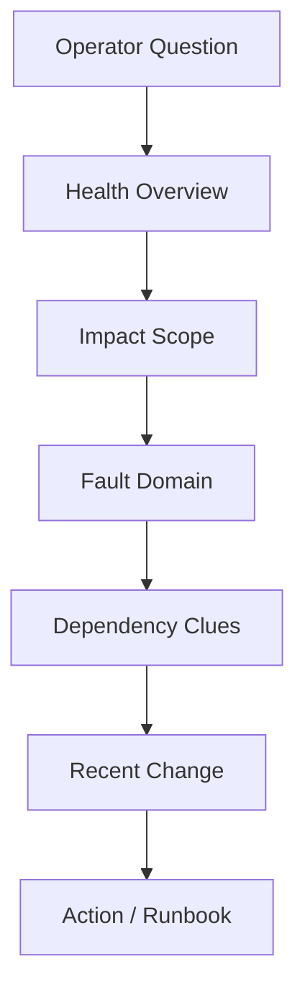
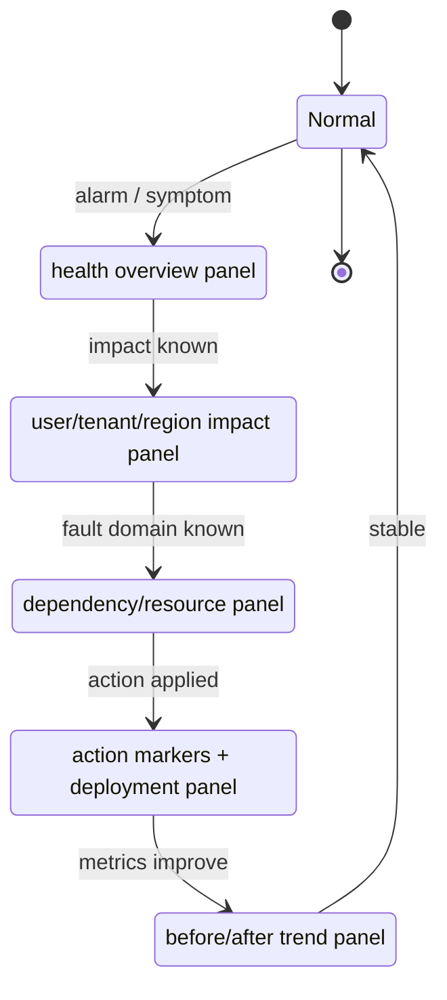
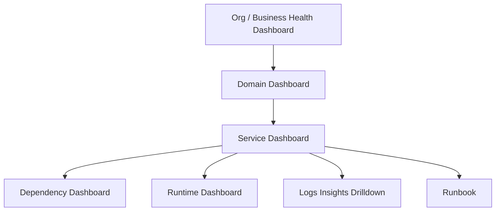
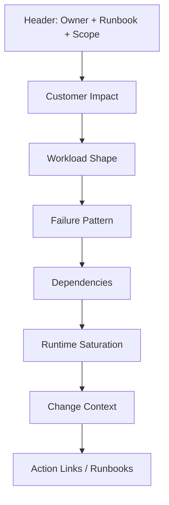
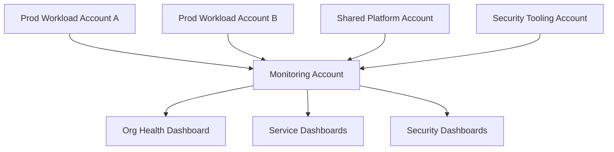

# Part 058 — CloudWatch Dashboards as Operational Map

> Goal part ini: membuat dashboard yang membantu engineer mengambil keputusan saat operasi normal, degradasi, incident, dan post-incident review.

Dashboard yang buruk hanya menampilkan grafik.

Dashboard yang baik menjawab:

- apakah sistem sehat?
- siapa terdampak?
- sejak kapan?
- di komponen mana?
- apakah ini regression, traffic spike, dependency issue, capacity issue, atau security event?
- apakah mitigasi bekerja?
- siapa owner berikutnya?

CloudWatch Dashboard harus dipandang sebagai **operational map**, bukan wallpaper metrik.

---

## 1. Dashboard Bukan Kumpulan Grafik

Grafik tidak otomatis menghasilkan pemahaman.

Dashboard yang efektif memiliki struktur seperti peta:



Dashboard harus mengarahkan mata engineer dari gejala ke keputusan.

Contoh dashboard buruk:

- 45 widget tanpa grouping;
- semua widget memakai warna/scale berbeda;
- tidak ada alarm state;
- tidak ada business metric;
- tidak ada deployment marker;
- tidak ada link runbook;
- tidak jelas service mana yang dimonitor;
- p95/p99 bercampur dengan average tanpa konteks;
- CPU, memory, disk ditampilkan tetapi tidak ada error rate atau user impact.

Contoh dashboard baik:

- section jelas;
- top-level health di atas;
- golden signals terlihat;
- dependency health terlihat;
- alarm state terlihat;
- log query widget untuk top error;
- deployment/version terlihat;
- dashboard punya owner;
- dashboard punya runbook link;
- setiap widget menjawab pertanyaan.

---

## 2. Tiga Jenis Dashboard

Tidak semua dashboard punya audience sama.

| Jenis | Audience | Pertanyaan utama |
|---|---|---|
| Service dashboard | service owner/on-call | apakah service saya sehat dan kenapa? |
| Platform dashboard | platform/SRE/cloud ops | apakah shared platform sehat? |
| Executive/status dashboard | leadership/incident commander | apakah customer impact ada dan apakah membaik? |

Kesalahan umum: satu dashboard mencoba melayani semua audience.

Hasilnya: terlalu ramai untuk executive, terlalu dangkal untuk engineer, terlalu service-specific untuk platform.

---

## 3. Dashboard sebagai State Machine Incident

Dashboard yang baik mengikuti state machine incident.



Setiap section dashboard harus membantu berpindah state:

- dari _degraded_ ke _scoped_,
- dari _scoped_ ke _isolated_,
- dari _isolated_ ke _mitigating_,
- dari _mitigating_ ke _recovering_.

---

## 4. CloudWatch Dashboard Building Blocks

CloudWatch Dashboards dapat menampilkan beberapa jenis widget, termasuk metric widget, alarm widget, text widget, log widget berbasis CloudWatch Logs Insights, dan custom widget.

Jenis widget dan kegunaannya:

| Widget | Gunakan untuk | Hindari untuk |
|---|---|---|
| Metric graph | trend numerik | event detail |
| Single value | SLO/current state | data yang butuh konteks historis |
| Alarm status | operational state | analisis root cause |
| Text widget | runbook, owner, links | dokumen panjang |
| Logs Insights widget | top error, query agregat | raw log stream besar |
| Custom widget | view khusus/integrasi internal | hal yang bisa dilakukan metric biasa |

Dashboard harus komposisional: metrics untuk state, logs untuk clue, text untuk action.

---

## 5. Dashboard Hierarchy

Untuk sistem besar, jangan membuat satu dashboard raksasa.

Gunakan hierarchy:



Contoh:

```text
dashboards/
  org-prod-health.json
  payments-domain-health.json
  checkout-service-health.json
  checkout-service-dependencies.json
  checkout-service-runtime.json
  platform-ecs-health.json
  platform-lambda-health.json
  security-detection-health.json
```

Prinsip:

- top dashboard untuk awareness;
- service dashboard untuk ownership;
- runtime dashboard untuk platform debugging;
- security dashboard untuk risk/detection;
- logs query untuk drill-down.

---

## 6. Golden Signals untuk Service Dashboard

Service dashboard minimal harus menampilkan:

| Signal | Contoh metric |
|---|---|
| Traffic | request count, message count, job count |
| Errors | 5xx, exception count, failed jobs, dependency failures |
| Latency | p50, p95, p99 latency |
| Saturation | CPU, memory, concurrency, queue depth, connection pool |
| Availability | success rate, health check, canary success |
| Dependency | downstream latency/error/throttle |
| Change | deployment/version/config changes |
| Business impact | checkout failures, login failures, payment authorization failures |

Grafik CPU saja tidak cukup. Banyak incident customer-facing terjadi saat CPU normal.

---

## 7. Layout Service Dashboard yang Direkomendasikan

Urutan dashboard penting.

```text
[Header]
  service name, owner, environment, region, runbook link, pager link

[Section 1: Customer Impact]
  availability, error rate, latency, business KPI

[Section 2: Request / Workload Shape]
  traffic, request by route, queue depth, job volume

[Section 3: Failure Pattern]
  top errors, 5xx by route, failed jobs, Logs Insights widget

[Section 4: Dependencies]
  downstream latency, downstream error, throttling, timeout

[Section 5: Runtime Saturation]
  CPU, memory, concurrency, connections, disk, cold start, container restart

[Section 6: Change Context]
  deployment version, config update, feature flags, CloudTrail changes

[Section 7: Runbook / Drilldown]
  saved query links, rollback instructions, escalation owner
```

Mermaid view:



Dashboard harus mengalir dari “apakah user terdampak?” ke “apa yang harus dilakukan?”.

---

## 8. Dashboard untuk API Service

### 8.1 Header

Text widget:

```md
# checkout-service / prod / ap-southeast-1

Owner: Payments Platform Team  
On-call: PagerDuty checkout-primary  
Runbook: checkout-service-incident-runbook  
Rollback: checkout-service-deploy-pipeline  
Critical dependencies: auth-service, payment-gateway, inventory-service
```

### 8.2 Customer impact widgets

- total request count;
- 2xx/4xx/5xx rate;
- p95/p99 latency;
- canary success;
- checkout success rate;
- payment authorization failure rate.

### 8.3 Route-level widgets

- top route by request volume;
- top route by 5xx;
- p99 latency by route;
- throttled route if API Gateway/ALB/application limiter exists.

### 8.4 Dependency widgets

- auth latency/error;
- payment latency/error;
- inventory latency/error;
- database connection pool saturation;
- queue publish failure.

### 8.5 Logs widget

Logs Insights widget:

```sql
fields @timestamp, route, error_type, version
| filter environment = "prod"
| filter level = "ERROR"
| stats count() as errors by route, error_type, version
| sort errors desc
| limit 20
```

This widget answers: “error terbesar datang dari mana?”

---

## 9. Dashboard untuk Worker / Queue Consumer

Worker service tidak selalu punya request/response HTTP. Golden signal-nya berbeda.

| Signal | Metric |
|---|---|
| Input volume | messages received, jobs created |
| Processing success | jobs completed |
| Failure | jobs failed, retries, DLQ count |
| Latency | processing duration, queue age |
| Saturation | concurrency, CPU, memory, thread pool |
| Backpressure | queue depth, oldest message age |
| Poison message | repeated failure by message type |

Layout:

```text
[Impact]
  backlog age, completed jobs, failed jobs

[Flow]
  input rate, processing rate, retry rate

[Failure]
  top failed job type, DLQ growth, poison message candidates

[Runtime]
  concurrency, CPU/memory, container restarts

[Dependencies]
  database latency, external API throttling
```

Logs widget:

```sql
fields @timestamp, job_type, error_type, retry_count
| filter environment = "prod"
| filter outcome = "failure"
| stats count() as failures, max(retry_count) as max_retry by job_type, error_type
| sort failures desc
| limit 20
```

---

## 10. Dashboard untuk Lambda

Lambda dashboard harus memperlihatkan tidak hanya error dan duration, tetapi juga concurrency dan cold-start symptoms.

Widget minimal:

- invocations;
- errors;
- throttles;
- duration p95/p99;
- concurrent executions;
- iterator age jika event source stream;
- DLQ/on-failure destination count;
- async event age;
- memory usage via REPORT parsing/log metric jika dibutuhkan;
- cold start custom metric jika instrumented.

Logs widget timeout:

```sql
fields @timestamp, @message
| filter @message like /Task timed out|Runtime exited|OutOfMemory|ERROR/
| sort @timestamp desc
| limit 50
```

Operational smell:

- duration mendekati timeout terus-menerus;
- throttles naik saat traffic normal;
- async event age naik;
- DLQ naik tanpa alarm;
- p99 tinggi tetapi average normal.

---

## 11. Dashboard untuk ECS / Container Platform

Pisahkan service dashboard dan cluster/platform dashboard.

### Service dashboard

- request/error/latency service;
- task count desired/running;
- deployment version;
- container restart/crash;
- CPU/memory utilization;
- downstream dependency;
- app logs top error.

### Cluster dashboard

- cluster CPU/memory reservation;
- capacity provider status;
- pending tasks;
- service deployment failures;
- ENI/IP exhaustion symptoms;
- task placement failures;
- container insights metrics;
- load balancer target health.

Jangan menaruh semua cluster metrics ke dashboard service biasa kecuali service owner memang perlu mengambil keputusan dari situ.

---

## 12. Dashboard untuk Security Operations

Security dashboard tidak sama dengan service reliability dashboard.

Pertanyaan utama security dashboard:

- apakah detection pipeline hidup?
- ada finding severity tinggi baru?
- ada account/service yang tidak mengirim log?
- ada attempt mematikan security control?
- ada public exposure baru?
- ada credential compromise signal?
- apakah remediation automation berhasil?

Panel minimal:

| Section | Widget |
|---|---|
| Detection health | GuardDuty/Security Hub finding ingestion count |
| Critical findings | new high/critical findings by account/service |
| Control tampering | CloudTrail `StopLogging`, `Disable*`, `Delete*` security service events |
| Exposure | public S3/security group/snapshot findings |
| Identity risk | access key creation, root usage, AssumeRole anomalies |
| Remediation | automation success/failure count |
| Coverage | accounts missing CloudTrail/Config/GuardDuty/Security Hub |

Logs widget for tampering:

```sql
fields @timestamp, eventSource, eventName, userIdentity.arn, sourceIPAddress
| filter eventName in ["StopLogging", "DeleteTrail", "DisableSecurityHub", "DeleteDetector", "StopConfigurationRecorder"]
| sort @timestamp desc
| limit 50
```

---

## 13. Dashboard untuk Platform / Cloud Ops

Platform dashboard harus fokus ke shared infrastructure health.

Contoh sections:

- organization/security service coverage;
- Control Tower drift or account enrollment status;
- centralized logging delivery;
- CloudWatch log ingestion/error;
- NAT gateway throughput/error/drop symptoms;
- VPC endpoint error/traffic;
- Network Firewall metrics;
- Transit Gateway traffic/errors;
- backup job success/failure;
- patch compliance;
- Systems Manager managed node compliance.

Platform dashboard menjawab: “apakah shared substrate sehat?”

---

## 14. Dashboard untuk Incident Commander

Incident commander tidak butuh 80 widget.

Mereka butuh:

- impact;
- scope;
- trend;
- current mitigation;
- owner;
- next checkpoint.

Minimal:

```text
[Incident Status]
  SEV level, active owner, start time, current hypothesis

[Customer Impact]
  availability, error rate, latency, affected business KPI

[Scope]
  region, service, tenant/customer segment

[Trend]
  last 15m / 1h before-after mitigation

[Actions]
  rollback status, failover status, mitigation timestamp
```

Ini biasanya dibuat sebagai dashboard khusus saat incident besar atau sebagai template reusable.

---

## 15. Time Range dan Period Design

Dashboard bisa menipu jika time range salah.

| Use case | Time range | Period |
|---|---:|---:|
| active incident | 15m–3h | 1m/5m |
| deployment validation | 1h–6h | 1m/5m |
| daily operations | 24h | 5m/15m |
| weekly trend | 7d | 1h |
| capacity planning | 30d–90d | 1h/1d |

Jangan memakai period 5m untuk gejala yang butuh respon 1m, dan jangan memakai period 1m untuk monthly trend.

Dashboard harus memiliki time range sesuai keputusan.

---

## 16. Average is a Trap

Average sering membuat sistem tampak sehat.

Contoh:

- 99% request 100 ms;
- 1% request 10 detik;
- average mungkin masih terlihat “cukup baik”;
- p99 menunjukkan user yang sangat terdampak.

Gunakan:

- p50 untuk typical user;
- p95 untuk tail normal;
- p99 untuk worst affected regular users;
- max hanya jika benar-benar berguna;
- error rate untuk availability;
- count untuk volume.

Dashboard API production minimal harus punya p95 dan p99 latency.

---

## 17. Alarm Widgets vs Metric Widgets

Metric graph menunjukkan tren. Alarm menunjukkan state.

Keduanya perlu.

| Widget | Menjawab |
|---|---|
| Alarm widget | apakah kondisi operationally bad? |
| Metric widget | bagaimana pola gejalanya? |
| Logs widget | error/failure apa yang dominan? |
| Text widget | apa aksi berikutnya? |

Dashboard tanpa alarm state memaksa engineer menginterpretasi threshold manual.
Dashboard hanya berisi alarm state tidak membantu root cause.

---

## 18. Dashboard-as-Code

Dashboard production harus dibuat sebagai code.

Alasan:

- reviewable;
- versioned;
- reproducible;
- consistent across environments;
- bisa dipromosikan dari staging ke prod;
- bisa dihapus/diubah dengan audit trail;
- bisa distandardisasi.

Contoh struktur repository:

```text
observability/
  dashboards/
    service-dashboard.template.json
    checkout-service.prod.ap-southeast-1.json
    payment-service.prod.ap-southeast-1.json
  queries/
    checkout-top-errors.insightsql
    checkout-latency-by-route.insightsql
  alarms/
    checkout-5xx-high.yaml
    checkout-p99-latency-high.yaml
```

Dashboard JSON bisa dihasilkan oleh:

- CloudFormation;
- CDK;
- Terraform;
- Pulumi;
- internal dashboard generator;
- script templating sederhana.

Key rule:

> Jika dashboard penting untuk incident, dashboard itu harus ada di version control.

---

## 19. Dashboard Template Per Service

Service onboarding ke production harus menghasilkan dashboard standar.

Input template:

```yaml
service: checkout-service
environment: prod
region: ap-southeast-1
owner: payments-platform
runbookUrl: https://internal/runbooks/checkout
alarmPrefix: checkout-prod
logGroups:
  - /aws/app/prod/checkout-service
criticalRoutes:
  - POST /checkout
  - POST /payment/authorize
dependencies:
  - auth-service
  - payment-gateway
  - inventory-service
```

Output:

- dashboard JSON;
- alarm definitions;
- saved query pack;
- runbook links;
- owner tag.

This is how dashboards scale across many services without becoming artisanal.

---

## 20. Cross-Account and Cross-Region Dashboards

Dalam multi-account AWS, production workload biasanya tersebar di banyak account dan region.

CloudWatch mendukung cross-account observability sehingga monitoring account dapat melihat metrics, logs, traces, dan related telemetry dari source accounts, sesuai konfigurasi. CloudWatch dashboard juga bisa dibuat cross-account/cross-region untuk merangkum metrics dari beberapa account dan region.

Design pattern:



Gunakan monitoring account untuk:

- centralized read visibility;
- executive/org dashboards;
- cross-service incident view;
- platform dashboard;
- correlation during incident.

Jangan gunakan monitoring account sebagai dumping ground tanpa ownership.

---

## 21. Dashboard Permission Model

Dashboard bisa mengekspos data sensitif.

Access model:

| Dashboard | Audience | Risk |
|---|---|---|
| service health | service owner, SRE | service topology, tenant hints |
| security dashboard | security team | sensitive findings, actor/source IP |
| exec dashboard | leadership | limited operational status |
| incident dashboard | incident responders | broad temporary visibility |
| platform dashboard | platform/cloud ops | infrastructure internals |

Controls:

- dashboard read permission via IAM Identity Center roles;
- separate security dashboards from general engineering dashboards;
- avoid raw PII in log widgets;
- restrict custom widgets that call privileged APIs;
- review cross-account observability scopes;
- include dashboard ownership tags.

---

## 22. Widget Design Grammar

### 22.1 One widget, one question

Bad title:

```text
Service metrics
```

Good title:

```text
5xx rate by route — is customer-facing failure increasing?
```

### 22.2 Put thresholds in title or alarm

If p99 latency must be below 800 ms, make it visible.

```text
p99 latency by route — threshold 800 ms
```

### 22.3 Use consistent units

Do not mix milliseconds and seconds without clear labels.

### 22.4 Align time ranges

Comparing widgets with different periods/time windows can mislead.

### 22.5 Show impact before internals

Customer impact first. CPU later.

### 22.6 Avoid vanity metrics

If nobody takes action from a metric, remove it or move it to a deeper dashboard.

---

## 23. Dashboard Smells

| Smell | Meaning | Fix |
|---|---|---|
| 50+ widgets | no prioritization | split dashboard hierarchy |
| CPU first | infra-centric view | put user impact first |
| no owner | nobody maintains it | add owner/runbook text widget |
| no alarm state | ambiguous health | add alarm widgets |
| no logs drilldown | slow incident triage | add Logs Insights top-N widgets |
| only averages | tail hidden | add p95/p99 |
| no deployment context | hard to correlate change | add version/deployment markers |
| manual dashboard edits | drift | dashboard-as-code |
| stale widgets | false confidence | dashboard review process |
| same dashboard for everyone | audience mismatch | create audience-specific dashboards |

---

## 24. Dashboard Review Process

Dashboard juga perlu lifecycle.

Review setiap quarter atau setelah major incident:

- widget mana yang dipakai saat incident?
- widget mana yang tidak pernah dipakai?
- metric mana yang membingungkan?
- apakah dashboard mempercepat diagnosis?
- apakah dashboard menunjukkan customer impact?
- apakah dashboard punya owner?
- apakah runbook links valid?
- apakah log widgets masih bekerja?
- apakah service/dependency baru sudah masuk?
- apakah dashboard-as-code masih sinkron?

Post-incident review harus mencatat dashboard gaps.

Contoh PIR action:

```text
Observation: On-call could not distinguish payment-gateway timeout from inventory timeout.
Action: Add dependency latency/error widgets grouped by dependency and operation.
Owner: payments-platform
Due: 2026-07-20
```

---

## 25. Dashboard and Runbook Coupling

Dashboard menunjukkan state. Runbook memberi aksi.

Dashboard tanpa runbook membuat engineer tahu sistem sakit tetapi tidak tahu tindakan aman.
Runbook tanpa dashboard membuat engineer tahu prosedur tetapi tidak tahu kapan menerapkannya.

Text widget minimal:

```md
## Runbook

- SEV2 checkout incident: https://internal/runbooks/checkout-sev2
- Rollback: https://internal/deploy/checkout/rollback
- Feature flags: https://internal/flags/checkout
- Saved queries: https://internal/queries/checkout
- Escalation: #payments-oncall
```

Saat incident, setiap detik yang dihemat dari mencari link adalah value.

---

## 26. Logs Insights Widgets in Dashboards

Logs widget harus agregatif.

Good:

```sql
fields @timestamp, route, error_type, version
| filter environment = "prod"
| filter level = "ERROR"
| stats count() as errors by route, error_type, version
| sort errors desc
| limit 10
```

Bad:

```sql
fields @timestamp, @message
| sort @timestamp desc
| limit 100
```

Raw log stream di dashboard cepat menjadi noise. Gunakan raw logs hanya untuk drill-down.

Good log widgets:

- top errors by route/version;
- top dependency timeouts;
- top failed jobs;
- recent security control tampering events;
- top VPC rejects by src/dst/port;
- top access denied IAM events.

---

## 27. Deployment and Change Context

Banyak incident berkorelasi dengan perubahan.

Dashboard service harus memperlihatkan:

- current deployed version;
- deployment timestamp;
- deployment success/failure;
- config change count;
- feature flag changes;
- infrastructure changes;
- dependency version changes jika tersedia.

Jika tidak bisa menampilkan deployment marker langsung, minimal sediakan link ke deployment pipeline dan query CloudTrail/Config.

Change query example:

```sql
fields @timestamp, eventSource, eventName, userIdentity.arn, requestParameters
| filter eventName in ["UpdateService", "UpdateFunctionCode", "PutParameter", "UpdateDistribution", "ModifyDBInstance"]
| sort @timestamp desc
| limit 50
```

Operational invariant:

> Dashboard production harus membantu menjawab “apa yang berubah?”

---

## 28. Business Metrics in Engineering Dashboard

Untuk sistem customer-facing, business KPI harus muncul berdampingan dengan technical metrics.

Contoh:

| Service | Business metric |
|---|---|
| checkout | checkout success/failure |
| payment | authorization success rate |
| identity | login success rate |
| search | search result latency + zero-result rate |
| messaging | message delivered/failed |
| compliance workflow | case transition success/failure |

Technical health tanpa business metric bisa menipu.

Contoh:

- API 200 OK, tetapi checkout state transition gagal secara asynchronous;
- queue consumer sehat, tetapi job output invalid;
- database CPU normal, tetapi user journey stuck;
- Lambda tidak error, tetapi downstream silently rejects.

Dashboard harus mencakup **user journey health**.

---

## 29. Security and Compliance Dashboard Evidence

Dashboard juga bisa menjadi evidence entry point, tetapi jangan jadikan dashboard sebagai satu-satunya evidence.

Security/compliance dashboard sebaiknya menampilkan:

- security service coverage;
- control compliance trend;
- finding count by severity;
- unresolved critical findings;
- remediation SLA breach;
- backup success/restore test;
- patch compliance;
- logging delivery health;
- accounts without required baseline.

Namun evidence resmi tetap harus berasal dari source of truth:

- CloudTrail;
- AWS Config;
- Security Hub;
- Audit Manager;
- ticketing system;
- artifact repository;
- S3 log archive.

Dashboard mempercepat navigation; evidence system memberi audit defensibility.

---

## 30. Dashboard Rollout Strategy

Jangan menunggu semua sempurna.

Rollout bertahap:

1. buat template minimal untuk satu critical service;
2. pakai saat on-call selama satu minggu;
3. catat pertanyaan yang tidak terjawab;
4. tambahkan widget berdasarkan gap nyata;
5. jadikan template;
6. apply ke 5 service berikutnya;
7. standardisasi tags/owner/runbook;
8. enforce dashboard-as-code untuk service production baru.

Dashboard terbaik biasanya lahir dari incident nyata, bukan dari rapat arsitektur panjang.

---

## 31. Production Dashboard Checklist

Untuk setiap service production:

- [ ] dashboard dibuat sebagai code;
- [ ] dashboard punya owner;
- [ ] dashboard punya runbook link;
- [ ] dashboard punya alarm state;
- [ ] customer impact terlihat di section pertama;
- [ ] traffic/error/latency/saturation terlihat;
- [ ] p95/p99 latency ada;
- [ ] dependency health ada;
- [ ] deployment/change context ada;
- [ ] Logs Insights top error widget ada;
- [ ] dashboard time range sesuai use case;
- [ ] metrics punya unit jelas;
- [ ] no stale widget;
- [ ] no excessive raw log widgets;
- [ ] security/privacy review dilakukan untuk log widgets;
- [ ] dashboard link masuk ke runbook dan alarm description;
- [ ] cross-account/cross-region visibility teruji jika diperlukan.

---

## 32. Skill Drill

Ambil satu service production atau staging.

Buat dashboard dengan section:

1. Header: owner, runbook, environment, region.
2. Customer Impact: success rate, error rate, p95/p99 latency, business KPI.
3. Workload Shape: request count, route volume, queue/job volume jika ada.
4. Failure Pattern: top errors via Logs Insights widget.
5. Dependencies: latency/error by dependency.
6. Runtime Saturation: CPU/memory/concurrency/thread/connection pool.
7. Change Context: deployed version, recent changes, deployment link.
8. Action: rollback link, saved query links, escalation.

Lalu jawab:

- dalam 60 detik, bisakah on-call tahu user impact?
- dalam 3 menit, bisakah on-call tahu komponen kandidat root cause?
- dalam 5 menit, bisakah on-call tahu aksi aman berikutnya?
- apakah dashboard berguna untuk incident commander?
- apakah dashboard terlalu detail untuk audience-nya?

---

## 33. Ringkasan

CloudWatch Dashboard adalah peta operasional.

Prinsip utama:

- dashboard harus menjawab pertanyaan, bukan memamerkan data;
- customer impact harus muncul sebelum infrastructure internals;
- satu audience, satu dashboard intent;
- dashboard harus mengalir dari health → impact → fault domain → action;
- alarm, metrics, logs, dan runbook harus dikaitkan;
- dashboard penting harus dibuat sebagai code;
- cross-account dashboards penting untuk organisasi multi-account;
- dashboard harus direview setelah incident;
- widget yang tidak membantu keputusan adalah noise.

Jika Part 057 memberi kita kemampuan bertanya ke log, Part 058 memberi kita kemampuan menyusun peta agar engineer tahu **pertanyaan mana yang harus ditanyakan lebih dulu**.

---

## References

- AWS Documentation — Using Amazon CloudWatch dashboards: https://docs.aws.amazon.com/AmazonCloudWatch/latest/monitoring/CloudWatch_Dashboards.html
- AWS Documentation — Dashboard body structure and syntax: https://docs.aws.amazon.com/AmazonCloudWatch/latest/monitoring/CloudWatch-Dashboard-Body-Structure.html
- AWS Documentation — Creating a cross-account cross-Region dashboard: https://docs.aws.amazon.com/AmazonCloudWatch/latest/monitoring/create_xaxr_dashboard.html
- AWS Documentation — CloudWatch cross-account observability: https://docs.aws.amazon.com/AmazonCloudWatch/latest/monitoring/CloudWatch-Unified-Cross-Account.html
- AWS Documentation — Cross-account cross-Region CloudWatch console: https://docs.aws.amazon.com/AmazonCloudWatch/latest/monitoring/Cross-Account-Cross-Region.html
