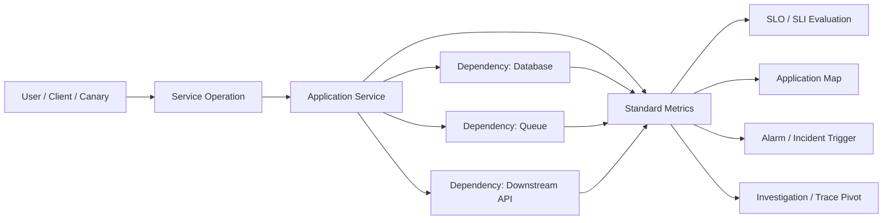
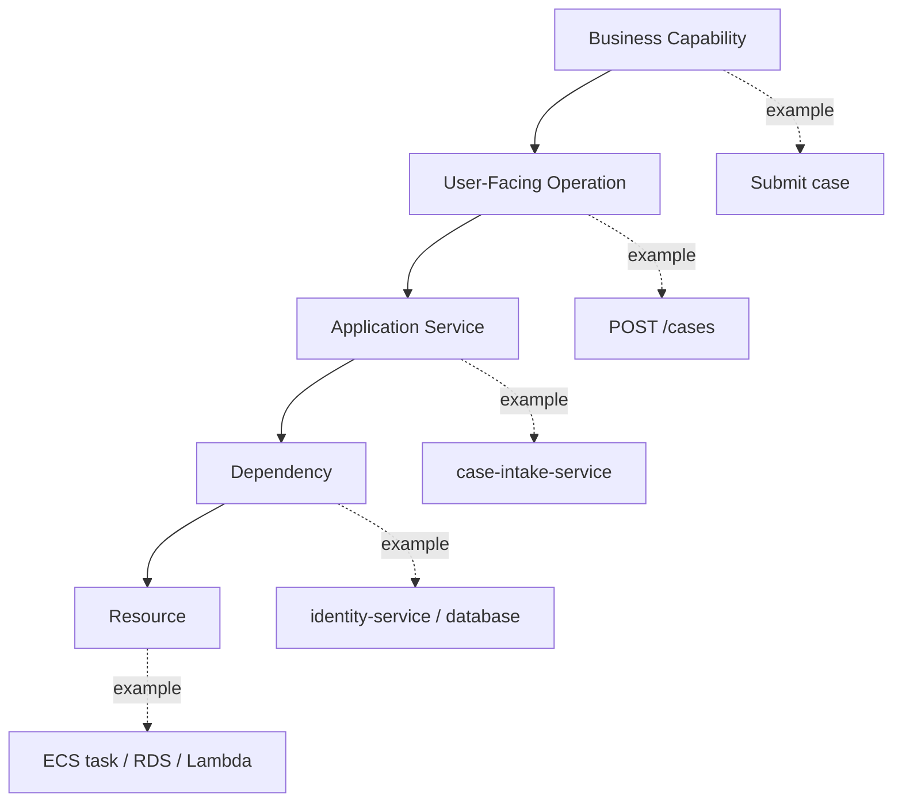
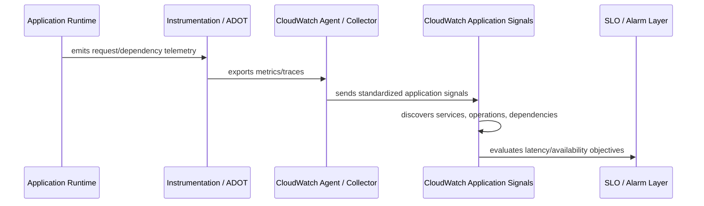
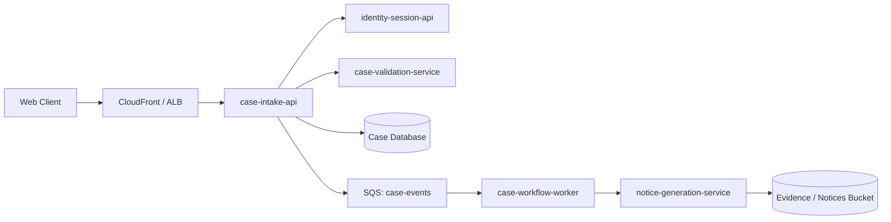
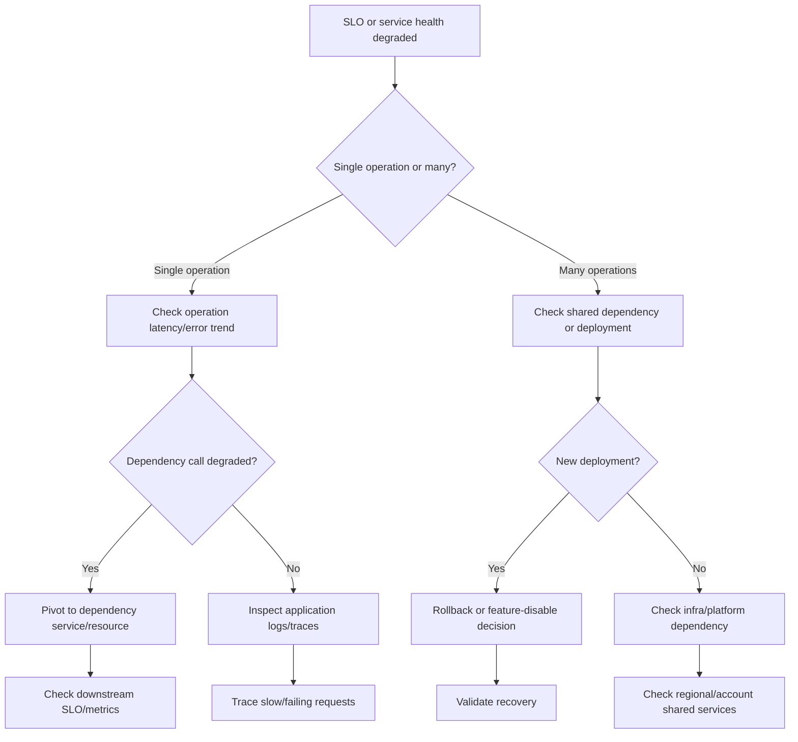
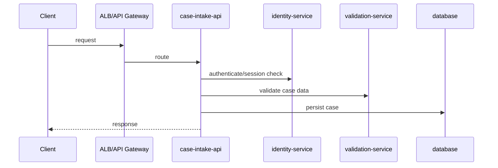
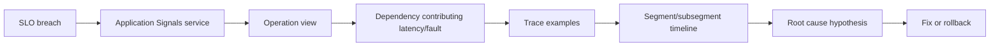
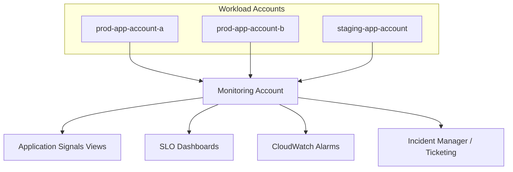

# Part 059 — Application Signals and Service Health

A production system is not healthy because every host is up.

A production system is healthy when the user-facing operations that matter are meeting their expected quality: availability, latency, correctness, and dependency behavior.

That distinction is why **CloudWatch Application Signals** matters.

Classic monitoring often starts from infrastructure:

- CPU is high.
- Memory is low.
- ALB target health changed.
- Lambda errors increased.
- ECS task restarted.

Those signals are useful, but they are not the user journey. Application Signals shifts the starting point from infrastructure to **services, operations, dependencies, and SLOs**.

The goal is not to replace logs, metrics, traces, dashboards, or X-Ray. The goal is to create a service-health layer that answers the operational question faster:

> Which service operation is failing the user expectation, what dependency is contributing to it, and how much reliability budget are we burning?

AWS Application Signals is part of CloudWatch Application Performance Monitoring. It uses telemetry, largely OpenTelemetry-oriented instrumentation, to discover services and collect standardized application metrics. It can display service maps, service operations, dependency relationships, latency, fault, error, and service-level objective status.

This part focuses on usage and implementation: how to model service health, how to onboard workloads, how to design SLOs, how to debug operational degradation, and how to avoid turning Application Signals into another dashboard nobody trusts.

---

## 1. The Core Mental Model

Application Signals should be treated as a **service health control plane**.

It has four jobs:

1. Discover services and operations.
2. Measure standard service behavior.
3. Relate services to dependencies.
4. Attach SLOs to the operations that matter.

A simplified model looks like this:



The important conceptual shift is this:

| Old question | Better question |
|---|---|
| Is the EC2 instance healthy? | Is checkout still meeting its latency and availability SLO? |
| Are logs being emitted? | Can we reconstruct which operation failed and why? |
| Is CPU high? | Is CPU causing user-visible degradation or just background load? |
| Did a service error? | Which dependency contributed to the error budget burn? |
| Is the dashboard green? | Are the customer-critical operations still within their objective? |

Infrastructure metrics describe **resource condition**.

Application Signals describes **service behavior**.

Both are necessary, but they answer different questions.

---

## 2. Where Application Signals Fits in the Observability Stack

Application Signals is not a full observability replacement. It is a curated service-health layer on top of application telemetry.

A practical AWS observability stack usually has these layers:

| Layer | Primary Question | AWS Services / Tools |
|---|---|---|
| Infrastructure metrics | Are resources saturated, failing, throttled, or unavailable? | CloudWatch Metrics, Container Insights, Lambda metrics, RDS metrics |
| Logs | What happened in application/system detail? | CloudWatch Logs, Logs Insights, Firehose/S3/SIEM |
| Traces | What path did a request take and where was time spent? | X-Ray, AWS Distro for OpenTelemetry, OpenTelemetry collectors |
| Service health | Which service/operation/dependency is degraded? | CloudWatch Application Signals |
| SLOs | Are we meeting the target quality over a window? | Application Signals SLOs, CloudWatch alarms |
| Incident response | Who acts, what runbook, what escalation? | Incident Manager, EventBridge, OpsCenter, ticketing systems |
| Security telemetry | Is behavior suspicious or policy-violating? | GuardDuty, Security Hub, CloudTrail, Config, Detective |

Application Signals is strongest when you want a high-level operational view:

- service list;
- service map;
- service operation metrics;
- dependency metrics;
- SLO attainment;
- fast pivot to traces, logs, alarms, and investigations.

It is weaker if you expect it to solve domain-level correctness by itself. For example, it can observe availability and latency, but it will not know whether an enforcement lifecycle decision was legally valid unless your application emits domain-specific telemetry.

The right design is to combine Application Signals with domain-level metrics.

Example:

| Service | Standard signal | Domain signal |
|---|---|---|
| Case intake API | Availability, latency, error rate | Case submission accepted/rejected count by validation category |
| Payment API | Latency, faults, dependency call | Authorization failure by bank reason code |
| Enforcement workflow | Operation duration | Escalation state transition lag, appeal-window breach count |
| Document generation | Error rate | Generated notice count, malformed template count |

Application Signals gives you the operational shell. Your domain metrics give you semantic meaning.

---

## 3. Service Health Is Not Resource Health

A common monitoring mistake is to equate resource health with service health.

An ECS service can be stable while users experience failures.

A Lambda function can have low duration while returning invalid business results.

An RDS instance can be healthy while a specific query path is locked or timing out.

A service can be degraded even when every infrastructure dashboard is green.

For Application Signals, model health around three scopes:



The failure can occur at any level:

| Level | Example Failure | Detection Signal |
|---|---|---|
| Business capability | Users cannot submit cases | SLO burn, synthetic canary, domain metric |
| User-facing operation | `POST /cases` p95 latency breaches | Operation latency SLI |
| Service | `case-intake-service` throws 5xx | Fault/error metric |
| Dependency | `identity-service` dependency latency spikes | Dependency metric/service map |
| Resource | RDS CPU/lock wait increases | Infrastructure metric/logs |

Application Signals helps bridge the middle: from operation to service to dependency.

---

## 4. What Application Signals Collects Conceptually

Application Signals collects standardized telemetry about services and dependencies. The exact metric names and dimensions can evolve, but the operational concepts are stable:

| Signal | Meaning | Typical Use |
|---|---|---|
| Availability | Percentage of successful requests or operations | SLO target, outage detection |
| Latency | Time taken for service operation or dependency call | SLO target, performance regression |
| Faults | Server-side failures | Incident trigger, dependency fault isolation |
| Errors | Request errors, often client or application-level depending source | Bad release detection, misuse detection |
| Dependency calls | How services call downstream resources | Service map, blast-radius analysis |
| Operation identity | Endpoint, operation, method, or logical unit | SLO definition, ownership |
| Service identity | Workload/service name | Routing, dashboard, ownership |

Do not read these signals as perfect truth. They are telemetry generated by instrumentation and classification rules.

Always ask:

- Is this service correctly named?
- Are operations grouped correctly?
- Are health metrics derived from the right success/failure semantics?
- Are dependencies visible or hidden behind libraries/proxies?
- Is sampling hiding rare but critical failures?
- Are business-level failures returning HTTP 200 and therefore invisible to availability metrics?

A good observability engineer treats telemetry as evidence, not gospel.

---

## 5. Implementation Surfaces

Application Signals can be enabled for several workload environments, such as EKS/Kubernetes, ECS, EC2, and Lambda depending on runtime and setup path. Implementation commonly involves CloudWatch Agent, AWS Distro for OpenTelemetry, OpenTelemetry instrumentation, or Lambda layers.

The broad implementation pattern is:



The workload-specific mechanics vary, but the engineering invariants stay the same:

1. Every service must have a stable service name.
2. Every critical operation must be observable.
3. Every dependency call should be visible or intentionally excluded.
4. Telemetry must include enough dimensions for ownership and environment separation.
5. SLOs must be attached to user/business critical operations, not random endpoints.
6. Alarms must route to an owner and runbook.
7. Instrumentation changes must be tested before production rollout.

---

## 6. Naming Is a Control

Application Signals depends heavily on service identity. Bad naming causes bad ownership, broken dashboards, duplicate services, and unreliable SLO reporting.

Treat service naming as governance.

A practical naming convention:

```text
<business-domain>-<capability>-<runtime-role>
```

Examples:

```text
case-intake-api
case-workflow-worker
case-notification-dispatcher
identity-session-api
billing-reconciliation-worker
```

Avoid names like:

```text
app
backend
service
api
lambda-prod
ecs-service-1
java-service
```

Those names might be valid deployment names but poor operational identities.

Minimum identity dimensions:

| Dimension | Example | Why it matters |
|---|---|---|
| `service.name` | `case-intake-api` | Ownership and service map node |
| `deployment.environment` | `prod`, `staging` | Prevents noisy cross-environment aggregation |
| `service.version` | `2026.07.06.3` | Release regression analysis |
| `aws.account.id` | `123456789012` | Multi-account audit and routing |
| `aws.region` | `ap-southeast-1` | Regional blast-radius isolation |
| `team.owner` | `case-platform` | Alert and backlog assignment |
| `business.criticality` | `tier-1` | SLO and incident priority |

Do not overdo high-cardinality dimensions. Identity dimensions must help operational decisions. User ID, case ID, request ID, and tenant ID may belong in logs/traces, not necessarily metrics.

---

## 7. Application Signals and SLOs

An SLO is not an alarm threshold with a fancier name.

An SLO is a reliability contract over a time window.

Basic terms:

| Term | Meaning |
|---|---|
| SLI | The measured indicator, such as availability or latency. |
| SLO | The target for the SLI, such as 99.9% availability over 28 days. |
| Error budget | The allowed amount of unreliability before the objective is missed. |
| Burn rate | How quickly the system is consuming the error budget. |
| Attainment | Whether measured performance meets the objective. |

Application Signals can create SLOs for discovered services/operations or CloudWatch metrics/math expressions.

Good SLO candidates:

- user-facing request availability;
- p95 or p99 latency for critical operations;
- dependency availability for a critical downstream service;
- synthetic canary success for a public journey;
- background job completion freshness;
- queue age for asynchronous operations.

Bad SLO candidates:

- CPU utilization below 70%;
- all logs ingested successfully;
- every internal debug endpoint below 100ms;
- deployment succeeded;
- zero warnings in logs;
- every request below p99.999 latency.

Those may be useful metrics, but not necessarily service-level objectives.

---

## 8. Picking the Right SLO Shape

Different operations need different SLOs.

| Operation Type | Better SLO Shape | Example |
|---|---|---|
| User-facing synchronous API | Availability + latency | 99.9% successful requests and p95 < 400ms over 28 days |
| Internal dependency | Availability + latency | identity-service dependency p95 < 150ms |
| Async processing | Freshness/age | 99% of messages processed within 5 minutes |
| Batch job | Completion and duration | daily reconciliation completes before 02:00 UTC |
| Workflow transition | State transition lag | 99% of escalations move within SLA window |
| Public static/API edge | Synthetic journey | canary success rate > 99.5% |

SLOs should map to user or business harm.

For a regulatory case platform, useful SLOs might be:

| Capability | SLI | SLO |
|---|---|---|
| Case submission | Successful `POST /cases` requests | 99.9% over 28 days |
| Case search | p95 latency for search operation | p95 < 800ms for 99% of 1-hour windows |
| Evidence upload | Completed uploads excluding user cancellation | 99.5% over 28 days |
| Escalation worker | Event processing lag | 99% below 2 minutes |
| Notice generation | Successful document generation | 99.7% over 28 days |

The SLO is the contract. The dashboard is only the instrument panel.

---

## 9. SLOs and Incident Severity

SLO status should influence incident severity, but not blindly.

A reasonable mapping:

| Condition | Severity |
|---|---|
| Tier-1 customer-facing SLO is burning error budget rapidly | SEV-1 or SEV-2 |
| Tier-1 SLO is slowly degrading but still under target | SEV-2 or SEV-3 |
| Internal dependency SLO breached with no user impact yet | SEV-3, watch/escalate |
| Non-critical operation SLO breached | SEV-4/backlog unless trend worsens |
| SLO breach caused by planned maintenance | Annotated event, no incident if approved |

Do not use SLO alarms as noise generators. Every SLO alarm needs:

- owner;
- severity mapping;
- runbook;
- dashboard link;
- trace/log pivot strategy;
- rollback decision rule;
- customer communication rule if applicable.

---

## 10. Service Map as a Runtime Architecture Diagram

The Application Signals service map is useful because it is generated from runtime behavior.

Static architecture diagrams often lie over time. Service maps expose what actually talks to what.

Use the map to answer:

- What calls this service?
- What does this service depend on?
- Is a dependency degraded?
- Is a new dependency appearing after a release?
- Does production call a non-production endpoint?
- Does a service bypass an intended API boundary?
- Are retries amplifying load against a downstream dependency?

Example operational topology:



A service map should trigger architectural questions:

- Why is `case-intake-api` directly calling the database and workflow service?
- Should validation be synchronous or asynchronous?
- Which dependency is in the critical path?
- Which node owns the user-visible latency budget?
- Is `notice-generation-service` part of the user request path or a background path?

Application Signals can show topology, but engineers must still interpret architecture.

---

## 11. Dependency Health and Blast Radius

One of the most useful Application Signals patterns is dependency health isolation.

When a service degrades, do not start from CPU. Start from the request path.

A simple triage decision tree:



This triage pattern prevents random debugging.

Without dependency visibility, teams often jump between logs, metrics, and guesses. With dependency health, you can ask sharper questions:

- Is latency inside this service or downstream?
- Is the downstream dependency slow for everyone or only for this caller?
- Did the caller change retry behavior?
- Is the downstream dependency returning errors or timing out?
- Did only one operation start calling a new dependency?

---

## 12. Instrumentation Strategy

Application Signals can be enabled through supported instrumentation paths, including AWS Distro for OpenTelemetry and CloudWatch Agent based approaches depending on runtime and environment.

Treat instrumentation like production code.

A safe rollout plan:

1. Pick one non-critical service in staging.
2. Enable instrumentation with stable service name and environment dimension.
3. Validate that service appears once, not many times under inconsistent names.
4. Generate synthetic load across critical operations.
5. Validate operations are grouped correctly.
6. Confirm dependency calls appear as expected.
7. Check cardinality and cost impact.
8. Deploy to one production canary service.
9. Validate dashboards, SLOs, alarms, and runbook links.
10. Roll out through platform templates.

Do not let every team invent instrumentation independently.

Create platform-level standards:

| Standard | Example |
|---|---|
| Service name convention | `domain-capability-role` |
| Environment names | `prod`, `staging`, `dev`, `sandbox` |
| Runtime version dimension | semantic deployment version or image digest |
| Owner tag | team or service catalog owner |
| Criticality tag | tier-1/tier-2/tier-3 |
| Trace propagation | W3C trace context or X-Ray-compatible context strategy |
| Logs correlation | trace ID and request ID in structured logs |
| SLO definition | code-owned or IaC-owned, not console-only |

Instrumentation drift is real. Make standards enforceable.

---

## 13. Service Catalog Integration

Application Signals becomes much more useful when connected to a service catalog.

A service health page should answer:

| Question | Source |
|---|---|
| What is this service? | Service catalog |
| Who owns it? | Service catalog / tags |
| Is it healthy? | Application Signals |
| What are its SLOs? | Application Signals / IaC |
| What dependencies does it call? | Application Signals service map |
| What dashboards matter? | CloudWatch Dashboard links |
| How do we respond? | Runbook |
| What changed recently? | Deployment pipeline / CloudTrail / change calendar |
| What security findings exist? | Security Hub |
| What vulnerabilities exist? | Inspector |

The stronger pattern is to make service metadata a source of truth:

```yaml
service: case-intake-api
owner: case-platform
criticality: tier-1
environment: prod
runtime: ecs-fargate
slo:
  availability: 99.9
  latency_p95_ms: 400
runbooks:
  latency: runbooks/case-intake-latency.md
  availability: runbooks/case-intake-availability.md
alerts:
  pager: case-platform-primary
```

Then use that metadata to generate:

- tags;
- dashboards;
- SLO definitions;
- alarm routing;
- documentation;
- ownership views;
- audit reports.

This prevents Application Signals from becoming another disconnected console feature.

---

## 14. Latency Budget Thinking

Latency is not a single number. It is a budget distributed across hops.

Example:



If the end-to-end p95 target is 400ms, the budget might be:

| Component | Budget |
|---|---:|
| Edge overhead | 30ms |
| Intake service compute | 80ms |
| Identity dependency | 70ms |
| Validation dependency | 80ms |
| Database write | 100ms |
| Serialization/network margin | 40ms |
| Total | 400ms |

Application Signals helps you observe whether dependency latency is consuming the budget.

A useful operational practice:

- define end-to-end SLO;
- define dependency budgets;
- monitor dependency latency;
- alert only on sustained impact or fast error-budget burn;
- debug with traces when budget shifts.

Without latency budgets, teams argue emotionally about “slow”. With budgets, the conversation becomes evidence-based.

---

## 15. Availability Semantics

Availability sounds simple. It is not.

An HTTP 200 response can still be a business failure. An HTTP 409 can be expected. A 4xx can indicate user error, not service unavailability. A timeout after a successful side effect can create ambiguous state.

Define availability per operation.

Example:

| Operation | Successful | Not Successful but Expected | Failure |
|---|---|---|---|
| Submit case | 201 created | 400 validation error, 409 duplicate | 5xx, timeout, dependency failure |
| Search case | 200 with results or empty list | 403 unauthorized | 5xx, timeout |
| Upload evidence | completed multipart upload | user cancellation | storage failure, malware scan failure |
| Generate notice | document generated | template missing due to invalid request | renderer crash, invalid PDF output |

Application Signals can detect technical success/failure, but domain semantics may require application-level metrics.

For critical systems, add explicit domain outcome metrics:

```text
case_submission_total{outcome="accepted"}
case_submission_total{outcome="validation_rejected"}
case_submission_total{outcome="dependency_failed"}
case_submission_total{outcome="ambiguous_timeout"}
```

Then combine standard Application Signals SLOs with domain SLOs where needed.

---

## 16. Application Signals and Traces

Application Signals gives a service-level view. Traces give request-level detail.

Use Application Signals to find **where** degradation is visible.

Use traces to find **why** individual requests are slow or failing.

Flow:



Do not start every incident by searching logs. Start from the service health view, narrow to operation/dependency, then pivot to traces/logs.

---

## 17. Application Signals and Logs

Logs remain critical.

Application Signals can say:

- `POST /cases` latency increased;
- dependency `identity-service` latency increased;
- SLO budget is burning;
- fault rate spiked.

Logs can say:

- which validation branch triggered;
- which tenant/customer/correlation ID is affected;
- which exception path occurred;
- which feature flag was active;
- which domain state transition failed.

Make logs trace-aware.

Minimum structured log fields:

```json
{
  "timestamp": "2026-07-06T10:15:30.000Z",
  "level": "ERROR",
  "service": "case-intake-api",
  "environment": "prod",
  "operation": "POST /cases",
  "trace_id": "1-...",
  "request_id": "req-...",
  "tenant_id_hash": "...",
  "error_type": "DependencyTimeout",
  "dependency": "identity-service",
  "message": "identity check timed out"
}
```

Avoid logging secrets, tokens, raw PII, full request payloads, authorization headers, session cookies, and unredacted documents.

Observability cannot compromise security.

---

## 18. Application Signals and Alarms

Application Signals becomes operationally useful when connected to alarms and runbooks.

Alarm design principles:

| Principle | Reason |
|---|---|
| Alert on symptoms first | User impact matters more than internal noise. |
| Use burn-rate style alerts when possible | Avoid waiting until the whole window is broken. |
| Route by ownership | Every alert must reach someone who can act. |
| Link to runbook | Reduce cognitive load during incident. |
| Suppress known maintenance | Avoid training responders to ignore alerts. |
| Avoid per-endpoint noise | Not every internal operation deserves paging. |
| Validate after remediation | The alert should recover for the right reason. |

A healthy alert payload includes:

```text
Service: case-intake-api
Environment: prod
Operation: POST /cases
SLO: availability 99.9 over 28 days
Current burn: high
Observed issue: increased fault rate
Likely dependency: identity-session-api
Dashboard: <link>
Runbook: <link>
Recent deployment: <link>
Owner: case-platform
```

If your alarm only says “Application Signals SLO breached”, it is incomplete.

---

## 19. Multi-Account and Multi-Region Concerns

Application health should be visible across accounts and regions, especially when you use a multi-account landing zone.

Production concerns:

- telemetry from multiple workload accounts;
- central monitoring account;
- environment separation;
- regional failover visibility;
- account-level ownership;
- delegated observability administration;
- IAM permissions for read-only operators;
- blast-radius-aware dashboards.

A practical model:



Do not mix production and non-production SLOs in the same operational page unless the distinction is obvious.

A staging service failure is valuable signal. It is not customer-impacting production health.

---

## 20. Cost and Cardinality Management

Observability has cost. Application Signals is no exception.

Cost drivers usually include telemetry volume, metric cardinality, logs, traces, custom metrics, and retention.

Cardinality risk appears when dimensions explode:

Bad metric dimensions:

```text
user_id
case_id
request_id
session_id
raw_path_with_uuid
full_url
customer_email
```

Better dimensions:

```text
service.name
operation
environment
region
account_id
status_class
team
criticality
```

For dynamic paths, normalize route templates:

| Bad | Good |
|---|---|
| `/cases/12345/evidence/67890` | `/cases/{caseId}/evidence/{evidenceId}` |
| `/users/987/sessions/abc` | `/users/{userId}/sessions/{sessionId}` |

Cardinality failure modes:

- expensive metric streams;
- slow dashboards;
- noisy service maps;
- unusable SLO aggregation;
- inconsistent operation grouping;
- alert routing failure.

Observability should be designed like an API contract.

---

## 21. Security Considerations

Application Signals is observability, but it has security implications.

Risks:

| Risk | Example | Control |
|---|---|---|
| Sensitive data in telemetry | user email in span attribute | attribute filtering/redaction |
| Excessive access to observability data | support role sees tenant-specific details | least privilege IAM and log masking |
| Cross-account visibility leaks | staging team sees prod traces | separate roles/views/accounts |
| Trace propagation abuse | user-supplied trace IDs trusted blindly | sanitize inbound propagation |
| Dependency visibility exposure | maps reveal sensitive internal topology | restrict read access |
| Debug logging during incident | secrets appear in logs | emergency logging guardrail |

Do not treat telemetry as harmless. It often contains system structure, identifiers, error details, and sometimes user data.

The minimum security controls:

- KMS encryption for log groups where appropriate;
- least privilege read access;
- production observability role separate from developer sandbox access;
- log retention policy;
- redaction/filtering for sensitive attributes;
- CloudTrail audit for observability configuration changes;
- service control policies preventing deletion of critical telemetry;
- dashboard/report sharing rules.

---

## 22. Runbook: SLO Breach Triage

When an Application Signals SLO breaches, use a structured flow.

### Step 1 — Identify scope

Ask:

- Which service?
- Which operation?
- Which environment?
- Which region/account?
- Availability or latency?
- Single operation or multiple operations?
- Single service or multiple services?

### Step 2 — Check timeline

Ask:

- When did degradation start?
- Was there a deployment?
- Was there a config change?
- Was there an upstream/downstream incident?
- Did traffic shape change?

### Step 3 — Inspect dependency contribution

Ask:

- Which downstream dependency changed behavior?
- Is dependency latency/fault rate elevated?
- Are retries increasing traffic?
- Is a circuit breaker open?
- Is throttling present?

### Step 4 — Pivot to traces

Ask:

- What do slow traces have in common?
- Which segment consumes the most time?
- Are failures clustered by operation, tenant, region, version?
- Are missing traces part of the issue?

### Step 5 — Pivot to logs

Ask:

- What exceptions increased?
- Are domain failures hidden behind HTTP 200?
- Did feature flags or config change?
- Are there serialization, auth, rate-limit, or timeout errors?

### Step 6 — Decide action

Options:

- rollback;
- disable feature flag;
- reduce traffic;
- increase capacity;
- fail over;
- degrade gracefully;
- open dependency incident;
- apply emergency config;
- communicate customer impact.

### Step 7 — Verify recovery

Recovery is not “the patch deployed”. Recovery is:

- SLI returns to expected range;
- burn rate normalizes;
- dependency behavior normalizes;
- customer symptom disappears;
- no secondary failure introduced;
- incident timeline updated.

---

## 23. Failure Modes

Application Signals itself can fail as an operating tool.

| Failure Mode | Symptom | Prevention |
|---|---|---|
| Wrong service names | Duplicate or fragmented service nodes | platform naming standard |
| Missing operation normalization | Route explosion | route templating and instrumentation tests |
| No ownership metadata | Alerts go nowhere | service catalog integration |
| Console-only SLOs | SLO drift and no review | IaC-managed SLO definitions |
| No domain semantics | Business failures invisible | domain outcome metrics |
| Excessive cardinality | Cost/noise | dimension review and telemetry linting |
| Sampling hides rare failures | Critical edge failures missed | targeted sampling and logs correlation |
| Broken trace propagation | dependency graph incomplete | standardized propagation libraries |
| Non-prod mixed with prod | misleading health view | environment separation |
| No runbook | responders stare at graph | runbook-linked alarms |

Good observability is engineered. It does not emerge by enabling every checkbox.

---

## 24. Production Readiness Checklist

Before declaring Application Signals production-ready, verify:

```text
[ ] Every tier-1 service has stable service.name.
[ ] Environment, account, region, owner, and criticality are represented consistently.
[ ] Critical operations appear with normalized operation names.
[ ] Major dependencies appear in the service map.
[ ] Logs include trace_id/request_id correlation.
[ ] At least one meaningful availability SLO exists for each tier-1 user-facing service.
[ ] At least one meaningful latency SLO exists for each latency-sensitive operation.
[ ] SLOs are owned and reviewed.
[ ] SLO alarms route to the right responder.
[ ] Alarm payload links to dashboard and runbook.
[ ] Dashboard separates prod from non-prod.
[ ] Telemetry does not include secrets or raw sensitive payloads.
[ ] Metric cardinality is reviewed.
[ ] Cost is monitored.
[ ] Instrumentation is deployed through platform standard templates.
[ ] SLO breach runbook has been rehearsed.
```

---

## 25. Practical Design Pattern: Tier-1 Service Health Page

For every tier-1 service, create a standard health page.

Suggested sections:

1. Service identity
2. Owner and escalation
3. SLO summary
4. Current service operations
5. Dependency health
6. Recent deployments
7. Active incidents
8. Security findings summary
9. Vulnerability summary
10. Runbooks
11. Links to logs/traces/dashboards

Example shape:

```mdx
# case-intake-api Health

Owner: case-platform
Criticality: Tier 1
Environment: Production
Regions: ap-southeast-1, ap-southeast-3

## SLOs
- Availability: 99.9% / 28 days
- POST /cases p95 latency: < 400ms
- Evidence upload completion: 99.5%

## Dependencies
- identity-session-api
- case-validation-service
- case database
- case-events queue

## Runbooks
- Availability breach
- Latency breach
- Dependency timeout
- Bad release rollback
```

The health page becomes the operational entry point.

---

## 26. Key Takeaways

Application Signals is useful when treated as a **service-health layer**, not just another telemetry collector.

The most important ideas:

- Health starts from service operations, not infrastructure resources.
- SLOs should represent user/business harm.
- Dependency visibility is the fastest path to isolating degradation.
- Naming, ownership, and environment separation are observability controls.
- Standard metrics are necessary but not sufficient; domain metrics still matter.
- Logs and traces remain essential for detail-level diagnosis.
- SLO alarms must route to runbooks and responders.
- Telemetry can leak sensitive information and must be governed.
- Application Signals should connect to service catalog, incident response, and deployment history.

The next part goes deeper into request-level debugging with AWS X-Ray.

Application Signals tells you which service operation is unhealthy.

X-Ray helps you inspect the path of individual requests and understand where time, errors, and faults occurred.

---

## Official References

- [CloudWatch Application Signals](https://docs.aws.amazon.com/AmazonCloudWatch/latest/monitoring/CloudWatch-Application-Monitoring-Sections.html)
- [Application Signals service level objectives](https://docs.aws.amazon.com/AmazonCloudWatch/latest/monitoring/CloudWatch-ServiceLevelObjectives.html)
- [Application Signals application map](https://docs.aws.amazon.com/AmazonCloudWatch/latest/monitoring/ServiceMap.html)
- [Supported systems for Application Signals](https://docs.aws.amazon.com/AmazonCloudWatch/latest/monitoring/CloudWatch-Application-Signals-supportmatrix.html)
- [Application Signals metrics collected](https://docs.aws.amazon.com/AmazonCloudWatch/latest/monitoring/AppSignals-MetricsCollected.html)
- [Application Signals for Lambda](https://docs.aws.amazon.com/lambda/latest/dg/monitoring-application-signals.html)
- [AWS Distro for OpenTelemetry](https://aws-otel.github.io/)
- [CloudWatch alarms](https://docs.aws.amazon.com/AmazonCloudWatch/latest/monitoring/AlarmThatSendsEmail.html)
