# Part 060 — X-Ray Tracing and Distributed Debugging

A distributed system rarely fails in one place.

A request passes through edge routing, authentication, application services, queues, databases, caches, third-party APIs, and sometimes asynchronous workers. When the user sees a timeout, the cause might be a slow database query, a retry storm, a saturated thread pool, a cold start, a downstream 5xx, a bad DNS path, or a lock contention that exists for only a few seconds.

Logs show local facts.

Metrics show aggregate behavior.

Traces show **request causality**.

AWS X-Ray exists to help you understand how a request moves through services, where time is spent, where errors/faults occur, and how service dependencies behave. It processes trace data, groups segments that belong to the same request, and can generate a service graph that visualizes your application and downstream relationships.

This part focuses on practical production use:

- how to read traces;
- how segments and subsegments work;
- how sampling affects evidence;
- how to design trace context and annotations;
- how to debug latency, errors, retries, and dependency failures;
- how to connect X-Ray with CloudWatch, Application Signals, logs, and incident response;
- what failure modes make tracing misleading.

---

## 1. The Core Mental Model

A trace is the story of one request.

It should answer:

1. Where did the request enter?
2. Which services handled it?
3. Which downstream dependencies were called?
4. How long did each step take?
5. Which step failed or returned an error?
6. What metadata helps group similar traces?
7. Can we correlate it with logs and metrics?

Simplified request path:

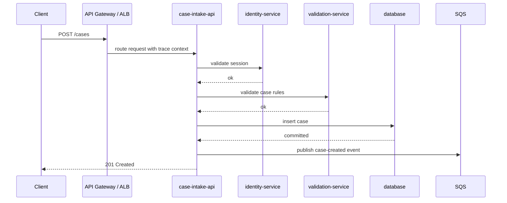

A trace lets you see this as a timeline, not as separate logs scattered across services.

---

## 2. X-Ray Concepts

The most important X-Ray concepts are:

| Concept | Meaning |
|---|---|
| Trace | End-to-end representation of a request path. |
| Segment | Data emitted by a service handling part of a request. |
| Subsegment | Data about downstream calls or smaller work units inside a segment. |
| Trace ID | Identifier that ties segments/subsegments into one trace. |
| Service graph | Visual representation of services and relationships derived from traces. |
| Annotation | Indexed key-value metadata used for filtering traces. |
| Metadata | Non-indexed contextual data attached to traces. |
| Sampling | Decision process controlling which requests are traced. |
| Error | Usually client-side or expected request-class issue depending classification. |
| Fault | Server-side failure, often 5xx. |
| Throttle | Rate-limit/throttling behavior. |

A simplified shape:

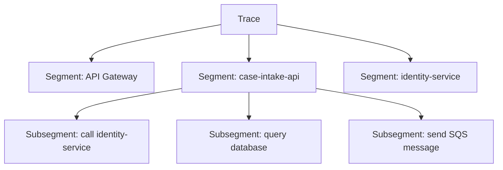

The service graph is useful for topology.

The trace timeline is useful for causality and latency.

Annotations are useful for filtering.

Logs are useful for detail.

---

## 3. Traces vs Logs vs Metrics

Do not make traces carry every kind of data.

| Tool | Best For | Bad For |
|---|---|---|
| Metrics | Aggregates, SLOs, alerting, trends | Explaining one specific request in detail |
| Logs | Detailed local events, exceptions, domain state | Dependency latency across many services without correlation |
| Traces | Request path, latency attribution, dependency causality | High-cardinality payload dump or full audit trail |

Use all three together:

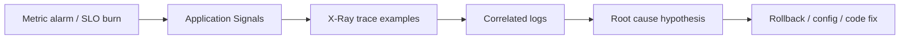

A mature debugging workflow usually starts from metrics/SLOs, narrows with Application Signals, inspects traces, and confirms with logs.

---

## 4. Segment Anatomy

A segment represents work done by a service.

Conceptually, a segment contains:

- trace ID;
- segment ID;
- parent ID when applicable;
- service name;
- start time;
- end time;
- HTTP request/response info;
- error/fault/throttle flags;
- AWS resource info;
- annotations;
- metadata;
- subsegments.

Simplified example:

```json
{
  "trace_id": "1-5f84c7a1-abcdef012345678912345678",
  "id": "53995c3f42cd8ad8",
  "name": "case-intake-api",
  "start_time": 1783332000.000,
  "end_time": 1783332000.412,
  "http": {
    "request": {
      "method": "POST",
      "url": "/cases"
    },
    "response": {
      "status": 201
    }
  },
  "annotations": {
    "environment": "prod",
    "operation": "submit_case",
    "team": "case-platform"
  },
  "subsegments": []
}
```

Do not copy this blindly as an implementation payload. The exact schema is defined by X-Ray segment documents and your instrumentation library. The important point is conceptual: trace data is structured and temporal.

---

## 5. Subsegments: The Debugging Gold

Subsegments are often where the root cause appears.

A service segment may be 900ms. The question is: why?

Subsegments reveal downstream work:

| Subsegment | Duration | Meaning |
|---|---:|---|
| auth middleware | 15ms | local processing |
| call identity-service | 620ms | downstream latency |
| validate payload | 5ms | local processing |
| database insert | 190ms | persistence latency |
| send SQS message | 20ms | async event publish |

Without subsegments, all you know is `case-intake-api` was slow.

With subsegments, you can say:

> `case-intake-api` was slow because `identity-service` consumed 620ms of the 900ms request duration.

That difference matters during incident response.

---

## 6. Service Graphs

X-Ray uses trace data to create service graphs. A service graph is not just pretty architecture. It is runtime evidence.

Use it to answer:

- What services participate in the request path?
- Which dependency has high latency?
- Which edge has increased fault rate?
- Did a release introduce a new dependency?
- Is traffic going through the intended service boundary?
- Is a service unexpectedly calling an external endpoint?

Example:

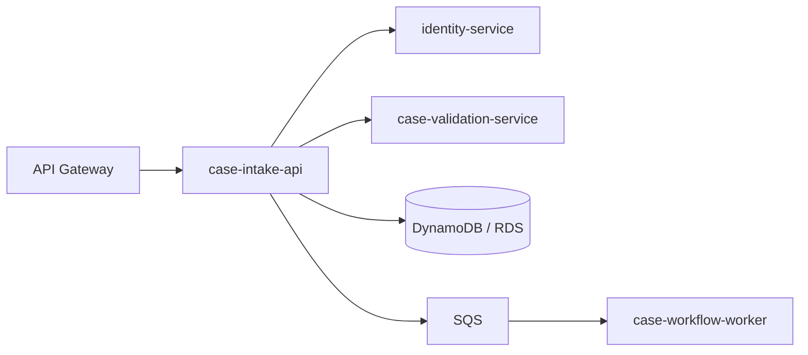

Static diagrams say what you intended.

Trace-derived graphs say what actually happened.

The gap between them is architecture drift.

---

## 7. Sampling

Tracing every request can be expensive and noisy. Sampling controls which requests are traced.

Sampling creates a trade-off:

| High Sampling | Low Sampling |
|---|---|
| Better visibility | Lower cost/overhead |
| More useful for rare bugs | Easier to miss rare failures |
| More storage/query volume | Less operational data |
| Better debugging for edge cases | Better for high-throughput services |

A bad sampling strategy can make traces misleading.

Common failures:

- sampling too low for critical low-volume operations;
- sampling too low to capture rare faults;
- sampling too high for noisy endpoints;
- ignoring error-biased sampling;
- sampling based only on volume, not criticality;
- no separate strategy for canary/test traffic.

A practical sampling policy:

| Traffic Type | Sampling Strategy |
|---|---|
| Tier-1 critical user operations | Higher baseline + capture errors/faults |
| Low-value health checks | Very low or excluded |
| High-throughput read endpoints | Low baseline + error capture |
| Rare admin operations | Higher sampling |
| Incident mode | Temporarily increase sampling with time limit |
| Synthetic canaries | Sample enough for journey debugging |

Do not change sampling during an incident without considering cost and performance impact.

---

## 8. Trace Context Propagation

A trace only works if context flows across boundaries.

Trace context must pass through:

- HTTP headers;
- gRPC metadata;
- message attributes;
- async event payloads;
- queue messages;
- Lambda invocations;
- service mesh or sidecar layers;
- API Gateway/ALB/CloudFront boundaries where supported.

If trace context breaks, the request path fragments.

Broken trace context symptoms:

| Symptom | Likely Cause |
|---|---|
| Service appears as separate root trace | incoming trace header not propagated |
| Async worker traces not connected | queue/event lacks trace context |
| Dependency absent from graph | library not instrumented or outbound call not captured |
| Trace ID not in logs | logging context not wired |
| Downstream service has trace but no parent | parent ID lost or propagation format mismatch |

For asynchronous systems, context propagation requires explicit design.

Example:

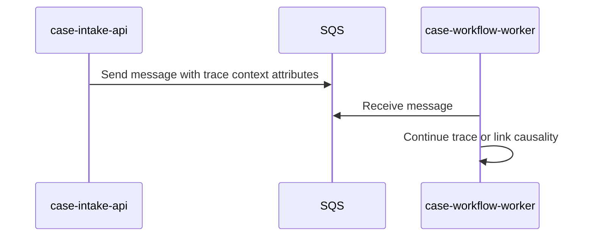

Async tracing is not always a clean parent-child model. Sometimes it is better represented as linked causality rather than one long synchronous trace.

---

## 9. Annotations vs Metadata

Annotations are indexed. Metadata is not.

Use annotations for fields you want to filter/search by.

Use metadata for contextual details that are useful when inspecting a trace but should not be indexed.

Good annotations:

```text
environment=prod
operation=submit_case
service_tier=tier-1
team=case-platform
release_version=2026.07.06.3
feature_flag=case_intake_v2
```

Dangerous annotations:

```text
user_email=alice@example.com
access_token=...
case_description=raw free text
request_body=full payload
session_cookie=...
```

Good metadata:

```json
{
  "validation_rule_count": 32,
  "retry_attempts": 2,
  "fallback_used": true,
  "sanitized_error_code": "IDENTITY_TIMEOUT"
}
```

Rules:

1. Do not put secrets in traces.
2. Do not put raw PII in annotations.
3. Keep annotation cardinality controlled.
4. Prefer stable categories over raw identifiers.
5. Use hashed or tokenized identifiers only if there is a clear investigation need and policy approval.

Observability data must follow data classification rules.

---

## 10. Distributed Latency Debugging

Latency debugging should be done from the outside in.

Start with symptom:

> `POST /cases` p95 increased from 300ms to 1.8s.

Then inspect traces.

Ask:

1. Are all requests slow or only some?
2. Is the slow duration before or after the application service?
3. Which segment consumes the most time?
4. Which subsegment increased compared to baseline?
5. Is there retry behavior?
6. Is latency caused by queueing, compute, network, dependency, or lock contention?
7. Did the deployment version change?
8. Is the slowness region/account-specific?

A trace timeline might show:

```text
API Gateway          20ms
case-intake-api      1800ms
  auth middleware    12ms
  identity-service   1400ms
  validation         15ms
  database insert    210ms
  publish event      20ms
```

This suggests identity-service is the main contributor.

Then inspect identity-service traces:

```text
identity-service     1380ms
  token parse        4ms
  cache lookup       2ms
  database query     1250ms
  response encode    5ms
```

Now the hypothesis is database query latency inside identity-service, not case-intake code.

This is why traces reduce blame ping-pong between teams.

---

## 11. Error, Fault, and Throttle Debugging

X-Ray can help classify failures, but classification still depends on how services report and instrument errors.

A useful interpretation model:

| Signal | Meaning | Example |
|---|---|---|
| Error | Request resulted in an error class, often 4xx or client-caused depending integration | invalid request, unauthorized |
| Fault | Server-side failure, often 5xx | unhandled exception, dependency failure |
| Throttle | Rate limit or capacity control | API throttle, service quota exceeded |

During debugging, ask:

- Did faults start after a deployment?
- Are faults concentrated in one operation?
- Are faults caused by one dependency?
- Are throttles upstream or downstream?
- Are client errors expected or caused by a bad UI/API contract?
- Are retries turning throttles into faults?

Failure path example:

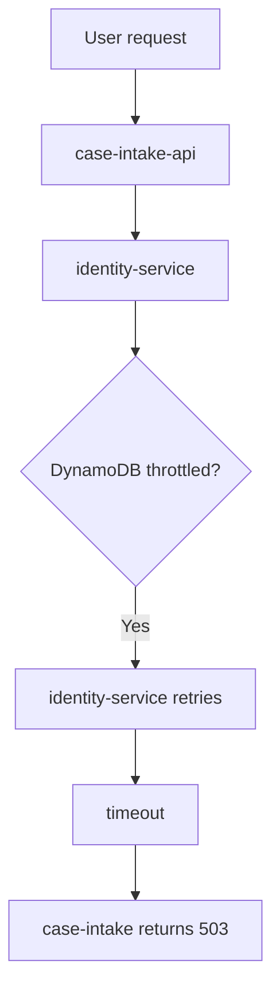

If you only look at `case-intake-api` logs, it appears to be failing.

The trace shows the failure chain.

---

## 12. Retry Storm Detection

Retries are one of the most common distributed debugging traps.

A downstream dependency slows down. Callers retry. More retries increase load. The dependency gets slower. The caller times out. The incident expands.

Trace symptoms:

- repeated subsegments to the same dependency;
- increasing request duration;
- dependency call count per request increases;
- throttles appear before faults;
- p99 latency explodes before error rate;
- multiple services show dependency latency around the same time.

Example trace:

```text
case-intake-api  3000ms
  call identity-service attempt=1  900ms timeout
  call identity-service attempt=2  900ms timeout
  call identity-service attempt=3  900ms timeout
  return 503
```

Controls:

- bounded retries;
- jittered exponential backoff;
- request deadline propagation;
- circuit breakers;
- bulkheads;
- fallback where safe;
- idempotency tokens;
- retry budget monitoring;
- dependency SLOs.

Tracing helps reveal retry amplification that metrics alone hide.

---

## 13. Deadline Propagation

One of the strongest distributed debugging practices is deadline propagation.

If the user request budget is 1 second, a downstream dependency should not spend 3 seconds trying to complete work after the caller has already timed out.

Without deadline propagation:

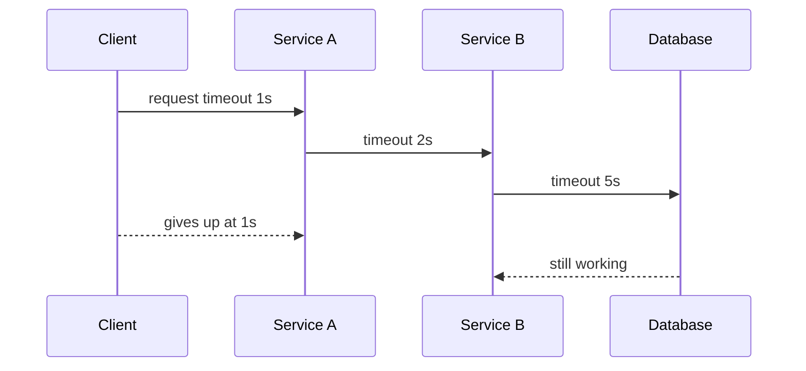

With deadline propagation:

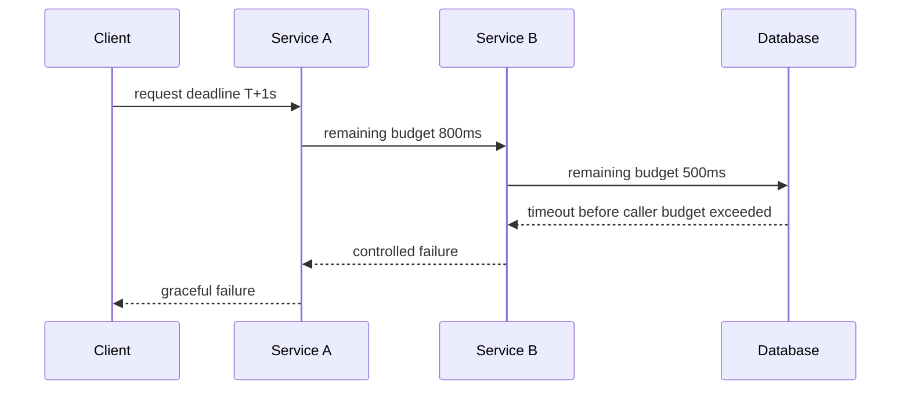

Traces help validate whether timeouts align across the call chain.

If subsegments routinely exceed the parent request budget, your timeout model is broken.

---

## 14. Cold Starts and Runtime Effects

For Lambda and some container workloads, latency may be affected by runtime lifecycle:

- cold start;
- initialization;
- JIT warmup;
- connection pool creation;
- DNS cache behavior;
- TLS handshakes;
- dependency client initialization;
- large configuration loading;
- secret retrieval;
- container image pull/startup.

Trace and log correlation can distinguish:

| Symptom | Likely Cause |
|---|---|
| First request after scale-out slow | cold start or connection setup |
| All requests slow after deploy | code/regression/config |
| Only p99 slow | occasional GC, cold start, dependency jitter |
| Slow dependency first call | DNS/TLS/client initialization |
| Lambda init duration elevated | package size/init code/extension overhead |

Do not mislabel all p99 latency as “network”. Trace timelines often show the truth.

---

## 15. Tracing AWS Managed Services

AWS X-Ray integrates with various AWS services. The exact integration depth varies by service and setup.

Commonly relevant services include:

- Lambda;
- API Gateway;
- Step Functions;
- Elastic Beanstalk;
- ECS/EC2 instrumented applications;
- SNS/SQS through application instrumentation patterns;
- downstream AWS SDK calls instrumented through SDK/instrumentation libraries.

The key mental model:

| Boundary | What to Verify |
|---|---|
| API Gateway to Lambda/service | incoming trace context appears |
| Lambda to downstream AWS SDK | SDK calls appear as subsegments where supported/instrumented |
| Service to SQS | trace context included in message attributes if async causality needed |
| Step Functions | state transitions visible where X-Ray tracing is enabled/supported |
| ECS service to downstream API | HTTP client instrumentation active |
| Database calls | driver instrumentation or explicit subsegments |

Do not assume every dependency appears automatically. Validate with synthetic traffic.

---

## 16. X-Ray and OpenTelemetry

Modern observability increasingly standardizes around OpenTelemetry. AWS Distro for OpenTelemetry can collect and export telemetry to AWS services, including X-Ray-compatible tracing paths depending on configuration.

Design principle:

> Instrument once with open standards where possible; route to AWS-native analysis where useful.

Benefits:

- less vendor-specific application code;
- consistent instrumentation across languages;
- portability;
- integration with CloudWatch/Application Signals;
- easier platform standardization.

Cautions:

- propagation formats can differ;
- semantic conventions evolve;
- library auto-instrumentation varies by runtime;
- collectors need resource/cost/security controls;
- duplicate instrumentation can create duplicate spans/segments;
- attributes may leak sensitive data if not filtered.

A platform team should own collector configuration and default instrumentation profiles.

---

## 17. Logs Correlation

Traces without logs are often too shallow.

Logs without trace IDs are often too scattered.

Always include trace ID in structured logs.

Example log line:

```json
{
  "timestamp": "2026-07-06T10:15:30.120Z",
  "level": "ERROR",
  "service": "case-intake-api",
  "operation": "submit_case",
  "trace_id": "1-5f84c7a1-abcdef012345678912345678",
  "request_id": "req-...",
  "error_type": "DependencyTimeout",
  "dependency": "identity-service",
  "message": "dependency request timed out after 800ms"
}
```

CloudWatch Logs Insights query pattern:

```sql
fields @timestamp, level, service, operation, trace_id, error_type, dependency, message
| filter trace_id = '1-5f84c7a1-abcdef012345678912345678'
| sort @timestamp asc
```

During incidents, this is the difference between minutes and hours.

---

## 18. Trace Filtering Strategy

Useful trace filters depend on annotations and consistent naming.

Good filters:

```text
service("case-intake-api")
annotation.environment = "prod"
annotation.operation = "submit_case"
annotation.team = "case-platform"
http.status = 500
fault = true
```

Operational trace search questions:

| Question | Filter Shape |
|---|---|
| Show slow traces for one operation | service + operation + duration |
| Show traces after release | service + release_version |
| Show production faults | environment + fault |
| Show traces involving dependency | service graph/dependency filter |
| Show feature-flag failures | feature_flag annotation |
| Show throttled downstream calls | throttle flag / dependency metadata |

Do not annotate with raw IDs just because you can. High-cardinality annotations reduce usefulness and can create privacy risk.

---

## 19. Security and Privacy in Traces

Tracing is powerful because it captures context. That also makes it dangerous.

Never put these in traces:

- passwords;
- access tokens;
- refresh tokens;
- session cookies;
- authorization headers;
- API keys;
- raw PII;
- raw case narratives;
- full request/response bodies;
- encrypted secrets before encryption;
- internal private keys;
- database connection strings.

Control options:

- attribute allowlist;
- attribute denylist;
- collector-side filtering;
- SDK instrumentation config;
- structured logging redaction;
- IAM least privilege for trace read access;
- KMS/log retention policies where relevant;
- separation of prod and non-prod observability roles;
- review telemetry during threat modeling.

A useful rule:

> Anything visible in a trace should be safe for the intended observability audience.

---

## 20. Tracing and Security Investigations

X-Ray is not a security detection service like GuardDuty, but traces can support security investigations.

Examples:

| Investigation | Trace Value |
|---|---|
| Suspicious API abuse | Request path, latency, downstream effects |
| Credential misuse impact | Which services were called after suspicious action |
| Data access anomaly | Which operation triggered data dependency |
| SSRF suspicion | Unexpected outbound dependency call |
| Auth bypass bug | Request path through auth middleware/dependency |
| Exfiltration path | Unexpected dependency or external call pattern |

Limitations:

- traces are sampled;
- traces may not capture payload details;
- retention may be shorter than audit logs;
- not every path is instrumented;
- security conclusions require CloudTrail/log correlation.

Use traces as supporting evidence, not sole source of forensic truth.

---

## 21. Incident Workflow: Latency Spike

Scenario:

> `case-intake-api` availability is okay, but p95 latency breached the SLO after a deployment.

Workflow:

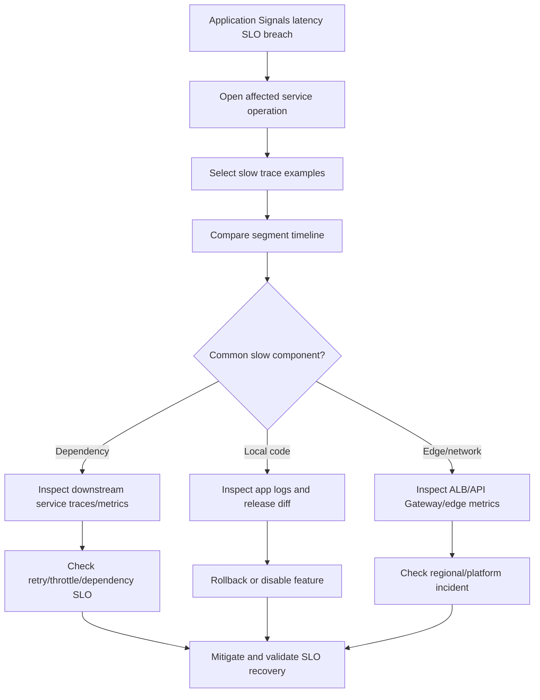

Decision examples:

| Evidence | Likely Action |
|---|---|
| Slow traces all include new downstream call | rollback or feature-disable |
| Dependency p95 elevated for all callers | escalate to dependency owner |
| Only one operation slow after release | rollback specific service |
| Throttling subsegments visible | capacity/quota/backoff fix |
| Database subsegment dominates | query/index/connection pool investigation |
| Trace shows repeated retries | reduce retry count, enable circuit breaker |

---

## 22. Incident Workflow: Error Spike

Scenario:

> Fault rate increased for `POST /cases`.

Workflow:

1. Filter traces by service, operation, environment, and fault.
2. Inspect common failing segment/subsegment.
3. Group by release version, dependency, status code, and error type.
4. Correlate with logs for exception class and domain context.
5. Check deployment timeline.
6. Check dependency health and throttling.
7. Decide rollback, mitigation, or dependency escalation.
8. Validate fault rate and SLO burn recovery.

Trace evidence patterns:

| Trace Pattern | Interpretation |
|---|---|
| fault in same local segment after release | service regression |
| fault appears after dependency timeout | downstream issue or timeout mismatch |
| many 4xx errors after frontend deploy | client/API contract mismatch |
| throttles before faults | rate-limit/capacity/retry issue |
| missing downstream subsegment | instrumentation gap or early failure |

---

## 23. Debugging Asynchronous Systems

Async systems are harder to trace because causality is no longer one request/response chain.

Example:

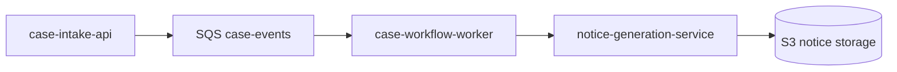

Questions:

- Did the producer publish the event?
- Did the message include correlation/trace context?
- How long did it wait in queue?
- Did the worker process it once or many times?
- Did retries create duplicate side effects?
- Did the downstream document generation fail?
- Is the workflow lag user-visible?

Tracing helps, but queue metrics and logs are equally important.

For async systems, correlate:

| Signal | Why |
|---|---|
| Trace context | producer-to-consumer causality |
| Message ID | queue-level investigation |
| Business event ID | idempotency and domain causality |
| Queue age | backlog/freshness SLO |
| Dead-letter queue count | terminal failure |
| Worker logs | handler-level exception |
| Workflow state | business process truth |

Do not rely on trace ID alone for async domain workflows. Use a business correlation ID.

---

## 24. Tracing Long-Running Workflows

For long-running workflows, such as Step Functions or regulatory case lifecycle orchestration, a single trace may not be the right abstraction for the whole lifecycle.

A case may live for days or months. A trace is typically request/operation scoped.

Better model:

| Scope | Identifier | Tool |
|---|---|---|
| One HTTP request | trace ID | X-Ray |
| One async processing attempt | trace ID + message ID | X-Ray + logs |
| One workflow instance | workflow execution ID | Step Functions / app state |
| One business case | case ID / domain ID | domain database/audit log |
| One incident | incident ID | Incident Manager / ticket |

Use traces for local causality. Use workflow state/audit for long-running business truth.

---

## 25. Common Anti-Patterns

| Anti-Pattern | Why It Hurts | Better Pattern |
|---|---|---|
| Tracing every endpoint equally | Cost/noise | sample by criticality and error capture |
| No trace ID in logs | hard correlation | structured logs with trace_id |
| Raw payloads in traces | privacy/security risk | sanitized metadata only |
| Console-only tracing config | drift | IaC/platform templates |
| No sampling review | missed rare failures or high cost | sampling policy by service tier |
| No operation normalization | route explosion | route templates |
| No dependency instrumentation | incomplete graph | instrument outbound clients |
| Treat service graph as architecture truth without review | dynamic/runtime can be incomplete | compare with intended architecture |
| No owner annotation | impossible triage | service catalog integration |
| Over-indexed annotations | cost/privacy/cardinality | limited annotation allowlist |

---

## 26. Production Readiness Checklist

Before declaring tracing production-ready:

```text
[ ] Tier-1 services emit traces.
[ ] Service names are stable and match service catalog.
[ ] Environment/account/region/team annotations are consistent.
[ ] Trace context propagates across HTTP/gRPC boundaries.
[ ] Async messages carry correlation context where needed.
[ ] Logs include trace_id and request_id.
[ ] Major downstream calls appear as subsegments.
[ ] Sampling strategy is documented and cost-reviewed.
[ ] Error/fault traces are captured at useful rates.
[ ] No secrets, tokens, raw PII, or raw payloads appear in traces.
[ ] Trace read access is least-privilege.
[ ] Runbooks explain how to use traces during incidents.
[ ] Dashboards link to trace views where useful.
[ ] Application Signals and X-Ray investigation flows are connected.
[ ] Trace instrumentation is deployed through platform templates.
```

---

## 27. Practical Debugging Playbook

When investigating a production issue:

### 1. Start from symptom

Use Application Signals, SLO alarm, CloudWatch metric, or customer report.

### 2. Identify affected service and operation

Do not search all traces randomly.

### 3. Filter traces

Use environment, service, operation, fault/error, latency, release version.

### 4. Compare good and bad traces

A single slow trace is anecdote. A pattern across traces is evidence.

### 5. Inspect timeline

Find the dominant segment/subsegment.

### 6. Correlate logs

Use trace ID to fetch application logs.

### 7. Check recent changes

Deployment, config, secret rotation, IAM policy, network route, dependency version.

### 8. Decide mitigation

Rollback, disable flag, adjust timeout, reduce traffic, scale, dependency escalation.

### 9. Validate recovery

Use SLO, Application Signals, traces, logs, and customer-facing checks.

### 10. Record learning

Update runbook, sampling rules, instrumentation gaps, and SLO definitions.

---

## 28. How X-Ray Complements Part 059

Application Signals and X-Ray should work together:

| Application Signals | X-Ray |
|---|---|
| Service/operation health | Request-level causality |
| SLO status | Trace timeline |
| Dependency map | Segment/subsegment detail |
| High-level latency/fault signal | Concrete examples of slow/failing requests |
| Operational dashboard | Debugging microscope |

Operational flow:

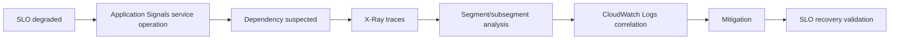

Use Application Signals to avoid getting lost.

Use X-Ray to go deep when you know where to look.

---

## 29. Key Takeaways

X-Ray is valuable because it reveals **causality across service boundaries**.

The most important lessons:

- A trace is the story of one request.
- Segments represent service work; subsegments reveal downstream calls.
- Service graphs expose runtime architecture and dependency drift.
- Sampling is an engineering decision, not a default you forget.
- Trace context propagation is mandatory for useful distributed debugging.
- Logs must include trace IDs.
- Annotations should be useful, low-cardinality, and safe.
- Traces are not audit logs and not complete forensic truth.
- Async workflows require business correlation IDs in addition to trace IDs.
- Tracing is most powerful when connected to SLOs, Application Signals, logs, deployments, and runbooks.

Application Signals shows which service operation is unhealthy.

X-Ray shows what happened inside representative requests.

Together, they turn production debugging from guesswork into structured investigation.

---

## Official References

- [AWS X-Ray concepts](https://docs.aws.amazon.com/xray/latest/devguide/xray-concepts.html)
- [X-Ray segment documents](https://docs.aws.amazon.com/xray/latest/devguide/xray-api-segmentdocuments.html)
- [Viewing traces and trace details](https://docs.aws.amazon.com/xray/latest/devguide/xray-console-traces.html)
- [CloudWatch integration with X-Ray](https://docs.aws.amazon.com/xray/latest/devguide/xray-services-cloudwatch.html)
- [Tracing Step Functions request data in AWS X-Ray](https://docs.aws.amazon.com/step-functions/latest/dg/concepts-xray-tracing.html)
- [AWS Distro for OpenTelemetry](https://aws-otel.github.io/)
- [CloudWatch Application Signals](https://docs.aws.amazon.com/AmazonCloudWatch/latest/monitoring/CloudWatch-Application-Monitoring-Sections.html)
