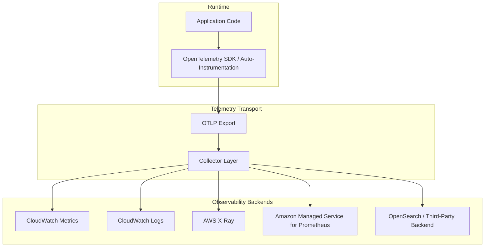
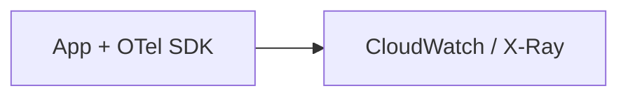
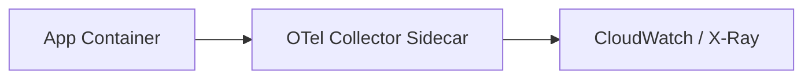
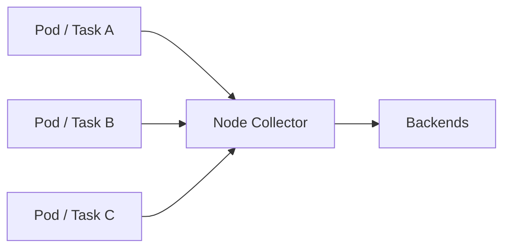
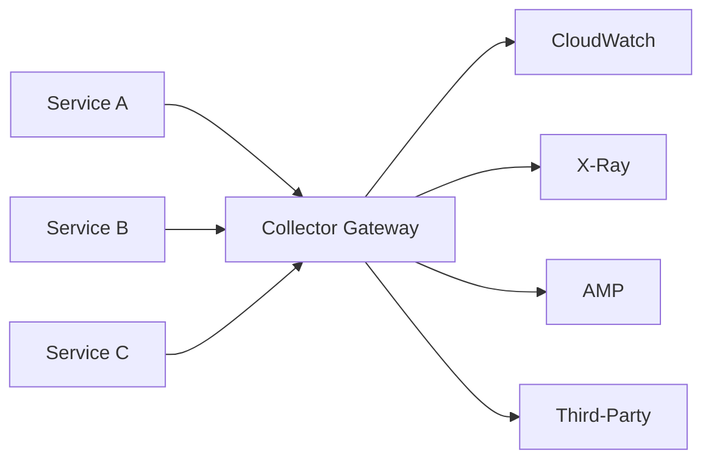
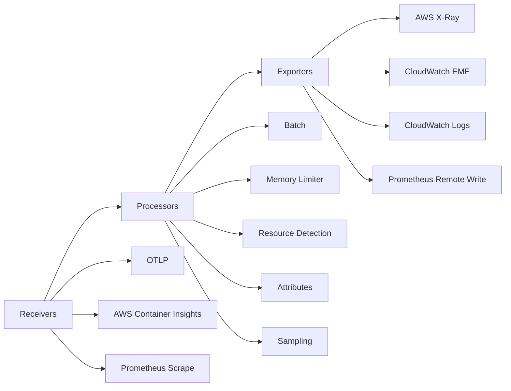
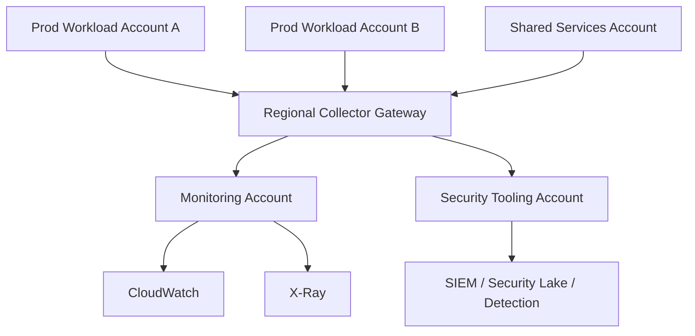

# Part 061 — OpenTelemetry on AWS

OpenTelemetry on AWS is not just another tracing library. Treat it as the **telemetry contract** between applications, runtime platforms, AWS observability services, and any future monitoring backend.

The useful mental model is simple:

> Instrument once. Route many times. Keep the semantic meaning stable even when the backend changes.

Without that contract, every team invents its own log fields, metric names, trace propagation rules, and dashboard semantics. The result is a noisy system where incident response starts with translation work instead of diagnosis.

OpenTelemetry gives us a shared vocabulary for:

- traces: what happened across service boundaries;
- metrics: how the system behaves over time;
- logs: what the system says happened;
- resource attributes: where the signal came from;
- context propagation: how one request is connected across processes;
- collectors: how telemetry is received, transformed, sampled, enriched, and exported.

AWS Distro for OpenTelemetry, usually shortened to **ADOT**, is AWS's supported distribution of OpenTelemetry components. It allows applications to send telemetry to AWS-native destinations such as CloudWatch and X-Ray, while keeping the instrumentation model close to upstream OpenTelemetry.

Official references:

- AWS Distro for OpenTelemetry: https://aws.amazon.com/otel/
- OpenTelemetry in Amazon CloudWatch: https://docs.aws.amazon.com/AmazonCloudWatch/latest/monitoring/CloudWatch-OpenTelemetry-Sections.html
- ADOT with AWS X-Ray: https://docs.aws.amazon.com/xray/latest/devguide/xray-services-adot.html
- CloudWatch Agent OTLP receiver: https://docs.aws.amazon.com/AmazonCloudWatch/latest/monitoring/CloudWatch-Agent-OpenTelemetry-metrics.html

---

## 1. The Problem OpenTelemetry Solves

Before OpenTelemetry, observability stacks usually evolved like this:

1. application logs are sent to CloudWatch Logs;
2. infrastructure metrics are taken from CloudWatch;
3. traces are added later through X-Ray or another library;
4. application metrics are pushed through a custom client;
5. dashboards are manually assembled;
6. teams discover that logs, metrics, and traces do not share the same identity model.

The hard problem is not collection. The hard problem is **correlation**.

During an incident, you need to answer:

- Which customer journey is affected?
- Which service operation is failing?
- Which dependency is slow?
- Is the issue regional, zonal, service-specific, deployment-specific, tenant-specific, or internet-path-specific?
- Which exact version, pod, task, instance, Lambda function, or account emitted the signal?
- Can we connect the alert to the trace and the trace to the logs?

OpenTelemetry solves this by pushing common metadata and propagation rules into the instrumentation layer.

The invariant:

```text
A telemetry signal that cannot be correlated during an incident is operationally weak, even if it was collected successfully.
```

---

## 2. Architecture Model

A production OpenTelemetry architecture has four layers.



Each layer has a different responsibility.

| Layer | Responsibility | Common Failure |
|---|---|---|
| Application code | Emits meaningful telemetry | Logs are unstructured; spans have no business context |
| SDK / instrumentation | Captures framework/runtime signals | Auto-instrumentation misses custom domain operations |
| OTLP export | Sends telemetry out of process | Backpressure or network failure blocks request path |
| Collector | Receives, batches, enriches, samples, exports | Collector becomes hidden single point of telemetry loss |
| Backend | Stores, queries, alerts, visualizes | Backend receives noisy or inconsistent signals |

The collector is the architectural hinge. It lets you keep application code stable while changing routing, batching, sampling, enrichment, and backend destinations outside the application.

---

## 3. Signals: Metrics, Traces, Logs, and Context

OpenTelemetry is often introduced as tracing. That is too narrow.

### Metrics

Metrics answer: **how is the system behaving over time?**

Examples:

- request count;
- error count;
- request duration;
- queue depth;
- retry count;
- throttle count;
- dependency latency;
- database connection pool saturation.

Metrics are best for alerting, capacity, trend, and SLO evaluation.

### Traces

Traces answer: **what happened to one request or workflow?**

Examples:

- API Gateway request → Lambda → DynamoDB;
- ALB → ECS service → downstream service → RDS;
- EventBridge event → Lambda enrichment → SQS → worker;
- user checkout → inventory reservation → payment authorization → order persistence.

Traces are best for debugging distributed causality.

### Logs

Logs answer: **what did the code say at specific decision points?**

Logs should explain domain and technical decisions:

- validation rejected request;
- policy denied access;
- idempotency key reused;
- retry exhausted;
- fallback activated;
- circuit breaker opened;
- state transition failed;
- external provider returned terminal failure.

Logs are best for narrative and forensic detail.

### Context

Context is what connects the signals.

Useful context includes:

- trace id;
- span id;
- request id;
- tenant id;
- customer tier;
- service name;
- deployment version;
- AWS account id;
- region;
- environment;
- operation name;
- workload owner;
- compliance scope.

The context model is where many observability programs fail. Teams collect a lot of data but cannot join it.

---

## 4. Resource Attributes Are Not Decoration

Resource attributes describe the entity that emitted telemetry. They are the metadata foundation for routing, filtering, dashboards, and incident ownership.

Minimum useful resource attributes:

```yaml
service.name: payment-api
service.namespace: commerce
service.version: 2026.07.06-1
service.instance.id: task-abc123
deployment.environment: prod
cloud.provider: aws
cloud.account.id: "123456789012"
cloud.region: ap-southeast-1
aws.ecs.cluster.name: commerce-prod
team.owner: payments-platform
risk.tier: high
compliance.scope: pci
```

Bad resource attributes:

```yaml
service.name: app
service.version: latest
environment: production
owner: team-a
```

Why bad?

- `app` is not operationally unique.
- `latest` destroys version correlation.
- custom `environment` may not match backend conventions.
- `team-a` is not stable if organization changes.

A top-tier platform team treats resource attributes as part of the deployment contract.

---

## 5. ADOT Deployment Patterns

There are four common deployment models.

### Pattern 1 — In-Process SDK Direct Export

The application exports telemetry directly to CloudWatch/X-Ray/backend.



Use when:

- the workload is simple;
- there is no platform collector;
- operational maturity is early;
- telemetry volume is low.

Avoid when:

- you need centralized sampling;
- you need backend fan-out;
- you need enrichment outside code;
- you do not want application releases for telemetry routing changes.

### Pattern 2 — Sidecar Collector

Each workload has a local collector sidecar.



Use when:

- you want local buffering;
- you run ECS/EKS workloads;
- each service needs specific processor/exporter config;
- you want blast radius limited per task/pod.

Trade-off:

- more resource overhead;
- more config distribution complexity;
- sidecar failure can create per-workload telemetry gaps.

### Pattern 3 — Daemon / Node Agent

A collector runs per node.



Use when:

- node-level collection is efficient;
- you want shared collection for many workloads;
- the platform controls runtime nodes;
- you can tolerate node-level collector dependency.

Common for EKS DaemonSet patterns.

### Pattern 4 — Gateway Collector

Applications send telemetry to a centralized collector tier.



Use when:

- you need centralized routing;
- you need consistent sampling;
- you need multi-backend fan-out;
- you need centralized data filtering.

Risk:

- gateway becomes a critical telemetry dependency;
- bad scaling silently loses observability during incidents;
- cross-account traffic design becomes important.

Production systems often combine patterns:

```text
App -> local sidecar/agent -> regional gateway -> backend(s)
```

---

## 6. Collector Pipeline Mental Model

The OpenTelemetry Collector is a pipeline engine.



In plain terms:

- receiver: how data enters;
- processor: what is changed, enriched, batched, filtered, or sampled;
- exporter: where data goes.

Example collector shape:

```yaml
receivers:
  otlp:
    protocols:
      grpc:
        endpoint: 0.0.0.0:4317
      http:
        endpoint: 0.0.0.0:4318

processors:
  memory_limiter:
    limit_mib: 512
    spike_limit_mib: 128
  batch:
    timeout: 5s
    send_batch_size: 8192
  resource:
    attributes:
      - key: deployment.environment
        value: prod
        action: upsert
      - key: cloud.provider
        value: aws
        action: upsert

exporters:
  awsxray: {}
  awsemf:
    namespace: Commerce/Services

service:
  pipelines:
    traces:
      receivers: [otlp]
      processors: [memory_limiter, resource, batch]
      exporters: [awsxray]
    metrics:
      receivers: [otlp]
      processors: [memory_limiter, resource, batch]
      exporters: [awsemf]
```

The exact syntax evolves by distribution and version, but the architecture stays stable.

---

## 7. Sampling Strategy

Tracing everything sounds attractive until volume and cost explode.

Sampling decides which traces are retained.

Common strategies:

| Strategy | Behavior | Use Case | Risk |
|---|---|---|---|
| Head sampling | Decide at trace start | Simple, cheap | May drop rare failures |
| Tail sampling | Decide after seeing trace outcome | Keep errors/slow traces | Needs collector buffering |
| Rate-based sampling | Keep percentage | High-volume endpoints | May miss low-frequency critical paths |
| Rule-based sampling | Keep specific operations/errors | Business-critical flows | Rules drift from reality |
| Adaptive sampling | Dynamic adjustment | Advanced platforms | Harder to reason about |

A pragmatic production policy:

```text
Keep all error traces.
Keep all high-latency traces above SLO threshold.
Keep all traces for critical workflows at controlled volume.
Sample high-volume successful traffic.
Never sample away audit/security decision logs.
```

Important distinction:

- tracing sampling may drop traces;
- logs needed for security/audit should not rely on trace sampling;
- metrics for SLO should be complete enough to avoid biased conclusions.

---

## 8. Metrics Cardinality Governance

OpenTelemetry makes custom metrics easier. That can be dangerous.

Bad metric labels:

```text
user_id
request_id
email
ip_address
full_url
session_id
order_id
```

These create high cardinality, increase cost, and often leak sensitive data.

Better labels:

```text
service_name
operation
status_class
error_type
region
environment
dependency
customer_tier
```

Metric design rules:

1. labels must be bounded;
2. labels must be useful for routing decisions;
3. labels must not carry secrets or direct personal data;
4. labels must support aggregation;
5. labels must match dashboard and SLO dimensions.

A good metric is not just accurate. It is **operationally aggregatable**.

---

## 9. Logs and Trace Correlation

For every service log event that matters during debugging, include correlation fields.

Recommended structured log fields:

```json
{
  "timestamp": "2026-07-06T10:15:30.000Z",
  "level": "ERROR",
  "service.name": "payment-api",
  "service.version": "2026.07.06-1",
  "deployment.environment": "prod",
  "trace_id": "1-abc",
  "span_id": "def",
  "request_id": "req-123",
  "operation": "AuthorizePayment",
  "tenant_id": "tenant-42",
  "error_type": "ProviderTimeout",
  "message": "Payment provider timeout after retries exhausted"
}
```

Do not rely on message text parsing for primary fields. If a field matters for search, alerting, routing, or audit, make it structured.

---

## 10. AWS Integration Choices

OpenTelemetry on AWS commonly routes to these destinations:

| Destination | Best For | Notes |
|---|---|---|
| AWS X-Ray | Distributed tracing and service graph | Good AWS-native trace backend |
| CloudWatch Metrics | Alarms, dashboards, SLO metrics | Watch dimensions and cost |
| CloudWatch Logs | Logs and OTLP logs query | Use retention, KMS, subscription filters |
| Amazon Managed Service for Prometheus | Prometheus-style metrics and PromQL | Good for Kubernetes/cloud-native teams |
| Amazon OpenSearch Service | Search-heavy log/trace analytics | Needs index lifecycle and access control |
| Third-party backend | Existing enterprise observability stack | Keep OTLP contract stable |

The important design decision is not “AWS-native or third-party.” The important decision is: **does your telemetry contract survive backend migration?**

OpenTelemetry helps because the application speaks a common protocol and semantic model.

---

## 11. Multi-Account and Multi-Region Telemetry Routing

In mature AWS environments, telemetry is not emitted from one account.

Typical layout:



Design questions:

- Which account owns the collector gateway?
- Is telemetry pushed cross-account or shared through observability access manager patterns?
- Which signals go to security tooling vs application monitoring?
- Which attributes identify source account and workload owner?
- What is the retention policy per signal type?
- What happens if telemetry routing fails during an incident?

Production invariant:

```text
Telemetry must preserve source account, region, environment, service, owner, and version across all routing layers.
```

---

## 12. Security and Privacy Controls

Telemetry can leak sensitive data.

Common leak sources:

- full HTTP URL with query parameters;
- request/response payload in span attributes;
- authorization headers;
- email, phone, national ID, access token;
- database query parameters;
- exception messages containing secrets;
- customer identifiers in high-cardinality metrics.

Controls:

- redact at source;
- use collector attribute processors to drop risky fields;
- enforce logging libraries that block known secret fields;
- scan logs for secrets;
- define telemetry data classification;
- restrict access to trace/log backends;
- define retention by signal and sensitivity;
- avoid recording full payloads unless explicitly approved.

A trace backend is often less protected than a primary database. That is a governance bug.

---

## 13. Operational Failure Modes

| Failure Mode | Symptom | Consequence | Control |
|---|---|---|---|
| Collector down | No traces/metrics/logs | Blind incident response | Health checks, autoscaling, DLQ/buffering |
| Collector overloaded | Dropped spans/logs | Missing causality during peak | Memory limiter, batch tuning, load testing |
| Bad sampling | Errors missing | False sense of health | Keep error/slow traces |
| Attribute drift | Dashboard filters break | Ownership ambiguity | Attribute contract and CI validation |
| High cardinality | Cost spike, slow queries | Observability budget blowout | label allowlist |
| Sensitive data in spans | Data leakage | Compliance incident | redaction and scanning |
| Backend lock-in | Migration costly | Platform rigidity | OTLP-first design |
| Duplicate exporters | double billing | Cost noise | routing review |
| Instrumentation mismatch | broken traces | incomplete service map | propagation tests |

---

## 14. Testing Telemetry Like Code

Telemetry should be tested.

Minimum tests:

1. service emits trace id in logs;
2. service exports spans for inbound and outbound requests;
3. dependency calls appear in traces;
4. standard metrics include service/environment/version;
5. collector config validates before deploy;
6. telemetry can be queried in backend;
7. dashboards show new service automatically or via code;
8. alarm can fire in test environment;
9. sensitive fields are not emitted;
10. telemetry survives one collector instance failure.

Example CI assertion:

```text
Reject deployment if service.name is missing.
Reject deployment if deployment.environment is not one of dev/staging/prod.
Reject deployment if metric label uses user_id, email, token, or request_id.
Reject deployment if logs do not include trace_id for request-handling paths.
```

---

## 15. Runbook: Introducing OpenTelemetry to an Existing Service

Use this sequence.

### Step 1 — Define the telemetry contract

Decide:

- service name;
- namespace;
- owner;
- environment;
- version source;
- required log fields;
- standard metrics;
- critical spans;
- forbidden attributes.

### Step 2 — Add SDK or auto-instrumentation

Start with framework-level instrumentation:

- HTTP server/client;
- database client;
- queue client;
- AWS SDK client;
- runtime metrics.

### Step 3 — Add domain spans

Do not stop at framework spans.

Add spans for domain operations:

```text
ValidateOrder
ReserveInventory
AuthorizePayment
CommitOrder
PublishOrderCreated
```

These names make traces useful to engineers and incident commanders.

### Step 4 — Deploy collector path

Choose direct, sidecar, daemon, or gateway pattern.

### Step 5 — Validate correlation

Confirm:

- trace visible in X-Ray/backend;
- logs searchable by trace id;
- metric dimensions match dashboard;
- service appears in topology;
- version can be filtered.

### Step 6 — Attach SLO and alerting

Do not declare observability finished until signals drive decisions.

### Step 7 — Add governance

Add CI checks, cost review, sampling policy, field allowlist, and ownership metadata.

---

## 16. Production Checklist

```text
[ ] Every service has stable service.name.
[ ] Every signal includes environment, account, region, owner, and version.
[ ] Logs include trace_id and request_id.
[ ] Error and high-latency traces are retained.
[ ] Sensitive fields are redacted before backend ingestion.
[ ] Collector has memory limiter, batching, health check, and autoscaling.
[ ] Collector config is versioned and reviewed.
[ ] Metrics labels have bounded cardinality.
[ ] Dashboards use standard attributes.
[ ] Alerts are linked to traces, logs, and runbooks.
[ ] Telemetry routing is tested during failure injection.
[ ] Teams know where telemetry lives and who pays for it.
```

---

## 17. What Top Engineers Internalize

OpenTelemetry is not mainly about prettier traces. It is about **preserving meaning** across systems.

A weak observability system asks engineers to manually infer meaning from scattered signals. A strong one encodes meaning at the point of emission, preserves it through collectors, and exposes it through dashboards, alerts, traces, and logs.

The difference is visible during incidents.

Weak system:

```text
Alarm fires -> search logs -> guess service -> guess version -> guess dependency -> ask owners -> inspect manually.
```

Strong system:

```text
SLO breach -> service operation -> affected dependency -> trace samples -> correlated logs -> owner -> runbook -> mitigation.
```

That is the point of OpenTelemetry on AWS.

It is not a library decision. It is an operational architecture decision.
