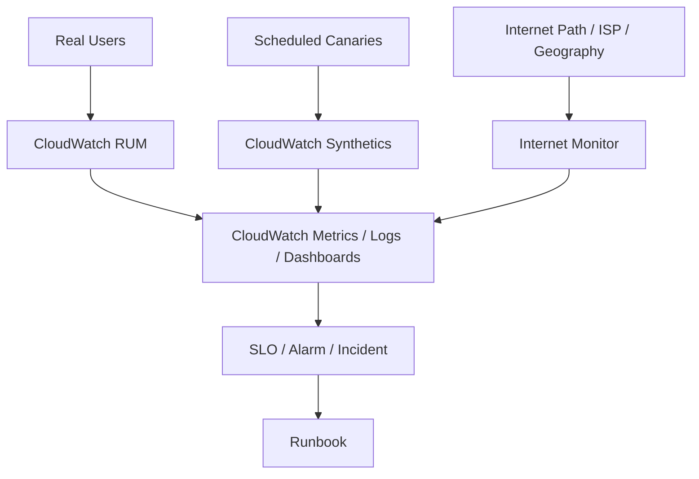
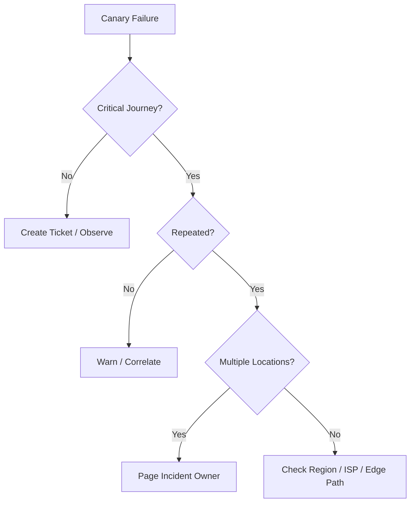
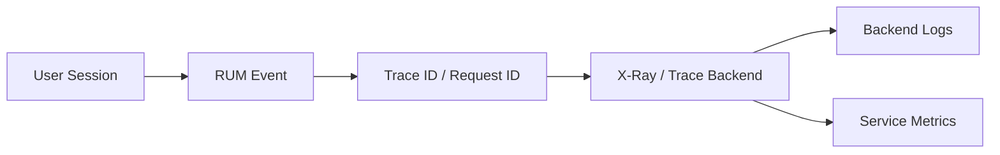
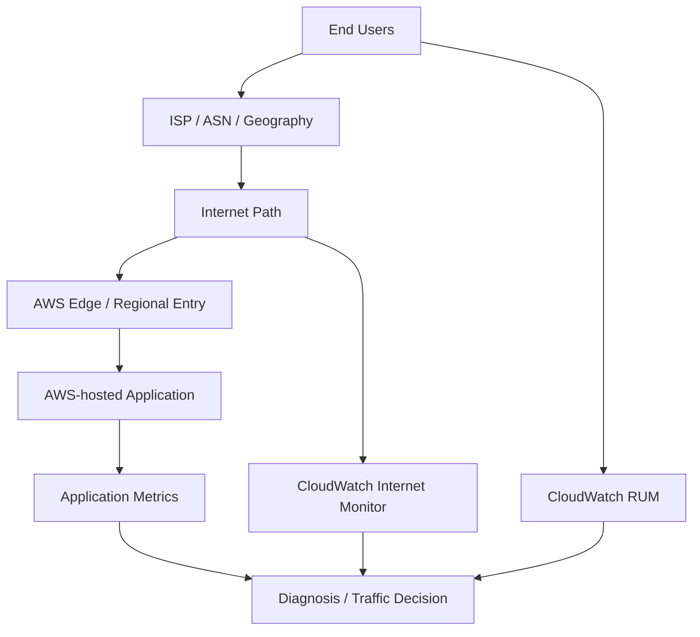
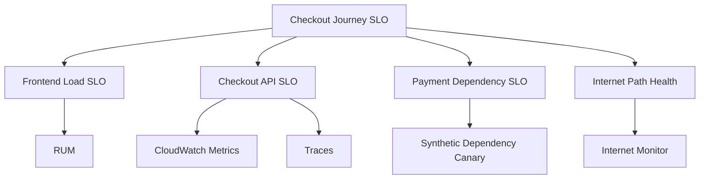
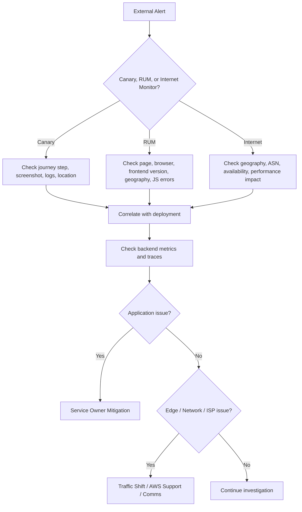

# Part 062 — Synthetics, RUM, and Internet Monitoring

Most observability starts from inside the system: CPU, memory, logs, traces, latency, errors, and dependency calls. That is necessary, but incomplete.

Users experience your system from the outside.

They see:

- DNS resolution;
- TLS handshake;
- CDN behavior;
- browser rendering;
- JavaScript errors;
- third-party script delays;
- ISP and internet path problems;
- regional network impairment;
- authentication redirects;
- API failure from their geography;
- checkout failure after multiple UI steps.

Internal metrics can say the backend is healthy while users cannot complete a critical journey.

This part covers three AWS-native mechanisms for closing that gap:

1. **CloudWatch Synthetics** — scripted probes that test endpoints and user journeys on a schedule.
2. **CloudWatch RUM** — browser-side real user telemetry from actual user sessions.
3. **CloudWatch Internet Monitor** — visibility into internet performance and availability between AWS-hosted applications and end users.

Official references:

- CloudWatch Synthetics: https://docs.aws.amazon.com/AmazonCloudWatch/latest/monitoring/CloudWatch_Synthetics_Canaries.html
- CloudWatch RUM: https://docs.aws.amazon.com/AmazonCloudWatch/latest/monitoring/CloudWatch-RUM.html
- CloudWatch Internet Monitor: https://docs.aws.amazon.com/AmazonCloudWatch/latest/monitoring/CloudWatch-InternetMonitor.html
- CloudWatch Network Monitoring: https://docs.aws.amazon.com/AmazonCloudWatch/latest/monitoring/CloudWatch-Network-Monitoring-Sections.html

---

## 1. Mental Model

Internal observability asks:

```text
Is the system healthy from our infrastructure's point of view?
```

Synthetic and user-centric observability ask:

```text
Can users successfully experience the product from where they are?
```

That changes the shape of monitoring.



Each signal answers a different question.

| Signal | Primary Question | Strength | Blind Spot |
|---|---|---|---|
| Synthetics | Can a known journey work right now? | Proactive, controlled | Not real user diversity |
| RUM | What are real users experiencing? | Real browser/user impact | Needs traffic and client instrumentation |
| Internet Monitor | Is the internet path causing impact? | Network/ISP/geography visibility | Does not replace app-level tracing |
| Backend metrics | Is backend service healthy? | Precise service telemetry | May miss frontend/internet failures |

A mature observability design uses all four.

---

## 2. CloudWatch Synthetics: Proactive User Journey Testing

CloudWatch Synthetics uses **canaries**: configurable scripts that run on a schedule to monitor endpoints, APIs, and user journeys.

A canary is not just a ping. A useful canary acts like a small robot user:

1. open homepage;
2. resolve DNS;
3. negotiate TLS;
4. authenticate or use test credentials;
5. call API;
6. verify response content;
7. click through critical UI flow;
8. capture screenshot or HAR-like evidence;
9. publish metrics and logs;
10. alarm on failure or latency.

Good canaries monitor **business-critical journeys**, not every URL.

Examples:

- login works;
- search returns results;
- checkout can reach payment authorization test endpoint;
- dashboard loads for a synthetic tenant;
- public API returns valid schema;
- file upload pre-signed URL can be generated and used;
- admin portal health page loads from external path.

---

## 3. Canary Taxonomy

| Canary Type | What It Tests | Example |
|---|---|---|
| Availability canary | Endpoint reachable | `GET /healthz` returns 200 |
| API contract canary | Response shape and behavior | `/pricing` returns expected JSON schema |
| Journey canary | Multi-step user flow | login → search → checkout |
| Dependency canary | External provider path | payment sandbox auth works |
| Edge canary | CDN/WAF/TLS path | CloudFront page with security headers |
| Regional canary | Geography-specific path | APAC users can reach Singapore region |
| Auth canary | Identity integration | OIDC/SAML redirect and token flow works |
| Compliance canary | Required control observable | endpoint enforces TLS/security headers |

The mistake is making canaries either too shallow or too brittle.

Too shallow:

```text
GET /health returns OK while checkout is broken.
```

Too brittle:

```text
Canary fails because a button label changed but user journey still works.
```

The target is **stable user intent**, not fragile DOM trivia.

---

## 4. Canary Design Principles

### Principle 1 — Test from outside the trust boundary

If the canary runs only from inside the VPC, it may miss DNS, CDN, WAF, TLS, edge, or internet path issues.

### Principle 2 — Use synthetic identities safely

Synthetic test users should:

- be clearly marked;
- have minimal privileges;
- not bypass normal authentication unless intentionally testing internal health;
- use test tenants/data;
- be excluded from business analytics where appropriate;
- be included in security/audit logs.

### Principle 3 — Verify business result, not just HTTP status

Bad:

```text
HTTP 200 means success.
```

Better:

```text
HTTP 200 + response schema valid + expected business marker present + latency below threshold.
```

### Principle 4 — Keep canaries deterministic

Canaries should not depend on random user state, shared mutable records, or third-party data that changes without control.

### Principle 5 — Design safe write canaries

Some important journeys require writes.

For example:

- create test order;
- upload test file;
- reserve test inventory;
- submit test form.

Safe write canaries need cleanup, idempotency, test markers, and data retention rules.

---

## 5. Synthetics Alerting Pattern

A single canary failure should not always page humans.

Use severity bands:

| Condition | Response |
|---|---|
| One failure, non-critical journey | ticket or low-severity alert |
| Repeated failure across multiple runs | incident candidate |
| Critical journey failure from one location | investigate region/path |
| Critical journey failure from many locations | page service owner |
| Canary fails but RUM is healthy | possible synthetic/test issue |
| RUM user failures but canary healthy | real-user/device/geography-specific issue |

Decision diagram:



---

## 6. CloudWatch RUM: Real User Monitoring

CloudWatch RUM collects client-side telemetry from real web application sessions.

It helps answer:

- Are users seeing page load delays?
- Which browser/device/geography is affected?
- Are JavaScript errors increasing?
- Which pages have degraded performance?
- Are sessions failing after a frontend deployment?
- Is user impact limited to a specific country, browser, or page?

RUM adds the user-experience dimension that backend metrics cannot see.

Backend latency may be normal while browser experience is bad because of:

- large JavaScript bundle;
- slow third-party script;
- CDN cache miss behavior;
- browser compatibility issue;
- frontend exception;
- client-side route rendering delay;
- ad/tracker/script blocking;
- regional network conditions.

---

## 7. RUM Data Model

Typical RUM dimensions:

- page URL or route;
- browser;
- device type;
- operating system;
- geography;
- session;
- page load timing;
- resource timing;
- JavaScript error;
- HTTP error;
- custom event;
- user journey marker.

Do not send raw sensitive identifiers.

Bad:

```text
email
phone
full name
access token
full URL with personal query params
account number
```

Better:

```text
anonymous session id
tenant tier
route template
browser family
country/region
frontend version
feature flag state
```

RUM is powerful because it observes users. That also makes it a privacy-sensitive telemetry stream.

---

## 8. RUM and Security

RUM can accidentally become a client-side data exfiltration path.

Controls:

1. use route templates instead of raw URLs where possible;
2. scrub query strings;
3. avoid capturing form inputs;
4. avoid collecting tokens, cookies, or headers;
5. define sampling rate;
6. document retention;
7. restrict dashboard/query access;
8. include RUM in data classification and privacy review;
9. separate prod vs non-prod app monitors;
10. monitor unusual RUM volume spikes.

Security invariant:

```text
No secret, credential, or regulated personal data should be emitted through browser telemetry.
```

---

## 9. RUM + Trace Correlation

The strongest debugging model connects frontend user experience with backend traces.



This lets you answer:

- user saw checkout failure;
- browser error happened at frontend version X;
- request id maps to backend trace;
- backend trace shows payment provider timeout;
- logs show retry exhaustion;
- alarm links to payment service runbook.

That is much better than asking frontend, backend, and platform teams to search independently.

---

## 10. Internet Monitor: Internet Path Visibility

CloudWatch Internet Monitor gives visibility into how internet issues affect performance and availability between AWS-hosted applications and end users.

The key idea: not every user-facing issue is caused by your application.

Possible causes:

- ISP impairment;
- geography-specific latency;
- regional internet routing anomaly;
- edge path issue;
- last-mile problem;
- partial availability degradation;
- traffic shift effect;
- CDN/origin routing interaction.

Internet Monitor is useful when users report:

```text
The app is slow only from this country.
The API works from our office but not from a mobile ISP.
Latency increased in one geography while backend metrics are normal.
Error rate increased for one city/ASN but not globally.
```

---

## 11. Internet Monitor Mental Model



Internet Monitor should not be used alone. Correlate it with:

- RUM impact;
- synthetics from affected locations;
- CloudFront/ALB/API Gateway metrics;
- backend service metrics;
- deployment timeline;
- DNS or traffic policy changes;
- support ticket geography.

---

## 12. Choosing the Right External Signal

| Scenario | Best First Signal | Why |
|---|---|---|
| Checkout is down before users complain | Synthetics | Known critical path can fail proactively |
| JavaScript error after frontend release | RUM | Real browser stack traces and page data |
| Users in one country report slowness | Internet Monitor + RUM | Geography and internet path impact |
| API health endpoint returns 200 but UI broken | Synthetics journey + RUM | Need user journey validation |
| Backend latency is normal but page is slow | RUM | Client rendering/resource timing |
| Only one ISP affected | Internet Monitor | ASN/path visibility |
| Login redirect broken | Synthetics auth canary | Multi-step identity flow |
| Third-party script slows page | RUM | Client-side resource timing |

---

## 13. SLO Design with External Signals

Backend-only SLO:

```text
99.9% of API requests complete under 300ms.
```

Useful but incomplete.

User-centric SLO:

```text
99.5% of checkout journeys complete successfully within 5 seconds from supported geographies.
```

This requires multiple signals:

- canary success rate;
- RUM page/journey success;
- backend service SLO;
- dependency SLO;
- internet path health;
- error budget policy.

Example SLO hierarchy:



Do not overload one metric to explain the entire user experience.

---

## 14. Incident Response Flow

When external monitoring alerts, use this flow.



Useful incident questions:

- Did a deployment happen near the start time?
- Are synthetics and RUM both failing?
- Is impact limited to geography, browser, ISP, tenant, or journey?
- Is backend error rate aligned with user impact?
- Did WAF, CloudFront, DNS, certificate, or auth config change?
- Is there a Security Hub/GuardDuty event around the same window?
- Is the failure synthetic-only?
- Can traffic be shifted or degraded gracefully?

---

## 15. Common Anti-Patterns

### Anti-Pattern 1 — Health Endpoint Only

A `/health` endpoint returning OK is not user experience.

It can miss:

- broken login;
- broken checkout;
- broken frontend bundle;
- broken third-party dependency;
- invalid response schema;
- regional internet path issue.

### Anti-Pattern 2 — Canary Tests Implementation Details

If a canary breaks whenever CSS or DOM structure changes, it becomes noise.

Test stable user outcomes, not brittle implementation artifacts.

### Anti-Pattern 3 — RUM Without Privacy Review

Browser telemetry can contain sensitive data. Treat it as governed telemetry.

### Anti-Pattern 4 — Alerting on Every Canary Failure

Synthetic probes fail for many reasons. Alert on meaningful patterns and critical paths.

### Anti-Pattern 5 — No Correlation Between RUM and Backend

Frontend says users fail. Backend says everything is fine. Nobody can connect the two.

Solve this with request id and trace propagation.

### Anti-Pattern 6 — Ignoring Internet Path

Not all user impact is your service. But you still own diagnosis and communication.

---

## 16. Production Dashboard Layout

A good external observability dashboard has layers.

### Layer 1 — Executive/User Impact

- affected journey;
- affected geography;
- affected user count/session count;
- current SLO burn;
- severity;
- known incident link.

### Layer 2 — Synthetic Probes

- canary success rate;
- canary duration;
- failure step;
- screenshots/artifacts;
- region/location breakdown.

### Layer 3 — RUM

- page load performance;
- frontend errors;
- route-level impact;
- browser/device/geography breakdown;
- frontend version comparison.

### Layer 4 — Internet

- availability/performance score;
- affected geography/ASN;
- health events;
- traffic percentage affected;
- recommended alternate path if available.

### Layer 5 — Backend Correlation

- service SLO;
- API latency/error;
- trace exemplars;
- dependency health;
- recent deployments;
- security/network change events.

---

## 17. Security Monitoring Use Cases

External observability also helps security operations.

Examples:

| Signal | Security-Relevant Use |
|---|---|
| Synthetics | Detect WAF misconfiguration blocking valid users |
| Synthetics | Validate security headers and TLS posture |
| RUM | Detect sudden frontend error spike after script injection or supply-chain issue |
| RUM | Identify abnormal client-side failures by geography/browser |
| Internet Monitor | Distinguish application outage from regional internet impairment |
| External canary | Validate auth redirect and session behavior |
| API canary | Detect unexpected schema or auth behavior |

Security note:

A canary that verifies critical controls is useful, but it must not expose secrets or bypass real controls in a way attackers could abuse.

---

## 18. Implementation Sequence

Do not enable everything randomly.

### Step 1 — Identify critical user journeys

Examples:

```text
Login
Search
Checkout
Payment authorization
Dashboard load
File upload
Admin approval
Public API request
```

### Step 2 — Define user-centric SLIs

For each journey:

- success rate;
- latency;
- page load time;
- error rate;
- geography;
- browser/device;
- synthetic result;
- backend dependency health.

### Step 3 — Add canaries first for critical paths

Start with 3–5 high-value canaries.

### Step 4 — Add RUM for real user impact

Roll out with sampling, privacy review, and route normalization.

### Step 5 — Add Internet Monitor for user-facing workloads

Prioritize internet-facing applications with meaningful geography diversity.

### Step 6 — Correlate with backend telemetry

Ensure request ids, trace ids, frontend version, backend version, and deployment markers connect.

### Step 7 — Build alert policy

Use severity based on:

- criticality;
- repeated failure;
- user count affected;
- geography scope;
- SLO burn;
- business window.

### Step 8 — Add runbook and ownership

Every alert must answer:

```text
Who owns this?
What does it mean?
Where do I look next?
What can I safely do?
How do I communicate impact?
```

---

## 19. Failure Modes

| Failure Mode | Symptom | Consequence | Control |
|---|---|---|---|
| Canary too shallow | Health green, users fail | False confidence | Journey-based canaries |
| Canary too brittle | Frequent false alarms | Alert fatigue | Stable selectors, intent-based checks |
| Synthetic credentials expire | Canary fails | Noise or missed auth test | secret rotation and alert owner |
| RUM leaks PII | Compliance incident | Trust/security failure | redaction, sampling, privacy review |
| RUM not sampled enough | weak visibility | underestimates impact | sampling policy by app criticality |
| No trace correlation | frontend/backend blame loop | slow diagnosis | propagate request/trace ids |
| Internet issue ignored | wrong mitigation | unnecessary rollback | Internet Monitor correlation |
| Canaries excluded from WAF | false positive health | control bypass hidden | test through real edge path |
| All canaries from one location | geography blind spot | regional impact missed | location strategy |
| No cleanup for write canary | test data pollution | data quality/cost issue | idempotency and cleanup job |

---

## 20. Production Checklist

```text
[ ] Critical user journeys are explicitly listed.
[ ] Each critical journey has an external synthetic check or clear reason not to.
[ ] Canaries verify business result, not just HTTP 200.
[ ] Canary credentials are least-privilege and rotated.
[ ] Write canaries are idempotent and clean up test data.
[ ] RUM is privacy-reviewed and avoids sensitive data capture.
[ ] RUM uses route templates or normalized URLs.
[ ] RUM events include frontend version and environment.
[ ] RUM can be correlated to backend traces/logs where needed.
[ ] Internet Monitor is enabled for major internet-facing workloads.
[ ] Dashboards separate synthetic, real-user, internet, and backend views.
[ ] Alerts are severity-based and linked to runbooks.
[ ] Synthetic-only failure is handled differently from real-user impact.
[ ] External signals are included in SLO/error-budget decisions.
```

---

## 21. What Top Engineers Internalize

Internal telemetry tells you how your system sees itself.

External and user-centric telemetry tells you how the world sees your system.

Those are not the same.

A service can have low CPU, normal memory, healthy containers, clean backend logs, and still be unusable because:

- users cannot reach it from a geography;
- JavaScript crashes in one browser;
- WAF blocks valid traffic;
- certificate renewal failed at the edge;
- auth redirect flow broke;
- third-party script delays page rendering;
- checkout UI changed but API remained healthy.

The mature model is not:

```text
CloudWatch metrics + logs = observability.
```

The mature model is:

```text
Backend health + frontend experience + synthetic journeys + internet path + traces + logs + SLO = operational truth.
```

That is the reason Synthetics, RUM, and Internet Monitor matter.

They move monitoring from infrastructure comfort to user reality.
