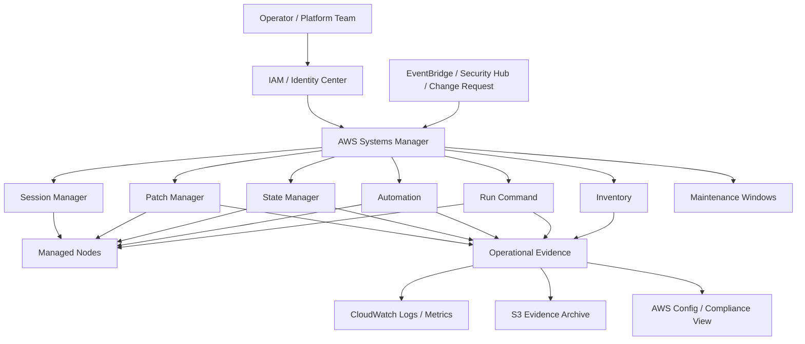
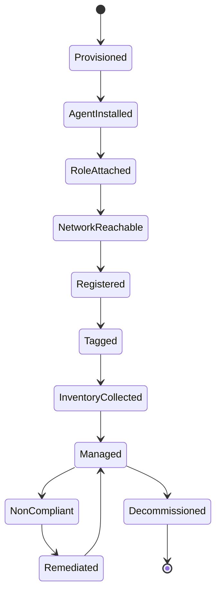
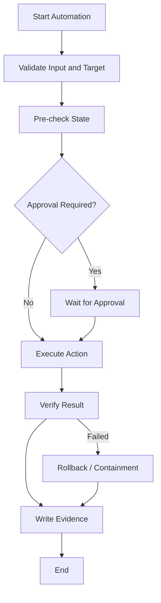
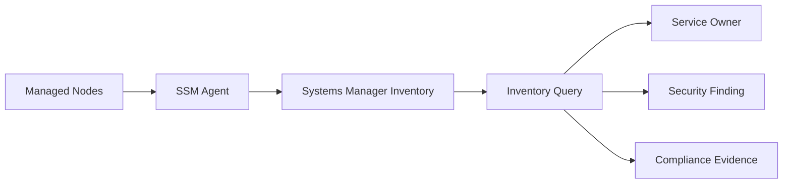
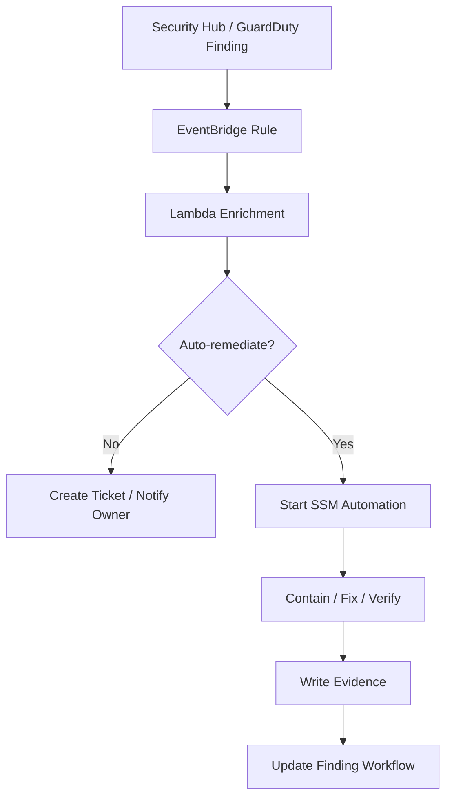
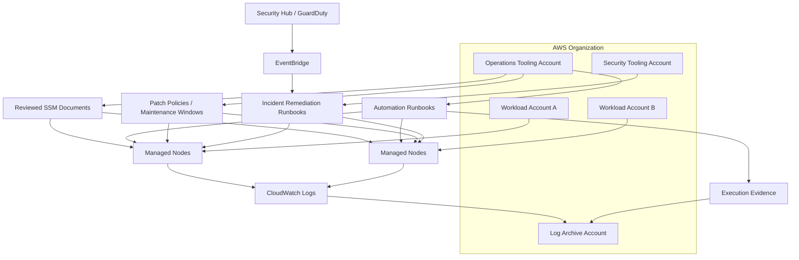

# Part 063 — Systems Manager Operating Model

Security and observability tell you what is happening.

Operations needs one more capability:

```text
Can we safely change, inspect, repair, and control the fleet at scale?
```

That is the role of **AWS Systems Manager**.

Do not think of Systems Manager as one feature. It is a **management plane** for AWS and hybrid infrastructure. It can inventory nodes, run commands, apply desired state, patch operating systems, execute automation runbooks, open audited sessions, manage maintenance windows, coordinate changes, and provide operational evidence.

In a mature AWS organization, Systems Manager becomes the difference between:

```text
Someone manually SSHs into a box and fixes something.
```

and:

```text
A controlled runbook executes against a tagged target set, under IAM, with rate limits, logs, evidence, rollback plan, and ownership.
```

Official references:

- AWS Systems Manager: https://docs.aws.amazon.com/systems-manager/latest/userguide/what-is-systems-manager.html
- SSM Agent: https://docs.aws.amazon.com/systems-manager/latest/userguide/ssm-agent.html
- Run Command: https://docs.aws.amazon.com/systems-manager/latest/userguide/run-command.html
- Automation: https://docs.aws.amazon.com/systems-manager/latest/userguide/systems-manager-automation.html
- State Manager: https://docs.aws.amazon.com/systems-manager/latest/userguide/systems-manager-state.html
- Patch Manager: https://docs.aws.amazon.com/systems-manager/latest/userguide/patch-manager.html
- Maintenance Windows: https://docs.aws.amazon.com/systems-manager/latest/userguide/maintenance-windows.html
- Change Manager: https://docs.aws.amazon.com/systems-manager/latest/userguide/change-manager.html
- Systems Manager documents: https://docs.aws.amazon.com/systems-manager/latest/userguide/documents.html

---

## 1. Mental Model

Systems Manager is not a monitoring service.

It is an **operational control system**.

It connects four things:

1. **managed resources** — EC2 instances, edge devices, on-prem servers, hybrid nodes, and some AWS resources;
2. **identity and authorization** — IAM, roles, policies, tags, and delegated access;
3. **documents and runbooks** — repeatable operational logic encoded as Systems Manager documents;
4. **evidence and feedback** — command output, automation execution history, inventory, patch compliance, association status, and logs.



A good operating model treats Systems Manager as a **controlled actuator**.

It can change things. Therefore it must be governed like any other powerful production control plane.

---

## 2. Why Systems Manager Exists

At small scale, operations often looks like this:

```text
SSH into server → run command → hope it worked → paste output into ticket.
```

At production scale, this breaks down.

You need answers to harder questions:

- Which nodes exist?
- Which nodes are manageable?
- Which nodes are missing the agent?
- Which nodes are missing patches?
- Which command changed production?
- Who executed it?
- Was it approved?
- Which nodes were targeted?
- Which nodes failed?
- Did the command run everywhere or only some instances?
- Was execution rate-limited?
- Where is the output stored?
- Can we repeat the same remediation safely?
- Can we prove the control worked?

Systems Manager exists to turn ad-hoc operations into a **repeatable, auditable, scoped, and automatable workflow**.

---

## 3. Core Vocabulary

| Term | Meaning | Why It Matters |
|---|---|---|
| Managed node | A machine/resource configured for Systems Manager | The unit of fleet operations |
| SSM Agent | Agent running on the node | Executes commands and communicates with SSM |
| Instance profile | IAM role attached to EC2 | Lets the node register and communicate with SSM |
| Document | JSON/YAML definition of operation | Encodes operational behavior |
| Command document | Document for Run Command/State Manager/Maintenance Windows | Runs shell/script/config actions |
| Automation runbook | Document for multi-step automation | Encodes repair/change workflows |
| Association | State Manager binding between document and target | Keeps target in desired state |
| Maintenance window | Scheduled time window for disruptive work | Controls when operations occur |
| Inventory | Collected metadata about nodes/software | Enables visibility and compliance |
| Patch baseline | Rule set for patch approval | Defines patch policy |
| Compliance | Status of patch/state/config requirement | Evidence for operations and audit |

This vocabulary matters because Systems Manager is not a single command runner. It is a family of control mechanisms with different semantics.

---

## 4. Systems Manager Capability Map

A practical way to read Systems Manager is by operational intent.

| Intent | Systems Manager Capability | Example |
|---|---|---|
| Inspect fleet | Fleet Manager, Inventory | Show installed packages and node metadata |
| Execute one-time action | Run Command | Restart agent on tagged nodes |
| Encode multi-step workflow | Automation | Snapshot volume, stop instance, patch, start, verify |
| Keep desired state | State Manager | Ensure CloudWatch Agent config is installed |
| Patch safely | Patch Manager | Apply security updates during maintenance window |
| Access shell securely | Session Manager | Open audited shell without inbound SSH |
| Schedule disruptive work | Maintenance Windows | Patch production during approved window |
| Govern changes | Change Manager | Request, approve, execute, report |
| Manage documents | Documents | Version operational commands/runbooks |
| Distribute software | Distributor | Package and deploy agents/tools |
| Manage config rollout | AppConfig | Controlled application config deployment |

The dangerous anti-pattern is using all capabilities as if they were the same thing.

They are not.

---

## 5. Command vs State vs Automation

This distinction is fundamental.

| Mechanism | Semantic | Good For | Bad For |
|---|---|---|---|
| Run Command | Do this now | One-time command, emergency inspection, simple fix | Complex orchestration without checkpoints |
| State Manager | Keep this true | Agent installed, config present, service enabled | One-off emergency action |
| Automation | Execute workflow | Multi-step remediation/change with branching | Very high-frequency shell execution |
| Patch Manager | Apply patch policy | OS patch compliance | Arbitrary software deployment |
| Maintenance Window | Do scheduled work | Disruptive work under approved window | Immediate incident containment |
| Change Manager | Govern change lifecycle | Approval-heavy environments | Fast low-risk routine work unless policy requires |

Mental shortcut:

```text
Run Command = imperative action.
State Manager = desired-state association.
Automation = workflow.
Patch Manager = patch governance.
Maintenance Window = schedule boundary.
Change Manager = approval and reporting boundary.
```

If everything is Run Command, you have recreated SSH at scale.

---

## 6. Managed Node Lifecycle

A node is not operationally ready just because EC2 says it is `running`.

For Systems Manager, a node must move through a manageability lifecycle.



A production fleet should track these states explicitly.

| State | Verification Signal |
|---|---|
| Agent installed | SSM Agent package/service exists |
| Role attached | Instance profile contains required SSM permissions |
| Network reachable | Node can reach SSM endpoints or public AWS endpoints |
| Registered | Appears as managed node |
| Tagged | Required ownership/environment tags present |
| Inventory collected | Inventory records exist and are fresh |
| Managed | Can receive command/association/session |
| Noncompliant | Patch/state/config check failing |
| Remediated | Compliance restored and verified |

The invariant:

```text
Every production compute node must be either manageable by Systems Manager or explicitly exempted with documented rationale.
```

---

## 7. Bootstrap Requirements

For EC2, the usual bootstrap requirements are:

1. SSM Agent installed and running.
2. Instance profile with required Systems Manager permissions.
3. Network path to Systems Manager service endpoints.
4. Correct region configuration.
5. Time synchronization.
6. Required tags.
7. CloudWatch/S3 output destination if command/session logs are required.
8. KMS permissions if encrypted logs or session data are used.

Typical managed instance profile uses AWS-managed policy patterns such as `AmazonSSMManagedInstanceCore`, then adds narrower permissions only when needed.

Do not attach broad administrator policies to instances to “make SSM work”.

A node should be able to communicate with SSM without becoming a privileged AWS actor.

---

## 8. Private Network Design for SSM

Systems Manager can work without opening inbound SSH/RDP.

But the node still needs outbound communication to Systems Manager endpoints.

Common endpoint set for private subnets:

| Endpoint | Purpose |
|---|---|
| `com.amazonaws.<region>.ssm` | Systems Manager API |
| `com.amazonaws.<region>.ssmmessages` | Session/data channels |
| `com.amazonaws.<region>.ec2messages` | Agent communication for EC2 messages |
| `com.amazonaws.<region>.logs` | CloudWatch Logs output |
| `com.amazonaws.<region>.s3` | S3 output/packages/artifacts where needed |
| `com.amazonaws.<region>.kms` | KMS encryption/decryption where used |

In strict environments, use VPC endpoints and endpoint policies.

This gives you a better invariant:

```text
Managed nodes do not need public IPs or inbound administration ports to be operable.
```

That changes the security posture dramatically.

---

## 9. SSM Agent as Local Actuator

SSM Agent is powerful because it executes actions on the node.

That means it is part of the trusted computing base.

Operational requirements:

- agent installed from trusted source;
- agent kept updated;
- agent service monitored;
- agent logs retained for troubleshooting;
- outbound connectivity controlled;
- instance profile least-privileged;
- commands restricted by IAM;
- session access restricted by IAM and tags;
- command output captured centrally;
- agent tampering detected.

Failure modes:

| Failure | Effect | Detection |
|---|---|---|
| Agent stopped | Node not manageable | Managed node stale/offline |
| Instance profile missing | Node cannot register | Bootstrap validation fails |
| Endpoint blocked | Command/session fails | Agent logs, VPC Flow Logs |
| Time drift | TLS/auth failures | NTP/Chrony health check |
| Disk full | Agent/logging unstable | Node metrics/logs |
| IAM overbroad | Node can do too much | IAM Access Analyzer, policy review |
| Command access overbroad | Operators can mutate fleet arbitrarily | IAM simulation, CloudTrail |

Treat SSM Agent like a privileged daemon.

---

## 10. Tagging as Operational Targeting

Systems Manager frequently targets nodes by tags.

That makes tags operationally dangerous.

Example target:

```text
Environment=prod
Service=payments
PatchGroup=prod-linux-critical
Owner=platform-payments
```

If an engineer can freely modify these tags, they may be able to move nodes into or out of operational actions.

For example:

- removing `PatchGroup=prod` avoids patching;
- adding `Environment=prod` accidentally includes dev node in production operation;
- changing `Owner` breaks routing;
- changing `AccessProfile` changes who can open sessions.

Therefore, management tags need governance.

| Tag Type | Example | Control |
|---|---|---|
| Ownership | `Owner`, `CostCenter` | Required at creation |
| Environment | `Environment=prod` | Protected mutation |
| Operations | `PatchGroup`, `MaintenanceWindow` | Controlled by platform ops |
| Access | `SessionAccessGroup` | Security-owned |
| Compliance | `DataClass`, `Regulated` | Compliance/security-owned |
| Lifecycle | `DecommissionAfter` | Automation-owned |

Invariant:

```text
No principal that can start broad SSM operations should also be able to arbitrarily mutate the tags that define operation targets.
```

---

## 11. Run Command Operating Model

Run Command is useful, but dangerous when used carelessly.

It should be treated as **remote execution under IAM**.

Good uses:

- collect diagnostic info;
- restart a known agent;
- run a safe health check;
- apply a bounded emergency fix;
- collect package versions;
- trigger local script with fixed path;
- rotate local config under controlled scope.

Bad uses:

- exploratory shell over hundreds of production instances;
- `AWS-RunShellScript` allowed to broad engineering group without restriction;
- commands targeting `*`;
- no output logging;
- no rate limit;
- no error threshold;
- no ticket/change reference;
- no rollback plan for mutating commands.

Run Command execution should define:

| Control | Why |
|---|---|
| Target scope | Prevent accidental broad execution |
| Max concurrency | Limit blast radius |
| Error threshold | Stop rollout when failures begin |
| Output destination | Preserve evidence |
| IAM condition | Restrict documents and targets |
| Approval path | Govern mutating production commands |
| Command template | Avoid arbitrary shell where possible |
| CloudTrail monitoring | Detect misuse |

The safest Run Command pattern is not “allow shell”.

It is:

```text
Allow specific documents against specific tagged nodes with bounded parameters.
```

---

## 12. Systems Manager Documents

Systems Manager documents are the unit of operational logic.

Main document types used in this series:

| Document Type | Used By | Purpose |
|---|---|---|
| Command document | Run Command, State Manager, Maintenance Windows | Execute commands/configuration on nodes |
| Automation runbook | Automation, State Manager | Multi-step AWS/node workflow |
| Session document | Session Manager | Define session behavior |
| Package document | Distributor | Package install/update/remove |

A document is production code.

It needs:

- versioning;
- code review;
- parameter constraints;
- clear owner;
- rollback behavior;
- test environment;
- permissions boundary;
- execution logs;
- change history;
- deprecation policy.

Bad document:

```yaml
schemaVersion: '2.2'
description: Run arbitrary command
parameters:
  commands:
    type: StringList
mainSteps:
  - action: aws:runShellScript
    name: runAnything
    inputs:
      runCommand: '{{ commands }}'
```

Better document:

```yaml
schemaVersion: '2.2'
description: Restart only the CloudWatch Agent and verify status
parameters:
  expectedServiceName:
    type: String
    default: amazon-cloudwatch-agent
    allowedPattern: '^amazon-cloudwatch-agent$'
mainSteps:
  - action: aws:runShellScript
    name: restartCloudWatchAgent
    inputs:
      timeoutSeconds: '60'
      runCommand:
        - 'sudo systemctl restart amazon-cloudwatch-agent'
        - 'sudo systemctl is-active amazon-cloudwatch-agent'
```

The difference is not syntax. The difference is **operational authority**.

---

## 13. Automation Runbooks

Automation is for controlled workflows.

A runbook can perform sequential steps, call AWS APIs, run scripts, branch, wait, approve, and produce execution history.

Useful security/operations runbooks:

| Runbook | Purpose |
|---|---|
| Quarantine EC2 instance | Apply isolation security group and preserve evidence |
| Restart failed agent | Repair SSM/CloudWatch agent safely |
| Create AMI before patch | Snapshot state before disruptive change |
| Rotate leaked access key | Disable key, notify owner, verify no use |
| Re-enable CloudTrail | Restore disabled audit service |
| Cancel KMS key deletion | Stop destructive key lifecycle action |
| Enforce log retention | Fix log group retention drift |
| Patch emergency CVE | Apply security patches to scoped fleet |

Runbook shape:



Runbooks should be **idempotent**.

Running a remediation twice should not cause worse damage than running it once.

---

## 14. State Manager Operating Model

State Manager is for keeping something true.

Examples:

- CloudWatch Agent installed and configured;
- security agent running;
- auditd enabled;
- baseline package installed;
- required file exists;
- service disabled;
- OS configuration applied;
- local users removed;
- NTP configuration present.

State Manager uses associations.

An association binds:

```text
document + parameters + target + schedule + compliance expectation
```

State Manager is not primarily about “run this once”. It is about convergence.

Good invariant:

```text
Every prod Linux node must converge to the baseline operations state within N minutes after launch.
```

Bad invariant:

```text
Someone should remember to install agents during AMI build.
```

State Manager helps when AMIs drift, launch templates change, or emergency replacement nodes come online.

---

## 15. Patch Manager Operating Model

Patch Manager is covered deeply in Part 065, but it belongs in the Systems Manager map.

Patch Manager automates patching of managed nodes using baselines, patch groups, policies, maintenance windows, and compliance reporting.

Patch decisions should consider:

| Dimension | Example |
|---|---|
| Environment | dev before staging before prod |
| OS family | Amazon Linux, Ubuntu, Windows Server |
| Criticality | internet-facing, regulated, internal |
| Patch type | security, bugfix, kernel, application dependency |
| Approval delay | immediate for critical CVE, delayed for normal patches |
| Reboot policy | reboot allowed only in maintenance window |
| Rollback | AMI/snapshot/backout plan |
| Compliance SLA | critical security patches within X days |

Patch Manager is not just “install updates”.

It is the evidence system for patch posture.

---

## 16. Inventory and Fleet Visibility

Inventory collects metadata from managed nodes.

Useful inventory categories include:

- applications;
- AWS components;
- files;
- network configuration;
- Windows roles;
- Windows updates;
- instance information;
- custom inventory.

Fleet questions inventory should answer:

- Which nodes run vulnerable package version?
- Which AMI is still deployed?
- Which nodes lack endpoint protection?
- Which nodes are missing CloudWatch Agent?
- Which nodes run unsupported OS version?
- Which application version exists in prod?
- Which node has unexpected package installed?

A mature organization treats inventory as a **queryable operating fact base**.



---

## 17. Maintenance Windows

Maintenance Windows define when disruptive actions can run.

They are useful for:

- patching;
- driver update;
- agent update;
- configuration migration;
- package installation;
- backup validation;
- periodic operational scripts.

A maintenance window should specify:

| Field | Example |
|---|---|
| Schedule | Every Sunday 02:00 local region time |
| Duration | 4 hours |
| Cutoff | Stop starting new tasks 1 hour before end |
| Targets | `PatchGroup=prod-linux-a` |
| Tasks | Run patch baseline scan/install |
| Rate limits | `MaxConcurrency=10%`, `MaxErrors=2%` |
| Owner | Platform operations |
| Evidence | Command output to S3/CloudWatch |

Do not schedule all production nodes at the same time.

Use waves.

```text
canary → low-risk services → medium-risk services → high-risk services → regulated services
```

---

## 18. Change Manager

Change Manager is useful when a regulated environment needs formal request/approval/reporting.

It provides workflow around operational changes:

1. create change request;
2. review and approve;
3. schedule execution;
4. run automation;
5. report status;
6. preserve evidence.

It fits organizations that need segregation of duties.

For example:

```text
Developer requests emergency cache node restart.
Service owner approves.
Operations role executes approved automation.
Evidence is attached to change record.
```

Not every operation needs Change Manager.

The decision should be risk-based.

| Operation | Change Manager? |
|---|---|
| Restart one non-prod agent | Usually no |
| Patch regulated production fleet | Yes |
| Rotate leaked prod credential | Maybe emergency workflow |
| Run read-only diagnostic command | Usually no |
| Disable audit service | Should be blocked, not approved casually |
| Update firewall policy globally | Yes |

---

## 19. Account and Delegation Model

Systems Manager can be used inside a single account, but production organizations need cross-account governance.

Recommended ownership pattern:

| Account | Responsibility |
|---|---|
| Management account | Avoid daily operations |
| Operations tooling account | Central operational automation and dashboards |
| Security tooling account | Security runbooks and incident response automation |
| Log archive account | Immutable output/evidence storage |
| Workload accounts | Managed nodes and local execution roles |

Key principle:

```text
Central teams own runbook standards and guardrails; workload teams own service-specific execution and validation.
```

Do not centralize all operational execution into one god role.

Use delegated patterns with scoped IAM and tags.

---

## 20. IAM Design for Systems Manager

Systems Manager permissions are high impact because they can reach into compute nodes and AWS resources.

IAM should distinguish roles:

| Role | Capabilities |
|---|---|
| Read-only operator | View inventory, compliance, command status |
| Diagnostic operator | Run approved read-only documents |
| Service operator | Run approved service-scoped runbooks |
| Patch operator | Manage patch baselines/windows for assigned fleet |
| Automation engineer | Author/update documents in non-prod |
| Automation publisher | Promote reviewed documents to prod |
| Incident responder | Execute emergency containment runbooks |
| SSM administrator | Configure account-level SSM settings |

Avoid:

```json
{
  "Action": "ssm:*",
  "Resource": "*",
  "Effect": "Allow"
}
```

Prefer:

- specific actions;
- specific document ARNs;
- specific target resources;
- tag conditions;
- permission boundaries;
- MFA conditions for interactive actions;
- change-ticket/session tags where possible;
- CloudTrail monitoring for sensitive APIs.

---

## 21. Output and Evidence Strategy

Every mutating operation should answer:

```text
What happened, where, under whose authority, and what was the result?
```

Evidence destinations:

| Evidence | Destination |
|---|---|
| Command output | CloudWatch Logs and/or S3 |
| Automation execution history | Systems Manager Automation execution records |
| Session logs | CloudWatch Logs/S3 where applicable |
| Inventory | Systems Manager Inventory |
| Patch compliance | Systems Manager Compliance |
| Change request | Change Manager |
| API calls | CloudTrail |
| Node-level logs | CloudWatch Agent / OS logs |

For regulated systems, output should flow to a log archive account with controlled access and retention.

The evidence model should preserve:

- requestor;
- approver;
- executor role;
- document version;
- parameters;
- targets;
- start/end time;
- output;
- error;
- verification result;
- rollback result if any.

---

## 22. Systems Manager and Security Findings

Systems Manager becomes powerful when connected to detection services.

Example flow:



Examples:

| Finding | Systems Manager Action |
|---|---|
| Instance suspected compromise | Quarantine instance and collect metadata |
| Missing security agent | State Manager association repair |
| Critical package CVE | Patch Manager emergency baseline |
| CloudWatch Agent stopped | Run Command restart + verify |
| Public security group | Automation to remove unsafe rule |
| Root login detected | Automation to gather evidence and notify |

The automation should not blindly mutate production on every finding.

Use a decision layer.

---

## 23. Rate Limits and Blast Radius

Any fleet operation must define blast radius controls.

Key controls:

| Control | Meaning |
|---|---|
| Target filter | Which nodes/resources are eligible |
| Max concurrency | How many targets run at once |
| Max errors | When to stop |
| Region scope | Which regions are touched |
| Account scope | Which accounts are touched |
| OU scope | Which environments are touched |
| Maintenance window | When execution may start |
| Approval | Who can authorize |
| Rollback | How to reverse |
| Kill switch | How to stop future executions |

Bad operation:

```text
Run patch install against all prod nodes globally now.
```

Good operation:

```text
Run patch install against PatchWave=prod-canary in ap-southeast-1, max 5%, max errors 1, during approved maintenance window, with snapshot precheck and service health verification.
```

---

## 24. Observability for Systems Manager Itself

Systems Manager is part of the operational platform. Monitor it.

Signals:

- number of managed nodes;
- stale/offline managed nodes;
- command failure rate;
- automation failure rate;
- patch compliance trend;
- inventory freshness;
- association compliance;
- session count;
- failed session attempts;
- use of dangerous documents;
- operations outside maintenance windows;
- commands targeting broad scopes;
- document updates in production;
- agent version distribution;
- endpoint connectivity failures.

Dashboards should separate:

| Dashboard | Audience |
|---|---|
| Fleet manageability | Platform operations |
| Patch compliance | Security/compliance |
| Automation execution | Platform automation team |
| Session access | Security/identity team |
| Incident operations | Incident responders |
| SSM health | Cloud platform team |

---

## 25. Security Anti-Patterns

### Anti-pattern 1 — SSM as SSH replacement without access model

Session Manager is better than unmanaged SSH, but only if IAM, logging, tag control, and session document restrictions are designed.

Otherwise you have moved the risk from port 22 to IAM.

### Anti-pattern 2 — Allowing arbitrary `AWS-RunShellScript`

This gives remote code execution at scale.

Use custom documents with constrained parameters where possible.

### Anti-pattern 3 — No output logging

If command output is not captured, you cannot debug, audit, or prove completion.

### Anti-pattern 4 — Targeting by mutable tags without tag governance

Tags become hidden authorization and execution boundaries.

Protect them.

### Anti-pattern 5 — One global operations admin role

A single broad role becomes a lateral movement prize.

Split by function and scope.

### Anti-pattern 6 — No non-prod runbook validation

Runbooks are code. Test them before production.

### Anti-pattern 7 — Automation without rollback

A remediation that cannot be verified or rolled back is just another incident generator.

---

## 26. Failure Modes

| Failure Mode | Cause | Impact | Control |
|---|---|---|---|
| Nodes missing from SSM | Agent/role/network failure | Fleet invisible/unmanageable | Bootstrap validation, compliance dashboard |
| Wrong nodes targeted | Bad tag/filter | Production incident | Protected tags, dry-run, approval |
| Command too broad | Wildcard target | Massive blast radius | Max concurrency/errors, scoped IAM |
| Runbook loops | Event-triggered automation retriggers itself | Automation storm | Idempotency, correlation ID, anti-loop guard |
| Output not captured | Logging disabled | No evidence | Mandatory output config |
| Document modified maliciously | Weak document governance | Privilege escalation | Code review, version pinning, CloudTrail alerts |
| Agent compromised | Node compromise | Attacker may abuse local context | Instance role least privilege, detection |
| Endpoint outage/misconfig | VPC endpoint/DNS issue | SSM unavailable | Health checks, endpoint monitoring |
| Patch breaks service | Insufficient canary/waves | Outage | Wave rollout, rollback, SLO gate |
| Emergency role abused | Broad incident role | Privilege abuse | MFA, approvals, session logs, CloudTrail alarms |

---

## 27. Production Reference Architecture



Key design choices:

- management account is not used for daily operations;
- operations and security runbooks are separated;
- workload accounts host managed nodes;
- evidence goes to controlled logging destinations;
- IAM limits execution by document, target tags, account, and environment;
- dangerous actions require approval or emergency role;
- SSM health is itself monitored.

---

## 28. Minimal Production Standards

Every production AWS account should answer these questions.

### Fleet Manageability

- Are all EC2 nodes registered in Systems Manager?
- Are unmanaged nodes intentional and documented?
- Is SSM Agent updated?
- Are required VPC endpoints present for private subnets?
- Are instance profiles least-privileged?

### Access

- Who can start sessions?
- Who can run commands?
- Which documents can they run?
- Which nodes can they target?
- Can they modify target tags?
- Are production actions MFA/approval protected?

### Evidence

- Is command output logged?
- Are automation executions retained?
- Are session logs enabled where applicable?
- Are CloudTrail events monitored?
- Is evidence stored outside the workload account?

### Operations

- Are patch baselines defined?
- Are maintenance windows defined?
- Are runbooks reviewed and versioned?
- Are failures alerted?
- Are automation loops prevented?
- Are rollback paths documented?

---

## 29. Practical Build Sequence

A safe adoption path:

1. enable Systems Manager in non-prod accounts;
2. ensure SSM Agent and instance profile baseline;
3. add VPC endpoints for private nodes;
4. define required tags;
5. enable inventory;
6. create fleet manageability dashboard;
7. enable command output logging;
8. create read-only diagnostic documents;
9. create constrained operational documents;
10. introduce State Manager for baseline agents/config;
11. introduce Patch Manager scan-only mode;
12. define maintenance windows;
13. move to patch install waves;
14. create automation runbooks for common incidents;
15. connect low-risk security findings to automation;
16. add approval for high-risk actions;
17. centralize evidence;
18. enforce production IAM boundaries.

Do not begin with broad remote execution.

Begin with visibility, then controlled action.

---

## 30. Example Governance Policy

```text
Policy: Production Systems Manager Operations

1. All production EC2 instances must be registered as Systems Manager managed nodes unless explicitly exempted.
2. Inbound SSH/RDP access to production nodes is prohibited unless approved as an exception.
3. Operators may run only approved SSM documents against production nodes.
4. Production Run Command execution must capture output to approved logging destinations.
5. Mutating commands require scoped target selection, max concurrency, max error threshold, and change reference.
6. Automation runbooks must be versioned, reviewed, tested in non-prod, and owned.
7. Tags used for SSM targeting or access control must be protected from arbitrary mutation.
8. Patch operations must run through approved maintenance windows or emergency change workflow.
9. Emergency remediation roles require MFA and are monitored by CloudTrail alerts.
10. SSM operational evidence must be retained according to the environment's evidence retention policy.
```

This kind of policy is boring.

That is good.

Production operations should be boring because the dangerous details are encoded into guardrails.

---

## 31. Engineering Exercises

### Exercise 1 — Fleet Readiness Matrix

Create a table for all EC2 instances:

| Instance | Account | Region | Environment | SSM Online | Agent Version | Instance Profile | Inventory Fresh | Owner |
|---|---|---|---|---|---|---|---|---|

Then define:

- unmanaged nodes;
- stale nodes;
- missing tags;
- risky instance profiles;
- missing inventory;
- unsupported OS versions.

### Exercise 2 — Replace One SSH Workflow

Pick one common SSH operation.

Examples:

- restart CloudWatch Agent;
- collect disk usage;
- inspect NGINX status;
- rotate local application config;
- restart sidecar.

Replace it with:

- custom SSM document;
- scoped IAM permission;
- command output logging;
- max concurrency/error threshold;
- runbook and rollback note.

### Exercise 3 — Build One Automation Runbook

Build a runbook for:

```text
Quarantine EC2 instance suspected compromise.
```

Include:

- input validation;
- instance tag/owner lookup;
- current security group capture;
- attach quarantine security group;
- preserve evidence;
- notify owner;
- update finding/ticket;
- rollback procedure.

### Exercise 4 — Patch Scan-Only Baseline

Enable patch scanning first, not patch installation.

Measure:

- missing patch count;
- critical patch count;
- OS distribution;
- stale nodes;
- compliance by owner/service;
- false positives/exceptions.

Only then move to patch install waves.

---

## 32. Review Questions

1. Why is Systems Manager more than a command runner?
2. What is the difference between Run Command, State Manager, and Automation?
3. Why are tags security-sensitive in Systems Manager?
4. Why should command output be centralized?
5. What makes `AWS-RunShellScript` risky in production?
6. How do max concurrency and max errors reduce blast radius?
7. Why should runbooks be idempotent?
8. What evidence do you need after an emergency remediation?
9. Why should production nodes not require inbound SSH/RDP?
10. What does it mean to monitor Systems Manager itself?

---

## 33. Key Takeaways

Systems Manager is the AWS-native operational actuator.

The mature view is:

```text
CloudTrail tells you what changed.
Config tells you what state exists.
CloudWatch tells you what is happening.
Security Hub tells you what needs attention.
Systems Manager lets you safely act.
```

The operating model is not “enable SSM”.

It is:

- make fleet manageable;
- define ownership tags;
- restrict who can act;
- restrict what documents can run;
- capture evidence;
- use desired state where possible;
- use automation for repeatable workflows;
- use maintenance windows for scheduled disruption;
- preserve rollback and verification;
- monitor the management plane itself.

The invariant for production:

```text
Every operational action must be scoped, authorized, logged, rate-limited, reversible where possible, and verifiable.
```

Part 064 continues with **Session Manager and Secure Access**.
