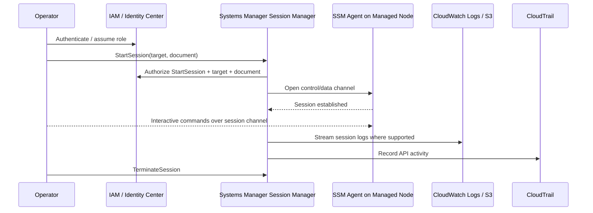
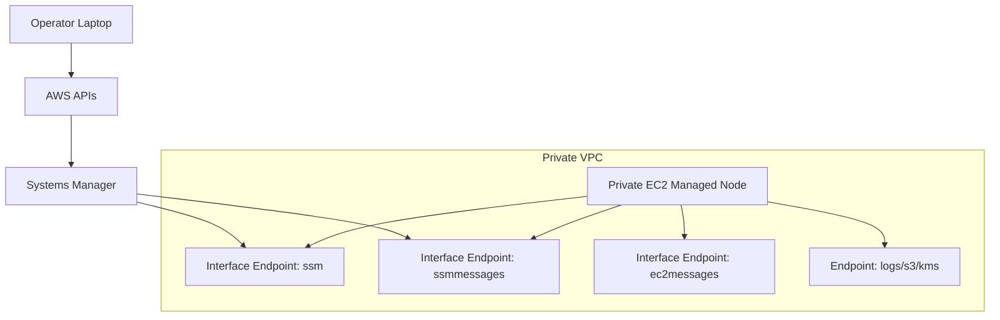
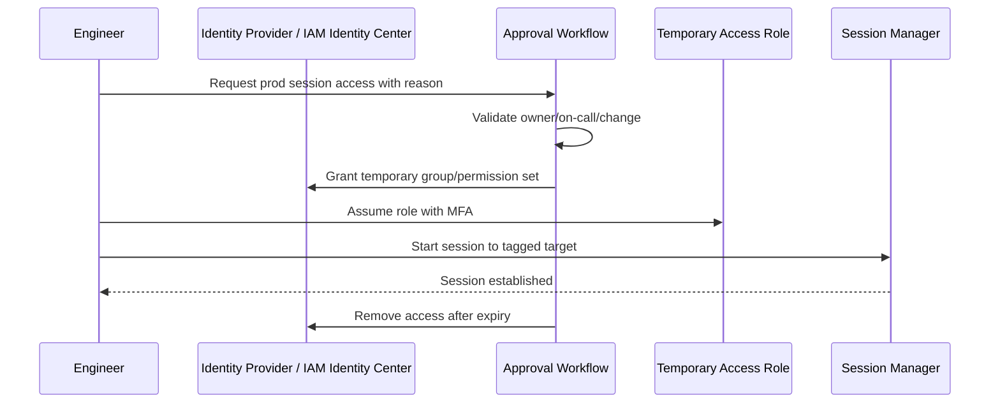
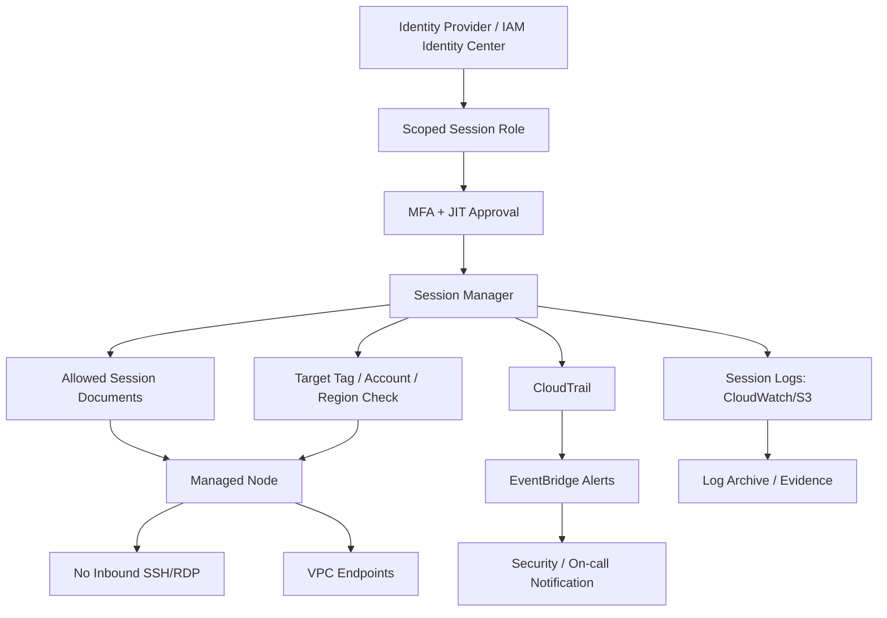

# Part 064 — Session Manager and Secure Access

Production shell access is a high-risk capability.

It bypasses many application controls. It can expose secrets, mutate state, delete evidence, escalate incidents, or quietly create them.

The old model was:

```text
Open SSH/RDP port → distribute keys/passwords → maintain bastion → inspect logs later.
```

That model does not age well.

**AWS Systems Manager Session Manager** gives a different access model:

```text
IAM-authorized session → SSM control/data channel → managed node → centralized audit/logging.
```

Used well, Session Manager removes inbound administration ports, reduces SSH key sprawl, centralizes access authorization in IAM, and improves auditability.

Used poorly, it becomes remote shell access hidden behind `ssm:StartSession`.

This part is about designing it safely.

Official references:

- Session Manager: https://docs.aws.amazon.com/systems-manager/latest/userguide/session-manager.html
- Starting sessions: https://docs.aws.amazon.com/systems-manager/latest/userguide/session-manager-working-with-sessions-start.html
- Session logging: https://docs.aws.amazon.com/systems-manager/latest/userguide/session-manager-logging.html
- Sample IAM policies for Session Manager: https://docs.aws.amazon.com/systems-manager/latest/userguide/getting-started-restrict-access-quickstart.html
- Additional Session Manager IAM policy examples: https://docs.aws.amazon.com/systems-manager/latest/userguide/getting-started-restrict-access-examples.html
- AWS Systems Manager condition keys: https://docs.aws.amazon.com/service-authorization/latest/reference/list_awssystemsmanager.html
- SSM Agent: https://docs.aws.amazon.com/systems-manager/latest/userguide/ssm-agent.html

---

## 1. Mental Model

Session Manager is not SSH.

It is an IAM-mediated session service.



The important boundary is IAM, not a network port.

Access is controlled by:

- who can call `ssm:StartSession`;
- which managed nodes they can target;
- which session documents they can use;
- whether MFA/conditions are required;
- whether session preferences force logging/encryption;
- whether port forwarding/SSH-style tunneling is allowed;
- whether target tags can be trusted;
- whether CloudTrail and session logs are monitored.

---

## 2. Why Bastionless Access Matters

Traditional bastions create an operational trap.

| Problem | Consequence |
|---|---|
| SSH keys copied around | Hard to revoke and attribute |
| Inbound admin ports | Larger attack surface |
| Shared bastion users | Weak accountability |
| Manual bastion patching | Extra asset to secure |
| Network path exceptions | Firewall rules become messy |
| Local command history | Incomplete evidence |
| Credential material on laptops | Leakage risk |
| Production access through pet host | Single choke point and failure point |

Session Manager reduces these risks by moving access control to AWS APIs and IAM.

But it does not remove the need for governance.

A shell is still a shell.

---

## 3. Access Path Comparison

| Access Pattern | Strength | Risk |
|---|---|---|
| Direct SSH/RDP | Familiar, simple | Inbound ports, key/password management, weak central audit |
| Bastion host | Central entry point | Bastion hardening, shared access, lateral movement target |
| VPN + SSH | Network-level control | Broad network reach, key sprawl remains |
| Session Manager shell | IAM-based, no inbound port | Overbroad IAM becomes remote shell at scale |
| Session Manager port forwarding | Useful for private service access | Session content logging limitations, tunnel risk |
| Automation runbook | Repeatable and auditable | Less flexible for ad-hoc debugging |

Preferred production order:

```text
Automation/runbook first → constrained command second → interactive session last.
```

Interactive access should be treated as exception or advanced diagnostic capability, not the default operational path.

---

## 4. Preconditions for Session Manager

A managed node must satisfy the Systems Manager readiness requirements from Part 063.

For Session Manager specifically:

1. SSM Agent is installed and running.
2. Node has an instance profile or hybrid activation permissions that allow SSM communication.
3. Operator has IAM permission to start session against the target.
4. Operator has permission to use the intended session document.
5. Network path exists to SSM endpoints.
6. Session preferences are configured where logging/encryption is required.
7. KMS key policy allows required encryption/decryption paths if KMS is enabled.
8. CloudWatch Logs/S3 output permissions are configured if logs are enabled.
9. The AWS CLI Session Manager plugin is installed if using CLI workflows.

For private subnets, ensure VPC endpoints as needed:

| Endpoint | Purpose |
|---|---|
| `ssm` | Systems Manager API |
| `ssmmessages` | Session Manager data channel |
| `ec2messages` | EC2 message delivery path used by agent |
| `logs` | CloudWatch Logs session logging |
| `s3` | S3 session log output/artifacts |
| `kms` | KMS encryption/decryption |

Do not solve connectivity by adding public IPs and inbound SSH.

---

## 5. The Production Invariant

The target invariant:

```text
Production nodes do not expose inbound SSH/RDP. Interactive access is IAM-authorized, MFA-protected, scoped by tags/account/environment, logged where supported, time-bounded, and monitored.
```

This contains several sub-invariants:

| Invariant | Why |
|---|---|
| No inbound admin ports | Reduces attack surface |
| No unmanaged SSH keys | Reduces credential leakage |
| IAM-based access | Central authorization and revocation |
| MFA for prod sessions | Reduces credential theft impact |
| Tag/account scoping | Limits blast radius |
| Session document restrictions | Prevents unintended tunnel/shell escalation |
| Central logging | Preserves evidence |
| CloudTrail alerting | Detects suspicious access |
| Port forwarding controlled | Prevents hidden data path |

---

## 6. IAM Authorization Model

At minimum, starting a session requires permission like:

```text
ssm:StartSession
```

But production access must not stop there.

You need to constrain:

- target instance/resource ARN;
- target resource tags;
- session document ARN;
- user identity/group;
- environment/account/region;
- MFA condition;
- session termination permissions;
- whether user can terminate only their own sessions;
- whether session document access is checked.

A policy that allows `ssm:StartSession` on `*` is dangerous.

A better policy shape:

```json
{
  "Version": "2012-10-17",
  "Statement": [
    {
      "Sid": "StartSessionToApprovedProdNodes",
      "Effect": "Allow",
      "Action": "ssm:StartSession",
      "Resource": [
        "arn:aws:ec2:ap-southeast-1:111122223333:instance/*",
        "arn:aws:ssm:ap-southeast-1:111122223333:document/SSM-SessionManagerRunShell"
      ],
      "Condition": {
        "StringEquals": {
          "ssm:resourceTag/Environment": "prod",
          "ssm:resourceTag/SessionAccessGroup": "platform-oncall"
        },
        "Bool": {
          "aws:MultiFactorAuthPresent": "true"
        },
        "BoolIfExists": {
          "ssm:SessionDocumentAccessCheck": "true"
        }
      }
    }
  ]
}
```

Do not copy this blindly. It is a shape, not a final policy.

The key idea is:

```text
StartSession should be tied to target, document, tags, identity posture, and environment.
```

---

## 7. Session Documents Matter

Session Manager sessions use session documents.

Examples include shell sessions and port forwarding style sessions.

This matters because:

```text
Permission to start a session to a node is not the same as permission to start every kind of session to that node.
```

A principal allowed to use a port forwarding document may reach private services through the node.

A principal allowed to use shell document gets interactive command execution.

A principal allowed to use SSH-over-SSM may bypass Session Manager shell logging limitations.

Therefore, production policy must restrict documents explicitly.

Document governance should define:

| Session Type | Default Position |
|---|---|
| Standard shell | Allowed only for approved operators and scoped nodes |
| Read-only diagnostic shell | Prefer constrained command document instead if possible |
| Port forwarding to local port | Restricted, ticketed, monitored |
| Port forwarding to remote host | Highly restricted; effectively private network access |
| SSH over Session Manager | Avoid unless there is a strong tooling requirement |
| Custom session document | Reviewed, versioned, owned |

The AWS condition key `ssm:SessionDocumentAccessCheck` is important because it can require that the caller also has permission to access the default or specified session document.

Without document control, you can accidentally grant broader access patterns than intended.

---

## 8. Logging Model

Session Manager has two evidence channels:

1. **CloudTrail API events** — who started/resumed/terminated sessions and related API activity.
2. **Session data logs** — shell input/output captured to CloudWatch Logs or S3 where supported.

Important limitation:

```text
Session logging is not available for Session Manager sessions that connect through port forwarding or SSH, because Session Manager acts as a tunnel and does not see decrypted session content.
```

That limitation changes the risk model.

| Session Mode | CloudTrail Start/Stop | Shell Content Logging | Risk |
|---|---:|---:|---|
| Standard Session Manager shell | Yes | Yes, if configured | Manageable with logging |
| Port forwarding | Yes | No content logging | Tunnel access risk |
| SSH through Session Manager | Yes | No content logging | SSH audit must be elsewhere |
| Run Command | Yes | Command output if configured | Better for repeatable actions |

Therefore:

```text
Use standard Session Manager shell for break-fix; use Run Command/Automation for repeatable operations; restrict port forwarding separately.
```

---

## 9. Session Log Destinations

Session logs can be sent to CloudWatch Logs and/or S3 when configured.

Design questions:

| Question | Recommendation |
|---|---|
| Where should logs go? | Centralized CloudWatch/S3, preferably log archive path |
| Should logs be encrypted? | Yes, use KMS where required |
| Who can read logs? | Security/operations, not broad developers |
| How long should logs be retained? | Match evidence retention policy |
| Should sessions fail if logging fails? | Consider stricter posture for prod |
| Are logs complete? | Not for port forwarding/SSH sessions |
| Are commands sensitive? | Avoid pasting secrets into shell |

Session logs can contain sensitive output.

For example:

- environment variables;
- tokens;
- database URLs;
- secret file content;
- user data;
- incident evidence.

Therefore, session log storage needs the same data protection mindset as application logs.

---

## 10. KMS Design

Session Manager can use KMS for encryption of session data/logging workflows depending on configuration.

Key design principles:

- use a customer managed key for production session logs if compliance requires;
- key policy should allow Systems Manager/CloudWatch/S3 integration paths;
- operators should not get broad decrypt unless necessary;
- log readers should be separate from session starters;
- key deletion should be protected by SCP/alerting;
- CloudTrail should monitor key usage and policy changes.

Separation of duties:

| Role | KMS Permission |
|---|---|
| Session starter | Usually does not need direct log decrypt |
| Log reader | May need decrypt for session logs |
| SSM service integration | Needs encrypt/decrypt as required by destination |
| Security auditor | Read/decrypt evidence path under approval |
| Key admin | Manage key lifecycle, not read all logs by default |

Do not let “make logging work” become “everyone can decrypt all session logs”.

---

## 11. Network Access Model

Session Manager eliminates inbound admin ports.

It does not eliminate network design.

Nodes still need outbound connection to AWS service endpoints.

A secure pattern:



Security group posture:

| Port | Direction | Required? |
|---|---|---|
| SSH 22 inbound | Inbound | No for Session Manager shell |
| RDP 3389 inbound | Inbound | No for Session Manager access path |
| HTTPS 443 outbound to endpoints | Outbound | Yes |
| Endpoint SG inbound 443 from nodes | Inbound to endpoint SG | Yes when using interface endpoints |

Strong posture:

```text
No public IP + no inbound admin port + SSM endpoints + IAM-scoped sessions.
```

---

## 12. Tag-Based Access

Session Manager commonly uses target tags.

Example:

```text
Environment=prod
Service=payments
SessionAccessGroup=payments-oncall
DataClass=confidential
```

Access policy can allow sessions only to instances with specific tags.

But then tag integrity becomes access integrity.

Danger:

```text
User cannot access prod node.
User can change tag SessionAccessGroup=their-group.
User starts session.
```

Controls:

- protect access-control tags with IAM/SCP/permission boundaries;
- restrict tag mutation in production;
- alert on changes to tags used for access;
- record tag changes in CloudTrail/Config;
- periodically evaluate tag integrity;
- do not rely on self-asserted tags from workload teams for high-risk access.

Invariant:

```text
A principal must not be able to grant itself Session Manager access by editing target tags.
```

---

## 13. MFA and Just-in-Time Access

Production shell access should normally require MFA.

For higher maturity, use just-in-time elevation:



JIT access should capture:

- requester;
- approver;
- target;
- reason;
- ticket/incident ID;
- time window;
- session ID;
- logs/evidence.

Do not make permanent prod shell access the default developer privilege.

---

## 14. Session Termination Controls

Users need permissions not only to start sessions, but also to terminate sessions.

A common pattern:

- users can terminate their own sessions;
- administrators/security can terminate any session;
- automation can terminate sessions during incident containment;
- stale sessions are monitored.

Risky pattern:

```text
User can terminate all sessions globally.
```

Better:

```text
User can terminate sessions where session resource tag indicates own session ID/user.
```

Session resources expose tags such as session and target identifiers in IAM condition-key contexts. Use AWS documented condition keys and examples when building this precisely.

---

## 15. Port Forwarding Risk Model

Port forwarding is useful.

It is also a boundary bypass if not governed.

Use cases:

- connect to private database admin endpoint;
- access internal web console temporarily;
- debug service listening on localhost;
- reach a private dependency through a managed node;
- operate legacy tooling that expects TCP port.

Risk:

```text
Port forwarding turns a managed node into a tunnel endpoint.
```

This can bypass:

- normal application gateway;
- WAF;
- service-level authorization;
- database proxy controls;
- network segmentation intent;
- content logging;
- some DLP controls.

Because session content logging is not available for port forwarding sessions, port forwarding must be treated as a separate privileged access path.

Controls:

| Control | Purpose |
|---|---|
| Separate IAM permission | Do not bundle with shell access casually |
| Restrict session documents | Prevent unintended tunnel type |
| Require approval | Especially for prod databases/internal consoles |
| Restrict target nodes | Only controlled jump/ops nodes if needed |
| Restrict destination host/port where possible | Minimize lateral access |
| Log at destination | DB/application audit logs become critical |
| Alert on use | Port forwarding should be visible |
| Expire access | No standing tunnel capability |

---

## 16. SSH Over Session Manager

SSH over Session Manager can be useful for tools that require SSH semantics.

Examples:

- `scp`;
- `rsync`;
- legacy deployment tooling;
- IDE remote debugging;
- Ansible-style workflows.

But do not confuse it with standard Session Manager shell.

When SSH is tunneled through Session Manager, SSH encrypts the session inside the tunnel. Session Manager does not see the decrypted shell content.

Implication:

```text
CloudTrail can show that a session/tunnel was started, but Session Manager session logging cannot record the SSH shell content.
```

Therefore, if SSH-over-SSM is allowed:

- require explicit approval;
- restrict users and targets;
- prefer ephemeral SSH certificates over static keys if SSH is unavoidable;
- log at OS level where possible;
- monitor command history/auditd carefully;
- ensure destination audit logs exist;
- do not allow broad port forwarding by default;
- review whether Run Command/Automation can replace the workflow.

---

## 17. Break-Glass Session Design

Break-glass access should be separate from everyday access.

A break-glass Session Manager role should have:

| Control | Requirement |
|---|---|
| Strong MFA | Hardware-backed or high-assurance where possible |
| Multi-person approval | Required unless emergency policy says otherwise |
| Time limit | Short-lived elevation |
| Narrow target | Specific account/region/environment where possible |
| Logging | Mandatory where supported |
| CloudTrail alert | Immediate notification |
| Session recording review | Required after use |
| Post-incident report | Explain why break-glass was necessary |
| Credential vaulting | Access path protected |
| Regular test | Ensure it works during outage |

Break-glass that is never tested is theater.

Break-glass that is used every week is not break-glass; it is a broken access model.

---

## 18. Session Manager vs Run Command

Use the narrowest operational primitive that solves the problem.

| Need | Preferred Tool |
|---|---|
| Restart known service on many nodes | Run Command / Automation |
| Keep agent installed | State Manager |
| Patch OS | Patch Manager |
| Collect standard diagnostics | Run Command |
| Emergency live debugging | Session Manager |
| Known multi-step repair | Automation |
| Access private DB temporarily | Consider port forwarding only with approval |
| File copy | Prefer artifact pipeline; SSH-over-SSM only if justified |

A good rule:

```text
If you know the command before opening the shell, it probably belongs in Run Command or Automation.
```

Interactive shells should be for unknowns.

---

## 19. Detection and Alerting

Monitor Session Manager like a privileged access system.

CloudTrail events to watch include:

- `StartSession`;
- `ResumeSession`;
- `TerminateSession`;
- `UpdateDocument`;
- `CreateDocument`;
- `UpdateServiceSetting`;
- session preference changes;
- IAM policy changes granting `ssm:StartSession`;
- tag changes on access-sensitive target resources.

Useful alerts:

| Alert | Why |
|---|---|
| Session started in prod | Visibility |
| Session started by non-oncall user | Possible misuse |
| Session started outside business/emergency window | Suspicious access |
| Port forwarding document used | Higher risk |
| SSH-over-SSM used | Lower content visibility |
| Session to regulated node | Compliance evidence |
| Session logging disabled/modified | Evidence tampering |
| Broad IAM grant added | Privilege escalation |
| Access-control tag changed | Self-grant risk |
| Long-running session | Stale access |

Example EventBridge pattern shape:

```json
{
  "source": ["aws.ssm"],
  "detail-type": ["AWS API Call via CloudTrail"],
  "detail": {
    "eventSource": ["ssm.amazonaws.com"],
    "eventName": ["StartSession"]
  }
}
```

Route high-risk events to security/on-call channels.

---

## 20. Session Evidence Model

For every production session, you should be able to answer:

| Question | Evidence Source |
|---|---|
| Who started it? | CloudTrail user identity/session context |
| Which role did they use? | CloudTrail assumed role ARN |
| Was MFA present? | CloudTrail/IAM context where available |
| Which node was targeted? | CloudTrail request parameters/session target |
| What session document was used? | CloudTrail request parameters |
| When did it start/end? | CloudTrail/session records |
| Was content logged? | CloudWatch Logs/S3 session logs |
| Was this approved? | JIT/change/incident system |
| What was the reason? | Change ticket/session tag/workflow metadata |
| What changed? | CloudTrail, OS logs, app logs, command output |
| Was follow-up required? | Incident/change ticket |

For standard shell sessions, content logs help.

For port forwarding/SSH sessions, destination and OS-level logs become more important.

---

## 21. Least-Privilege Policy Design

A production policy design should separate:

1. shell access;
2. port forwarding access;
3. SSH-over-SSM access;
4. session termination;
5. document administration;
6. session preference administration;
7. log reading;
8. KMS decrypt access.

Bad design:

```text
ProductionSupport role can ssm:* on *.
```

Better design:

```text
ProductionSupportReadOnly:
  - view managed nodes
  - view session status
  - no shell

ProductionSupportDiagnostic:
  - run approved diagnostic documents
  - no arbitrary shell

ProductionOnCallSession:
  - start standard session to tagged service nodes
  - MFA required
  - no port forwarding

ProductionDBTunnelEmergency:
  - start approved port forwarding session
  - approval required
  - short TTL
  - monitored separately

SSMDocumentPublisher:
  - publish reviewed session/command documents
  - no broad session start

SecuritySessionAuditor:
  - read logs/evidence
  - no session start by default
```

Separate who can access from who can audit.

---

## 22. Session Preferences

Session Manager preferences define settings such as logging destination and encryption.

Governance rules:

- preferences should be managed by platform/security, not random operators;
- changes to preferences should alert security;
- prod preferences should not be weaker than non-prod by accident;
- logging should be mandatory for standard shell sessions where required;
- KMS/S3/CloudWatch permissions should be validated;
- preferences should be represented as code or baseline configuration.

A preference change can be evidence tampering.

Monitor it like audit control mutation.

---

## 23. Secure Shell Behavior Guidelines

Human behavior matters.

Operators should follow rules:

1. Do not paste secrets into terminal.
2. Do not print secret files unless explicitly required for incident response.
3. Do not make persistent changes manually unless approved.
4. Prefer read-only diagnostics first.
5. Record ticket/incident ID before session.
6. Use service-specific runbook.
7. Leave notes explaining actions taken.
8. Avoid editing config manually; use deployment/config pipeline.
9. Do not install tooling ad hoc on production nodes.
10. Close session immediately after task.

Technical controls reduce risk, but shell access still requires discipline.

---

## 24. Production Rollout Path

Do not migrate from SSH to Session Manager by simply enabling shell for everyone.

A safe migration sequence:

1. enable Systems Manager baseline on non-prod nodes;
2. verify private endpoint connectivity;
3. enable standard session logging;
4. create least-privilege non-prod access policy;
5. test CloudTrail/EventBridge session alerts;
6. define access-control tags;
7. protect tag mutation;
8. create production read-only diagnostic documents;
9. move common SSH workflows to Run Command/Automation;
10. enable standard Session Manager shell for limited on-call group;
11. remove inbound SSH/RDP from production security groups;
12. create emergency port forwarding role if needed;
13. monitor usage and remove stale access;
14. audit every production session for first 30–60 days;
15. document exceptions.

The goal is not “no one can debug”.

The goal is:

```text
Debugging is possible without permanent network exposure and unmanaged credentials.
```

---

## 25. Example Access Matrix

| Persona | Non-Prod Shell | Prod Shell | Prod Port Forward | Run Command | Document Admin | Log Read |
|---|---:|---:|---:|---:|---:|---:|
| Developer | Limited | No | No | Approved diagnostics only | No | Own service logs |
| Service On-Call | Yes | Scoped + MFA | No by default | Service documents | No | Own service session logs if policy allows |
| Platform Ops | Yes | Scoped + MFA | Approved only | Platform documents | Limited publisher | Platform evidence |
| Security IR | Yes | Emergency scoped | Emergency only | Containment runbooks | No | Security evidence |
| SSM Admin | Admin config | No default shell | No default tunnel | No default command | Yes | No default decrypt |
| Auditor | No | No | No | No | No | Read evidence |

Notice the important separation:

```text
Administering Session Manager does not automatically mean using it for shell access.
```

---

## 26. Failure Modes

| Failure Mode | Cause | Impact | Control |
|---|---|---|---|
| `StartSession` allowed on `*` | Overbroad IAM | Remote shell across fleet | Scope by account/tag/document |
| Port forwarding accidentally allowed | Unrestricted session documents | Hidden tunnel to private network | Restrict documents, use `ssm:SessionDocumentAccessCheck` |
| Session logs missing | Preferences disabled/misconfigured | Weak evidence | Mandatory session preferences and alerts |
| SSH-over-SSM used silently | CLI config/tooling | Shell content not captured | Separate permission and alerting |
| User self-grants access | Can edit access tags | Privilege escalation | Protect tags, alert tag changes |
| Node not reachable | Agent/endpoint/role failure | Emergency access unavailable | SSM health dashboard |
| KMS denies logging | Key policy issue | Sessions fail or logs missing | Test KMS path regularly |
| Broad terminate session | IAM too broad | Users disrupt others | Own-session termination model |
| Long stale sessions | No timeout/monitoring | Persistent access | Idle/session duration governance |
| Root shell actions not attributable | Shared account/session | Weak accountability | Identity Center, unique roles, session logging |

---

## 27. Secure Session Architecture



This is the target shape.

Not all teams get there immediately, but every design decision should move in that direction.

---

## 28. Debugging AccessDenied

When `StartSession` fails, debug deterministically.

Checklist:

1. Is the node registered and online in Systems Manager?
2. Does the node have SSM Agent running?
3. Does the node have the required instance profile?
4. Can the node reach SSM endpoints?
5. Does the operator role allow `ssm:StartSession`?
6. Does the resource ARN match EC2 managed node format?
7. Do tag conditions match actual tags?
8. Is the session document allowed?
9. Is `ssm:SessionDocumentAccessCheck` requiring additional document access?
10. Is MFA condition satisfied?
11. Does an SCP/RCP/permission boundary deny the action?
12. Is KMS/logging configuration blocking session setup?
13. Are region/account assumptions correct?

Do not fix by broadening to `Resource: "*"` until it works.

That is how secure access models collapse.

---

## 29. Incident Response Use Cases

Session Manager can help during incidents, but should not be your only response method.

| Incident Need | Preferred Mechanism |
|---|---|
| Quickly inspect suspicious node | Session Manager or read-only Run Command |
| Quarantine compromised node | Automation runbook |
| Collect volatile evidence | Automation with forensic script, or controlled session |
| Stop service causing harm | Run Command/Automation |
| Access private admin UI | Port forwarding only with approval |
| Disable local credential | Automation/Run Command |
| Preserve disk | Snapshot/AMI automation |
| Review attacker activity | Logs, EDR, auditd, CloudTrail, Detective |

During incidents, shell access can destroy evidence.

Prefer runbooks that preserve state before mutating.

---

## 30. Compliance and Evidence Controls

For regulated environments, define a session evidence standard.

Example:

```text
Every production interactive session must have:
- unique user identity;
- assumed role identity;
- MFA or equivalent assurance;
- target resource ID;
- reason/ticket/incident ID;
- start and end timestamp;
- session document used;
- log destination where supported;
- reviewer for high-risk sessions;
- retention aligned to evidence policy.
```

For port forwarding/SSH sessions, add:

```text
- destination service audit logs;
- database/application access logs;
- approval justification;
- explicit statement that Session Manager content logging is unavailable for this mode.
```

Compliance should not pretend all session modes have equal evidence quality.

They do not.

---

## 31. Practical Guardrails

### Guardrail 1 — Deny inbound admin ports

Use Security Hub/Config/Firewall Manager controls to detect and prevent public SSH/RDP.

### Guardrail 2 — Require SSM manageability

Instances in production must be SSM-managed unless exempted.

### Guardrail 3 — Protect session documents

Allow only approved session documents per persona.

### Guardrail 4 — Separate shell and tunnel permissions

Do not bundle shell and port forwarding.

### Guardrail 5 — Monitor `StartSession`

Every production session should generate visibility.

### Guardrail 6 — Protect access tags

Tags used in session IAM conditions are security controls.

### Guardrail 7 — Use JIT for production

Standing access should be minimized.

### Guardrail 8 — Prefer automation

If the operation is known, encode it.

### Guardrail 9 — Review emergency use

Break-glass sessions must be reviewed.

### Guardrail 10 — Test access path

Emergency secure access that fails during outage is not a control.

---

## 32. Engineering Exercises

### Exercise 1 — Remove SSH from One Service

Choose one non-critical service.

1. enable SSM Agent/instance profile;
2. add required VPC endpoints;
3. enable Session Manager logging;
4. create scoped IAM access;
5. verify session start;
6. remove inbound SSH from security group;
7. document rollback path;
8. monitor for 30 days.

### Exercise 2 — Build Session Alerting

Create EventBridge rule for `StartSession`.

Route to:

- Slack/PagerDuty/SNS for prod;
- Security Hub custom finding for high-risk target;
- ticket comment for approved change;
- audit stream for evidence.

Include:

- user identity;
- role;
- target;
- document;
- region;
- time;
- source IP;
- MFA context where available.

### Exercise 3 — Separate Port Forwarding

Design a policy where:

- on-call can open standard shell to service nodes;
- only DB emergency role can use port forwarding document;
- port forwarding requires approval;
- all port forwarding use alerts security;
- database audit logs are reviewed after use.

### Exercise 4 — Session Evidence Review

Pick five recent production sessions.

For each, answer:

- who started it?
- why?
- which node?
- which document?
- was content logged?
- what changed?
- was there a ticket?
- was access still needed afterward?

If you cannot answer, your access model is not audit-ready.

---

## 33. Review Questions

1. Why is Session Manager not simply SSH?
2. What risk remains after removing inbound SSH/RDP?
3. Why must session documents be restricted?
4. Why is port forwarding more sensitive than standard shell?
5. What does `ssm:SessionDocumentAccessCheck` help enforce?
6. Why are access-control tags security-sensitive?
7. Which evidence exists for SSH-over-SSM sessions, and which does not?
8. Why should Run Command/Automation often replace interactive sessions?
9. What should trigger alerts for production sessions?
10. How would you design break-glass Session Manager access?

---

## 34. Key Takeaways

Session Manager is a strong secure-access primitive when treated as a privileged access system.

The mature view:

```text
Session Manager is not a convenience shell.
It is an IAM-controlled operational access channel.
```

Good design gives you:

- no inbound admin ports;
- no unmanaged SSH key sprawl;
- IAM-based authorization;
- scoped target access;
- session document control;
- MFA/JIT access;
- centralized evidence;
- CloudTrail alerting;
- controlled port forwarding;
- reduced bastion dependency.

Bad design gives you:

```text
ssm:StartSession = remote shell everywhere.
```

Production invariant:

```text
Interactive production access must be rare, scoped, time-bounded, logged where technically possible, monitored, and replaced by automation whenever the operation is known.
```

Part 065 continues with **Patch Manager and Maintenance Windows**.
