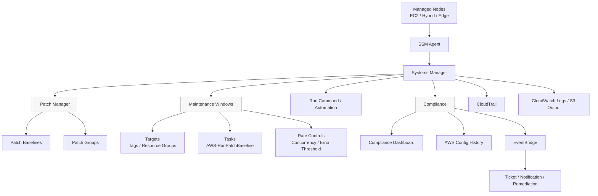
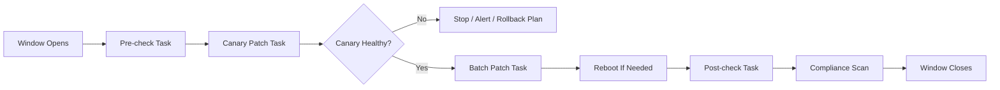
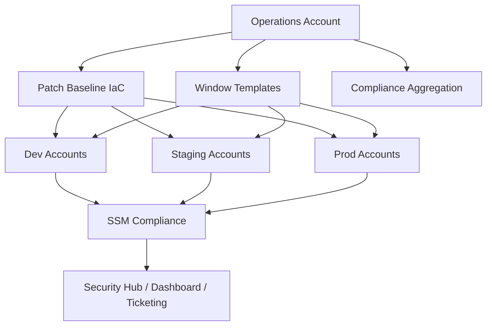
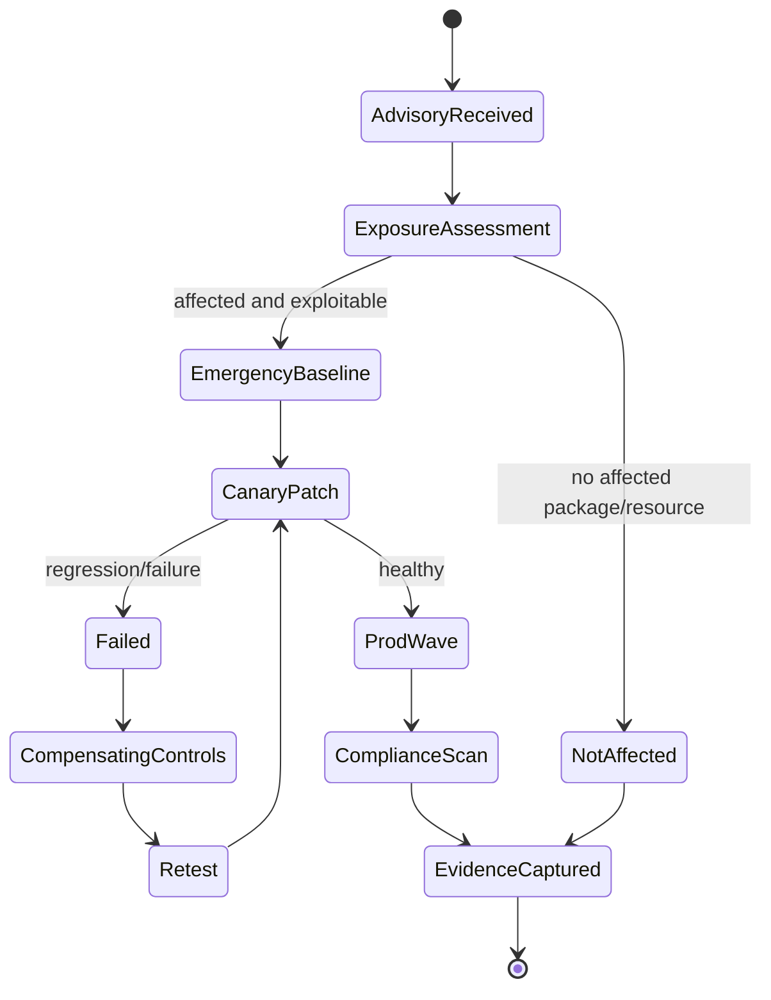
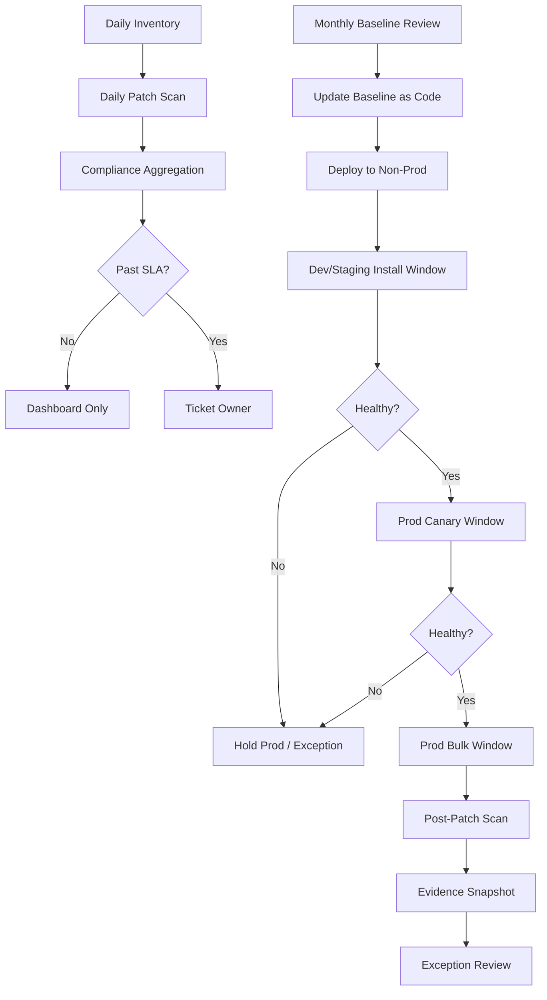

# Part 065 — Patch Manager and Maintenance Windows

Patching sering terlihat seperti pekerjaan administratif: update package, restart server, selesai. Di production AWS, itu framing yang terlalu dangkal.

Patching adalah **change-management system** untuk menutup vulnerability tanpa merusak service availability. Ia harus menjawab pertanyaan engineering yang sangat konkret:

1. resource mana yang wajib dipatch,
2. patch apa yang dianggap aman,
3. kapan patch boleh dipasang,
4. siapa pemilik risiko jika patch gagal,
5. bagaimana dampak ke traffic/service dikendalikan,
6. bagaimana reboot dikelola,
7. bagaimana status compliance dibuktikan,
8. bagaimana exception diberi masa berlaku,
9. bagaimana failure dipulihkan,
10. bagaimana semua itu berlaku lintas account, region, OS, dan environment.

AWS Systems Manager Patch Manager dan Maintenance Windows memberi primitives untuk membangun sistem tersebut.

Patch Manager memilih dan menerapkan patch berdasarkan **patch baselines**. Maintenance Windows menentukan **kapan operasi disruptif boleh terjadi**. Systems Manager Compliance menyimpan hasil patching sebagai evidence. Kombinasi ketiganya membentuk closed loop:

```txt
inventory -> classify -> scan -> approve -> schedule -> install -> reboot -> verify -> report -> remediate exception
```

Tujuan part ini bukan membuat kamu bisa klik tombol `Patch now`. Tujuannya membuat kamu bisa mendesain patching model yang defensible untuk fleet produksi.

---

## 1. Mental Model: Patching Is Controlled Risk Exchange

Setiap patch menukar satu risiko dengan risiko lain.

```txt
Tidak patching  -> risiko exploit, compliance breach, lateral movement
Patching        -> risiko downtime, regression, reboot, dependency breakage
```

Engineer yang matang tidak bertanya, “harus patch atau tidak?” Pertanyaan yang benar:

> Bagaimana kita mengurangi vulnerability risk dengan change risk yang terukur, dapat dibatasi, dan dapat dipulihkan?

Itulah alasan patching production harus punya:

- ownership,
- rollout wave,
- approval rule,
- change window,
- pre-check,
- post-check,
- compliance evidence,
- rollback/recovery path,
- exception expiry.

Patching tanpa governance adalah remote command execution yang kebetulan menjalankan package manager.

---

## 2. Patch Manager Vocabulary

Sebelum masuk arsitektur, kita luruskan vocabulary.

| Istilah | Makna Praktis |
|---|---|
| Managed node | EC2 instance, hybrid server, atau node lain yang terdaftar ke Systems Manager. |
| SSM Agent | Agent di node yang menerima instruksi Systems Manager. Tanpa agent sehat, patching tidak terjadi. |
| Patch baseline | Aturan yang menentukan patch mana yang approved/rejected untuk OS atau product tertentu. |
| Default baseline | Baseline yang dipakai jika tidak ada patch group spesifik. |
| Patch group | Label/association yang menghubungkan node dengan baseline tertentu. |
| Scan operation | Mengevaluasi patch compliance tanpa install. |
| Install operation | Menginstall patch sesuai baseline. |
| Maintenance Window | Jadwal aman untuk menjalankan task disruptif seperti patching. |
| Maintenance Window target | Node/resource group/tag yang menjadi target window. |
| Maintenance Window task | Operasi yang berjalan di window, misalnya `AWS-RunPatchBaseline`. |
| Compliance item | Hasil status compliance patch per node. |
| Reboot option | Kebijakan reboot setelah install patch. |

Patch Manager bukan vulnerability scanner penuh. Ia menjawab: “node ini sesuai patch baseline atau tidak?” Untuk vulnerability risk prioritas tinggi, kamu tetap menggabungkan data dari Inspector, GuardDuty, Security Hub, vendor EDR, dan threat intelligence.

---

## 3. High-Level Architecture



Important distinction:

- **Patch Manager** decides *what* patch state should be.
- **Maintenance Windows** decide *when* potentially disruptive tasks may run.
- **Run Command/Automation** execute *how* work is performed.
- **Compliance** records *whether* state meets policy.

Jika empat concern ini dicampur, patching akan sulit diaudit dan sulit dioperasikan.

---

## 4. The Core Invariant

Untuk production fleet, invariant minimum adalah:

```txt
Every long-lived managed node must have:
1. healthy SSM agent,
2. assigned owner,
3. environment classification,
4. patch baseline mapping,
5. maintenance window mapping,
6. patch compliance status,
7. exception record if non-compliant beyond SLA.
```

Tanpa invariant ini, kamu tidak punya patch management. Kamu hanya punya daftar instance.

---

## 5. Mutable vs Immutable Infrastructure

Patching model tergantung tipe workload.

### 5.1 Mutable Fleet

Contoh:

- long-lived EC2 instances,
- self-managed databases,
- Windows servers,
- legacy apps,
- hybrid/on-prem nodes,
- appliances,
- stateful services.

Untuk mutable fleet, Patch Manager sangat relevan. Node tetap hidup lama, sehingga patch harus diterapkan di tempat.

### 5.2 Immutable Fleet

Contoh:

- Auto Scaling Group dengan golden AMI,
- ECS/EKS workload yang redeploy container image,
- stateless web workers,
- short-lived compute.

Untuk immutable fleet, patching node langsung sering bukan strategi utama. Strategi yang lebih kuat:

```txt
patch base image -> bake AMI/container -> test -> rollout new fleet -> terminate old fleet
```

Namun Patch Manager tetap berguna untuk:

- emergency patch pada node yang belum sempat direbuild,
- compliance scan,
- hybrid node,
- bastion-less operational fleet,
- validating drift pada supposedly immutable instances.

### 5.3 Decision Table

| Kondisi | Strategi Utama | Peran Patch Manager |
|---|---|---|
| Stateless ASG | Rebuild AMI dan replace fleet | Scan/exception/emergency patch |
| Long-lived Windows | In-place patch | Primary patch engine |
| Self-managed database | Carefully orchestrated in-place patch | Scan/install dengan runbook khusus |
| Container workloads | Rebuild image | Host patching untuk EC2 worker node |
| Lambda | Update runtime/dependency/deployment artifact | Tidak langsung untuk function runtime |
| Hybrid server | In-place patch | Primary patch engine |

Rule of thumb:

> Kalau resource bisa diganti murah, patch artifact baru. Kalau resource harus dirawat, patch node dengan window, evidence, dan rollback plan.

---

## 6. Patch Baseline Design

Patch baseline adalah policy yang menentukan patch mana yang dianggap approved.

Baseline biasanya berbeda berdasarkan:

- operating system,
- environment,
- criticality,
- compliance regime,
- workload class,
- patch risk appetite,
- vendor support model.

### 6.1 Baseline Is a Risk Contract

Baseline bukan sekadar “security updates only”. Ia adalah kontrak:

```txt
Untuk class workload X,
patch kategori Y,
severity Z,
akan auto-approved setelah N hari,
kecuali masuk rejected list,
dan harus dipasang paling lambat T hari setelah approved.
```

Contoh baseline policy:

| Fleet | Patch Type | Auto-Approval Delay | SLA Install | Notes |
|---|---:|---:|---:|---|
| Dev Linux | Security + Critical + Important | 0-1 hari | 3 hari | Early detection ring |
| Staging Linux | Security + Critical | 3 hari | 7 hari | Mirrors prod dependencies |
| Prod Linux | Security + Critical | 7 hari | 14 hari | Canary first |
| Regulated Prod | Security + Critical | 7 hari | 7-14 hari | Requires evidence retention |
| Windows Desktop-like servers | Critical + Security | 7 hari | 14 hari | Reboot coordination required |
| Database hosts | Critical only by default | Manual approval | Case-by-case | Vendor validation required |

Delay bukan kemalasan. Delay adalah ruang observasi untuk melihat apakah patch bermasalah di ring awal.

### 6.2 Approved and Rejected Lists

Baseline mendukung rule-based approval dan explicit approved/rejected patches.

Gunakan explicit lists untuk:

- emergency approve patch tertentu,
- hold patch yang merusak workload,
- enforce vendor advisory tertentu,
- block known-bad package version.

Anti-pattern:

```txt
Rejected list tanpa expiry = vulnerability exception permanen yang disamarkan.
```

Setiap rejected patch harus punya:

- owner,
- reason,
- affected fleet,
- compensating control,
- expiry date,
- retest plan.

---

## 7. Patch Groups

Patch group menghubungkan managed node ke baseline.

Secara operasional, patch group harus merepresentasikan **patching policy class**, bukan nama random.

Contoh:

```txt
PatchGroup=linux-prod-critical
PatchGroup=linux-staging-standard
PatchGroup=windows-prod-standard
PatchGroup=db-prod-manual
PatchGroup=sandbox-auto
```

Jangan buat patch group terlalu granular seperti:

```txt
PatchGroup=team-a-service-b-prod-eu-west-1-special-v2
```

Itu akan meledak menjadi governance nightmare.

Lebih baik pisahkan dimensi:

```txt
Environment=prod
WorkloadClass=web
Criticality=tier1
PatchGroup=linux-prod-standard
Owner=platform-payments
```

PatchGroup menentukan baseline. Tag lain menentukan owner, window, alert routing, dan exception.

---

## 8. Maintenance Windows as Controlled Blast Radius

Maintenance Window membantu menentukan jadwal task disruptif.

Satu maintenance window biasanya berisi:

- schedule,
- duration,
- cutoff,
- targets,
- tasks,
- task priority,
- concurrency,
- error threshold,
- service role,
- output location,
- optional notifications.

### 8.1 Why Maintenance Windows Matter

Tanpa window:

- patch bisa berjalan saat peak traffic,
- reboot bisa memutus transaksi,
- banyak node bisa restart bersamaan,
- engineer tidak siap melihat alert,
- compliance evidence tidak align dengan change window,
- post-check tidak dijalankan.

Dengan window:

```txt
patching becomes scheduled, bounded, observable, and reviewable.
```

### 8.2 Window Anatomy



Window bukan hanya slot waktu. Ia adalah mini-state-machine untuk operational change.

---

## 9. Designing Patch Rollout Rings

Patch rollout harus bertahap.

```txt
ring 0: ephemeral test / canary AMI / golden image validation
ring 1: dev
ring 2: staging
ring 3: prod canary
ring 4: prod batch 1
ring 5: prod batch 2
ring 6: regulated or high-risk fleet
```

### 9.1 Example Ring Strategy

| Ring | Target | Goal | Failure Action |
|---:|---|---|---|
| 0 | Lab nodes | Detect package install failure | Fix baseline/script |
| 1 | Dev | Catch obvious dependency breakage | Pause higher rings |
| 2 | Staging | Validate workload compatibility | Incident/change review |
| 3 | Prod canary 1-5% | Detect production-only behavior | Stop rollout |
| 4 | Prod wave A | Controlled rollout | Continue if healthy |
| 5 | Prod wave B | Complete rollout | Escalate if partial failure |
| 6 | Critical/stateful | Runbook/manual supervision | CAB/SRE/security approval |

Tidak semua fleet butuh tujuh ring. Tetapi semua production fleet butuh minimal:

```txt
non-prod -> prod canary -> prod bulk
```

---

## 10. Scan vs Install

Patch Manager memiliki dua mode penting:

| Mode | Efek | Kapan Dipakai |
|---|---|---|
| Scan | Mengevaluasi compliance tanpa memasang patch | Daily/weekly compliance visibility |
| Install | Memasang patch sesuai baseline | Maintenance window yang disetujui |

Pattern yang sehat:

```txt
Daily scan -> weekly/monthly install -> immediate scan after install
```

Dengan begitu kamu tahu:

- node mana yang drifting sebelum window,
- patch apa yang pending,
- apakah install berhasil,
- apakah node masih non-compliant setelah window.

---

## 11. Reboot Policy

Patch sering membutuhkan reboot. Reboot bukan detail kecil; reboot adalah availability event.

Kamu harus menentukan:

- apakah node boleh reboot otomatis,
- apakah workload punya redundancy,
- apakah load balancer health check benar,
- apakah connection draining berjalan,
- apakah process supervisor restart dengan benar,
- apakah stateful service punya failover,
- apakah node masuk kembali ke service pool setelah patch.

### 11.1 Reboot Decision Table

| Workload | Reboot Otomatis? | Catatan |
|---|---|---|
| Stateless web ASG | Ya, dengan rolling concurrency | Pastikan min healthy capacity cukup |
| Batch worker | Biasanya ya | Drain queue/visibility timeout diperhatikan |
| Stateful database | Tidak otomatis tanpa runbook | Butuh failover/snapshot/maintenance plan |
| Single-node legacy | Hati-hati | Perlu downtime window eksplisit |
| Domain controller / infra critical | Manual/supervised | Perlu dependency map |

Invariant:

```txt
No automatic reboot for production stateful singleton without explicit owner-approved runbook.
```

---

## 12. Rate Controls: Concurrency and Error Threshold

Maintenance Window tasks mendukung rate controls.

Dua parameter penting:

| Parameter | Makna |
|---|---|
| Max concurrency | Berapa banyak target boleh diproses bersamaan. |
| Max errors | Berapa banyak failure yang ditoleransi sebelum task dihentikan. |

Contoh strategi:

```txt
Dev:     concurrency 50%, max errors 20%
Staging: concurrency 25%, max errors 10%
Prod:    concurrency 5-10%, max errors 1-5%
Tier1:   concurrency 1-2 nodes, max errors 1
```

Concurrency sebaiknya tidak hanya dihitung terhadap jumlah instance. Hitung terhadap **service capacity**.

Contoh buruk:

```txt
Service punya 10 node.
Concurrency 20% = 2 node.
Tapi 4 node sedang unhealthy sebelum patch.
Patch 2 node lagi -> kapasitas turun 40%.
```

Pre-check harus membaca current fleet health sebelum patch.

---

## 13. Pre-Check and Post-Check Tasks

Patch Manager menginstall patch. Ia tidak tahu apakah bisnis kamu sehat.

Tambahkan pre/post checks.

### 13.1 Pre-Check

Pre-check menjawab:

- apakah node reachable via SSM,
- apakah disk space cukup,
- apakah package manager lock bebas,
- apakah service sedang degraded,
- apakah node masuk autoscaling group,
- apakah target count sesuai,
- apakah backup/snapshot baru tersedia,
- apakah alarm sedang aktif,
- apakah change freeze berlaku,
- apakah owner acknowledgement tersedia.

### 13.2 Post-Check

Post-check menjawab:

- apakah node kembali online,
- apakah SSM agent sehat,
- apakah service process running,
- apakah health check passing,
- apakah error rate naik,
- apakah latency naik,
- apakah patch compliance berubah menjadi compliant,
- apakah reboot pending,
- apakah log menunjukkan failure.

Contoh post-check pseudo-runbook:

```bash
# example only; adapt per OS and service
systemctl is-active my-service
curl -fsS http://localhost:8080/health
aws cloudwatch get-metric-statistics \
  --namespace AWS/ApplicationELB \
  --metric-name HTTPCode_Target_5XX_Count \
  --dimensions Name=LoadBalancer,Value="$ALB" \
  --start-time "$START" \
  --end-time "$END" \
  --period 60 \
  --statistics Sum
```

---

## 14. Patching With Auto Scaling Groups

For ASG-based workloads, direct in-place patching can fight the replacement model.

Better pattern:

```txt
1. patch base AMI,
2. bake new image,
3. run tests,
4. update launch template,
5. instance refresh / rolling deploy,
6. terminate old instances,
7. scan new instances for compliance.
```

Use Patch Manager on ASG nodes mainly for:

- emergency hotfix,
- compliance scan,
- legacy ASGs that cannot yet rebuild AMI,
- validating whether image bake pipeline actually includes OS patches.

If you patch ASG instances in-place, protect against:

- autoscaling replacing patched nodes with old AMI,
- launch template still pointing to vulnerable image,
- instance refresh undoing manual patch,
- patch task rebooting too many nodes.

Invariant:

```txt
If ASG instances are patched in-place, the source image must also be updated or the fleet will regress.
```

---

## 15. Stateful Workloads

Stateful patching is different.

Examples:

- self-managed databases,
- queues,
- caches,
- directory services,
- old monoliths with local state,
- vendor appliances.

For these, patching must include:

- backup/snapshot verification,
- replication health check,
- failover plan,
- manual approval for reboot,
- rollback/rebuild instructions,
- vendor compatibility matrix,
- post-patch data integrity check.

Do not treat stateful nodes as generic Linux boxes.

---

## 16. Compliance Evidence Model

Patching is not complete when package manager exits `0`. Patching is complete when evidence says the fleet is compliant or has approved exception.

Evidence should include:

| Evidence | Source |
|---|---|
| Baseline definition | Systems Manager Patch Baseline / IaC repo |
| Node target list | Tags, resource group, SSM inventory |
| Scan result | Patch Manager compliance |
| Install result | Command output / SSM command history |
| Window execution | Maintenance Window task history |
| API activity | CloudTrail |
| Output logs | CloudWatch Logs / S3 |
| Compliance history | Systems Manager Compliance / AWS Config |
| Exceptions | Ticketing/GRC system |
| Health validation | CloudWatch/Application Signals/service checks |

A strong compliance story is not “we run patches monthly.”

A strong story is:

```txt
For every fleet class, we know the baseline, SLA, last scan, last install, current compliance, owner, exceptions, and remediation status.
```

---

## 17. Exception Governance

Not every patch can be installed immediately. But every exception must be controlled.

Exception record should include:

```yaml
exceptionId: PATCH-EX-2026-0017
resourceScope: PatchGroup=db-prod-manual
patchOrCve: CVE-xxxx-yyyy / package version
reason: vendor regression in driver version x.y.z
owner: database-platform
approvedBy: security-and-service-owner
createdAt: 2026-07-06
expiresAt: 2026-07-20
compensatingControls:
  - restrict inbound to application subnets
  - GuardDuty/Inspector alert escalation
  - WAF rule for known exploit path
  - increased log retention and detection query
retestPlan: validate vendor hotfix in staging
```

Bad exception:

```txt
Cannot patch. App may break.
```

Good exception:

```txt
Patch KB-123456 breaks JDBC driver in staging. Prod exception approved for 14 days. Network exposure reduced; vendor hotfix being tested; owner and expiry recorded.
```

---

## 18. Multi-Account and Multi-Region Design

At scale, patching must be deployed as an organization capability.

Design decisions:

- Which account owns patch baselines?
- Are baselines deployed by StackSets/Terraform/AFT?
- Are maintenance windows local per workload account or centrally managed?
- Is compliance aggregated centrally?
- Are production and non-production windows separated by OU?
- Are region-specific blackout windows respected?
- How are hybrid nodes handled?
- Who owns failed patch execution?

Common model:



Centralize policy. Distribute execution. Aggregate evidence.

---

## 19. Patch Calendar Design

Production patch calendar should account for:

- business peak hours,
- regional holidays,
- end-of-month financial close,
- security SLA,
- support team availability,
- vendor maintenance schedules,
- dependency release calendar,
- backup windows,
- database maintenance windows,
- major incident freeze.

Example monthly cadence:

| Week | Activity |
|---|---|
| Week 1 | Baseline update, lab/dev scan/install |
| Week 2 | Staging patch and service regression validation |
| Week 3 | Prod canary and low-risk prod wave |
| Week 4 | Tier-1 prod, stateful workloads, exception review |
| Continuous | Emergency patches for actively exploited vulnerabilities |

Emergency patching must bypass normal cadence but not bypass controls. It still needs owner, scope, window, validation, and evidence.

---

## 20. Designing for Emergency Vulnerability Response

When a critical vulnerability is actively exploited, monthly patch cadence is too slow.

Emergency process:



Emergency patching requires fast answers:

- Which nodes have affected package/version?
- Which nodes are internet-facing?
- Which nodes process sensitive data?
- Which nodes have compensating controls?
- Which owners can approve change?
- Which production services can tolerate reboot?
- What is the rollback/recovery path?

This is where Inventory, Inspector, Security Hub, Macie, CloudWatch, and CMDB/service catalog data become critical.

---

## 21. Rollback Reality

Patch rollback is often harder than deploy rollback.

Possible recovery methods:

| Method | Works When | Limitation |
|---|---|---|
| Package downgrade | Package manager supports safe downgrade | Not always supported; config/data migration may break |
| AMI restore | Node is stateless or restore tested | Data loss risk for stateful nodes |
| ASG replace | Fleet is immutable | Requires patched/unpatched image control |
| Snapshot restore | Stateful volume/database has clean snapshot | Recovery time and data consistency risk |
| Vendor hotfix | Vendor provides fix | External dependency |
| Compensating control | Patch cannot be rolled back safely | Risk remains but contained |

Do not write “rollback: uninstall patch” in production runbook unless tested.

A more honest rollback section:

```txt
Rollback for stateless ASG: revert launch template to previous AMI and instance refresh.
Rollback for database host: restore from snapshot after DBA approval; expected RTO 2h; possible RPO 15m.
Rollback for package regression: pin previous package version if vendor supports downgrade; otherwise isolate node and replace.
```

---

## 22. Security Controls for Patch Operations

Patch operations are powerful. They run commands on fleet nodes.

Secure them like privileged production automation.

Controls:

- least-privilege IAM service roles,
- separate roles for scan vs install,
- MFA/JIT for manual install,
- CloudTrail monitoring for patch baseline/window changes,
- approval for baseline rejection list changes,
- output logging to controlled S3/CloudWatch,
- encrypted logs,
- no broad `ssm:SendCommand` to all resources,
- tag condition on allowed targets,
- permission boundaries for platform teams,
- EventBridge alerts for failed/unauthorized executions,
- change freeze guardrails.

Dangerous permission smell:

```json
{
  "Effect": "Allow",
  "Action": "ssm:SendCommand",
  "Resource": "*"
}
```

Better pattern:

```json
{
  "Effect": "Allow",
  "Action": [
    "ssm:SendCommand"
  ],
  "Resource": [
    "arn:aws:ssm:REGION:ACCOUNT:document/AWS-RunPatchBaseline",
    "arn:aws:ec2:REGION:ACCOUNT:instance/*"
  ],
  "Condition": {
    "StringEquals": {
      "ssm:resourceTag/PatchManaged": "true"
    }
  }
}
```

Treat the snippet as conceptual. Validate condition keys and resource support for your real policy.

---

## 23. Observability for Patching

Patch operations need dashboards and alerts.

Minimum metrics/views:

- total managed nodes,
- SSM agent online/offline,
- patch compliant vs non-compliant,
- non-compliant by environment,
- non-compliant by owner,
- failed patch tasks,
- reboot pending,
- nodes without patch group,
- nodes without owner,
- patch baseline drift,
- exception count and expiry,
- critical CVE exposure count,
- maintenance window success rate.

Alert only on actionable states:

| Signal | Alert? | Reason |
|---|---|---|
| Prod critical node non-compliant past SLA | Yes | Security risk with owner action |
| Maintenance window failure rate > threshold | Yes | Operational failure |
| SSM agent offline in prod patch group | Yes | Fleet unmanageable |
| One dev node missing optional patch | Usually no | Dashboard/report only |
| Exception expires tomorrow | Yes | Governance action needed |
| Patch baseline changed in prod | Yes | Change control event |

---

## 24. Patching Failure Modes

### 24.1 Node Not Managed by SSM

Symptoms:

- no patch status,
- no command execution,
- no inventory,
- node absent from fleet manager.

Causes:

- SSM Agent missing/stopped,
- IAM instance profile missing,
- no network route/VPC endpoint,
- bad region/account,
- OS unsupported,
- hybrid activation issue.

Control:

```txt
Alert on prod EC2 without SSM managed node status within N minutes of launch.
```

### 24.2 Patch Baseline Too Broad

Symptoms:

- unexpected package updates,
- application regression,
- emergency rollback.

Cause:

- auto-approve all classifications,
- no ring testing,
- no rejected list process.

Control:

```txt
Baseline changes require review, diff, and staged rollout.
```

### 24.3 Maintenance Window Targets Too Broad

Symptoms:

- too many nodes reboot,
- cross-environment impact,
- capacity drop.

Cause:

- broad tags,
- Resource Group mismatch,
- missing environment constraints.

Control:

```txt
Window target expression must include environment and patch-managed tag.
```

### 24.4 Compliance Looks Green but App Is Broken

Symptoms:

- Patch Manager says compliant,
- service health degraded.

Cause:

- patch compliance checks OS state, not business behavior.

Control:

```txt
Post-patch checks must include service-level health and SLO signals.
```

### 24.5 Reboot Pending Forever

Symptoms:

- patch installed,
- node still vulnerable until reboot,
- compliance confusing.

Cause:

- reboot disabled,
- owner forgot manual reboot,
- service cannot tolerate restart.

Control:

```txt
Reboot pending is a separate operational state with SLA.
```

### 24.6 Patching Old Image, New Instances Regress

Symptoms:

- patched fleet becomes non-compliant again after scale-out.

Cause:

- ASG launch template still uses old AMI.

Control:

```txt
Patch compliance must include source image freshness.
```

### 24.7 Patch Job Has No Evidence

Symptoms:

- security asks for proof,
- no command output retained,
- no baseline version,
- no target list snapshot.

Cause:

- output not configured,
- logs expired,
- no change record.

Control:

```txt
Patch windows must write output to retained log storage.
```

---

## 25. Reference Implementation: Production Patch Loop

A practical production loop:



This is the shape you want.

Not one giant task. A loop.

---

## 26. Minimal IaC Shape

You can manage patching through console initially, but production should move toward IaC.

Objects to codify:

```txt
patch baselines
patch group mappings
maintenance windows
window targets
window tasks
service roles
output buckets/log groups
EventBridge rules
compliance dashboards
exception schema
```

Example conceptual CloudFormation resource list:

```yaml
Resources:
  LinuxProdPatchBaseline:
    Type: AWS::SSM::PatchBaseline
    Properties:
      Name: linux-prod-security-critical
      OperatingSystem: AMAZON_LINUX_2
      PatchGroups:
        - linux-prod-standard
      ApprovalRules:
        PatchRules:
          - PatchFilterGroup:
              PatchFilters:
                - Key: CLASSIFICATION
                  Values: [Security]
                - Key: SEVERITY
                  Values: [Critical, Important]
            ApproveAfterDays: 7

  ProdPatchWindow:
    Type: AWS::SSM::MaintenanceWindow
    Properties:
      Name: prod-linux-patch-window
      Schedule: cron(0 18 ? * SAT *)
      Duration: 4
      Cutoff: 1
      AllowUnassociatedTargets: false
```

This is intentionally incomplete. The important lesson is that patching resources can be treated as governed infrastructure, reviewed, diffed, and promoted through environments.

---

## 27. Runbook: Standard Production Patch Window

### Before Window

1. Confirm target scope.
2. Confirm service owners.
3. Confirm no active high-severity incident.
4. Confirm backups/snapshots if required.
5. Confirm SSM agent health.
6. Confirm non-prod ring passed.
7. Confirm CloudWatch alarms and dashboards.
8. Confirm rollback/recovery plan.
9. Confirm exception list.

### During Window

1. Run pre-check.
2. Patch canary subset.
3. Validate service health.
4. Continue batch rollout within concurrency limit.
5. Watch application error rate, latency, saturation, and node health.
6. Stop if error threshold is crossed.
7. Capture command output.

### After Window

1. Run patch compliance scan.
2. Validate reboot state.
3. Validate service SLO.
4. Record non-compliant nodes.
5. Open owner tickets.
6. Update evidence snapshot.
7. Review exceptions.
8. Feed lessons into next baseline/window.

---

## 28. Production Checklist

Use this as the exit criteria for a mature patching model.

```txt
[ ] Every production node is SSM-managed or explicitly exempted.
[ ] Every production node has Owner, Environment, Criticality, and PatchGroup tags.
[ ] Patch baselines are managed as code.
[ ] Baseline changes are reviewed and logged.
[ ] Production patching uses rollout rings.
[ ] Maintenance windows have concurrency and error thresholds.
[ ] Stateful workloads have dedicated runbooks.
[ ] Pre-check and post-check tasks exist for critical services.
[ ] Reboot policy is explicit per workload class.
[ ] Patch command output is retained.
[ ] Compliance is aggregated centrally.
[ ] Non-compliant nodes create owner-visible action.
[ ] Exceptions have owner, reason, compensating control, and expiry.
[ ] Emergency patch process exists and is tested.
[ ] SSM agent health is monitored.
[ ] ASG source images are updated, not only live nodes.
[ ] Patch operations are least-privilege and auditable.
```

---

## 29. The Top 1% Takeaway

Patch management is not a button. It is a control loop.

The weak version says:

```txt
We installed security patches last month.
```

The strong version says:

```txt
Every fleet class has an owner, baseline, scan cadence, install window, rollout ring, compliance SLA, exception process, and evidence trail. We can prove current state, explain residual risk, and execute emergency patching without guessing.
```

That is the difference between “using Patch Manager” and operating AWS at production-grade maturity.

---

## Official References

- AWS Systems Manager Patch Manager: https://docs.aws.amazon.com/systems-manager/latest/userguide/patch-manager.html
- AWS Systems Manager patch baselines: https://docs.aws.amazon.com/systems-manager/latest/userguide/patch-manager-patch-baselines.html
- `AWS-RunPatchBaseline` SSM document: https://docs.aws.amazon.com/systems-manager/latest/userguide/patch-manager-aws-runpatchbaseline.html
- AWS Systems Manager Maintenance Windows: https://docs.aws.amazon.com/systems-manager/latest/userguide/maintenance-windows.html
- Maintenance Window patching tutorial: https://docs.aws.amazon.com/systems-manager/latest/userguide/maintenance-window-tutorial-patching.html
- AWS Systems Manager Compliance: https://docs.aws.amazon.com/systems-manager/latest/userguide/systems-manager-compliance.html
