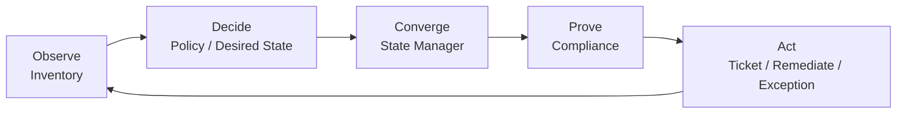
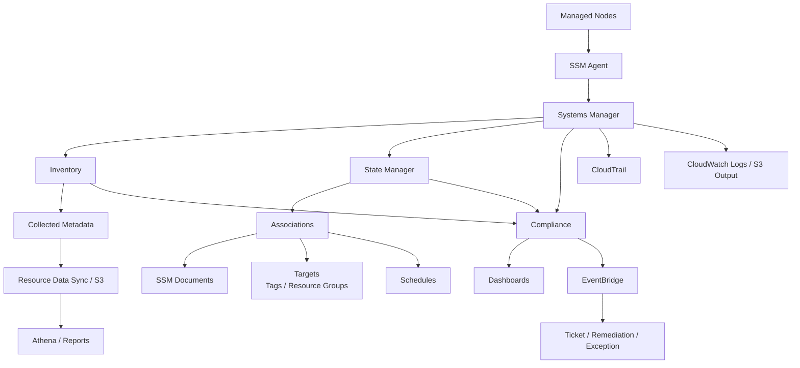
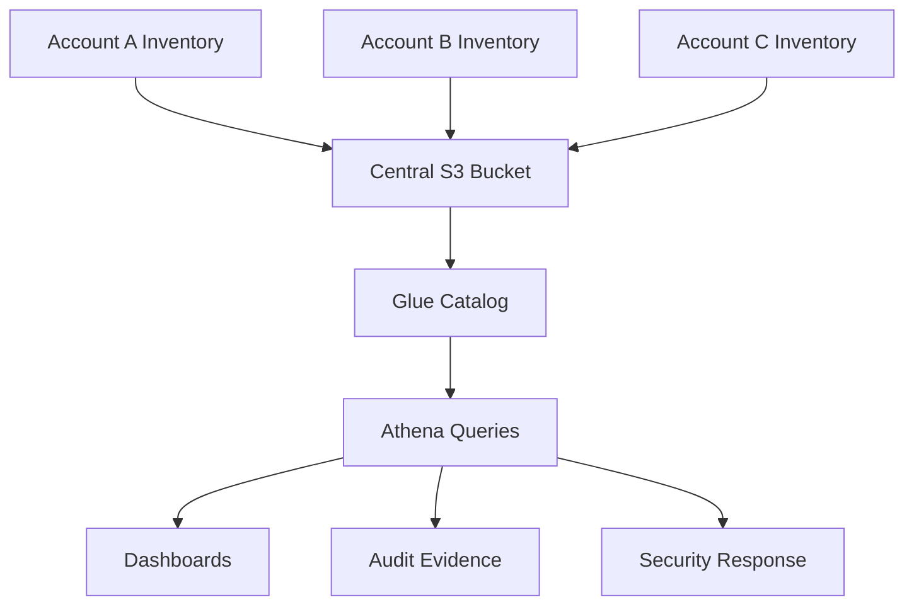
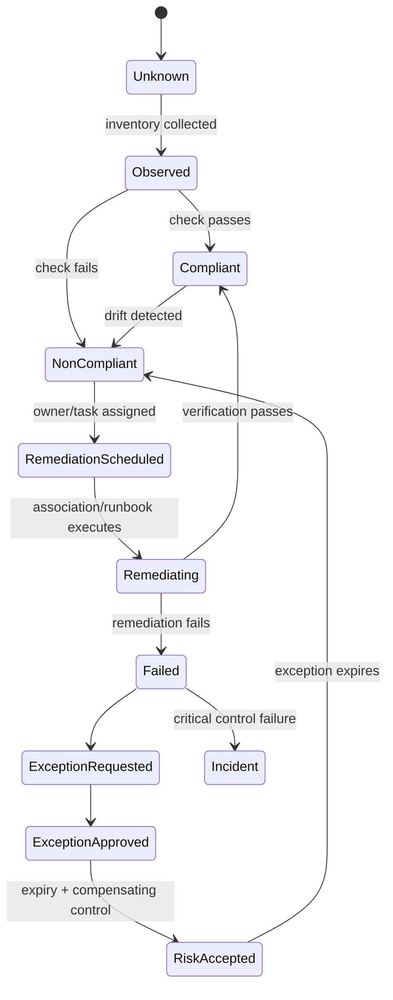
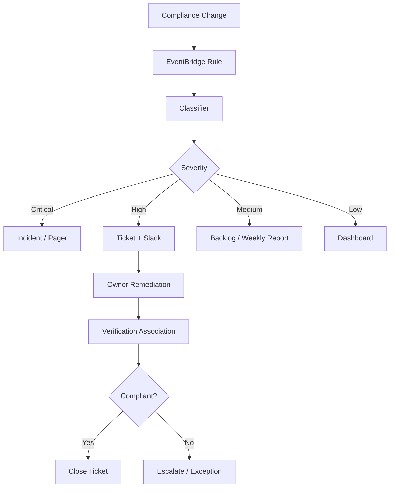

# Part 066 — Inventory, State Manager, and Fleet Compliance

Part sebelumnya membahas patching. Sekarang kita naik satu level: bagaimana kamu tahu fleet-mu sebenarnya terdiri dari apa, berada dalam state apa, dan apakah state itu sesuai policy?

Untuk workload berbasis server, hybrid node, EC2 fleet, atau long-lived runtime, problem production bukan hanya “bisa menjalankan command”. Problem yang lebih fundamental:

```txt
What exists?
What is installed?
What is configured?
What should be true?
What drifted?
Who owns it?
Is it compliant?
What evidence proves it?
```

AWS Systems Manager menyediakan tiga capability utama untuk control loop ini:

- **Inventory** untuk mengumpulkan fakta dari managed nodes.
- **State Manager** untuk menerapkan atau menjaga desired state.
- **Compliance** untuk merekam apakah patching, association, dan custom control memenuhi policy.

Jika Patch Manager adalah operasi patch, maka Inventory + State Manager + Compliance adalah **fleet governance substrate**.

---

## 1. Mental Model: Observe, Decide, Converge, Prove

Fleet compliance adalah loop, bukan dashboard.



Mature operations selalu punya loop ini.

Tanpa Inventory, kamu tidak tahu fakta.

Tanpa State Manager, kamu tidak punya mekanisme convergence.

Tanpa Compliance, kamu tidak punya bukti.

Tanpa action loop, kamu hanya punya report yang menua.

---

## 2. Vocabulary

| Istilah | Makna Praktis |
|---|---|
| Managed node | Resource yang dikelola Systems Manager melalui SSM Agent. |
| Inventory | Metadata dari managed node: aplikasi, packages, network config, OS, files, services, custom data. |
| Custom inventory | Metadata tambahan yang kamu definisikan sendiri dalam format JSON di node. |
| Resource Data Sync | Mekanisme menyinkronkan inventory/compliance data ke S3 untuk query/reporting. |
| State Manager | Capability untuk menjaga resource dalam desired state melalui association. |
| Association | Kontrak konfigurasi: dokumen apa dijalankan, dengan parameter apa, ke target mana, dan kapan. |
| SSM document | Dokumen yang mendefinisikan action/automation/command. |
| Compliance | Status apakah patching, association, atau custom rule compliant/non-compliant. |
| Association compliance | Apakah eksekusi State Manager association berhasil memenuhi state yang diharapkan. |
| Custom compliance | Compliance type yang kamu publish sendiri untuk kebutuhan organisasi. |

---

## 3. Why This Matters for Security and Operations

Banyak insiden cloud bukan karena tidak punya tool. Masalahnya adalah organisasi tidak tahu real state.

Contoh pertanyaan yang harus bisa dijawab cepat:

- Node mana yang masih menjalankan OpenSSL versi rentan?
- Instance prod mana yang tidak punya EDR agent?
- Server mana yang tidak mengirim log ke CloudWatch?
- Node mana yang tidak punya tag Owner?
- Mana instance yang agent SSM-nya offline?
- Mana workload yang masih memakai OS end-of-life?
- Mana node yang tidak compliant terhadap patch baseline?
- Mana service yang punya package terlarang?
- Mana association yang gagal sejak deploy terakhir?
- Mana node yang drift dari baseline hardening?

Inventory, State Manager, dan Compliance adalah jawaban engineering untuk pertanyaan-pertanyaan itu.

---

## 4. Fleet Governance Architecture



Read the diagram as a loop:

1. SSM Agent exposes node to Systems Manager.
2. Inventory collects facts.
3. State Manager enforces desired configuration.
4. Compliance records state.
5. EventBridge/ticketing/remediation acts on non-compliance.
6. Reports prove posture over time.

---

## 5. The Core Invariant

For production fleet governance:

```txt
Every managed node must be observable, attributable, convergable, and auditable.
```

Translated:

```txt
Observable   -> inventory data exists and is fresh.
Attributable -> owner/environment/criticality metadata exists.
Convergable  -> desired state can be applied via association or equivalent pipeline.
Auditable    -> compliance and execution evidence are retained.
```

If a node is not observable, it cannot be governed.

If it is not attributable, no one owns remediation.

If it is not convergable, drift becomes manual toil.

If it is not auditable, compliance is opinion.

---

## 6. Systems Manager Inventory

Inventory collects metadata from managed nodes.

Examples of useful metadata:

- OS name/version,
- installed applications,
- package versions,
- AWS components,
- network configuration,
- Windows registry data,
- services,
- files,
- custom inventory data.

Inventory is not meant to steal application data. It is metadata collection for operations and compliance.

### 6.1 Inventory Is Your Fleet Fact Table

Think of Inventory as a table:

```txt
node_id | account | region | os | package | version | owner | environment | collected_at
```

Once you have that table, you can ask engineering questions:

```sql
-- conceptual Athena-style query
SELECT node_id, account_id, region, package_name, package_version
FROM inventory_packages
WHERE package_name = 'openssl'
  AND package_version < 'fixed-version'
  AND environment = 'prod';
```

The exact schema depends on Resource Data Sync and how you export/query the data, but the mental model is stable: Inventory turns fleet state into queryable facts.

---

## 7. Inventory Collection Strategy

Do not collect everything blindly forever. Design collection according to use case.

| Data | Use Case | Suggested Cadence |
|---|---|---|
| OS version | EOL tracking, vulnerability impact | Daily |
| Installed packages | CVE exposure, patch validation | Daily or more during emergency |
| Applications | License/security inventory | Daily/weekly |
| Network config | Drift/security review | Daily |
| Services | Required agent/process validation | Hourly/daily |
| Files | Specific baseline checks | Carefully scoped |
| Custom inventory | Business/owner/control metadata | On change or daily |

High-frequency inventory has cost and noise. Low-frequency inventory gives stale evidence.

Choose based on decision latency.

```txt
If you need to answer within 1 hour during incident, daily inventory may be too stale.
If the fact only supports monthly audit, hourly collection is waste.
```

---

## 8. Custom Inventory

Custom inventory lets you publish organization-specific metadata from the node.

Examples:

```json
{
  "SchemaVersion": "1.0",
  "TypeName": "Custom:RuntimeControl",
  "Content": [
    {
      "ServiceName": "payments-api",
      "RuntimeOwner": "team-payments",
      "DataClassification": "confidential",
      "RuntimeMode": "active",
      "GoldenImageVersion": "ami-baseline-2026-07-01",
      "SecurityAgentVersion": "5.4.2"
    }
  ]
}
```

Use custom inventory for facts that AWS cannot infer:

- service owner,
- internal service name,
- golden image version,
- runtime mode,
- installed in-house agent version,
- application-specific compliance marker,
- data classification assertion,
- migration wave,
- decommission date.

Do not use custom inventory to store secrets or sensitive business records.

---

## 9. Resource Data Sync and Central Reporting

At scale, console views are not enough.

You want inventory and compliance data in a central query/reporting layer, commonly S3 + Athena/QuickSight or a SIEM/data lake.

Architecture pattern:



Questions this unlocks:

- Show all non-prod nodes running production-only agent.
- Show all prod nodes without required EDR version.
- Show all nodes with EOL OS by owner.
- Show all patch non-compliant nodes older than SLA.
- Show all nodes missing environment tag.
- Show inventory freshness by account/region.

Console is for operations. Central query layer is for governance.

---

## 10. State Manager

State Manager applies desired state to AWS resources, mostly managed nodes, through associations.

A State Manager association defines:

```txt
Run this SSM document,
with these parameters,
on these targets,
on this schedule,
with this output/logging behavior,
and report compliance.
```

Examples of desired state:

- SSM Agent must be latest/stable.
- CloudWatch Agent must be installed and running.
- EDR agent must exist and be healthy.
- specific Linux service must be disabled.
- specific port must be closed.
- package repository config must exist.
- baseline hardening script must pass.
- inventory collection must run on schedule.
- patch scan must run daily.

State Manager is not just cron. It is scheduled desired-state enforcement with compliance reporting.

---

## 11. Association Anatomy

A good association has:

| Field | Design Question |
|---|---|
| Name | What invariant does this represent? |
| Document | What action/check enforces the invariant? |
| Parameters | Are values environment-specific and controlled? |
| Targets | Which nodes should be affected? |
| Schedule | How often should state converge? |
| Compliance severity | How important is failure? |
| Output location | Where is evidence stored? |
| Rate controls | How much blast radius is allowed? |
| Alarm/notification | Who acts on failure? |

Bad association name:

```txt
run-script-1
```

Good association name:

```txt
prod-linux-cloudwatch-agent-installed-and-running
```

Name the invariant, not the implementation detail.

---

## 12. Association as Invariant

This is the key mental model.

Weak framing:

```txt
Run this script every day.
```

Strong framing:

```txt
All production Linux nodes must have CloudWatch Agent installed, configured with the approved config, and running. If not, converge or report non-compliance.
```

The second version is auditable, reviewable, and tied to a control.

### 12.1 Example Invariant Catalog

| Invariant | State Manager Role |
|---|---|
| SSM Agent is healthy/current | Update/check agent |
| CloudWatch Agent is installed/running | Install/configure/start agent |
| Patch scan runs daily | Trigger `AWS-RunPatchBaseline` Scan |
| EDR agent exists | Validate/install agent |
| SSH password login disabled | Check/remediate config |
| Time sync enabled | Validate service/config |
| Required tags exist | Detect/report through custom compliance or automation |
| Log forwarder configured | Install/update config |
| Unsupported packages absent | Scan/report package inventory |

Not all invariants should auto-remediate. Some should only detect.

---

## 13. Detect-Only vs Auto-Remediate

State Manager can converge state, but not every drift should be automatically fixed.

| Control | Mode | Reason |
|---|---|---|
| CloudWatch Agent missing | Auto-remediate | Low risk, high observability value |
| SSM Agent old | Auto-remediate | Required for operations |
| EDR missing | Auto-remediate or escalate | Depends on vendor install risk |
| SSH config drift | Usually auto-remediate after testing | Security baseline |
| Database kernel parameter | Detect + supervised remediation | Risky for stateful workload |
| Unknown package installed | Detect + owner review | May be app dependency |
| Service disabled | Depends on service | Could be intentional during maintenance |

Auto-remediation without context can create outages. Detect-only without owner action creates compliance theater.

---

## 14. Targeting Strategy

Targeting is one of the most dangerous parts.

Target too narrow: drift remains.

Target too broad: automation breaks unrelated systems.

Good targeting uses multiple dimensions:

```txt
Environment=prod
Platform=linux
PatchManaged=true
StateManagerBaseline=standard
Criticality=tier2
```

Avoid relying on a single tag like:

```txt
Name contains prod
```

### 14.1 Dynamic Targeting

Dynamic targeting via tags/resource groups is powerful because new nodes automatically enter governance.

But it requires tag governance.

If a new prod node launches without the right tags, it can escape associations.

Control:

```txt
Detect EC2 instances missing required governance tags within N minutes of launch.
```

Use EventBridge/Config/Security Hub/custom rules to catch ungoverned nodes.

---

## 15. Scheduling Strategy

State Manager supports schedule expressions. But cadence should match risk.

| Association | Suggested Cadence |
|---|---:|
| Inventory collection | Daily or more for critical fleets |
| Patch scan | Daily |
| SSM Agent update | Daily/weekly |
| CloudWatch Agent health | Hourly/daily |
| EDR health | Hourly/daily |
| Baseline hardening check | Daily/weekly |
| File integrity check | Depends on sensitivity |
| Package allowlist | Daily or incident-triggered |

More frequent is not always better.

Ask:

```txt
How fast must we know this drift?
How dangerous is automatic convergence?
How expensive/noisy is the check?
```

---

## 16. Rate Control for State Manager

Associations can affect large fleets. Rate controls are mandatory for risky operations.

Use:

- max concurrency,
- max errors,
- staged association deployment,
- canary targets,
- OU/account wave rollout.

Example:

```txt
Canary association:
  target: StateManagerRing=canary
  max concurrency: 10%
  max errors: 1

Prod association:
  target: StateManagerRing=prod
  max concurrency: 5%
  max errors: 2%
```

Even “install monitoring agent” can break production if package repository is slow, disk is full, or service restart conflicts.

---

## 17. Idempotency

State Manager documents must be idempotent.

Bad document behavior:

```txt
Every run appends duplicate config lines.
Every run restarts service even if nothing changed.
Every run reinstalls package unnecessarily.
Every run resets local state blindly.
```

Good document behavior:

```txt
Check current state.
Only change when drift exists.
Validate after change.
Exit with meaningful code.
Emit structured output.
```

Example shell pattern:

```bash
#!/usr/bin/env bash
set -euo pipefail

if systemctl is-active --quiet amazon-cloudwatch-agent; then
  echo '{"status":"compliant","reason":"agent_running"}'
  exit 0
fi

echo '{"status":"drift","reason":"agent_not_running","action":"restart"}'
systemctl restart amazon-cloudwatch-agent

if systemctl is-active --quiet amazon-cloudwatch-agent; then
  echo '{"status":"remediated","reason":"agent_restarted"}'
  exit 0
else
  echo '{"status":"non_compliant","reason":"agent_restart_failed"}' >&2
  exit 1
fi
```

Script style matters. State Manager is only as safe as the documents it executes.

---

## 18. Output and Evidence

Every important association should write output to a retained location.

Evidence questions:

- When did association run?
- Which targets were included?
- Which targets succeeded/failed?
- What output did the command produce?
- What version of the document ran?
- Who changed the association?
- Was failure remediated or excepted?

Store/collect:

- SSM command invocation result,
- CloudWatch Logs output,
- S3 output,
- CloudTrail association changes,
- Compliance item status,
- ticket/exemption reference.

Without output, non-compliance investigation becomes guesswork.

---

## 19. Systems Manager Compliance

Compliance collects and reports status for:

- Patch Manager patching data,
- State Manager associations,
- custom compliance types.

This gives a common reporting layer:

```txt
resource -> compliance type -> compliant/non-compliant -> severity -> timestamp -> details
```

### 19.1 Compliance Is a Decision Record

Do not treat compliance as truth without understanding the check.

A node can be:

- patch compliant but application broken,
- association compliant but control weak,
- inventory fresh but incomplete,
- custom compliance green because script is wrong.

Compliance is only as good as:

- the policy definition,
- the target scope,
- the check implementation,
- the freshness of data,
- the evidence retention.

---

## 20. Custom Compliance

Custom compliance is useful when built-in compliance types are not enough.

Examples:

- `EDR_AGENT_HEALTH`,
- `CLOUDWATCH_AGENT_CONFIG`,
- `CIS_BASELINE_CHECK`,
- `APP_RUNTIME_BASELINE`,
- `CERTIFICATE_ROTATION_READY`,
- `BACKUP_AGENT_HEALTH`,
- `LOG_FORWARDING_ENABLED`.

Custom compliance should have a schema:

```yaml
complianceType: CUSTOM:EDR_AGENT_HEALTH
resourceId: i-0123456789abcdef0
status: NON_COMPLIANT
severity: HIGH
controlId: SEC-ENDPOINT-001
observedAt: 2026-07-06T10:30:00Z
reason: agent service not running
owner: platform-security
remediation: restart agent association or escalate to endpoint team
```

Avoid vague custom types like:

```txt
CUSTOM:CHECK_FAILED
```

Name the control.

---

## 21. Compliance Severity Model

Severity should drive response.

| Severity | Meaning | Response |
|---|---|---|
| Critical | Active exposure or key control absent on critical asset | Immediate incident/escalation |
| High | Security/operational control absent past SLA | Ticket + owner escalation |
| Medium | Drift requiring scheduled remediation | Normal backlog/window |
| Low | Hygiene issue | Dashboard/report |
| Informational | Evidence only | No alert |

Do not mark everything Critical. That destroys prioritization.

---

## 22. Fleet Compliance as State Machine



The value is not just knowing green/red. The value is knowing where each resource is in the lifecycle.

---

## 23. Drift Types

### 23.1 Configuration Drift

Desired config changed or disappeared.

Examples:

- CloudWatch Agent stopped,
- SSH setting reverted,
- package repo changed,
- EDR config missing.

### 23.2 Inventory Drift

Inventory is missing or stale.

Examples:

- SSM agent offline,
- data sync broken,
- node not reporting package metadata.

### 23.3 Ownership Drift

Resource exists but owner metadata is missing or wrong.

Examples:

- no `Owner` tag,
- old team name,
- service decommissioned but node alive.

### 23.4 Policy Drift

Association/baseline changed from approved version.

Examples:

- document edited manually,
- schedule disabled,
- target changed,
- compliance severity lowered.

### 23.5 Runtime Drift

Service runtime differs from intended deployment artifact.

Examples:

- manual package installed,
- hotfix applied directly,
- agent version differs,
- AMI baseline old.

Mature fleet management detects all five.

---

## 24. Agent Health as Foundation

Everything depends on SSM Agent health.

If agent is down:

- inventory stale,
- association not applied,
- patch scan missing,
- compliance unreliable,
- Session Manager unavailable,
- Run Command unavailable.

Agent health controls:

```txt
[ ] SSM Agent installed in golden image.
[ ] Instance profile includes required SSM permissions.
[ ] Private subnets have SSM VPC endpoints or outbound path.
[ ] Agent version is monitored.
[ ] Managed node online status is monitored.
[ ] New EC2 instances must appear as managed nodes within N minutes.
[ ] Offline prod nodes trigger owner action.
```

A node without SSM reachability is an operations blind spot.

---

## 25. Required Tag and Metadata Model

Fleet compliance needs metadata. Minimum tags:

```yaml
Owner: team-name
Service: service-name
Environment: dev|staging|prod
Criticality: tier1|tier2|tier3
DataClassification: public|internal|confidential|regulated
PatchGroup: linux-prod-standard
StateBaseline: standard|hardened|legacy-exception
ManagedBy: terraform|cloudformation|manual|vendor
```

Tags should be enforced at provisioning, not repaired manually later.

Missing metadata should be compliance failure:

```txt
No owner tag = no accountable remediation path.
```

---

## 26. State Baselines

Define a small number of state baselines.

Example:

| Baseline | Intended Fleet | Controls |
|---|---|---|
| `standard-linux` | normal Linux app servers | SSM, CloudWatch Agent, patch scan, log config |
| `hardened-linux` | internet-facing/prod critical | standard + EDR + CIS checks + stricter SSH |
| `windows-standard` | Windows app servers | SSM, CloudWatch Agent, patch scan, AV/EDR |
| `legacy-detect-only` | fragile legacy nodes | inventory + scan + manual remediation |
| `database-supervised` | self-managed DB nodes | inventory + patch scan + supervised changes |

Avoid one-off baselines per service unless truly necessary.

---

## 27. Example Association Catalog

| Association | Target | Mode | Cadence | Severity |
|---|---|---|---|---|
| `inventory-collect-standard` | all managed nodes | collect | daily | medium |
| `patch-scan-daily` | patch managed nodes | detect | daily | high for prod |
| `cloudwatch-agent-running` | prod Linux/Windows | remediate | hourly/daily | high |
| `ssm-agent-update` | all nodes | remediate | weekly | high |
| `edr-agent-health` | prod nodes | detect/remediate | hourly | critical/high |
| `ssh-root-login-disabled` | Linux prod | remediate | daily | high |
| `unsupported-os-check` | all nodes | detect | daily | high |
| `required-tags-check` | all EC2 | detect | hourly/daily | medium/high |

This catalog becomes the fleet governance handbook.

---

## 28. Query Cookbook

Conceptual queries for central inventory/compliance reporting.

### 28.1 Nodes Missing Owner

```sql
SELECT account_id, region, instance_id, environment
FROM ec2_inventory
WHERE owner IS NULL OR owner = '';
```

### 28.2 Prod Nodes With Stale Inventory

```sql
SELECT account_id, region, instance_id, last_inventory_time
FROM managed_node_inventory
WHERE environment = 'prod'
  AND last_inventory_time < current_timestamp - interval '24' hour;
```

### 28.3 Nodes Missing CloudWatch Agent

```sql
SELECT node_id, account_id, region, os
FROM inventory_packages
WHERE environment = 'prod'
GROUP BY node_id, account_id, region, os
HAVING SUM(CASE WHEN package_name LIKE '%amazon-cloudwatch-agent%' THEN 1 ELSE 0 END) = 0;
```

### 28.4 Non-Compliant Association by Owner

```sql
SELECT owner, association_name, severity, COUNT(*) AS affected_nodes
FROM ssm_compliance
WHERE compliance_type = 'Association'
  AND status = 'NON_COMPLIANT'
GROUP BY owner, association_name, severity
ORDER BY affected_nodes DESC;
```

### 28.5 EOL OS Exposure

```sql
SELECT owner, service, os_name, os_version, COUNT(*) AS nodes
FROM inventory_os
WHERE os_lifecycle = 'EOL'
GROUP BY owner, service, os_name, os_version
ORDER BY nodes DESC;
```

Exact table names depend on your export model. The point is the question set.

---

## 29. Event-Driven Compliance Actions

Compliance data becomes useful when it drives action.

Pattern:



Do not page for every red state. Page for states that need immediate human action.

---

## 30. Security Model

Systems Manager fleet operations are privileged.

Controls:

- restrict who can create/update associations,
- restrict target scope by tag/account/OU,
- separate detect-only and remediation permissions,
- require review for document changes,
- version SSM documents,
- log association execution output,
- monitor association deletion/disablement,
- protect baseline associations with SCP/permission boundaries where appropriate,
- use least-privilege instance profiles,
- avoid storing secrets in association parameters/output.

Dangerous permission smell:

```json
{
  "Effect": "Allow",
  "Action": "ssm:*",
  "Resource": "*"
}
```

Better operating model:

```txt
Platform team can manage approved associations for owned environments.
Security team can define mandatory baseline associations.
Service team can view compliance and request exceptions.
Break-glass can disable association only with audited emergency approval.
```

---

## 31. Association Change Control

Association changes can alter thousands of nodes.

Review changes like application deployments.

Required review items:

- target scope diff,
- document version diff,
- parameters diff,
- schedule change,
- rate control change,
- output/logging change,
- compliance severity change,
- rollback plan,
- blast radius.

High-risk change:

```txt
Target changed from tag StateBaseline=hardened-linux to all Linux prod nodes.
```

This should trigger review.

---

## 32. Failure Modes

### 32.1 Inventory Is Stale

Symptoms:

- reporting misses new exposure,
- emergency CVE query unreliable.

Causes:

- agent offline,
- collection schedule disabled,
- Resource Data Sync broken,
- region/account not enrolled.

Controls:

```txt
Inventory freshness is itself a compliance control.
```

### 32.2 Association Fails Silently

Symptoms:

- desired state not applied,
- no alert,
- drift persists.

Causes:

- output not monitored,
- severity too low,
- no EventBridge/ticketing integration.

Controls:

```txt
High severity association failure must route to owner.
```

### 32.3 Association Targets Wrong Nodes

Symptoms:

- unexpected service restart,
- config applied to wrong environment.

Causes:

- tag collision,
- broad resource group,
- missing environment condition.

Controls:

```txt
Targeting must be reviewed and tested in canary ring.
```

### 32.4 Script Is Not Idempotent

Symptoms:

- repeated runs accumulate changes,
- service restarts unnecessarily,
- disk/config bloat.

Controls:

```txt
Documents must check before change and emit structured status.
```

### 32.5 Compliance Green But Control Weak

Symptoms:

- association exits 0 even if actual control not enforced.

Cause:

- script checks command success, not final state.

Control:

```txt
Compliance should be based on verification, not action completion.
```

### 32.6 Custom Compliance Becomes Junk Drawer

Symptoms:

- many custom types,
- no owners,
- no severity semantics,
- no remediation path.

Control:

```txt
Custom compliance types require schema and lifecycle governance.
```

### 32.7 Manual Hotfix Causes Drift

Symptoms:

- emergency manual change overwritten or conflicts with association.

Control:

```txt
Manual hotfix must update desired-state source or create time-bound exception.
```

---

## 33. Production Runbook: Non-Compliant Association

When a production node becomes non-compliant:

1. Identify association name and control ID.
2. Identify node owner, service, environment, and criticality.
3. Read last association execution output.
4. Check whether failure is target-specific or fleet-wide.
5. Check SSM Agent health.
6. Check recent association/document changes.
7. Check whether node is in maintenance/change freeze.
8. Decide: rerun, remediate manually, disable node, or open exception.
9. Verify final state.
10. Update evidence and close/reopen compliance item.

Do not start with “rerun command”. Start with scope and failure classification.

---

## 34. Production Runbook: Emergency Exposure Query

During urgent CVE response:

1. Identify affected package/software/OS.
2. Query inventory for affected versions.
3. Join with environment/criticality/owner.
4. Join with internet exposure/Inspector/Security Hub where available.
5. Prioritize prod + internet-facing + sensitive-data + high-privilege nodes.
6. Trigger patch scan/install or owner remediation.
7. Track compliance closure.
8. Record exceptions with expiry.
9. Capture evidence for audit/post-incident review.

Inventory is what makes step 2 possible.

---

## 35. Dashboard Design

Fleet dashboard should have layers.

### 35.1 Executive/Security View

- total prod nodes,
- compliant percentage by control,
- high/critical non-compliance count,
- exception count and expiry,
- EOL OS exposure,
- compliance trend.

### 35.2 Platform View

- SSM managed node coverage,
- agent online/offline,
- association success rate,
- inventory freshness,
- patch scan coverage,
- state baseline coverage.

### 35.3 Service Owner View

- my services non-compliant resources,
- required remediation,
- due date/SLA,
- last failure output,
- exception workflow.

### 35.4 Incident View

- affected package versions,
- exposed resources,
- owner/contact,
- remediation status,
- compensating controls.

One dashboard cannot serve all audiences.

---

## 36. Integration With Other AWS Controls

Inventory/State Manager/Compliance should connect to the wider AWS security system.

| System | Integration Value |
|---|---|
| AWS Config | resource timeline and compliance history |
| Security Hub | aggregate posture/finding workflow |
| Inspector | vulnerability findings joined with inventory |
| GuardDuty | prioritize compromised/exposed nodes |
| CloudTrail | audit association/document changes |
| CloudWatch Logs | execution output and troubleshooting |
| EventBridge | route compliance changes |
| IAM Identity Center | human attribution for changes |
| Backup | recovery readiness for stateful remediation |
| Service catalog/CMDB | owner and criticality mapping |

The goal is correlation, not duplicate dashboards.

---

## 37. Governance Anti-Patterns

### 37.1 “We Have Inventory” But No Freshness SLA

Inventory without freshness is historical trivia.

### 37.2 “We Have Compliance” But No Owner Routing

A red dashboard nobody owns is not a control.

### 37.3 “State Manager Runs Scripts” Without Desired State

If the document does not verify final state, it is just cron with IAM.

### 37.4 “All Nodes Same Baseline”

Database nodes, domain controllers, web nodes, and batch workers do not have identical risk profiles.

### 37.5 “Auto-Remediate Everything”

Automation can create outages faster than humans can.

### 37.6 “Manual Exception Forever”

Permanent exceptions are policy decay.

### 37.7 “Tags Are Optional”

Without metadata, compliance cannot become accountability.

---

## 38. Minimal Mature Implementation Roadmap

### Stage 1 — Visibility

```txt
[ ] Enroll nodes into Systems Manager.
[ ] Collect Inventory.
[ ] Configure Resource Data Sync or central reporting.
[ ] Monitor SSM Agent online status.
[ ] Detect missing tags/owners.
```

### Stage 2 — Baseline Controls

```txt
[ ] Define state baselines.
[ ] Create detect-only associations.
[ ] Publish compliance severity model.
[ ] Route high severity failures to owners.
```

### Stage 3 — Safe Convergence

```txt
[ ] Add auto-remediation for low-risk controls.
[ ] Add rate controls and canary rings.
[ ] Store execution output.
[ ] Add rollback/disable procedures.
```

### Stage 4 — Governance Integration

```txt
[ ] Join compliance with service ownership.
[ ] Add exception lifecycle.
[ ] Integrate with Security Hub/EventBridge/ticketing.
[ ] Build audit-ready evidence reports.
```

### Stage 5 — Advanced Response

```txt
[ ] Emergency CVE query workflow.
[ ] Exposure-aware prioritization.
[ ] Automated owner notification.
[ ] Control effectiveness metrics.
```

---

## 39. Production Checklist

```txt
[ ] All production EC2/hybrid nodes are expected to be SSM-managed or explicitly exempted.
[ ] SSM Agent health is monitored.
[ ] Inventory collection is enabled for required metadata.
[ ] Inventory freshness has SLA.
[ ] Custom inventory schema exists for organization-specific metadata.
[ ] Resource Data Sync or equivalent central reporting exists.
[ ] Required tags/metadata are enforced and monitored.
[ ] State baselines are defined per workload class.
[ ] State Manager associations are named by invariant.
[ ] Association documents are versioned and reviewed.
[ ] Association targeting uses safe tag/resource group design.
[ ] Risky associations use rate controls and canary rollout.
[ ] Association output is retained.
[ ] Compliance severity model exists.
[ ] Non-compliance routes to owners.
[ ] Exceptions require owner, reason, compensating control, and expiry.
[ ] Custom compliance types have schema and lifecycle.
[ ] Dashboards exist for platform, security, service owner, and incident views.
[ ] Manual changes feed back into desired-state definitions.
[ ] Emergency exposure query workflow is tested.
```

---

## 40. The Top 1% Takeaway

Inventory answers:

```txt
What is true right now?
```

State Manager answers:

```txt
What should remain true?
```

Compliance answers:

```txt
Can we prove whether it is true?
```

A weak organization uses Systems Manager to run commands.

A strong organization uses Systems Manager to operate a fleet control loop:

```txt
facts -> desired state -> convergence -> evidence -> owner action -> continuous improvement
```

That is the difference between tool usage and production-grade fleet governance.

---

## Official References

- AWS Systems Manager Inventory: https://docs.aws.amazon.com/systems-manager/latest/userguide/systems-manager-inventory.html
- AWS Systems Manager State Manager: https://docs.aws.amazon.com/systems-manager/latest/userguide/systems-manager-state.html
- Understanding how State Manager works: https://docs.aws.amazon.com/systems-manager/latest/userguide/state-manager-about.html
- Creating State Manager associations: https://docs.aws.amazon.com/systems-manager/latest/userguide/state-manager-associations-creating.html
- Working with State Manager associations: https://docs.aws.amazon.com/systems-manager/latest/userguide/state-manager-associations.html
- AWS Systems Manager Compliance: https://docs.aws.amazon.com/systems-manager/latest/userguide/systems-manager-compliance.html
- Learn details about Compliance: https://docs.aws.amazon.com/systems-manager/latest/userguide/compliance-about.html
