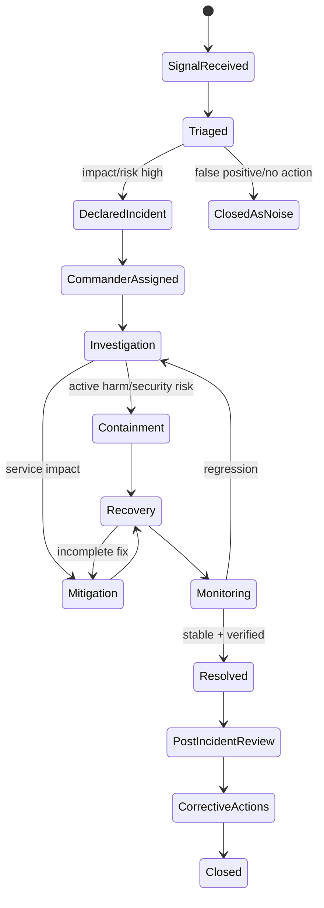
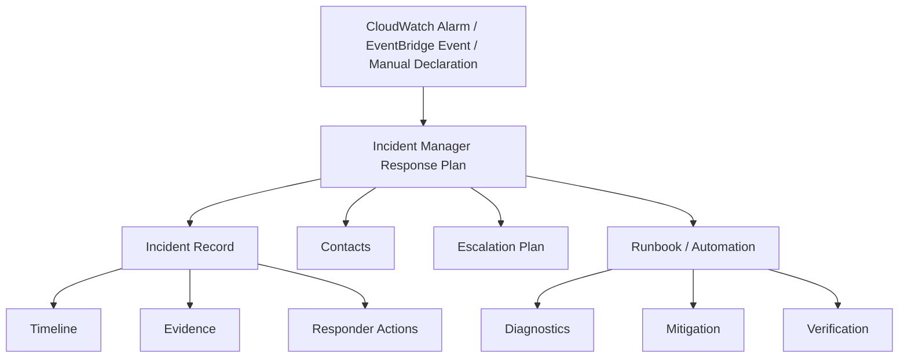
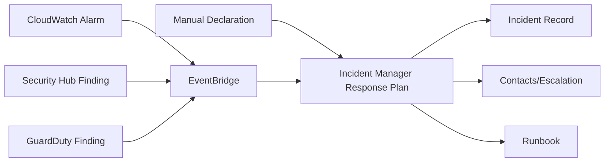
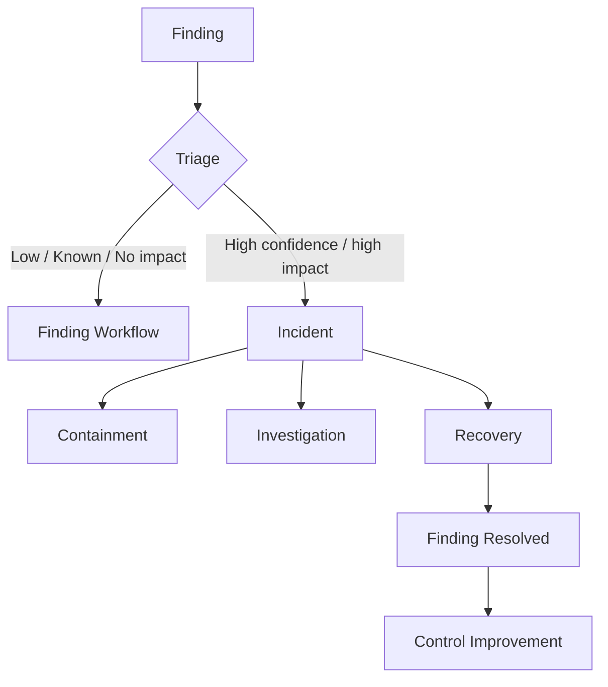
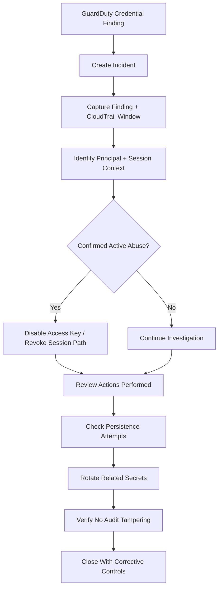

# Part 067 — Incident Manager and Operational Response

Di bagian sebelumnya kita sudah membangun **fleet management plane**: Systems Manager, Session Manager, Patch Manager, Inventory, State Manager, dan compliance loop. Semua itu penting, tetapi belum menjawab pertanyaan paling brutal dalam operasi produksi:

> Ketika sistem rusak, siapa yang tahu, siapa yang mengambil alih, apa langkah pertama, apa batas wewenangnya, bagaimana bukti dikumpulkan, dan bagaimana kita mencegah insiden yang sama berulang?

Itulah peran incident management.

Bukan sekadar Slack ramai. Bukan sekadar alarm berbunyi. Bukan sekadar on-call bangun malam.

Incident management adalah **state machine operasional** yang mengubah sinyal rusak menjadi koordinasi, mitigasi, recovery, evidence, dan perbaikan sistemik.

AWS Systems Manager Incident Manager menyediakan primitive untuk itu: **response plan**, **incident record**, **contacts**, **engagement plan**, **escalation plan**, **runbook**, dan integrasi dengan Amazon CloudWatch serta Amazon EventBridge.

Referensi resmi AWS yang relevan:

- AWS Systems Manager Incident Manager: https://aws.amazon.com/systems-manager/features/incident-manager/
- Response plans: https://docs.aws.amazon.com/incident-manager/latest/userguide/response-plans.html
- Contacts and engagement plans: https://docs.aws.amazon.com/incident-manager/latest/userguide/contacts.html
- AWS Systems Manager Automation: https://docs.aws.amazon.com/systems-manager/latest/userguide/systems-manager-automation.html
- Amazon EventBridge: https://docs.aws.amazon.com/eventbridge/latest/userguide/eb-what-is.html

---

## 1. Mental Model: Incident Response Bukan Ticketing

Ticketing menjawab:

```text
Ada pekerjaan apa?
Siapa yang mengerjakan?
Statusnya apa?
```

Incident response menjawab:

```text
Apa yang sedang rusak?
Seberapa besar dampaknya?
Apakah user terdampak?
Apakah data/security terdampak?
Apa mitigasi tercepat?
Siapa incident commander?
Siapa subject matter expert?
Apa yang sudah dicoba?
Apa bukti perubahan?
Kapan dinyatakan resolved?
Apa perbaikan permanennya?
```

Incident response bukan daftar tugas. Ia adalah **kontrol produksi saat sistem berada di luar kondisi normal**.

Cara berpikir yang benar:

```text
alert != incident
finding != incident
error != incident
anomaly != incident

incident = kondisi operasional/security yang membutuhkan koordinasi terstruktur karena dampak, risiko, atau ketidakpastian melebihi kapasitas respons normal satu engineer
```

Contoh alert yang belum tentu incident:

- CPU satu instance naik 85% selama 3 menit.
- Satu Lambda invocation gagal karena input buruk.
- Satu vulnerability low severity ditemukan.
- Satu user salah password berkali-kali.

Contoh incident:

- Checkout gagal untuk 30% user.
- Latency API critical melewati SLO selama 20 menit.
- GuardDuty menemukan credential exfiltration signal.
- Public S3 bucket berisi data confidential ditemukan.
- KMS key critical dijadwalkan deletion.
- Patch emergency tidak bisa diterapkan pada production fleet.

Incident response dimulai ketika organisasi butuh **mode koordinasi**, bukan hanya debugging.

---

## 2. Incident sebagai State Machine

Incident yang sehat harus punya state eksplisit. Tanpa state, tim akan masuk ke mode chaos: orang berbeda mengejar asumsi berbeda, aksi remediation saling bertabrakan, dan evidence hilang.

Model minimal:



Yang penting bukan nama state-nya. Yang penting setiap state menjawab:

| State | Pertanyaan Operasional |
|---|---|
| Signal received | Sinyal apa yang memicu investigasi? |
| Triaged | Apakah ini noise, degraded service, security event, atau major incident? |
| Declared | Apa severity dan scope awal? |
| Commander assigned | Siapa yang berwenang mengatur respons? |
| Investigation | Hipotesis apa yang sedang diuji? |
| Containment | Apa yang harus dihentikan agar kerusakan tidak meluas? |
| Mitigation | Apa langkah tercepat mengurangi dampak user/bisnis? |
| Recovery | Bagaimana mengembalikan sistem ke kondisi aman/stabil? |
| Monitoring | Bukti apa yang menunjukkan recovery benar? |
| Resolved | Apa definisi selesai? |
| Post-incident | Apa penyebab sistemik dan perbaikan permanen? |

Sistem incident yang buruk biasanya tidak gagal karena kekurangan tool. Ia gagal karena state-nya kabur.

---

## 3. Primitive Incident Manager

Incident Manager menyediakan beberapa primitive utama.

| Primitive | Fungsi |
|---|---|
| Response plan | Template respons untuk kelas incident tertentu. |
| Incident record | Rekaman incident aktual. |
| Contact | Responder yang dapat dihubungi. |
| Contact channel | Email, SMS, voice, atau channel lain sesuai konfigurasi region/fitur. |
| Engagement plan | Urutan dan waktu menghubungi contact. |
| Escalation plan | Rantai eskalasi jika responder awal tidak acknowledge. |
| Runbook | Automation atau prosedur yang dijalankan saat incident. |
| Chat/notification integration | Koordinasi responder melalui kanal operasional. |

Response plan adalah unit desain paling penting.

Jangan membuat satu response plan generik bernama `Production Incident`. Itu terlalu luas.

Lebih baik:

```text
response-plan-p1-customer-facing-availability
response-plan-p1-security-credential-compromise
response-plan-p2-payment-degradation
response-plan-p2-data-pipeline-delay
response-plan-p1-backup-restore-failure
response-plan-p1-audit-logging-disabled
```

Response plan harus merepresentasikan **kelas insiden**, bukan organisasi chart.

---

## 4. Anatomy Response Plan

Response plan minimal harus mengikat lima hal:

```text
trigger class
impact default
responder set
runbook
communication/evidence path
```

Diagram:



Response plan yang bagus memiliki:

| Komponen | Contoh |
|---|---|
| Incident title template | `P1 Checkout Availability Degradation` |
| Impact/severity default | Impact 1 untuk customer-facing outage |
| Summary | `Triggered when checkout success rate drops below SLO burn threshold.` |
| Contacts | Primary on-call, secondary, platform SRE, security responder bila perlu. |
| Escalation | Primary 5 menit, secondary 10 menit, manager 20 menit. |
| Runbook | Diagnose checkout dependency, recent deployment, payment provider, DB saturation. |
| Tags | `service=checkout`, `tier=critical`, `environment=prod`. |
| Automation | Snapshot dashboard links, run diagnostic queries, attach evidence. |

Response plan yang buruk:

```text
Name: Critical Incident
Contacts: all-engineers@example.com
Runbook: check logs
Severity: high
```

Itu bukan response plan. Itu broadcast panic.

---

## 5. Severity dan Impact Model

Severity tidak boleh ditentukan dari emosi. Severity harus ditentukan dari dampak.

Contoh model:

| Severity | Dampak | Target Response | Contoh |
|---|---|---:|---|
| SEV-1 | User/customer critical, data/security critical, revenue/regulatory impact besar | 5 menit | credential compromise, total outage, data exposure |
| SEV-2 | Degradasi besar, workaround terbatas | 15 menit | checkout error 20%, queue stuck, read-only mode |
| SEV-3 | Degradasi terbatas, sebagian user/service | 1 jam | endpoint lambat, batch tertunda |
| SEV-4 | Minor, no immediate customer impact | business day | non-critical alarm, low-risk drift |

Security severity perlu model tambahan karena dampaknya sering belum terlihat.

Contoh security incident severity:

| Severity | Kondisi |
|---|---|
| SEC-1 | Active compromise, data exfiltration, root/member account compromise, audit tampering. |
| SEC-2 | Confirmed high-risk exposure, leaked credential with access, public confidential data exposure. |
| SEC-3 | Suspicious behavior but not confirmed, exploitable vulnerability on critical asset. |
| SEC-4 | Policy violation, low-risk misconfiguration, stale access. |

Rule penting:

```text
Ketika uncertainty tinggi dan blast radius belum jelas, naikkan severity sementara.
Turunkan setelah bukti cukup.
```

Salah satu kegagalan klasik incident response adalah terlalu lama memperdebatkan severity saat containment seharusnya sudah berjalan.

---

## 6. Incident Commander Model

Pada insiden besar, orang paling senior secara teknis belum tentu harus menjadi incident commander.

Incident commander bertugas:

```text
menjaga timeline
menetapkan prioritas
mengatur komunikasi
mencegah parallel chaos
meminta owner hipotesis
membuat keputusan eskalasi
menjaga evidence
menentukan resolved criteria
```

Subject matter expert bertugas:

```text
menganalisis domain teknis
menjalankan diagnosis
mengusulkan mitigasi
mengeksekusi perubahan teknis sesuai otorisasi
```

Security responder bertugas:

```text
menilai indikasi compromise
menjaga chain of custody evidence
menentukan containment boundary
mencegah destruction of evidence
mengatur credential/key/session revocation
```

Peran lain:

| Role | Tanggung Jawab |
|---|---|
| Incident Commander | Koordinasi, prioritas, state, keputusan. |
| Operations Lead | Eksekusi operasional, rollback, scaling, failover. |
| Security Lead | Threat containment, evidence, access revocation. |
| Communications Lead | Internal/external update, stakeholder brief. |
| Scribe | Timeline, action log, decision log. |
| Customer/Business Liaison | Dampak bisnis, prioritas pelanggan, regulatory concern. |

Untuk organisasi kecil, satu orang bisa memegang beberapa peran. Namun perannya tetap harus eksplisit.

---

## 7. Trigger: CloudWatch Alarm, EventBridge, Security Hub, Manual

Incident bisa dipicu dari beberapa sumber.



Trigger pattern:

| Source | Cocok Untuk |
|---|---|
| CloudWatch Alarm | Availability, latency, error, saturation, SLO burn. |
| EventBridge | Security findings, compliance drift, account events, automation failures. |
| Security Hub | Correlated security posture/threat findings. |
| GuardDuty | Threat signal dan suspicious activity. |
| AWS Config | Critical non-compliance, audit logging disabled, public exposure. |
| Manual | Customer report, support escalation, unknown failure, war-room declaration. |

Jangan semua alarm otomatis menjadi incident.

Gunakan filter:

```text
signal quality
business criticality
duration
blast radius
confidence
security implication
correlation with other signals
```

Contoh bagus:

```text
CloudWatch composite alarm:
- checkout availability SLO burn > threshold
- AND request volume above minimum
- AND dependency health degraded
=> create Incident Manager incident
```

Contoh buruk:

```text
CPU > 80% for 1 minute => SEV-1 incident
```

Alarm harus cukup tajam agar incident tidak menjadi noise.

---

## 8. Runbook: Manual, Automated, atau Hybrid

Runbook bukan dokumen panjang yang dibuka sekali setahun.

Runbook adalah **program respons**.

Ada tiga jenis:

| Jenis | Karakter |
|---|---|
| Manual runbook | Langkah manusia, cocok untuk judgment-heavy incident. |
| Automated runbook | Systems Manager Automation/Step Functions menjalankan prosedur. |
| Hybrid runbook | Automation mengumpulkan evidence, manusia mengambil keputusan. |

Pola terbaik biasanya hybrid.

Contoh untuk incident API latency:

```text
1. Collect dashboard snapshot.
2. Query recent deployment events.
3. Query top 5xx endpoints.
4. Query dependency error rate.
5. Check autoscaling capacity.
6. Check recent config changes.
7. Suggest mitigation candidates.
8. Human approves rollback/failover/scale-out.
```

Untuk security incident:

```text
1. Freeze evidence.
2. Capture CloudTrail events for principal/resource.
3. Capture GuardDuty/Security Hub related findings.
4. Disable suspected access key if confirmed high-risk.
5. Quarantine compute resource if active compromise.
6. Rotate secrets/keys if exposure likely.
7. Verify no audit service tampering.
8. Human confirms containment scope.
```

Jangan membuat automation yang langsung menghancurkan evidence.

Contoh berbahaya:

```text
GuardDuty finding -> terminate EC2 immediately
```

Lebih aman:

```text
GuardDuty high severity EC2 compromise
-> isolate security group
-> detach risky IAM role if allowed by runbook
-> snapshot volume if forensic policy permits
-> preserve CloudTrail/Flow Logs
-> notify incident commander
```

---

## 9. Evidence First, Fix Second? Tidak Selalu

Ada ketegangan antara forensic evidence dan mitigasi cepat.

Untuk availability incident, biasanya mitigasi cepat menang:

```text
rollback
scale out
disable feature flag
failover
restore traffic
```

Untuk security incident, evidence preservation sering penting:

```text
jangan terminate instance sebelum snapshot/memory capture jika forensik diperlukan
jangan delete IAM role sebelum CloudTrail/Access Analyzer context dicatat
jangan rotate semua secret tanpa memahami blast radius dependency
```

Namun jika active harm berlangsung, containment tetap prioritas.

Decision matrix:

| Kondisi | Prioritas |
|---|---|
| User-facing outage | Mitigate first, collect enough evidence in parallel. |
| Suspected data exfiltration active | Contain first, preserve evidence as much as possible. |
| Credential confirmed leaked | Revoke/disable first, then reconstruct activity. |
| Malware on non-critical instance | Isolate, snapshot, investigate. |
| Audit logging disabled | Re-enable/protect logging immediately, investigate tampering. |

Invariant:

```text
Jangan membiarkan kerusakan aktif berlanjut demi evidence sempurna.
Jangan menghancurkan evidence tanpa alasan mitigasi yang jelas.
```

---

## 10. Timeline dan Decision Log

Setiap incident harus punya timeline.

Minimal:

```text
T+00 signal received
T+03 triaged as SEV-2
T+05 incident commander assigned
T+07 hypothesis: recent deployment caused error spike
T+10 rollback approved
T+13 rollback started
T+18 error rate dropping
T+25 SLO back within threshold
T+40 monitoring stable
T+55 resolved
```

Decision log lebih penting daripada action log.

Action log:

```text
Ran rollback.
Restarted workers.
Changed config.
```

Decision log:

```text
Rollback chosen over scale-out because saturation was not present and error started immediately after deployment v2026.07.06.3.
```

Post-incident review butuh decision log untuk memahami reasoning. Tanpa decision log, review berubah menjadi debat memori.

---

## 11. Integrasi dengan Security Finding Lifecycle

Dari Part 046, kita sudah punya lifecycle finding.

Incident response memakai finding sebagai input, tetapi incident bukan finding.



Contoh:

| Finding | Menjadi Incident? | Alasan |
|---|---|---|
| S3 bucket public tetapi kosong | Mungkin tidak | Perlu remediation, belum tentu incident. |
| S3 bucket public berisi PII | Ya | Data exposure risk tinggi. |
| GuardDuty low severity port scan | Tidak selalu | Bisa menjadi detection record. |
| GuardDuty credential exfiltration | Ya | Potential account compromise. |
| Inspector critical CVE pada sandbox | Tidak selalu | SLA remediation cukup. |
| Inspector critical CVE exploited in wild pada prod internet-facing | Mungkin ya | Exposure + exploitability + criticality. |

Security Hub/EventBridge dapat routing finding ke response plan tertentu.

Pattern:

```text
Security Hub ASFF finding
-> EventBridge rule by ProductName/Severity/ResourceTag
-> Lambda enrichment
-> decision: create incident or create ticket
-> Incident Manager response plan
```

---

## 12. Incident Classes untuk AWS Environment

Production AWS environment sebaiknya punya response plan untuk kelas insiden berikut.

### 12.1 Availability Incident

Trigger:

```text
SLO burn rate high
5xx spike
latency p95/p99 breach
health check failure
dependency unavailable
```

Responder:

```text
service owner
platform/SRE
database owner if dependency signal indicates DB
network owner if connectivity signal indicates network path
```

Runbook:

```text
recent deploy check
dependency health check
capacity/saturation check
rollback/failover path
customer impact estimate
```

### 12.2 Security Credential Incident

Trigger:

```text
GuardDuty credential exfiltration finding
CloudTrail impossible travel-like context
access key used from unusual ASN/country
root user usage
unexpected AssumeRole into prod
```

Responder:

```text
security responder
IAM/platform owner
affected workload owner
incident commander
```

Runbook:

```text
identify principal
capture CloudTrail window
disable/rotate credential
review privilege and resource touched
check persistence attempts
verify logging integrity
```

### 12.3 Data Exposure Incident

Trigger:

```text
Macie high severity sensitive data finding on public/shared S3
S3 Block Public Access disabled on sensitive bucket
unexpected cross-account resource policy
```

Runbook:

```text
freeze access state
capture bucket policy and ACL
identify object scope
block public access
review CloudTrail data events if enabled
notify privacy/legal if required
```

### 12.4 Audit Tampering Incident

Trigger:

```text
CloudTrail stopped/deleted
Config recorder stopped
Log archive bucket policy changed
KMS key for logs scheduled deletion
Security Hub/GuardDuty disabled
```

Runbook:

```text
restore audit control
identify actor
preserve event trail
review SCP/RCP gaps
rotate/admin review if privileged actor involved
```

### 12.5 Backup Recovery Incident

Trigger:

```text
backup job failure on critical resource
restore testing failure
vault lock misconfiguration
unexpected delete recovery point attempt
cross-account copy failure
```

Runbook:

```text
identify affected resource class
check last successful backup
check restore viability
trigger manual backup/copy if safe
escalate to data owner
```

---

## 13. On-Call Design

Incident Manager bisa menghubungi contact dan escalation plan, tetapi organisasi tetap harus mendesain on-call dengan sehat.

Anti-pattern:

```text
semua engineer masuk semua incident
primary on-call tidak punya authority
runbook tidak ada
escalation hanya nama manager
on-call tidak pernah drill
postmortem selalu mencari siapa salah
```

Desain yang lebih baik:

```text
service ownership jelas
primary/secondary rotation
escalation by capability, not hierarchy only
incident commander pool
security incident responder pool
platform escalation path
clear handoff across timezone
```

Checklist on-call:

| Area | Pertanyaan |
|---|---|
| Authority | Boleh rollback? Boleh disable feature? Boleh isolate instance? |
| Access | Apakah akses emergency tersedia dan auditable? |
| Runbook | Apakah langkah awal jelas dalam 5 menit pertama? |
| Observability | Apakah dashboard/query tersedia? |
| Escalation | Siapa dipanggil jika tidak bisa mitigate? |
| Safety | Apa aksi yang dilarang tanpa approval? |

On-call tanpa authority adalah pager theater.

---

## 14. First 15 Minutes Protocol

Incident yang kacau sering gagal di 15 menit pertama.

Protocol sederhana:

```text
Minute 0-3:
- acknowledge signal
- create/confirm incident record
- assign incident commander

Minute 3-7:
- classify severity
- define impact hypothesis
- identify current customer/security risk
- start timeline

Minute 7-12:
- assign investigation owners
- collect first evidence pack
- decide mitigation vs containment path

Minute 12-15:
- publish first internal update
- engage required SME/security/platform owner
- define next checkpoint time
```

Template first update:

```text
Status: Investigating SEV-2 checkout degradation.
Impact: ~18% checkout requests failing in ap-southeast-1 since 10:42 UTC.
Known: Error increase started after deployment v2026.07.06.3.
Unknown: Whether payment dependency is contributing.
Actions: Deployment owner checking rollback readiness; platform checking ALB/target health; DB owner checking saturation.
Next update: 15 minutes.
```

Update yang buruk:

```text
We are looking into it.
```

Itu tidak memberi informasi decision-grade.

---

## 15. Communication Cadence

Komunikasi incident harus predictable.

| Severity | Internal Update | External/Stakeholder Update |
|---|---:|---:|
| SEV-1 | 10–15 menit | 15–30 menit tergantung policy |
| SEV-2 | 15–30 menit | 30–60 menit jika customer impact |
| SEV-3 | 30–60 menit | bila relevan |
| Security SEC-1 | sesuai legal/security protocol | jangan improvisasi tanpa approval |

Format update:

```text
Current status
Impact
What changed since last update
Actions in progress
Risks/unknowns
Next update time
```

Security update harus hati-hati. Jangan menyimpulkan data breach sebelum evidence cukup. Jangan juga menunda containment karena takut menulis update.

---

## 16. AWS-Native Incident Evidence Pack

Untuk AWS incident, buat evidence pack standar.

### Availability Evidence Pack

```text
CloudWatch dashboard snapshot
relevant alarms and state transitions
Application Signals service/dependency view
X-Ray trace samples
CloudWatch Logs Insights query outputs
recent deployment/change events
autoscaling events
ELB/API Gateway/Lambda/ECS metrics
```

### Security Evidence Pack

```text
Security Hub finding JSON/ASFF
GuardDuty finding details
CloudTrail events around actor/resource/time window
IAM principal policy snapshot
resource policy snapshot
Config item timeline
VPC Flow Logs sample if network relevant
Macie finding if data relevant
KMS key policy and usage events if encryption relevant
```

### Management/Fleet Evidence Pack

```text
SSM command history
Automation execution
Patch compliance state
Inventory facts
State Manager association status
Session Manager logs if access-related
```

Evidence pack harus bisa dibuat sebagian otomatis.

---

## 17. Runbook Pattern: Security Credential Compromise

Contoh high-level runbook:



Langkah detail:

```text
1. Record finding ID, account, region, principal, resource.
2. Pull CloudTrail events for principal ±24 hours.
3. Identify access type: IAM user key, assumed role, federated session, workload role.
4. Determine source IP/ASN/user agent pattern.
5. Check actions performed: IAM, STS, S3, KMS, EC2, Secrets Manager, CloudTrail, Organizations.
6. Disable or rotate credential according to blast radius.
7. Revoke temporary access path if possible by changing trust/policy/session controls.
8. Search for persistence: new users, access keys, roles, policies, login profiles, backdoor resource policies.
9. Check data access: S3 data events, Macie scope, KMS decrypt events where available.
10. Verify security services are still enabled.
11. Produce incident summary and control fixes.
```

Do not stop at “credential disabled”. The real question is:

```text
What did the principal do before it was disabled?
```

---

## 18. Runbook Pattern: Audit Logging Disabled

Audit service tampering is critical because it attacks evidence.

Trigger examples:

```text
CloudTrail StopLogging
CloudTrail DeleteTrail
Config StopConfigurationRecorder
Security Hub DisableSecurityHub
GuardDuty DeleteDetector
S3 PutBucketPolicy on log archive bucket
KMS ScheduleKeyDeletion on log encryption key
```

Response:

```text
1. Re-enable logging/security service immediately if authorized.
2. Capture CloudTrail event that performed tampering.
3. Identify principal and session context.
4. Determine whether action came from automation, admin, compromised credential, or break-glass.
5. Check policy path that allowed action.
6. Validate whether SCP guardrail was absent, scoped incorrectly, or bypassed via management account.
7. Review other security controls for concurrent tampering.
8. Create corrective action: SCP/RCP/IAM boundary/Config rule/EventBridge remediation.
```

This incident often means your preventive guardrails are incomplete.

---

## 19. Post-Incident Review

Post-incident review bukan ritual menyalahkan orang.

Format yang efektif:

```text
1. What happened?
2. What was the impact?
3. How did we detect it?
4. How did we respond?
5. What made response slower or riskier?
6. What prevented worse impact?
7. What systemic controls failed or were missing?
8. What changes will reduce probability or impact?
9. Who owns each corrective action?
10. How will we verify completion?
```

Timeline harus factual. Hindari narasi yang terlalu rapi.

Buruk:

```text
Engineer forgot to update policy.
```

Lebih baik:

```text
The deployment pipeline allowed a policy change that removed S3 Block Public Access on a bucket tagged data_classification=confidential. No SCP/RCP prevented the action, Config detected it after 12 minutes, but no automated remediation was attached.
```

Ini mengarah ke perbaikan sistem:

```text
preventive control
faster detection
automated remediation
owner training
pipeline validation
exception workflow
```

---

## 20. Corrective Action Taxonomy

Tidak semua corrective action sama.

| Type | Contoh |
|---|---|
| Preventive | SCP deny disabling CloudTrail. |
| Detective | Config rule detects public bucket. |
| Responsive | EventBridge triggers remediation. |
| Recovery | Restore test plan for critical DB. |
| Observability | Add SLO burn alarm. |
| Process | Define incident commander rotation. |
| Training | Run game day for credential compromise. |
| Architecture | Separate account boundary for sensitive data. |

Corrective action yang buruk:

```text
Be more careful next time.
```

Corrective action yang baik:

```text
Add SCP denying cloudtrail:StopLogging except SecurityAutomationRole in security tooling account; test in PolicyStaging OU; deploy to Workloads OU; add EventBridge alert for denied attempts.
```

---

## 21. Game Days dan Incident Drills

Incident Manager configuration yang belum pernah diuji adalah asumsi.

Game day examples:

| Drill | Tujuan |
|---|---|
| Credential leak simulation | Menguji detection, disable, CloudTrail investigation, communication. |
| Logging tamper drill | Menguji guardrail dan remediation audit controls. |
| Regional dependency failure | Menguji failover dan stakeholder communication. |
| Restore drill | Menguji RTO/RPO, backup access, KMS, restore runbook. |
| WAF false positive | Menguji exception workflow dan safe rollback. |
| SSM access failure | Menguji break-glass path. |

Game day harus punya:

```text
scope
blast-radius guardrail
success criteria
observer
timeline capture
post-drill corrective action
```

---

## 22. Metrics Incident Response

Yang diukur bukan hanya jumlah incident.

| Metric | Makna |
|---|---|
| MTTD | Mean time to detect. |
| MTTA | Mean time to acknowledge. |
| MTTM | Mean time to mitigate. |
| MTTR | Mean time to recover/resolve. |
| Time to commander | Seberapa cepat koordinasi terbentuk. |
| Time to first useful update | Kualitas komunikasi awal. |
| Reopen rate | Apakah resolved terlalu cepat. |
| Repeat incident rate | Apakah corrective action efektif. |
| Automation success rate | Apakah runbook otomatis reliable. |
| Evidence completeness | Apakah post-incident punya data cukup. |

Hati-hati: jika MTTR dijadikan target buta, tim bisa menutup incident sebelum benar-benar stabil.

Metric harus dipakai untuk memperbaiki sistem, bukan menghukum responder.

---

## 23. Failure Modes

| Failure Mode | Dampak | Mitigasi |
|---|---|---|
| Alarm terlalu noisy | Incident fatigue | Composite alarm, SLO-based trigger, dedupe. |
| Response plan terlalu generik | Responder salah, runbook kabur | Response plan per incident class. |
| Escalation tidak diuji | Tidak ada yang merespons | Regular contact/channel test. |
| On-call tidak punya akses | Response lambat | JIT/break-glass access model. |
| Automation terlalu agresif | Produksi rusak/evidence hilang | Safety ladder, approval gates. |
| Severity tidak jelas | Debat panjang | Impact-based severity matrix. |
| Timeline tidak dicatat | Review lemah | Scribe/automation evidence capture. |
| Postmortem tanpa owner | Masalah berulang | Corrective action owner + due date + verification. |
| Security incident ditangani seperti outage biasa | Evidence rusak | Security-specific runbook. |
| Tool hanya ada di satu region/account | Control plane failure | Multi-region preparedness where required. |

---

## 24. Production Checklist

Sebelum menyatakan incident response AWS production-ready:

```text
[ ] Response plan tersedia untuk availability, security, data exposure, audit tampering, backup failure.
[ ] Contact dan escalation plan diuji.
[ ] Incident commander role jelas.
[ ] Runbook punya langkah 15 menit pertama.
[ ] CloudWatch/EventBridge/Security Hub trigger tidak terlalu noisy.
[ ] Evidence pack bisa dikumpulkan cepat.
[ ] Security incident runbook tidak menghancurkan evidence secara tidak sengaja.
[ ] Break-glass access tersedia dan diaudit.
[ ] Communication cadence didefinisikan per severity.
[ ] Post-incident review menghasilkan corrective action terverifikasi.
[ ] Game day dijadwalkan berkala.
[ ] Metrics respons digunakan untuk memperbaiki sistem.
```

---

## 25. Kesimpulan

Incident management adalah lapisan yang menguji semua desain sebelumnya.

IAM yang bagus akan terlihat saat credential compromise.

CloudTrail yang bagus akan terlihat saat harus membuktikan siapa melakukan apa.

CloudWatch yang bagus akan terlihat saat harus membedakan symptom dan cause.

Systems Manager yang bagus akan terlihat saat harus mengakses fleet tanpa membuka SSH liar.

Security Hub/GuardDuty/Config yang bagus akan terlihat saat finding harus berubah menjadi tindakan.

Prinsip utama:

```text
Incident response bukan heroism.
Incident response adalah sistem.
```

Sistem itu terdiri dari trigger yang tajam, response plan yang spesifik, responder yang jelas, runbook yang aman, evidence yang lengkap, komunikasi yang disiplin, dan corrective action yang mengubah arsitektur agar kegagalan yang sama tidak kembali.

Di Part 068 kita akan masuk ke **Backup Governance and Restore Readiness**: karena incident response terbaik tetap gagal jika data tidak bisa dipulihkan.
