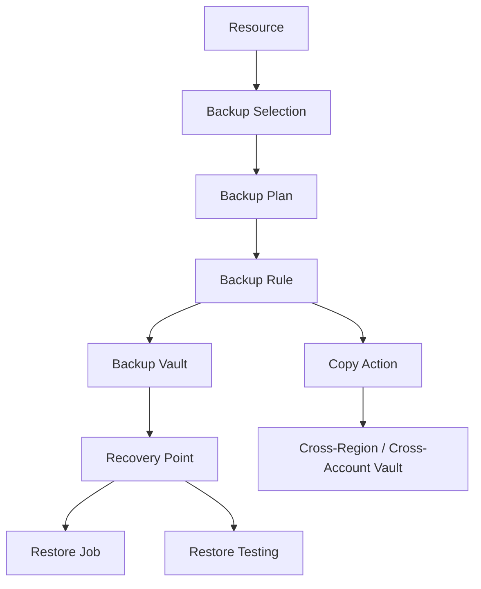
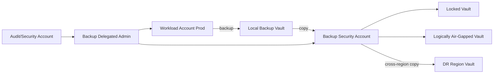
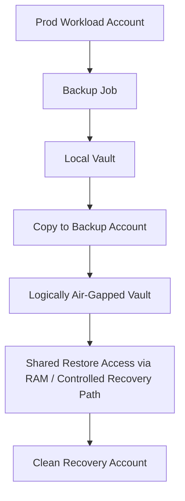
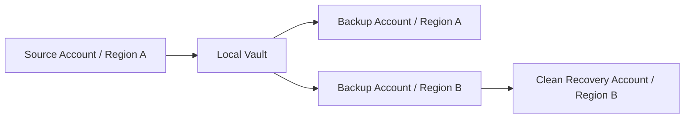
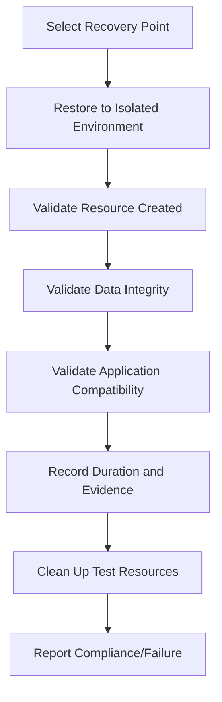
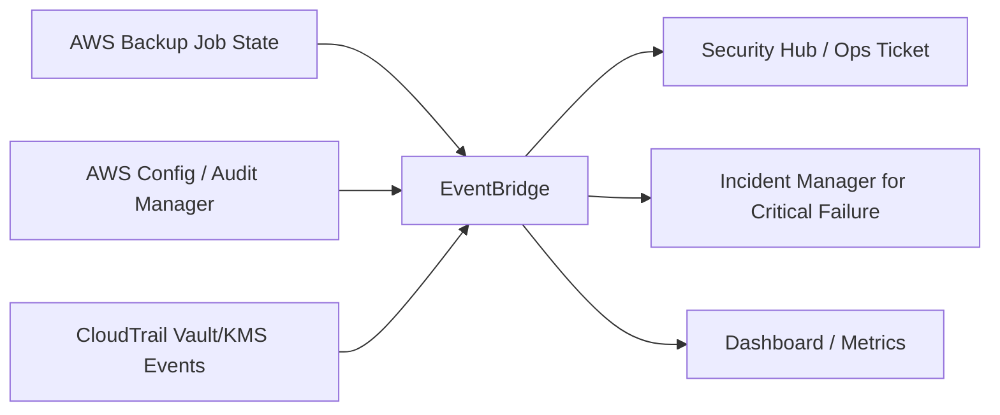
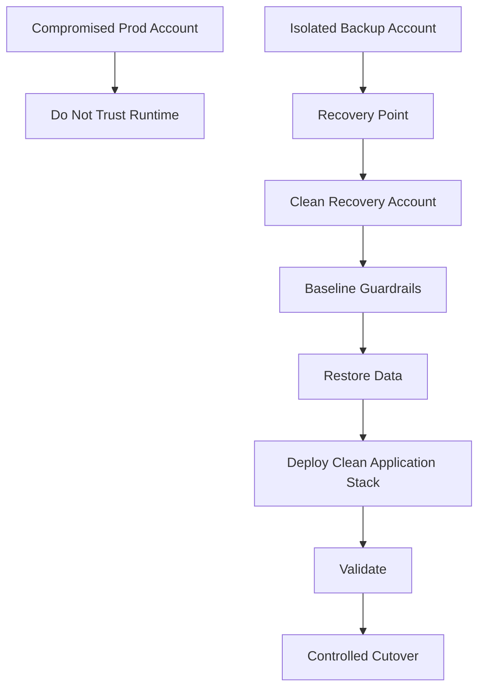

# Part 068 — Backup Governance and Restore Readiness

Backup sering disalahpahami sebagai urusan storage.

Di production-grade AWS environment, backup adalah **recovery control**, **ransomware resilience boundary**, **compliance evidence**, dan **last line of defense** ketika preventive, detective, dan responsive control gagal.

Backup yang tidak pernah diuji restore-nya belum bisa dianggap backup.

Backup yang bisa dihapus oleh credential yang sama dengan workload production belum bisa dianggap recovery boundary.

Backup yang tidak punya owner, policy, retention, encryption, cross-account/cross-region strategy, dan evidence belum bisa dianggap governance.

AWS Backup menyediakan primitive untuk membangun ini: **backup plan**, **backup rule**, **backup selection**, **backup vault**, **copy action**, **backup policies via AWS Organizations**, **delegated administrator**, **Vault Lock**, **logically air-gapped vault**, **restore testing**, **Audit Manager**, dan job monitoring.

Referensi resmi AWS yang relevan:

- AWS Backup Developer Guide: https://docs.aws.amazon.com/aws-backup/latest/devguide/whatisbackup.html
- Backup policies in AWS Organizations: https://docs.aws.amazon.com/organizations/latest/userguide/orgs_manage_policies_backup.html
- AWS Backup delegated administrator: https://docs.aws.amazon.com/aws-backup/latest/devguide/manage-cross-account.html
- Backup vaults: https://docs.aws.amazon.com/aws-backup/latest/devguide/vaults.html
- AWS Backup Vault Lock: https://docs.aws.amazon.com/aws-backup/latest/devguide/vault-lock.html
- Logically air-gapped vault: https://docs.aws.amazon.com/aws-backup/latest/devguide/logicallyairgappedvault.html
- Restore testing: https://docs.aws.amazon.com/aws-backup/latest/devguide/restore-testing.html

---

## 1. Mental Model: Backup Bukan File Copy

Backup production harus menjawab enam pertanyaan:

```text
Apa yang harus dipulihkan?
Seberapa jauh data boleh hilang?
Seberapa cepat harus kembali?
Siapa yang boleh menghapus/mengubah backup?
Apakah backup bisa dipulihkan saat account/workload compromise?
Bagaimana kita membuktikan restore benar-benar bisa dilakukan?
```

Definisi dasar:

| Istilah | Makna |
|---|---|
| RPO | Recovery Point Objective: batas kehilangan data yang dapat diterima. |
| RTO | Recovery Time Objective: batas waktu pemulihan yang dapat diterima. |
| Backup | Salinan recovery point. |
| Restore | Proses membuat resource usable dari recovery point. |
| Backup governance | Policy, ownership, retention, encryption, isolation, evidence. |
| Restore readiness | Keyakinan berbasis uji bahwa recovery point bisa dipulihkan sesuai RTO/RPO. |

Backup bukan goal. Restore adalah goal.

```text
Backup success != recovery success
Recovery point exists != application is restored
Snapshot exists != data is consistent
Vault locked != restore path works
```

---

## 2. Threat Model Backup

Backup strategy harus didesain melawan failure dan adversary.

| Threat | Contoh |
|---|---|
| Accidental deletion | Engineer menghapus table/bucket/volume. |
| Bad deployment | Migration merusak data. |
| Regional failure | Region dependency tidak tersedia. |
| Account compromise | Attacker mencoba menghapus backup. |
| Ransomware | Data dienkripsi/dihapus, backup juga ditarget. |
| Insider threat | Privileged user mengubah retention/deletion. |
| KMS/key failure | Backup ada tetapi tidak bisa decrypt. |
| Policy drift | Resource critical tidak lagi tercakup backup plan. |
| Restore rot | Backup berhasil, tetapi restore runbook rusak/tidak pernah diuji. |

Backup governance harus mengasumsikan:

```text
Workload account bisa compromise.
Admin credential bisa compromise.
Region bisa bermasalah.
IaC bisa salah.
KMS policy bisa salah.
Backup job success bisa memberi rasa aman palsu.
```

---

## 3. AWS Backup Core Primitive



Primitive:

| Primitive | Fungsi |
|---|---|
| Backup plan | Kontrak jadwal, lifecycle, dan copy backup. |
| Backup rule | Frekuensi, window, vault target, lifecycle, copy action. |
| Backup selection | Resource mana yang masuk plan, sering berbasis tag. |
| Backup vault | Container recovery points. |
| Recovery point | Backup individual yang dapat direstore. |
| Copy action | Menyalin backup ke region/account/vault lain. |
| Vault Lock | Immutability/retention protection. |
| Restore testing plan | Uji restore berkala. |
| Backup Audit Manager | Evidence compliance backup controls. |

Jangan mulai dari “backup semua resource”. Mulai dari **recovery requirement**.

---

## 4. Klasifikasi Workload untuk Backup

Tidak semua workload butuh backup yang sama.

| Tier | Contoh | RPO | RTO | Strategy |
|---|---|---:|---:|---|
| Tier 0 | Identity, audit, KMS config, landing zone state | rendah | rendah | immutable backup, config export, cross-account, tested restore |
| Tier 1 | Payment, customer data, regulatory records | menit-jam | menit-jam | frequent backup/PITR, cross-region/account copy, restore testing |
| Tier 2 | Core application state | jam | jam | daily/hourly backup, tested restore |
| Tier 3 | Derived/cache/rebuildable | tinggi | tinggi | maybe no backup, rebuild from source |
| Tier 4 | Ephemeral compute | n/a | n/a | no backup; recreate via IaC |

Engineering mistake umum:

```text
backup infrastructure yang reproducible
lupa backup data yang non-reproducible
```

Yang perlu dilindungi adalah **state yang tidak bisa dibangun ulang dari code/pipeline**.

---

## 5. Backup Policy sebagai Governance Contract

Backup policy harus menjawab:

```text
resource class
classification
frequency
retention
copy target
vault lock
restore test frequency
owner
exception process
```

Contoh policy table:

| Data Class | Resource | Frequency | Retention | Copy | Restore Test |
|---|---|---:|---:|---|---:|
| regulated | RDS/Aurora | hourly/daily + PITR | 7y sesuai regulasi | cross-account + cross-region | monthly |
| confidential | EBS/RDS/S3 | daily | 90–365d | cross-account | quarterly |
| internal | EBS/RDS | daily | 30–90d | optional | semiannual |
| ephemeral | EC2/ECS temp | none | n/a | none | n/a |

Dengan AWS Organizations backup policies, organisasi dapat mendefinisikan backup plans secara terpusat dan menerapkannya ke account/OUs. Ini penting untuk menghindari setiap tim membuat backup policy sendiri tanpa standar.

---

## 6. Account Model untuk Backup

Production-grade backup jarang ideal jika semua berada dalam workload account yang sama.

Model yang lebih kuat:



Account roles:

| Account | Fungsi |
|---|---|
| Workload account | Source resource dan local operational restore. |
| Backup delegated admin account | Central policy, monitoring, governance. |
| Backup security/recovery account | Isolated vault dan recovery boundary. |
| Log archive/security account | Backup audit logs dan evidence. |
| DR account/region | Recovery target untuk major outage/compromise. |

Principle:

```text
Credential yang bisa merusak workload tidak boleh otomatis bisa menghancurkan backup final.
```

---

## 7. Backup Vault Design

Backup vault adalah container recovery point. Desain vault menentukan encryption, access control, retention behavior, monitoring, dan restore path.

Vault strategy:

| Vault Type | Tujuan |
|---|---|
| Local operational vault | Restore cepat untuk kesalahan biasa. |
| Locked compliance vault | Retention immutability. |
| Cross-account vault | Isolasi dari workload account. |
| Cross-region vault | Regional resilience. |
| Logically air-gapped vault | Recovery isolation/shareability untuk skenario compromise. |

Jangan campur semua data di satu vault generik.

Contoh naming:

```text
vault-prod-tier1-local
vault-prod-tier1-xacct-locked
vault-prod-regulated-7y-compliance
vault-prod-dr-ap-southeast-3
vault-prod-airgapped-critical
```

Vault policy harus membatasi:

```text
who can start backup jobs
who can copy into vault
who can restore
who can delete recovery points
who can change vault policy
who can change vault lock
```

---

## 8. Vault Lock: Governance Mode vs Compliance Mode

Vault Lock membantu mencegah perubahan retention/delete yang merusak backup.

Mental model:

```text
Vault Lock membuat backup retention lebih sulit atau tidak mungkin diubah/dihapus sebelum waktunya.
```

Dua mode umum:

| Mode | Karakter |
|---|---|
| Governance mode | Proteksi kuat, tetapi user dengan permission khusus masih bisa mengubah/menghapus lock/config. |
| Compliance mode | Setelah grace time selesai, konfigurasi tidak bisa diubah/dihapus oleh customer/account owner/AWS selama vault berisi recovery point. |

Gunakan compliance mode dengan sangat hati-hati.

Checklist sebelum compliance lock:

```text
[ ] Retention benar sesuai legal/business requirement.
[ ] Cost impact dipahami.
[ ] Restore path diuji.
[ ] KMS/encryption design benar.
[ ] Vault policy benar.
[ ] Exception/legal hold process jelas.
[ ] Grace time digunakan untuk validasi.
[ ] Approval multi-person dilakukan.
```

Compliance lock yang salah bisa membuat organisasi membayar retention panjang yang tidak bisa dibatalkan.

---

## 9. Logically Air-Gapped Vault

Logically air-gapped vault adalah vault yang didesain untuk recovery isolation dan secure sharing lintas account/Organizations.

Gunanya:

```text
mengurangi risiko source account compromise menghancurkan semua recovery point
mempercepat restore lintas account
mendukung ransomware recovery posture
menyediakan boundary pemulihan yang lebih terisolasi
```

Pattern:



Hal yang harus dipahami:

- Ini “logical” air gap, bukan offline tape.
- Access, sharing, restore, encryption, dan approval tetap harus didesain.
- Restore target account harus siap.
- KMS/key model harus diuji.
- Security automation jangan sampai salah menghapus/mengganggu recovery workflow.

---

## 10. KMS dan Encryption Failure Mode

Backup sering gagal dipulihkan bukan karena recovery point hilang, tetapi karena key/access salah.

Pertanyaan wajib:

```text
KMS key mana yang mengenkripsi backup?
Siapa bisa decrypt saat restore?
Apakah key berada di source account atau backup account?
Apakah key policy mengizinkan AWS Backup service role?
Apakah cross-account copy butuh re-encryption?
Apakah key bisa dihapus oleh compromised admin?
Apakah key rotation/alias change memengaruhi runbook?
```

Failure mode:

| Failure | Dampak |
|---|---|
| KMS key deleted/scheduled deletion | Backup tidak bisa dipulihkan. |
| Key policy terlalu sempit | Restore job gagal. |
| Key policy terlalu longgar | Data bisa didecrypt pihak tidak berwenang. |
| Cross-account grant tidak benar | Copy/restore gagal. |
| Vault lock ada tapi key tidak terlindungi | Backup immutable tetapi unreadable. |

Invariant:

```text
Backup immutability tanpa key recoverability adalah ilusi.
```

---

## 11. Resource Selection: Tag-Based, But Guarded

AWS Backup selection sering berbasis tag.

Contoh:

```text
backup:tier = tier1
backup:enabled = true
backup:plan = regulated-7y
```

Tag-based selection scalable, tetapi punya risiko:

```text
tag dihapus -> resource keluar dari backup
tag salah -> resource tidak pernah dibackup
tag privilege tidak dilindungi -> attacker bisa opt out backup
```

Guardrail:

```text
SCP/IAM deny removing protected backup tags on prod resources
Config rule detects critical resource without backup tag
AWS Backup protected resource report
Security Hub/Config finding for backup non-compliance
periodic inventory diff: critical resource vs backup plan coverage
```

Better model:

```text
resource criticality source of truth
-> tag enforced by provisioning pipeline
-> Config detects drift
-> Backup selection consumes tag
-> Audit Manager/evidence verifies coverage
```

Jangan mengandalkan tag manual.

---

## 12. Backup Frequency dan Consistency

Frekuensi backup harus mengikuti RPO, bukan kebiasaan.

| RPO | Pattern |
|---|---|
| minutes | PITR/continuous backup/service-native replication. |
| hourly | Frequent backup rule + copy strategy. |
| daily | Standard snapshot backup. |
| weekly/monthly | Archive/compliance retention. |

Consistency concern:

| Resource | Concern |
|---|---|
| RDS/Aurora | Transaction consistency, PITR, parameter/subnet/security context. |
| DynamoDB | PITR, table schema/indexes, IAM/app config. |
| EBS | App/filesystem consistency if snapshot while writes active. |
| EFS | File-level state and restore target. |
| S3 | Versioning, lifecycle, delete markers, object lock, replication. |
| EKS | Cluster state + persistent volumes + manifests/config. |

Backup data saja tidak cukup jika application metadata tidak bisa direkonstruksi.

Contoh:

```text
Database restored, tetapi Secrets Manager secret lama hilang.
Snapshot restored, tetapi KMS key policy tidak mengizinkan app role.
EBS restored, tetapi launch template/security group/IAM role tidak cocok.
DynamoDB restored, tetapi stream/event consumer state tidak sinkron.
```

Restore readiness harus mencakup dependency.

---

## 13. Cross-Region dan Cross-Account Copy

Cross-region melindungi dari regional failure.

Cross-account melindungi dari account compromise atau accidental destructive access.

Kombinasi keduanya memberi resilience lebih kuat.



Decision table:

| Requirement | Needed? |
|---|---|
| Accidental deletion recovery | Local vault mungkin cukup. |
| Workload account compromise | Cross-account copy. |
| Regional outage | Cross-region copy. |
| Ransomware resilience | Locked/cross-account/logically air-gapped vault. |
| Regulatory retention | Vault Lock + evidence + access controls. |
| Fast restore | Local plus pre-tested restore target. |

Trade-off:

```text
lebih banyak copy = biaya lebih besar
lebih banyak isolation = restore path lebih kompleks
lebih panjang retention = compliance lebih kuat tetapi cost/legal risk lebih besar
```

---

## 14. Restore Testing

Restore testing adalah titik balik dari backup theater menjadi recovery engineering.

AWS Backup restore testing plan memungkinkan organisasi mendefinisikan frekuensi test, window, dan resource selection untuk menguji restore secara berkala.

Restore test harus menjawab:

```text
Apakah recovery point bisa dipilih?
Apakah restore job berhasil?
Apakah resource hasil restore usable?
Apakah aplikasi bisa membaca data?
Apakah IAM/KMS/network dependency benar?
Apakah RTO realistis?
Apakah runbook masih benar?
```

Minimal restore test stages:



Test yang hanya memastikan restore job status `COMPLETED` belum cukup.

Untuk database:

```text
connectivity test
schema/version validation
row count/checksum sample
application smoke test
permission test
performance sanity check
```

Untuk object storage:

```text
object count/sample verification
metadata/tag/ACL validation
sensitive data control validation
application read path test
```

---

## 15. Restore Runbook

Setiap critical resource harus punya restore runbook.

Template:

```text
Resource class:
Business owner:
Technical owner:
RPO:
RTO:
Backup plan:
Vault:
Cross-account/cross-region copy:
KMS key:
Restore target:
Network dependencies:
IAM roles:
Secrets/config dependencies:
Validation steps:
Rollback/re-cutover steps:
Communication steps:
Evidence required:
```

Runbook contoh high-level RDS:

```text
1. Identify restore point based on incident timestamp and corruption window.
2. Confirm target account/region and isolation requirement.
3. Validate KMS decrypt permission.
4. Restore DB to new instance/cluster, not overwriting original.
5. Apply parameter/subnet/security group configuration.
6. Run integrity queries/checksums.
7. Run application smoke tests against restored endpoint.
8. Decide cutover strategy: DNS/config switch, app redeploy, or data repair.
9. Monitor error/latency after cutover.
10. Preserve old corrupted state if forensic analysis required.
```

---

## 16. Backup Monitoring

Backup jobs need monitoring like production workloads.

Signals:

```text
backup job failed
copy job failed
restore job failed
restore test failed
backup job duration anomaly
last successful backup age exceeds RPO
recovery point count below expectation
vault policy changed
vault lock changed/attempted change
KMS key scheduled deletion
critical resource missing backup coverage
```

Routing:



Critical backup failure can be an incident.

Example:

```text
Tier-1 database has no successful backup within RPO window
-> create SEV-2/SEV-1 depending on recovery risk
```

---

## 17. Backup Compliance Evidence

Compliance asks:

```text
Can you prove critical data is backed up?
Can you prove backup retention is enforced?
Can you prove backup cannot be deleted early?
Can you prove restores are tested?
Can you prove who accessed or restored data?
```

Evidence sources:

| Evidence | Source |
|---|---|
| Backup plan definition | AWS Backup / Organizations policy / IaC. |
| Resource selection | AWS Backup selection, tags, inventory. |
| Job success/failure | AWS Backup jobs, EventBridge events. |
| Recovery point inventory | AWS Backup vault/recovery point APIs. |
| Vault lock status | AWS Backup vault lock config. |
| Restore test results | AWS Backup restore testing reports/jobs. |
| Access audit | CloudTrail events. |
| Policy drift | Config/custom controls/IaC drift. |
| KMS usage | CloudTrail KMS events where applicable. |

Evidence should be generated, not manually assembled during audit week.

---

## 18. Ransomware Recovery Posture

Ransomware-style threat in cloud often targets:

```text
production data
snapshots
backup vaults
KMS keys
IAM policies
logging/audit services
replication targets
```

Defensive posture:

```text
immutable/locked backup
cross-account backup vault
cross-region copy
separate backup admin role
MFA/JIT for restore/delete-sensitive operations
SCP preventing backup/security service tampering
CloudTrail and Config monitoring
restore testing into clean account
logically air-gapped vault for critical recovery points
```

Ransomware recovery question:

```text
If the workload account admin is compromised, can we still restore clean data without trusting that account?
```

If answer is no, backup is not isolated enough.

---

## 19. Clean Recovery Account Pattern

Untuk compromise besar, restore ke account yang sama mungkin tidak aman.

Pattern:



Clean recovery account harus punya:

```text
predefined OU placement
baseline guardrails
IAM Identity Center access
logging/security services enabled
network baseline
KMS restore path
application deployment pipeline
DNS/cutover plan
```

Jangan menunggu incident untuk membuat account recovery pertama kali.

---

## 20. Backup Access Control

Backup restore adalah privileged data access.

Risiko:

```text
user tidak bisa read database production, tetapi bisa restore backup lalu read semua data
user tidak bisa delete resource, tetapi bisa delete recovery point
admin bisa change retention menjadi pendek lalu delete after expiration
automation role terlalu luas di semua vault
```

Control:

```text
separate backup admin and restore operator roles
approval for restore of sensitive data
deny delete recovery point except controlled automation
MFA/JIT for sensitive restore
CloudTrail alert for restore/delete/vault policy changes
least privilege per vault/classification
```

Restore harus dianggap data access event.

---

## 21. IaC and Backup Drift

Backup configuration should be code-defined.

But backup has runtime state.

Code-managed:

```text
backup plans
vaults
vault policies
backup selections
organization backup policies
EventBridge monitoring rules
IAM roles
KMS policies
restore testing plans
```

Runtime-monitored:

```text
job success
recovery point creation
copy job success
restore job results
vault lock status
unexpected policy changes
resource coverage drift
```

IaC alone cannot prove backup works. It only proves desired configuration was declared.

---

## 22. Common Failure Modes

| Failure Mode | Consequence | Control |
|---|---|---|
| Resource not tagged | No backup created | Config detection + tag enforcement. |
| Backup job fails silently | RPO missed | EventBridge alarm + incident threshold. |
| Vault in same account only | Attacker/admin can delete backup | Cross-account copy + vault lock. |
| KMS key deleted | Backup unreadable | SCP/key deletion alert + key governance. |
| Restore never tested | False confidence | Restore testing plan + evidence. |
| Retention too short | Cannot recover after delayed detection | Risk-based retention. |
| Retention too long | Cost/legal exposure | Classification-based retention. |
| Restore role too broad | Data exposure | Least privilege + approval. |
| Vault Lock misconfigured | Permanent costly mistake | grace period + multi-person review. |
| Backup covers data but not config | App cannot recover | App-level restore runbook. |
| Cross-region copy not monitored | DR illusion | Copy job monitoring. |
| Clean recovery account absent | Slow ransomware recovery | Pre-provisioned recovery environment. |

---

## 23. Backup Dashboard

Dashboard should show recovery readiness, not just backup count.

Sections:

```text
critical resources coverage
last successful backup age vs RPO
backup job failures by owner
copy job failures by target region/account
restore test success/failure
vault lock status
recovery points by classification
resources without backup tag
KMS/key risk for backup vaults
incident-grade backup failures
```

Bad dashboard:

```text
Total backup jobs this week: 10,231
```

Good dashboard:

```text
Tier-1 resources missing successful backup within RPO: 2
Regulated vaults without compliance lock: 0
Restore tests failed this month: 1
Cross-account copy failures for critical resources: 3
```

---

## 24. Production Checklist

```text
[ ] Critical resources classified by RPO/RTO.
[ ] AWS Backup delegated administrator configured where appropriate.
[ ] Organization backup policies or equivalent IaC governance exist.
[ ] Backup selections are automated and protected from tag tampering.
[ ] Local, cross-account, and cross-region strategy defined by tier.
[ ] Backup vault policies are least privilege.
[ ] Vault Lock used where retention immutability is required.
[ ] Logically air-gapped vault considered for critical/ransomware-sensitive workloads.
[ ] KMS key policies tested for backup/copy/restore.
[ ] Restore testing plans exist for Tier-0/Tier-1/Tier-2 resources.
[ ] Restore runbooks include application validation, not only infrastructure restore.
[ ] Backup/copy/restore failures route to owner or Incident Manager based on severity.
[ ] Clean recovery account/region strategy exists for compromise scenario.
[ ] CloudTrail monitors restore/delete/vault policy/key changes.
[ ] Backup evidence is available for audit.
```

---

## 25. Kesimpulan

Backup governance adalah soal **kemampuan organisasi bertahan saat state rusak atau hilang**.

Desain yang matang tidak bertanya:

```text
Apakah backup aktif?
```

Ia bertanya:

```text
Apakah data critical tercakup?
Apakah recovery point cukup baru?
Apakah backup terlindungi dari compromised account?
Apakah key untuk decrypt aman dan tersedia?
Apakah restore pernah diuji?
Apakah aplikasi bisa hidup dari hasil restore?
Apakah evidence cukup untuk audit?
```

Backup tanpa restore test adalah asumsi.

Vault tanpa access governance adalah risiko.

Cross-account copy tanpa runbook adalah ilusi.

Immutability tanpa KMS recoverability adalah jebakan.

Recovery readiness adalah hasil dari policy, isolation, monitoring, testing, evidence, dan latihan.

Di Part 069 kita akan masuk ke **Compliance as Engineering System**: bagaimana compliance dibangun sebagai pipeline kontrol dan evidence, bukan checklist manual menjelang audit.
