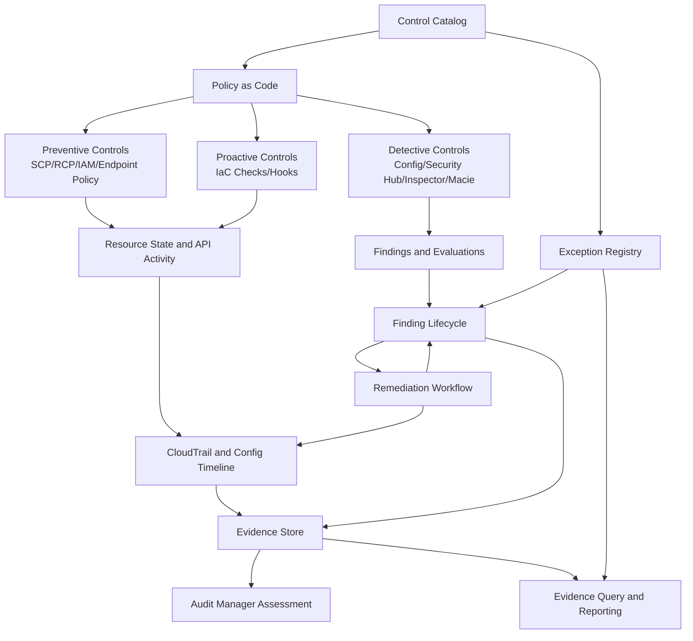
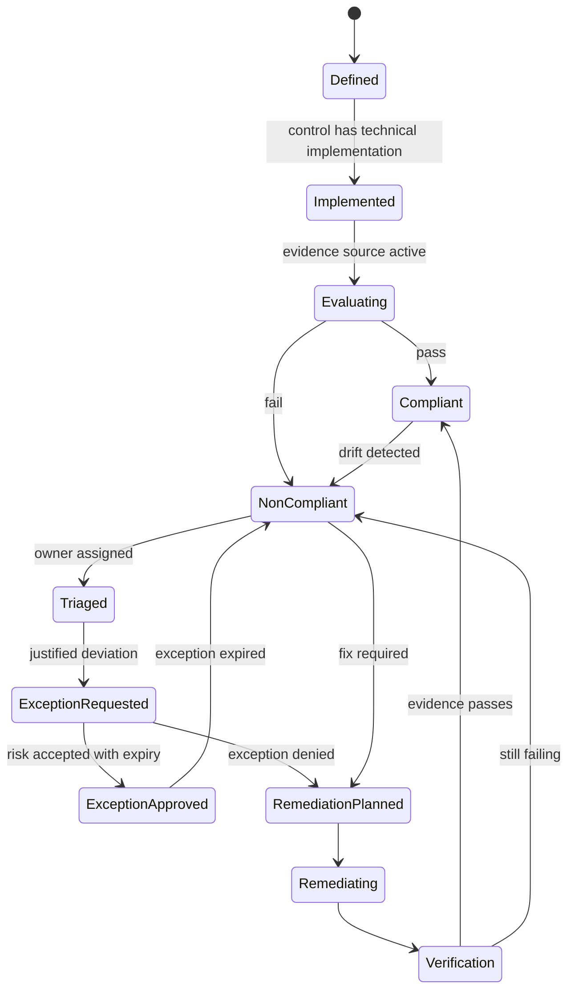
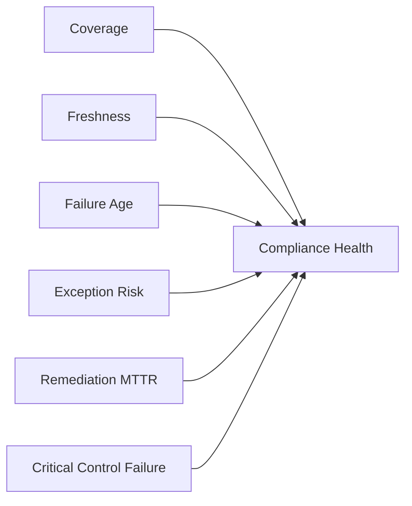
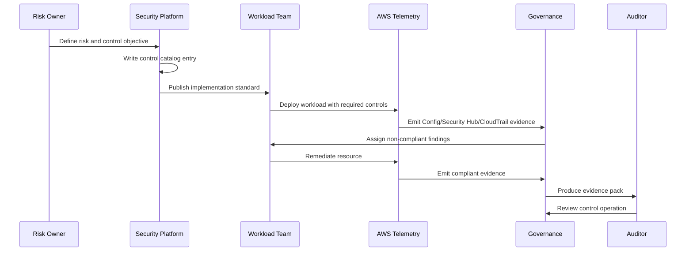

# Compliance as Engineering System

Compliance yang matang di cloud bukan kegiatan musiman menjelang audit. Compliance adalah sistem engineering yang terus berjalan: control didefinisikan sebagai kontrak, perubahan resource diamati, evidence dikumpulkan otomatis, exception punya masa berlaku, owner jelas, dan auditor bisa menelusuri bukti tanpa mengandalkan screenshot acak.

Di AWS, compliance yang defensible lahir dari integrasi beberapa lapisan yang sudah kita bangun di part sebelumnya:

1. **Organization boundary**: account, OU, SCP, RCP, delegated administrator.
2. **Identity boundary**: IAM, IAM Identity Center, permission boundary, workload identity.
3. **Audit boundary**: CloudTrail, AWS Config, log archive, CloudWatch Logs.
4. **Detection boundary**: GuardDuty, Security Hub, Inspector, Macie, Detective.
5. **Operations boundary**: Systems Manager, Incident Manager, Patch Manager, AWS Backup.
6. **Evidence boundary**: Audit Manager, reports, evidence finder, S3 evidence repository.

Mental model utama:

> Compliance is not proof that nothing bad can happen. Compliance is proof that the organization has defined controls, operates them consistently, detects deviation, handles exceptions, and can produce trustworthy evidence.

## 1. Kesalahan Umum: Compliance sebagai Checklist

Banyak organisasi memulai cloud compliance dengan spreadsheet:

| Control | Status | Evidence | Owner |
|---|---|---|---|
| S3 bucket must not be public | Compliant | Screenshot console | Security |
| MFA enabled for admin | Compliant | Screenshot IAM | Infra |
| Logs enabled | Compliant | Link CloudTrail | Platform |

Ini terlihat rapi, tetapi rapuh.

Masalahnya:

- Evidence sering **manual**, tidak repeatable.
- Screenshot tidak menunjukkan **scope account/region/resource**.
- Tidak ada bukti bahwa control berjalan **sepanjang periode audit**.
- Tidak ada korelasi antara finding, exception, remediation, dan approval.
- Owner sering organisasi, bukan sistem yang bisa dimintai pertanggungjawaban.
- Auditor melihat status, bukan control operation.

Checklist manual hanya menjawab pertanyaan “apakah pada saat itu terlihat benar?”. Engineering compliance harus menjawab pertanyaan yang lebih kuat:

- Control apa yang berlaku?
- Resource mana yang termasuk scope?
- Bagaimana control dievaluasi?
- Kapan terakhir dievaluasi?
- Apa yang terjadi jika control gagal?
- Siapa pemilik remediation?
- Exception mana yang disetujui?
- Evidence mana yang membuktikan control berjalan selama periode tertentu?

## 2. Definisi Operasional Compliance

Dalam konteks AWS production-grade, compliance adalah kemampuan untuk membuktikan lima hal:

| Dimensi | Pertanyaan | Contoh Evidence |
|---|---|---|
| Policy | Apa aturan yang berlaku? | Control catalog, SCP, Config rule, Security Hub standard, runbook |
| Implementation | Bagaimana aturan diterapkan? | Terraform/CDK, Control Tower control, IAM policy, KMS policy |
| Operation | Apakah control berjalan? | Config evaluation, Security Hub finding, CloudTrail event, CloudWatch alarm |
| Exception | Apakah deviasi disetujui? | Exception record, expiry date, risk acceptance, owner approval |
| Correction | Apakah deviasi diperbaiki? | Remediation ticket, SSM automation execution, Config compliant state |

Kata kuncinya adalah **evidence continuity**. Untuk audit, bukti satu hari sering tidak cukup. Yang dibutuhkan adalah bukti bahwa control tidak hanya ada, tetapi beroperasi sepanjang rentang waktu tertentu.

## 3. Control as Product

Control harus diperlakukan seperti produk internal.

Sebuah control production-grade memiliki:

- **Name**: nama stabil.
- **Objective**: risiko apa yang dikurangi.
- **Scope**: account, OU, region, resource type, workload criticality.
- **Policy statement**: aturan yang mudah dipahami manusia.
- **Technical implementation**: SCP, Config rule, Security Hub control, IAM policy, EventBridge automation, IaC check.
- **Evidence source**: CloudTrail, Config, Security Hub, Inspector, Macie, SSM, AWS Backup, Audit Manager.
- **Owner**: tim yang bertanggung jawab terhadap control operation.
- **Remediation owner**: tim yang memperbaiki resource gagal.
- **Exception model**: kapan boleh melanggar, siapa menyetujui, sampai kapan.
- **Metric**: pass rate, failure age, exception count, MTTR.
- **Runbook**: cara investigasi dan remediation.
- **Test plan**: cara membuktikan control benar-benar mendeteksi pelanggaran.

Contoh control sebagai produk:

```yaml
id: AWS-S3-001
name: S3 buckets must not allow public write access
risk: Unauthorized data modification or malware staging through public bucket access
control_type:
  - preventive
  - detective
  - responsive
scope:
  accounts: all-workload-accounts
  regions: all-enabled-regions
  resources:
    - AWS::S3::Bucket
implementation:
  preventive:
    - AWS Organizations SCP denying unsafe PutBucketPolicy except approved automation role
    - S3 Block Public Access baseline
  detective:
    - AWS Config rule: s3-bucket-public-write-prohibited
    - Security Hub control mapping
  responsive:
    - EventBridge route to remediation workflow
    - SSM Automation to enable Block Public Access
owner:
  control_owner: cloud-security-platform
  remediation_owner_source: resource tag OwnerTeam
exception:
  allowed: true
  max_duration_days: 30
  approver: data-security-lead
  required_fields:
    - business_justification
    - data_classification
    - compensating_controls
    - expiry_date
evidence:
  primary:
    - AWS Config evaluation result
    - Security Hub finding workflow history
  secondary:
    - CloudTrail PutBucketPolicy / PutPublicAccessBlock events
    - S3 bucket configuration snapshot
metrics:
  - compliance_rate
  - non_compliant_resource_age_p95
  - expired_exceptions
  - automated_remediation_success_rate
```

Control seperti ini bisa dioperasikan, diuji, diaudit, dan ditingkatkan.

## 4. Control Taxonomy: Preventive, Detective, Responsive, Recovery

Control cloud tidak cukup hanya satu jenis.

| Jenis Control | Fungsi | AWS Pattern |
|---|---|---|
| Preventive | Mencegah aksi buruk terjadi | SCP, RCP, IAM deny, permission boundary, endpoint policy |
| Proactive | Mencegah sebelum resource dibuat | IaC scanning, CloudFormation hook, CI policy check |
| Detective | Menemukan deviasi | AWS Config, Security Hub, GuardDuty, Inspector, Macie |
| Responsive | Mengurangi dampak setelah deviasi | EventBridge, Lambda, SSM Automation, ticketing |
| Recovery | Memulihkan kondisi aman | AWS Backup, restore runbook, rollback pipeline |
| Compensating | Mengurangi risiko saat control utama tidak bisa diterapkan | Monitoring tambahan, manual approval, shorter expiry, network isolation |

Jangan menilai control hanya dari “pass/fail”. Nilai control dari **risk reduction chain**.

Contoh: “EC2 instance tidak boleh menerima SSH dari internet”.

- Preventive: SCP melarang perubahan SG tertentu kecuali role pipeline.
- Detective: Config rule mendeteksi inbound `0.0.0.0/0:22`.
- Responsive: EventBridge mengirim finding ke owner dan menjalankan quarantine jika critical.
- Recovery: Restore SG dari known-good baseline.
- Evidence: Config evaluation, CloudTrail `AuthorizeSecurityGroupIngress`, Security Hub workflow, remediation execution.

Jika hanya punya detective control, organisasi masih bisa compliant secara dangkal, tetapi tidak resilient.

## 5. Architecture: Compliance Evidence Pipeline

Berikut arsitektur konseptual compliance-as-engineering di AWS.



Perhatikan loop-nya. Compliance bukan garis lurus menuju report. Compliance adalah sistem feedback:

1. Control catalog mendefinisikan aturan.
2. Policy-as-code menerapkan aturan.
3. AWS telemetry membuktikan state dan event.
4. Findings masuk lifecycle.
5. Remediation mengubah state.
6. Evidence store menyimpan bukti.
7. Audit report mengambil bukti dari sistem yang sama.

## 6. Control Catalog: Sumber Kebenaran Compliance

Control catalog adalah backbone compliance. Tanpa catalog, setiap tim akan membuat interpretasi sendiri.

Minimal field control catalog:

| Field | Tujuan |
|---|---|
| `control_id` | ID stabil lintas sistem |
| `control_name` | Nama manusiawi |
| `risk_statement` | Risiko yang dikurangi |
| `control_objective` | Tujuan kontrol |
| `control_type` | Preventive/detective/responsive/recovery |
| `scope` | Account, OU, region, resource type |
| `implementation_refs` | Policy, IaC module, Config rule, Security Hub control |
| `evidence_refs` | Sumber bukti utama |
| `owner_team` | Tim pemilik control |
| `remediation_sla` | SLA berdasarkan severity |
| `exception_allowed` | Ya/tidak |
| `exception_max_age` | Durasi maksimum exception |
| `audit_mapping` | SOC2, ISO, PCI, internal policy, etc. |
| `test_method` | Cara menguji control |

Contoh struktur repository:

```text
compliance-controls/
  controls/
    AWS-IAM-001-no-long-lived-admin-keys.yaml
    AWS-S3-001-no-public-write.yaml
    AWS-KMS-001-key-admin-usage-separation.yaml
    AWS-LOG-001-org-trail-enabled.yaml
  mappings/
    soc2/
      cc6.yaml
      cc7.yaml
    iso27001/
      annex-a.yaml
    internal/
      cloud-security-standard.yaml
  evidence-schemas/
    config-evaluation.schema.json
    securityhub-finding.schema.json
    cloudtrail-event.schema.json
  exceptions/
    approved-exception.schema.json
  tests/
    control-unit-tests/
    integration-tests/
```

Control catalog harus versioned. Saat control berubah, perubahan itu juga evidence.

## 7. Mapping Control ke Framework

Audit framework seperti SOC 2, ISO 27001, PCI DSS, HIPAA, atau internal regulatory control biasanya berbicara dalam bahasa risiko dan proses, bukan bahasa AWS service. Engineering perlu membuat translation layer.

Contoh mapping:

| Framework Requirement | Cloud Control | AWS Implementation | Evidence |
|---|---|---|---|
| Access restricted to authorized users | Human admin access must use federation and MFA | IAM Identity Center permission sets, no IAM users for admins | IAM Identity Center assignments, CloudTrail AssumeRole, access review records |
| Changes are logged and monitored | All management API events logged org-wide | Organization CloudTrail multi-region trail | CloudTrail delivery, S3 log files, log validation |
| Vulnerabilities are identified and remediated | Workloads must be continuously scanned | Inspector EC2/ECR/Lambda scanning | Inspector findings, remediation tickets, closure timestamps |
| Sensitive data is protected | S3 sensitive data discovered and classified | Macie automated discovery/jobs | Macie findings, classification result, owner remediation |
| Systems are backed up and recoverable | Critical resources have backup and restore tests | AWS Backup policies, restore testing | Backup job status, restore test result, vault config |

Mapping yang buruk berbunyi: “SOC 2 CC6 = Security Hub enabled.”

Mapping yang baik berbunyi:

> SOC 2 CC6 requires logical access controls. In AWS, this is implemented through IAM Identity Center federation, permission sets, MFA enforcement through IdP, SCP guardrails preventing IAM user creation for administrators, CloudTrail evidence of AssumeRole, and quarterly access review records.

## 8. Evidence Is a Data Product

Evidence harus diperlakukan sebagai data product.

Kualitas evidence ditentukan oleh:

| Kualitas | Pertanyaan |
|---|---|
| Completeness | Apakah semua account/region/resource masuk scope? |
| Accuracy | Apakah evidence menggambarkan state/event yang benar? |
| Timeliness | Apakah evidence cukup baru? |
| Integrity | Apakah evidence terlindung dari perubahan tidak sah? |
| Traceability | Apakah evidence bisa ditelusuri ke control dan resource? |
| Explainability | Apakah reviewer bisa memahami maknanya? |
| Retention | Apakah evidence tersedia selama periode audit/legal? |

Contoh evidence yang buruk:

```text
Screenshot console Security Hub tanggal 1 Januari.
```

Contoh evidence yang lebih baik:

```yaml
evidence_id: ev-2026-07-06-aws-log-001
control_id: AWS-LOG-001
source: cloudtrail
resource_scope:
  organization_id: o-example
  accounts: all
  regions: all-enabled
period:
  from: 2026-06-01T00:00:00Z
  to: 2026-06-30T23:59:59Z
assertion:
  organization_trail_enabled: true
  multi_region: true
  log_file_validation: true
  destination_bucket: central-log-archive
supporting_artifacts:
  - cloudtrail_describe_trails_response.json
  - cloudtrail_get_trail_status_response.json
  - s3_log_delivery_sample_manifest.json
  - kms_key_policy_snapshot.json
review_status: accepted
reviewer: security-governance
```

## 9. Compliance State Machine

Compliance harus punya state machine yang eksplisit.



Tanpa state machine, status compliance cenderung menjadi label statis. Dengan state machine, compliance menjadi operasi yang bisa dipantau.

## 10. Exception Governance

Exception bukan celah. Exception adalah mekanisme formal untuk mengelola risiko yang belum bisa dihilangkan.

Exception yang sehat punya:

- Control ID.
- Resource ID atau scope.
- Business justification.
- Risk statement.
- Compensating controls.
- Expiry date.
- Approver.
- Owner.
- Review cadence.
- Evidence of approval.
- Auto-expiry behavior.

Contoh exception record:

```yaml
exception_id: EXC-2026-0042
control_id: AWS-NET-003
resource:
  account_id: "111122223333"
  region: ap-southeast-1
  type: AWS::EC2::SecurityGroup
  id: sg-0123456789abcdef0
violation: inbound 0.0.0.0/0 tcp/443 on temporary migration endpoint
business_justification: partner migration endpoint required for 14 days
risk: internet-facing endpoint increases attack surface
compensating_controls:
  - AWS WAF allowlist rule
  - CloudWatch alarm on 5xx spike
  - GuardDuty monitored account
  - access log review daily
approved_by: cloud-security-lead
owner_team: migration-platform
created_at: 2026-07-06
expires_at: 2026-07-20
status: approved
```

Anti-pattern exception:

- “Permanent exception.”
- “Approved by same engineer who owns resource.”
- “No expiry.”
- “No compensating control.”
- “Exception attached to broad OU without resource list.”
- “Exception only exists in chat message.”

## 11. Compliance Metrics That Matter

Compliance dashboard tidak boleh hanya menampilkan jumlah pass/fail. Jumlah fail tidak selalu menggambarkan risiko.

Metric yang lebih berguna:

| Metric | Makna |
|---|---|
| Control coverage | Persentase resource/account/region yang masuk scope evaluasi |
| Evidence freshness | Usia evidence terakhir per control |
| Non-compliant age p95 | Seberapa lama deviasi bertahan |
| Critical control failure count | Deviasi pada control paling penting |
| Exception count by age | Risiko yang diterima dan mendekati expiry |
| Expired exception count | Deviasi yang sudah tidak sah |
| Remediation MTTR | Kecepatan memperbaiki deviasi |
| Auto-remediation success rate | Efektivitas automation |
| Reopen rate | Kualitas remediation |
| Ownerless finding count | Kegagalan ownership model |

Contoh dashboard compliance yang lebih matang:



## 12. Compliance Coverage Model

Pertanyaan audit paling berbahaya sering sederhana:

> Bagaimana Anda tahu semua resource yang relevant sudah dievaluasi?

Untuk menjawabnya, compliance system harus punya coverage model.

Coverage bukan hanya “Config enabled”. Coverage berarti:

- Semua account in-scope terdaftar di Organizations.
- Semua OU in-scope punya baseline controls.
- Semua region yang boleh dipakai dimonitor.
- Region yang tidak boleh dipakai diblokir atau dimonitor untuk unauthorized usage.
- Semua resource type kritis didukung evidence source.
- Resource ephemeral tetap masuk observability window.
- Account baru otomatis enrolled.
- Account suspended/decommissioned punya evidence retention.

Contoh coverage assertion:

```yaml
control_id: AWS-COVERAGE-001
assertions:
  organization_accounts_discovered: true
  active_accounts_enrolled_in_cloudtrail: true
  active_accounts_enrolled_in_config: true
  securityhub_central_configuration_applied: true
  guardduty_enabled_all_regions: true
  macie_enabled_for_data_accounts: true
  inspector_enabled_for_compute_accounts: true
  backup_policy_attached_to_critical_ous: true
exceptions:
  - account_id: "444455556666"
    reason: suspended account
    evidence_retention: retained_in_log_archive
```

## 13. Policy as Code for Compliance

Policy-as-code adalah cara membuat control bisa diuji sebelum dan sesudah deploy.

Ada empat lapisan policy-as-code:

| Lapisan | Tujuan | Contoh |
|---|---|---|
| Pre-commit | Mencegah template buruk masuk repo | lint, static checks |
| CI/CD | Block merge/deploy jika melanggar | OPA/conftest, Checkov, cfn-guard, custom tests |
| Cloud preventive | Mencegah API call buruk | SCP, IAM deny, endpoint policy |
| Cloud detective | Menemukan drift di runtime | Config rule, Security Hub, custom scanner |

Control yang hanya ada di CI/CD tidak cukup, karena resource bisa dibuat di luar pipeline. Control yang hanya ada di runtime juga tidak cukup, karena deviasi sudah terjadi. Keduanya harus berjalan bersama.

Contoh strategi:

```text
Rule: S3 bucket with regulated data must use customer-managed KMS key.

Pre-deploy:
- IaC check rejects bucket without kms_key_id.

Deploy-time:
- Permission boundary denies creating regulated bucket without required tags.

Runtime:
- Config custom rule checks encryption configuration.

Evidence:
- IaC policy test result.
- Config evaluation.
- CloudTrail PutBucketEncryption event.
- KMS key policy snapshot.
```

## 14. Auditability of the Compliance System Itself

Compliance system juga harus diaudit.

Pertanyaan penting:

- Siapa bisa mengubah control catalog?
- Siapa bisa menonaktifkan Config rule?
- Siapa bisa suppress Security Hub finding?
- Siapa bisa approve exception?
- Siapa bisa mengubah evidence bucket policy?
- Siapa bisa menghapus evidence?
- Siapa bisa mengubah mapping framework?
- Apakah perubahan control catalog punya peer review?
- Apakah suppression dan exception dipantau?

Minimum guardrails:

| Asset | Guardrail |
|---|---|
| Control repository | branch protection, code owner, signed commits if needed |
| Evidence S3 bucket | versioning, Object Lock where required, restricted write/delete |
| Audit Manager delegated admin | limited group, MFA, CloudTrail alert |
| Security Hub suppression | approval workflow, expiry, review report |
| Config rule changes | CloudTrail alert, SCP protection for baseline controls |
| Exception registry | immutable history, expiry enforcement |

## 15. Compliance Workflow End-to-End

Berikut alur satu control dari desain sampai audit.



## 16. Designing for Regulatory Defensibility

Regulatory defensibility bukan sekadar “kami memakai AWS service X”. Yang harus bisa dijelaskan:

1. **Control intent**: mengapa control ada.
2. **Implementation correctness**: bagaimana control diterapkan.
3. **Scope completeness**: apa yang tercakup dan tidak tercakup.
4. **Operational consistency**: control berjalan terus, bukan hanya saat audit.
5. **Exception discipline**: deviasi disetujui, dibatasi, dan dipantau.
6. **Remediation effectiveness**: gagal diperbaiki dan diverifikasi.
7. **Evidence integrity**: bukti tidak mudah diubah oleh pihak yang diaudit.

Contoh kalimat defensible:

> All production accounts are enrolled through the account vending process. The baseline automatically enables organization CloudTrail, AWS Config, Security Hub, GuardDuty, and required Config conformance packs. Control AWS-LOG-001 is evaluated by Config and validated by CloudTrail status checks. Evidence is collected into the log archive and Audit Manager assessment. Exceptions require security approval and expire automatically.

Kalimat yang tidak defensible:

> We enable logging in AWS.

## 17. Compliance Anti-Patterns

### 17.1 Screenshot-Driven Audit

Screenshot tidak cukup untuk continuous control. Screenshot bisa membantu reviewer memahami konteks, tetapi bukan sumber evidence utama.

### 17.2 Control Without Owner

Control tanpa owner akan menjadi finding tanpa perbaikan.

### 17.3 Framework-First Design

Jika mulai dari framework eksternal tanpa memahami risiko sistem, control menjadi banyak tetapi tidak efektif.

Mulai dari risk model, lalu mapping ke framework.

### 17.4 Over-Automated Remediation

Tidak semua finding harus auto-remediate. Beberapa remediation bisa merusak produksi.

Gunakan safety ladder:

1. Notify only.
2. Tag and ticket.
3. Safe config correction.
4. Containment.
5. Destructive action with approval.

### 17.5 Permanent Exception Culture

Exception permanen adalah policy baru yang tidak diberi governance.

### 17.6 Audit Tool as Source of Truth

Audit Manager atau dashboard bukan source of truth tunggal. Source of truth tetap control catalog, AWS telemetry, evidence store, dan approval records.

## 18. Implementation Roadmap

### Phase 1: Define Controls

- Buat control catalog minimal untuk identity, logging, encryption, public exposure, backup, vulnerability, incident response.
- Setiap control harus punya owner dan evidence source.
- Prioritaskan control yang mengurangi risiko paling besar.

### Phase 2: Establish Coverage

- Pastikan semua account in-scope ada di Organizations.
- Aktifkan organization CloudTrail.
- Aktifkan AWS Config aggregator.
- Aktifkan Security Hub central configuration.
- Aktifkan GuardDuty delegated admin.
- Tentukan region allowlist.

### Phase 3: Automate Evidence

- Mapping control ke Config/Security Hub/CloudTrail/Inspector/Macie/Backup.
- Buat evidence schema.
- Kumpulkan evidence ke log archive atau evidence account.
- Buat report per control.

### Phase 4: Finding Lifecycle

- Route findings ke owner.
- Definisikan SLA.
- Buat exception workflow.
- Buat remediation playbook.
- Ukur MTTR dan reopen rate.

### Phase 5: Audit Manager Integration

- Buat custom framework jika framework standar tidak cukup.
- Gunakan common controls/core controls jika sesuai.
- Hubungkan evidence source otomatis.
- Gunakan evidence finder untuk review.
- Generate report hanya setelah evidence direview.

## 19. Minimum Viable Compliance Platform

Untuk organisasi yang belum matang, jangan mulai dengan 200 control. Mulai dengan 20 control yang kuat.

Contoh baseline:

| Area | Minimum Control |
|---|---|
| Account | Semua account dibuat via account vending process |
| Root | Root usage monitored dan root access key forbidden |
| Human access | Admin access via federation, MFA, temporary session |
| Logging | Organization CloudTrail multi-region enabled |
| Config | AWS Config enabled untuk all supported resources |
| Security Hub | Foundational Security Best Practices enabled |
| GuardDuty | Enabled all accounts/regions |
| S3 | Block public access baseline |
| KMS | Key admin dan key user dipisahkan |
| Secrets | Secrets tidak hardcoded, rotation for critical secrets |
| Vulnerability | Inspector enabled for compute/container/serverless where applicable |
| Backup | Critical resources under backup policy and restore tested |
| Incident | Critical alerts routed to incident response workflow |
| Exception | Exceptions require approval and expiry |
| Evidence | Evidence stored centrally with restricted access |

## 20. Practical Exercise

Ambil satu control: “Production S3 buckets containing confidential data must not be public and must use customer-managed KMS keys.”

Desain:

1. Control catalog entry.
2. Preventive guardrail.
3. Detective evidence source.
4. Remediation workflow.
5. Exception process.
6. Audit evidence package.
7. Metrics.
8. Test case untuk membuktikan control gagal saat bucket dibuat public.

Expected output:

```text
control-id: AWS-DATA-001
primary-evidence: Config evaluation + Macie classification + CloudTrail bucket policy events
owner: data-platform-security
remediation-sla: 24h critical, 72h high
exception-max-age: 14 days
```

## 21. Summary

Compliance-as-engineering berarti:

- Control adalah produk internal yang punya lifecycle.
- Evidence adalah data product yang harus complete, accurate, timely, traceable, dan protected.
- Exception adalah risk decision, bukan bypass informal.
- Audit report adalah hasil dari sistem yang berjalan terus, bukan dokumen yang dibuat menjelang audit.
- AWS services seperti Config, CloudTrail, Security Hub, Audit Manager, Systems Manager, Inspector, Macie, GuardDuty, dan AWS Backup adalah building blocks, bukan compliance strategy itu sendiri.

Seri berikutnya akan masuk ke AWS Audit Manager secara spesifik: framework, assessment, evidence collection, evidence finder, delegation, report generation, dan integrasi dengan control catalog.

## References

- AWS Audit Manager User Guide — https://docs.aws.amazon.com/audit-manager/latest/userguide/what-is.html
- Understanding how AWS Audit Manager collects evidence — https://docs.aws.amazon.com/audit-manager/latest/userguide/how-evidence-is-collected.html
- AWS Well-Architected Framework: Security Pillar — https://docs.aws.amazon.com/wellarchitected/latest/security-pillar/welcome.html
- AWS Cloud Adoption Framework: Governance Perspective — https://docs.aws.amazon.com/whitepapers/latest/aws-caf-governance-perspective/aws-caf-governance-perspective.html
- AWS Prescriptive Guidance: Security control types — https://docs.aws.amazon.com/prescriptive-guidance/latest/aws-security-controls/security-control-types.html
- AWS Config conformance packs — https://docs.aws.amazon.com/config/latest/developerguide/conformance-packs.html
- AWS Security Hub User Guide — https://docs.aws.amazon.com/securityhub/latest/userguide/what-is-securityhub.html
