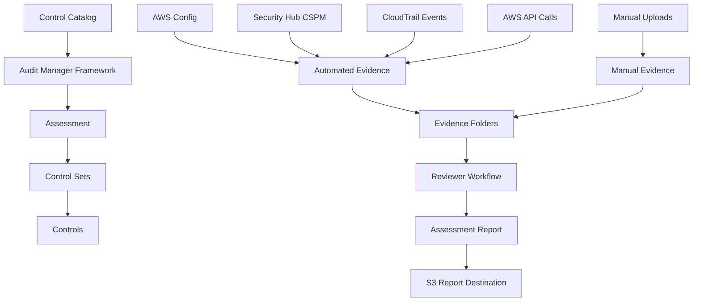
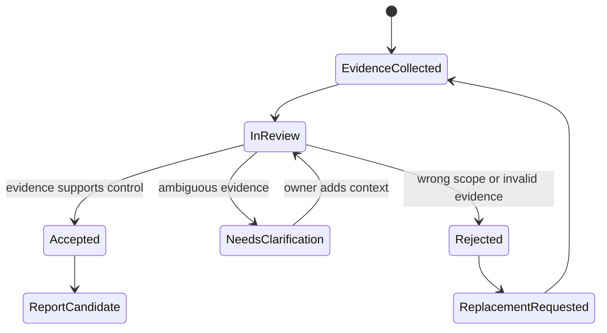
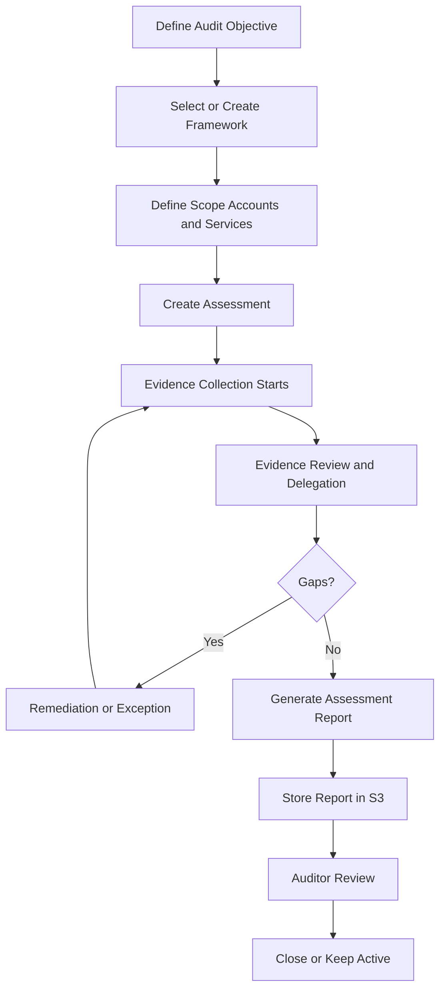
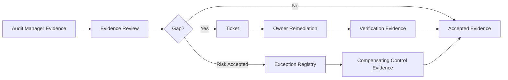

# Audit Manager and Evidence Collection

AWS Audit Manager adalah layanan untuk membantu mengaudit penggunaan AWS secara berkelanjutan, mengotomatisasi evidence collection, dan menyiapkan audit-ready reports. Tetapi di organisasi engineering yang matang, Audit Manager bukan “alat ajaib untuk lulus audit”. Ia adalah **evidence orchestration layer** di atas control catalog, AWS telemetry, resource assessment, reviewer workflow, dan report packaging.

Part ini membahas cara menggunakan Audit Manager sebagai bagian dari compliance engineering system yang sudah kita bangun di Part 069.

Mental model:

> Audit Manager is not the source of control truth. It is the system that maps controls to AWS evidence sources, collects evidence for active assessments, supports review/delegation, and packages evidence into reports.

## 1. Posisi Audit Manager dalam AWS Governance Stack

Audit Manager berada di atas beberapa evidence source:

- AWS Config evaluations.
- Security Hub CSPM checks.
- CloudTrail events.
- AWS API calls.
- Manual uploads.
- Framework/control mappings.

Ia tidak menggantikan:

- AWS Config sebagai configuration timeline.
- CloudTrail sebagai API audit log.
- Security Hub sebagai finding correlation layer.
- Control catalog sebagai definisi internal control.
- Ticketing system sebagai remediation lifecycle.
- Log archive sebagai evidence custody boundary.

Perannya adalah menghubungkan control dengan evidence yang dapat direview.



## 2. Core Concepts

| Concept | Makna Operasional |
|---|---|
| Framework | Template control structure untuk standar audit atau internal policy |
| Custom framework | Framework yang dibuat organisasi untuk kebutuhan spesifik |
| Assessment | Instans aktif dari framework untuk scope account/service tertentu |
| Control set | Kelompok controls dalam framework/assessment |
| Control | Persyaratan yang dievaluasi dan membutuhkan evidence |
| Evidence | Data yang dikumpulkan untuk mendukung control |
| Evidence folder | Organisasi evidence dalam assessment |
| Assessment report | Report yang berisi ringkasan assessment dan link evidence folders |
| Delegation | Penugasan review control kepada subject matter owner |
| Evidence finder | Fitur pencarian/query evidence lintas assessment/account jika dikonfigurasi |

Perbedaan paling penting:

- **Framework** adalah template.
- **Assessment** adalah proses audit aktif.
- **Control** adalah requirement.
- **Evidence** adalah bukti.
- **Report** adalah packaging akhir, bukan sumber kebenaran.

## 3. Audit Manager Operating Model

Audit Manager sebaiknya dioperasikan oleh governance/security assurance team, bukan workload team.

Recommended ownership:

| Area | Owner |
|---|---|
| Audit Manager delegated admin | Security governance / cloud compliance team |
| Framework definition | Governance + security platform + risk owner |
| Control evidence mapping | Security platform + control owner |
| Evidence review | Control owner / delegated SME |
| Manual evidence upload | Process owner |
| Report generation | Audit/compliance owner |
| Remediation | Workload/platform owner |
| Exception approval | Risk owner / security governance |

Audit Manager harus terintegrasi dengan AWS Organizations. Untuk enterprise, gunakan delegated administrator agar assessment dan evidence search bisa berjalan lintas member accounts sesuai model governance.

## 4. Assessment Scope Design

Kesalahan umum adalah membuat satu assessment besar untuk semua hal.

Assessment harus dirancang berdasarkan:

- Framework/regulation.
- Business unit.
- Environment.
- Workload criticality.
- Audit period.
- Account/OU scope.
- Evidence volume.
- Reviewer model.

Contoh assessment design:

| Assessment | Scope | Tujuan |
|---|---|---|
| `SOC2-Production-2026-H1` | Prod OUs | SOC 2 evidence untuk production systems |
| `PCI-Cardholder-Data-Env-2026-Q3` | PCI accounts only | PCI scoped workload |
| `Internal-Cloud-Security-Baseline-Monthly` | All active workload accounts | Internal baseline assurance |
| `Regulated-Data-Platform-2026` | Data platform accounts | Data protection and access controls |
| `Backup-Restore-Readiness-Q2` | Critical workloads | Backup and recovery evidence |

Prinsip:

> Scope kecil yang jelas lebih defensible daripada scope besar yang ambigu.

## 5. Framework Strategy

Audit Manager menyediakan prebuilt frameworks untuk berbagai standar dan best practice. Tetapi banyak organisasi perlu custom framework.

Gunakan framework standar ketika:

- Regulasi/standard sesuai langsung dengan kebutuhan audit.
- Control mapping bawaan cukup.
- Auditor menerima struktur standar.
- Anda masih membangun maturity awal.

Gunakan custom framework ketika:

- Anda punya internal cloud security standard.
- Ada regulatory requirement spesifik industri.
- Anda ingin mapping control ke control catalog internal.
- Anda perlu menggabungkan evidence AWS dengan process evidence non-AWS.
- Anda ingin control ID stabil sesuai taxonomy organisasi.

Contoh framework structure:

```yaml
framework: Internal AWS Security Baseline v1
control_sets:
  - name: Identity and Access Management
    controls:
      - AWS-IAM-001: Human admin access must use federation
      - AWS-IAM-002: Root user must be protected and monitored
      - AWS-IAM-003: No long-lived admin access keys
  - name: Logging and Monitoring
    controls:
      - AWS-LOG-001: Organization CloudTrail must be enabled
      - AWS-LOG-002: AWS Config must be enabled
      - AWS-MON-001: Critical workload alarms must be configured
  - name: Data Protection
    controls:
      - AWS-DATA-001: Confidential S3 buckets must not be public
      - AWS-KMS-001: KMS key admin and usage must be separated
      - AWS-SECRET-001: Critical secrets must be stored and rotated
```

## 6. Evidence Types

Audit Manager automated evidence dapat berasal dari beberapa source category, termasuk AWS Config Rules, Security Hub CSPM checks, AWS API calls, dan CloudTrail events. Manual evidence bisa ditambahkan untuk process controls yang tidak sepenuhnya terlihat dari AWS telemetry.

| Evidence Type | Cocok Untuk | Contoh |
|---|---|---|
| AWS Config | Resource compliance state | S3 encryption, public access, CloudTrail enabled |
| Security Hub CSPM | Security posture checks | FSBP controls, CIS controls, failed checks |
| CloudTrail event | API activity proof | root usage, policy change, trail modification |
| AWS API call | Current configuration snapshot | DescribeTrails, GetBucketEncryption |
| Manual evidence | Process/procedure proof | access review sign-off, incident postmortem, policy document |

Jangan paksa semua control menjadi automated evidence. Beberapa control memang process-driven:

- Quarterly access review.
- Security training completion.
- Incident postmortem approval.
- Vendor risk review.
- Risk acceptance sign-off.

Yang penting adalah setiap manual evidence punya schema, owner, expiry, dan review status.

## 7. Evidence Collection Frequency

Evidence freshness harus dipahami. Audit Manager evidence collection bergantung pada data source type. Beberapa evidence mengikuti perubahan resource atau periodic checks, beberapa membutuhkan API calls, beberapa manual.

Karena itu, jangan asumsikan semua evidence real-time.

Design rule:

| Control Criticality | Evidence Freshness Target |
|---|---|
| Critical preventive/detective control | Minutes to hours |
| High-risk posture control | Daily |
| Standard configuration control | Daily/weekly depending source |
| Process control | Per audit period or policy cadence |
| Manual attestation | Before report generation |

Jika auditor bertanya “apakah control ini compliant sepanjang bulan?”, evidence satu snapshot akhir bulan tidak cukup. Anda perlu kombinasi:

- Config evaluation history.
- CloudTrail events.
- Security Hub finding workflow.
- Exception registry.
- Remediation timestamps.

## 8. Evidence Folder and Evidence Review

Evidence yang terkumpul otomatis belum otomatis “baik”. Evidence harus direview.

Reviewer harus mengecek:

- Apakah evidence sesuai control?
- Apakah resource scope benar?
- Apakah account/region benar?
- Apakah evidence period sesuai audit period?
- Apakah status compliant/non-compliant masuk akal?
- Apakah exception sudah tercatat?
- Apakah remediation evidence tersedia?
- Apakah ada evidence yang stale?

Review workflow:



## 9. Delegation Model

Audit review tidak boleh semuanya jatuh ke security team. Security team biasanya tidak tahu detail semua workload dan process.

Gunakan delegation:

| Control Area | Reviewer |
|---|---|
| IAM federation | Identity platform team |
| CloudTrail/log archive | Security platform team |
| Backup/restore | Platform reliability team |
| Vulnerability remediation | Workload owner + security engineer |
| Incident response | Incident management owner |
| Data classification | Data governance owner |
| Patch compliance | Fleet operations owner |
| Access review | Business system owner |

Delegation bukan lempar tanggung jawab. Governance team tetap accountable untuk audit package, tetapi control owner harus memberi review konteks.

## 10. Designing Audit Manager Controls from Internal Control Catalog

Control catalog internal harus menjadi input ke Audit Manager custom framework.

Mapping contoh:

```yaml
internal_control:
  id: AWS-LOG-001
  name: Organization CloudTrail must be enabled
  objective: All management API activities must be logged across organization accounts and regions.
  owner: cloud-security-platform
  evidence_sources:
    - cloudtrail:GetTrailStatus
    - cloudtrail:DescribeTrails
    - config:cloudtrail-enabled
    - cloudtrail:UpdateTrail events

audit_manager_control:
  name: AWS-LOG-001 Organization CloudTrail Enabled
  control_set: Logging and Monitoring
  data_sources:
    - type: AWS_API_CALL
      source: cloudtrail
    - type: AWS_CONFIG_RULE
      source: cloudtrail-enabled
    - type: AWS_CLOUDTRAIL_EVENT
      source: UpdateTrail/DeleteTrail/StopLogging
  manual_evidence_required:
    - log_retention_policy_review
    - exception_register_export
```

Control yang baik menggabungkan configuration evidence dan activity evidence.

Contoh:

- Config/API call membuktikan CloudTrail saat ini enabled.
- CloudTrail event membuktikan apakah ada attempt memodifikasi/menonaktifkan trail.
- Exception registry membuktikan deviasi disetujui atau tidak.

## 11. Assessment Lifecycle

Lifecycle assessment production-grade:



Poin penting: assessment aktif mulai mengumpulkan evidence. Jika audit period sudah dimulai tetapi assessment belum dibuat, Anda mungkin kehilangan collection window di Audit Manager walaupun telemetry mentah masih ada di CloudTrail/Config/Security Hub.

## 12. Report Generation Strategy

Assessment report bukan semua evidence mentah. Report harus dikurasi.

Report yang baik:

- Menyatakan audit period.
- Menyatakan scope account/OU/region/service.
- Menjelaskan framework dan control set.
- Menyertakan accepted evidence.
- Menjelaskan non-compliance dan remediation.
- Menyertakan exception summary.
- Menunjukkan reviewer/approval.
- Menyimpan output di S3 destination yang terlindung.

Jangan generate report sebelum evidence direview. Report yang penuh evidence salah akan membingungkan auditor dan memperbesar beban klarifikasi.

## 13. Evidence Finder

Evidence Finder berguna untuk mencari evidence tanpa menelusuri nested folder secara manual. Untuk delegated administrator, evidence finder dapat membantu mencari evidence lintas member accounts dalam organization jika fitur dan konfigurasi mendukung.

Use case:

- Cari semua evidence untuk control tertentu.
- Cari evidence non-compliant pada periode tertentu.
- Cari evidence by account/resource.
- Cari evidence yang berasal dari Security Hub fail.
- Cari evidence untuk satu audit inquiry.

Contoh query mindset:

```text
Show all evidence for control AWS-S3-001 in production accounts between 2026-04-01 and 2026-06-30 where compliance status is NON_COMPLIANT.
```

Evidence finder harus diperlakukan sebagai query interface, bukan satu-satunya repository evidence. Evidence retention dan custody tetap harus dirancang.

## 14. Manual Evidence Governance

Manual evidence adalah titik lemah kalau tidak distandarkan.

Manual evidence harus punya:

- File naming convention.
- Control ID.
- Assessment ID.
- Audit period.
- Owner.
- Reviewer.
- Source system.
- Export timestamp.
- Integrity hash jika diperlukan.
- Expiry/review date.

Contoh naming:

```text
AWS-IAM-004_access-review_prod_2026-Q2_approved_2026-07-02.pdf
AWS-IR-001_incident-game-day_report_2026-H1_signed.pdf
AWS-BCP-002_restore-test_results_critical-workloads_2026-Q2.csv
```

Manual evidence anti-pattern:

- Screenshot tanpa timestamp.
- Export tanpa filter/scope.
- PDF policy tanpa approval history.
- Spreadsheet tanpa owner.
- Evidence yang tidak menyebut control ID.
- Evidence diunggah setelah audit tanpa trace asal.

## 15. Handling Non-Compliant Evidence

Non-compliant evidence bukan selalu kegagalan audit. Yang penting adalah bagaimana organisasi menanganinya.

Untuk setiap non-compliance:

1. Validasi apakah evidence benar.
2. Identifikasi resource dan owner.
3. Klasifikasi severity berdasarkan risk, exposure, data sensitivity, exploitability.
4. Cek apakah exception valid.
5. Jika tidak ada exception, buat remediation task.
6. Setelah remediation, kumpulkan verification evidence.
7. Tulis narrative singkat jika masuk audit report.

Contoh narrative:

```text
Control AWS-S3-001 had three non-compliant findings during the audit period. Two were test buckets in non-production accounts and were remediated automatically within 15 minutes. One production bucket had an approved exception EXC-2026-0042 due to partner migration and expired on 2026-07-20. Compensating controls included WAF allowlist, CloudTrail monitoring, and daily owner review. Verification evidence shows the bucket returned to compliant state after migration.
```

Narrative seperti ini jauh lebih defensible daripada menyembunyikan finding.

## 16. Integration with Security Hub and Config

Audit Manager evidence dari Security Hub dan Config perlu dipahami status semantics-nya.

- AWS Config memberi compliance evaluation per rule/resource.
- Security Hub CSPM memberi finding/check status dan workflow.
- Audit Manager mengumpulkan evidence berdasarkan data source mapping.

Jangan samakan semua status:

| System | Status Concept | Makna |
|---|---|---|
| Config | COMPLIANT / NON_COMPLIANT / NOT_APPLICABLE | Evaluasi rule terhadap resource |
| Security Hub | PASSED / FAILED / WARNING / NOT_AVAILABLE | Status check/finding/security control |
| Security Hub Workflow | NEW / NOTIFIED / SUPPRESSED / RESOLVED | Lifecycle treatment finding |
| Audit Manager | Evidence compliance check | Evidence classification berdasarkan source |

Contoh risiko salah tafsir:

- Security Hub finding `SUPPRESSED` bukan berarti resource aman. Itu berarti finding dikecualikan dari workflow tertentu.
- Config `NOT_APPLICABLE` bukan bukti compliance; bisa berarti resource tidak masuk rule scope.
- Audit Manager evidence yang terkumpul otomatis tetap perlu review konteks.

## 17. Report Destination and Evidence Custody

Assessment report disimpan ke S3 bucket destination. Desain bucket ini penting.

Recommended controls:

- Dedicated evidence/report bucket.
- Server-side encryption dengan KMS key yang dikontrol governance team.
- Bucket policy least privilege.
- Versioning enabled.
- Object Lock jika requirement audit/legal mengharuskan immutability.
- CloudTrail data events untuk bucket jika sensitive.
- Lifecycle policy sesuai retention.
- Access logging atau CloudTrail S3 data event.
- Explicit deny insecure transport.
- Explicit deny delete oleh non-break-glass role.

Contoh bucket policy invariant:

```text
Only Audit Manager service role and compliance report role can write reports.
Only approved audit reviewer roles can read.
No one except controlled break-glass role can delete.
All access must use TLS.
Objects must be encrypted with approved KMS key.
```

## 18. Designing Evidence for Multi-Account AWS

Multi-account evidence harus menjawab:

- Dari account mana evidence berasal?
- Dari OU mana account itu?
- Region apa?
- Resource apa?
- Apakah account active/suspended/transitional?
- Apakah account masuk scope audit?
- Apakah ada delegated admin?

Gunakan metadata account registry:

```yaml
account_id: "111122223333"
account_name: prod-payments
ou_path: /workloads/production/regulated
owner_team: payments-platform
business_owner: payments-risk
criticality: tier-0
data_classification: regulated
security_baseline: strict
in_audit_scope:
  soc2: true
  pci: true
  internal_cloud_baseline: true
```

Tanpa account metadata, auditor sulit memahami apakah evidence “missing” atau memang out-of-scope.

## 19. Custom Framework Design Pattern

Contoh custom framework internal:

```yaml
framework_name: Internal AWS Production Security Baseline v1
framework_description: Baseline controls for production AWS accounts and workloads.
control_sets:
  - name: Account Governance
    controls:
      - AWS-ORG-001
      - AWS-ORG-002
      - AWS-ROOT-001
  - name: Identity and Access
    controls:
      - AWS-IAM-001
      - AWS-IAM-002
      - AWS-IAM-003
  - name: Logging and Evidence
    controls:
      - AWS-LOG-001
      - AWS-LOG-002
      - AWS-CONFIG-001
  - name: Data Protection
    controls:
      - AWS-KMS-001
      - AWS-S3-001
      - AWS-SECRETS-001
  - name: Detection and Response
    controls:
      - AWS-GD-001
      - AWS-SH-001
      - AWS-IR-001
  - name: Resilience and Recovery
    controls:
      - AWS-BACKUP-001
      - AWS-RESTORE-001
```

Control set harus mengikuti cara auditor berpikir, bukan cara AWS console mengelompokkan service.

## 20. Audit Inquiry Handling

Audit inquiry biasanya datang dalam bentuk pertanyaan, bukan query teknis.

Contoh:

> Show that administrative access to production AWS accounts is restricted and reviewed.

Evidence pack:

- IAM Identity Center permission sets for production accounts.
- Account assignments by group.
- IdP MFA policy evidence.
- CloudTrail `AssumeRole` sample events.
- SCP preventing IAM user creation for admin access.
- Access review approval report for period.
- Exception list.
- Offboarding evidence if applicable.

Contoh lain:

> Show that logging cannot be disabled by workload teams.

Evidence pack:

- Organization CloudTrail configuration.
- SCP denying `cloudtrail:StopLogging` and `cloudtrail:DeleteTrail` except security automation role.
- CloudTrail event query showing no unauthorized disablement.
- Config evaluation for CloudTrail enabled.
- Log archive bucket policy.
- KMS key policy for logs.

Audit Manager membantu mengemas evidence, tetapi narrative tetap perlu engineering clarity.

## 21. Common Failure Modes

### 21.1 Assessment Scope Tidak Lengkap

Account baru dibuat, tetapi tidak masuk assessment. Solusi: integrasi account vending dengan Audit Manager scope atau assessment registry.

### 21.2 Evidence Terlalu Banyak

Audit report berisi ribuan evidence item tanpa kurasi. Solusi: review, filter, grouping, summary narrative.

### 21.3 Manual Evidence Tidak Konsisten

Setiap tim upload format berbeda. Solusi: manual evidence schema dan naming convention.

### 21.4 Finding Suppression Disalahartikan

Suppressed finding dianggap compliant. Solusi: report exception/suppression terpisah.

### 21.5 Control Mapping Tidak Stabil

Control ID berubah tiap audit. Solusi: versioned control catalog.

### 21.6 Evidence Tidak Menjawab Control

Control berbicara “access reviewed quarterly”, tetapi evidence hanya IAM role list. Solusi: tambah process evidence access review approval.

### 21.7 Report Dibuat Terlambat

Assessment baru dibuat menjelang audit sehingga automated collection tidak cukup. Solusi: assessment always-on untuk baseline controls.

## 22. Always-On Assessment Pattern

Untuk internal cloud baseline, gunakan always-on assessment.

Pattern:

- Assessment aktif sepanjang tahun.
- Evidence collection berjalan terus.
- Monthly governance review.
- Quarterly evidence package.
- Annual external audit report curated dari evidence yang sudah ada.

Keuntungan:

- Tidak panik menjelang audit.
- Evidence continuity lebih baik.
- Control drift cepat terlihat.
- Tim terbiasa memperbaiki non-compliance sebagai operasi rutin.

## 23. Audit Manager + Ticketing + Exception Registry

Audit Manager tidak menggantikan ticketing.

Integrasi ideal:



Ticket harus menyimpan:

- Control ID.
- Evidence ID.
- Resource ID.
- Severity.
- Owner.
- SLA.
- Remediation action.
- Verification evidence.
- Closure approver.

## 24. Practical Assessment Design: Production Security Baseline

Scope:

```yaml
assessment_id: INTERNAL-AWS-PROD-BASELINE-2026-Q3
framework: Internal AWS Production Security Baseline v1
accounts:
  ou_paths:
    - /workloads/production
    - /workloads/regulated
regions:
  - ap-southeast-1
  - us-east-1
  - eu-west-1
period:
  from: 2026-07-01
  to: 2026-09-30
report_destination: s3://central-audit-reports/prod-baseline/2026-q3/
reviewers:
  identity: identity-platform
  logging: cloud-security-platform
  data: data-security
  backup: platform-reliability
  incident: sre-leads
```

Control sample:

```yaml
control_id: AWS-ROOT-001
statement: Root user usage must be monitored and root access keys must not exist.
evidence_sources:
  automated:
    - CloudTrail root user events
    - IAM credential report API
    - Security Hub root account controls
  manual:
    - break-glass procedure review
    - root MFA custody attestation
reviewer: cloud-security-platform
```

## 25. Preparing for External Auditors

Auditors usually need both evidence and explanation.

Prepare:

- System description.
- AWS account/OU scope diagram.
- Control catalog export.
- Framework mapping document.
- Evidence index.
- Exception register.
- Non-compliance remediation summary.
- Access review summary.
- Incident summary.
- Backup/restore test summary.
- Change management process.

Do not expect auditors to infer AWS architecture from raw evidence. Provide narrative and traceability.

## 26. Evidence Pack Template

Reusable template:

```markdown
# Evidence Pack: <Control ID> <Control Name>

## Control Objective
<What risk this control reduces.>

## Scope
- Accounts:
- OUs:
- Regions:
- Resource types:
- Period:

## Implementation
- Preventive controls:
- Detective controls:
- Responsive controls:

## Evidence Summary
| Evidence ID | Source | Period | Status | Reviewer |
|---|---|---|---|---|

## Exceptions
| Exception ID | Resource | Reason | Expiry | Approver |
|---|---|---|---|---|

## Non-Compliance and Remediation
| Resource | Finding | Opened | Closed | Verification Evidence |
|---|---|---|---|---|

## Reviewer Conclusion
<Accepted / accepted with exceptions / remediation required.>
```

## 27. Security Controls for Audit Manager

Audit Manager itself needs security controls.

| Control | Implementation |
|---|---|
| Least privilege admin | Dedicated governance roles |
| Delegated admin protection | Restricted IAM Identity Center group |
| Framework change review | Change management and versioning |
| Assessment report bucket protection | KMS, versioning, restricted delete |
| Evidence access monitoring | CloudTrail and S3 data events where required |
| Manual upload governance | Approved upload roles and naming schema |
| Report generation approval | Separation between evidence contributor and report approver |

## 28. When Not to Use Audit Manager Alone

Audit Manager is useful, but not sufficient when:

- You need real-time incident detection.
- You need long-term immutable raw logs.
- You need complex attack path correlation.
- You need remediation ownership workflow.
- You need non-AWS system evidence at scale.
- You need custom regulatory case management.

In those cases, use Audit Manager as one layer in a broader governance platform.

## 29. Production Checklist

Before using Audit Manager for a serious audit:

- [ ] AWS Organizations integration is understood.
- [ ] Delegated administrator model is approved.
- [ ] Assessment scope is explicit.
- [ ] Control catalog exists and is versioned.
- [ ] Framework mapping is reviewed.
- [ ] Evidence sources are tested.
- [ ] Manual evidence process is defined.
- [ ] Evidence finder is configured if needed.
- [ ] Report destination S3 bucket is secured.
- [ ] Reviewer delegation is defined.
- [ ] Non-compliance workflow exists.
- [ ] Exception registry exists.
- [ ] Report narrative template exists.
- [ ] Access to Audit Manager is monitored.

## 30. Practical Exercise

Design an Audit Manager assessment for this requirement:

> Production AWS workloads must demonstrate continuous logging, restricted admin access, encrypted sensitive data, vulnerability scanning, backup coverage, and incident response readiness for Q3 2026.

Produce:

1. Assessment scope.
2. Framework/control sets.
3. Control IDs.
4. Evidence source per control.
5. Manual evidence required.
6. Reviewer assignment.
7. Report destination controls.
8. Exception handling.
9. Non-compliance workflow.
10. Final report outline.

Expected mindset:

```text
Audit Manager collects and organizes evidence, but the real auditability comes from control design, evidence quality, owner workflow, and exception discipline.
```

## 31. Summary

AWS Audit Manager helps automate evidence collection and produce audit-ready reports, but it should be embedded into a broader compliance engineering system.

Key takeaways:

- Framework is template; assessment is active audit scope.
- Evidence can be automated or manual; both need governance.
- Audit Manager evidence must be reviewed, not blindly trusted.
- Multi-account scope must be explicit and tied to account metadata.
- Evidence reports should include narrative, exceptions, remediation, and reviewer conclusion.
- Compliance maturity comes from continuous assessment, not once-a-year report generation.

Next, we will turn compliance into executable governance with policy-as-code for AWS: SCP, Config, Security Hub, IaC checks, and enforcement pipelines.

## References

- AWS Audit Manager User Guide — https://docs.aws.amazon.com/audit-manager/latest/userguide/what-is.html
- Understanding how AWS Audit Manager collects evidence — https://docs.aws.amazon.com/audit-manager/latest/userguide/how-evidence-is-collected.html
- Supported data source types for automated evidence — https://docs.aws.amazon.com/audit-manager/latest/userguide/control-data-sources.html
- Set up recommended Audit Manager features — https://docs.aws.amazon.com/audit-manager/latest/userguide/setup-recommendations.html
- Reviewing evidence in AWS Audit Manager — https://docs.aws.amazon.com/audit-manager/latest/userguide/review-evidence.html
- Preparing an assessment report in AWS Audit Manager — https://docs.aws.amazon.com/audit-manager/latest/userguide/generate-assessment-report.html
- Supported frameworks in AWS Audit Manager — https://docs.aws.amazon.com/audit-manager/latest/userguide/framework-overviews.html
- AWS Security Hub User Guide — https://docs.aws.amazon.com/securityhub/latest/userguide/what-is-securityhub.html
- AWS Config Developer Guide — https://docs.aws.amazon.com/config/latest/developerguide/WhatIsConfig.html
