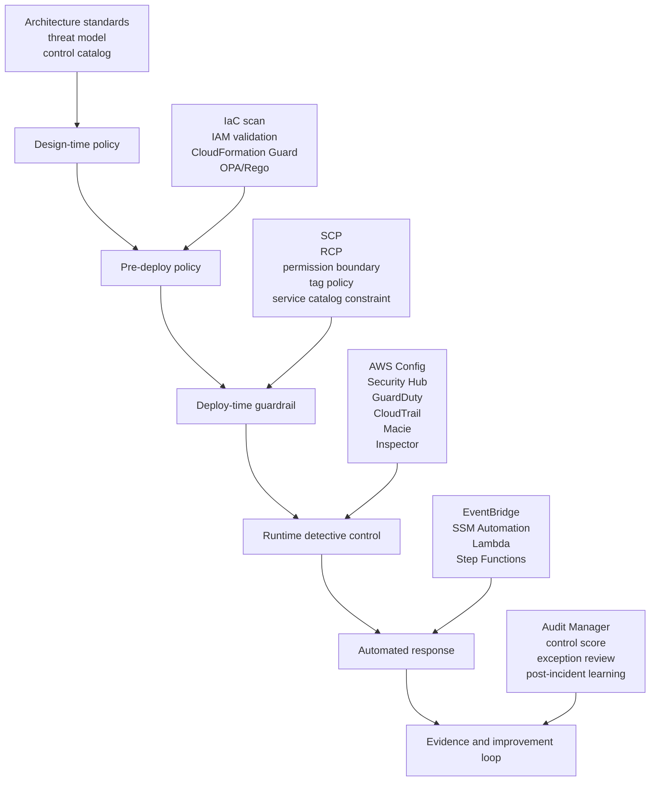
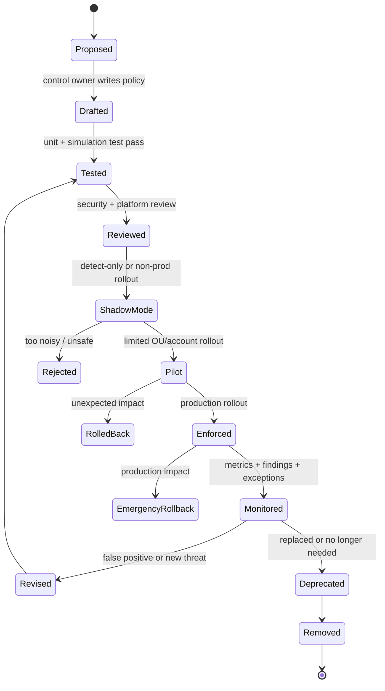
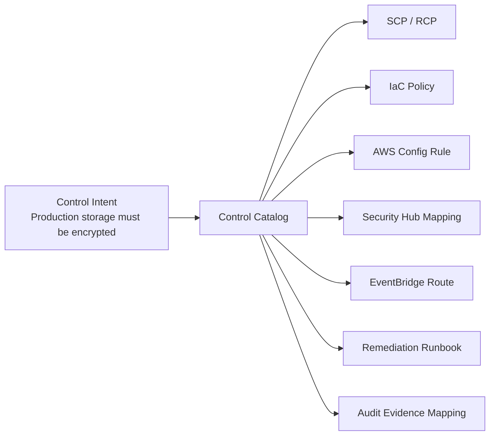
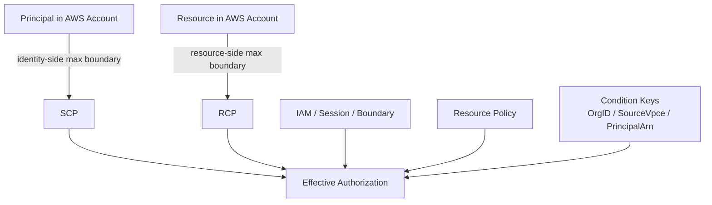
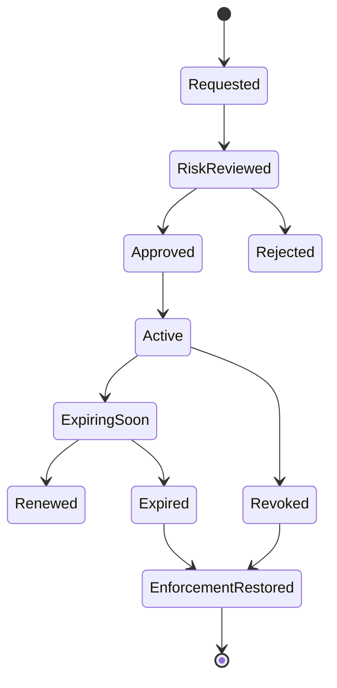
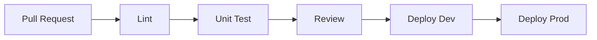
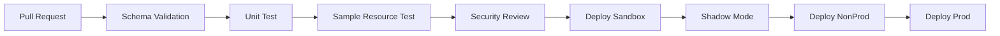
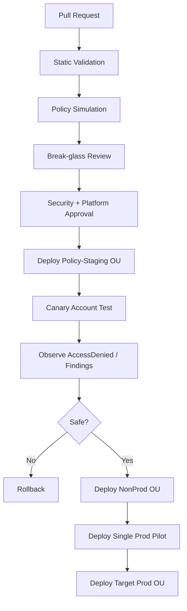

# Policy as Code for AWS Governance

Di bagian sebelumnya kita sudah membangun banyak kontrol: AWS Organizations, SCP, RCP, IAM, CloudTrail, AWS Config, Security Hub, GuardDuty, Macie, KMS, Systems Manager, Backup, Audit Manager, dan observability.

Masalahnya, semakin banyak kontrol, semakin besar risiko berikut:

1. kontrol dibuat manual dan tidak konsisten,
2. perubahan kontrol tidak bisa direview seperti perubahan aplikasi,
3. exception tidak punya umur dan owner,
4. security team menjadi bottleneck,
5. compliance bergantung pada screenshot,
6. environment drift dari baseline,
7. remediation dilakukan ad hoc,
8. tidak ada cara aman untuk mengetes guardrail sebelum diterapkan ke seluruh organisasi.

**Policy as Code** adalah jawaban engineering untuk masalah itu.

Bukan karena semua harus menjadi YAML. Bukan juga karena semua harus masuk pipeline. Intinya lebih sederhana:

> Setiap aturan governance yang penting harus dapat dibaca, diuji, direview, dirilis, diukur, dan dibuktikan seperti software.

Dalam AWS, policy as code bukan satu teknologi. Ia adalah sistem yang menyatukan beberapa lapisan kontrol:

- AWS Organizations policies: SCP, RCP, tag policy, backup policy, deklarasi baseline organisasi.
- IAM policy: identity policy, role trust policy, permission boundary, session policy.
- Resource policy: S3 bucket policy, KMS key policy, SQS policy, SNS policy, ECR policy, Secrets Manager policy.
- Network policy: security group, NACL, Network Firewall rule group, DNS Firewall, WAF rule.
- Configuration policy: AWS Config rule, conformance pack, organization conformance pack.
- Infrastructure policy: CloudFormation Guard, CDK assertions, Terraform plan checks, OPA/Rego, Checkov-style static checks.
- Runtime policy: Security Hub automation rule, EventBridge rule, remediation runbook, alert rule.
- Evidence policy: Audit Manager framework, evidence collection mapping, retention policy.

AWS sendiri menyediakan guidance resmi untuk mengelola AWS Organizations authorization policies sebagai code, termasuk SCP dan RCP sebagai pusat pembatasan maksimum untuk principal dan resource di member accounts. AWS Config conformance packs juga dirancang sebagai paket rules dan remediation actions yang dapat dideploy ke account/Region atau ke seluruh AWS Organizations.

Bagian ini membangun mental model dan blueprint implementasi.

---

## 1. Masalah Yang Sebenarnya: Governance Drift

Cloud drift biasanya dibayangkan sebagai resource yang berubah dari template IaC. Itu benar, tapi belum cukup.

Dalam sistem AWS besar, drift punya beberapa bentuk:

| Drift | Contoh | Risiko |
|---|---|---|
| Resource drift | Security group dibuka ke `0.0.0.0/0` | Exposure langsung |
| Identity drift | Role mendapat `AdministratorAccess` sementara lalu lupa dicabut | Privilege escalation |
| Organization drift | Account dipindah ke OU yang guardrail-nya lebih lemah | Boundary melemah |
| Logging drift | CloudTrail dimatikan di satu Region | Blind spot audit |
| Encryption drift | Bucket baru tidak memakai KMS key yang benar | Data protection gagal |
| Tag drift | Resource tidak punya owner/environment/classification | Remediation tidak punya target |
| Exception drift | Exception expired tapi tidak pernah dicabut | Risk acceptance palsu |
| Evidence drift | Control ada, tetapi tidak ada bukti historis | Audit gagal |

Policy as code harus melihat semuanya sebagai satu sistem.

Tujuannya bukan “mencegah semua hal buruk”. Itu mustahil. Tujuannya:

1. membuat baseline eksplisit,
2. mencegah pelanggaran paling berbahaya,
3. mendeteksi pelanggaran yang tidak bisa dicegah,
4. memberi jalur exception yang terkontrol,
5. memberi evidence bahwa kontrol bekerja,
6. membuat perubahan governance bisa direview dan dirollback.

---

## 2. Policy as Code Bukan Sekadar Static Analysis

Banyak tim mengira policy as code berarti menjalankan scanner di Terraform plan.

Itu hanya satu bagian.

Policy as code production-grade punya lima lapisan.



Setiap lapisan menjawab pertanyaan berbeda.

| Layer | Pertanyaan | Contoh |
|---|---|---|
| Design-time | Apakah desain boleh masuk platform? | “Internet-facing workload harus punya WAF dan owner.” |
| Pre-deploy | Apakah IaC melanggar policy sebelum dibuat? | Terraform plan membuat S3 bucket public. |
| Deploy-time | Apakah request API harus ditolak? | SCP menolak `cloudtrail:StopLogging`. |
| Runtime | Apakah state actual sudah drift? | Config menemukan EBS tidak encrypted. |
| Response | Apakah perlu auto-remediate atau escalate? | EventBridge trigger runbook quarantine. |
| Evidence | Apakah bisa dibuktikan kontrol berjalan? | Audit Manager evidence + Config timeline. |

Security yang matang tidak memilih satu layer. Ia mengombinasikan layer berdasarkan sifat risiko.

---

## 3. Control Taxonomy: Preventive, Proactive, Detective, Responsive, Recovery

Policy as code harus mulai dari taxonomy. Tanpa taxonomy, semua kontrol akan terasa sama.

| Control Type | Tujuan | AWS Example | Cocok Untuk |
|---|---|---|---|
| Preventive | Menolak tindakan sebelum terjadi | SCP, RCP, permission boundary, endpoint policy | Risiko tinggi dan jelas salah |
| Proactive | Memvalidasi template sebelum provisioning | CloudFormation Guard, IaC checks, Control Tower proactive control | Shift-left guardrail |
| Detective | Menemukan pelanggaran setelah terjadi | AWS Config, Security Hub, CloudTrail query | Risiko yang butuh konteks runtime |
| Responsive | Mengambil aksi saat finding/event muncul | EventBridge, SSM Automation, Lambda | Containment/remediation cepat |
| Recovery | Mengembalikan kondisi aman | AWS Backup restore, rollback pipeline, key rotation | Insiden/destructive change |

Contoh:

- “Jangan izinkan CloudTrail dimatikan” sebaiknya preventive dengan SCP.
- “Semua resource harus punya tag owner” bisa proactive + detective karena banyak service punya perilaku tag berbeda.
- “Public S3 bucket di prod” bisa preventive dengan Block Public Access + SCP/RCP + detective Config + auto-remediation.
- “EC2 vulnerable critical CVE” biasanya detective + responsive, bukan preventive penuh, karena perlu patch window dan compatibility.

Rule of thumb:

> Prevent hanya hal yang hampir selalu salah. Detect untuk hal yang membutuhkan konteks. Automate hanya jika failure mode remediation sudah dipahami.

---

## 4. Policy Object Model

Agar policy as code tidak kacau, definisikan object model.

Minimal setiap policy punya metadata berikut:

```yaml
id: AWS-GOV-001
name: CloudTrail must not be disabled
category: audit
controlType: preventive
risk: audit-blindness
severity: critical
scope:
  organizationalUnits:
    - prod
    - regulated
  regions:
    - all-enabled
owner:
  team: cloud-security
  slack: '#cloud-security'
evidence:
  source:
    - cloudtrail
    - organizations-policy
    - securityhub
exception:
  allowed: false
implementation:
  mechanism:
    - scp
    - config-rule
    - eventbridge-alert
lifecycle:
  status: active
  version: 3
  reviewCycle: quarterly
```

Policy bukan hanya dokumen. Policy adalah unit operasional.

Ia harus punya:

- identifier stabil,
- owner,
- target scope,
- risk rationale,
- implementation mechanism,
- test case,
- evidence source,
- exception rule,
- rollout history,
- rollback plan.

Tanpa ini, policy repository akan berubah menjadi folder berisi JSON yang tidak ada orang berani sentuh.

---

## 5. Repository Design

Salah satu bentuk repository yang workable:

```text
aws-governance-policies/
  README.md
  catalog/
    controls.yaml
    risks.yaml
    services.yaml
    exception-schema.yaml
  organizations/
    scp/
      deny-disable-audit.json
      deny-root-sensitive-actions.json
      restrict-regions.json
    rcp/
      s3-org-resource-perimeter.json
      kms-org-resource-perimeter.json
    tag-policies/
      mandatory-tags.json
    backup-policies/
      prod-backup-policy.json
  iam/
    permission-boundaries/
      platform-team-boundary.json
      developer-boundary.json
    trust-policy-patterns/
      github-oidc-trust.json
      cicd-cross-account-trust.json
  config/
    conformance-packs/
      prod-security-baseline.yaml
      regulated-data-baseline.yaml
      sandbox-minimum-baseline.yaml
    custom-rules/
      no-public-sensitive-s3.guard
      required-kms-key.guard
  network/
    waf/
      baseline-web-acl.yaml
    network-firewall/
      egress-domain-allowlist.yaml
    dns-firewall/
      blocked-domains.yaml
  eventbridge/
    rules/
      securityhub-critical-finding.yaml
      guardduty-credential-compromise.yaml
  remediation/
    ssm-automation/
      quarantine-ec2.yaml
      block-public-s3.yaml
      disable-exposed-access-key.yaml
  exceptions/
    active/
      EXC-2026-001.yaml
    expired/
  tests/
    unit/
    integration/
    simulation/
  pipelines/
    deploy-org-policies.yaml
    deploy-config-packs.yaml
    deploy-remediation.yaml
  docs/
    operating-model.md
    rollout-strategy.md
    break-glass.md
```

Pemisahan ini penting karena policy punya blast radius berbeda.

SCP yang salah bisa memblokir deployment seluruh organisasi.

Config rule yang salah mungkin hanya menghasilkan noise.

SSM remediation yang salah bisa mematikan workload.

Mereka tidak boleh punya pipeline risk profile yang sama.

---

## 6. Policy Lifecycle

Policy yang matang melewati state machine.



Jangan langsung lompat dari “draft” ke “enforced di root OU”.

Rollout aman biasanya seperti ini:

1. local static test,
2. policy simulation,
3. dev account,
4. sandbox OU,
5. policy-staging OU,
6. non-prod OU,
7. one prod pilot account,
8. prod OU,
9. regulated OU,
10. root-level enforcement jika benar-benar universal.

---

## 7. The Control Compiler Mental Model

Anggap policy as code sebagai compiler.

Input-nya bukan hanya JSON policy. Input-nya adalah control intent.

Contoh intent:

> Production workloads must not use unencrypted storage.

Compiler akan memecah intent menjadi beberapa output:

| Output | Mechanism |
|---|---|
| Prevent unencrypted EBS where possible | SCP deny create volume without encryption condition, service-specific guardrail |
| Detect existing unencrypted volumes | AWS Config managed/custom rule |
| Block IaC before merge | CloudFormation Guard / Terraform policy |
| Alert owner | Security Hub + EventBridge |
| Remediate | Snapshot-copy-encrypt migration runbook, not blind auto-delete |
| Evidence | Config timeline + Security Hub finding + ticket closure |

Satu intent jarang punya satu policy.

Itulah sebabnya control catalog harus menjadi source of truth. JSON/SCP/Config/Remediation hanyalah compiled artifacts.



---

## 8. What Belongs in SCP

SCP adalah alat yang kuat tetapi kasar.

Gunakan SCP untuk tindakan yang:

1. hampir selalu salah,
2. punya blast radius besar,
3. tidak perlu konteks aplikasi kompleks,
4. harus ditolak sebelum terjadi,
5. tidak bisa dipercaya hanya dengan detection.

Contoh cocok untuk SCP:

- disable CloudTrail,
- delete log archive bucket,
- leave AWS Organization,
- create IAM user access key di prod,
- disable GuardDuty/Security Hub/Config,
- delete KMS key tanpa proses,
- create resource di Region yang tidak disetujui,
- remove S3 Block Public Access di regulated OU,
- bypass permission boundary untuk delegated admins,
- create internet gateway di account yang tidak boleh punya public internet.

Contoh kurang cocok untuk SCP:

- semua naming convention,
- semua tag compliance,
- semua jenis instance,
- semua perubahan security group,
- semua operasi database,
- semua exception workload.

Mengapa?

Karena SCP tidak tahu konteks bisnis penuh. SCP yang terlalu ambisius sering membuat platform tidak bisa dipakai.

Prinsip praktis:

> SCP menjaga lantai keselamatan. Jangan pakai SCP untuk mendesain interior rumah.

---

## 9. SCP Pattern: Deny Disable Audit

Contoh skeleton. Jangan copy mentah tanpa penyesuaian akun, role break-glass, dan service behavior.

```json
{
  "Version": "2012-10-17",
  "Statement": [
    {
      "Sid": "DenyCloudTrailTampering",
      "Effect": "Deny",
      "Action": [
        "cloudtrail:StopLogging",
        "cloudtrail:DeleteTrail",
        "cloudtrail:UpdateTrail",
        "cloudtrail:PutEventSelectors",
        "cloudtrail:PutInsightSelectors"
      ],
      "Resource": "*",
      "Condition": {
        "ArnNotLike": {
          "aws:PrincipalArn": [
            "arn:aws:iam::*:role/AWSControlTowerExecution",
            "arn:aws:iam::*:role/BreakGlassAuditAdmin"
          ]
        }
      }
    }
  ]
}
```

Yang penting bukan JSON-nya. Yang penting adalah invariant-nya:

> Tidak ada principal biasa yang boleh menghapus atau mematikan audit trail organisasi.

Test case minimal:

| Scenario | Expected |
|---|---|
| Developer role calls `cloudtrail:StopLogging` | Denied |
| Platform role without audit exception calls `DeleteTrail` | Denied |
| Approved audit admin role updates trail via approved pipeline | Allowed jika IAM juga mengizinkan |
| Member account root user tries to stop logging | Denied |

---

## 10. What Belongs in RCP

RCP membatasi akses dari sisi resource. Ia berguna untuk resource perimeter.

Gunakan RCP untuk pertanyaan seperti:

- Apakah resource organisasi boleh diakses principal luar organisasi?
- Apakah S3 bucket di organisasi boleh dibaca dari luar identity perimeter?
- Apakah KMS key boleh dipakai untuk decrypt oleh principal dari luar organisasi?
- Apakah resource policy boleh membuka akses cross-org tanpa exception?

SCP membatasi principal di account organisasi.

RCP membatasi resource di account organisasi.

Keduanya saling melengkapi.



Resource perimeter policy harus hati-hati dengan AWS service-to-service calls. Banyak service AWS mengakses resource atas nama workload. Jika condition terlalu sempit, backup, logging, replication, analytics, atau security service bisa rusak.

Rule of thumb:

> Resource perimeter harus dimulai dari logging-only analysis, lalu staged deny dengan service exception eksplisit.

---

## 11. Tag Policy Is Not Authorization

Tag policy membantu standardisasi tag key/value di AWS Organizations. Tetapi tag policy bukan enforcement universal terhadap semua resource dan bukan authorization boundary.

Gunakan tag policy untuk:

- standardisasi key: `Owner`, `Environment`, `DataClassification`, `CostCenter`, `Application`, `Criticality`,
- mengurangi variasi: `prod` vs `production` vs `prd`,
- membantu reporting,
- membantu ABAC kalau tag governance sudah matang.

Jangan mengandalkan tag policy saja untuk:

- mencegah resource tanpa tag,
- mencegah tag sensitif dimodifikasi,
- memastikan semua service mendukung tag-on-create,
- menjadi boundary privilege.

Untuk tag enforcement, kombinasikan:

- IaC pre-check,
- SCP condition pada service yang mendukung `aws:RequestTag` dan `aws:TagKeys`,
- AWS Config rule,
- EventBridge auto-tagging atau quarantine,
- exception workflow.

---

## 12. IAM Policy as Code

IAM policy as code punya tiga masalah besar:

1. wildcard terlalu luas,
2. trust policy terlalu permisif,
3. `iam:PassRole` membuka privilege escalation.

Policy repository harus punya linter yang mengecek minimal:

| Check | Reason |
|---|---|
| No `Action: "*"` in production role except explicit approved boundary | Mencegah admin accidental |
| No `Resource: "*"` for service yang mendukung resource-level permission | Mengurangi blast radius |
| No trust to account root tanpa condition | Cross-account assumption terlalu luas |
| External trust requires `sts:ExternalId` where applicable | Confused deputy defense |
| OIDC trust requires exact `sub`/`aud` condition | CI/CD identity hardening |
| `iam:PassRole` must restrict resource and target service | Privilege escalation control |
| KMS decrypt must be scoped by key/resource/context where possible | Plaintext access control |
| Permission boundary required for delegated role creation | Delegated admin safety |

Contoh trust policy OIDC yang lebih baik daripada wildcard:

```json
{
  "Version": "2012-10-17",
  "Statement": [
    {
      "Effect": "Allow",
      "Principal": {
        "Federated": "arn:aws:iam::111122223333:oidc-provider/token.actions.githubusercontent.com"
      },
      "Action": "sts:AssumeRoleWithWebIdentity",
      "Condition": {
        "StringEquals": {
          "token.actions.githubusercontent.com:aud": "sts.amazonaws.com"
        },
        "StringLike": {
          "token.actions.githubusercontent.com:sub": "repo:example-org/example-repo:ref:refs/heads/main"
        }
      }
    }
  ]
}
```

Policy as code harus menolak trust policy seperti ini di production:

```json
{
  "Effect": "Allow",
  "Principal": "*",
  "Action": "sts:AssumeRole"
}
```

Itu bukan fleksibel. Itu authorization collapse.

---

## 13. CloudFormation Guard and AWS Config Custom Rules

CloudFormation Guard berguna untuk menulis rule deklaratif terhadap template atau configuration item.

Pattern yang kuat:

1. tulis Guard rule untuk IaC pre-deploy,
2. pakai rule yang sama atau serupa untuk AWS Config custom rule,
3. gunakan Config conformance pack untuk deployment organisasi,
4. kirim non-compliance ke Security Hub atau ticketing,
5. ukur compliance score.

Contoh sederhana:

```guard
let s3_buckets = Resources.*[ Type == 'AWS::S3::Bucket' ]

rule s3_bucket_must_block_public_access when %s3_buckets !empty {
  %s3_buckets.Properties.PublicAccessBlockConfiguration.BlockPublicAcls == true
  %s3_buckets.Properties.PublicAccessBlockConfiguration.BlockPublicPolicy == true
  %s3_buckets.Properties.PublicAccessBlockConfiguration.IgnorePublicAcls == true
  %s3_buckets.Properties.PublicAccessBlockConfiguration.RestrictPublicBuckets == true
}
```

Versi production perlu lebih banyak konteks:

- apakah bucket memang public website?
- apakah bucket berada di sandbox OU?
- apakah bucket punya exception aktif?
- apakah public access dibatasi CloudFront OAC?
- apakah data classification mengizinkan public?

Policy as code yang baik tidak hanya bilang “fail”. Ia menjelaskan kenapa dan bagaimana memperbaiki.

---

## 14. Organization Conformance Pack Strategy

Conformance pack adalah cara praktis untuk mengirim satu paket AWS Config rules dan remediation actions.

Strategi yang masuk akal:

| Pack | Scope | Isi |
|---|---|---|
| `baseline-all-accounts` | Semua account | CloudTrail, Config, IAM root, encryption basic, required tags |
| `prod-workload` | Production OU | stricter logging, encryption, backup, public exposure, SSM managed instance |
| `regulated-data` | Regulated OU | Macie, KMS, no public access, stricter retention, audit evidence |
| `sandbox-minimum` | Sandbox OU | budget, region restriction, no external sharing, basic audit |
| `security-tooling` | Security OU | protect security services, detector enabled, aggregation configured |

Jangan membuat satu conformance pack raksasa untuk semua hal.

Masalah conformance pack raksasa:

- false positive sulit diisolasi,
- owner tidak jelas,
- rollout berisiko,
- exception jadi kacau,
- compliance score tidak meaningful.

Lebih baik banyak pack kecil yang punya owner dan tujuan jelas.

---

## 15. Exception as Code

Exception adalah bagian normal dari sistem. Yang berbahaya adalah exception yang tidak punya struktur.

Exception harus versioned.

Contoh:

```yaml
id: EXC-2026-017
controlId: AWS-GOV-S3-004
resourceArn: arn:aws:s3:::public-marketing-assets-prod
accountId: "111122223333"
region: global
reason: Public marketing assets served through CloudFront migration window.
riskAcceptance:
  acceptedBy: head-of-platform
  acceptedAt: 2026-07-06
  expiresAt: 2026-08-06
compensatingControls:
  - CloudFront OAC migration in progress
  - Bucket policy restricted to approved object prefix
  - Macie scan daily
  - Security Hub critical alert if sensitive data appears
owner:
  team: marketing-platform
  contact: '#marketing-platform'
review:
  cadence: weekly
  ticket: SEC-18422
status: active
```

Exception lifecycle:



Exception tanpa expiry bukan exception. Itu policy baru yang tidak diakui.

---

## 16. Pipeline Design

Policy pipeline harus dibedakan berdasarkan blast radius.

### 16.1 Low-risk pipeline

Untuk dashboard, query pack, documentation, non-enforcing Config rule.



### 16.2 Medium-risk pipeline

Untuk Config rule, conformance pack, Security Hub automation rule, alert policy.



### 16.3 High-risk pipeline

Untuk SCP, RCP, permission boundary, KMS key policy baseline, automated remediation.



High-risk pipeline harus punya:

- canary account,
- automatic rollback command,
- break-glass role exemption yang tested,
- deployment window,
- CloudTrail query untuk unexpected denies,
- support channel selama rollout,
- runbook untuk stuck deployment.

---

## 17. Test Strategy

Policy tanpa test adalah harapan.

Jenis test:

| Test | Example |
|---|---|
| Syntax test | JSON/YAML valid, IAM policy valid, CloudFormation valid |
| Schema test | Metadata wajib ada: owner, risk, scope, evidence |
| Unit test | Input policy/template tertentu harus pass/fail |
| Negative test | Known-bad template harus ditolak |
| Simulation test | IAM/SCP simulation untuk action tertentu |
| Canary deploy | Apply ke account khusus dan jalankan API real |
| Drift test | Buat resource non-compliant lalu pastikan Config menemukan |
| Remediation test | Trigger finding lalu validasi runbook tidak destruktif |
| Evidence test | Pastikan Audit Manager/Config/Security Hub menerima evidence |

Contoh test matrix SCP:

| Principal | Action | Account | Expected | Notes |
|---|---|---|---|---|
| DeveloperRole | `cloudtrail:StopLogging` | prod | Deny | Audit protected |
| PlatformAdmin | `cloudtrail:StopLogging` | dev | Deny | No manual audit tampering |
| AuditPipelineRole | `cloudtrail:UpdateTrail` | security | Allow | IAM must also allow |
| Root | `organizations:LeaveOrganization` | member | Deny | Member root contained |
| BreakGlassAuditAdmin | `cloudtrail:UpdateTrail` | security | Allow | Only during approved incident |

---

## 18. Policy Simulation Is Necessary but Not Sufficient

IAM/SCP simulation helps, but simulation has limits:

- tidak selalu menangkap semua service-specific behavior,
- tidak menggantikan test API real,
- tidak membuktikan downstream service integration,
- tidak cukup untuk resource policy + service principal complex path,
- tidak membuktikan effect ke CI/CD pipeline.

Karena itu high-risk guardrail perlu canary account.

Canary account berisi:

- sample workload,
- sample CI/CD role,
- sample S3/KMS/CloudTrail/Config setup,
- known good and known bad actions,
- CloudTrail query pack,
- smoke tests.

Canary bukan environment main-main. Ia adalah crash test dummy untuk governance.

---

## 19. Policy Deployment Scope

Scope harus eksplisit.

Jangan deploy ke root OU hanya karena mudah.

Scope dimension:

| Dimension | Example |
|---|---|
| OU | `prod`, `non-prod`, `sandbox`, `regulated`, `security` |
| Account | account allowlist/blocklist |
| Region | approved regions |
| Resource type | S3, KMS, EC2, IAM |
| Tag | `DataClassification=regulated` |
| Principal | role path, permission set, automation role |
| Exception | active exception id |
| Time | maintenance window, rollout phase |

Good scope example:

```yaml
scope:
  include:
    organizationalUnits:
      - prod
      - regulated
    regions:
      - ap-southeast-1
      - ap-southeast-3
      - us-east-1
  exclude:
    accounts:
      - "999988887777" # policy-staging exception until 2026-08-01
  conditions:
    resourceTags:
      DataClassification:
        - confidential
        - regulated
```

Bad scope example:

```yaml
scope: all
```

“All” mungkin benar untuk beberapa invariant, tetapi harus menjadi keputusan sadar.

---

## 20. Policy-as-Code Metrics

Ukuran sukses bukan jumlah policy.

Ukuran sukses:

| Metric | Meaning |
|---|---|
| Prevented dangerous API calls | SCP/RCP effective without business outage |
| Mean time to detect drift | Kecepatan detective control menemukan pelanggaran |
| Mean time to remediate | Kecepatan owner memperbaiki |
| False positive rate | Kualitas rule |
| Exception count by age | Kesehatan risk acceptance |
| Policy deployment failure rate | Stabilitas pipeline |
| Coverage by OU/account/Region | Apakah baseline benar-benar aktif |
| Control-to-evidence mapping coverage | Audit readiness |
| Break-glass invocation count | Indikator desain akses normal tidak cukup atau insiden serius |
| Unowned finding count | Governance ownership gap |

Policy repository harus menghasilkan report seperti engineering system:

- controls active,
- controls in shadow mode,
- controls deprecated,
- accounts missing baseline,
- expired exceptions,
- top noisy controls,
- controls without evidence,
- remediation failure rate.

---

## 21. Governance Change Review

Security review yang baik tidak bertanya “apakah policy ini aman?” saja.

Ia bertanya:

1. Apa invariant yang dijaga?
2. Risiko apa yang dikurangi?
3. Apa blast radius jika policy salah?
4. Apa service integration yang mungkin rusak?
5. Bagaimana exception ditangani?
6. Bagaimana policy dites?
7. Bagaimana rollback dilakukan?
8. Apa evidence bahwa policy bekerja?
9. Apakah owner workload bisa memahami error message?
10. Apakah ada cara lebih murah/lebih sederhana?

PR template:

```md
## Control Intent

## Risk Reduced

## Policy Mechanism
- [ ] SCP
- [ ] RCP
- [ ] Config Rule
- [ ] IaC Check
- [ ] Remediation
- [ ] Alert

## Scope

## Test Evidence

## Rollout Plan

## Rollback Plan

## Exceptions

## Expected Operational Impact

## Evidence Mapping
```

---

## 22. Handling AccessDenied Storms

SCP/RCP rollout yang salah sering terlihat sebagai `AccessDenied` storm.

Gejalanya:

- deployment pipeline tiba-tiba gagal,
- service-linked role tidak bisa menjalankan operasi,
- CloudFormation stack rollback,
- AWS service integration gagal diam-diam,
- support tickets melonjak,
- developers mencoba bypass.

Runbook:

1. cek waktu rollout policy,
2. query CloudTrail untuk `errorCode = AccessDenied`,
3. grouping by principal/action/account/region,
4. identifikasi apakah deny berasal dari SCP/RCP/IAM/resource policy,
5. bandingkan dengan expected deny list,
6. jika unexpected high severity, rollback policy attachment,
7. jika expected, update developer-facing error doc,
8. jika ambiguous, move policy back to shadow/pilot,
9. buat test case baru.

Contoh CloudTrail Lake/Logs Insights style query concept:

```sql
SELECT
  eventTime,
  recipientAccountId,
  userIdentity.arn,
  eventSource,
  eventName,
  errorCode,
  errorMessage
WHERE errorCode LIKE '%AccessDenied%'
ORDER BY eventTime DESC
```

---

## 23. Policy Documentation Must Be Runtime-Oriented

Dokumentasi policy yang buruk:

> This SCP denies insecure actions.

Dokumentasi policy yang baik:

```md
# AWS-GOV-AUDIT-001: Prevent Audit Trail Tampering

## Intent
No normal principal may stop, delete, or weaken organization-level audit logging.

## Why
If audit logging can be disabled by workload principals, incident investigation and regulatory evidence become unreliable.

## Scope
Attached to prod, regulated, and non-prod OUs. Not attached to policy-staging OU during test.

## Expected Denies
- cloudtrail:StopLogging
- cloudtrail:DeleteTrail
- cloudtrail:PutEventSelectors

## Approved Path
CloudTrail changes must be deployed through the audit baseline pipeline.

## Common Error
AccessDenied on cloudtrail:UpdateTrail during manual console change.

## Fix
Submit change through cloud-security/audit-baseline pipeline.

## Emergency
Use BreakGlassAuditAdmin with incident record and post-event review.
```

Policy documentation harus membantu engineer memperbaiki, bukan hanya memberi hukuman.

---

## 24. When Not to Automate Enforcement

Ada kasus di mana policy as code sebaiknya dimulai dari visibility.

Jangan langsung enforce jika:

- service behavior belum dipahami,
- false positive mahal,
- resource sudah banyak legacy,
- owner tidak jelas,
- remediation bisa destruktif,
- exception banyak dan tidak terkatalog,
- evidence source belum stabil,
- business impact belum disepakati.

Gunakan fase:

1. inventory,
2. report,
3. owner assignment,
4. exception cleanup,
5. shadow alert,
6. non-prod enforcement,
7. prod enforcement.

Governance yang berhasil jarang dimulai dengan “deny everything”. Ia dimulai dengan “lihat dengan jelas, lalu kunci yang berbahaya”.

---

## 25. Minimal Viable AWS Policy-as-Code Platform

Jika membangun dari nol, jangan mulai dengan semua hal.

Mulai dengan 10 kontrol baseline:

1. CloudTrail organization trail tidak boleh dimatikan.
2. AWS Config recorder harus aktif di semua account/Region target.
3. Security Hub/GuardDuty tidak boleh dimatikan oleh workload role.
4. Root user usage menghasilkan critical alert.
5. Public S3 ditolak/dideteksi sesuai OU.
6. Required tags untuk owner/environment/data classification.
7. KMS key deletion butuh approval dan alert.
8. IAM user access key dilarang di prod kecuali exception.
9. Production resource harus punya backup policy.
10. Security group public ingress ke sensitive port ditolak/dideteksi.

Untuk masing-masing:

- satu control catalog entry,
- satu implementation artifact,
- satu test case,
- satu evidence mapping,
- satu owner,
- satu runbook.

Setelah 10 ini sehat, baru tambah kontrol.

---

## 26. Anti-Patterns

### Anti-pattern 1: Policy repository menjadi tempat dumping JSON

Tidak ada owner, risk, test, evidence, rollout.

Akibatnya tidak ada yang berani mengubah policy.

### Anti-pattern 2: Semua hal dibuat SCP

SCP terlalu ketat merusak developer velocity dan menghasilkan shadow IT.

### Anti-pattern 3: Semuanya detective

Finding terus muncul, tetapi tidak ada enforcement. Security team menjadi ticket factory.

### Anti-pattern 4: Exception via comment di code

Exception tidak punya expiry, owner, atau risk acceptance.

### Anti-pattern 5: Auto-remediation destruktif

Misalnya langsung delete resource non-compliant tanpa tahu fungsi bisnisnya.

### Anti-pattern 6: Compliance-only policy

Policy dibuat untuk pass audit tetapi tidak mengurangi attack path nyata.

### Anti-pattern 7: No canary account

Policy langsung ditempel ke OU besar dan memblokir produksi.

### Anti-pattern 8: No developer-facing error path

Engineer mendapat `AccessDenied` tanpa tahu cara memperbaiki.

---

## 27. Production Checklist

Gunakan checklist ini sebelum menyebut governance policy “production-ready”.

### Control Definition

- [ ] Control punya ID stabil.
- [ ] Risk yang dikurangi eksplisit.
- [ ] Control type jelas: preventive/proactive/detective/responsive/recovery.
- [ ] Owner jelas.
- [ ] Scope jelas.
- [ ] Severity jelas.
- [ ] Exception rule jelas.

### Implementation

- [ ] Artifact ada di repository.
- [ ] Syntax valid.
- [ ] Metadata lengkap.
- [ ] Tidak ada wildcard berbahaya tanpa rationale.
- [ ] Break-glass path diuji.
- [ ] Rollback path diuji.

### Testing

- [ ] Unit test pass.
- [ ] Negative test pass.
- [ ] Canary deploy pass.
- [ ] Known-good action tidak rusak.
- [ ] Known-bad action ditolak/dideteksi.

### Rollout

- [ ] Policy-staging OU dipakai.
- [ ] Non-prod rollout selesai.
- [ ] Prod pilot selesai.
- [ ] Monitoring AccessDenied siap.
- [ ] Support channel siap.

### Evidence

- [ ] Evidence source didefinisikan.
- [ ] Audit Manager/Config/Security Hub mapping tersedia.
- [ ] Dashboard compliance tersedia.
- [ ] Expired exception report tersedia.

---

## 28. Key Takeaways

Policy as code bukan alat. Ia adalah cara mengubah governance menjadi sistem engineering.

Yang harus diingat:

1. Mulai dari control intent, bukan dari JSON.
2. Gunakan SCP/RCP hanya untuk invariant yang benar-benar pantas diprevent.
3. Gunakan Config/conformance pack untuk configuration compliance dan evidence.
4. Gunakan IaC checks untuk shift-left, tetapi jangan menganggap itu cukup.
5. Exception harus versioned, approved, scoped, dan expired.
6. Pipeline harus menyesuaikan blast radius policy.
7. Canary account adalah keharusan untuk high-risk guardrail.
8. Ukur policy dengan drift, MTTR, false positive, coverage, dan evidence quality.
9. Dokumentasi policy harus membantu engineer memperbaiki error.
10. Governance yang baik mengurangi risiko tanpa mematikan delivery.

Dalam bagian berikutnya, kita akan menggabungkan seluruh seri menjadi final production-grade reference architecture.

---

## References

- AWS Prescriptive Guidance — Manage AWS Organizations policies as code by using AWS CodePipeline: https://docs.aws.amazon.com/prescriptive-guidance/latest/patterns/manage-organizations-policies-as-code.html
- AWS Organizations — Service control policies: https://docs.aws.amazon.com/organizations/latest/userguide/orgs_manage_policies_scps.html
- AWS Organizations — Resource control policies: https://docs.aws.amazon.com/organizations/latest/userguide/orgs_manage_policies_rcps.html
- AWS Config — Conformance Packs: https://docs.aws.amazon.com/config/latest/developerguide/conformance-packs.html
- AWS Config — Managing Conformance Packs Across AWS Organizations: https://docs.aws.amazon.com/config/latest/developerguide/conformance-pack-organization-apis.html
- AWS Prescriptive Guidance — Create AWS Config custom rules by using AWS CloudFormation Guard policies: https://docs.aws.amazon.com/prescriptive-guidance/latest/patterns/create-aws-config-custom-rules-by-using-aws-cloudformation-guard-policies.html
- AWS Well-Architected Framework — Security Pillar: https://docs.aws.amazon.com/wellarchitected/latest/security-pillar/welcome.html
