# Final Production-Grade Reference Architecture

Ini bagian terakhir seri **Learn AWS Security, Monitoring and Management**.

Kita sudah membangun semua komponen secara bertahap:

- mental model AWS sebagai API-driven operating environment,
- shared responsibility dengan konsekuensi engineering,
- account dan OU sebagai security boundary,
- AWS Organizations dan Control Tower,
- SCP/RCP dan guardrails,
- IAM, trust, permission boundary, temporary credentials, workload identity,
- CloudTrail, AWS Config, log archive, audit evidence,
- KMS, secrets, certificates, Macie,
- GuardDuty, Security Hub, Inspector, Detective,
- EventBridge automation dan remediation,
- network security, WAF, Firewall Manager, Network Firewall, private access, data perimeter,
- CloudWatch, Application Signals, X-Ray, OpenTelemetry, Synthetics, RUM, Internet Monitor,
- Systems Manager, Session Manager, Patch Manager, Inventory, Incident Manager, AWS Backup,
- Audit Manager dan policy as code.

Sekarang kita gabungkan menjadi satu reference architecture.

Tujuannya bukan menggambar diagram cantik.

Tujuannya adalah membentuk sistem yang punya sifat berikut:

1. **secure by default**,
2. **auditable by construction**,
3. **observable by design**,
4. **operable under failure**,
5. **governed at scale**,
6. **recoverable after compromise**,
7. **defensible under audit**,
8. **still usable by engineering teams**.

---

## 1. First Principle: AWS Is Controlled Through APIs

Semua hal penting di AWS berakhir pada API call:

- membuat IAM role,
- mengubah bucket policy,
- membuka security group,
- mematikan CloudTrail,
- membuat KMS grant,
- men-share snapshot,
- assume role,
- deploy Lambda,
- create VPC endpoint,
- update WAF rule,
- stop instance,
- delete backup vault.

Karena itu architecture security AWS harus menjawab lima pertanyaan utama:

| Question | Control Plane |
|---|---|
| Who can call the API? | IAM, Identity Center, STS, workload identity |
| What API is allowed? | IAM policy, SCP, RCP, permission boundary, resource policy |
| Where can it happen? | Account, OU, Region, VPC endpoint, data perimeter |
| Is it logged and attributable? | CloudTrail, CloudWatch Logs, Config, source identity |
| What happens if it is dangerous? | GuardDuty, Security Hub, Config, EventBridge, remediation, incident response |

Semua desain di bawah adalah variasi dari lima pertanyaan itu.

---

## 2. Target Multi-Account Architecture

Reference architecture minimum untuk organisasi serius:

```mermaid
flowchart TD
    ORG[AWS Organizations<br/>Management Account] --> SEC[Security OU]
    ORG --> INFRA[Infrastructure OU]
    ORG --> WORK[Workloads OU]
    ORG --> SANDBOX[Sandbox OU]
    ORG --> SUSP[Suspended OU]
    ORG --> POLICY[Policy Staging OU]

    SEC --> LOG[Log Archive Account]
    SEC --> TOOL[Security Tooling Account]
    SEC --> AUDIT[Audit / Compliance Account]
    SEC --> BREAK[Emergency / Break-glass Account]

    INFRA --> NET[Network Account]
    INFRA --> SHARED[Shared Services Account]
    INFRA --> OPS[Operations Account]
    INFRA --> BACKUP[Backup Account]

    WORK --> PROD[Prod Workload Accounts]
    WORK --> NONPROD[NonProd Workload Accounts]
    WORK --> REG[Regulated Workload Accounts]

    SANDBOX --> DEVSB[Developer Sandbox Accounts]
    POLICY --> CANARY[Governance Canary Account]
    SUSP --> CLOSED[Closed / Quarantined Accounts]
```

### Account Purpose

| Account | Purpose |
|---|---|
| Management | Organization control plane only; minimal daily use |
| Log Archive | Immutable security logs, backups, evidence custody |
| Security Tooling | GuardDuty, Security Hub, Inspector, Detective, Firewall Manager delegated admin |
| Audit/Compliance | Audit Manager, evidence reports, read-only audit workflows |
| Break-glass | Emergency access workflow, monitored and isolated |
| Network | Transit, inspection, egress, DNS, shared networking control plane |
| Shared Services | Directory integration, internal tooling, artifact/cache if applicable |
| Operations | Systems Manager, Incident Manager, dashboards, operational automation |
| Backup | AWS Backup delegated administration, vaults, restore testing |
| Prod Workload | Production applications |
| NonProd Workload | Staging/test/dev workloads with lower risk |
| Regulated Workload | Workloads requiring stricter compliance and data controls |
| Sandbox | Experimentation with strong cost/security guardrails |
| Policy Staging | Test OU/account for SCP/RCP/conformance pack rollout |
| Suspended | Quarantined/retired accounts with restricted access |

AWS Security Reference Architecture recommends a dedicated Security OU with accounts such as Log Archive and Security Tooling. It also recommends multi-account separation to centralize security services, monitoring, logging, and response while limiting blast radius.

---

## 3. OU Design as Control Contract

OU bukan struktur organisasi manusia. OU adalah kumpulan account yang menerima set kontrol yang sama.

| OU | Main Controls |
|---|---|
| Security OU | Strongest protection, no normal workload, strict IAM, protected logs/tools |
| Infrastructure OU | Network/firewall/backup/ops controls, limited operator access |
| Prod OU | Strict SCP, mandatory logging, encryption, backup, WAF, vulnerability SLA |
| NonProd OU | Similar baseline, looser cost/performance policy, no production secrets |
| Regulated OU | Data perimeter, Macie, strict KMS, longer retention, stricter evidence |
| Sandbox OU | Budget controls, Region restriction, no external sharing, limited IAM |
| Policy Staging OU | Experimental governance rollout, canary tests, no business-critical workloads |
| Suspended OU | Deny almost everything except audit/read/decommission path |

Golden invariant:

> Account movement between OUs is a security-sensitive operation.

Moving an account from `prod` to `sandbox` is equivalent to changing its security posture.

Therefore:

- OU move must be logged,
- OU move must be approved,
- OU move must trigger baseline revalidation,
- OU move must update risk register,
- OU move should be blocked for sensitive accounts except via platform workflow.

---

## 4. Identity Architecture

Human and workload access must be separated.

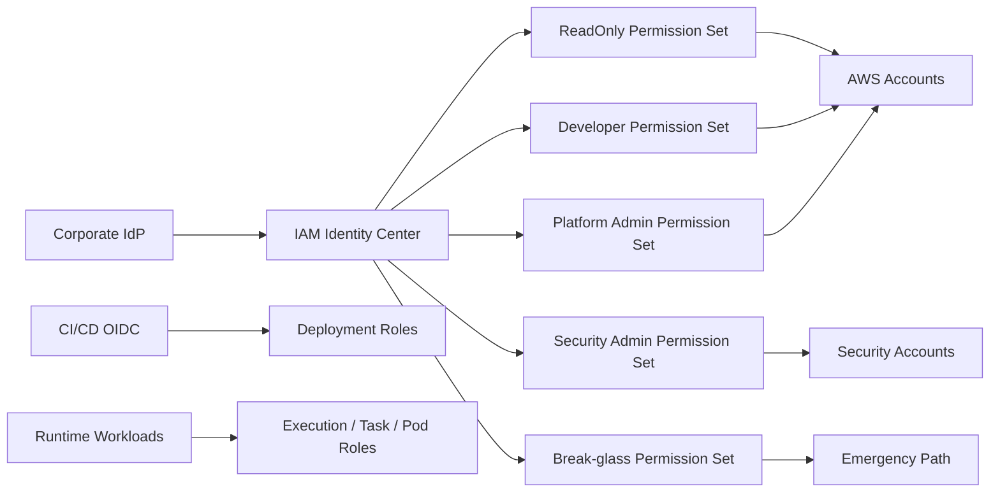

### Human Access Rules

1. Use federation through IAM Identity Center.
2. Avoid IAM users for workforce access.
3. Use permission sets by job function.
4. Require MFA and conditional access from IdP.
5. Use short session duration for privileged roles.
6. Use source identity/session tags for attribution.
7. Separate read-only, deployer, operator, security admin, and break-glass paths.
8. Log all privileged role assumption.
9. Review access regularly.
10. No shared admin accounts.

### Workload Access Rules

1. Use execution roles/task roles/instance profiles/pod identity.
2. No long-lived access keys in application config.
3. Scope role permission to exact resource/action where possible.
4. Use `iam:PassRole` restrictions.
5. Use trust policy condition for OIDC/external identity.
6. Use KMS context and service constraints for decrypt.
7. Do not reuse one runtime role across unrelated services.
8. Rotate secrets via Secrets Manager where possible.
9. Emit CloudTrail-attributable API calls.
10. Keep workload identity separate from deployment identity.

---

## 5. Governance Control Stack

Governance tidak punya satu lapisan. Governance stack production-grade:

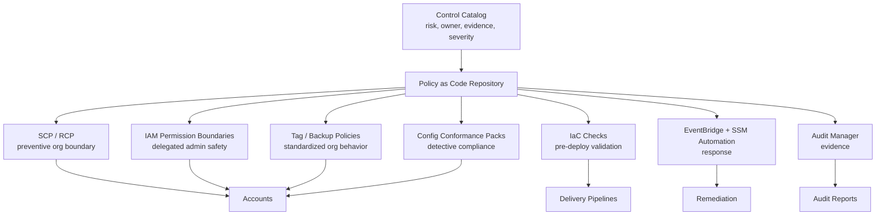

### Baseline Preventive Guardrails

| Guardrail | Mechanism |
|---|---|
| Prevent leaving organization | SCP |
| Prevent disabling CloudTrail/Config/security tooling | SCP |
| Prevent root sensitive actions | SCP + alert |
| Prevent use of unapproved Regions | SCP |
| Prevent bypassing permission boundary | SCP/IAM condition |
| Prevent public data exposure where possible | S3 Block Public Access + SCP/RCP |
| Restrict resource access to organization | RCP/resource policy/data perimeter |
| Protect backup vaults and log archive | SCP + resource policy + Vault Lock/Object Lock |
| Restrict IAM user/access key creation in prod | SCP + Config + Security Hub |
| Protect KMS deletion | SCP + alert + key policy |

### Baseline Detective Controls

| Signal | Source |
|---|---|
| API activity | CloudTrail organization trail |
| Resource state | AWS Config aggregator |
| Security posture | Security Hub CSPM |
| Threat detection | GuardDuty |
| Vulnerability | Inspector |
| Sensitive data | Macie |
| Network behavior | VPC Flow Logs, DNS logs, Network Firewall logs |
| Runtime operations | CloudWatch Logs, SSM logs |
| Backup posture | AWS Backup reports/restore tests |
| Compliance evidence | Audit Manager |

---

## 6. Logging and Evidence Architecture

Audit logs are not application logs. They are evidence.

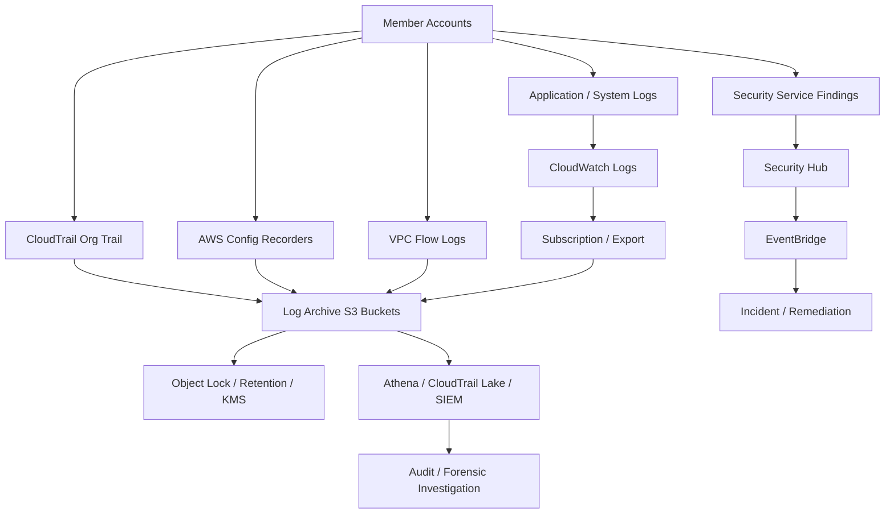

### Evidence Invariants

1. Organization CloudTrail must be enabled in all governed Regions.
2. Logs must land in dedicated Log Archive account.
3. Workload accounts must not be able to delete or rewrite central logs.
4. Log buckets must be encrypted and access controlled.
5. Retention must match legal/compliance needs.
6. Log delivery failure must alert.
7. Critical security logs must be queryable during incident.
8. Evidence access must be read-only and audited.
9. Log archive access must be separated from workload admins.
10. Evidence must survive workload account compromise.

---

## 7. Detection and Response Architecture

Detection architecture should avoid one common mistake: treating every finding as isolated.

A public S3 bucket, a KMS decrypt anomaly, a GuardDuty credential finding, and an IAM policy change may be one attack path.

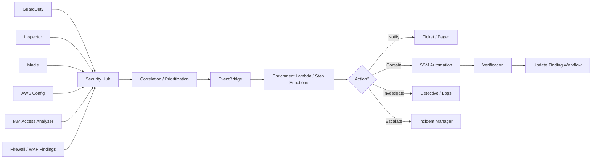

### Finding Priority Model

Priority should not equal service severity alone.

Use a combined score:

```text
priority = severity
         + internet_exposure
         + sensitive_data
         + privilege_level
         + exploitability
         + active_threat_signal
         + business_criticality
         - compensating_controls
```

Example:

| Finding | Raw Severity | Context | Actual Priority |
|---|---:|---|---:|
| Medium vulnerability on isolated dev EC2 | Medium | No internet, no sensitive data | Low |
| Public S3 bucket with Macie sensitive data | High | Confidential data | Critical |
| IAM admin policy attached to CI role | High | Deployment role, prod | Critical |
| GuardDuty credential exfiltration | High | Active threat | Critical |
| Missing tag on sandbox resource | Low | No prod impact | Low |

---

## 8. Network and Data Perimeter Architecture

Network controls are not enough. Identity controls are not enough. Resource controls are not enough.

Use all three.

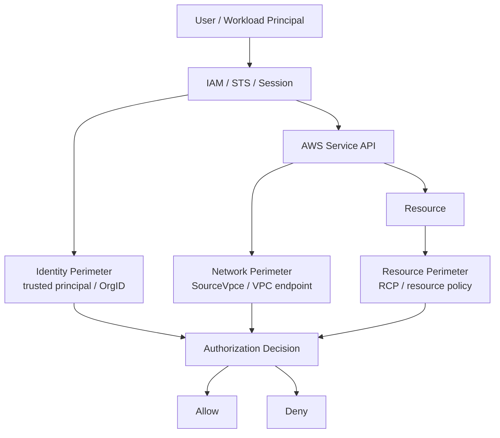

### Data Perimeter Principles

1. Trusted identities: only approved organization identities should access sensitive resources.
2. Trusted resources: organization identities should not write sensitive data to untrusted external resources.
3. Expected networks: sensitive access should come from expected VPC endpoints or approved paths.
4. Service exceptions must be explicit.
5. Perimeter decisions must be logged in CloudTrail.
6. Perimeter must be tested with real service integrations.

### Network Control Stack

| Layer | Control |
|---|---|
| Edge | CloudFront, WAF, Shield, TLS, rate limits |
| VPC ingress | Security groups, NACLs, ALB listener rules |
| VPC east-west | Security groups, routing, Network Firewall, segmentation |
| Egress | NAT control, Network Firewall, DNS Firewall, proxy, endpoint policies |
| AWS service access | Gateway/interface endpoints, endpoint policy, PrivateLink |
| Evidence | VPC Flow Logs, DNS query logs, Network Firewall logs, WAF logs |

---

## 9. Observability Reference Architecture

Observability must support both service owners and platform/security teams.

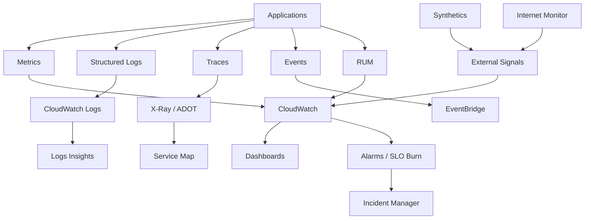

### Required Telemetry Contract Per Service

Every production service should define:

| Contract Item | Example |
|---|---|
| Service name | `payment-command-api` |
| Owner | `payments-platform` |
| Critical user journeys | `authorize-payment`, `capture-payment` |
| SLIs | availability, p95 latency, error rate, queue age |
| SLOs | 99.9% successful authorization over 30d |
| Logs | JSON, correlation ID, request ID, user-safe context |
| Traces | inbound/outbound calls, DB calls, queue publish/consume |
| Dashboards | service, dependency, saturation, incident view |
| Alarms | symptom-first, routed to owner |
| Runbooks | linked from alarms |

### Alarm Principles

1. Alert on user-visible symptoms first.
2. Use cause alarms for diagnosis, not pager spam.
3. Use composite alarms to reduce noise.
4. Use anomaly detection where static thresholds fail.
5. Every alarm must have owner and runbook.
6. Every critical alarm must be tested.
7. Page only when action is required.
8. Track noisy alarms as defects.

---

## 10. Operations and Fleet Management Architecture

Systems Manager becomes the operating plane for managed compute.

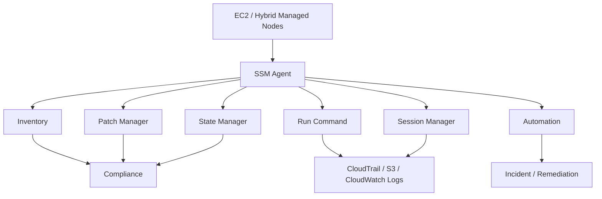

### Fleet Invariants

1. Production instances must be managed by SSM unless explicitly exempt.
2. No inbound SSH/RDP from internet.
3. Session Manager access must be IAM-controlled and logged where technically supported.
4. Patch compliance must be measured by environment and criticality.
5. Maintenance windows must be explicit.
6. Emergency patching must have separate runbook.
7. Inventory must include software/package metadata where required.
8. State Manager associations must not conflict with deployment systems.
9. Operational commands must have rate control.
10. Fleet automation must have rollback or containment plan.

---

## 11. Backup and Recovery Architecture

Backups are not enough. Restore readiness is the control.

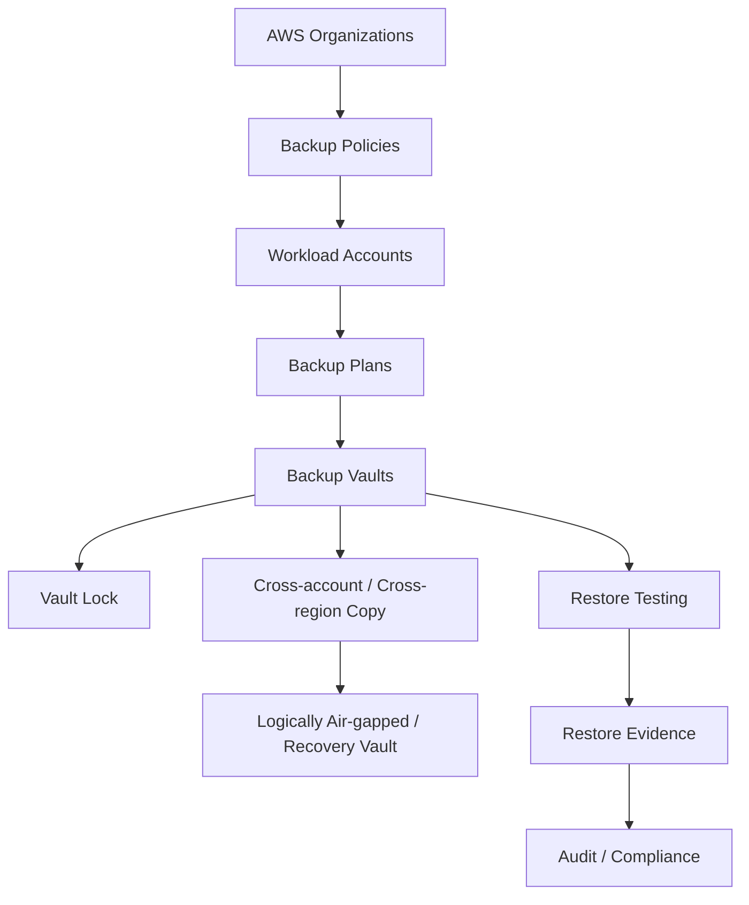

### Recovery Questions

For each critical workload:

1. What data must be recoverable?
2. What is the RPO?
3. What is the RTO?
4. Who can delete backups?
5. Who can restore backups?
6. Are backups encrypted with recoverable KMS keys?
7. Are backups copied outside compromised account boundary?
8. Is restore tested automatically?
9. Is restore evidence stored?
10. Can you recover if the production account is compromised?

Ransomware-resilient design requires backup immutability, separated access, cross-account/cross-region copy, restore testing, and clean recovery path.

---

## 12. Incident Response Operating Model

Incident response is not one tool. It is a state machine.

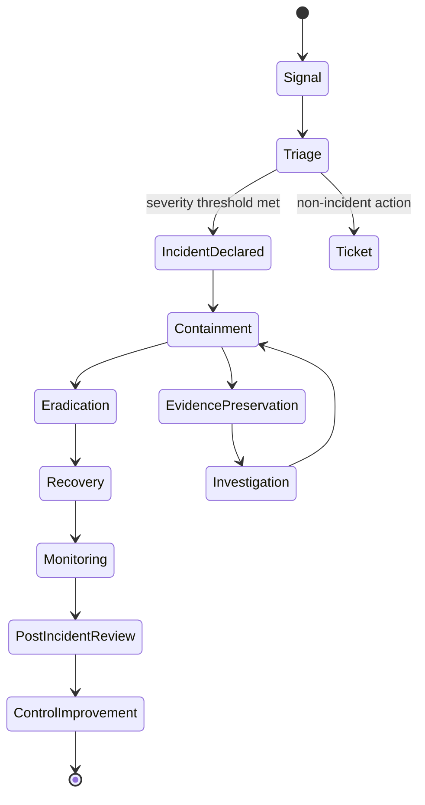

### Severity Model

| Severity | Example | Response |
|---|---|---|
| SEV-1 | Active credential compromise in prod, data exfiltration likely | Incident commander, security lead, immediate containment |
| SEV-2 | Public sensitive data exposure, critical prod vulnerability exploited | Incident response, workload owner, remediation SLA hours |
| SEV-3 | High-risk misconfiguration without active exploitation | Ticket + owner + SLA days |
| SEV-4 | Low-risk posture drift | Backlog/compliance workflow |

### Incident Evidence Pack

Every serious incident should preserve:

- triggering finding/event,
- CloudTrail events around incident window,
- IAM role/session details,
- affected resources and config timeline,
- network evidence,
- GuardDuty/Security Hub/Detective findings,
- remediation actions,
- backup/restore actions if any,
- communications timeline,
- decision log,
- post-incident control changes.

---

## 13. Compliance Architecture

Compliance must be derived from controls, not separate from them.

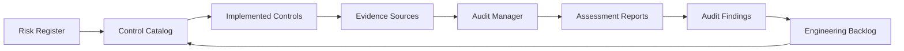

### Evidence Sources

| Control | Evidence |
|---|---|
| CloudTrail enabled | Org trail config, S3 log delivery, Config rule |
| GuardDuty enabled | Detector config, Security Hub findings, delegated admin state |
| Encryption enabled | Config rule, KMS key policy, resource config item |
| Backup enabled | AWS Backup plan/vault/recovery point, restore test result |
| Access reviewed | IAM Identity Center assignments, approval record, change log |
| Patch compliance | SSM patch compliance, maintenance window result |
| Public access controlled | Config/Security Hub/Macie, bucket policy, RCP/SCP |
| Incident handled | Incident Manager timeline, runbook execution, post-incident review |

Audit-ready does not mean “perfect”. It means:

- control intent is clear,
- implementation is traceable,
- evidence is collected,
- exceptions are approved,
- failures are tracked,
- improvement loop exists.

---

## 14. End-to-End Request Flow Example

Suppose a developer deploys a new production API.

A mature platform handles it like this:

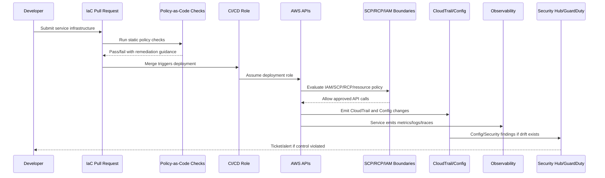

The developer experiences guardrails as fast feedback, not arbitrary blocking.

Security gets evidence without manual chasing.

Operations gets telemetry before the service is critical.

Compliance gets control mapping automatically.

---

## 15. End-to-End Compromise Flow Example

Suppose a production role credential is abused.

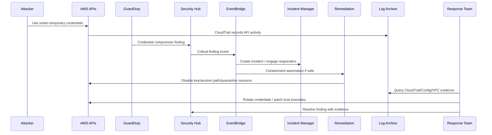

A weak architecture asks: “Who noticed?”

A strong architecture asks: “What invariant failed, what was contained automatically, what evidence exists, and what control changed afterward?”

---

## 16. Minimum Production Baseline

If you need the smallest defensible baseline, use this.

### Organization

- [ ] AWS Organizations all-features mode.
- [ ] Management account not used for daily workloads.
- [ ] Security OU, Infrastructure OU, Workloads OU, Sandbox OU, Policy Staging OU.
- [ ] Dedicated Log Archive and Security Tooling accounts.
- [ ] Delegated admins configured for security services.

### Identity

- [ ] IAM Identity Center integrated with corporate IdP.
- [ ] MFA enforced.
- [ ] Permission sets by job function.
- [ ] Break-glass access documented, tested, and monitored.
- [ ] No long-lived human access keys in production.
- [ ] Workloads use temporary role-based credentials.

### Guardrails

- [ ] SCP denies disabling audit/security services.
- [ ] Region restriction where applicable.
- [ ] Permission boundary for delegated IAM creation.
- [ ] RCP/resource policies for sensitive perimeter where mature.
- [ ] Tag and backup policies where supported.

### Audit

- [ ] CloudTrail organization trail multi-region.
- [ ] CloudTrail data events for sensitive S3/Lambda where required.
- [ ] AWS Config enabled in governed Regions.
- [ ] Central log archive with encryption and retention.
- [ ] Log delivery failure alerting.

### Detection

- [ ] GuardDuty enabled organization-wide.
- [ ] Security Hub enabled with standards and central configuration.
- [ ] Inspector enabled for EC2/ECR/Lambda where used.
- [ ] Macie enabled for S3 sensitive data discovery where needed.
- [ ] IAM Access Analyzer used for external/unused access review.

### Response

- [ ] EventBridge finding routes.
- [ ] Critical finding escalation path.
- [ ] Safe containment automations.
- [ ] Incident Manager or equivalent incident workflow.
- [ ] Evidence pack runbooks.

### Observability

- [ ] CloudWatch metrics/logs retention strategy.
- [ ] Service dashboards.
- [ ] SLOs for critical services.
- [ ] X-Ray/ADOT tracing for distributed systems.
- [ ] Synthetics/RUM for user-facing services.

### Operations

- [ ] Systems Manager managed nodes.
- [ ] Session Manager bastionless access where appropriate.
- [ ] Patch baselines and maintenance windows.
- [ ] Inventory and compliance reporting.

### Recovery

- [ ] AWS Backup plans and vaults.
- [ ] Vault Lock for critical backups.
- [ ] Cross-account/cross-region copy for critical data.
- [ ] Restore testing.
- [ ] KMS recovery plan.

### Compliance

- [ ] Control catalog.
- [ ] Evidence mapping.
- [ ] Audit Manager assessments where useful.
- [ ] Exception registry.
- [ ] Policy as code repository.

---

## 17. Maturity Model

### Level 1 — Manual Cloud

- Accounts created manually.
- IAM broad and inconsistent.
- Logs exist but are not centralized.
- Security findings are reactive.
- Compliance evidence manual.

### Level 2 — Baseline Landing Zone

- Multi-account structure exists.
- Control Tower or equivalent landing zone.
- CloudTrail/Config baseline.
- Security Hub/GuardDuty enabled.
- Some SCPs.

### Level 3 — Operated Governance

- Account vending machine.
- Policy as code.
- Conformance packs.
- Finding lifecycle and ownership.
- Central dashboards.
- Patch and backup compliance.

### Level 4 — Automated Response

- EventBridge routing.
- Safe remediation automations.
- Incident Manager workflows.
- Detection correlation.
- Restore testing.
- Expiring exceptions.

### Level 5 — Adaptive Security Platform

- Control catalog drives implementation.
- Attack path risk scoring.
- SLO + security signals correlated.
- Compliance evidence continuous.
- Game days and post-incident learning improve controls.
- Security enables delivery instead of blocking it.

---

## 18. Common Failure Modes in Mature AWS Environments

### Failure Mode 1: Security account becomes another admin account

Security tooling account should not become a place where everyone has admin.

Fix:

- least privilege,
- break-glass only,
- read-only investigator roles,
- deployment through pipeline,
- CloudTrail monitoring.

### Failure Mode 2: Log archive is readable by too many people

Logs may contain sensitive metadata.

Fix:

- separate read roles,
- purpose-based access,
- query layer,
- audit of log access,
- no workload write/delete.

### Failure Mode 3: SCP blocks AWS service integrations

Overly broad deny breaks service-linked roles or service-to-service access.

Fix:

- canary account,
- policy simulation,
- staged rollout,
- service exception condition,
- CloudTrail AccessDenied review.

### Failure Mode 4: Security Hub becomes noise

Too many findings, no owner, no SLA.

Fix:

- finding lifecycle,
- prioritization model,
- suppression governance,
- routing by owner,
- metrics.

### Failure Mode 5: Monitoring detects symptoms too late

Dashboards exist, but no SLO or actionable alarm.

Fix:

- SLI/SLO definition,
- symptom-first alerts,
- canaries/RUM,
- dependency health,
- runbook-linked alarms.

### Failure Mode 6: Backups exist but restore fails

No one tested restore, KMS key inaccessible, or target account not ready.

Fix:

- restore testing,
- cross-account copy,
- recovery account,
- KMS key recovery plan,
- evidence.

### Failure Mode 7: Compliance bypasses engineering

Audit team collects screenshots while controls drift.

Fix:

- evidence automation,
- control catalog,
- Audit Manager mapping,
- Config/Security Hub evidence,
- engineering backlog for gaps.

---

## 19. Final Reference Diagram

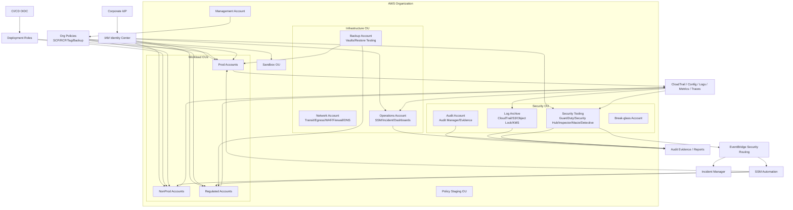

---

## 20. How to Use This Architecture in Real Life

Do not implement everything in one giant program.

Use phases.

### Phase A — Visibility First

- Create account inventory.
- Enable organization CloudTrail.
- Enable AWS Config.
- Centralize logs.
- Enable GuardDuty and Security Hub.
- Create ownership tags.

### Phase B — Baseline Guardrails

- Add SCP for dangerous actions.
- Protect audit/security services.
- Restrict Regions.
- Harden root/break-glass.
- Configure IAM Identity Center.
- Establish account vending.

### Phase C — Evidence and Findings

- Build Security Hub workflow.
- Build Config conformance packs.
- Create finding SLA.
- Create exception registry.
- Configure Audit Manager where needed.

### Phase D — Operational Excellence

- Define service telemetry contract.
- Build dashboards and alarms.
- Add SLOs for critical services.
- Enable Systems Manager fleet control.
- Standardize patch windows.

### Phase E — Response and Recovery

- Build EventBridge automation.
- Add safe remediation.
- Test incident response.
- Configure backup governance.
- Run restore tests.

### Phase F — Continuous Improvement

- Policy as code.
- Attack path prioritization.
- Game days.
- Post-incident control updates.
- Quarterly access/control review.

---

## 21. The Real Top 1% Skill

The top 1% AWS engineer is not the person who can name the most AWS services.

It is the person who can answer these questions under pressure:

1. What is the blast radius?
2. Which identity made the change?
3. Which boundary should have stopped it?
4. Which log proves what happened?
5. Which finding matters first?
6. Which remediation is safe?
7. Which exception is legitimate?
8. Which control failed?
9. Can we recover?
10. Can we prove it?

This is why the series was structured the way it was.

We did not start with GuardDuty.

We started with boundaries.

Then identity.

Then audit.

Then data protection.

Then detection.

Then automation.

Then infrastructure controls.

Then observability.

Then operations.

Then compliance.

Then policy as code.

Finally, architecture.

That order matters because production cloud security is not a list of tools. It is an operating system of controls.

---

## 22. Final Checklist for Architecture Review

Use this before approving a serious AWS platform.

### Boundary

- [ ] Are accounts separated by risk and ownership?
- [ ] Are OUs based on control requirements?
- [ ] Are SCP/RCP guardrails scoped and tested?
- [ ] Is account movement controlled?

### Identity

- [ ] Is human access federated?
- [ ] Are workloads using temporary credentials?
- [ ] Is privileged access time-bound and attributable?
- [ ] Is `iam:PassRole` constrained?
- [ ] Are trust policies hardened?

### Audit

- [ ] Is CloudTrail organization-wide and protected?
- [ ] Is Config enabled and aggregated?
- [ ] Is log archive protected from workload admins?
- [ ] Are data events enabled for sensitive resources?

### Data Protection

- [ ] Is data classified?
- [ ] Are KMS keys governed?
- [ ] Are secrets rotated and audited?
- [ ] Is sensitive data discovery configured?

### Detection

- [ ] Are GuardDuty/Security Hub/Inspector/Macie enabled where appropriate?
- [ ] Are findings routed to owners?
- [ ] Is priority context-aware?
- [ ] Are suppression and exception governed?

### Response

- [ ] Are critical findings escalated?
- [ ] Are containment automations safe and tested?
- [ ] Are incident runbooks linked?
- [ ] Is evidence preserved?

### Network

- [ ] Are ingress and egress controlled?
- [ ] Are private endpoints used for sensitive access?
- [ ] Are WAF/firewall/DNS controls centrally governed?
- [ ] Are network logs retained and queryable?

### Observability

- [ ] Does each critical service have SLIs/SLOs?
- [ ] Are metrics/logs/traces correlated?
- [ ] Are dashboards audience-specific?
- [ ] Are alarms actionable?

### Operations

- [ ] Is fleet managed through Systems Manager?
- [ ] Is patch compliance measured?
- [ ] Is Session Manager access controlled/logged?
- [ ] Are maintenance windows planned?

### Recovery

- [ ] Are backups policy-driven?
- [ ] Are vaults protected?
- [ ] Are restores tested?
- [ ] Are KMS dependencies recoverable?

### Compliance

- [ ] Are controls mapped to evidence?
- [ ] Are exceptions versioned and expiring?
- [ ] Is Audit Manager or equivalent used where useful?
- [ ] Does audit feedback become engineering backlog?

---

## 23. Seri Selesai

Ini adalah **Part 072**, bagian terakhir dari seri:

```text
Learn AWS Security, Monitoring and Management
```

Seri ini selesai di sini.

Jika materi ini dibundel, urutan akhir yang benar adalah:

```text
learn-aws-security-monitoring-management-part-001-cloud-security-operating-model.mdx
...
learn-aws-security-monitoring-management-part-072-final-production-grade-reference-architecture.mdx
```

---

## References

- AWS Security Reference Architecture: https://docs.aws.amazon.com/prescriptive-guidance/latest/security-reference-architecture/introduction.html
- AWS SRA — Log Archive account: https://docs.aws.amazon.com/prescriptive-guidance/latest/security-reference-architecture/log-archive.html
- AWS SRA — Security Tooling account: https://docs.aws.amazon.com/prescriptive-guidance/latest/security-reference-architecture/security-tooling.html
- AWS SRA — Apply security services across your AWS organization: https://docs.aws.amazon.com/prescriptive-guidance/latest/security-reference-architecture/security-services.html
- AWS Control Tower: https://docs.aws.amazon.com/controltower/latest/userguide/what-is-control-tower.html
- AWS Well-Architected Framework — Security Pillar: https://docs.aws.amazon.com/wellarchitected/latest/security-pillar/welcome.html
- AWS Well-Architected Framework — Operational Excellence Pillar: https://docs.aws.amazon.com/wellarchitected/latest/operational-excellence-pillar/welcome.html
- AWS Organizations — Service control policies: https://docs.aws.amazon.com/organizations/latest/userguide/orgs_manage_policies_scps.html
- AWS Config — Conformance Packs: https://docs.aws.amazon.com/config/latest/developerguide/conformance-packs.html
- AWS Audit Manager: https://docs.aws.amazon.com/audit-manager/latest/userguide/what-is.html
