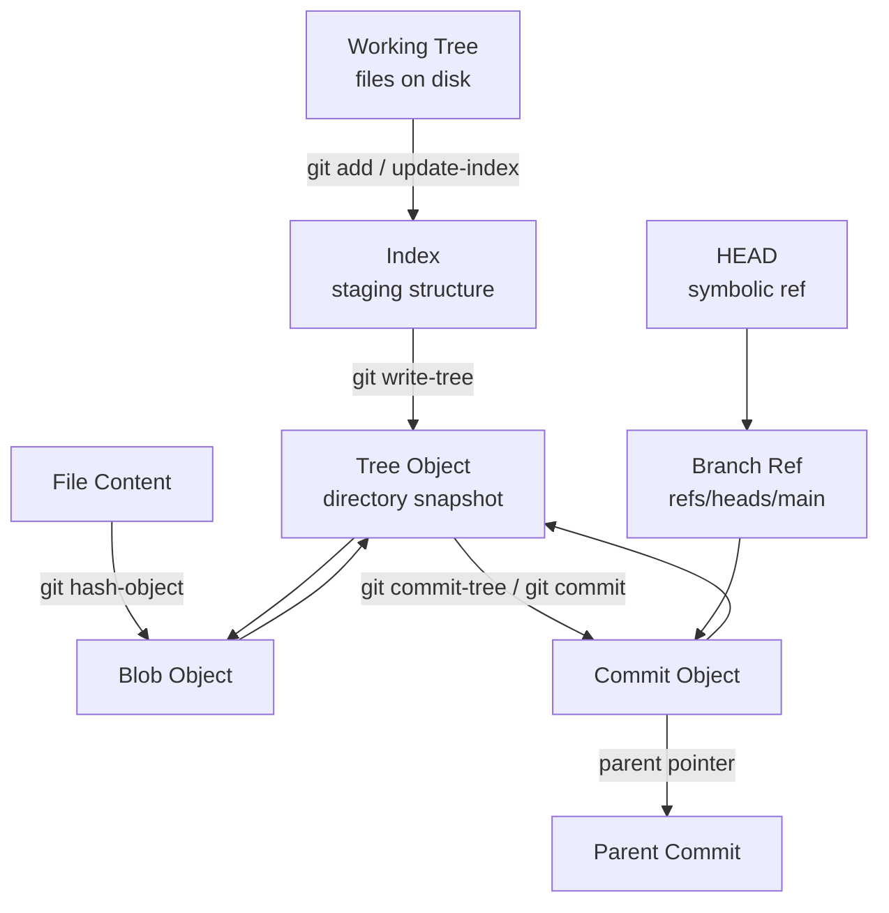
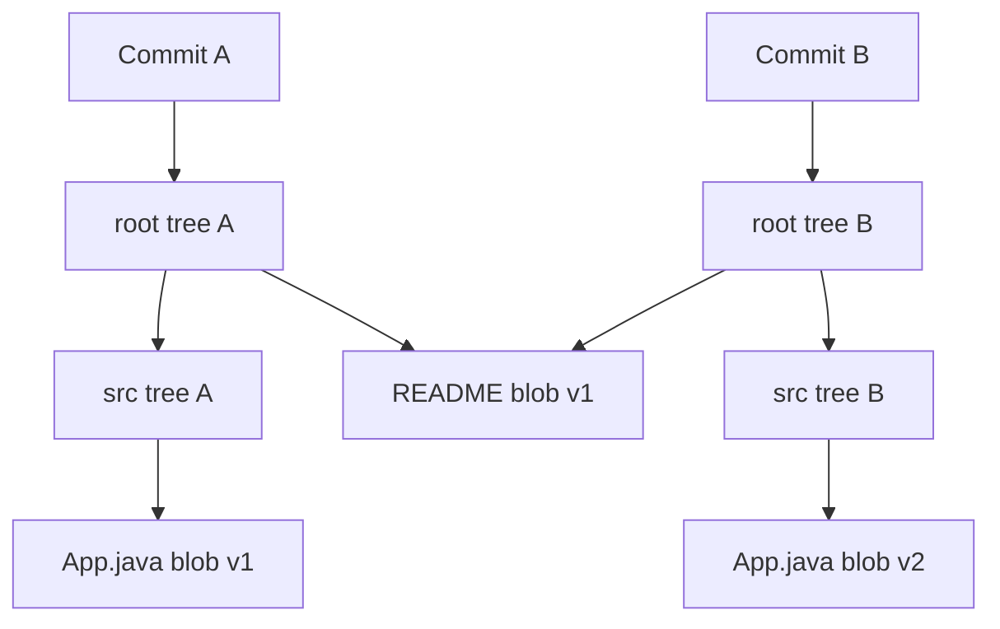
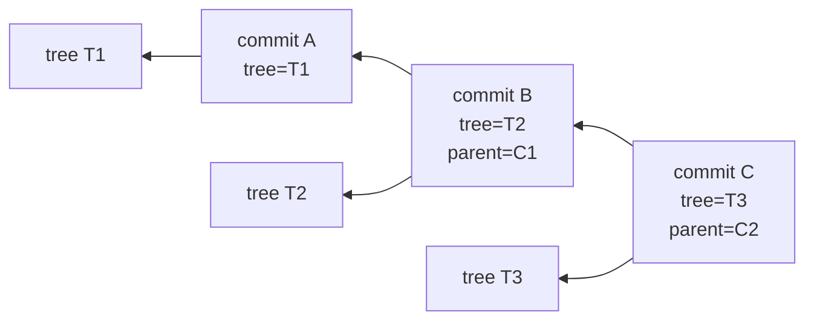
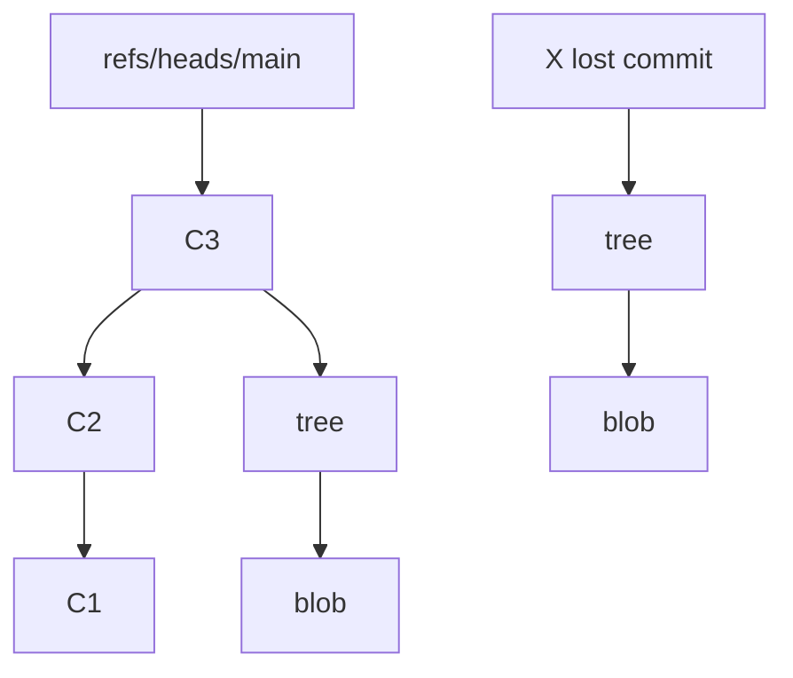
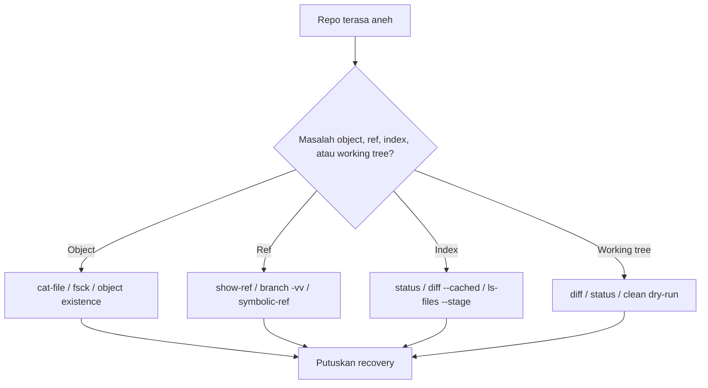
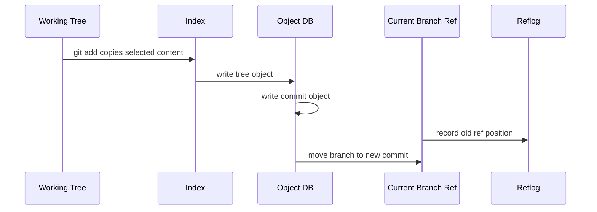

# Part 001 — Git as a Content-Addressed Database

> Target: setelah part ini, kamu tidak lagi melihat Git sebagai folder sync atau sekadar alat `commit/push/pull`. Kamu akan melihat Git sebagai **database immutable berbasis content address**, dengan branch/tag sebagai pointer, dan command Git sebagai operasi terhadap object graph.

Part ini sengaja dimulai dari model internal, karena hampir semua skill advanced Git turun dari satu ide: **Git menyimpan object, memberi nama object berdasarkan isi, lalu menghubungkan object-object itu menjadi graph histori.**

Jika kamu memahami ini, command seperti `reset`, `rebase`, `cherry-pick`, `merge`, `reflog`, `fsck`, `gc`, `packfile`, dan `partial clone` menjadi jauh lebih masuk akal.

---

## 1. Premis Utama

Git bukan terutama sistem folder.

Git adalah:

1. **object database** di dalam `.git/objects`,
2. **reference database** di dalam `.git/refs` dan file ref terkait,
3. **index/staging structure** di `.git/index`,
4. **working tree materializer** yang menulis snapshot ke disk,
5. **graph engine** untuk ancestry, reachability, merge-base, diff, dan history traversal.

Model paling penting:

```text
content -> object id -> object database -> graph -> refs -> working tree
```

Bukan:

```text
folder -> upload -> server -> sync
```

Git bisa bekerja offline bukan karena ada cache ajaib, tetapi karena repository lokal punya object database lengkap atau sebagian yang cukup untuk operasi yang kamu lakukan.

---

## 2. Content-Addressed Database

Dalam sistem biasa, file diberi alamat oleh lokasi:

```text
src/main/java/App.java
```

Dalam content-addressed system, data diberi alamat oleh isi:

```text
hash(type + size + content)
```

Artinya:

- isi sama menghasilkan object id sama,
- isi berubah menghasilkan object id baru,
- object lama tidak diedit di tempat,
- history dibangun dengan membuat object baru dan memindahkan pointer.

Git secara historis memakai SHA-1 sebagai object id untuk mayoritas repository, dan Git modern juga memiliki dukungan repository SHA-256. Secara mental model, yang penting bukan algoritma hash spesifiknya, tetapi invariant-nya: **nama object berasal dari isi object**.

### Implikasi engineering

| Implikasi | Konsekuensi praktis |
|---|---|
| Object immutable | Commit tidak “diubah”; perubahan history berarti membuat commit baru. |
| Address by content | Integritas object bisa diverifikasi dari isi. |
| Graph by reference | Commit menunjuk parent dan tree. |
| Branch mutable pointer | Branch bisa bergerak tanpa mengubah commit lama. |
| Unreachable object bisa tetap ada sementara | Recovery bisa dilakukan via reflog/dangling object sebelum pruning. |

---

## 3. Diagram Mental Model



Kamu bisa melihat Git sebagai database dengan dua jenis data besar:

1. **object immutable**, seperti blob, tree, commit, tag;
2. **reference mutable**, seperti branch, tag reference, HEAD, remote tracking branch.

Kesalahan umum engineer adalah memperlakukan branch seolah-olah berisi file. Branch tidak berisi file. Branch adalah pointer ke commit. Commit menunjuk tree. Tree menunjuk blob dan tree lain.

---

## 4. Empat Object Utama Git

Git object utama:

| Object | Isi | Analogi | Mutable? |
|---|---|---|---|
| `blob` | isi file tanpa nama file | byte array | Tidak |
| `tree` | daftar entry: mode, nama, object id | direktori snapshot | Tidak |
| `commit` | pointer ke tree, parent, author, committer, message | record snapshot historis | Tidak |
| `tag` | pointer beranotasi ke object lain | release marker beridentitas | Tidak |

Perhatikan detail penting: **blob tidak menyimpan nama file**. Nama file disimpan oleh tree object.

Satu blob yang sama bisa dipakai oleh banyak path, banyak commit, banyak branch.

Contoh:

```text
same content -> same blob id
src/A.java  -> blob abc123
src/B.java  -> blob abc123
old commit  -> blob abc123
new commit  -> blob abc123
```

Jika isi file sama, object blob bisa sama walaupun path berbeda.

---

## 5. Repository Baru: Apa Isi `.git`?

Buat repository kosong:

```bash
mkdir git-db-lab
cd git-db-lab
git init
find .git -maxdepth 2 -type f -o -type d | sort
```

Secara konseptual, bagian pentingnya:

```text
.git/
  HEAD
  config
  objects/
    info/
    pack/
  refs/
    heads/
    tags/
```

Maknanya:

| Path | Fungsi |
|---|---|
| `.git/objects` | database object Git |
| `.git/refs` | pointer ke object, biasanya commit/tag |
| `.git/HEAD` | pointer ke branch saat ini, atau langsung ke commit saat detached HEAD |
| `.git/index` | staging area; belum ada sampai index dibuat |
| `.git/config` | konfigurasi repository lokal |

Pada repository baru, object database masih kosong.

---

## 6. Blob: Menyimpan Isi, Bukan File Path

Buat object blob tanpa working tree Git command high-level:

```bash
echo 'hello git database' | git hash-object --stdin
```

Command di atas hanya menghitung object id. Belum menulis ke database.

Sekarang tulis ke database:

```bash
echo 'hello git database' | git hash-object -w --stdin
```

Output-nya object id, misalnya:

```text
6f2d...<dipotong>
```

Cek object type:

```bash
git cat-file -t <object-id>
```

Output:

```text
blob
```

Cek isi:

```bash
git cat-file -p <object-id>
```

Output:

```text
hello git database
```

### Apa yang sebenarnya di-hash?

Git tidak hanya meng-hash raw content. Secara konsep, Git meng-hash:

```text
<object-type> <size>\0<content>
```

Untuk blob berisi `hello git database\n`, bentuk konseptualnya:

```text
blob 19\0hello git database\n
```

Header ini penting karena isi byte yang sama untuk tipe object berbeda tidak ambigu.

---

## 7. Tree: Nama File dan Struktur Direktori

Blob tidak tahu nama file. Tree-lah yang memberi nama.

Tree entry berisi:

```text
mode type object-id path
```

Contoh output:

```bash
git cat-file -p <tree-id>
```

```text
100644 blob 6f2d... README.md
040000 tree 91ab... src
```

Makna mode umum:

| Mode | Makna |
|---|---|
| `100644` | regular non-executable file |
| `100755` | executable file |
| `120000` | symbolic link |
| `040000` | tree/directory |
| `160000` | gitlink/submodule commit pointer |

Tree adalah snapshot direktori, bukan diff.

Jika satu file berubah di direktori dalam, Git membuat tree baru untuk direktori itu dan parent tree di atasnya, tetapi blob/tree lain yang tidak berubah tetap bisa direuse.



`README` tidak berubah, maka blob-nya bisa tetap sama.

---

## 8. Commit: Snapshot + Metadata + Parent

Commit object umumnya berisi:

```text
tree <tree-id>
parent <parent-commit-id>      # tidak ada untuk root commit
author <name> <email> <timestamp> <timezone>
committer <name> <email> <timestamp> <timezone>

<commit message>
```

Commit bukan hanya diff. Commit menunjuk satu tree snapshot utuh.

Diff yang kamu lihat dari commit biasanya dihitung dengan membandingkan tree commit itu dengan tree parent-nya.



### Commit identity sangat sensitif

Commit id berubah jika salah satu ini berubah:

- tree id,
- parent id,
- author,
- committer,
- timestamp,
- timezone,
- message,
- signature.

Karena itu `commit --amend` tidak benar-benar mengedit commit lama. Ia membuat commit baru dengan metadata/tree yang baru, lalu memindahkan branch pointer.

---

## 9. Tag Object: Release Marker yang Punya Identitas

Git punya dua bentuk tag utama:

| Jenis tag | Bentuk | Karakter |
|---|---|---|
| lightweight tag | ref langsung ke object | seperti branch yang tidak otomatis bergerak |
| annotated tag | tag object yang menunjuk object lain | punya tagger, message, dan bisa ditandatangani |

Untuk release engineering, annotated tag lebih kuat karena membawa metadata release. Signed annotated tag lebih kuat lagi untuk supply-chain integrity.

Part khusus release tag akan membahas ini lebih dalam. Untuk sekarang, cukup pegang invariant:

```text
release identity seharusnya immutable
```

Memindahkan tag release publik adalah operasi berisiko tinggi.

---

## 10. Refs: Pointer Mutable ke Object Immutable

Object Git immutable. Tapi Git tetap perlu nama manusiawi seperti `main`, `feature/payment`, `v1.2.3`.

Itulah ref.

Contoh:

```text
refs/heads/main      -> 4f9a...
refs/tags/v1.0.0     -> 93aa...
refs/remotes/origin/main -> a91c...
HEAD                 -> refs/heads/main
```

Branch adalah file pointer atau packed ref.

Coba lihat:

```bash
cat .git/HEAD
```

Biasanya:

```text
ref: refs/heads/main
```

Lihat branch ref:

```bash
cat .git/refs/heads/main
```

Isinya commit id.

### Branch bukan container

Salah:

```text
branch main berisi file-file project
```

Benar:

```text
branch main menunjuk commit
commit menunjuk tree
 tree menunjuk blob/tree
```

---

## 11. Build Commit Manual dengan Plumbing Command

Sekarang kita buat commit tanpa `git add` dan tanpa `git commit` biasa.

Tujuannya bukan supaya kamu kerja seperti ini sehari-hari, tetapi supaya model internalnya menempel.

### 11.1 Setup

```bash
mkdir git-plumbing-lab
cd git-plumbing-lab
git init
git config user.name "Git Learner"
git config user.email "learner@example.com"
```

### 11.2 Buat blob

```bash
echo 'hello from plumbing' > hello.txt
BLOB_ID=$(git hash-object -w hello.txt)
echo $BLOB_ID
```

Cek:

```bash
git cat-file -t $BLOB_ID
git cat-file -p $BLOB_ID
```

### 11.3 Masukkan blob ke index

```bash
git update-index --add --cacheinfo 100644 $BLOB_ID hello.txt
```

Saat ini working tree bukan sumber kebenaran utama untuk commit. Index sudah punya entry `hello.txt` yang menunjuk blob.

Cek index:

```bash
git ls-files --stage
```

Output konseptual:

```text
100644 <blob-id> 0 hello.txt
```

### 11.4 Tulis tree dari index

```bash
TREE_ID=$(git write-tree)
echo $TREE_ID
git cat-file -p $TREE_ID
```

Output konseptual:

```text
100644 blob <blob-id> hello.txt
```

### 11.5 Buat commit dari tree

```bash
COMMIT_ID=$(echo 'Initial commit from plumbing' | git commit-tree $TREE_ID)
echo $COMMIT_ID
git cat-file -p $COMMIT_ID
```

Commit sudah ada di object database, tetapi branch belum menunjuk ke commit itu.

### 11.6 Gerakkan branch ref

```bash
git update-ref refs/heads/main $COMMIT_ID
```

Sekarang:

```bash
git log --oneline
```

Kamu baru saja membangun commit dari object database secara manual.

---

## 12. Operasi High-Level Dipetakan ke Database Operation

| Command | Operasi internal konseptual |
|---|---|
| `git add file` | hash content file menjadi blob, update index entry |
| `git commit` | write tree dari index, buat commit object, update current branch ref |
| `git branch x` | buat ref baru menunjuk commit tertentu |
| `git checkout x` / `git switch x` | update HEAD, materialize tree ke working tree/index |
| `git reset <commit>` | pindahkan ref/HEAD dan opsional update index/working tree |
| `git merge y` | hitung merge-base, lakukan three-way merge, tulis tree, buat commit merge |
| `git rebase y` | replay commit sebagai commit baru di atas base baru |
| `git cherry-pick c` | apply patch dari commit c ke HEAD, buat commit baru |
| `git tag v1.0` | buat ref/tag object menunjuk object tertentu |

Jika command terasa rumit, tanyakan:

1. object baru apa yang dibuat?
2. pointer apa yang dipindahkan?
3. index berubah atau tidak?
4. working tree berubah atau tidak?
5. object lama masih reachable atau menjadi unreachable?

---

## 13. Reachability: Hidup, Hilang, atau Hanya Tidak Bernama?

Object bisa ada di database tetapi tidak punya nama manusiawi.

Object disebut reachable jika bisa dicapai dari ref tertentu:

```text
refs -> commit -> parent commits -> trees -> blobs
```

Diagram:



`X lost commit` mungkin masih ada di `.git/objects`, tetapi tidak reachable dari branch/tag mana pun.

Kamu bisa menemukan object seperti ini dengan:

```bash
git fsck --lost-found
```

Atau lebih sering, menemukan posisi lama branch via:

```bash
git reflog
```

Recovery akan dibahas khusus di part 028-029. Yang penting untuk part ini: **hilang dari branch belum tentu hilang dari database**.

---

## 14. Snapshot vs Diff: Perbedaan yang Sering Membingungkan

Git sering dipakai dengan UI diff, sehingga banyak orang mengira commit adalah diff.

Model yang lebih benar:

```text
commit = snapshot pointer + metadata + parent pointer
patch/diff = hasil perbandingan dua snapshot
```

Contoh:

```bash
git show <commit>
```

Git menampilkan diff karena itu berguna untuk manusia. Tetapi object commit tetap menunjuk tree snapshot.

Kenapa ini penting?

1. Merge bekerja dengan tiga snapshot: base, ours, theirs.
2. Rebase membuat commit baru karena parent berubah.
3. Cherry-pick menerapkan perubahan relatif commit ke parent-nya.
4. Revert membuat patch kebalikan berdasarkan diff commit terhadap parent.
5. Bisect mencari commit penyebab berdasarkan node DAG, bukan file timestamp.

---

## 15. Object Identity dan Rewrite History

Misal commit `A` punya id:

```text
A = hash(tree=T1, parent=P0, message="fix bug")
```

Kamu amend message:

```text
A' = hash(tree=T1, parent=P0, message="fix payment bug")
```

Tree sama, parent sama, tapi message berbeda. Commit id berubah.

Itu sebabnya setelah amend/rebase, push biasa bisa ditolak:

```text
remote branch -> A
local branch  -> A'
```

Dari sudut pandang Git, `A` dan `A'` adalah commit berbeda. Bukan versi berbeda dari object yang sama.

### Engineering invariant

> Public history rewrite berarti mengganti object graph yang sudah mungkin dipakai orang lain.

Karena itu `--force-with-lease` lebih aman daripada `--force`, tetapi tetap harus dipakai dengan protokol tim yang benar.

---

## 16. Content Addressing Tidak Sama dengan Security Sempurna

Content-addressed object memberi integritas object, bukan otomatis menyelesaikan semua problem trust.

Yang masih perlu dipikirkan:

| Problem | Kenapa content addressing belum cukup |
|---|---|
| Siapa membuat commit? | Perlu identity/signing/trust policy. |
| Apakah branch boleh dipindah? | Perlu branch protection/server policy. |
| Apakah tag release immutable? | Perlu protected tags dan governance. |
| Apakah secret pernah masuk history? | Object lama bisa tetap tersebar di clone lain. |
| Apakah dependency aman? | Commit hash membantu pinning, tapi provenance tetap perlu. |

Git object id menjawab:

```text
apakah isi object ini sama dengan nama hash-nya?
```

Bukan otomatis menjawab:

```text
apakah object ini seharusnya dipercaya?
```

---

## 17. Failure Mode: Salah Memahami Git sebagai Folder Sync

### Gejala

Engineer berkata:

- “branch saya hilang, berarti code saya hilang.”
- “saya sudah amend commit, kenapa hash berubah?”
- “kenapa force push orang lain menghapus commit saya?”
- “kenapa tag yang sama bisa menghasilkan build berbeda?”
- “kenapa file yang sama tidak diduplikasi berkali-kali di Git?”

### Root cause

Mereka belum memisahkan:

```text
object identity != reference name != working tree file
```

### Correction

Gunakan 3 pertanyaan:

1. **Object-nya masih ada?** Cek `git cat-file`, `git fsck`, `git reflog`.
2. **Ref mana yang menunjuk object itu?** Cek `git show-ref`, `git branch --contains`.
3. **Working tree sedang materialize snapshot mana?** Cek `git status`, `git rev-parse HEAD`.

---

## 18. Praktik Inspeksi Harian Level Advanced

Tambahkan command ini ke muscle memory.

### Lihat commit saat ini

```bash
git rev-parse HEAD
```

### Lihat branch symbolic HEAD

```bash
git symbolic-ref HEAD
```

Jika detached HEAD, command ini gagal. Itu signal penting.

### Lihat semua refs

```bash
git show-ref --head
```

### Lihat object type dan size

```bash
git cat-file -t <object-id>
git cat-file -s <object-id>
```

### Pretty print object

```bash
git cat-file -p <object-id>
```

### Lihat tree commit

```bash
git cat-file -p HEAD^{tree}
```

### Lihat object database loose object

```bash
find .git/objects -type f | sort | head
```

### Lihat file tracked beserta object id di index

```bash
git ls-files --stage
```

---

## 19. Mini Lab: Buktikan Blob Tidak Menyimpan Nama File

```bash
mkdir blob-name-lab
cd blob-name-lab
git init

echo 'same content' > a.txt
cp a.txt b.txt

git add a.txt b.txt
git ls-files --stage
```

Output konseptual:

```text
100644 <same-blob-id> 0 a.txt
100644 <same-blob-id> 0 b.txt
```

Kesimpulan:

```text
nama file ada di index/tree entry, bukan di blob
```

Sekarang ubah salah satu:

```bash
echo 'same content plus change' > b.txt
git add b.txt
git ls-files --stage
```

Sekarang `b.txt` menunjuk blob baru.

---

## 20. Mini Lab: Commit Id Berubah Karena Metadata

```bash
mkdir commit-identity-lab
cd commit-identity-lab
git init
git config user.name "Git Learner"
git config user.email "learner@example.com"

echo 'x' > file.txt
git add file.txt
git commit -m 'first message'
OLD=$(git rev-parse HEAD)

git commit --amend -m 'second message'
NEW=$(git rev-parse HEAD)

echo $OLD
echo $NEW
```

Walaupun file sama, commit id berubah.

Cek tree id:

```bash
git show -s --format=%T $OLD
git show -s --format=%T $NEW
```

Kemungkinan tree id sama, tetapi commit id berbeda karena metadata commit berbeda.

---

## 21. Practical Mental Model untuk Debugging

Saat repo “aneh”, jangan mulai dari command random. Mulai dari model.



Contoh mapping:

| Gejala | Kemungkinan layer |
|---|---|
| Commit tidak muncul di branch | ref/reachability |
| File staged tapi tidak masuk commit | index misunderstanding |
| `status` beda dari ekspektasi | index vs working tree mismatch |
| `push` ditolak | ref divergence |
| `checkout` overwrite warning | working tree safety |
| `rebase` conflict | graph replay + index conflict stages |

---

## 22. Git Command sebagai Database Transaction

Pola umum command Git:

```text
read current refs/index/working tree
compute object or graph operation
write objects
update index and/or working tree
move refs if operation succeeds
record reflog for ref movement
```

Contoh `git commit`:



Penting: object biasanya ditulis sebelum ref dipindah. Ini membantu atomicity konseptual: commit object harus ada sebelum branch menunjuk ke sana.

---

## 23. Common Misconception Matrix

| Misconception | Koreksi |
|---|---|
| Git menyimpan diff antar versi | Model konseptual Git menyimpan snapshot tree; diff dihitung saat dibutuhkan. |
| Branch adalah folder terpisah | Branch adalah ref/pointer ke commit. |
| Amend mengubah commit | Amend membuat commit baru dan memindahkan ref. |
| Menghapus branch menghapus commit | Hanya menghapus ref; commit bisa masih reachable dari ref lain atau reflog. |
| Tag selalu aman untuk release | Tag bisa dipindah jika tidak dilindungi; signed/protected tag lebih aman. |
| Hash hanya detail teknis | Hash adalah identity object dan dasar integritas history. |
| Working tree adalah sumber kebenaran | Untuk commit, index adalah sumber snapshot yang akan ditulis. |

---

## 24. Checklist: Kamu Paham Part Ini Jika Bisa Menjawab

1. Kenapa dua file berbeda nama bisa punya blob id sama?
2. Kenapa `git commit --amend` mengubah commit hash walaupun isi file tidak berubah?
3. Apa beda object immutable dan ref mutable?
4. Kenapa commit yang tidak ada di branch belum tentu hilang?
5. Kenapa branch bukan folder?
6. Kenapa tag release publik tidak boleh sembarangan dipindah?
7. Apa peran index dalam membangun tree object?
8. Apa yang dilakukan `git write-tree`?
9. Apa yang dilakukan `git commit-tree`?
10. Kenapa diff bukan bentuk utama commit object?

Jika jawabanmu masih kabur, ulangi lab plumbing sampai kamu bisa membuat commit manual tanpa `git add` dan `git commit` biasa.

---

## 25. Latihan Lanjutan

### Latihan 1 — Object Inspection

Buat repo kecil dengan tiga commit. Untuk setiap commit:

```bash
git show -s --format='commit=%H tree=%T parent=%P subject=%s'
```

Lalu inspect tree:

```bash
git cat-file -p <tree-id>
```

Tulis mapping:

```text
commit -> tree -> blob
```

### Latihan 2 — Duplicate Blob

Buat dua file dengan isi sama, commit, lalu buktikan blob id sama dengan:

```bash
git ls-tree -r HEAD
```

### Latihan 3 — Rewrite Identity

Amend commit message, lalu bandingkan:

```bash
git show -s --format=fuller <old>
git show -s --format=fuller <new>
```

Identifikasi field mana yang berubah.

### Latihan 4 — Lost Commit Simulation

```bash
git checkout -b temp
 echo 'temp work' > temp.txt
 git add temp.txt
 git commit -m 'temp commit'
TEMP=$(git rev-parse HEAD)
git checkout main
git branch -D temp
```

Cek apakah commit masih bisa dibaca:

```bash
git cat-file -p $TEMP
```

Lalu pulihkan:

```bash
git branch recovered $TEMP
```

---

## 26. Production Engineering Takeaways

Untuk kerja tim serius, Git harus diperlakukan sebagai sistem state dan audit, bukan sekadar command-line utility.

Invariants yang harus dibawa ke part berikutnya:

1. **Commit adalah immutable historical record.**
2. **Branch adalah mutable pointer.**
3. **Tag release sebaiknya immutable by policy.**
4. **Object id berasal dari isi object.**
5. **Index menentukan snapshot berikutnya.**
6. **Working tree hanya materialisasi untuk manusia dan tools.**
7. **History rewrite membuat graph baru.**
8. **Recovery sering mungkin selama object belum dipruning dan ref lama tercatat.**

Part 002 akan memperdalam layer paling sering menyebabkan kesalahan: **Working Tree, Index, dan HEAD**.

---

## 27. Referensi Resmi

- Git documentation: `git`, `git-hash-object`, `git-cat-file`, `git-write-tree`, `git-update-index`, `git-commit-tree`.
- Pro Git, Chapter 10.1: Git Internals — Plumbing and Porcelain.
- Pro Git, Chapter 10.2: Git Internals — Git Objects.
- Git data model documentation: blob, tree, commit, tag, object IDs.
- Pro Git, Git References.

