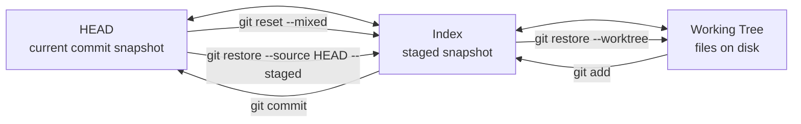
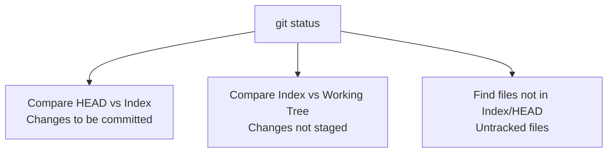
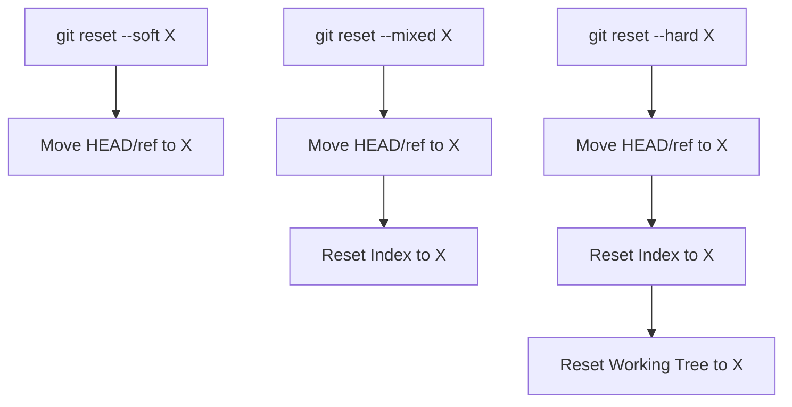
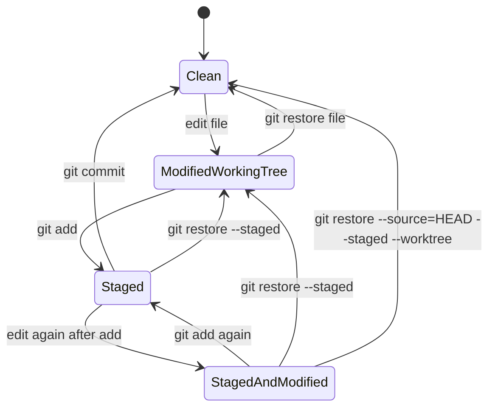

# Part 002 — The Three Trees: Working Tree, Index, HEAD

> Target: setelah part ini, kamu bisa memprediksi efek `add`, `commit`, `reset`, `restore`, `checkout`, `switch`, `stash`, dan sebagian besar conflict state tanpa trial-and-error.

Git terasa sulit bukan karena command-nya terlalu banyak, tetapi karena banyak engineer tidak punya model state yang stabil.

Model state paling penting di Git adalah **tiga tree**:

1. **HEAD** — snapshot commit saat ini.
2. **Index** — snapshot yang disiapkan untuk commit berikutnya.
3. **Working Tree** — file nyata di disk yang sedang kamu edit.

Pro Git menyebut reset/checkout lebih mudah dipahami jika Git dilihat sebagai content manager dari tiga tree. Part ini membangun mental model itu sampai bisa dipakai untuk debugging harian.

---

## 1. Ringkasan Mental Model

```text
HEAD         = last committed snapshot
Index        = proposed next committed snapshot
Working Tree = editable files on disk
```

Atau dalam bahasa operasional:

```text
HEAD         : apa yang sudah resmi tercatat
Index        : apa yang akan masuk commit berikutnya
Working Tree : apa yang sedang ada di folder kerja
```

Diagram:



Kunci advanced-nya: **`git status` bukan satu perbandingan. Ia membaca beberapa perbandingan sekaligus.**

---

## 2. HEAD: Snapshot Terakhir yang Sedang Kamu Berdiri di Atasnya

HEAD biasanya adalah symbolic ref ke branch saat ini:

```bash
cat .git/HEAD
```

Output umum:

```text
ref: refs/heads/main
```

Makna:

```text
HEAD -> refs/heads/main -> <commit-id>
```

Dalam kondisi detached HEAD:

```text
HEAD -> <commit-id>
```

Bukan ke branch.

### HEAD bukan selalu branch

| Kondisi | HEAD menunjuk ke |
|---|---|
| Normal branch checkout | symbolic ref ke branch |
| Detached HEAD | commit langsung |
| During rebase/cherry-pick/merge | bisa disertai state tambahan di `.git/` |

Cek commit HEAD:

```bash
git rev-parse HEAD
```

Cek apakah symbolic:

```bash
git symbolic-ref HEAD
```

Jika detached, command ini gagal. Itu bukan bug. Itu informasi.

---

## 3. Index: Snapshot Kandidat untuk Commit Berikutnya

Index sering disebut staging area, tapi istilah itu terlalu sempit.

Index adalah struktur data yang menyimpan daftar path tracked beserta metadata dan object id yang akan membentuk tree commit berikutnya.

Cek index:

```bash
git ls-files --stage
```

Output konseptual:

```text
100644 83db48f84ec878fbfb30b46d16630e944e34f205 0 README.md
100644 1f7a7a472abf3dd9643fd615f6da379c4acb3e3a 0 src/App.java
```

Kolomnya:

```text
mode object-id stage path
```

`stage` normal adalah `0`. Saat conflict, index bisa punya stage `1`, `2`, `3`.

| Stage | Makna saat conflict |
|---:|---|
| 1 | common ancestor/base |
| 2 | ours |
| 3 | theirs |

Conflict index akan dibahas detail di part 006 dan part 021. Untuk sekarang, ingat: **index bukan sekadar daftar file staged; index bisa menyimpan state merge yang belum resolved.**

---

## 4. Working Tree: Materialisasi Snapshot untuk Manusia dan Tools

Working tree adalah file di disk:

```text
README.md
src/App.java
pom.xml
```

Ini tempat editor, compiler, formatter, generator, dan test runner bekerja.

Tetapi working tree bukan snapshot yang otomatis akan dicommit.

Agar perubahan working tree masuk kandidat commit, kamu harus meng-copy content dari working tree ke index:

```bash
git add <path>
```

`git add` bukan “menandai file”. Ia memperbarui index entry berdasarkan isi file saat command dijalankan.

Jika setelah `git add` kamu mengedit file lagi, index dan working tree akan berbeda.

---

## 5. `git status` sebagai Dua Diff Utama

Secara mental model:

```text
git status = diff(HEAD, Index) + diff(Index, Working Tree) + untracked scan
```

Diagram:



Output Git:

```text
Changes to be committed
```

Berarti:

```text
HEAD != Index
```

Output:

```text
Changes not staged for commit
```

Berarti:

```text
Index != Working Tree
```

Output:

```text
Untracked files
```

Berarti:

```text
path tidak ada di HEAD/index, tapi ada di working tree
```

---

## 6. Lab Dasar: Satu File, Tiga State

```bash
mkdir three-trees-lab
cd three-trees-lab
git init
git config user.name "Git Learner"
git config user.email "learner@example.com"

echo 'v1' > app.txt
git add app.txt
git commit -m 'initial version'
```

Sekarang semua sama:

```text
HEAD         app.txt = v1
Index        app.txt = v1
Working Tree app.txt = v1
```

Cek:

```bash
git status
```

Harus clean.

---

## 7. Modify Working Tree Saja

```bash
echo 'v2' > app.txt
git status
```

State:

```text
HEAD         app.txt = v1
Index        app.txt = v1
Working Tree app.txt = v2
```

Output:

```text
Changes not staged for commit
```

Kenapa?

```text
Index != Working Tree
HEAD == Index
```

Cek diff:

```bash
git diff
```

`git diff` default membandingkan:

```text
Index vs Working Tree
```

---

## 8. Stage Perubahan

```bash
git add app.txt
git status
```

State:

```text
HEAD         app.txt = v1
Index        app.txt = v2
Working Tree app.txt = v2
```

Output:

```text
Changes to be committed
```

Kenapa?

```text
HEAD != Index
Index == Working Tree
```

Cek staged diff:

```bash
git diff --cached
# atau
git diff --staged
```

Ini membandingkan:

```text
HEAD vs Index
```

---

## 9. Edit Lagi Setelah Staged

```bash
echo 'v3' > app.txt
git status
```

State:

```text
HEAD         app.txt = v1
Index        app.txt = v2
Working Tree app.txt = v3
```

Sekarang file yang sama bisa muncul di dua section:

```text
Changes to be committed
Changes not staged for commit
```

Bukan bug.

Artinya:

```text
HEAD -> Index      : v1 ke v2 staged
Index -> Worktree  : v2 ke v3 unstaged
```

Cek:

```bash
git diff --cached
```

Menampilkan `v1 -> v2`.

```bash
git diff
```

Menampilkan `v2 -> v3`.

Ini salah satu skill paling penting: **satu path bisa punya staged change dan unstaged change bersamaan**.

---

## 10. Commit Hanya Mengambil Index

```bash
git commit -m 'stage v2'
```

Apa yang masuk commit?

Bukan `v3`.

Yang masuk commit adalah index saat commit dibuat:

```text
HEAD baru    app.txt = v2
Index        app.txt = v2
Working Tree app.txt = v3
```

Setelah commit:

```bash
git status
```

Masih ada:

```text
Changes not staged for commit
```

Karena working tree `v3` belum staged.

### Invariant

> `git commit` menulis snapshot dari index, bukan snapshot otomatis dari working tree.

Kecuali kamu memakai shortcut seperti `git commit -a`, yang lebih dulu memperbarui index untuk tracked files tertentu. Bahkan di sana, commit tetap dari index.

---

## 11. `git add` sebagai Copy Operation

Mental model yang lebih benar:

```text
git add path = copy current working tree content of path into index
```

Bukan:

```text
git add path = remember this file for later dynamically
```

Konsekuensi:

```bash
echo 'v4' > app.txt
git add app.txt
echo 'v5' > app.txt
git commit -m 'commit v4'
```

Commit berisi `v4`, bukan `v5`.

---

## 12. Reset: Memindahkan HEAD, Index, dan Working Tree Secara Bertahap

`git reset` paling mudah dipahami sebagai operasi tiga langkah:

1. pindahkan HEAD/current branch,
2. opsional update index,
3. opsional update working tree.

Tabel:

| Command | HEAD/current branch | Index | Working Tree | Risiko |
|---|---|---|---|---|
| `git reset --soft <commit>` | pindah | tidak berubah | tidak berubah | rendah, tapi history berubah |
| `git reset --mixed <commit>` | pindah | disamakan ke commit | tidak berubah | sedang |
| `git reset --hard <commit>` | pindah | disamakan ke commit | disamakan ke commit | tinggi, bisa membuang kerja lokal |

Default `git reset <commit>` adalah `--mixed`.

### Diagram reset



### Rule of thumb

- Mau undo commit tapi simpan staged changes? `--soft`.
- Mau undo commit dan jadikan perubahan unstaged? `--mixed`.
- Mau buang semuanya dan cocokkan folder ke commit tertentu? `--hard`, hati-hati.

---

## 13. Reset File-Level vs Commit-Level

Command ini:

```bash
git reset HEAD -- app.txt
```

atau modern equivalent:

```bash
git restore --staged app.txt
```

Tidak memindahkan branch HEAD secara historis.

Ia mengubah index path tersebut agar sama dengan HEAD.

State sebelum:

```text
HEAD         app.txt = v1
Index        app.txt = v2
Working Tree app.txt = v2
```

Setelah `git restore --staged app.txt`:

```text
HEAD         app.txt = v1
Index        app.txt = v1
Working Tree app.txt = v2
```

Perubahan masih ada di working tree, tapi tidak staged.

---

## 14. Restore: Command Modern untuk Index/Working Tree

`git restore` memisahkan sebagian fungsi lama `checkout` agar lebih eksplisit.

### Unstage file

```bash
git restore --staged app.txt
```

Makna:

```text
copy from HEAD to Index for app.txt
```

### Buang perubahan working tree file

```bash
git restore app.txt
```

Makna default:

```text
copy from Index to Working Tree for app.txt
```

Jika index punya versi staged, working tree akan dikembalikan ke versi index, bukan selalu HEAD.

### Buang staged dan unstaged sekaligus ke HEAD

```bash
git restore --source=HEAD --staged --worktree app.txt
```

Makna:

```text
copy from HEAD to Index and Working Tree
```

---

## 15. Checkout dan Switch

`checkout` historis melakukan banyak hal:

- pindah branch,
- checkout commit detached,
- restore file path,
- buat branch baru.

Git modern memperkenalkan command yang lebih fokus:

| Kebutuhan | Command modern |
|---|---|
| pindah branch | `git switch <branch>` |
| buat dan pindah branch | `git switch -c <branch>` |
| restore file | `git restore <path>` |
| restore staged file | `git restore --staged <path>` |

`checkout` masih sangat umum, tetapi untuk clarity workflow tim, `switch` dan `restore` lebih eksplisit.

---

## 16. `git commit -a`: Shortcut yang Sering Disalahpahami

```bash
git commit -a -m 'update tracked files'
```

Ini melakukan:

```text
update index untuk tracked modified/deleted files
lalu commit index
```

Yang tidak dilakukan:

- menambahkan untracked file baru,
- otomatis memilih partial hunk,
- mengabaikan index sebagai sumber commit.

Contoh:

```bash
echo 'new' > new.txt
git commit -a -m 'try commit new file'
```

`new.txt` tidak masuk commit karena untracked.

---

## 17. Untracked Files: Di Luar Tiga Tree Git Tracked

Untracked file ada di working tree, tetapi tidak ada di HEAD dan tidak ada di index.

```text
HEAD         tidak tahu
Index        tidak tahu
Working Tree punya file
```

`git reset --hard` tidak menghapus untracked file.

Untuk melihat apa yang akan dihapus:

```bash
git clean -nd
```

Untuk menghapus untracked file:

```bash
git clean -fd
```

Untuk juga menghapus ignored file:

```bash
git clean -fdx
```

Gunakan dry-run dulu. `clean -fdx` bisa menghapus build cache, dependency folder, generated files, dan local artifacts.

---

## 18. `git diff` Family Berdasarkan Tiga Tree

| Command | Membandingkan | Pertanyaan yang dijawab |
|---|---|---|
| `git diff` | Index vs Working Tree | Apa yang saya ubah tapi belum stage? |
| `git diff --staged` | HEAD vs Index | Apa yang akan masuk commit? |
| `git diff HEAD` | HEAD vs Working Tree | Total perubahan sejak commit terakhir? |
| `git diff <A> <B>` | Tree A vs Tree B | Apa beda dua snapshot? |
| `git diff --name-status` | path-level status | File mana berubah/ditambah/dihapus? |

Skill penting sebelum commit:

```bash
git diff
git diff --staged
git status --short
```

Jangan commit tanpa tahu beda antara unstaged dan staged.

---

## 19. Status Short Format untuk Engineer yang Sering Review State

```bash
git status --short
```

Output dua kolom:

```text
XY path
```

- `X` = status index terhadap HEAD.
- `Y` = status working tree terhadap index.

Contoh:

```text
 M app.txt
M  config.yml
MM service.java
?? scratch.txt
```

Makna:

| Output | Makna |
|---|---|
| ` M app.txt` | modified di working tree, belum staged |
| `M  config.yml` | modified di index, staged |
| `MM service.java` | staged modified, lalu dimodifikasi lagi di working tree |
| `?? scratch.txt` | untracked |

Ini format yang sangat berguna untuk script/triage manual.

---

## 20. Partial Staging: Kenapa Index Membuat Commit Craftsmanship Mungkin

Tanpa index, partial commit jauh lebih sulit.

Dengan index, kamu bisa punya:

```text
Working Tree: semua perubahan lokal
Index       : subset perubahan yang koheren untuk commit berikutnya
HEAD        : baseline
```

Gunakan:

```bash
git add -p
```

atau:

```bash
git commit -p
```

Contoh use case:

- satu file berisi bug fix dan refactor kecil,
- kamu ingin commit bug fix dulu,
- refactor masuk commit berikutnya.

Mental model:

```text
pilih hunk -> copy hunk itu ke index -> commit index
```

Bukan sekadar “pilih bagian file untuk commit”. Secara internal, index menyimpan versi file yang bisa berbeda dari working tree.

---

## 21. File yang Sama, Tiga Versi Berbeda

Git bisa menyimpan tiga versi path yang sama:

```text
HEAD         service.java = version A
Index        service.java = version B
Working Tree service.java = version C
```

Ini bukan edge case. Ini workflow normal saat partial staging.

Cek dengan:

```bash
git show HEAD:service.java     # versi HEAD
git show :service.java         # versi index stage 0
cat service.java               # versi working tree
```

Jika file belum ada di index atau konflik, command bisa berbeda perilakunya.

---

## 22. Conflict State: Index Bisa Menampung Tiga Stage

Saat merge conflict, Git tidak bisa membuat satu stage-0 index entry untuk path tertentu.

Ia menyimpan beberapa entry:

```bash
git ls-files --stage conflicted.txt
```

Output konseptual:

```text
100644 <base>   1 conflicted.txt
100644 <ours>   2 conflicted.txt
100644 <theirs> 3 conflicted.txt
```

Makna:

```text
stage 1 = merge base
stage 2 = ours
stage 3 = theirs
```

Setelah kamu resolve file dan menjalankan:

```bash
git add conflicted.txt
```

Git mengganti stage 1/2/3 dengan stage 0 resolved version.

Ini alasan `git add` dipakai setelah resolve conflict: bukan karena “menambahkan file”, tetapi karena kamu menulis resolved version ke index.

---

## 23. Checkout Branch: Mengganti HEAD, Index, dan Working Tree

Saat kamu pindah branch:

```bash
git switch feature-x
```

Git perlu:

1. memindahkan HEAD ke branch target,
2. mengupdate index ke tree target,
3. mengupdate working tree agar cocok dengan index target,
4. melindungi perubahan lokal yang bisa tertimpa.

Jika ada local changes yang akan overwritten, Git menolak:

```text
error: Your local changes to the following files would be overwritten by checkout
```

Ini bukan gangguan. Ini safety guard.

### Kenapa kadang pindah branch boleh walau ada perubahan lokal?

Karena perubahan lokal tidak konflik dengan perbedaan branch target.

Git bisa membawa perubahan working tree melintasi checkout jika aman.

Tetapi untuk workflow tim, jangan bergantung pada ini. Lebih baik state bersih sebelum operasi graph besar:

```bash
git status
git stash push -m 'wip before switching'
# atau commit WIP di branch sendiri
```

---

## 24. Detached HEAD dalam Three Trees

Detached HEAD berarti HEAD menunjuk commit langsung, bukan branch.

```bash
git switch --detach <commit>
```

State:

```text
HEAD -> commit X
Index -> tree of X
Working Tree -> materialized tree of X
```

Jika kamu commit dalam detached HEAD:

```text
new commit dibuat
HEAD menunjuk new commit
belum ada branch yang menunjuk new commit
```

Commit itu bisa “hilang dari pandangan” jika kamu pindah branch, tapi biasanya masih bisa dipulihkan via reflog.

Safe protocol:

```bash
git switch -c investigation/<topic>
```

sebelum membuat commit penting.

---

## 25. Stash dalam Three Trees

`git stash` menyimpan perubahan lokal ke commit internal khusus, lalu membersihkan working tree/index sesuai mode.

Secara mental model:

```text
stash = simpan perbedaan index dan working tree agar bisa diterapkan lagi nanti
```

Gunakan eksplisit:

```bash
git stash push -m 'wip before rebase'
```

Include untracked:

```bash
git stash push -u -m 'wip including untracked'
```

Cek stash:

```bash
git stash list
git stash show -p stash@{0}
```

Stash akan dibahas lebih dalam di part 030. Untuk sekarang, pahami bahwa stash bukan clipboard ajaib. Ia adalah object/commit-like state di database Git.

---

## 26. Safe Undo Decision Table

| Tujuan | Command | Layer yang berubah |
|---|---|---|
| Unstage file, simpan isi di disk | `git restore --staged <path>` | Index |
| Buang unstaged change, kembali ke index | `git restore <path>` | Working Tree |
| Buang staged + unstaged untuk file | `git restore --source=HEAD --staged --worktree <path>` | Index + Working Tree |
| Undo commit terakhir tapi simpan staged | `git reset --soft HEAD~1` | HEAD/ref |
| Undo commit terakhir jadi unstaged | `git reset --mixed HEAD~1` | HEAD/ref + Index |
| Buang commit dan local changes | `git reset --hard HEAD~1` | HEAD/ref + Index + Working Tree |
| Undo public commit safely | `git revert <commit>` | New commit dibuat |

Sebelum destructive operation:

```bash
git status
git branch backup/$(date +%Y%m%d-%H%M%S)
```

Backup branch murah karena hanya ref pointer.

---

## 27. Failure Mode: `reset --hard` Tanpa Memahami Untracked

Misal:

```bash
git reset --hard
```

Ini menyamakan HEAD, index, dan tracked working tree.

Tapi untracked file tetap ada.

Engineer kadang mengira repo sudah “bersih total”, padahal:

```bash
git status --ignored
```

masih menunjukkan generated atau untracked files.

Untuk clean total:

```bash
git reset --hard
git clean -fd
```

Untuk termasuk ignored:

```bash
git clean -fdx
```

Gunakan `-n` dulu:

```bash
git clean -fdxn
```

Dalam repository besar, `clean -fdx` bisa menghapus cache mahal seperti `node_modules`, `.gradle`, `target`, `build`, atau generated assets.

---

## 28. Failure Mode: Mengira `git add` Dinamis

Skenario:

```bash
echo 'A' > file.txt
git add file.txt
echo 'B' > file.txt
git commit -m 'expect B'
```

Commit berisi `A`, bukan `B`.

Karena `git add` menyalin content saat itu ke index.

Protocol sebelum commit:

```bash
git diff --staged
git diff
```

Jika `git diff` masih menampilkan perubahan penting, berarti perubahan itu belum masuk commit.

---

## 29. Failure Mode: Commit Tidak Memasukkan File Baru

Skenario:

```bash
echo 'new config' > config.local.example
git commit -a -m 'add config example'
```

File baru tidak masuk karena `commit -a` hanya memperbarui tracked files.

Cek:

```bash
git status --short
```

Jika ada:

```text
?? config.local.example
```

maka perlu:

```bash
git add config.local.example
git commit -m 'add config example'
```

---

## 30. Failure Mode: File Ada di Working Tree tapi Tidak Ada di Commit

Root cause umum:

1. file untracked,
2. file ignored,
3. perubahan belum staged,
4. staged version berbeda dari working tree,
5. commit dibuat dari index lama.

Debug checklist:

```bash
git status --short --ignored
git diff
git diff --staged
git ls-files --stage -- <path>
git check-ignore -v <path>
```

---

## 31. Engineering Protocol: Before Any Risky Operation

Sebelum rebase, reset, clean, checkout branch besar, pull dengan conflict potensial:

```bash
git status --short
git diff --stat
git diff --staged --stat
git branch backup/$(date +%Y%m%d-%H%M%S)
```

Jika ada local work:

Pilih salah satu:

1. commit kecil di branch WIP,
2. stash dengan message,
3. patch file:

```bash
git diff > /tmp/wip.patch
git diff --staged > /tmp/wip-staged.patch
```

Backup branch hampir gratis. Gunakan sebelum operasi destruktif.

---

## 32. Mermaid State: Lifecycle Perubahan File



Ini adalah state machine harian Git.

---

## 33. Command Mapping by Source and Destination

Pikirkan command sebagai copy/move antar tree.

| Command | Source | Destination |
|---|---|---|
| `git add path` | Working Tree | Index |
| `git restore path` | Index | Working Tree |
| `git restore --staged path` | HEAD | Index |
| `git restore --source=X path` | Commit/tree X | Working Tree |
| `git restore --source=X --staged path` | Commit/tree X | Index |
| `git commit` | Index | Object DB + branch ref |
| `git reset --mixed X` | Commit X | HEAD/ref + Index |
| `git reset --hard X` | Commit X | HEAD/ref + Index + Working Tree |
| `git checkout/switch branch` | Branch target commit | HEAD + Index + Working Tree |

Ini lebih stabil daripada menghafal command sebagai mantra.

---

## 34. Practical Daily Workflow yang Aman

### Saat mulai kerja

```bash
git status --short
git switch main
git pull --ff-only
git switch -c feature/<topic>
```

### Saat membentuk commit

```bash
git status --short
git add -p
git diff --staged
git commit -m '<clear message>'
```

### Saat sebelum push

```bash
git status --short
git log --oneline --decorate --graph --max-count=20
git diff origin/main...HEAD --stat
```

### Saat bingung

```bash
git status --short
git diff
git diff --staged
git rev-parse --abbrev-ref HEAD
git rev-parse HEAD
```

Jangan mulai dengan `reset --hard` kecuali kamu tahu persis layer mana yang ingin dibuang.

---

## 35. What Senior Engineers Do Differently

Senior engineer tidak sekadar hafal command. Mereka memprediksi state transition.

Sebelum menjalankan command, mereka bertanya:

1. Apakah command ini memindahkan HEAD/ref?
2. Apakah command ini mengubah index?
3. Apakah command ini mengubah working tree?
4. Apakah command ini membuat object baru?
5. Apakah command ini berpotensi membuang local-only data?
6. Apakah ada untracked/ignored file yang tidak disentuh?
7. Apakah efeknya aman untuk public history?

Dengan model ini, Git menjadi deterministic.

---

## 36. Checklist: Kamu Paham Part Ini Jika Bisa Menjawab

1. Apa beda `git diff` dan `git diff --staged`?
2. Kenapa file yang sama bisa muncul sebagai staged dan unstaged sekaligus?
3. Kenapa `git commit` tidak selalu mengambil isi file terbaru di disk?
4. Apa yang berubah pada `reset --soft`, `--mixed`, dan `--hard`?
5. Kenapa `git restore <path>` bisa mengembalikan file ke versi index, bukan HEAD?
6. Kenapa `commit -a` tidak memasukkan untracked file?
7. Apa arti dua kolom di `git status --short`?
8. Apa peran index saat conflict?
9. Kenapa `git add` dipakai setelah resolve conflict?
10. Kenapa detached HEAD commit bisa hilang dari pandangan tapi masih recoverable?

---

## 37. Latihan Terstruktur

### Latihan 1 — Tiga Versi Satu File

Buat kondisi:

```text
HEAD=A
Index=B
Working Tree=C
```

Buktikan dengan:

```bash
git show HEAD:file.txt
git show :file.txt
cat file.txt
```

### Latihan 2 — Status Short Decoding

Buat variasi output:

```text
 M
M 
MM
??
```

Untuk setiap status, tulis:

```text
HEAD vs Index = ?
Index vs Working Tree = ?
```

### Latihan 3 — Reset Matrix

Buat tiga commit. Jalankan di clone/lab terpisah:

```bash
git reset --soft HEAD~1
git reset --mixed HEAD~1
git reset --hard HEAD~1
```

Setelah setiap command, catat:

```bash
git status --short
git log --oneline --max-count=3
```

### Latihan 4 — Restore Source

Coba:

```bash
git restore --source=HEAD~1 -- app.txt
git restore --source=HEAD~1 --staged -- app.txt
git restore --source=HEAD~1 --staged --worktree -- app.txt
```

Jelaskan source dan destination masing-masing.

---

## 38. Production Takeaways

1. **Index adalah snapshot kandidat commit, bukan sekadar label staged.**
2. **`git add` adalah copy dari working tree ke index.**
3. **`git commit` selalu commit index.**
4. **`git status` membaca HEAD-vs-index dan index-vs-working-tree.**
5. **`reset` harus dipahami berdasarkan layer yang disentuh.**
6. **`restore` lebih eksplisit untuk operasi path-level.**
7. **Untracked/ignored files punya aturan terpisah.**
8. **Conflict resolution selesai saat resolved content ditulis ke index.**
9. **Sebelum operasi destruktif, buat backup ref.**
10. **Advanced Git dimulai dari state model, bukan hafalan command.**

Part 003 akan naik satu level dari state lokal ke struktur histori: **Commit Graph, DAG, and Reachability**.

---

## 39. Referensi Resmi

- Pro Git, Getting Started — What is Git?: working tree, staging area, Git directory.
- Pro Git, Git Tools — Reset Demystified: model tiga tree dan langkah `reset`.
- Git documentation: `git-reset`, `git-restore`, `git-status`, `git-diff`, `git-ls-files`.
- Git index-format documentation: format index dan entry index.

