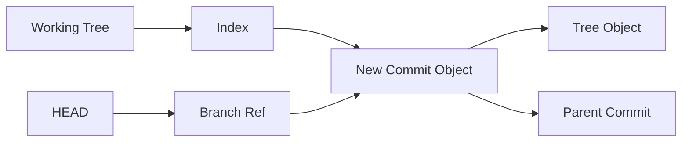
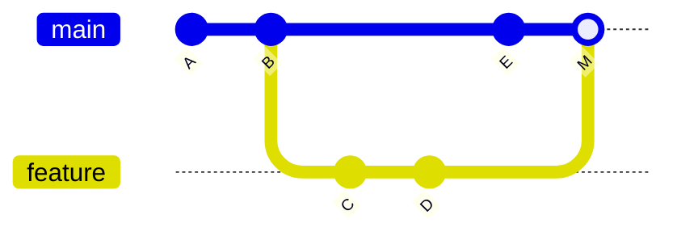
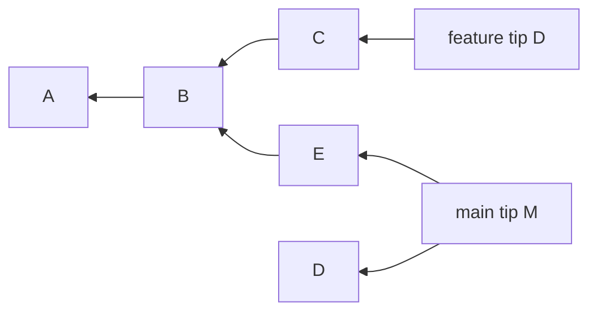
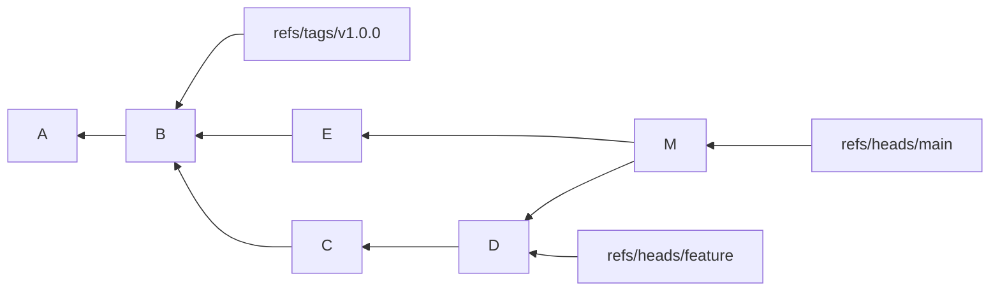
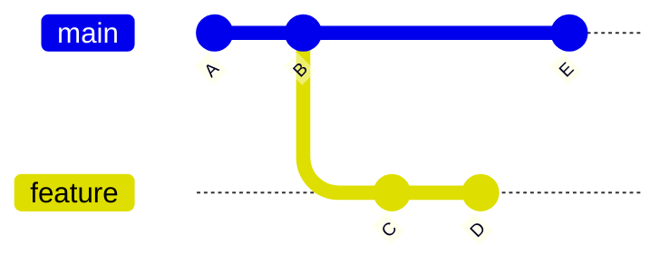
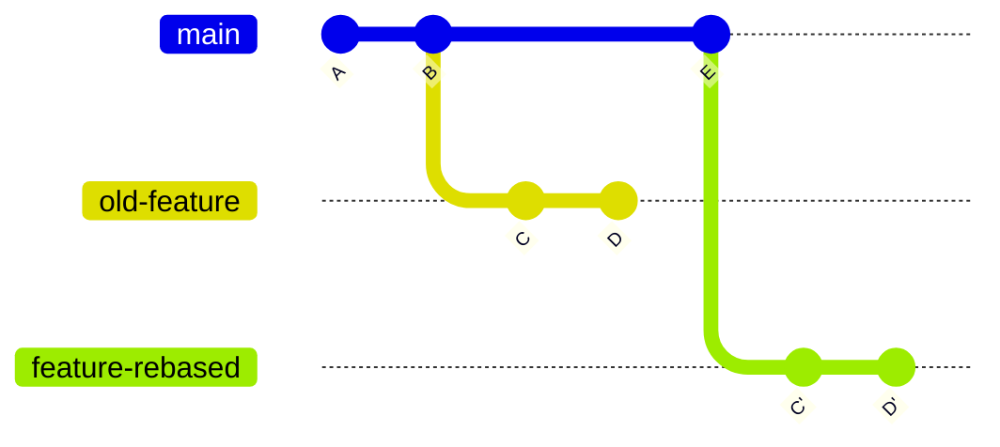
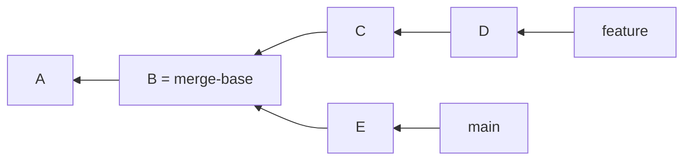
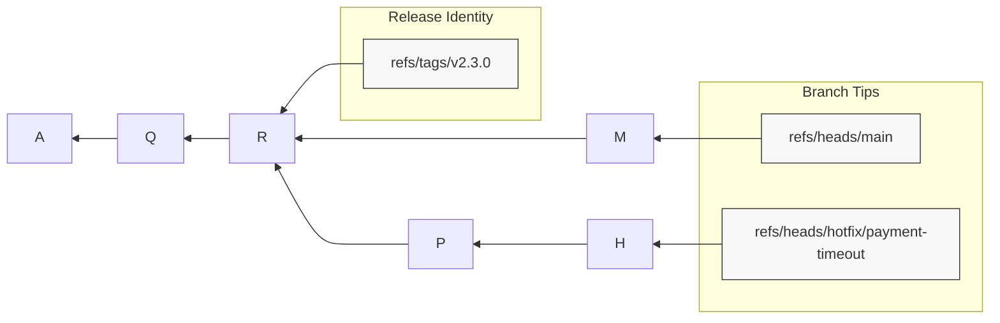

# Part 003 — Commit Graph, DAG, and Reachability

Git history is not a folder history. It is not a single timeline either.

Git history is a **directed acyclic graph** of commits. Once you internalize this, a lot of Git behavior stops feeling magical: branch comparison, merge conflicts, rebase, cherry-pick, bisect, safe branch deletion, release tagging, and even repository performance all become graph operations.

The practical skill in this part is simple but deep:

> Given any repository state, you should be able to answer: “which commits are reachable from which names, through which parent paths, and what operation would change that graph?”

That is the difference between using Git commands by memory and operating Git deliberately.

---

## 1. What This Part Builds On

From Part 001, we know Git stores immutable objects. A commit object points to:

- a tree object,
- zero or more parent commits,
- author/committer metadata,
- a message.

From Part 002, we know `HEAD`, the index, and working tree describe the current editing state.

This part focuses on the **history structure** formed by commit objects.



The important distinction:

- objects are immutable;
- references are mutable names pointing to objects;
- history is discovered by following parent links from a starting commit.

---

## 2. Commit as a Graph Node

A commit is not “a diff”. A commit is a snapshot pointer plus parent links.

A simplified commit object looks like this:

```text
tree 9f1a...
parent 2ab7...
author A Developer <a@example.com> 1783360000 +0700
committer A Developer <a@example.com> 1783360000 +0700

Explain why this change exists
```

A root commit has no parent:

```text
tree <tree-id>
author ...
committer ...

Initial commit
```

A normal commit has one parent:

```text
tree <tree-id>
parent <previous-commit-id>
...
```

A merge commit has multiple parents:

```text
tree <tree-id>
parent <main-tip-before-merge>
parent <feature-tip-before-merge>
...
```

That parent list is what makes the commit graph navigable.

---

## 3. Directed Acyclic Graph: The Actual Shape of History

Git commit history is a **DAG**:

- **directed** because each commit points to its parent or parents;
- **acyclic** because a commit cannot eventually point back to itself;
- **graph** because a commit can have multiple descendants and multiple parents.



In this graph:

- `A` is an ancestor of `B`, `C`, `D`, `E`, and `M`.
- `D` is reachable from `feature` before the merge.
- After merge commit `M`, both `E` and `D` are parents/ancestors of `M`.
- The merge commit does not “copy files from feature”; it records a new snapshot plus parent relationships.

This is why a merge can preserve topology. It says: “these two lines of development were joined here.”

---

## 4. Reachability: The Core Query Behind Many Git Commands

A commit `X` is **reachable from** commit `Y` if Git can start at `Y` and repeatedly follow parent links until it reaches `X`.

In plain language:

```text
X is reachable from Y
= X is Y itself, or an ancestor of Y.
```

Example:



From `feature tip D`, reachable commits are:

```text
D, C, B, A
```

From `main tip M`, reachable commits are:

```text
M, E, D, C, B, A
```

That means after the merge, commits from `feature` are reachable from `main`.

This is the hidden logic behind statements like:

- “this branch is already merged”;
- “this commit is included in the release”;
- “this commit is not on main yet”;
- “this branch can be safely deleted”;
- “this tag points to a release containing this fix”.

---

## 5. Refs Define Entry Points Into the Graph

Git does not scan every object and ask “which history matters?” It starts from refs.

Common refs include:

```text
refs/heads/main
refs/heads/feature/payment-retry
refs/tags/v1.4.2
refs/remotes/origin/main
HEAD
```

Each ref is an entry point into the graph.



Objects reachable from at least one important ref are usually considered live. Objects no longer reachable may still exist for a while, especially through reflogs, but they are candidates for eventual cleanup.

This is why deleting a branch does not immediately delete commits. It deletes a name. The objects may remain until Git’s retention and garbage collection rules make them eligible for pruning.

---

## 6. Branches Are Not Timelines

A branch is a pointer to a commit.

That one sentence prevents many mistakes.

A branch does not contain commits like a folder contains files. A branch points to one commit, and the branch’s history is the set of commits reachable from that tip.

```text
branch = named pointer
branch history = commits reachable from that pointer
```

When you create a new commit while `HEAD` points to `refs/heads/main`, Git creates a commit whose parent is the old `main` tip, then moves `main` to the new commit.

Before:

```text
main -> B -> A
```

After commit `C`:

```text
main -> C -> B -> A
```

The old commit `B` did not change. The ref moved.

---

## 7. Merge Commit vs Rebase: Same Intent, Different Graph

Suppose history starts like this:



### Merge

A merge creates a new commit with two parents.


The feature commits keep their identity: `C` and `D` remain `C` and `D`.

### Rebase

A rebase replays the feature changes on top of a new base, creating new commits.



The new commits may have similar patches, but they are different objects because their parent, metadata, and/or tree context differ.

Core invariant:

> Rebase does not move commits. It creates replacement commits and moves a ref to point at the replacement chain.

That is why rebasing public/shared branches is dangerous: other people may still have refs pointing to the old chain.

---

## 8. Reading the Graph From the CLI

Use commands that expose graph structure, not only file state.

### 8.1 Visual graph

```bash
git log --graph --oneline --decorate --all
```

Use this as your default orientation command.

The options mean:

| Option | Meaning |
|---|---|
| `--graph` | Draw ASCII graph topology. |
| `--oneline` | Compact each commit. |
| `--decorate` | Show refs pointing to commits. |
| `--all` | Show commits reachable from all refs, not only current `HEAD`. |

### 8.2 Raw parent links

```bash
git show --pretty=raw --no-patch HEAD
```

or:

```bash
git cat-file -p HEAD
```

Look for `parent` lines.

### 8.3 Parent list for many commits

```bash
git rev-list --parents --topo-order --all
```

Example output shape:

```text
<commit-M> <parent-E> <parent-D>
<commit-E> <parent-B>
<commit-D> <parent-C>
<commit-C> <parent-B>
<commit-B> <parent-A>
<commit-A>
```

This is a machine-readable commit graph.

---

## 9. Revision Ranges: Asking Precise Graph Questions

Git’s revision syntax is a query language over the commit graph.

### 9.1 `A..B`

```bash
git log A..B
```

Means:

```text
commits reachable from B
minus commits reachable from A
```

Usually used as:

```bash
git log main..feature
```

Meaning:

```text
What commits are on feature that are not reachable from main?
```

### 9.2 `A...B`

```bash
git log A...B
```

Means the symmetric difference:

```text
commits reachable from A or B, but not both
```

This is useful for branch divergence.

### 9.3 `^A B`

```bash
git log ^main feature
```

Equivalent idea:

```text
include feature, exclude main
```

### 9.4 `--left-right`

```bash
git log --left-right --oneline main...feature
```

This marks which side each commit belongs to.

Example shape:

```text
< abc123 commit only on main
> def456 commit only on feature
> 789abc another feature commit
```

---

## 10. Merge Base: The Common Ancestor That Matters

`git merge-base A B` finds a best common ancestor of two commits.

```bash
git merge-base main feature
```

Why it matters:

- three-way merge uses a base;
- PR diffs often depend on merge-base;
- `A...B` reasoning depends on common history;
- stale branches have old merge-bases;
- conflict risk increases as base drifts away.

Example:



The merge base of `main` and `feature` is `B`.

What changed on feature?

```bash
git diff $(git merge-base main feature)..feature
```

What changed on main since feature branched?

```bash
git diff $(git merge-base main feature)..main
```

This is more reliable than comparing against an assumed branch point.

---

## 11. Topological Order vs Chronological Order

Commit timestamps are not topology.

Two commits can be authored in one order and connected in another. Rebases, cherry-picks, clock skew, amended commits, and imported patches can make chronological intuition misleading.

Use topological ordering when graph correctness matters:

```bash
git log --topo-order --graph --oneline --all
```

The difference:

| Order | Optimizes for | Risk |
|---|---|---|
| Date order | Human recency | Can visually separate parent/child relationships. |
| Topological order | Ancestry correctness | May not match wall-clock order. |

In production debugging, ancestry usually matters more than wall-clock time.

---

## 12. Common Graph Questions and Commands

### 12.1 Is commit `X` contained in branch `main`?

```bash
git merge-base --is-ancestor X main
```

Interpretation:

```text
If exit code is 0, X is reachable from main.
```

### 12.2 Which branches contain commit `X`?

```bash
git branch --contains X
```

Include remote-tracking branches:

```bash
git branch -a --contains X
```

### 12.3 What will my branch push that main does not have?

```bash
git log --oneline origin/main..HEAD
```

### 12.4 What did main receive since my branch started?

```bash
git log --oneline HEAD..origin/main
```

### 12.5 What changed on both sides?

```bash
git log --left-right --cherry-pick --oneline origin/main...HEAD
```

`--cherry-pick` helps omit equivalent patch changes that exist on both sides under different commit IDs.

### 12.6 Can I delete this branch safely?

```bash
git branch --merged main
```

This asks which local branches have tips reachable from `main`.

Be careful: “merged into main” is not always the same as “business value is safely released.” The code may be merged but not deployed, or merged behind a feature flag.

---

## 13. Commit Graph File vs Commit Graph Concept

There are two related but different meanings:

1. **Commit graph concept**: the DAG formed by commit objects and parent links.
2. **Commit-graph file**: an optimization file that stores commit graph metadata to speed up graph walks.

The concept exists in every Git repository with commits. The file is an acceleration structure.

You may inspect or write commit-graph files with commands such as:

```bash
git commit-graph verify
```

```bash
git commit-graph write --reachable
```

In normal daily work, you rarely need to manage this manually. In large repositories, commit-graph maintenance can noticeably improve operations that walk history, such as `log`, `merge-base`, and reachability checks.

Important invariant:

> The commit-graph file must never be treated as the source of truth. The commit objects are the source of truth; the file accelerates queries over them.

---

## 14. Graph Operations Behind Everyday Commands

| Command | Graph interpretation |
|---|---|
| `git branch feature` | Create a new ref pointing at current commit. |
| `git commit` | Create a new node whose parent is current `HEAD`; move current branch ref. |
| `git merge feature` | Find merge base, combine snapshots, create commit with two parents unless fast-forward. |
| `git rebase main` | Find commits reachable from current branch but not upstream, replay them onto `main`, move ref. |
| `git cherry-pick X` | Apply patch introduced by `X` onto current `HEAD`, creating a new commit. |
| `git revert X` | Create a new commit whose patch compensates for `X`. |
| `git reset --hard X` | Move current branch ref to `X`, reset index and working tree. |
| `git tag v1.0 X` | Create a ref naming commit `X`, usually as release identity. |

Once you see these as graph mutations, command behavior becomes predictable.

---

## 15. Failure Modes Caused by Weak Graph Understanding

| Failure mode | What the engineer thought | What actually happened | Better model |
|---|---|---|---|
| Rebasing a shared branch breaks teammates. | “I cleaned up history.” | Old commits were replaced; other refs still point to old graph. | Rebase creates new commits. Do it before sharing or coordinate force-push. |
| Deleting a branch seems to delete work. | “The commits are gone.” | Only the ref was deleted; commits may remain reachable through reflog/other refs. | Branch is pointer, not container. |
| PR diff shows unexpected changes. | “GitHub/Git is confused.” | Merge-base drift or wrong base branch changed comparison. | Diff is graph-relative. Inspect merge-base. |
| Cherry-pick duplicates a change. | “Same code means same commit.” | Cherry-pick creates a new commit with different identity. | Patch equivalence is not object identity. |
| Release branch misses a fix. | “The fix is on a branch somewhere.” | The fix commit is not reachable from the release ref. | Release inclusion is reachability from release tag/branch. |
| `main` is broken after merge. | “The branch compiled alone.” | Integration commit combines two histories; individual branch tests were insufficient. | Merge result is a new snapshot needing validation. |

---

## 16. Engineering Playbook: Before Merging a Non-Trivial Branch

Run these commands before integrating a branch that has lived for more than a short development cycle.

```bash
# 1. Orient yourself
git fetch --all --prune
git log --graph --oneline --decorate --all --max-count=50

# 2. Find branch divergence
git merge-base origin/main HEAD
git log --left-right --cherry-pick --oneline origin/main...HEAD

# 3. Review your branch-only commits
git log --oneline origin/main..HEAD

# 4. See what changed on main since your branch diverged
git log --oneline HEAD..origin/main

# 5. Preview integration conflict without committing
git merge --no-commit --no-ff origin/main

# 6. Abort preview if you only wanted to inspect
git merge --abort
```

For rebase-based teams, replace step 5 with a rebase rehearsal on a throwaway branch:

```bash
git switch -c rehearsal/rebase-feature
 git rebase origin/main
```

The indentation before `git rebase` above is intentionally visible. Remove it when copying the command. The point is to avoid accidentally rebasing your real branch before you have inspected the consequences.

---

## 17. Mermaid Diagram: Reachability and Release Inclusion



Question: is hotfix commit `H` in release `v2.3.0`?

Answer: no, because `H` is not reachable from tag `v2.3.0`.

Question: is release commit `R` in main?

Answer: yes, if `R` is reachable from `M`.

Command:

```bash
git merge-base --is-ancestor R main
```

---

## 18. Advanced Mental Model: History Is a Set Query, Not a Visual Line

Many Git questions can be reframed as set operations.

```text
reachable(main) = all ancestors of main tip, plus the tip itself
reachable(feature) = all ancestors of feature tip, plus the tip itself
feature-only = reachable(feature) - reachable(main)
main-only = reachable(main) - reachable(feature)
divergence = feature-only union main-only
common = reachable(feature) intersection reachable(main)
```

That is what revision range syntax encodes.

This helps when designing automation:

- release note generator: `previous-tag..new-tag`;
- PR validation: `merge-base(base, head)..head`;
- backport detector: patch equivalence between release branch and main;
- stale branch report: old merge-base plus unmerged commits;
- security audit: sensitive path changes over a revision range.

---

## 19. Lab: Build Graph Intuition in a Throwaway Repo

Create a small repository:

```bash
mkdir git-dag-lab
cd git-dag-lab
git init

echo A > file.txt
git add file.txt
git commit -m "A"

echo B >> file.txt
git commit -am "B"

git switch -c feature
echo C >> file.txt
git commit -am "C"
echo D >> file.txt
git commit -am "D"

git switch main
echo E >> file.txt
git commit -am "E"
```

Inspect divergence:

```bash
git log --graph --oneline --decorate --all
git merge-base main feature
git log --oneline main..feature
git log --oneline feature..main
git log --left-right --oneline main...feature
```

Now merge:

```bash
git merge feature
```

Resolve conflict if Git asks. Then inspect:

```bash
git show --pretty=raw --no-patch HEAD
git log --graph --oneline --decorate --all
git branch --merged main
```

The goal is not memorizing output. The goal is to predict output before running each command.

---

## 20. Senior Engineer Checklist

Before changing history, ask:

- Which ref am I moving?
- Which commit does it point to now?
- Which commit will it point to after the operation?
- Will this create new commits or reuse existing commits?
- Is anyone else likely to have the old commits?
- Are release tags or protected branches involved?
- Is reachability from `main`, a release branch, or a tag the actual business question?

When debugging history, ask:

- What are the relevant refs?
- What is the merge-base?
- What commits are only on one side?
- Is the suspicious commit reachable from the deployed tag?
- Are timestamps misleading me?
- Is this a commit identity question or a patch equivalence question?

---

## 21. Key Takeaways

- Git history is a directed acyclic graph of commit objects.
- A commit points backward to parent commits; branches and tags point forward into the graph as names.
- Reachability is the key concept behind containment, branch deletion, release inclusion, and revision ranges.
- Merge preserves topology by creating a multi-parent commit.
- Rebase creates replacement commits and moves a ref.
- Revision syntax like `A..B` and `A...B` is graph query syntax.
- Commit timestamps are not ancestry. Use topological reasoning for correctness.
- The commit-graph file is a performance optimization, not the source of truth.

---

## 22. Sources

- Git Glossary — DAG, commit graph, reachability: https://git-scm.com/docs/gitglossary
- Git Revisions — revision range syntax and reachability: https://git-scm.com/docs/gitrevisions
- Git Log — listing commits reachable by parent links: https://git-scm.com/docs/git-log
- Git Commit-Graph — commit-graph file as graph-walk acceleration: https://git-scm.com/docs/commit-graph
- Pro Git — Git Branching and Git Internals: https://git-scm.com/book/en/v2
