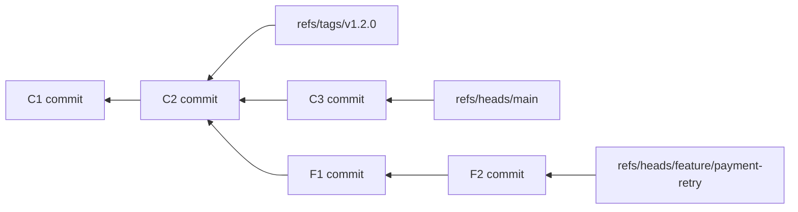
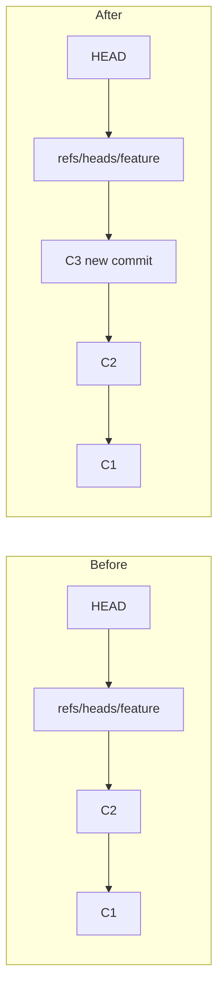
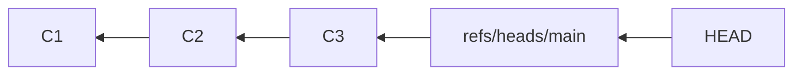
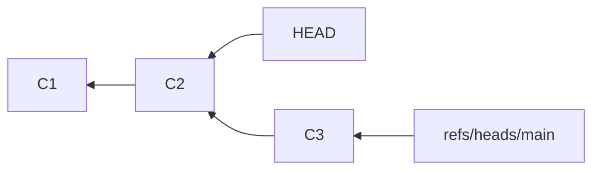
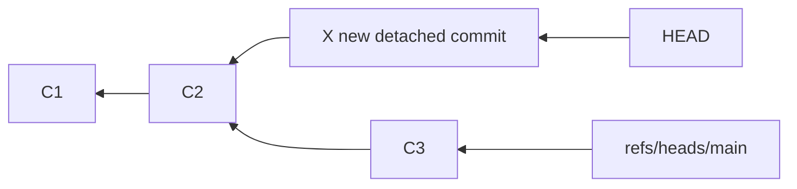
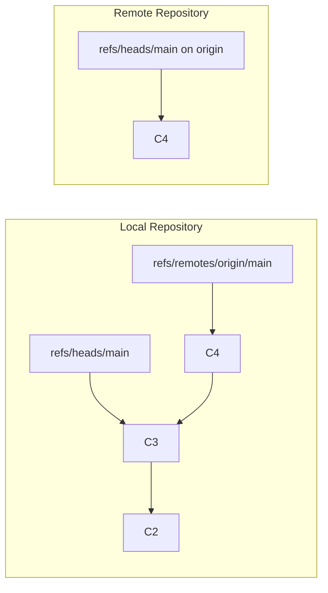
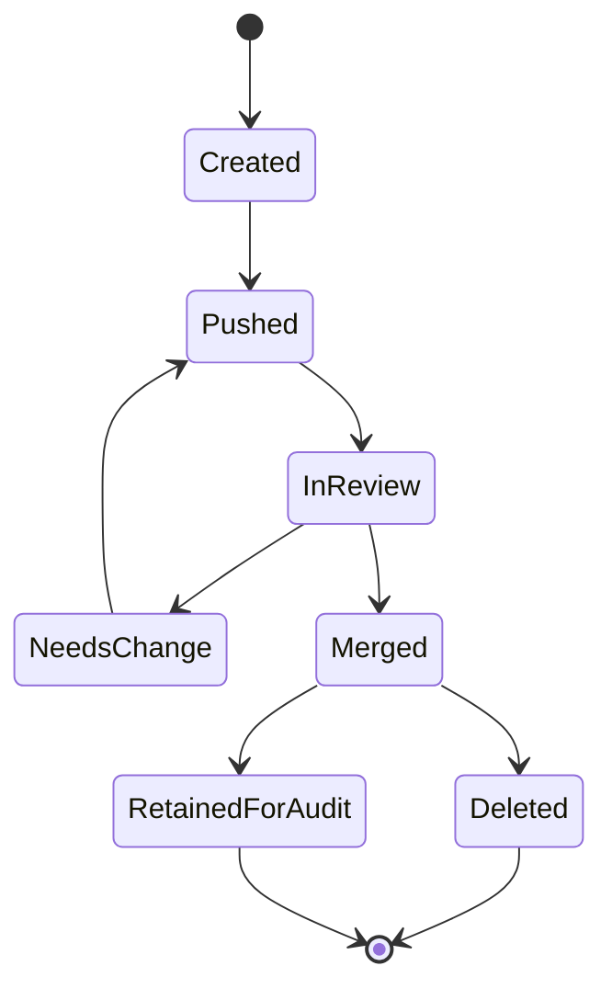
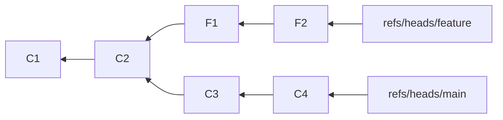

# Part 004 — Refs: Branches, Tags, HEAD, and Symbolic References

In Part 003, we modeled Git history as a commit graph. That graph is made of immutable commit objects.

But humans do not work by typing full object IDs all day. We work with names:

```text
main
feature/payment-retry
origin/main
v2.3.1
HEAD
```

Those names are **references**, usually shortened to **refs**.

A ref is a name that points to an object, usually a commit. Branches and tags are refs. Remote-tracking branches are refs. `HEAD` is usually a symbolic ref pointing to another ref.

This part teaches the naming layer of Git.

The senior engineer model is:

> Git objects are immutable. Refs are mutable names that select which parts of the object graph matter right now.

Most destructive Git operations are not destructive because they mutate objects. They are destructive because they move or delete refs.

---

## 1. The Naming Problem

A commit object ID is precise but not ergonomic:

```text
7e3f9c64e0b6f7a3e9d2c9b0a2...
```

A branch name is ergonomic but mutable:

```text
main
```

Git needs both:

| Thing | Stable? | Human-friendly? | Example |
|---|---:|---:|---|
| Object ID | Yes | No | `7e3f9c...` |
| Branch ref | No | Yes | `refs/heads/main` |
| Tag ref | Usually intended stable | Yes | `refs/tags/v1.0.0` |
| Symbolic ref | No | Yes | `HEAD -> refs/heads/main` |

This creates a critical engineering distinction:

```text
commit hash = identity
ref name = location/name/pointer
```

Never confuse the two.

---

## 2. What Is a Ref?

A ref is a file-like named pointer stored under `.git/refs` or inside `.git/packed-refs`.

Examples:

```text
.git/refs/heads/main
.git/refs/heads/feature/payment-retry
.git/refs/tags/v1.2.0
.git/refs/remotes/origin/main
```

A loose branch ref may literally contain a commit ID:

```text
$ cat .git/refs/heads/main
7e3f9c64e0b6f7a3e9d2c9b0a2...
```

Conceptually:



Refs are entry points into the commit graph.

---

## 3. Branch Ref: A Mutable Line-of-Development Pointer

A local branch is a ref under:

```text
refs/heads/<branch-name>
```

For example:

```text
refs/heads/main
refs/heads/release/2026.07
refs/heads/feature/case-escalation-sla
```

Creating a branch creates a new ref:

```bash
git branch feature/payment-retry
```

Switching to a branch usually changes `HEAD` to point symbolically at that branch:

```bash
git switch feature/payment-retry
```

Committing on that branch creates a new commit and advances the branch ref.



The branch moved. The old commits did not change.

---

## 4. `HEAD`: Usually a Symbolic Ref

`HEAD` means “the current commit context”. But its representation depends on state.

In normal branch mode:

```bash
cat .git/HEAD
```

Output:

```text
ref: refs/heads/main
```

That means `HEAD` is not directly pointing to a commit. It points to another ref.



When you commit in this state:

1. Git creates a new commit with parent `HEAD`.
2. Git advances `refs/heads/main` to the new commit.
3. `HEAD` still points to `refs/heads/main`.

---

## 5. Detached `HEAD`: Direct Commit Context

Detached `HEAD` means `HEAD` points directly to a commit instead of pointing to a branch ref.

Example:

```bash
git switch --detach 7e3f9c6
```

Then:

```bash
cat .git/HEAD
```

may output:

```text
7e3f9c64e0b6f7a3e9d2c9b0a2...
```

Graphically:



If you commit now:



The new commit exists, but no branch names it. It is easy to lose track of after switching away.

To preserve it:

```bash
git switch -c experiment/from-detached-head
```

or:

```bash
git branch experiment/from-detached-head HEAD
```

Detached `HEAD` is not bad. It is useful for inspection, bisect, testing old versions, and release archaeology. It becomes risky only when you create valuable work without naming it with a ref.

---

## 6. Symbolic Refs

A symbolic ref is a ref that points to another ref instead of directly to an object.

`HEAD` is the most common symbolic ref.

Inspect it:

```bash
git symbolic-ref HEAD
```

Example output:

```text
refs/heads/main
```

Short form:

```bash
git symbolic-ref --short HEAD
```

Example:

```text
main
```

Move `HEAD` symbolically:

```bash
git symbolic-ref HEAD refs/heads/main
```

You rarely need to run that manually. Porcelain commands like `git switch` manage it safely.

Important distinction:

| State | `.git/HEAD` content | Meaning |
|---|---|---|
| On branch | `ref: refs/heads/main` | `HEAD` points to branch ref. |
| Detached | `<commit-id>` | `HEAD` points directly to commit. |

---

## 7. Tags: Names for Important Objects

Tags are refs under:

```text
refs/tags/<tag-name>
```

Common examples:

```text
refs/tags/v1.0.0
refs/tags/v2.3.1-rc.1
refs/tags/security-fix-2026-07
```

There are two main kinds:

1. lightweight tag;
2. annotated tag.

### 7.1 Lightweight Tag

A lightweight tag is basically a ref directly pointing to an object, usually a commit.

```bash
git tag v1.0.0 <commit>
```

Conceptually:

```text
refs/tags/v1.0.0 -> <commit-id>
```

### 7.2 Annotated Tag

An annotated tag creates a tag object, and the tag ref points to that tag object.

```bash
git tag -a v1.0.0 -m "Release v1.0.0" <commit>
```

Conceptually:


The tag object can store tagger metadata and a message. Signed tags build on this model and will be covered later in the security and release parts.

Production rule:

> Treat release tags as immutable public names. Moving a release tag after publication breaks trust and reproducibility.

---

## 8. Remote-Tracking Refs

A remote-tracking branch is a local ref that records what your Git last observed on a remote.

Example:

```text
refs/remotes/origin/main
refs/remotes/origin/feature/payment-retry
```

Displayed as:

```text
origin/main
origin/feature/payment-retry
```

A remote-tracking ref is not the remote branch itself. It is your local cached knowledge of the remote branch after your last fetch.



After:

```bash
git fetch origin
```

Git updates `refs/remotes/origin/*` according to configured refspecs.

A common default fetch refspec looks like:

```text
+refs/heads/*:refs/remotes/origin/*
```

Meaning:

```text
Take branches from origin under refs/heads/*
and store/update local remote-tracking refs under refs/remotes/origin/*.
```

This is why `fetch` is usually safe: it updates remote-tracking refs, not your current local branch, unless explicitly configured otherwise.

---

## 9. Upstream Tracking: Relationship Between Local Branch and Remote-Tracking Ref

A local branch can have an upstream branch.

Inspect:

```bash
git branch -vv
```

Example:

```text
* feature/payment-retry  abc123 [origin/feature/payment-retry: ahead 2, behind 1] Add retry timeout
  main                   def456 [origin/main] Merge release prep
```

The upstream relationship influences commands like:

```bash
git pull
git push
git status
```

Set upstream:

```bash
git push -u origin feature/payment-retry
```

or:

```bash
git branch --set-upstream-to=origin/feature/payment-retry
```

Mental model:

```text
local branch = where I work
remote-tracking branch = what I last fetched from remote
upstream config = default comparison/push/pull relationship
```

---

## 10. Special Refs and Pseudo-Refs

Git also uses special files/refs to remember operation state.

Examples:

| Name | Typical purpose |
|---|---|
| `HEAD` | Current commit context; usually symbolic. |
| `ORIG_HEAD` | Previous important position before dangerous operations like merge/reset/rebase. |
| `FETCH_HEAD` | What was fetched most recently. |
| `MERGE_HEAD` | Other commit being merged during an in-progress merge. |
| `CHERRY_PICK_HEAD` | Commit being cherry-picked during conflict. |
| `REBASE_HEAD` | Commit currently being replayed during rebase conflict. |
| `BISECT_HEAD` | Current commit under bisect in some contexts. |

These names are operational breadcrumbs.

Example:

```bash
git show ORIG_HEAD
```

After a bad reset or merge, `ORIG_HEAD` can be the fastest route back.

But do not treat all special names identically. Some are refs; some are pseudo-refs or state files. The practical lesson is the same: Git records important operation state in named files so recovery is often possible if you inspect before panicking.

---

## 11. Loose Refs vs Packed Refs

Small or recently updated refs often exist as loose files:

```text
.git/refs/heads/main
.git/refs/tags/v1.0.0
```

As repositories accumulate many refs, Git may pack refs into:

```text
.git/packed-refs
```

Example shape:

```text
# pack-refs with: peeled fully-peeled sorted
7e3f9c64e0b6f7a3e9d2c9b0a2 refs/heads/main
1a2b3c4d5e6f... refs/tags/v1.0.0
```

Do not build tooling that assumes every ref is a loose file under `.git/refs`.

Use Git commands:

```bash
git show-ref
```

```bash
git for-each-ref
```

```bash
git rev-parse refs/heads/main
```

These commands abstract over loose and packed refs.

---

## 12. Inspecting Refs Like an Engineer

### 12.1 Show all refs

```bash
git show-ref
```

### 12.2 Show heads only

```bash
git show-ref --heads
```

### 12.3 Show tags only

```bash
git show-ref --tags
```

### 12.4 Format refs

```bash
git for-each-ref --format='%(refname:short) %(objectname:short) %(committerdate:relative)' refs/heads
```

### 12.5 Resolve a name to an object ID

```bash
git rev-parse HEAD
```

```bash
git rev-parse main
```

```bash
git rev-parse refs/remotes/origin/main
```

### 12.6 Check current branch safely

```bash
git symbolic-ref --quiet --short HEAD
```

If detached, this exits non-zero.

---

## 13. Updating Refs Directly

Most of the time, use porcelain commands:

```bash
git branch
git switch
git tag
git reset
git fetch
git push
```

But knowing `update-ref` is valuable for internals and recovery.

Create or move a ref:

```bash
git update-ref refs/heads/recovered-work <commit-id>
```

Delete a ref:

```bash
git update-ref -d refs/heads/old-branch
```

Safer compare-and-swap update:

```bash
git update-ref refs/heads/main <new-id> <old-id>
```

This updates `main` only if it currently points to `<old-id>`. That pattern matters in automation because it prevents overwriting a ref that moved concurrently.

Equivalent high-level safety concept appears in push operations as `--force-with-lease`.

---

## 14. Dangerous Ref Mutations

Objects are immutable. Ref movement creates most Git danger.

| Operation | What it mutates | Risk |
|---|---|---|
| `git reset --hard X` | Current branch ref, index, working tree | Can abandon reachable work from branch tip. |
| `git branch -f main X` | Branch ref | Repoints branch without integrating old tip. |
| `git tag -f v1.0.0 X` | Tag ref | Mutates release identity. |
| `git push --force` | Remote ref | Can overwrite teammates’ published history. |
| `git update-ref -d ...` | Ref deletion | Removes name protecting commits from becoming unreachable. |
| Deleting remote branch | Remote ref | Removes shared coordination point. |

Safe habit:

```bash
git log --graph --oneline --decorate --all --max-count=50
```

before any operation that moves or deletes refs.

---

## 15. Namespaces Matter

Git ref names live in namespaces.

| Short name | Full ref name |
|---|---|
| `main` | `refs/heads/main` |
| `origin/main` | `refs/remotes/origin/main` |
| `v1.0.0` | `refs/tags/v1.0.0` |

Ambiguous short names can exist.

For example, a branch and tag could both be named `release`:

```text
refs/heads/release
refs/tags/release
```

Avoid this in serious repositories. It creates ambiguous human communication and can make automation brittle.

Policy:

- branch names describe work streams;
- tag names describe immutable release or milestone identities;
- avoid reusing the same short name across namespaces;
- use explicit full refs in automation when correctness matters.

---

## 16. Branch Naming as Operational Design

Branch names are not cosmetic. They encode workflow intent.

Common patterns:

```text
feature/<domain>-<change>
bugfix/<domain>-<issue>
hotfix/<release>-<issue>
release/<version-or-date>
spike/<topic>
experiment/<topic>
revert/<incident-or-pr>
```

Good branch names help with:

- triage;
- automation;
- stale branch cleanup;
- CI policy selection;
- release management;
- ownership routing.

Weak names create operational ambiguity:

```text
fix
new-stuff
john-test
changes
final
final-2
```

Naming rule:

> A branch name should tell a future engineer why the ref exists and what kind of lifecycle it has.

---

## 17. Ref Lifecycle Patterns

### 17.1 Short-lived feature branch

```text
create -> push -> review -> merge -> delete
```

Good for trunk-based development and fast integration.

### 17.2 Release branch

```text
create from main -> stabilize -> tag release -> maintain hotfixes -> retire
```

Good when active supported versions need isolated fixes.

### 17.3 Hotfix branch

```text
create from release tag/branch -> patch -> validate -> merge/cherry-pick -> tag
```

Good for emergency production correction.

### 17.4 Long-lived integration branch

```text
create -> accumulate -> repeatedly merge/rebase -> eventually integrate
```

High risk. Often indicates missing feature flags, insufficient modularity, or poor release slicing.

Represent lifecycle explicitly:



---

## 18. Refs and Reachability

Refs define what is reachable.

Consider:



If you delete `refs/heads/feature`, commits `F2` and `F1` may become unreachable unless another ref or reflog references them.

Command:

```bash
git branch -d feature
```

Git refuses if the branch is not merged into the current branch or configured upstream, depending on context.

Force delete:

```bash
git branch -D feature
```

This removes the branch ref even if its tip is not reachable from another important ref.

Before force deletion:

```bash
git log --oneline --decorate main..feature
```

If that prints commits, deleting the branch removes the obvious name for work not reachable from `main`.

---

## 19. Refs and Reflogs

A reflog records how a ref moved locally.

Examples:

```bash
git reflog
```

```bash
git reflog show main
```

Reflog will be covered deeply in Part 028, but it belongs in the ref mental model:

```text
ref = current pointer
reflog = local movement history of that pointer
```

When you accidentally move a branch, the old position may still be recoverable from the reflog.

Example recovery shape:

```bash
git reflog show main
git update-ref refs/heads/main <old-good-commit>
```

Do not panic after a bad reset. Inspect refs and reflogs first.

---

## 20. RefSpecs: Mapping Refs Across Repositories

A refspec maps source refs to destination refs.

Fetch refspec example:

```text
+refs/heads/*:refs/remotes/origin/*
```

Push refspec example:

```bash
git push origin HEAD:refs/heads/feature/payment-retry
```

Meaning:

```text
Take my current HEAD and update remote branch refs/heads/feature/payment-retry.
```

Delete remote branch:

```bash
git push origin --delete feature/payment-retry
```

Older explicit form:

```bash
git push origin :refs/heads/feature/payment-retry
```

The empty source means “delete destination ref”.

Refspecs are powerful because they expose Git’s underlying model: collaboration is mostly object transfer plus ref update.

---

## 21. Force-with-Lease: Ref Safety in Collaboration

A normal force push says:

```text
Set the remote ref to my value, even if it moved.
```

A lease-based force push says:

```text
Set the remote ref to my value only if the remote still points to what I believe it points to.
```

Command:

```bash
git push --force-with-lease
```

This protects against overwriting someone else’s work that appeared after your last fetch.

Mental model:

```text
force = unconditional remote ref update
force-with-lease = conditional remote ref update
```

For shared branches, prefer avoiding force push entirely. If rewrite is necessary, use `--force-with-lease` plus explicit team coordination.

---

## 22. Operational Invariants

Memorize these:

1. A branch is a mutable ref under `refs/heads/*`.
2. A tag is a ref under `refs/tags/*`; release tags should be treated as immutable.
3. `HEAD` is usually a symbolic ref to the current branch.
4. Detached `HEAD` points directly to a commit.
5. Remote-tracking refs are local records of remote state after fetch.
6. Fetch updates remote-tracking refs; pull fetches then integrates.
7. Commit objects do not change when refs move.
8. Deleting a branch deletes a name, not immediately the objects.
9. Reachability from refs determines what history is obvious/live.
10. Automation should use full ref names when ambiguity is unacceptable.

---

## 23. Lab: Inspect Refs Directly

Create a lab repo:

```bash
mkdir git-refs-lab
cd git-refs-lab
git init

echo one > app.txt
git add app.txt
git commit -m "Initial commit"
```

Inspect `HEAD`:

```bash
cat .git/HEAD
git symbolic-ref HEAD
git symbolic-ref --short HEAD
```

Create a branch:

```bash
git branch feature/ref-demo
git show-ref --heads
```

Switch and commit:

```bash
git switch feature/ref-demo
echo two >> app.txt
git commit -am "Update on feature"
```

Inspect branch refs:

```bash
cat .git/HEAD
git rev-parse HEAD
git rev-parse refs/heads/feature/ref-demo
git log --graph --oneline --decorate --all
```

Detach `HEAD`:

```bash
git switch --detach HEAD~1
cat .git/HEAD
git symbolic-ref --quiet --short HEAD || echo "detached"
```

Create a commit while detached:

```bash
echo detached >> app.txt
git commit -am "Detached experiment"
```

Save it:

```bash
git switch -c experiment/saved-detached-work
```

Inspect:

```bash
git log --graph --oneline --decorate --all
```

The point of this lab is to feel the difference between moving `HEAD`, moving a branch ref, and preserving detached work with a new ref.

---

## 24. Lab: Ref Update with Compare-and-Swap

This lab demonstrates ref updates safely. Use only in a throwaway repository.

```bash
mkdir git-update-ref-lab
cd git-update-ref-lab
git init

echo A > f.txt
git add f.txt
git commit -m "A"
OLD=$(git rev-parse HEAD)

echo B >> f.txt
git commit -am "B"
NEW=$(git rev-parse HEAD)
```

Create a backup ref:

```bash
git update-ref refs/heads/backup-before-experiment $OLD
```

Show refs:

```bash
git show-ref --heads
```

Attempt safe update:

```bash
git update-ref refs/heads/backup-before-experiment $NEW $OLD
```

This succeeds only if `backup-before-experiment` still points to `$OLD`.

This is the same safety shape you want in automation: never blindly move an important ref if you have an expected old value.

---

## 25. Common Mistakes

### Mistake 1: Treating `origin/main` as always current

`origin/main` is only as current as your last fetch.

Fix:

```bash
git fetch origin
```

before important comparisons.

### Mistake 2: Confusing branch name with deployed version

A branch can move. A deployed artifact should usually record an immutable commit hash and/or release tag.

Fix:

```bash
git rev-parse HEAD
```

embed commit identity into build metadata.

### Mistake 3: Moving tags casually

A moved release tag can cause different consumers to resolve the same version name to different commits.

Fix:

- use annotated/signed release tags;
- protect tags on the remote;
- never retag public releases casually;
- publish a corrective release instead.

### Mistake 4: Building tooling by reading `.git/refs` only

Packed refs will be missed.

Fix:

Use:

```bash
git for-each-ref
```

or Git library APIs that understand ref storage.

### Mistake 5: Committing valuable work in detached `HEAD` and switching away

The commit may become hard to find.

Fix:

```bash
git switch -c meaningful-branch-name
```

before or immediately after valuable detached work.

---

## 26. Engineering Checklist

Before moving or deleting a ref:

- What exact full ref name is affected?
- What object does it point to now?
- What object will it point to after the operation?
- Is this ref local or remote?
- Is this ref protected or release-critical?
- Is anyone else basing work on it?
- Is a safer compare-and-swap style update available?
- Do I have a reflog or backup ref if the operation is wrong?

Before comparing branches:

- Did I fetch recently?
- Am I comparing local branch to local branch, or local branch to remote-tracking branch?
- Is the upstream configured correctly?
- Is the short name ambiguous?
- Should automation use full refs?

---

## 27. Key Takeaways

- Refs are mutable names pointing into Git’s immutable object graph.
- Local branches live under `refs/heads/*`.
- Tags live under `refs/tags/*`; release tags should be treated as immutable identities.
- Remote-tracking refs live under `refs/remotes/<remote>/*` and represent last fetched remote state.
- `HEAD` is usually a symbolic ref to the current branch; detached `HEAD` points directly to a commit.
- Fetch updates remote-tracking refs; it does not normally integrate into your current branch.
- Ref movement is the root of most Git danger and most Git power.
- Use full refs and compare-and-swap style updates in automation.
- Understand refs before force-push, reset, tag movement, release automation, and recovery.

---

## 28. Sources

- Pro Git — Git References: https://git-scm.com/book/en/v2/Git-Internals-Git-References
- Git Glossary — refs, symbolic refs, remote-tracking branches: https://git-scm.com/docs/gitglossary
- Git Revisions — naming commits and revision syntax: https://git-scm.com/docs/gitrevisions
- `git-symbolic-ref` documentation: https://git-scm.com/docs/git-symbolic-ref
- `git-update-ref` documentation: https://git-scm.com/docs/git-update-ref
- `git-fetch` documentation and refspec behavior: https://git-scm.com/docs/git-fetch
