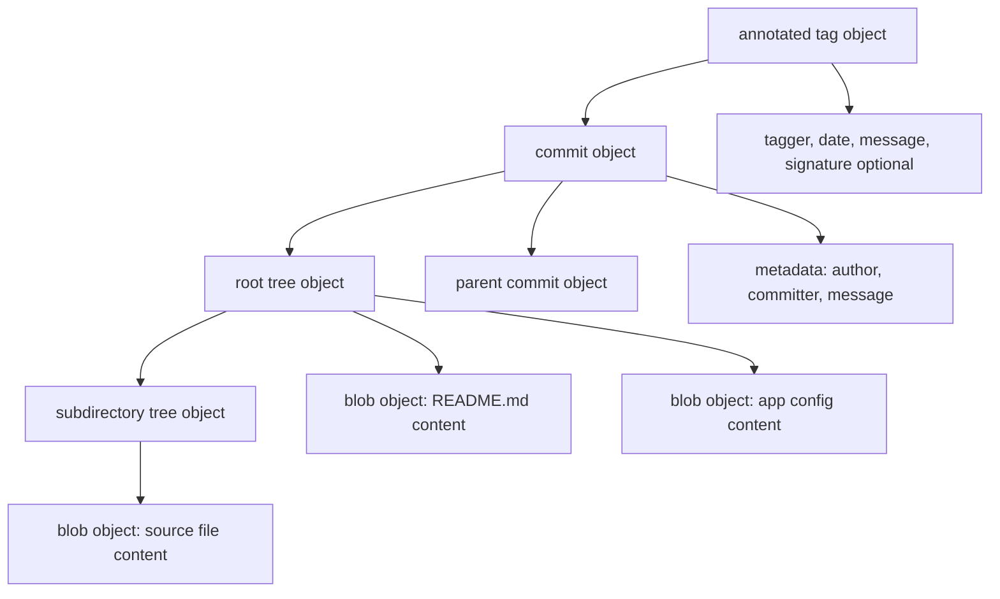
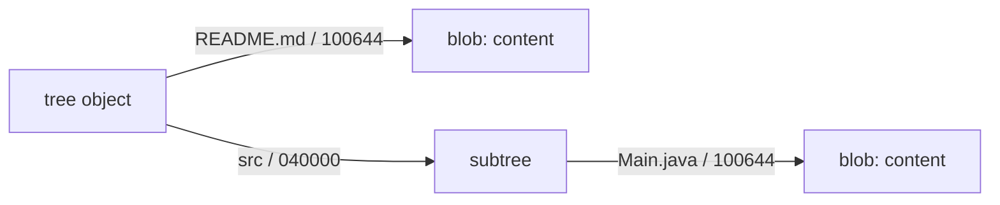
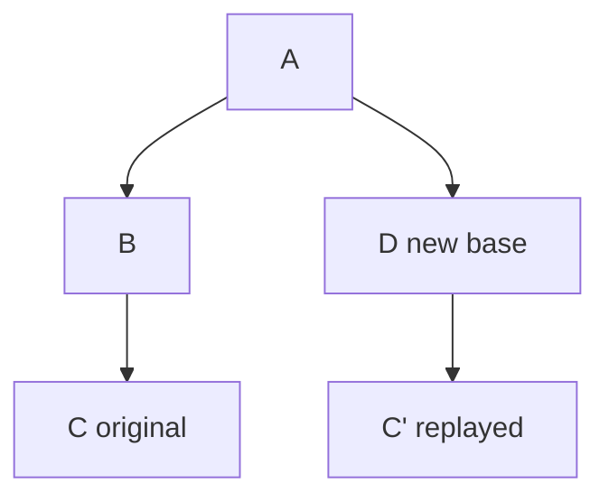
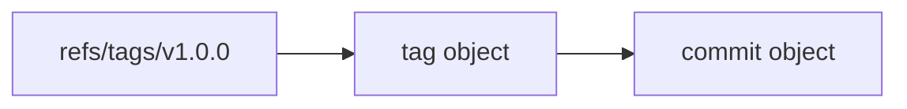
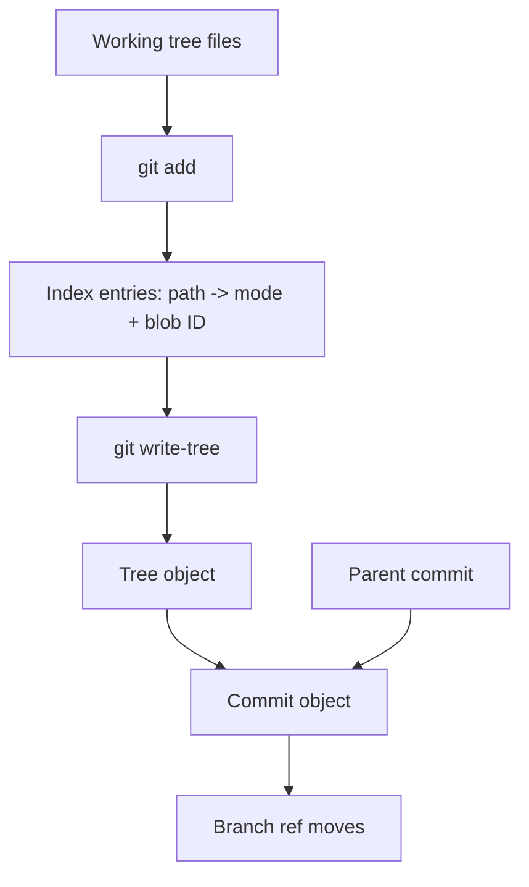
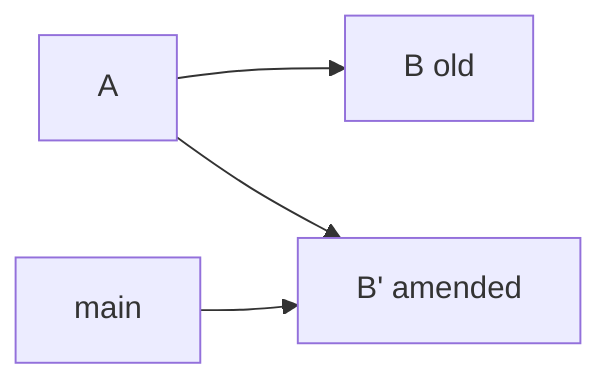
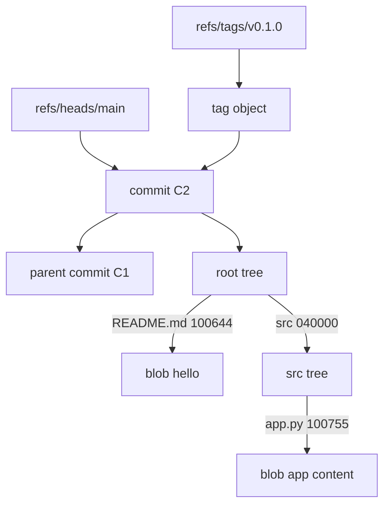

# Part 005 — Git Object Types: Blob, Tree, Commit, Tag

In earlier parts we used the phrase **object database**. Now we make it concrete.

Git's durable storage model is built from a small set of object types:

1. **blob** — file content
2. **tree** — directory snapshot
3. **commit** — project snapshot plus history metadata
4. **tag** — annotated name pointing to another object, usually a commit

This part is not trivia. Once you understand these four object types, many Git behaviors become obvious:

- why Git does not track empty directories,
- why rename detection is heuristic,
- why a branch move can make commits appear lost even though objects still exist,
- why a commit ID changes when its parent changes,
- why tags are safer release anchors than branch names,
- why submodules appear as a special tree entry,
- why binary files bloat repositories,
- why merge conflicts are about tree reconstruction, not textual patch drama.

The senior engineer model is:

> Git does not primarily store diffs. Git stores immutable typed objects. History is a graph of commits, and each commit points to a complete tree snapshot.

Diffs are computed views over snapshots.

---

## 1. The Four-Type Object Model

At rest, Git stores typed content-addressed objects. The practical model looks like this:



Important separation:

| Concern | Stored in |
|---|---|
| File bytes | Blob object |
| File path/name | Tree entry |
| File mode | Tree entry |
| Directory structure | Tree object |
| Snapshot root | Commit object |
| Parent history | Commit object |
| Author/committer/message | Commit object |
| Release annotation | Tag object |
| Branch name | Ref, not object |

That table is the core.

A blob does **not** know its filename.
A commit does **not** store a diff.
A branch is **not** an object.
A tag name is **not necessarily** the same thing as a tag object.

---

## 2. Object Identity: Type + Size + Content

A Git object ID is derived from the object's serialized content, including its type and size header.

Conceptually:

```text
<object-type> <size>\0<content>
```

For a blob containing `hello\n`, the hashed payload is conceptually:

```text
blob 6\0hello\n
```

This means the object identity is not merely the hash of file bytes. The type header is part of the object identity.

Try it:

```bash
printf 'hello\n' | git hash-object --stdin
```

Inspect a real object:

```bash
git cat-file -t <object-id>
git cat-file -s <object-id>
git cat-file -p <object-id>
```

`cat-file` is one of the most important Git debugging tools. It lets you ask Git:

- what type is this object?
- how large is it?
- what does it contain in pretty-printed form?

### SHA-1 and SHA-256 note

Most existing Git repositories use SHA-1 object IDs. Git also has SHA-256 repository support. The deep invariant is not "SHA-1 forever". The invariant is:

> Object identity is content-derived and object-type-aware.

So when this series says "hash" or "object ID", treat it as the object identity mechanism, not a promise that all repositories are always SHA-1 forever.

---

## 3. Blob Object: File Content Without Name

A blob is the simplest object. It stores bytes.

A blob does not store:

- filename,
- path,
- permissions beyond what tree entries record,
- timestamps,
- owner,
- directory name,
- language,
- encoding semantics.

Example:

```bash
mkdir /tmp/git-object-lab
cd /tmp/git-object-lab
git init
printf 'line one\nline two\n' > notes.txt
git hash-object -w notes.txt
```

Then:

```bash
git cat-file -t <blob-id>
git cat-file -p <blob-id>
```

You get the content, not the filename.

That explains several Git behaviors.

### 3.1 Same content, same blob

If two files have identical content, they can point to the same blob object.

```bash
printf 'same\n' > a.txt
printf 'same\n' > b.txt
git add a.txt b.txt
git ls-files -s
```

You should see the same blob object ID for both paths.

This is not a bug. The filename lives in the tree entry, not in the blob.

### 3.2 Rename detection is inferred

Since a blob does not know its path, Git does not record "rename events" as first-class durable objects.

It records snapshots.

If commit A has:

```text
src/OldName.java -> blob X
```

and commit B has:

```text
src/NewName.java -> blob X
```

Git can infer that the file likely moved. But the repository did not store a special rename object.

This is why rename detection is a diff-time analysis.

Practical consequence:

```bash
git diff --find-renames A B
```

can show rename information, but another command or threshold may show it differently.

Do not build compliance, audit, or migration logic on the assumption that renames are stored as permanent events.

### 3.3 Binary blobs are expensive

Git can store any bytes in a blob. But large binary blobs are usually operationally dangerous because Git's history model keeps objects reachable as long as any reachable commit references them.

A single committed 500 MB binary can stay in repository history even after you delete the file in a later commit.

Deleting a file from `main` removes it from the latest tree. It does not automatically remove the old blob from history.

This is why artifact boundaries matter:

| Data type | Usually belongs in Git? | Better place |
|---|---:|---|
| Source code | Yes | Git |
| Small text config | Often | Git, with secret discipline |
| Generated build output | No | Artifact repository |
| Large binary release package | No | Artifact repository/object storage |
| Secret file | No | Secret manager |
| Large ML model | Usually no | Model registry/object storage |

Git is a source history database. It is not a general-purpose artifact warehouse.

---

## 4. Tree Object: Directory Snapshot

A tree object maps names to object IDs and modes.

Conceptually:

```text
100644 blob <blob-id> README.md
100755 blob <blob-id> scripts/deploy.sh
040000 tree <tree-id> src
120000 blob <blob-id> current
160000 commit <commit-id> vendor/library
```

Tree entries encode:

| Field | Meaning |
|---|---|
| Mode | File kind / executable bit / directory / symlink / gitlink |
| Type | Usually blob, tree, or commit for submodule gitlink |
| Object ID | Target object |
| Name | Path component inside that directory |

Inspect the current tree:

```bash
git ls-tree HEAD
```

Inspect recursively:

```bash
git ls-tree -r HEAD
```

Inspect with object sizes:

```bash
git ls-tree -r -l HEAD
```

### 4.1 Tree entries carry names

If a blob does not know its filename, where is the filename?

In the tree.



This explains why two different paths can reference the same blob.

```text
100644 blob abc123... docs/a.md
100644 blob abc123... docs/b.md
```

The path differs. The content object is identical.

### 4.2 File mode matters

Tree entries encode a limited set of modes. The common ones are:

| Mode | Meaning |
|---|---|
| `100644` | Regular non-executable file |
| `100755` | Regular executable file |
| `120000` | Symbolic link |
| `040000` | Directory tree |
| `160000` | Gitlink, used by submodules |

This matters in code review.

A diff that only changes mode from `100644` to `100755` can be security-sensitive if it makes a script executable.

Check mode changes:

```bash
git diff --summary
```

Example output:

```text
mode change 100644 => 100755 scripts/deploy.sh
```

Do not ignore mode-only diffs in regulated or deployment-heavy systems.

### 4.3 Empty directories are absent

Git tracks files, represented as blobs, and directories as tree objects containing entries.

An empty directory has no entries; therefore there is no tree object that needs to be referenced from a commit.

This is why Git does not track empty directories directly.

Common convention:

```text
empty-dir/.gitkeep
```

But `.gitkeep` is not special to Git. It is just a placeholder file.

### 4.4 Symlinks are blobs with symlink mode

For a symbolic link, Git stores a tree entry with mode `120000` and a blob containing the link target path.

Conceptually:

```text
120000 blob <blob-id> current
```

The blob content might be:

```text
releases/2026-07-06
```

Operational implication:

- On systems that support symlinks, checkout can recreate the symlink.
- On systems or configurations that do not, behavior may differ.
- Symlink changes can be security-sensitive because they can alter file traversal.

### 4.5 Submodules are gitlinks

A submodule appears in the superproject tree as mode `160000` with type `commit`.

Conceptually:

```text
160000 commit <commit-id> vendor/payments-sdk
```

The superproject does not embed the submodule's full tree. It pins a commit ID from another repository.

This is why submodules often confuse teams:

- the parent repo records a commit pointer,
- the child repo must be separately fetched,
- checkout can leave the submodule in detached HEAD,
- CI must initialize/update recursively if needed.

Submodules will get their own production-focused part later. For now, remember: a submodule is a tree entry pointing to a commit, not a directory full of normal tracked blobs in the parent repository.

---

## 5. Commit Object: Snapshot + History Edge + Metadata

A commit object points to a root tree and zero or more parents.

Conceptually:

```text
tree <root-tree-id>
parent <parent-commit-id>
author Alice <alice@example.com> 1783370000 +0700
committer Alice <alice@example.com> 1783370000 +0700

Implement retry boundary for payment capture
```

Inspect a commit:

```bash
git cat-file -p HEAD
```

You will see fields similar to:

```text
tree 4b825dc642cb6eb9a060e54bf8d69288fbee4904
parent e69de29bb2d1d6434b8b29ae775ad8c2e48c5391
author ...
committer ...

commit message
```

### 5.1 A commit does not store a diff

This is one of the most important Git mental models.

A commit stores:

- root tree ID,
- parent commit IDs,
- author metadata,
- committer metadata,
- message,
- optional signing data.

It does not store:

- "added these lines",
- "removed these lines",
- "renamed this file",
- "changed this class".

Those are computed by comparing the commit's tree with another tree.

```bash
git diff HEAD~1 HEAD
```

That command asks Git to compare two snapshots.

### 5.2 Parent identity is part of commit identity

If you rewrite a commit so it has a different parent, the commit ID changes even if the file tree is identical.

This is why rebase changes commit IDs.



`C` and `C'` may introduce the same patch relative to their parents, but they are different commit objects because their metadata includes different parent IDs.

This matters for:

- code review updates,
- force pushes,
- backports,
- cherry-picks,
- signed commits,
- release reproducibility.

### 5.3 Root commits have no parent

The first commit in a repository has no parent line.

```bash
git rev-list --max-parents=0 HEAD
```

Large repositories may have multiple root commits after history grafting, subtree merges, imported repositories, or complex migrations.

Do not assume every repository has exactly one root.

### 5.4 Merge commits have multiple parents

A normal commit has one parent. A merge commit has two or more.

Inspect:

```bash
git cat-file -p <merge-commit>
```

You may see:

```text
parent <main-tip-before-merge>
parent <feature-tip>
```

Parent order matters for many commands.

For example:

```bash
git show <merge-commit>^1
git show <merge-commit>^2
```

Usually:

- `^1` is the first parent, often the branch you merged into,
- `^2` is the merged branch tip.

This is why first-parent history is useful for release archaeology:

```bash
git log --first-parent main
```

It follows the integration line rather than every side branch detail.

### 5.5 Author vs committer

A commit can have different author and committer metadata.

| Field | Meaning |
|---|---|
| Author | Who originally wrote the change |
| Committer | Who last created/applied this commit object |

Examples:

- cherry-pick can preserve original author but set a new committer,
- applying patches from email can preserve author,
- rebasing can rewrite committer metadata,
- bots may commit changes authored by humans or vice versa.

Inspect both:

```bash
git log --format=fuller -1 HEAD
```

For audit-heavy systems, confusing author and committer can lead to wrong conclusions.

---

## 6. Tag Object: Annotated Release Name

There are two common kinds of tags:

1. **lightweight tag** — a ref directly pointing to an object,
2. **annotated tag** — a ref pointing to a tag object, which then points to another object.

### 6.1 Lightweight tag

```bash
git tag v1.0.0-lightweight HEAD
```

Conceptually:

```text
refs/tags/v1.0.0-lightweight -> <commit-id>
```

There is no separate tag object.

### 6.2 Annotated tag

```bash
git tag -a v1.0.0 -m 'Release v1.0.0' HEAD
```

Conceptually:



Inspect:

```bash
git cat-file -p v1.0.0
```

You may see:

```text
object <commit-id>
type commit
tag v1.0.0
tagger Release Bot <release@example.com> ...

Release v1.0.0
```

Annotated tags are better release anchors because they can carry:

- tagger identity,
- date,
- message,
- signature.

### 6.3 Tag object can point to different object types

A tag object usually points to a commit, but structurally it can point to another object type.

In release engineering, prefer annotated tags pointing to commits unless you have a very specific reason.

### 6.4 Tag name vs tag object

A common mistake is to treat "tag" as one thing.

There are two layers:

```text
refs/tags/v1.0.0   # name/ref
<tag object>       # object, for annotated tags only
```

The ref can be moved unless server policy prevents it.
The tag object is immutable once addressed by its object ID.

Release policy should care about both:

- protect tag refs from mutation,
- prefer annotated/signed tags,
- record the commit ID in release evidence,
- record artifact digest separately.

---

## 7. From Working Tree to Objects: The Snapshot Pipeline

A simplified commit pipeline:



Operationally:

1. Working tree has files.
2. `git add` writes blob objects and updates the index.
3. `git write-tree` can write a tree object from the index.
4. `git commit` creates a commit object pointing to that tree and parent(s).
5. The current branch ref moves to the new commit.

You can manually inspect pieces:

```bash
git status --short
git add README.md
git ls-files -s
git write-tree
git commit -m 'Add README'
git cat-file -p HEAD
```

This pipeline explains why an unstaged file is not included in a commit.

The commit is built from the **index**, not directly from every working tree file.

---

## 8. Object Types and Everyday Commands

| Command | Object-level interpretation |
|---|---|
| `git add file` | Write blob for file content; update index path -> blob ID |
| `git commit` | Write tree from index; write commit pointing to tree and parent; move branch ref |
| `git diff` | Compare working tree against index by default |
| `git diff --cached` | Compare index against HEAD tree |
| `git checkout <commit>` | Populate index and working tree from commit tree; maybe detach HEAD |
| `git reset --soft <commit>` | Move current branch ref only |
| `git reset --mixed <commit>` | Move ref and reset index to target tree |
| `git reset --hard <commit>` | Move ref, reset index, reset working tree |
| `git tag -a` | Create tag object and tag ref |
| `git branch name <commit>` | Create branch ref pointing to commit |

Git commands become less mysterious when mapped to object operations.

---

## 9. Critical Invariants

### 9.1 Objects are immutable

Once an object ID exists, changing the content creates a different object ID.

You do not edit a commit. You create another commit and move a ref.

This is why `commit --amend` is not actually editing the old commit.

It creates a new commit object, then moves the branch ref.



The old commit may remain reachable through reflog for some time, but it is no longer the branch tip.

### 9.2 Reachability controls retention

Objects are retained when reachable from refs, reflogs, or other retention mechanisms.

Unreachable objects may eventually be pruned by garbage collection.

This is why recovery is often possible immediately after a bad reset, but not guaranteed forever.

### 9.3 Commit identity includes history

The same tree with a different parent is a different commit.

This matters when people say:

> "But the code is identical, why did the commit hash change?"

Because the commit is not only code. It is code plus parent edge plus metadata.

### 9.4 Branches and tags are naming layer, not storage layer

Deleting a branch deletes a ref. It does not immediately delete the commits if they are reachable elsewhere or retained by reflog.

Moving a tag changes the name-to-object mapping. It does not mutate the old object.

---

## 10. Failure Modes

### Failure Mode 1: Treating commit as diff

Symptom:

> "Rebase should not change hashes because I did not change the code."

Root cause:

A commit's parent is part of the commit object.

Correct model:

> Rebase creates new commits with new parents.

### Failure Mode 2: Assuming Git tracks renames explicitly

Symptom:

> Compliance report says rename happened because `git log --follow` says so.

Root cause:

Rename detection is heuristic diff analysis.

Correct model:

> Git stores snapshots. Rename is inferred by comparing trees and content similarity.

### Failure Mode 3: Deleting a secret file and assuming it is gone

Symptom:

> Secret committed in `config/prod.env`, then removed in next commit.

Root cause:

Old blob is still reachable through old commit history.

Correct response:

1. Rotate the secret first.
2. Assess exposure.
3. Rewrite history only if necessary and coordinated.
4. Add prevention controls.

### Failure Mode 4: Ignoring mode-only changes

Symptom:

> PR looks empty except file mode changed.

Root cause:

Reviewer focuses only on text diff.

Correct model:

> Tree entries include executable bit. Mode changes can be meaningful.

### Failure Mode 5: Using lightweight mutable tags for releases

Symptom:

> `v1.2.0` points to different commits in different clones.

Root cause:

Tag refs were mutable and not protected.

Correct model:

> Release identity should be anchored by immutable commit ID, protected annotated tag, and artifact digest.

---

## 11. Practical Inspection Playbook

When debugging repository state, inspect from names down to objects.

### 11.1 Resolve a name

```bash
git rev-parse HEAD
git rev-parse main
git rev-parse refs/tags/v1.0.0
```

### 11.2 Identify object type

```bash
git cat-file -t HEAD
git cat-file -t HEAD^{tree}
git cat-file -t v1.0.0
```

### 11.3 Pretty-print object

```bash
git cat-file -p HEAD
git cat-file -p HEAD^{tree}
git ls-tree -r HEAD
```

### 11.4 Compare snapshots

```bash
git diff HEAD~1 HEAD
git diff --name-status HEAD~1 HEAD
git diff --summary HEAD~1 HEAD
```

### 11.5 Find large blobs reachable from history

Simple approximation:

```bash
git rev-list --objects --all |
  git cat-file --batch-check='%(objecttype) %(objectname) %(objectsize) %(rest)' |
  awk '$1 == "blob" {print $3, $4, $2}' |
  sort -nr |
  head -20
```

Use this when a repository suddenly becomes slow to clone or push.

---

## 12. Engineering Decision Framework

### When should something be a Git blob?

Use this decision table:

| Question | If yes | If no |
|---|---|---|
| Is it source-like and human-reviewable? | Candidate for Git | Prefer artifact/object storage |
| Is it needed to build/test from source? | Candidate for Git | Maybe generated output |
| Is it secret? | Do not commit | Use secret manager |
| Is it large and frequently changing? | Avoid normal Git blob | Use LFS or external store |
| Is historical diff useful? | Git fits | External store may fit better |
| Must it be immutable release evidence? | Store metadata in Git, artifact elsewhere | Avoid bloating history |

### When should release identity use a tag?

Prefer:

```text
protected annotated signed tag -> commit ID -> source tree -> build artifact digest
```

Avoid:

```text
mutable branch name -> latest build
```

Release consumers need stable identity, not convenience names.

---

## 13. Lab: Inspect a Repository Like an Object Database

Create a lab repo:

```bash
mkdir /tmp/git-object-types-lab
cd /tmp/git-object-types-lab
git init

echo 'hello' > README.md
mkdir src
echo 'print("hello")' > src/app.py
git add .
git commit -m 'Initial snapshot'
```

Inspect the commit:

```bash
git cat-file -p HEAD
```

Extract root tree:

```bash
git rev-parse HEAD^{tree}
git ls-tree HEAD
```

Inspect recursively:

```bash
git ls-tree -r HEAD
```

Inspect a blob:

```bash
blob=$(git ls-tree -r HEAD README.md | awk '{print $3}')
git cat-file -t "$blob"
git cat-file -p "$blob"
```

Add same content at another path:

```bash
cp README.md COPY.md
git add COPY.md
git commit -m 'Add copy'
git ls-tree -r HEAD
```

Observe whether both paths point to the same blob.

Change file mode:

```bash
chmod +x src/app.py
git add src/app.py
git diff --cached --summary
git commit -m 'Make app executable'
```

Create annotated tag:

```bash
git tag -a v0.1.0 -m 'Release v0.1.0'
git cat-file -p v0.1.0
```

Answer these questions:

1. Which object stores `README.md` as a name?
2. Which object stores the bytes `hello\n`?
3. Which object stores the parent relationship?
4. Which object changed when you made `src/app.py` executable?
5. Does the annotated tag point directly to the commit, or through a tag object?

---

## 14. Mermaid Summary



Read it from top to bottom:

1. A branch ref names a commit.
2. A commit points to a tree and parent commits.
3. A tree maps names/modes to blobs or subtrees.
4. A blob stores content.
5. An annotated tag ref points to a tag object, which points to a commit.

---

## 15. What Top Engineers Internalize

A beginner says:

> "Git stores my files."

A mid-level engineer says:

> "Git stores commits and diffs."

A senior engineer says:

> "Git stores immutable typed objects. Commits point to tree snapshots and parent commits. Branches and tags are refs naming objects. Many commands are just controlled ways to create objects and move refs."

That model is more useful because it predicts behavior under stress:

- bad rebase,
- bad force push,
- lost branch,
- secret leak,
- moved tag,
- slow repository,
- strange diff,
- submodule confusion,
- release reproducibility failure.

When you understand object types, Git becomes less magical and more like a database with a strict schema.

---

## 16. References

- Git documentation: `git-cat-file`
- Git documentation: `gitdatamodel`
- Git documentation: `gitformat-loose`
- Pro Git: Git Internals — Git Objects
- Pro Git: Git Internals — Git References
- Pro Git: Git Internals — Packfiles
