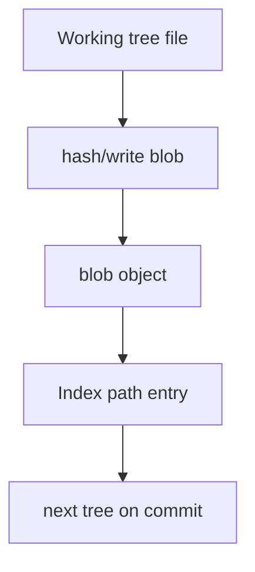
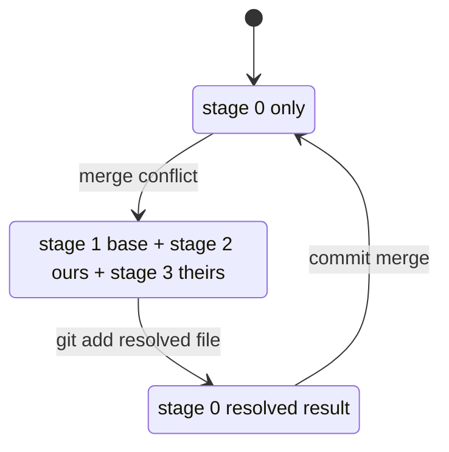

# Part 006 — The Index as Conflict, Staging, and Performance Structure

Most developers learn this:

```bash
git add file
git commit
```

Then they internalize a weak model:

> The index is the staging area.

That is true, but incomplete.

The Git index is also:

- a cache of tracked paths,
- the source from which the next tree object is written,
- the structure that allows partial commits,
- the structure that holds unresolved merge states,
- the boundary between working tree bytes and committed snapshots,
- a performance optimization for large repositories,
- a substrate for sparse checkout and sparse index,
- a source of many subtle mistakes.

The senior engineer model is:

> The index is Git's proposed next tree plus cached filesystem knowledge plus, during conflicts, multiple candidate versions for the same path.

If you understand the index, commands like `add`, `reset`, `restore`, `checkout`, `merge`, `rebase`, `commit`, and `diff` become predictable.

---

## 1. Where the Index Sits

Recall the three trees:


The index is not merely "files staged for commit".

It is a structured table roughly mapping:

```text
path -> mode + object ID + stat/cache metadata + stage
```

For normal tracked files, the index says:

```text
At path src/App.java, the next commit should use blob abc123... with mode 100644.
```

For conflicted files, the index can contain multiple entries for the same path at different stages.

---

## 2. Inspecting the Index

Use:

```bash
git ls-files -s
```

Example output:

```text
100644 e69de29bb2d1d6434b8b29ae775ad8c2e48c5391 0 README.md
```

Columns:

| Column | Meaning |
|---|---|
| `100644` | Mode |
| Object ID | Blob object staged for that path |
| `0` | Stage number |
| Path | Repository path |

Stage `0` means normal resolved entry.

A clean index has only stage `0` entries.

You can also inspect more metadata:

```bash
git ls-files --debug
```

This shows cached stat information Git uses to avoid reading file contents unnecessarily.

---

## 3. The Index as Proposed Next Tree

When you run:

```bash
git commit
```

Git does not blindly commit every current file in your working tree.

It commits the tree represented by the index.

This distinction explains partial staging.

### 3.1 Working tree can differ from index

Example:

```bash
echo 'line 1' > app.txt
git add app.txt
git commit -m 'Add app'

echo 'line 2' >> app.txt
git add app.txt

echo 'line 3' >> app.txt
```

Now:

```bash
git diff
```

shows working tree vs index.

```bash
git diff --cached
```

shows index vs HEAD.

There are three versions in play:

| Version | Content |
|---|---|
| HEAD | `line 1` |
| Index | `line 1 + line 2` |
| Working tree | `line 1 + line 2 + line 3` |

If you commit now, only `line 2` is committed. `line 3` stays unstaged.

This is not surprising once you know commit reads the index.

### 3.2 The index can be written as a tree

Low-level view:

```bash
git write-tree
```

This writes a tree object from the current index and prints its tree ID.

That is almost the snapshot Git would use for a commit.

```bash
tree=$(git write-tree)
git cat-file -p "$tree"
```

This is a powerful debugging move:

> If you want to know what the next commit will contain, inspect the index, not your editor.

---

## 4. `git add` Is an Index Update

`git add` does two conceptually different things:

1. writes blob objects for current working tree content,
2. updates index entries to point paths at those blob objects.



That means after `git add`, later editing the file does **not** update the index automatically.

Example:

```bash
echo 'A' > demo.txt
git add demo.txt

echo 'B' > demo.txt

git diff --cached   # shows A staged
git diff            # shows working tree changed from A to B
```

The index is a snapshot proposal, not a live view.

---

## 5. The Index Enables Partial Commits

Partial commits are not magic. They are index manipulation.

Commands:

```bash
git add -p
git commit -p
git restore --staged -p <path>
```

These commands let you decide which hunks enter the index.

Mental model:

```text
working tree has all edits
index gets selected edits
commit records index
```

### 5.1 Why partial commits are powerful

They let you separate mixed work into reviewable units:

- refactor commit,
- behavior change commit,
- test commit,
- documentation commit,
- migration commit.

### 5.2 Why partial commits are dangerous

They can create commits that never existed as a tested working tree.

Example:

- working tree has change A and B together,
- you stage only A,
- tests pass because B is still present unstaged,
- commit A alone breaks CI.

Mitigation:

```bash
git stash push --keep-index
test-command
git stash pop
```

Workflow:

1. Stage intended commit.
2. Hide unstaged changes with `--keep-index`.
3. Test exactly staged content.
4. Commit.
5. Restore unstaged changes.

This is a top-tier habit when shaping commits.

---

## 6. The Index During Merge Conflicts

During a clean state, each tracked path has one stage `0` entry.

During a conflict, the index can hold multiple entries for the same path:

| Stage | Meaning |
|---:|---|
| `1` | Common ancestor / base |
| `2` | Ours |
| `3` | Theirs |
| `0` | Resolved result |

Create or inspect a conflicted state:

```bash
git ls-files -u
```

Example:

```text
100644 <base-blob>   1 src/config.yaml
100644 <ours-blob>   2 src/config.yaml
100644 <theirs-blob> 3 src/config.yaml
```

This is the real conflict state.

Conflict markers in the working tree are a human-editable representation, not the source of truth.

```text
<<<<<<< HEAD
ours
=======
theirs
>>>>>>> feature
```

The index still remembers base/ours/theirs until you resolve it.

### 6.1 Resolution means replacing stages 1/2/3 with stage 0

When you finish editing a conflicted file and run:

```bash
git add src/config.yaml
```

Git removes the unmerged stage entries and writes a normal stage `0` entry.



This explains why `git add` means different things in different contexts:

| Context | Meaning of `git add file` |
|---|---|
| Normal edit | Stage this file for next commit |
| Conflict | Mark this file as resolved with current working tree content |

Same command, different semantic context.

### 6.2 Inspect each side of a conflict

During conflict:

```bash
git show :1:src/config.yaml  # base
git show :2:src/config.yaml  # ours
git show :3:src/config.yaml  # theirs
```

Checkout one side:

```bash
git checkout --ours src/config.yaml
git checkout --theirs src/config.yaml
```

Or with newer restore syntax:

```bash
git restore --ours src/config.yaml
git restore --theirs src/config.yaml
```

Important: `ours` and `theirs` can feel inverted during rebase because rebase replays your commits onto another base. Always verify context.

### 6.3 Conflict resolution is a domain decision

The index preserves technical candidates:

- base,
- ours,
- theirs.

It does not know the correct business result.

For example, in a regulatory workflow system:

- ours changes escalation timeout from 5 days to 3 days,
- theirs adds a fraud-risk exception,
- naive conflict resolution chooses one side,
- correct resolution may need both plus adjusted state transition rules.

A resolved file must be correct relative to domain invariants, not merely free of conflict markers.

---

## 7. The Index as Cache

Git status needs to answer:

```text
Which tracked files differ from the index?
Which index entries differ from HEAD?
Which files are untracked?
```

Reading every file's full content on every `git status` would be expensive.

So the index caches filesystem metadata such as stat information. This helps Git quickly decide whether a file may have changed.

```bash
git ls-files --debug
```

You may see fields like ctime, mtime, device, inode, uid, gid, size, and flags.

The details vary by platform and Git version, but the mental model is stable:

> The index is also a performance cache for tracked paths.

This is why Git sometimes has commands and config related to file system monitoring, untracked cache, split index, and sparse index. They optimize the cost of answering state questions in large working trees.

---

## 8. Index Flags and Operational Footguns

Some index flags are useful but dangerous if misunderstood.

### 8.1 Assume unchanged

```bash
git update-index --assume-unchanged path
```

This tells Git to assume the path has not changed for performance/local convenience.

Unset:

```bash
git update-index --no-assume-unchanged path
```

Find:

```bash
git ls-files -v | grep '^[a-z]'
```

Do not use this as a team-level "ignore tracked file changes" solution.

It is local and can hide important changes from yourself.

### 8.2 Skip worktree

```bash
git update-index --skip-worktree path
```

This is often involved in sparse checkout behavior and says Git should avoid writing/updating the working tree file when possible.

Unset:

```bash
git update-index --no-skip-worktree path
```

Find:

```bash
git ls-files -v | grep '^S'
```

Common misuse:

> "I want local config changes ignored, so I used skip-worktree."

That may work until checkout/merge/rebase behavior surprises you.

Better patterns:

- commit a template config,
- load local overrides from an untracked ignored file,
- use environment variables,
- use a secret manager,
- document local bootstrap flow.

### 8.3 Intent to add

```bash
git add -N path
```

This adds an index entry that records intent to add a file without staging content.

Useful for reviewing new-file changes with diff workflows:

```bash
git diff
```

It can show a new file as tracked-intended before actual content is staged.

---

## 9. Reset, Restore, and Index Movement

Many Git commands are index operations.

### 9.1 Unstage without touching working tree

```bash
git restore --staged file
```

Equivalent mental effect:

```text
copy HEAD version of file into index
leave working tree alone
```

Older style:

```bash
git reset HEAD -- file
```

### 9.2 Discard working tree change but keep index

```bash
git restore file
```

Mental effect:

```text
copy index version into working tree
```

### 9.3 Reset index to commit

```bash
git reset --mixed HEAD~1
```

Mental effect:

```text
move branch to HEAD~1
copy target tree into index
leave working tree alone
```

### 9.4 Hard reset

```bash
git reset --hard HEAD~1
```

Mental effect:

```text
move branch
copy target tree into index
copy index into working tree
```

Danger comes from the working tree overwrite.

---

## 10. Index and `diff` Semantics

Understand these three diffs:

```bash
git diff
```

Working tree vs index.

```bash
git diff --cached
# or
git diff --staged
```

Index vs HEAD.

```bash
git diff HEAD
```

Working tree vs HEAD, including staged and unstaged changes.

Diagram:


This is one of the highest ROI things to master.

Before every serious commit:

```bash
git diff --cached
git status --short
```

Before every risky cleanup:

```bash
git diff
git diff --cached
```

---

## 11. Performance Structures Around the Index

Large repositories stress the index.

Common stressors:

- many tracked files,
- expensive filesystem stat calls,
- huge working tree,
- many ignored/untracked generated files,
- slow network filesystems,
- case-insensitive filesystem issues,
- monorepo path explosion.

Git has several mechanisms to reduce this cost.

### 11.1 Split index

Split index lets Git share an unchanged baseline index and write smaller incremental index data.

Useful in very large repos where rewriting the full index is expensive.

Typical config:

```bash
git config core.splitIndex true
```

### 11.2 Untracked cache

Untracked cache helps speed up finding untracked files.

```bash
git update-index --test-untracked-cache
git config core.untrackedCache true
```

Be careful with unusual filesystems. Test first.

### 11.3 FSMonitor

FSMonitor integration lets Git ask a file system monitor what changed instead of scanning everything.

Depending on platform and Git version, built-in FSMonitor may be available.

Typical config pattern:

```bash
git config core.fsmonitor true
```

Use team documentation for supported environments; do not blindly enable this across every platform.

### 11.4 Sparse checkout and sparse index

Sparse checkout reduces working tree paths.

Sparse index goes further by letting the index represent entire sparse directory regions compactly.

Conceptual difference:

| Feature | Reduces |
|---|---|
| Sparse checkout | Working tree files present on disk |
| Sparse index | Index entries Git must expand/manage |

This matters in monorepos. A sparse working tree without sparse index may still have a huge index.

Sparse index will get a dedicated part later. For now, understand that it is an index-level scalability feature.

---

## 12. Index Corruption and Recovery

Sometimes the index itself becomes broken or inconsistent.

Symptoms:

- strange status output,
- checkout failures,
- index file errors,
- stale lock file,
- interrupted Git operation.

### 12.1 Stale lock file

Git writes lock files for atomic updates, such as:

```text
.git/index.lock
```

If a Git process crashes, a lock file may remain.

Do not immediately delete it. First check for running Git processes.

```bash
ps aux | grep '[g]it'
```

If no Git process is active and you are confident the lock is stale:

```bash
rm .git/index.lock
```

### 12.2 Rebuild the index from HEAD

If the index is corrupted but working tree files are valuable, be careful.

A common recovery approach:

```bash
mv .git/index .git/index.broken
git reset
```

`git reset` recreates the index from `HEAD` while leaving working tree changes alone in mixed reset behavior.

Then inspect:

```bash
git status
git diff
git diff --cached
```

Do not use `git reset --hard` unless you intentionally want to discard working tree changes.

---

## 13. Failure Modes

### Failure Mode 1: Committing less than you tested

Symptom:

> Tests pass locally but CI fails because unstaged supporting changes were not committed.

Root cause:

Commit used index, while local test used working tree.

Mitigation:

```bash
git diff --cached
git stash push --keep-index
run-tests
git stash pop
```

### Failure Mode 2: Marking conflict resolved without resolving domain logic

Symptom:

> Merge commit compiles but production behavior is wrong.

Root cause:

Developer ran `git add` after removing conflict markers but did not reconcile semantic invariants.

Mitigation:

- inspect base/ours/theirs,
- understand domain changes,
- run targeted tests,
- ask owner when conflict crosses subsystem boundary.

### Failure Mode 3: Hidden local changes through index flags

Symptom:

> File changes never appear in `git status`.

Root cause:

`assume-unchanged` or `skip-worktree` set locally.

Mitigation:

```bash
git ls-files -v | grep '^[a-zS]'
```

Then clear flags intentionally.

### Failure Mode 4: Partial staging creates non-atomic commit

Symptom:

> Commit contains half of a refactor and breaks consumers.

Root cause:

Hunk-level staging separated mechanically adjacent but semantically coupled edits.

Mitigation:

Use partial staging to improve commit narrative, but validate staged state independently.

### Failure Mode 5: Treating conflict markers as the conflict source

Symptom:

> Developer deletes markers manually but Git still says file is unmerged.

Root cause:

Index still has stages 1/2/3.

Mitigation:

```bash
git ls-files -u
git add resolved-file
git status
```

Resolution is recorded in the index.

---

## 14. Daily Index Playbook

### Before commit

```bash
git status --short
git diff --cached
```

Ask:

- Is the staged patch exactly what I intend to commit?
- Are there unstaged changes that tests depended on?
- Are mode changes expected?
- Are generated files accidentally staged?
- Are secrets/config files staged?

### Before resolving conflict

```bash
git status
git ls-files -u
```

For each conflicted path:

```bash
git show :1:path   # base
git show :2:path   # ours
git show :3:path   # theirs
```

Then resolve domain logic, not just text markers.

### Before cleanup/reset

```bash
git diff
git diff --cached
git status --short
```

Do not run destructive cleanup until you know which tree contains the work you care about.

---

## 15. Lab: Observe the Index Directly

Create a repo:

```bash
mkdir /tmp/git-index-lab
cd /tmp/git-index-lab
git init
printf 'a\n' > app.txt
git add app.txt
git commit -m 'Initial app'
```

Modify and stage:

```bash
printf 'a\nb\n' > app.txt
git add app.txt
printf 'a\nb\nc\n' > app.txt
```

Inspect:

```bash
git status --short
git diff
git diff --cached
git ls-files -s
```

Answer:

1. Which version is in HEAD?
2. Which version is in the index?
3. Which version is in the working tree?
4. What would `git commit` record?

Now test staged-only state:

```bash
git stash push --keep-index
cat app.txt
# run tests here if this were real code
git stash pop
```

Create a conflict:

```bash
git checkout -b left
printf 'left\n' > app.txt
git commit -am 'Left change'

git checkout main
git checkout -b right
printf 'right\n' > app.txt
git commit -am 'Right change'

git checkout left
git merge right || true
```

Inspect unmerged index:

```bash
git ls-files -u
git show :1:app.txt
git show :2:app.txt
git show :3:app.txt
```

Resolve:

```bash
printf 'left + right\n' > app.txt
git add app.txt
git ls-files -s
git commit -m 'Merge right into left'
```

Observe how stage entries collapse back to stage `0`.

---

## 16. Engineering Heuristics

### Heuristic 1: The index is the truth for the next commit

Your editor is not the truth. Your working tree is not the truth. The index is the next snapshot proposal.

Use:

```bash
git diff --cached
```

### Heuristic 2: Conflict state lives in the index

If Git says there are unmerged paths, inspect:

```bash
git ls-files -u
```

Do not guess from conflict markers alone.

### Heuristic 3: Partial staging requires staged-state testing

A beautiful atomic commit that does not build is not beautiful.

Use:

```bash
git stash push --keep-index
```

### Heuristic 4: Index flags are local sharp tools

`assume-unchanged` and `skip-worktree` are not team workflow primitives.

Use them knowingly, document them locally, and clear them when debugging strange status behavior.

### Heuristic 5: In large repos, status performance is an index problem

When `git status` is slow, think about:

- number of tracked files,
- untracked/generated file explosion,
- sparse checkout,
- sparse index,
- untracked cache,
- FSMonitor,
- split index,
- filesystem behavior.

Do not only blame Git. Often the repository layout and generated-file policy are the root cause.

---

## 17. What Top Engineers Internalize

A beginner says:

> "The index is where files go before commit."

A strong engineer says:

> "The index is the exact next tree, separate from both HEAD and the working tree."

A top engineer says:

> "The index is a mutable data structure that records path-to-object mappings, filesystem cache metadata, and unmerged stages. It is the boundary between editing, merging, performance, and snapshot creation. Most confusing Git behavior is explainable by asking: what is currently in HEAD, the index, and the working tree?"

That question will save you from most Git mistakes.

---

## 18. References

- Pro Git: Git Tools — Reset Demystified
- Git documentation: `git-ls-files`
- Git documentation: `git-update-index`
- Git documentation: `git-read-tree`
- Git documentation: `git-write-tree`
- Git documentation: `git-diff`
- Git documentation: `git-restore`
- Git documentation: `git-status`
- Git documentation: `git-sparse-checkout`
