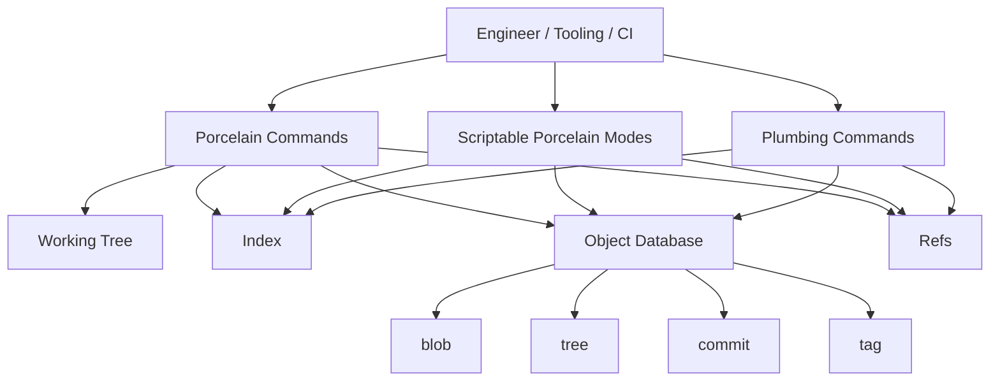
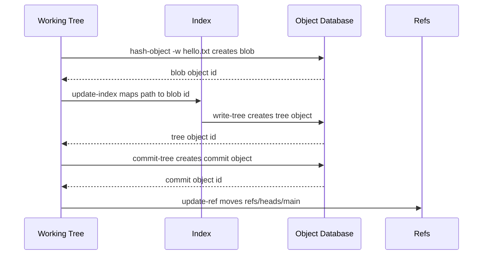

# Part 007 — Porcelain vs Plumbing Commands

Git terlihat seperti kumpulan command yang banyak: `commit`, `merge`, `rebase`, `status`, `cat-file`, `update-ref`, `write-tree`, `rev-list`, dan seterusnya.

Cara engineer senior melihatnya berbeda:

> Git bukan sekadar CLI. Git adalah database object + index + reference store, dengan dua lapisan command: **porcelain** untuk workflow manusia dan **plumbing** untuk primitive internal yang lebih dekat ke storage dan graph operation.

Dokumentasi resmi Git sendiri membagi command menjadi high-level **porcelain** dan low-level **plumbing**. Git glossary juga mendeskripsikan plumbing sebagai core Git dan porcelain sebagai interface level lebih tinggi di atas core tersebut.

Tujuan part ini bukan menghafal command. Tujuannya membangun mental model: saat menjalankan command Git apa pun, tanyakan:

1. Command ini membaca atau menulis object database?
2. Command ini membaca atau menulis index?
3. Command ini membaca atau menulis refs?
4. Command ini menyentuh working tree?
5. Output-nya untuk manusia atau aman untuk script?

Kalau lima pertanyaan ini jelas, Git menjadi jauh lebih mudah diprediksi.

---

## 1. Masalah yang Diselesaikan oleh Layering Command Git

Git punya dua kebutuhan yang bertentangan:

| Kebutuhan | Karakteristik |
|---|---|
| Workflow harian manusia | Command harus nyaman, ringkas, aman, dan menyembunyikan detail internal. |
| Operasi internal presisi | Command harus deterministic, composable, scriptable, dan dekat ke object/index/ref. |

Porcelain menjawab kebutuhan pertama.

Plumbing menjawab kebutuhan kedua.

Contoh sederhana:

```bash
# Porcelain
git commit -m "Add audit event projection"

# Plumbing-ish sequence behind the mental model
# 1. index sudah berisi proposed tree
# 2. tree object dibuat dari index
# 3. commit object dibuat dengan parent HEAD
# 4. current branch ref digeser ke commit baru
```

`git commit` nyaman karena ia mengorkestrasi banyak operasi: membaca index, membuat tree, membuat commit, menentukan parent, menjalankan hook, membuka editor bila perlu, dan menggeser branch ref.

Plumbing membiarkan kita melihat atau melakukan potongan operasi itu secara eksplisit.

---

## 2. Diagram Mental: Porcelain di Atas Primitive Git



Porcelain bukan “lebih rendah kualitasnya”. Porcelain adalah API manusia. Plumbing bukan “lebih keren”. Plumbing adalah API primitif.

Engineer kuat tahu kapan harus memakai masing-masing.

---

## 3. Definisi Operasional

### 3.1 Porcelain

Porcelain adalah command yang didesain untuk workflow manusia. Ia biasanya:

- punya output yang mudah dibaca;
- melakukan beberapa operasi sekaligus;
- punya banyak safeguard;
- bisa berubah tampilannya agar lebih nyaman untuk manusia;
- sering menjalankan hooks;
- sering membuat keputusan default berdasarkan config.

Contoh porcelain:

```bash
git status
git add
git commit
git switch
git restore
git checkout
git merge
git rebase
git pull
git push
git log
git show
git stash
git cherry-pick
git revert
```

### 3.2 Plumbing

Plumbing adalah command yang dekat ke primitive internal Git. Ia biasanya:

- membaca/menulis object secara eksplisit;
- membaca/menulis index secara eksplisit;
- membaca/menulis refs secara eksplisit;
- output lebih stabil dan composable;
- cocok untuk debugging, scripting, dan automation;
- lebih berbahaya kalau dipakai tanpa mental model.

Contoh plumbing:

```bash
git hash-object
git cat-file
git update-index
git write-tree
git commit-tree
git update-ref
git symbolic-ref
git show-ref
git for-each-ref
git ls-files
git ls-tree
git rev-parse
git rev-list
git diff-index
git diff-tree
git read-tree
git merge-base
git verify-pack
```

Dokumentasi referensi Git memisahkan banyak command ini di bagian “plumbing commands”, termasuk `cat-file`, `commit-tree`, `diff-index`, `for-each-ref`, `hash-object`, `ls-files`, `ls-tree`, `merge-base`, `read-tree`, `rev-list`, `rev-parse`, `show-ref`, `symbolic-ref`, `update-index`, `update-ref`, dan `write-tree`.

---

## 4. Tabel Pemetaan Porcelain ke Primitive yang Relevan

Tabel ini tidak berarti porcelain selalu memanggil plumbing command tersebut secara literal. Ini adalah pemetaan mental: primitive apa yang secara konseptual terlibat.

| Porcelain | Primitive yang Terlibat | State yang Dibaca/Ditulis |
|---|---|---|
| `git status` | `diff-index`, `diff-files`, `ls-files` | HEAD, index, working tree |
| `git add` | `hash-object`, `update-index` | object database, index |
| `git commit` | `write-tree`, `commit-tree`, `update-ref` | index, object database, refs |
| `git branch` | `show-ref`, `update-ref`, `symbolic-ref` | refs |
| `git switch` | `symbolic-ref`, `read-tree`, checkout mechanics | HEAD, index, working tree |
| `git merge` | `merge-base`, `read-tree`, index conflict stages, `commit-tree` | graph, index, working tree, refs |
| `git rebase` | `rev-list`, patch replay, `update-ref` | graph, refs, working tree |
| `git log` | `rev-list` | commit graph |
| `git show` | `cat-file`, diff plumbing | object database, commit/tree/blob |
| `git tag` | `update-ref`, tag object creation | refs, object database |
| `git push` | refspec negotiation, pack transfer, ref update | local refs, remote refs, object database |

Kekuatan mental model ini: ketika porcelain gagal, kita tahu subsistem mana yang harus dibaca.

Contoh:

```bash
git commit
# error: cannot commit because you have unmerged files
```

Ini bukan masalah “commit”. Ini masalah **index**. Ada conflict stages di index. Maka command pembaca state yang tepat:

```bash
git ls-files -u
git status --short
git diff --ours
git diff --theirs
```

---

## 5. Porcelain Output Bukan Selalu API untuk Script

Salah satu kesalahan umum automation Git adalah parsing output human-readable.

Contoh buruk:

```bash
# Rapuh: output status manusia bisa berubah, localization bisa mengganggu,
# path dengan spasi/newline bisa merusak parsing.
git status | grep "modified"
```

Lebih baik:

```bash
# Format porcelain didesain lebih stabil untuk script.
git status --porcelain=v1 -z
```

Atau gunakan command plumbing/scriptable yang memang menghasilkan format terkontrol:

```bash
git diff --name-only -z
git diff --cached --name-status -z
git ls-files -z
git for-each-ref --format='%(refname)%00%(objectname)%00%(committerdate:iso8601)'
```

Rule internal engineering handbook:

> Untuk automation, jangan parse output manusia jika Git menyediakan `--porcelain`, `--format`, `-z`, atau plumbing equivalent.

`-z` penting karena path file bisa mengandung spasi, tab, quote, unicode, bahkan newline. Banyak script Git internal perusahaan rusak bukan karena Git sulit, tetapi karena script mengasumsikan filename adalah token sederhana.

---

## 6. Command Safety Tiers

Tidak semua command punya risiko yang sama.

### Tier 0 — Pure Read

Aman untuk investigasi. Tidak mengubah state repository.

```bash
git status
git log
git show
git cat-file -t <object>
git cat-file -p <object>
git rev-parse HEAD
git show-ref
git for-each-ref
git ls-files
git ls-tree HEAD
git merge-base main HEAD
```

### Tier 1 — Working Tree / Index Write

Mengubah working tree atau index, tetapi biasanya belum mengubah branch history.

```bash
git add
git restore
git checkout -- <path>
git reset <path>
git update-index
git read-tree
```

Risiko: kehilangan perubahan lokal kalau tidak paham target tree.

### Tier 2 — Local Ref Write

Menggeser branch/tag/ref lokal.

```bash
git commit
git reset --hard
git branch -f
git tag -f
git update-ref
git rebase
git cherry-pick
git revert
```

Risiko: history lokal berubah. Biasanya masih recoverable via reflog, tapi tetap perlu disiplin.

### Tier 3 — Remote Ref Write

Mengubah state yang dilihat orang lain.

```bash
git push
git push --force
git push --force-with-lease
git push origin :branch-name
```

Risiko: merusak workflow tim, CI, release, atau dependency downstream.

### Tier 4 — History Rewrite / Object Removal

Mengubah banyak commit atau menghapus object reachability.

```bash
git filter-repo
git filter-branch
git gc --prune=now
git reflog expire --expire=now --all
```

Risiko: blast radius besar, terutama untuk shared repository.

---

## 7. Build a Commit Without `git commit`

Latihan ini penting. Setelah melakukannya, `git commit` tidak lagi terasa magis.

Buat repository percobaan:

```bash
mkdir /tmp/git-plumbing-lab
cd /tmp/git-plumbing-lab
git init
```

Buat blob object:

```bash
printf 'hello git database\n' > hello.txt
blob_id=$(git hash-object -w hello.txt)
echo "$blob_id"
```

`hash-object -w` menulis content ke object database sebagai blob.

Masukkan blob ke index:

```bash
git update-index --add --cacheinfo 100644 "$blob_id" hello.txt
```

Index sekarang menyatakan: “next tree punya file `hello.txt` dengan mode `100644` dan object `$blob_id`.”

Tulis tree object dari index:

```bash
tree_id=$(git write-tree)
echo "$tree_id"
git cat-file -p "$tree_id"
```

Buat commit object:

```bash
commit_id=$(echo 'Initial commit via plumbing' | git commit-tree "$tree_id")
echo "$commit_id"
git cat-file -p "$commit_id"
```

Geser branch current ke commit itu:

```bash
git update-ref refs/heads/main "$commit_id"
git symbolic-ref HEAD refs/heads/main
```

Checkout working tree sesuai index/HEAD bila perlu:

```bash
git status
git log --oneline --decorate
git show --stat
```

Apa yang baru saja terjadi?



`git commit` adalah porcelain yang menyederhanakan sequence ini, ditambah hooks, editor, identity, parent detection, message handling, dan safety checks.

---

## 8. Membaca Object: `cat-file` sebagai Microscope

`git cat-file` adalah command yang membuat object database bisa diinspeksi langsung. Dokumentasi resminya menjelaskan command ini dapat meng-output content atau properti seperti size, type, atau informasi delta dari object.

Gunakan untuk menjawab pertanyaan:

| Pertanyaan | Command |
|---|---|
| Object ini tipe apa? | `git cat-file -t <object>` |
| Berapa ukuran object? | `git cat-file -s <object>` |
| Apa isi human-readable object ini? | `git cat-file -p <object>` |
| Apakah object ini ada? | `git cat-file -e <object>` |
| Batch inspect banyak object? | `git cat-file --batch-check` |

Contoh:

```bash
git cat-file -t HEAD
git cat-file -p HEAD
git cat-file -p HEAD^{tree}
git cat-file -p HEAD:README.md
```

`HEAD:README.md` berarti: blob pada path `README.md` di tree commit `HEAD`.

Ini lebih presisi daripada “lihat file di branch”. Yang sebenarnya dibaca adalah object di tree tertentu.

---

## 9. Membaca Revisi: `rev-parse` sebagai Resolver

Banyak command Git menerima nama revisi fleksibel:

```bash
HEAD
main
origin/main
HEAD~1
HEAD^2
v1.2.0
main^{tree}
HEAD:src/App.java
```

`git rev-parse` membantu mengubah nama-nama ini menjadi object id atau informasi repository.

Contoh:

```bash
git rev-parse HEAD
git rev-parse --short HEAD
git rev-parse --abbrev-ref HEAD
git rev-parse --show-toplevel
git rev-parse --git-dir
git rev-parse main^{tree}
git rev-parse HEAD:README.md
```

Gunakan `rev-parse` saat script butuh fakta, bukan asumsi.

Contoh buruk:

```bash
repo_root=$(pwd)
```

Lebih benar:

```bash
repo_root=$(git rev-parse --show-toplevel)
```

Contoh buruk:

```bash
branch=$(git branch | grep '^*' | cut -d' ' -f2)
```

Lebih benar:

```bash
branch=$(git branch --show-current)
# atau untuk compatibility / detached detection:
branch=$(git symbolic-ref --quiet --short HEAD || true)
```

---

## 10. Membaca Graph: `rev-list` sebagai Engine

`git log` adalah UI untuk manusia.

`git rev-list` adalah engine graph traversal.

Dokumentasi `git-rev-list` menyebutnya essential command karena menyediakan kemampuan membangun dan menelusuri commit ancestry graph, dipakai oleh command seperti `git bisect` dan `git repack`.

Contoh:

```bash
# Commit reachable dari HEAD, terbaru dulu
git rev-list HEAD

# Commit di feature yang belum ada di main
git rev-list main..feature

# Hitung ahead/behind relatif upstream
git rev-list --left-right --count @{upstream}...HEAD

# Cari commit yang menyentuh path tertentu
git rev-list HEAD -- src/main/java

# Commit pertama dari range tertentu, useful untuk boundaries
git rev-list --reverse main..HEAD | head -n 1
```

Porcelain seperti `git log` lebih enak dibaca:

```bash
git log --oneline --graph --decorate --boundary main...HEAD
```

Tetapi automation sering lebih cocok memakai `rev-list`.

---

## 11. Membaca Refs: `show-ref`, `for-each-ref`, `symbolic-ref`

Branch dan tag adalah refs. Jangan perlakukan branch sebagai folder. Ia pointer.

Command penting:

```bash
# Semua refs
git show-ref

# Apakah ref tertentu ada?
git show-ref --verify refs/heads/main

# Format custom semua branch lokal
git for-each-ref refs/heads --format='%(refname:short) %(objectname:short) %(committerdate:relative)'

# HEAD menunjuk ke mana?
git symbolic-ref HEAD

# Nama branch current, kosong/error jika detached
git symbolic-ref --quiet --short HEAD
```

`for-each-ref` sangat berguna untuk tooling internal:

```bash
git for-each-ref refs/heads \
  --sort=-committerdate \
  --format='%(refname:short)%09%(objectname:short)%09%(committerdate:iso8601)%09%(authorname)'
```

Ini jauh lebih stabil daripada parsing `git branch -vv` untuk script.

---

## 12. Membaca Index: `ls-files` sebagai X-Ray

`git status` menceritakan ringkasan. `git ls-files` menunjukkan isi index.

Contoh:

```bash
# Tracked files dalam index
git ls-files

# Stage info: mode, object id, stage, path
git ls-files --stage

# Conflict entries
git ls-files -u

# Ignored files matching rules
git ls-files --ignored --exclude-standard --others

# Deleted tracked files
git ls-files --deleted

# Modified tracked files
git ls-files --modified
```

Saat merge conflict, index bisa punya beberapa entry untuk path yang sama:

```text
100644 <base>   1    src/Policy.java
100644 <ours>   2    src/Policy.java
100644 <theirs> 3    src/Policy.java
```

Artinya:

| Stage | Meaning |
|---:|---|
| 1 | merge base |
| 2 | ours |
| 3 | theirs |

Kalau Anda hanya melihat conflict marker di file, Anda baru melihat working tree. Kalau melihat `ls-files -u`, Anda melihat struktur conflict di index.

---

## 13. Plumbing untuk Diff: Membandingkan Tree, Index, Working Tree

Tiga pertanyaan fundamental:

| Pertanyaan | Command Porcelain | Plumbing / Lower-Level Equivalent |
|---|---|---|
| Apa beda working tree vs index? | `git diff` | `git diff-files` |
| Apa beda index vs HEAD? | `git diff --cached` | `git diff-index --cached HEAD` |
| Apa beda dua tree/commit? | `git diff A B` | `git diff-tree A B` |

Contoh scripting:

```bash
# Fail jika ada staged changes
git diff-index --cached --quiet HEAD -- || {
  echo "staged changes exist"
  exit 1
}

# Fail jika working tree dirty tracked files
git diff-files --quiet -- || {
  echo "working tree has unstaged tracked changes"
  exit 1
}
```

Hati-hati: untracked files tidak tercakup oleh `diff-files`. Untuk itu gunakan `git ls-files --others --exclude-standard`.

---

## 14. Porcelain Bisa Punya Mode Scriptable

Tidak semua penggunaan porcelain buruk untuk script. Banyak porcelain menyediakan mode stabil.

| Need | Prefer |
|---|---|
| Status machine-readable | `git status --porcelain=v1 -z` |
| Branch current | `git branch --show-current` atau `git symbolic-ref --short HEAD` |
| Log custom | `git log --format=...` |
| Diff file list | `git diff --name-only -z` |
| Diff name/status | `git diff --name-status -z` |
| Show commit fields | `git show --format=... --no-patch` |

Contoh aman:

```bash
git status --porcelain=v1 -z | while IFS= read -r -d '' entry; do
  printf 'status-entry=%q\n' "$entry"
done
```

Untuk shell scripts, selalu pikirkan path aneh:

```text
normal.txt
file with spaces.txt
file	with	tabs.txt
file
with
newline.txt
```

Script internal berkualitas harus benar untuk semua itu, bukan hanya untuk demo repository.

---

## 15. Kapan Menggunakan Porcelain

Gunakan porcelain untuk:

- workflow harian manusia;
- command yang harus menjalankan hooks dan safety checks;
- operasi yang lebih baik dibiarkan Git mengorkestrasi;
- onboarding engineer;
- proses standar yang mudah diaudit.

Contoh:

```bash
git switch -c feature/audit-policy
git add -p
git commit --fixup=<commit>
git rebase -i --autosquash main
git push --force-with-lease
```

Porcelain yang dipakai dengan disiplin jauh lebih aman daripada plumbing manual yang sok presisi.

---

## 16. Kapan Menggunakan Plumbing

Gunakan plumbing untuk:

- debugging internal state;
- forensic repository analysis;
- scripting CI/CD;
- building internal developer tools;
- verifying invariants;
- inspecting object/index/ref tanpa side effect;
- performance analysis;
- migration tooling.

Contoh:

```bash
# Verify release tag points to expected commit
tag_commit=$(git rev-parse v1.8.4^{commit})
expected=$(cat build/expected-commit.txt)
[ "$tag_commit" = "$expected" ] || exit 1
```

```bash
# List stale local branches by committer date, script-friendly-ish output
git for-each-ref refs/heads \
  --sort=committerdate \
  --format='%(committerdate:iso8601)%09%(refname:short)%09%(objectname:short)'
```

```bash
# Detect unmerged index entries
test -z "$(git ls-files -u)" || {
  echo "repository has unresolved conflicts"
  exit 1
}
```

---

## 17. Dangerous Plumbing: `update-ref`, `read-tree`, `update-index`

Plumbing is powerful because it bypasses human-friendly workflows.

### `update-ref`

`update-ref` moves refs directly.

```bash
git update-ref refs/heads/main <new-commit>
```

This can be correct in tooling, but dangerous by hand.

Safer form uses old value as compare-and-swap:

```bash
old=$(git rev-parse refs/heads/main)
new=$(git rev-parse feature)
git update-ref refs/heads/main "$new" "$old"
```

If `main` moved between reading `old` and updating, command fails. This is the same safety idea behind lease-based update.

### `read-tree`

`read-tree` reads tree information into index, and with options can affect checkout behavior. Used incorrectly, it can replace index state in surprising ways.

Before low-level index operations:

```bash
git status --short
git diff --stat
git diff --cached --stat
git rev-parse HEAD
```

### `update-index`

`update-index` directly edits index entries and flags such as assume-unchanged or skip-worktree.

Misuse can make files appear to “not change” from your workflow perspective.

Inspect suspicious flags:

```bash
git ls-files -v
```

Common prefixes matter:

| Prefix | Meaning, practically |
|---|---|
| lowercase-ish / special flags | file has index flag such as assume-unchanged / skip-worktree depending output mode |
| normal tracked entry | ordinary index tracking |

Do not use `assume-unchanged` as a personal config-hiding mechanism. It is a performance hint, not a workflow policy.

---

## 18. Practical Pattern: Read Before Write

For any risky Git operation, build a read-before-write protocol.

### Before rebase

```bash
git status --short --branch
git log --oneline --graph --decorate --boundary @{upstream}...HEAD
git rev-list --left-right --count @{upstream}...HEAD
```

### Before force push

```bash
git fetch origin
git log --oneline --graph --decorate --boundary origin/$(git branch --show-current)...HEAD
git rev-list --left-right --count origin/$(git branch --show-current)...HEAD
git push --force-with-lease
```

### Before deleting branch

```bash
git branch --merged main
git log --oneline main..branch-to-delete
git branch -d branch-to-delete
```

If not merged but intentionally abandoned:

```bash
git branch -D branch-to-delete
```

But first preserve pointer if there is any doubt:

```bash
git tag backup/branch-to-delete branch-to-delete
```

---

## 19. Building Internal Git Tooling: Stable Interfaces

When building an internal CLI around Git, prefer this style:

```bash
repo_root=$(git rev-parse --show-toplevel)
head=$(git rev-parse HEAD)
branch=$(git symbolic-ref --quiet --short HEAD || echo DETACHED)
upstream=$(git rev-parse --abbrev-ref --symbolic-full-name '@{upstream}' 2>/dev/null || true)
```

Avoid this style:

```bash
branch=$(git status | head -n 1 | sed 's/On branch //')
```

For refs:

```bash
git for-each-ref refs/heads refs/tags \
  --format='%(refname)%00%(objecttype)%00%(objectname)%00%(creatordate:iso8601)%00%(subject)'
```

For file lists:

```bash
git diff --name-only -z "$base" "$head"
```

For commit lists:

```bash
git rev-list --reverse "$base..$head"
```

For commit metadata:

```bash
git show -s --format='%H%x00%P%x00%an%x00%ae%x00%aI%x00%s' "$commit"
```

The `%x00` null separator avoids ambiguity between fields.

---

## 20. Mini Case Study: CI Job That Detects Unsafe Release Branch State

Problem:

A release job must ensure:

1. repository is on a branch, not detached unexpectedly;
2. branch has upstream;
3. branch is not behind upstream;
4. working tree has no tracked modifications;
5. index has no staged changes;
6. no unresolved conflicts;
7. tag does not already exist.

Possible implementation:

```bash
#!/usr/bin/env bash
set -euo pipefail

branch=$(git symbolic-ref --quiet --short HEAD || true)
if [ -z "$branch" ]; then
  echo "ERROR: detached HEAD; release must run from named branch"
  exit 1
fi

upstream=$(git rev-parse --abbrev-ref --symbolic-full-name '@{upstream}' 2>/dev/null || true)
if [ -z "$upstream" ]; then
  echo "ERROR: branch has no upstream"
  exit 1
fi

git fetch --prune

read behind ahead < <(git rev-list --left-right --count "$upstream...HEAD")
if [ "$behind" != "0" ]; then
  echo "ERROR: branch is behind upstream by $behind commits"
  exit 1
fi

if ! git diff-files --quiet --; then
  echo "ERROR: unstaged tracked changes exist"
  exit 1
fi

if ! git diff-index --cached --quiet HEAD --; then
  echo "ERROR: staged changes exist"
  exit 1
fi

if [ -n "$(git ls-files -u)" ]; then
  echo "ERROR: unresolved conflicts exist"
  exit 1
fi

version=${1:?usage: release-check vX.Y.Z}
if git show-ref --verify --quiet "refs/tags/$version"; then
  echo "ERROR: tag $version already exists"
  exit 1
fi

echo "OK: release branch state is safe"
```

Notice the design:

- use `symbolic-ref` instead of parsing `status`;
- use `rev-list --left-right --count` for ahead/behind;
- use `diff-files` and `diff-index` for tracked dirty state;
- use `ls-files -u` for conflict state;
- use `show-ref --verify` for tag existence.

This is what “Git In Action” means: not knowing random commands, but choosing commands based on state model.

---

## 21. Anti-Patterns

### Anti-Pattern 1: Parsing Human Output

```bash
git branch | grep '*'
```

Prefer:

```bash
git branch --show-current
# or
git symbolic-ref --quiet --short HEAD
```

### Anti-Pattern 2: Using Plumbing to Bypass Policy

```bash
git update-ref refs/heads/main HEAD
```

If the team policy says main changes through PR + CI, bypassing that locally is not clever. It is governance failure.

### Anti-Pattern 3: Treating `git pull` as Atomic Magic

`git pull` is fetch + integrate. The integration mode may be merge, rebase, or ff-only depending config. For deterministic workflow, teams should standardize pull behavior.

### Anti-Pattern 4: Using `assume-unchanged` to Hide Local Config

This creates local invisible state and causes “works on my machine” behavior. Use ignored local config files or template config instead.

### Anti-Pattern 5: Force Push Without Lease

```bash
git push --force
```

Prefer:

```bash
git push --force-with-lease
```

Even better: inspect remote relation first.

---

## 22. Command Selection Framework

Use this decision table:

| Situation | Use |
|---|---|
| Human daily workflow | Porcelain |
| Need readable overview | Porcelain with concise flags |
| Need stable script output | Porcelain `--porcelain`, `--format`, `-z`, or plumbing |
| Need inspect object | `cat-file`, `show`, `ls-tree` |
| Need inspect refs | `show-ref`, `for-each-ref`, `symbolic-ref` |
| Need inspect graph | `rev-list`, `merge-base`, `log` |
| Need inspect index | `ls-files`, `diff-index`, `diff-files` |
| Need mutate refs safely in tooling | `update-ref` with expected old value |
| Need mutate history shared by team | Prefer porcelain + team protocol |

---

## 23. Exercises

### Exercise 1 — Explain a Commit as Primitive Operations

In a scratch repo:

```bash
echo one > a.txt
git add a.txt
git commit -m "Add a"
```

Now answer:

1. What object type stores `one`?
2. What object type maps `a.txt` to that content?
3. What object type points to that tree?
4. What ref moved?
5. What command can inspect each object?

Expected direction:

```bash
git cat-file -p HEAD
git cat-file -p HEAD^{tree}
git cat-file -p HEAD:a.txt
```

### Exercise 2 — Build Commit Manually

Repeat the plumbing commit lab without using `git add` or `git commit`:

```bash
git hash-object -w
git update-index --add --cacheinfo
git write-tree
git commit-tree
git update-ref
```

Then compare:

```bash
git log --oneline --decorate
git status --short --branch
```

### Exercise 3 — Script Dirty State Safely

Write a script that fails if:

- unstaged tracked changes exist;
- staged changes exist;
- untracked files exist;
- unresolved conflicts exist.

Do not parse `git status` human output. Use scriptable commands.

### Exercise 4 — Ref Inventory

Create three branches and two tags. Then list them with:

```bash
git for-each-ref --format='%(refname:short) %(objecttype) %(objectname:short)'
```

Explain why a lightweight tag and annotated tag can have different object type behavior.

---

## 24. Invariants to Remember

1. Porcelain is optimized for human workflow.
2. Plumbing is optimized for primitive operations and composition.
3. Most porcelain can be explained as object/index/ref/working-tree operations.
4. Do not parse human output in automation when stable output exists.
5. `cat-file` reads objects; `rev-parse` resolves names; `rev-list` walks graph; `for-each-ref` enumerates refs; `ls-files` reveals index.
6. Direct ref mutation is powerful and dangerous; use expected-old-value safety when scripting.
7. Good Git tooling is not a pile of shell hacks. It is a state machine over Git’s real storage model.

---

## 25. References

- Git command reference: https://git-scm.com/docs/git
- Git glossary, porcelain and plumbing: https://git-scm.com/docs/gitglossary
- Git reference index, plumbing commands: https://git-scm.com/docs
- `git cat-file`: https://git-scm.com/docs/git-cat-file
- `git rev-parse`: https://git-scm.com/docs/git-rev-parse
- `git rev-list`: https://git-scm.com/docs/git-rev-list
- `git status`: https://git-scm.com/docs/git-status
- `git show`: https://git-scm.com/docs/git-show
- Pro Git, Git Internals: https://git-scm.com/book/en/v2/Git-Internals-Plumbing-and-Porcelain
