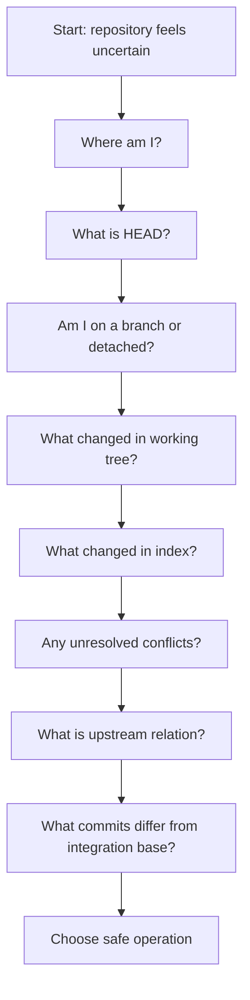
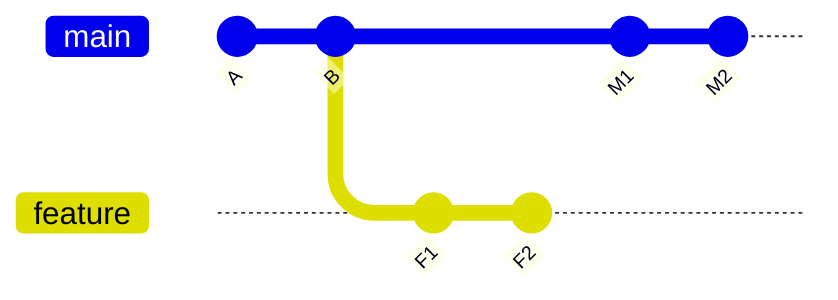

# Part 008 — Reading Git State Like an Engineer

Banyak kesalahan Git terjadi bukan karena command-nya sulit, tetapi karena engineer melakukan **write operation** sebelum membaca state dengan benar.

Contoh:

```bash
git pull
git reset --hard
git rebase main
git push --force
```

Semua command di atas bisa benar. Semua juga bisa merusak pekerjaan kalau dilakukan saat state repository belum dipahami.

Mental model part ini:

> Engineer kuat tidak bertanya “command apa yang harus saya jalankan?” terlebih dahulu. Ia bertanya “state repository saya sekarang apa?” lalu memilih command berdasarkan state itu.

Git state minimal terdiri dari:

1. lokasi repository;
2. object database;
3. current `HEAD`;
4. current branch atau detached HEAD;
5. index;
6. working tree;
7. upstream relation;
8. conflict state;
9. local refs;
10. remote-tracking refs;
11. optional state seperti sparse checkout, submodule, worktree, hooks, LFS.

Part ini adalah playbook membaca state Git secara deterministic.

---

## 1. State Reading Protocol

Gunakan protokol ini sebelum operasi berisiko:



This is Git equivalent of checking system state before changing production.

---

## 2. First Question: Am I Inside the Repository I Think I Am?

Large organizations often have nested repositories, generated folders, submodules, worktrees, or scripts run from arbitrary directories. Never assume `pwd` is repository root.

Use:

```bash
git rev-parse --show-toplevel
git rev-parse --git-dir
git rev-parse --is-inside-work-tree
git rev-parse --is-bare-repository
```

Interpretation:

| Command | Meaning |
|---|---|
| `--show-toplevel` | Absolute path to working tree root. |
| `--git-dir` | Path to `.git` directory or gitdir file target. |
| `--is-inside-work-tree` | Whether current directory is inside working tree. |
| `--is-bare-repository` | Whether repo has no working tree. |

Example:

```bash
repo_root=$(git rev-parse --show-toplevel)
cd "$repo_root"
```

This matters for scripts. Running from `src/module` and assuming relative paths from root is a common source of CI-only failures.

---

## 3. Second Question: What Is `HEAD`?

`HEAD` is your current commit reference. Usually it symbolically points to a branch. Sometimes it points directly to a commit: detached HEAD.

Read it:

```bash
git rev-parse HEAD
git rev-parse --short HEAD
git symbolic-ref --quiet --short HEAD || echo "DETACHED"
git status --short --branch
```

Typical outputs:

```text
## main...origin/main
```

or:

```text
## HEAD (no branch)
```

Detached HEAD is not automatically bad. It is common in CI, bisect, checking old releases, and inspecting tags. It is risky if you expect new commits to advance a branch.

Decision:

| State | Meaning | Next Action |
|---|---|---|
| On branch | commits advance branch ref | normal local development |
| Detached HEAD | commits are reachable only by direct hash/reflog unless ref created | create branch before doing durable work |
| No HEAD | unborn branch / empty repo | first commit path |

If detached but you want to keep work:

```bash
git switch -c recovery/my-work
```

---

## 4. Third Question: What Will Be Committed?

Remember the three trees:

```text
HEAD          = last committed snapshot
Index         = proposed next commit
Working Tree  = files on disk
```

To know what will be committed:

```bash
git diff --cached --stat
git diff --cached
git status --short
```

`git status` documentation states that it displays paths with differences between index and HEAD, paths with differences between working tree and index, and untracked paths not ignored. That maps directly to the three-tree model.

Interpret `git status --short`:

```text
XY path
```

- `X` = index status relative to HEAD
- `Y` = working tree status relative to index

Common examples:

| Short Status | Meaning |
|---|---|
| ` M file` | modified in working tree, not staged |
| `M  file` | staged modification |
| `MM file` | staged modification and additional unstaged modification |
| `A  file` | staged new file |
| `?? file` | untracked file |
| `UU file` | unresolved conflict |

Operational rule:

> Before `git commit`, read `git diff --cached`. Before `git add`, read `git diff`. Before `git reset`, read both.

---

## 5. Fourth Question: What Changed but Is Not Staged?

Use:

```bash
git diff --stat
git diff
git diff --check
```

`git diff` without flags compares working tree to index. It does **not** show staged changes.

This surprises people:

```bash
git add service.java
git diff
# no output maybe
```

No output does not mean “nothing changed”. It means working tree equals index for tracked files.

Check staged diff:

```bash
git diff --cached
```

Check both quickly:

```bash
git status --short
git diff --stat
git diff --cached --stat
```

---

## 6. Fifth Question: Are There Untracked or Ignored Files That Matter?

Untracked files are not in index. They can still affect builds, tests, codegen, or local scripts.

Read untracked:

```bash
git ls-files --others --exclude-standard
```

Read ignored files:

```bash
git ls-files --others --ignored --exclude-standard
```

Use null-safe format for scripts:

```bash
git ls-files --others --exclude-standard -z
```

Failure mode:

A generated config file is untracked locally. Tests pass locally because the file exists. CI fails because the file is absent. `git status` may show it as `??`, or hide it if ignored.

Engineering policy:

- Required generated files should be generated in CI too.
- Local-only config should have explicit template, for example `.env.example`.
- Build should fail clearly when required generated state is missing.

---

## 7. Sixth Question: Is the Index in a Conflict State?

Conflict state lives in the index.

Read it:

```bash
git status --short
git ls-files -u
```

`git ls-files -u` shows unmerged entries.

Example:

```text
100644 a1b2c3... 1 src/DecisionPolicy.java
100644 d4e5f6... 2 src/DecisionPolicy.java
100644 9a8b7c... 3 src/DecisionPolicy.java
```

Interpretation:

| Stage | Meaning |
|---:|---|
| 1 | base |
| 2 | ours |
| 3 | theirs |

Read versions:

```bash
git show :1:src/DecisionPolicy.java
git show :2:src/DecisionPolicy.java
git show :3:src/DecisionPolicy.java
```

During conflict, working tree file with markers is only one projection of the unresolved state. The real merge state is in index stages.

Safe conflict inspection:

```bash
git diff --base -- src/DecisionPolicy.java
git diff --ours -- src/DecisionPolicy.java
git diff --theirs -- src/DecisionPolicy.java
git diff --cc -- src/DecisionPolicy.java
```

Do not resolve conflict by blindly choosing ours/theirs unless semantics are truly clear.

---

## 8. Seventh Question: What Is My Upstream Relation?

Branch work is rarely isolated. You need to know relation between local branch and upstream.

Use:

```bash
git branch -vv
git rev-parse --abbrev-ref --symbolic-full-name '@{upstream}'
git rev-list --left-right --count '@{upstream}...HEAD'
```

Example output:

```text
3 2
```

Interpretation for:

```bash
git rev-list --left-right --count @{upstream}...HEAD
```

| Number | Meaning |
|---:|---|
| first | commits reachable from upstream not from HEAD: local branch is behind by this many |
| second | commits reachable from HEAD not from upstream: local branch is ahead by this many |

Use it before push or rebase:

```bash
git fetch --prune
read behind ahead < <(git rev-list --left-right --count @{upstream}...HEAD)
echo "behind=$behind ahead=$ahead"
```

Decision table:

| behind | ahead | Meaning | Typical Action |
|---:|---:|---|---|
| 0 | 0 | synchronized | continue |
| 0 | >0 | local ahead | push or PR |
| >0 | 0 | local behind | fast-forward / pull ff-only |
| >0 | >0 | diverged | inspect, merge/rebase consciously |

---

## 9. Eighth Question: What Commits Are Actually Different?

Counts are useful but insufficient. Read the commits.

```bash
git log --oneline --graph --decorate --boundary @{upstream}...HEAD
```

For local-only commits:

```bash
git log --oneline @{upstream}..HEAD
```

For upstream-only commits:

```bash
git log --oneline HEAD..@{upstream}
```

For patch-level view:

```bash
git log --cherry-pick --right-only --oneline @{upstream}...HEAD
```

For changed files:

```bash
git diff --name-status @{upstream}...HEAD
```

Important distinction:

| Syntax | Meaning |
|---|---|
| `A..B` | commits reachable from B excluding commits reachable from A |
| `A...B` in log | symmetric difference: commits reachable from either side but not both |
| `A...B` in diff | often diff from merge-base(A,B) to B, depending command semantics |

Do not use range syntax casually in release tooling. Be explicit about desired semantics.

---

## 10. Ninth Question: What Is the Merge Base?

Merge/rebase/review correctness often depends on merge base.

Read it:

```bash
git merge-base main HEAD
git show --oneline --no-patch $(git merge-base main HEAD)
```

Visualize:

```bash
git log --oneline --graph --decorate --boundary main...HEAD
```

Mental model:



In this graph, merge base between `main` and `feature` is `B`. Review diff from merge base to feature shows what feature branch introduces relative to current divergence point.

Failure mode:

If feature branch is old, merge base is far behind. A PR can look large not because current work is large, but because branch drift accumulated. This is one reason short-lived branches reduce review noise.

---

## 11. Tenth Question: What Object Am I Looking At?

Use `git show` for high-level object view. Git show documentation says it shows one or more objects: blobs, trees, tags, and commits; for commits it shows log message and textual diff.

```bash
git show HEAD
git show --stat HEAD
git show --summary HEAD
git show --name-only HEAD
git show v1.2.0
git show HEAD:README.md
```

Use `cat-file` for lower-level object inspection:

```bash
git cat-file -t HEAD
git cat-file -p HEAD
git cat-file -t HEAD^{tree}
git cat-file -p HEAD^{tree}
git cat-file -t HEAD:README.md
git cat-file -p HEAD:README.md
```

Decision:

| Need | Command |
|---|---|
| Human-readable commit diff | `git show` |
| Object type | `git cat-file -t` |
| Raw-ish object pretty print | `git cat-file -p` |
| Object size | `git cat-file -s` |
| Tree listing | `git ls-tree` |

---

## 12. Eleventh Question: What Are the Local and Remote Refs?

List refs:

```bash
git show-ref
```

List local branches:

```bash
git for-each-ref refs/heads --format='%(refname:short) %(objectname:short) %(committerdate:relative)'
```

List remote-tracking branches:

```bash
git for-each-ref refs/remotes --format='%(refname:short) %(objectname:short) %(committerdate:relative)'
```

List tags with object detail:

```bash
git for-each-ref refs/tags --format='%(refname:short) %(objecttype) %(objectname:short) %(creatordate:iso8601)'
```

Check exact ref existence:

```bash
git show-ref --verify refs/heads/main
git show-ref --verify refs/tags/v1.0.0
```

Why this matters:

- `origin/main` is local remote-tracking state, not live remote state.
- It updates after `git fetch`.
- A stale `origin/main` can mislead merge-base and ahead/behind calculations.

Before important decisions:

```bash
git fetch --prune --tags
```

But know that fetching tags may have policy implications in some repositories.

---

## 13. Twelfth Question: Is There Reflog Evidence?

When something “disappears”, check reflog before panicking.

```bash
git reflog
git reflog show HEAD
git reflog show main
```

Reflog records local movements of refs. It is local evidence, not global truth.

Common recovery:

```bash
# find previous good commit in reflog
git reflog

# create branch at that point
git branch recovery/before-bad-rebase HEAD@{5}
```

Important:

- Reflog is local.
- Remote hosting may have separate server-side logs, but ordinary users may not access them.
- Reflog entries expire based on config and garbage collection behavior.

---

## 14. Thirteenth Question: Are There Worktrees?

Git worktree allows multiple working trees attached to one repository.

Read:

```bash
git worktree list
```

Why it matters:

- A branch checked out in another worktree may not be checkout-able here.
- Ref operations can affect worktrees differently than expected.
- Cleanup operations should consider all worktrees.

Failure mode:

You try:

```bash
git switch feature/audit
```

Git refuses because branch is already checked out elsewhere. That is Git protecting you from two working trees mutating the same branch pointer unsafely.

---

## 15. Fourteenth Question: Is Sparse Checkout Active?

Sparse checkout means working tree intentionally contains only subset of paths.

Read:

```bash
git sparse-checkout list
git config --get core.sparseCheckout
git ls-files -v | head
```

Why it matters:

- `git status` may be correct but incomplete relative to full repository tree.
- Files outside sparse cone are intentionally absent.
- Build/test scripts assuming full checkout may fail.
- `skip-worktree` index behavior becomes relevant.

If you suspect sparse state, do not “fix” missing files with random checkout commands. First understand sparse configuration.

---

## 16. Fifteenth Question: Are Submodules Involved?

Submodules are stored in superproject as gitlink entries pointing to specific commits in another repository.

Read:

```bash
git submodule status
git diff --submodule
git ls-tree HEAD path/to/submodule
```

Failure modes:

- Superproject points to submodule commit not fetched locally.
- Engineer commits inside submodule but forgets to commit superproject gitlink update.
- CI clones superproject without recursive submodule init.
- Detached HEAD inside submodule surprises developers.

State reading must happen both in superproject and submodule.

---

## 17. Sixteenth Question: Are File Mode or EOL Rules Creating Noise?

Unexpected diffs can come from metadata and normalization.

Read file mode config:

```bash
git config --get core.filemode
```

Read attributes:

```bash
git check-attr -a -- path/to/file
```

Read diff summary:

```bash
git diff --summary
```

Line endings:

```bash
git ls-files --eol
```

Failure mode:

A Windows developer modifies line endings across hundreds of files. Review becomes useless. `.gitattributes` should define normalization policy for text files.

---

## 18. Git State Snapshot Script

This script is useful before risky operations. It is read-only except `fetch` if enabled manually.

```bash
#!/usr/bin/env bash
set -euo pipefail

echo "== Repository =="
git rev-parse --show-toplevel
git rev-parse --git-dir
echo "inside_work_tree=$(git rev-parse --is-inside-work-tree)"
echo "bare=$(git rev-parse --is-bare-repository)"

echo
echo "== HEAD =="
echo "commit=$(git rev-parse HEAD 2>/dev/null || echo NO_HEAD)"
echo "short=$(git rev-parse --short HEAD 2>/dev/null || echo NO_HEAD)"
echo "branch=$(git symbolic-ref --quiet --short HEAD || echo DETACHED)"

echo
echo "== Status =="
git status --short --branch

echo
echo "== Diff Stats =="
echo "unstaged:"
git diff --stat || true
echo "staged:"
git diff --cached --stat || true

echo
echo "== Conflicts =="
if [ -n "$(git ls-files -u)" ]; then
  git ls-files -u
else
  echo "none"
fi

echo
echo "== Upstream =="
upstream=$(git rev-parse --abbrev-ref --symbolic-full-name '@{upstream}' 2>/dev/null || true)
if [ -n "$upstream" ]; then
  echo "upstream=$upstream"
  read behind ahead < <(git rev-list --left-right --count "$upstream...HEAD")
  echo "behind=$behind ahead=$ahead"
else
  echo "no upstream"
fi

echo
echo "== Recent History =="
git log --oneline --graph --decorate -n 20 || true

echo
echo "== Worktrees =="
git worktree list || true
```

Internal CLI idea: expose this as `git-doctor state` or `repo state`.

---

## 19. Scenario Playbooks

### Scenario A — “I Think I Lost My Commit”

Read state:

```bash
git status --short --branch
git reflog --date=iso
git log --oneline --graph --decorate --all -n 50
```

Search by message:

```bash
git log --all --grep='part of message' --oneline
```

Search dangling commits if needed:

```bash
git fsck --lost-found
```

First recovery move:

```bash
git branch recovery/lost-commit <commit-id>
```

Do not immediately run `gc`, prune, or more rewrites.

---

### Scenario B — “My Branch Diverged”

Read:

```bash
git fetch --prune
git status --short --branch
git rev-list --left-right --count @{upstream}...HEAD
git log --oneline --graph --decorate --boundary @{upstream}...HEAD
```

Decision:

- If local commits are private: rebase may be acceptable.
- If local commits are shared: merge or coordinated rebase.
- If upstream contains your commits under different hashes: use `range-diff` or patch-id reasoning before duplicating changes.

---

### Scenario C — “PR Diff Looks Too Large”

Read:

```bash
git fetch origin
git merge-base origin/main HEAD
git log --oneline --graph --decorate --boundary origin/main...HEAD
git diff --stat origin/main...HEAD
```

Likely causes:

- branch started too long ago;
- wrong target branch;
- merge-base drift;
- stacked branch opened against main instead of parent branch;
- generated files committed accidentally;
- line ending normalization changed many files.

---

### Scenario D — “Git Says Nothing to Commit but My File Changed”

Read:

```bash
git status --short --ignored
git ls-files -v -- path/to/file
git check-ignore -v path/to/file || true
git check-attr -a -- path/to/file
git diff -- path/to/file
git diff --cached -- path/to/file
```

Possible causes:

- file is untracked and ignored;
- file has assume-unchanged or skip-worktree flag;
- file is outside sparse checkout;
- generated file is not tracked;
- file mode or EOL normalization hides/shows changes differently.

---

### Scenario E — “CI Built a Different Commit Than I Expected”

Read locally:

```bash
git rev-parse HEAD
git show -s --format='%H %D %aI %s' HEAD
git status --short --branch
```

Read CI logs for:

- checked out SHA;
- ref name;
- PR merge ref vs head ref;
- checkout depth;
- tag fetch behavior;
- submodule state;
- dirty build metadata.

Best practice: build artifacts should embed Git metadata:

```text
commit_sha
source_ref
build_time
repository_url
is_dirty
version_tag
```

---

## 20. Read-Only Command Toolkit

Memorize this set. It covers most investigations.

```bash
# Location
git rev-parse --show-toplevel
git rev-parse --git-dir

# HEAD / branch
git rev-parse HEAD
git symbolic-ref --quiet --short HEAD || echo DETACHED
git status --short --branch

# Diffs
git diff
git diff --cached
git diff --stat
git diff --cached --stat

# Index
git ls-files --stage
git ls-files -u
git ls-files --others --exclude-standard

# Graph
git log --oneline --graph --decorate --all -n 30
git merge-base main HEAD
git rev-list --left-right --count main...HEAD

# Objects
git show --stat HEAD
git cat-file -t HEAD
git cat-file -p HEAD

# Refs
git show-ref
git for-each-ref refs/heads --format='%(refname:short) %(objectname:short)'

# Reflog
git reflog --date=iso

# Worktrees
git worktree list
```

---

## 21. State-Based Decision Matrix

| Observed State | Do Not Immediately Do | Safer First Move |
|---|---|---|
| Dirty working tree | `rebase`, `reset --hard`, `pull` | inspect `diff`, stash/commit intentionally |
| Staged changes unclear | `commit` | inspect `diff --cached` |
| Unresolved conflicts | `commit`, random checkout | inspect `ls-files -u`, resolve semantically |
| Detached HEAD with new work | switch away casually | create branch at HEAD |
| Branch behind upstream | force push | fetch, inspect behind commits |
| Branch diverged | blind pull | inspect graph, choose merge/rebase |
| Unknown release tag state | retag | inspect `show-ref`, tag object, consumers |
| Suspected lost commit | garbage collect | inspect reflog, create recovery branch |
| Huge unexpected diff | merge PR | inspect merge-base, EOL, generated files |
| CI mismatch | rerun blindly | compare built SHA/ref/depth/submodules |

---

## 22. Internal Engineering Standard: “State Before Mutation”

A strong team Git handbook should encode this rule:

> Before any command that rewrites history, deletes refs, force pushes, resets hard, cuts release tags, or repairs main, capture repository state first.

Minimum capture:

```bash
git status --short --branch
git rev-parse HEAD
git symbolic-ref --quiet --short HEAD || echo DETACHED
git log --oneline --graph --decorate -n 20
git reflog -n 20
```

For incident response, paste this snapshot into the incident channel before mutation. It reduces confusion and creates a lightweight audit trail.

---

## 23. Exercises

### Exercise 1 — Diagnose a Dirty Repository

Create a scratch repo, then create all states:

```bash
echo a > a.txt
git add a.txt
git commit -m "add a"

echo staged >> a.txt
git add a.txt

echo unstaged >> a.txt

echo untracked > b.txt
```

Now run:

```bash
git status --short
git diff
git diff --cached
git ls-files --others --exclude-standard
```

Explain each line.

### Exercise 2 — Create and Inspect Conflict Stages

Create two branches modifying same line. Merge to create conflict. Then inspect:

```bash
git ls-files -u
git show :1:<path>
git show :2:<path>
git show :3:<path>
git diff --cc -- <path>
```

Explain base/ours/theirs.

### Exercise 3 — Detached HEAD Recovery

Checkout old commit:

```bash
git switch --detach HEAD~1
```

Make a commit. Then preserve it:

```bash
git switch -c recovery/detached-work
```

Explain what would happen if you switched away without creating a ref.

### Exercise 4 — Ahead/Behind Reasoning

Create local and remote-like branches in one repo or two clones. Produce ahead/behind/diverged states. For each, run:

```bash
git rev-list --left-right --count upstream...HEAD
git log --oneline --graph --decorate --boundary upstream...HEAD
```

Explain the safe next action.

---

## 24. Invariants to Remember

1. Read state before mutation.
2. `git status --short --branch` is a compact starting point, not the full truth.
3. `git diff` shows working tree vs index; `git diff --cached` shows index vs HEAD.
4. Conflict state lives in index stages, not only in conflict markers.
5. `origin/main` is local remote-tracking state; fetch before relying on it.
6. Detached HEAD is safe for inspection, risky for durable new work unless you create a ref.
7. Ahead/behind counts without graph inspection are insufficient for risky decisions.
8. Reflog is your local time machine; use it before assuming work is lost.
9. Sparse checkout, submodules, ignored files, EOL, and index flags can make apparent state differ from expected state.
10. Advanced Git usage is mostly disciplined state reading plus conservative mutation.

---

## 25. References

- `git status`: https://git-scm.com/docs/git-status
- `git rev-parse`: https://git-scm.com/docs/git-rev-parse
- `git show`: https://git-scm.com/docs/git-show
- `git cat-file`: https://git-scm.com/docs/git-cat-file
- `git rev-list`: https://git-scm.com/docs/git-rev-list
- `git log`: https://git-scm.com/docs/git-log
- Git revisions syntax: https://git-scm.com/docs/revisions
- Git glossary: https://git-scm.com/docs/gitglossary
- Pro Git, Reset Demystified: https://git-scm.com/book/en/v2/Git-Tools-Reset-Demystified
