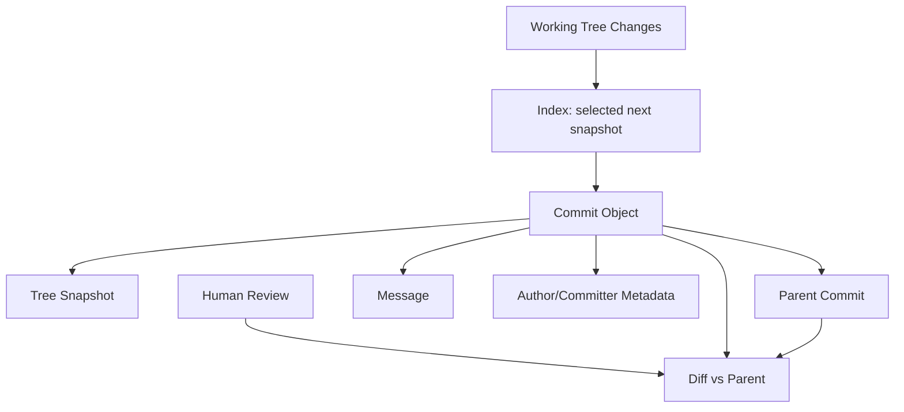
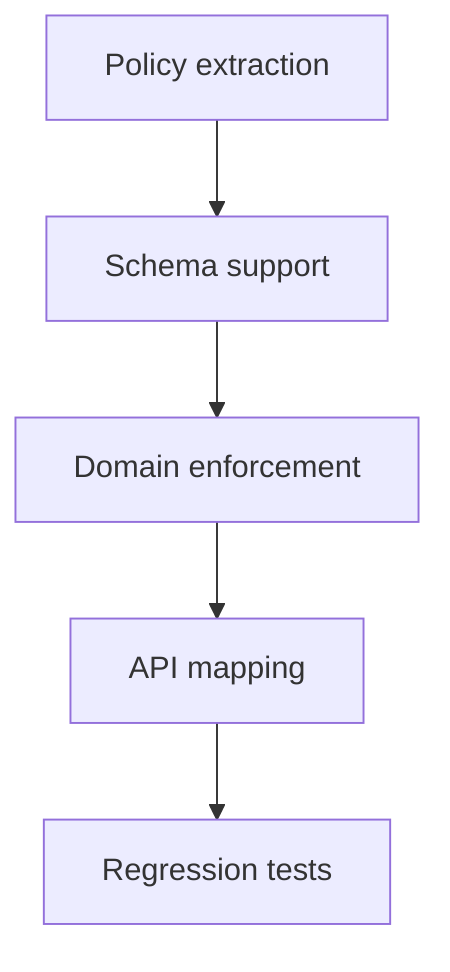
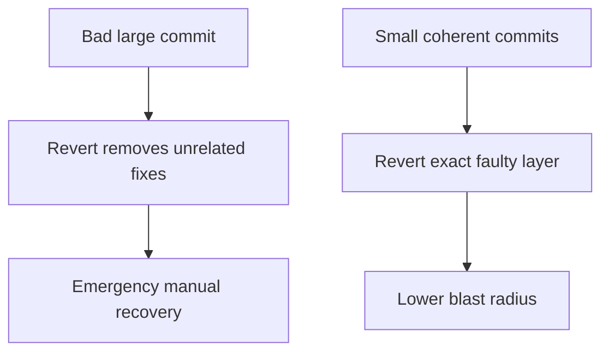
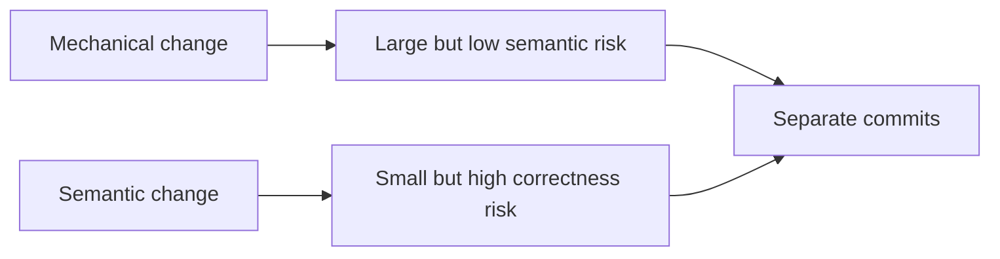
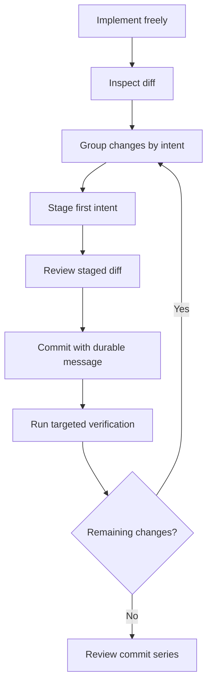
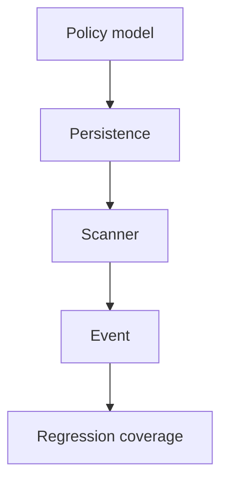

# Part 009 — Commit as a Change Unit

Commit bukan sekadar “save point”. Commit adalah **unit perubahan** yang akan dibaca ulang oleh manusia, tool, CI, release pipeline, auditor, incident responder, dan diri kita sendiri beberapa bulan kemudian.

Kalau commit diperlakukan sebagai dump pekerjaan, Git history menjadi tumpukan noise. Kalau commit diperlakukan sebagai unit desain, Git history menjadi database keputusan engineering.

Mental model part ini:

> Commit yang baik menjawab: apa berubah, mengapa berubah, batas perubahannya apa, bagaimana diverifikasi, dan bagaimana membatalkannya kalau salah.

Secara object model, commit Git menunjuk ke satu tree snapshot, memiliki parent commit, author/committer metadata, dan message. Tetapi secara engineering, commit adalah **kontrak kecil**:

1. perubahan yang terkandung di dalamnya koheren;
2. perubahan itu memiliki alasan;
3. perubahan itu dapat direview;
4. perubahan itu dapat diuji;
5. perubahan itu dapat dipindahkan, di-revert, atau di-backport dengan risiko terkendali.

---

## 1. Dari Snapshot ke Change Unit

Git menyimpan commit sebagai snapshot tree, bukan delta tekstual antar file. Namun developer biasanya menalar commit sebagai “perubahan”. Dua perspektif ini sama-sama benar, tapi dipakai pada level berbeda.



Git menyimpan snapshot. Review tool menampilkan diff. Engineer harus membentuk commit agar **diff terhadap parent** menjadi unit yang masuk akal.

Artinya:

```text
Good commit = coherent snapshot + understandable diff + durable reason
```

Bukan:

```text
Good commit = semua file sudah compile pada saat itu saja
```

Compile penting, tetapi tidak cukup.

---

## 2. Anatomy of a Commit

Secara praktis, commit memiliki komponen berikut:

```text
commit <sha>
tree <tree-sha>
parent <parent-sha>
author <name> <email> <timestamp>
committer <name> <email> <timestamp>

<message subject>

<message body>

<trailers>
```

Lihat dengan:

```bash
git cat-file -p HEAD
```

Contoh:

```text
commit 8f41...
tree 31ab...
parent 6e92...
author Maya <maya@example.com> 1783424010 +0700
committer Maya <maya@example.com> 1783424051 +0700

Validate case transition before assigning enforcement owner

The assignment service previously allowed owner assignment before the
case reached TRIAGED. That made downstream SLA calculation ambiguous
because ownership timestamp could precede the official triage timestamp.

This commit rejects assignment unless the case state is TRIAGED or later.
The API returns 409 instead of silently creating inconsistent lifecycle data.

Refs: CASE-4182
```

Perhatikan beberapa hal:

1. `tree` adalah snapshot hasil akhir.
2. `parent` menentukan basis diff.
3. `author` menunjukkan pembuat perubahan asli.
4. `committer` menunjukkan siapa yang membuat commit object pada history saat ini.
5. message memberi konteks yang tidak bisa disimpulkan dari diff.

### Author vs Committer

Author dan committer sering sama, tetapi bisa berbeda.

Contoh umum:

| Situasi | Author | Committer |
|---|---|---|
| Commit biasa | Developer yang menulis perubahan | Developer yang membuat commit |
| Patch dari mailing list | Pengirim patch | Maintainer yang menerapkan patch |
| Rebase lokal | Author asli | Developer yang melakukan rebase |
| Cherry-pick/backport | Author asli | Developer yang melakukan cherry-pick |

Ini penting untuk audit. Jangan sembarang `--reset-author` kecuali memang ingin menyatakan authorship baru.

---

## 3. Commit sebagai Unit Review

Reviewer tidak membaca “branch”. Reviewer membaca serangkaian diff. Commit yang baik mengurangi cognitive load reviewer.

Buruk:

```text
commit A: update stuff
- refactor controller
- change DB schema
- fix auth bug
- rename package
- update test snapshots
- change logging format
```

Reviewer harus menjawab terlalu banyak pertanyaan sekaligus:

1. Apakah refactor mengubah behavior?
2. Apakah migration aman?
3. Apakah auth bug fix benar?
4. Apakah snapshot berubah karena UI valid atau accidental?
5. Apakah logging change kompatibel dengan parser downstream?

Lebih baik:

```text
commit A: Extract assignment eligibility policy
commit B: Add migration for case_owner_assignment_reason
commit C: Enforce assignment eligibility in command handler
commit D: Return 409 for invalid assignment state
commit E: Add regression tests for pre-triage assignment
```

Sekarang reviewer bisa menalar per lapisan:



Commit series menjadi cerita implementasi.

---

## 4. Commit sebagai Unit Bisect

`git bisect` mencari commit pertama yang memperkenalkan bug. Jika commit terlalu besar atau mencampur unrelated changes, hasil bisect tetap menemukan commit, tetapi commit itu tidak langsung menjelaskan penyebab.

Good bisectable commit memiliki sifat:

1. Buildable: project bisa dibangun pada commit itu.
2. Testable: test relevan bisa jalan.
3. Coherent: perubahan punya satu maksud utama.
4. Localizable: bug yang muncul bisa ditelusuri ke area kecil.

Anti-pattern:

```text
commit X: big refactor and feature work
```

Saat bisect berhenti di commit ini, engineer masih harus melakukan mini-forensics manual.

Better:

```text
commit X1: Rename payment status enum values mechanically
commit X2: Adapt persistence mapping for renamed statuses
commit X3: Enforce terminal-state transition validation
commit X4: Add tests for terminal payment transition rejection
```

Kalau bug muncul di `X3`, domain cause lebih jelas. Kalau bug muncul di `X1`, mungkin mechanical rename tidak sepenuhnya mechanical.

---

## 5. Commit sebagai Unit Revert

Production rollback sering membutuhkan `git revert`. Revert bekerja paling aman ketika commit yang direvert adalah unit perubahan kecil dan koheren.

Misal commit buruk:

```text
commit M: implement case escalation dashboard
- new dashboard UI
- new escalation API
- DB migration
- permission model change
- cache layer change
- unrelated bug fix in notification
```

Jika dashboard bermasalah, revert commit `M` juga membuang unrelated notification fix. Kalau notification fix sudah dibutuhkan production, engineer harus cherry-pick ulang, memecah revert manual, atau membuat emergency patch.

Commit yang lebih baik:

```text
commit A: Add escalation read model table
commit B: Populate escalation read model asynchronously
commit C: Expose escalation dashboard read API
commit D: Add dashboard UI behind feature flag
commit E: Enable dashboard feature flag for pilot tenant
```

Jika UI bermasalah, revert `D` atau disable flag. Jika read model bermasalah, revert `B` dan jalankan compensating cleanup. Blast radius lebih kecil.



---

## 6. Commit sebagai Unit Backport

Maintenance branch sering membutuhkan cherry-pick dari main ke release branch.

Backport-friendly commit memiliki sifat:

1. Perubahan minim dependency pada refactor yang belum ada di release branch.
2. Test relevan ada di commit yang sama atau commit dekat.
3. Message menjelaskan issue dan risk.
4. Tidak mencampur formatting/refactor dengan behavior fix.

Buruk:

```text
commit: refactor invoice module and fix rounding bug
```

Release branch butuh rounding bug fix, tetapi tidak butuh refactor besar. Cherry-pick menjadi conflict magnet.

Lebih baik:

```text
commit A: Add regression test for invoice rounding at half-cent boundary
commit B: Fix invoice rounding using configured monetary scale
commit C: Refactor invoice calculation naming
```

Backport hanya `A` dan `B`. Commit `C` tetap di main.

---

## 7. Commit sebagai Unit Audit

Di organisasi serius, history bisa menjadi evidence. Bukan selalu evidence legal formal, tetapi evidence engineering:

1. kapan perubahan masuk;
2. siapa author dan committer;
3. perubahan apa yang dilakukan;
4. approval PR mana yang terkait;
5. test/CI mana yang lewat;
6. release/tag mana yang membawa perubahan;
7. incident mana yang memicu revert atau hotfix.

Untuk sistem regulatori, payment, identity, access control, atau case lifecycle, commit message yang hanya berisi `fix bug` tidak cukup.

Contoh lebih defensible:

```text
Reject escalation closure while active enforcement task exists

The closure command previously checked only case-level status. This allowed
an enforcement case to be closed while a child enforcement task was still
ACTIVE, creating an inconsistent lifecycle state.

This commit adds a task-level guard inside ClosureEligibilityPolicy and
returns CASE_CLOSURE_BLOCKED_ACTIVE_TASK to the API layer. Existing closed
cases are not modified.

Verification:
- Added unit coverage for ACTIVE and PENDING_REVIEW tasks.
- Added API regression test for closure conflict response.

Refs: CASE-7319
Risk: low; affects closure command only
```

Diff memberi “what”. Message memberi “why”, “boundary”, dan “verification”.

---

## 8. The Commit Boundary Problem

Pertanyaan paling penting saat membuat commit:

> Batas commit ini apa?

Batas commit bisa berdasarkan beberapa axis:

| Boundary Axis | Pertanyaan | Contoh Commit |
|---|---|---|
| Behavior | Perilaku apa yang berubah? | `Reject assignment before triage` |
| Structure | Struktur apa yang diubah tanpa behavior change? | `Extract AssignmentEligibilityPolicy` |
| Data | Kontrak data apa yang berubah? | `Add owner_assignment_reason column` |
| API | Contract eksternal apa yang berubah? | `Return 409 for invalid assignment` |
| Test | Bukti apa yang ditambah? | `Add regression tests for invalid assignment` |
| Config | Default/runtime apa yang berubah? | `Disable auto-escalation for pilot tenant` |
| Migration | State existing apa yang diubah? | `Backfill escalation_due_at for open cases` |

Commit buruk mencampur axis tanpa alasan.

Commit baik kadang tetap menyentuh banyak file, tetapi satu axis atau satu intent.

Contoh commit valid yang menyentuh banyak file:

```text
Rename CaseLifecycleStatus.OPEN to ACTIVE
```

Jika benar-benar mechanical rename, banyak file wajar. Tapi jangan selipkan behavior change di dalamnya.

---

## 9. Mechanical vs Semantic Commits

Pisahkan perubahan mechanical dan semantic.

### Mechanical Commit

Mechanical commit adalah perubahan yang seharusnya tidak mengubah behavior.

Contoh:

1. rename class;
2. move package;
3. format code;
4. update generated snapshot karena field rename;
5. migrate import path;
6. normalize line endings.

Message harus eksplisit:

```text
Mechanically rename EnforcementCaseDto to CaseSummaryDto

No behavior change intended. Generated API schema remains equivalent except
for internal Java type name.
```

### Semantic Commit

Semantic commit mengubah behavior, contract, policy, data, atau runtime.

Contoh:

```text
Reject case assignment when lifecycle state is CREATED
```

Jangan gabungkan:

```text
Rename assignment service and reject invalid assignment state
```

Kenapa? Karena reviewer tidak bisa membedakan apakah diff besar berasal dari rename atau behavior change.



---

## 10. Commit Granularity: Tidak Terlalu Besar, Tidak Terlalu Kecil

Atomic commit bukan berarti satu baris. Atomic berarti satu reason-to-change.

### Terlalu Besar

```text
commit: implement notifications
```

Masalah:

1. sulit review;
2. sulit revert;
3. sulit bisect;
4. sulit backport;
5. sulit menemukan decision trail.

### Terlalu Kecil

```text
commit: add variable
commit: use variable
commit: rename variable
commit: fix typo
commit: add import
```

Masalah:

1. noise tinggi;
2. reviewer membaca micro-steps yang tidak meaningful;
3. bisect bisa berhenti pada commit yang belum buildable;
4. history menjadi log typing, bukan log reasoning.

### Ukuran yang Baik

Commit baik biasanya berada di tengah:

```text
commit: Add NotificationTemplate entity and repository
commit: Render escalation notification from template
commit: Send escalation notification after SLA breach
commit: Add regression tests for SLA notification timing
```

Rule of thumb:

> Commit harus cukup kecil untuk direvert tanpa membatalkan unrelated work, tetapi cukup besar untuk merepresentasikan satu langkah desain yang utuh.

---

## 11. Commit and Test Placement

Ada dua gaya umum:

### Test in Same Commit

```text
commit: Reject invalid assignment state
- production code
- regression test
```

Kelebihan:

1. commit langsung membuktikan behavior;
2. bisect lebih baik;
3. backport membawa test bersama fix.

Kekurangan:

1. diff bisa lebih besar;
2. reviewer membaca code dan test sekaligus.

### Test Before Fix

```text
commit A: Add failing regression test for invalid assignment
commit B: Reject invalid assignment state
```

Kelebihan:

1. menunjukkan bug secara eksplisit;
2. bagus untuk TDD atau bugfix kritikal;
3. bisa dipakai untuk membuktikan fix.

Kekurangan:

1. commit A mungkin intentionally failing jika dijalankan sendiri;
2. bisa mengganggu bisect/buildability policy jika mainline menuntut every commit green.

Dalam branch lokal atau patch series, test-before-fix bagus. Untuk protected mainline, banyak tim memilih squash test+fix agar setiap commit buildable.

Decision:

| Context | Recommended |
|---|---|
| Local exploratory branch | Test-before-fix boleh |
| PR commit series yang direview per commit | Test-before-fix boleh jika reviewer paham |
| Mainline every-commit-green policy | Gabungkan test dan fix |
| Backport ke release branch | Test dan fix sebaiknya berdekatan atau satu commit |

---

## 12. Message as Durable Context

Diff menjawab “apa”. Message harus menjawab “mengapa”.

Subject buruk:

```text
fix
update
changes
case stuff
```

Subject baik:

```text
Reject owner assignment before case triage
Add retry budget to webhook delivery worker
Stop indexing archived enforcement cases
```

Format dasar:

```text
<imperative subject, <= about 50-72 chars>

<context: what was wrong or missing>

<decision: what this commit changes>

<boundary/risk/verification if needed>

<trailers>
```

Contoh:

```text
Stop indexing archived enforcement cases

Archived cases are immutable and no longer appear in active workload views.
The indexer still processed them during nightly reindex, which inflated queue
latency for active cases and made SLA dashboards lag behind.

This commit skips archived cases in CaseIndexSelectionPolicy. It does not
remove already indexed archived documents; cleanup is handled separately.

Verification:
- Added unit coverage for ACTIVE, CLOSED, and ARCHIVED case selection.
- Ran nightly-reindex integration test locally.

Refs: SEARCH-912
```

Kuat karena:

1. subject spesifik;
2. body memberi cause;
3. boundary jelas;
4. cleanup tidak disembunyikan;
5. verification ditulis.

---

## 13. Trailers: Metadata yang Bisa Diparse

Git commit message sering memakai trailer di bagian bawah:

```text
Refs: CASE-4182
Reviewed-by: Ari <ari@example.com>
Signed-off-by: Maya <maya@example.com>
Co-authored-by: Niko <niko@example.com>
```

Trailer berguna untuk automation:

1. menghubungkan commit ke issue/ticket;
2. menyimpan review/provenance metadata;
3. memenuhi Developer Certificate of Origin jika project memakainya;
4. menghasilkan changelog;
5. membuat audit query lebih mudah.

Jangan memakai trailer sebagai dekorasi. Gunakan ketika ada consumer jelas.

Command terkait:

```bash
git interpret-trailers --parse < commit-message.txt
```

Contoh policy:

```text
Required for regulated repositories:
- Refs: <ticket-id>
- Risk: low|medium|high
- Verification: <summary or CI link in PR system>
```

Catatan: `Signed-off-by` bukan tanda tangan kriptografis. Itu trailer tekstual yang maknanya bergantung pada project policy. Signing kriptografis dibahas nanti di bagian security.

---

## 14. Commit Type Taxonomy

Tidak semua commit memiliki bentuk ideal yang sama. Gunakan taxonomy agar review dan automation lebih jelas.

| Type | Tujuan | Ciri Baik | Risiko |
|---|---|---|---|
| Feature | Tambah capability | Scope jelas, test ada, flag jika risky | terlalu besar |
| Bugfix | Perbaiki behavior salah | regression test, cause jelas | fix symptom bukan root cause |
| Refactor | Ubah struktur tanpa behavior change | no behavior change stated, tests unchanged/green | semantic change tersembunyi |
| Migration | Ubah data/schema | backward compatibility, rollout plan | irreversible change |
| Config | Ubah runtime setting | environment jelas, rollback jelas | prod behavior berubah diam-diam |
| Test-only | Tambah/perbaiki test | target behavior jelas | test brittle |
| Docs | Ubah dokumentasi | terkait behavior/decision | docs tidak sinkron |
| Build/CI | Ubah pipeline/tooling | impact jelas, cache aware | release breakage |
| Revert | Membatalkan commit | refer commit asli, reason jelas | revert commit yang salah |

Contoh subject:

```text
Add escalation SLA breach detector
Fix duplicate owner assignment event emission
Refactor case transition checks into policy object
Add case_state_history table
Disable auto-escalation in sandbox tenants
Add regression test for duplicate assignment event
Document release branch freeze protocol
Cache Gradle dependencies in pull request CI
Revert "Enable dashboard for all tenants"
```

---

## 15. Commit Invariants

Gunakan invariants berikut untuk menilai commit.

### Invariant 1 — Single Intent

Satu commit harus memiliki satu intent utama.

Pertanyaan:

```text
Jika saya harus memberi judul commit ini dengan kata kerja spesifik, apakah judulnya natural?
```

Kalau judul menjadi:

```text
Refactor X and fix Y and add Z
```

commit kemungkinan terlalu luas.

### Invariant 2 — Local Explainability

Reviewer harus bisa memahami commit dari diff + message tanpa membaca seluruh branch.

Jika commit bergantung pada commit sebelumnya, dependency itu jelas dari urutan series.

### Invariant 3 — Revertability

Commit harus bisa direvert dengan konsekuensi yang bisa dijelaskan.

Pertanyaan:

```text
Kalau commit ini menyebabkan incident, apa dampak revert-nya?
```

Jika jawabannya “tidak tahu, karena commit ini juga membawa banyak unrelated changes”, commit buruk.

### Invariant 4 — Bisectability

Setiap commit idealnya tidak membuat build/test utama rusak.

Tidak semua project menuntut every commit green, tetapi semakin mission-critical repo, semakin penting invariant ini.

### Invariant 5 — Auditability

Commit penting harus punya reason. Jangan membuat future maintainer membaca pikiranmu dari diff.

---

## 16. Commit Shaping Workflow

Workflow yang disarankan:



Command:

```bash
# 1. Lihat semua perubahan
git status --short
git diff

# 2. Stage secara selektif
git add -p

# 3. Review staged diff sebelum commit
git diff --cached

# 4. Commit
git commit

# 5. Review commit terakhir
git show --stat --patch HEAD

# 6. Review series terhadap base
git log --oneline --decorate origin/main..HEAD
git diff --stat origin/main...HEAD
```

Kebiasaan penting:

> Jangan commit sesuatu yang belum kamu review sebagai staged diff.

`git diff` membaca working tree vs index. `git diff --cached` membaca index vs `HEAD`. Commit mengambil isi index, bukan semua working tree changes.

---

## 17. Designing Commit Series

Branch yang baik bukan kumpulan commit acak, tetapi sequence.

Contoh feature: “case escalation policy”.

Buruk:

```text
A: work in progress
B: fix tests
C: more changes
D: final
```

Baik:

```text
A: Add escalation policy value object
B: Persist escalation deadline on case creation
C: Detect overdue cases in escalation scanner
D: Publish escalation event for overdue cases
E: Add regression tests for escalation boundary times
```

Urutannya menjawab dependency:



Review path jelas:

1. domain concept;
2. data support;
3. runtime behavior;
4. integration event;
5. verification.

---

## 18. Commit Series Archetypes

### Archetype A — Refactor then Behavior

```text
A: Extract CaseClosureEligibilityPolicy
B: Move closure validation into policy object
C: Reject closure when active enforcement task exists
D: Add regression tests for active task closure rejection
```

Kuat karena behavior change kecil setelah struktur siap.

### Archetype B — Test then Fix

```text
A: Add regression test for duplicate webhook delivery
B: Deduplicate webhook delivery by event id
```

Kuat untuk bugfix.

### Archetype C — Schema Expand/Migrate/Contract

```text
A: Add nullable owner_assignment_reason column
B: Write assignment reason for new owner assignments
C: Backfill assignment reason for open cases
D: Require assignment reason at API boundary
E: Remove fallback for missing assignment reason
```

Kuat untuk zero-downtime migration.

### Archetype D — Flagged Rollout

```text
A: Add dashboard read model
B: Add dashboard API behind feature flag
C: Add dashboard UI behind feature flag
D: Enable dashboard for pilot tenant
```

Kuat untuk production risk control.

### Archetype E — Mechanical then Semantic

```text
A: Mechanically rename CaseStatus.OPEN to ACTIVE
B: Reject assignment for CREATED cases
```

Kuat karena reviewer bisa memisahkan rename noise dari behavior change.

---

## 19. Commit and Branch Relationship

Branch adalah workspace untuk series. Commit adalah unit reasoning di dalamnya.

Satu branch bisa punya:

1. satu commit besar jika change kecil;
2. beberapa commit logis jika change kompleks;
3. stacked dependency jika change harus direview bertahap;
4. temporary WIP commits yang akan dirapikan sebelum merge.

Jangan salah kaprah:

```text
Small PR does not automatically mean good commits.
Large PR does not automatically mean bad commits.
```

Yang penting adalah reviewability dan risk boundary.

---

## 20. WIP Commits: Useful Locally, Dangerous Publicly

WIP commit berguna untuk menyimpan progres lokal:

```bash
git commit -m "WIP checkpoint before parser rewrite"
```

Tetapi WIP commit tidak ideal masuk protected branch.

Gunakan WIP commit untuk:

1. checkpoint lokal;
2. eksperimen;
3. pindah mesin;
4. backup sementara.

Sebelum review, rapikan dengan:

```bash
git rebase -i origin/main
```

Atau gunakan fixup/autosquash di part berikutnya.

Policy sehat:

```text
WIP commits allowed in personal branches.
WIP commits not allowed in main/release branches.
PR may contain WIP commits only if marked draft and reviewer is not expected to review final history yet.
```

---

## 21. Commit Size Heuristics

Tidak ada angka sakral. Tetapi indikator berikut membantu.

### Commit Mungkin Terlalu Besar Jika

1. subject perlu lebih dari satu kata kerja;
2. diff menyentuh domain yang tidak berhubungan;
3. reviewer perlu membaca file unrelated untuk memahami perubahan;
4. revert akan membatalkan unrelated fix;
5. test failure bisa berasal dari beberapa behavior berbeda;
6. message body sulit menjelaskan boundary.

### Commit Mungkin Terlalu Kecil Jika

1. commit tidak buildable;
2. subject hanya menggambarkan aktivitas, bukan intent;
3. commit berikutnya selalu “fix previous commit”;
4. reviewer harus menggabungkan lima commit untuk memahami satu ide;
5. commit hanya noise seperti `add import` kecuali memang isolated generated change.

### Target Praktis

Commit ideal:

```text
One concept, one reason, one review question.
```

Contoh review question:

```text
Does this policy correctly reject closure with active task?
Does this migration preserve backward compatibility?
Does this refactor preserve behavior?
Does this API mapping expose the right error code?
```

---

## 22. Failure Modes

### Failure Mode 1 — Mixed Refactor and Behavior Change

Gejala:

```text
Large diff, many moved files, small logic change hidden inside.
```

Risiko:

1. reviewer melewatkan bug;
2. revert berbahaya;
3. blame menjadi misleading.

Mitigasi:

```text
Commit A: pure refactor
Commit B: behavior change
```

### Failure Mode 2 — Commit Message Explains What the Diff Already Shows

Buruk:

```text
Update CaseService.java
```

Diff sudah menunjukkan itu. Message harus menjelaskan why.

Baik:

```text
Reject case closure while enforcement task is active
```

### Failure Mode 3 — Unreviewed Staged Diff

Gejala:

```bash
git add .
git commit -m "fix"
```

Risiko:

1. debug prints ikut masuk;
2. local config ikut masuk;
3. unrelated generated file ikut masuk;
4. secret leak.

Mitigasi:

```bash
git diff --cached
```

### Failure Mode 4 — Backport Hostile Commit

Gejala:

```text
Bugfix bercampur dengan refactor besar.
```

Mitigasi:

```text
Put minimal fix in one commit.
Put cleanup/refactor in later commit.
```

### Failure Mode 5 — Commit Depends on Uncommitted Local State

Gejala:

1. test hanya pass karena untracked file;
2. generated file tidak di-commit;
3. config lokal tidak tercatat.

Mitigasi:

```bash
git status --short --untracked-files=all
git clean -ndx
```

Hati-hati dengan `git clean -fdx`. Gunakan dry-run dulu.

---

## 23. Commit Quality Checklist

Sebelum commit:

```text
[ ] Apakah staged diff sudah saya baca?
[ ] Apakah commit punya satu intent utama?
[ ] Apakah subject menjelaskan behavior/structure yang berubah?
[ ] Apakah message body menjelaskan why jika tidak obvious?
[ ] Apakah unrelated changes tertinggal di working tree, bukan ikut commit?
[ ] Apakah generated files memang seharusnya ikut?
[ ] Apakah test relevan ada dan/atau dijalankan?
[ ] Apakah commit bisa direvert dengan blast radius jelas?
[ ] Apakah commit bisa dibackport jika ini bugfix?
[ ] Apakah metadata ticket/trailer diperlukan?
```

Setelah commit:

```bash
git show --stat --patch HEAD
git status --short
git log --oneline --decorate -5
```

---

## 24. Practical Lab: Membentuk Commit dari Perubahan Campur

Simulasi: kamu mengubah beberapa hal sekaligus:

1. rename `CaseAssignmentService` ke `AssignmentCommandService`;
2. fix bug: assignment sebelum triage harus ditolak;
3. tambah test bugfix;
4. update README;
5. debug log tertinggal.

Jangan langsung:

```bash
git add .
git commit -m "update assignment"
```

Lakukan:

```bash
# 1. Lihat semua perubahan
git status --short
git diff --stat

# 2. Buang debug log manual atau dengan patch mode
git add -p

# 3. Commit pure rename/refactor dulu
git add src/main/java/.../AssignmentCommandService.java
git add -u src/main/java/.../CaseAssignmentService.java
git diff --cached

git commit -m "Rename case assignment service for command handling"

# 4. Commit behavior fix
git add -p src/main/java
git diff --cached

git commit -m "Reject case assignment before triage"

# 5. Commit regression test
git add src/test/java/.../AssignmentCommandServiceTest.java
git diff --cached

git commit -m "Add regression test for pre-triage assignment rejection"

# 6. Commit docs jika relevan
git add README.md
git commit -m "Document assignment lifecycle guard"
```

Review hasil:

```bash
git log --oneline --reverse origin/main..HEAD
git range-diff origin/main...HEAD@{1} origin/main...HEAD 2>/dev/null || true
```

---

## 25. Example: Good Commit Series for a Regulated Case Workflow

Feature: enforcement case cannot transition to `CLOSED` while open remediation actions exist.

```text
A: Add remediation action count to closure eligibility query
B: Reject case closure with open remediation actions
C: Return CASE_CLOSURE_BLOCKED_OPEN_ACTIONS from closure API
D: Add audit event for blocked closure attempt
E: Add regression tests for closure with open actions
```

Why this series works:

| Commit | Review Question | Revert Impact |
|---|---|---|
| A | Does query expose needed data correctly? | Only read path support removed |
| B | Is domain policy correct? | Policy change removed |
| C | Is API contract correct? | Error mapping removed |
| D | Is audit event safe and useful? | Audit signal removed |
| E | Does test cover important boundary? | Test removed only |

This is better than:

```text
Implement closure validation
```

because the former exposes architecture and operational risk.

---

## 26. Commit Policy for Teams

A team can encode simple rules:

```text
1. Main and release branches must not contain WIP commits.
2. Every commit on protected branches should build.
3. Refactor and behavior change should be separate unless inseparable.
4. Bugfix commits should include or reference regression coverage.
5. Security-sensitive commits must reference ticket and verification evidence.
6. Release tags must point to reviewed commits only.
7. Force-push to shared branches requires explicit coordination.
```

Do not over-police personal local history. Police integration history.

Better distinction:

| Location | Strictness |
|---|---|
| Local branch | flexible |
| Draft PR branch | medium |
| Ready-for-review PR branch | high |
| Main branch | very high |
| Release branch | highest |

---

## 27. The Real Skill

Top-tier Git usage is not memorizing more commands. It is shaping history so the organization can reason under pressure.

A good commit helps during:

1. review;
2. release;
3. rollback;
4. incident response;
5. compliance audit;
6. onboarding;
7. debugging;
8. migration;
9. backporting;
10. future refactoring.

The commit is small, but the downstream consequences are large.

---

## 28. Summary

Key takeaways:

1. Git stores snapshots, but engineers review commits as changes.
2. A commit should be a coherent unit of intent.
3. Good commits are reviewable, bisectable, revertable, backportable, and auditable.
4. Separate mechanical and semantic changes.
5. Review staged diff before committing.
6. Message should explain why, not merely repeat what changed.
7. Commit series should tell a clean implementation story.
8. WIP commits are useful locally but should be cleaned before integration.
9. Commit quality is a workflow design issue, not just personal style.
10. The best Git history reduces future uncertainty.

---

## References

- Git documentation: `git-commit` — <https://git-scm.com/docs/git-commit>
- Pro Git: Git Basics, Recording Changes to the Repository — <https://git-scm.com/book/en/v2/Git-Basics-Recording-Changes-to-the-Repository>
- Pro Git: Distributed Git, Contributing to a Project — <https://git-scm.com/book/en/v2/Distributed-Git-Contributing-to-a-Project>
- Git documentation: `git-interpret-trailers` — <https://git-scm.com/docs/git-interpret-trailers>
- Git documentation: `git-revert` — <https://git-scm.com/docs/git-revert>
- Git documentation: `git-cherry-pick` — <https://git-scm.com/docs/git-cherry-pick>
