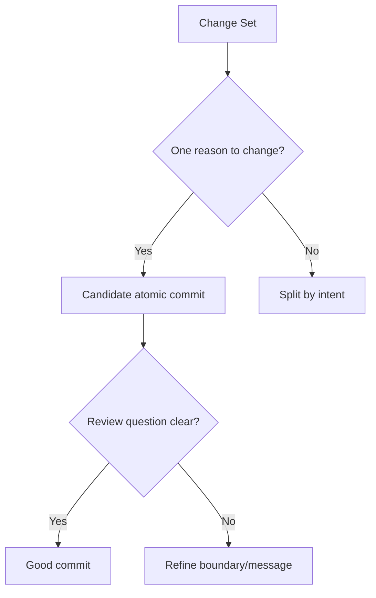
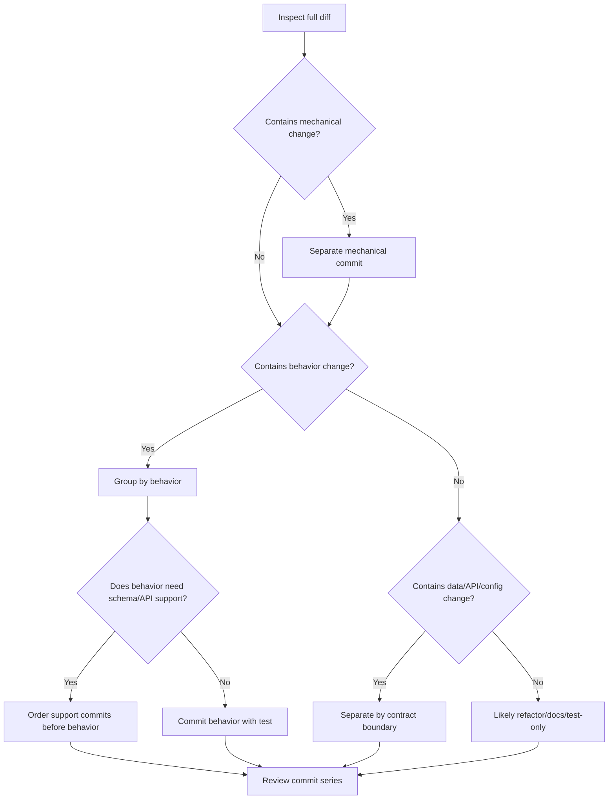
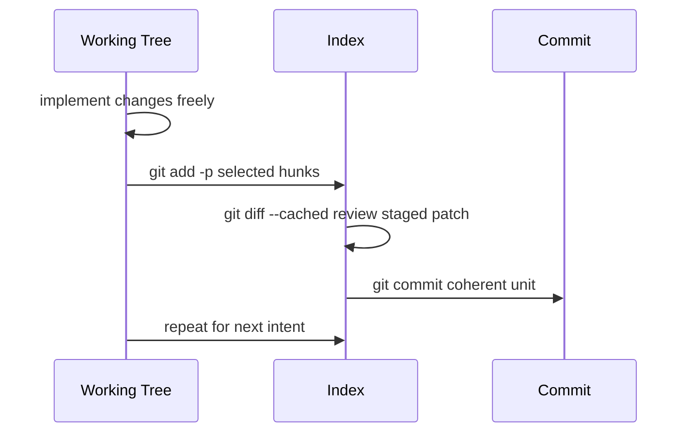
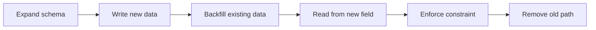

# Part 010 — Atomic Commits and Reviewability

Banyak orang mendefinisikan atomic commit sebagai “commit kecil”. Itu tidak salah, tapi kurang dalam.

Atomic commit yang benar bukan tentang ukuran absolut. Atomic commit adalah commit yang memiliki **satu alasan perubahan**, **satu boundary konseptual**, dan **satu pertanyaan review utama**.

Mental model part ini:

> Atomic commit adalah unit perubahan terkecil yang masih meaningful secara desain, bukan unit perubahan terkecil secara teks.

Satu atomic commit bisa menyentuh 50 file jika itu pure mechanical rename. Satu commit satu baris bisa tidak atomic jika baris itu diam-diam mengubah behavior unrelated.

---

## 1. Atomicity di Git Tidak Sama dengan Atomicity Database

Dalam database, atomicity berarti transaksi berhasil seluruhnya atau gagal seluruhnya. Dalam Git workflow, atomicity commit berarti perubahan punya batas reasoning yang utuh.



Atomic commit menjawab:

```text
Apa satu keputusan engineering yang direpresentasikan oleh commit ini?
```

Bukan:

```text
Berapa jumlah file yang berubah?
```

---

## 2. Reviewability adalah Constraint Utama

Commit yang baik membuat reviewer cepat memahami risiko. Reviewability berarti:

1. diff bisa dibaca tanpa mental stack terlalu besar;
2. purpose commit jelas;
3. noise dipisahkan dari semantic change;
4. dependency antar commit eksplisit;
5. reviewer tahu apa yang harus divalidasi;
6. hidden coupling rendah.

Reviewer membaca dengan pertanyaan:

```text
Apakah perubahan ini benar?
Apakah perubahan ini aman?
Apakah perubahan ini lengkap?
Apakah ada efek samping?
Apakah test membuktikan behavior penting?
```

Atomic commit membantu reviewer menjawab satu cluster pertanyaan per commit.

---

## 3. One Commit, One Review Question

Gunakan prinsip:

```text
One commit -> one primary review question.
```

Contoh buruk:

```text
commit: update assignment flow
```

Review questions:

1. Apakah rename service aman?
2. Apakah state validation benar?
3. Apakah migration backward-compatible?
4. Apakah API error code sesuai contract?
5. Apakah test cukup?

Terlalu banyak.

Contoh baik:

```text
commit A: Extract assignment eligibility policy
```

Review question:

```text
Apakah extraction ini mempertahankan behavior existing?
```

```text
commit B: Reject assignment before case triage
```

Review question:

```text
Apakah policy baru benar untuk lifecycle state sebelum triage?
```

```text
commit C: Map pre-triage assignment rejection to 409 response
```

Review question:

```text
Apakah API contract untuk invalid lifecycle transition benar?
```

---

## 4. Atomic Commit Boundary Types

Atomicity bisa dibangun berdasarkan beberapa boundary.

### 4.1 Behavior Boundary

Commit mengubah satu behavior.

```text
Reject case closure when open remediation actions exist
```

Baik jika:

1. perubahan domain spesifik;
2. test behavior relevan;
3. message menjelaskan why.

### 4.2 Refactor Boundary

Commit mengubah struktur tanpa behavior change.

```text
Extract CaseClosureEligibilityPolicy
```

Baik jika:

1. no behavior change intended;
2. diff tidak menyisipkan logic baru;
3. test existing tetap pass.

### 4.3 Data Boundary

Commit mengubah schema, migration, atau data contract.

```text
Add nullable closure_block_reason column
```

Baik jika:

1. migration backward-compatible;
2. default/null behavior jelas;
3. rollback strategy diketahui.

### 4.4 API Boundary

Commit mengubah external or internal API contract.

```text
Return 409 when closure is blocked by open actions
```

Baik jika:

1. error code/error body jelas;
2. client compatibility dipikirkan;
3. contract test ada.

### 4.5 Test Boundary

Commit menambah bukti behavior.

```text
Add regression test for blocked closure with open actions
```

Baik jika test tidak hanya mengejar coverage, tapi membuktikan risk penting.

### 4.6 Build/Tooling Boundary

Commit mengubah CI, build, lint, codegen, dependency.

```text
Run integration tests against PostgreSQL 17 in CI
```

Baik jika impact developer workflow dan release pipeline jelas.

---

## 5. Atomicity Decision Tree

Gunakan decision tree berikut saat perubahan terasa campur.



Pertanyaan konkret:

```text
1. Apakah ada perubahan mechanical? Pisahkan.
2. Apakah ada behavior change? Pisahkan dari refactor.
3. Apakah ada schema/API/config change? Pisahkan jika punya rollout/risk sendiri.
4. Apakah test bisa ikut fix atau perlu commit sendiri?
5. Apakah setiap commit bisa dijelaskan dengan satu subject imperative?
```

---

## 6. Patch Shaping: Dari Working Tree Campur ke Commit Bersih

Realita kerja: kita sering coding dulu, baru sadar perubahan campur. Itu normal. Skill-nya adalah membentuk patch setelahnya.

Core commands:

```bash
git status --short
git diff
git add -p
git diff --cached
git restore --staged <path>
git commit
```

Workflow:



Important distinction:

```bash
# unstaged changes
git diff

# staged changes that will become next commit
git diff --cached

# full branch change against main
git diff origin/main...HEAD
```

Atomic commit lahir dari staged diff, bukan dari harapan bahwa working tree sudah rapi.

---

## 7. `git add -p`: The Main Tool for Atomic Commits

`git add -p` memungkinkan staging hunk demi hunk.

```bash
git add -p
```

Pilihan umum:

| Input | Meaning |
|---|---|
| `y` | stage this hunk |
| `n` | do not stage this hunk |
| `s` | split hunk into smaller hunks |
| `e` | manually edit hunk |
| `q` | quit |
| `?` | help |

Contoh situasi:

```diff
- if (case.status() == CREATED) {
+ if (!case.status().allowsAssignment()) {
      throw new InvalidAssignmentState();
  }

- log.debug("assignment={}", assignment);
```

Satu file mengandung behavior fix dan debug cleanup. Dengan `git add -p`, stage behavior fix dulu, debug cleanup nanti atau buang.

### Kapan Pakai `s`

Gunakan `s` jika satu hunk masih berisi dua intent.

### Kapan Pakai `e`

Gunakan `e` jika Git tidak bisa split otomatis. Ini powerful tapi berisiko. Setelah edit hunk:

```bash
git diff --cached
```

Pastikan patch masih valid.

---

## 8. `git commit -p` vs `git add -p`

Ada dua pola:

```bash
git add -p
git diff --cached
git commit
```

atau:

```bash
git commit -p
```

Untuk advanced workflow, prefer `git add -p` + `git diff --cached` karena memberi tahap eksplisit untuk review staged diff sebelum commit.

`git commit -p` bisa berguna untuk perubahan kecil, tetapi mengurangi momen inspeksi.

Policy pribadi yang kuat:

```text
Never create a non-trivial commit without reading git diff --cached.
```

---

## 9. Atomic Commit Patterns

### Pattern 1 — Preparatory Refactor, Then Behavior

```text
A: Extract closure eligibility policy
B: Reject closure with open remediation actions
```

Kenapa baik:

1. commit A bisa direview sebagai no-behavior-change;
2. commit B lebih kecil dan fokus pada policy;
3. revert behavior tidak membatalkan extraction jika extraction berguna.

### Pattern 2 — Schema Expand, Code Write, Contract Tighten

```text
A: Add nullable escalation_reason column
B: Write escalation reason for new escalations
C: Backfill escalation reason for open cases
D: Require escalation reason in escalation API
```

Kenapa baik:

1. compatible rollout;
2. setiap step punya migration meaning;
3. rollback lebih jelas.

### Pattern 3 — Mechanical Rename, Then Semantic Change

```text
A: Mechanically rename CaseStatus.OPEN to ACTIVE
B: Treat CREATED cases as ineligible for owner assignment
```

Kenapa baik:

1. rename noise tidak menutupi behavior;
2. reviewer bisa skim A dan fokus B;
3. blame lebih akurat.

### Pattern 4 — Test Harness, Then Behavior Tests

```text
A: Add case lifecycle test fixture builder
B: Add regression tests for invalid assignment transitions
C: Reject invalid assignment transitions
```

Atau jika every-commit-green wajib:

```text
A: Add case lifecycle test fixture builder
B: Reject invalid assignment transitions with regression coverage
```

### Pattern 5 — Feature Flag Boundary

```text
A: Add feature flag for escalation dashboard
B: Render dashboard only when flag is enabled
C: Enable dashboard for pilot tenant
```

Kenapa baik:

1. rollout explicit;
2. disable path jelas;
3. production exposure dipisah dari implementation.

---

## 10. Anti-Patterns

### Anti-Pattern 1 — “Drive-by Cleanup”

```text
commit: fix assignment bug
- fix assignment bug
- rename unrelated variable
- reformat unrelated file
- update old comment
```

Drive-by cleanup terlihat produktif, tetapi mengganggu review dan blame.

Lebih baik:

```text
A: Fix assignment bug
B: Clean up assignment naming
```

Atau lakukan cleanup di branch terpisah.

### Anti-Pattern 2 — “Refactor While Fixing”

Kadang refactor diperlukan untuk fix. Tetapi tetap bisa dipisah:

```text
A: Extract policy object needed by assignment validation
B: Reject invalid assignment states
```

Kalau benar-benar tidak bisa dipisah, message harus jujur:

```text
Reject invalid assignment states through extracted policy

The policy extraction is included because the existing validation path is
shared by API and async command handlers. Separating the extraction would
leave one handler with duplicated validation and increase divergence risk.
```

### Anti-Pattern 3 — “Test Dump”

```text
commit: add tests
```

Kalau tests mencakup banyak behavior unrelated, reviewer tidak tahu risk mana yang dibuktikan.

Lebih baik:

```text
Add regression test for pre-triage assignment rejection
Add regression test for duplicate escalation event emission
```

### Anti-Pattern 4 — “Mega Formatting Commit with Behavior Hidden Inside”

Formatting commit boleh, tetapi harus pure.

Command untuk membantu review:

```bash
git diff --word-diff
git diff --ignore-all-space
git diff --stat
```

Kalau behavior change perlu dilakukan, commit terpisah.

### Anti-Pattern 5 — “Fixup Commits Left in Main”

```text
fix tests
fix lint
oops
review comments
```

Ini normal selama review, tetapi sebelum merge tergantung policy:

1. squash merge: acceptable jika squash message bagus;
2. rebase merge: sebaiknya autosquash/fixup dulu;
3. merge commit policy: pertimbangkan apakah branch history perlu dibersihkan.

---

## 11. Reviewability Metrics

Gunakan metrics kualitatif, bukan angka absolut.

### 11.1 Cognitive Load

Pertanyaan:

```text
Berapa banyak konsep yang harus ditahan reviewer sekaligus?
```

Jika satu commit memaksa reviewer memahami schema, domain policy, UI, caching, dan deployment config sekaligus, commit tidak reviewable.

### 11.2 Diff Noise Ratio

```text
noise ratio = mechanical lines / semantic lines
```

Jika noise tinggi, pisahkan mechanical commit.

### 11.3 Revert Blast Radius

```text
Apa yang hilang jika commit ini direvert?
```

Jika jawabannya terlalu banyak, split.

### 11.4 Dependency Clarity

```text
Apakah commit N dapat dipahami setelah commit N-1?
```

Jika commit order acak, rebase interaktif untuk reorder.

### 11.5 Verification Locality

```text
Apakah test untuk perubahan ini dekat dengan commit-nya?
```

Jika test untuk commit A baru muncul di commit F, bisect dan review melemah.

---

## 12. Commit Stack Design for PR Review

Untuk PR kompleks, desain commit stack seperti document outline.

Contoh: implement retry budget untuk webhook delivery.

```text
A: Add retry budget value object
B: Persist retry budget state for webhook deliveries
C: Consume retry budget before scheduling retry
D: Stop retrying exhausted webhook deliveries
E: Add metrics for exhausted webhook retry budget
F: Add regression tests for retry budget exhaustion
```

Review order:

1. domain primitive;
2. data persistence;
3. scheduling behavior;
4. terminal behavior;
5. observability;
6. verification.

Ini lebih mudah daripada satu commit:

```text
implement retry budget
```

atau commit acak:

```text
add db stuff
fix retry
metrics
more tests
cleanup
```

---

## 13. How to Split an Existing Large Commit

Misal kamu sudah membuat commit besar `HEAD` dan ingin split.

```bash
# 1. Kembalikan commit ke working tree, tapi jangan hilangkan perubahan
git reset HEAD~1

# 2. Stage intent pertama
git add -p
git diff --cached
git commit -m "Extract assignment eligibility policy"

# 3. Stage intent berikutnya
git add -p
git diff --cached
git commit -m "Reject assignment before case triage"

# 4. Ulangi sampai bersih
git status --short
```

Jika commit yang ingin displit bukan HEAD:

```bash
git rebase -i origin/main
# ubah pick menjadi edit pada commit yang ingin displit

# saat rebase berhenti:
git reset HEAD~1
# split dengan git add -p dan git commit

git rebase --continue
```

Pastikan branch belum menjadi shared public history atau koordinasikan jika harus force-push.

---

## 14. How to Combine Commits That Are Too Small

Jika commit terlalu kecil atau banyak `fix tests`, gunakan interactive rebase.

```bash
git rebase -i origin/main
```

Todo:

```text
pick 1111111 Add assignment policy
fixup 2222222 fix typo
fixup 3333333 fix test
pick 4444444 Reject assignment before triage
fixup 5555555 review comment
```

Atau buat fixup commit sejak awal:

```bash
git commit --fixup=<target-commit>
git rebase -i --autosquash origin/main
```

Detail fixup/autosquash akan dibahas khusus di part berikutnya, tetapi konsepnya: gunakan commit sementara untuk review iteration, lalu fold ke commit yang tepat sebelum integration jika policy mengharuskan clean history.

---

## 15. Commit Ordering

Atomic commit juga harus diurutkan benar.

Urutan buruk:

```text
A: Reject invalid state
B: Add enum value used by A
C: Add test fixture used by A
```

Commit A mungkin tidak buildable. Better:

```text
A: Add assignment eligibility enum value
B: Add assignment lifecycle test fixture
C: Reject invalid assignment state
```

Rule:

```text
Support before use.
Proof near behavior.
Exposure after implementation.
Cleanup after behavior or before behavior, but not mixed.
```

### Common Ordering Templates

#### Backend Feature

```text
1. domain model/support
2. persistence/schema
3. service behavior
4. API contract
5. tests
6. observability/docs
```

#### UI Feature

```text
1. API/client type support
2. state/model support
3. component rendering
4. interaction behavior
5. tests/storybook/docs
6. enablement flag/config
```

#### Migration

```text
1. expand schema
2. dual write or backward-compatible read
3. backfill
4. switch read path
5. enforce non-null/strict contract
6. cleanup old path
```

---

## 16. Atomicity vs Squash Merge

Ada tim yang memakai squash merge sehingga commit individual di branch tidak masuk main. Apakah atomic commits masih penting?

Ya, karena atomic commits membantu review sebelum squash.

Tetapi integration artifact berbeda:

| Merge Policy | Value of Atomic Branch Commits | Main History Outcome |
|---|---|---|
| Squash merge | Review structure, local reasoning | one commit per PR |
| Rebase merge | Review + preserved history | atomic commits on main |
| Merge commit | Branch history preserved under merge | atomic commits inside merge bubble |
| Fast-forward only | preserved linear series | atomic commits directly on main |

Jika squash merge dipakai, pastikan squash commit message tetap durable. Jangan biarkan main history berisi:

```text
Merge pull request #482
```

atau:

```text
update stuff
```

Squash commit harus merangkum final behavior, risk, and verification.

---

## 17. Atomicity vs Every Commit Green

Ideal engineering policy:

```text
Every commit on main builds and passes relevant tests.
```

Untuk PR branch, ada variasi:

| Policy | Pros | Cons |
|---|---|---|
| Every commit green in PR | bisect/rebase safest | slower shaping, harder during exploration |
| Final branch green only | flexible iteration | individual commits may be less bisectable |
| Main green only after squash | simple mainline | branch commit quality may decay |

Recommendation:

1. protected main/release: every commit should be green;
2. ready-for-review branch: strive for every commit green;
3. draft branch: allow temporary broken commits;
4. before rebase merge: clean broken commits;
5. before squash merge: ensure final squash commit is coherent and verified.

---

## 18. Atomicity and Generated Files

Generated files create commit boundary problems.

Example:

```text
- update OpenAPI spec
- regenerate Java client
- change API behavior
```

Options:

### Option A — Spec and Generated Client Together

```text
commit: Add assignment rejection response to OpenAPI contract
```

Includes:

1. spec change;
2. generated client/server model;
3. no behavior implementation.

Good if generated code is direct artifact of contract.

### Option B — Behavior Separate

```text
A: Add assignment rejection response to OpenAPI contract
B: Return assignment rejection response from API handler
```

Usually better.

Rule:

```text
Generated files may be in same commit as the source that deterministically generates them, but behavior implementation should usually be separate.
```

---

## 19. Atomicity and Large Renames

Git does not store rename as a first-class object relation in commits. Rename detection is inferred by diff algorithms. Because of that, large rename + edit can be hard to review.

Better:

```text
A: Rename CaseAssignmentService to AssignmentCommandService
B: Move assignment validation into AssignmentCommandService
C: Reject assignment before triage
```

If you rename and edit in one commit, reviewer sees delete/add or noisy diff depending tool settings.

Command tips:

```bash
git diff --find-renames
git log --follow -- path/to/file
```

But tool support does not replace clean commit boundaries.

---

## 20. Atomicity and Config Changes

Config changes often look small but have large blast radius.

Example one-line diff:

```diff
-autoEscalation.enabled=false
+autoEscalation.enabled=true
```

This one line can change production behavior more than 500 lines of refactor.

Treat config changes as semantic commits:

```text
Enable auto-escalation for pilot tenant only

Auto-escalation remains disabled globally. This enables the feature for the
pilot tenant after dashboard verification passed in staging.

Rollback: set pilot.autoEscalation.enabled=false.
Refs: ESC-1204
```

Atomicity is about risk, not line count.

---

## 21. Atomicity and Database Migrations

Never hide migration risk inside application changes.

Bad:

```text
commit: implement assignment reason
```

Contains:

1. migration;
2. entity change;
3. API validation;
4. backfill;
5. UI required field.

Better:

```text
A: Add nullable assignment_reason column
B: Persist assignment reason for new assignments
C: Backfill assignment reason for open cases
D: Require assignment reason in assignment API
E: Show assignment reason in case timeline
```

Each commit maps to rollout step.

For zero-downtime systems:



Commit boundary should match deployment boundary when possible.

---

## 22. Atomicity and Security-Sensitive Changes

Security changes need high review signal.

Bad:

```text
commit: refactor auth
```

Contains:

1. rename permission classes;
2. change role inheritance;
3. update tests;
4. remove fallback authorization path.

Better:

```text
A: Rename authorization package to accesscontrol
B: Add explicit DENY result for missing case permission
C: Remove fallback allow path for legacy reviewers
D: Add regression tests for denied reviewer access
```

Security-sensitive commit message should include:

1. affected boundary;
2. old behavior;
3. new behavior;
4. verification;
5. rollout/compatibility risk.

---

## 23. Atomic Commit Review Protocol

As author, before asking review:

```bash
git fetch origin
git log --oneline --reverse origin/main..HEAD
git diff --stat origin/main...HEAD
```

Then inspect every commit:

```bash
git show --stat --patch <commit>
```

Checklist:

```text
[ ] Does each commit have one primary intent?
[ ] Does each subject describe the intent?
[ ] Are mechanical and semantic changes separated?
[ ] Are generated files paired with their source change?
[ ] Are migration commits ordered safely?
[ ] Does every commit compile or intentionally not, based on team policy?
[ ] Is test evidence close to behavior?
[ ] Are fixup/WIP commits cleaned or intentionally retained?
[ ] Is the PR diff understandable both per commit and as a whole?
```

As reviewer:

```text
1. Read commit list first.
2. Check if commit sequence tells a coherent story.
3. Review mechanical commits differently from semantic commits.
4. Review risky semantic commits deeply.
5. Ask author to split when unrelated concerns hide each other.
```

---

## 24. Practical Lab: Split a Mixed Working Tree into Atomic Commits

Scenario:

You have changed:

1. `CaseStatus.OPEN` renamed to `ACTIVE`;
2. assignment validation rejects `CREATED`;
3. API maps invalid assignment to `409`;
4. tests added;
5. README updated;
6. formatting changed in unrelated file.

### Step 1 — Inspect

```bash
git status --short
git diff --stat
git diff
```

### Step 2 — Commit Mechanical Rename

```bash
git add -p src/main/java src/test/java
# stage only rename-related hunks

git diff --cached

git commit -m "Mechanically rename open case status to active"
```

Message body:

```text
No behavior change intended. This commit only renames the enum value and
updates references/tests that depend on the enum name.
```

### Step 3 — Commit Domain Behavior

```bash
git add -p src/main/java

git diff --cached

git commit -m "Reject assignment while case is still created"
```

### Step 4 — Commit API Mapping

```bash
git add -p src/main/java

git diff --cached

git commit -m "Map created-case assignment rejection to conflict response"
```

### Step 5 — Commit Tests

```bash
git add src/test/java/...
git diff --cached

git commit -m "Add regression tests for created-case assignment rejection"
```

### Step 6 — Decide Docs and Formatting

README relevant?

```bash
git add README.md
git commit -m "Document created-case assignment restriction"
```

Unrelated formatting?

```bash
git restore path/to/unrelated-file
```

or separate commit if intentionally desired:

```bash
git commit -m "Format case assignment helper"
```

### Step 7 — Review Series

```bash
git log --oneline --reverse origin/main..HEAD
git diff --stat origin/main...HEAD
```

Expected series:

```text
Mechanically rename open case status to active
Reject assignment while case is still created
Map created-case assignment rejection to conflict response
Add regression tests for created-case assignment rejection
Document created-case assignment restriction
```

This is reviewable.

---

## 25. Practical Lab: Turn WIP Commits into Reviewable Commits

Initial branch:

```text
1111111 WIP
2222222 fix tests
3333333 more assignment changes
4444444 cleanup
5555555 final fix
```

Goal:

```text
AAAAAAA Extract assignment eligibility policy
BBBBBBB Reject assignment before case triage
CCCCCCC Map invalid assignment to conflict response
DDDDDDD Add regression tests for assignment eligibility
```

Approach:

```bash
git reset origin/main
# all branch changes return to working tree

git add -p
git commit -m "Extract assignment eligibility policy"

git add -p
git commit -m "Reject assignment before case triage"

git add -p
git commit -m "Map invalid assignment to conflict response"

git add -p
git commit -m "Add regression tests for assignment eligibility"
```

This is often simpler than trying to rescue messy WIP history with complex rebase operations.

Caution:

```text
Only do this safely on your own branch or before pushing, or coordinate if branch is shared.
```

---

## 26. Policy Examples

### Lightweight Team Policy

```text
- PRs should be reviewable commit-by-commit when practical.
- Avoid mixing refactor and behavior change.
- Use git add -p for mixed working tree changes.
- Remove WIP/fixup commits before merge unless using squash merge.
```

### Strict Platform/Regulated Policy

```text
- Every commit on main and release branches must build.
- Security, authorization, migration, and release commits require ticket reference.
- Behavior changes must include regression evidence.
- Mechanical changes must state "No behavior change intended".
- Database migration commits must follow expand/migrate/contract ordering.
- Protected branches reject non-fast-forward updates except through approved process.
```

### Monorepo Policy

```text
- Large mechanical changes require isolated commits.
- Cross-team API contract changes require owner approval.
- Generated files must be committed with their source generator inputs.
- Sparse area owners must be identifiable from commit path impact.
```

---

## 27. When Not to Split Further

Splitting has diminishing returns.

Do not split when:

1. commit would become non-buildable without the next commit;
2. split creates artificial micro-steps with no independent meaning;
3. reviewer must mentally recombine commits to understand one concept;
4. split hides the actual risk across too many places;
5. change is one coherent behavior with necessary small test and docs updates.

Example okay as one commit:

```text
Reject assignment before case triage

Includes domain guard, API error mapping, and focused regression coverage.
The API mapping is included because the guard is only observable through the
assignment endpoint and no separate contract change is introduced.
```

Atomicity is not dogma. It is a tool for reducing reasoning cost.

---

## 28. The Author-Reviewer Contract

Author responsibility:

```text
Shape history so reviewer can spend energy on correctness, not archaeology.
```

Reviewer responsibility:

```text
Ask for split when unrelated risks obscure each other, but do not demand tiny commits for aesthetic reasons.
```

Healthy review comment:

```text
Can you split the enum rename from the assignment validation change? The rename
makes it hard to see whether the CREATED-state behavior changed correctly.
```

Unhelpful review comment:

```text
Too many lines. Split this.
```

Good split request names the hidden reasoning problem.

---

## 29. Summary

Key takeaways:

1. Atomic commit means one reason to change, not necessarily few lines.
2. Reviewability is the main practical constraint.
3. One commit should have one primary review question.
4. Separate mechanical, semantic, data, API, config, and test boundaries when risk differs.
5. `git add -p` plus `git diff --cached` is the core patch-shaping loop.
6. Commit order should follow dependency and rollout order.
7. Squash merge does not remove the value of atomic branch commits.
8. Database migrations and config changes deserve explicit commit boundaries.
9. Security-sensitive changes need especially clean history.
10. Splitting is useful only when it reduces reasoning cost.

---

## References

- Git documentation: `git-commit` — <https://git-scm.com/docs/git-commit>
- Git documentation: `git-add` interactive and patch mode — <https://git-scm.com/docs/git-add>
- Pro Git: Interactive Staging — <https://git-scm.com/book/en/v2/Git-Tools-Interactive-Staging>
- Pro Git: Rewriting History — <https://git-scm.com/book/en/v2/Git-Tools-Rewriting-History>
- Git documentation: `git-rebase` autosquash — <https://git-scm.com/docs/git-rebase>
- Git documentation: `git-diff` — <https://git-scm.com/docs/git-diff>
