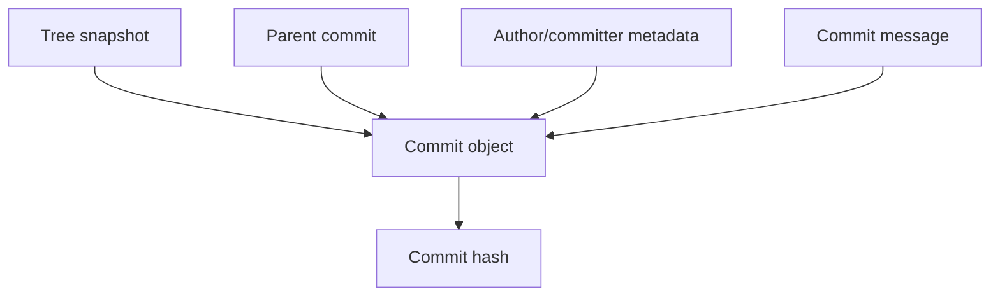
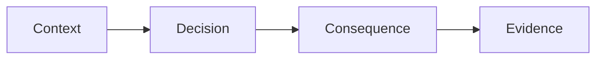
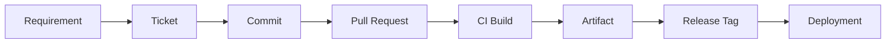
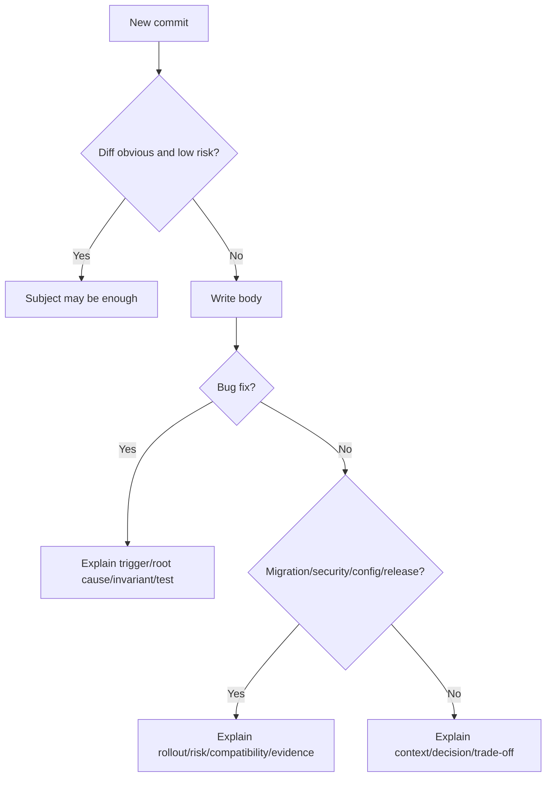

# Part 011 — Commit Message Design for Future Debugging

Commit message sering dianggap hal kecil: tulis satu kalimat, selesai. Itu cara pikir yang mahal.

Commit message adalah **interface antara perubahan hari ini dan proses debugging di masa depan**. Ketika bug production muncul enam bulan kemudian, engineer tidak hanya bertanya “baris mana yang berubah?”, tetapi:

```text
Mengapa ini diubah?
Alternatif apa yang ditolak?
Risiko apa yang diketahui saat itu?
Apakah perubahan ini bug fix, refactor, workaround, mitigation, atau policy change?
Apakah aman di-revert?
Apakah perlu di-backport?
Apakah terkait incident, ticket, regulasi, migration, atau dependency tertentu?
```

Diff menjawab **what changed**. Commit message yang baik menjawab **why this change exists**.

Mental model part ini:

> Commit message adalah kontrak interpretasi untuk future reader. Ia harus mengurangi entropy saat orang membaca history.

---

## 1. Commit Message adalah API untuk History

Commit object menyimpan metadata seperti author, committer, parent, tree, dan message. Secara operasional, message adalah bagian dari object identity: mengubah message akan menghasilkan commit object baru.



Implikasinya:

1. commit message bukan komentar eksternal;
2. message ikut menjadi bagian dari history;
3. memperbaiki message setelah published berarti rewrite history;
4. message yang buruk akan terbawa ke blame, bisect, release notes, audit, dan incident review.

Commit message adalah API karena banyak consumer membacanya:

| Consumer | Membutuhkan Apa dari Message |
|---|---|
| Reviewer | Scope, intent, risiko, dan alasan desain. |
| Future maintainer | Kenapa perubahan dibuat dan kapan boleh diubah lagi. |
| Incident responder | Apakah commit ini kandidat penyebab regression. |
| Release engineer | Apakah commit perlu masuk release notes/backport. |
| Security engineer | Apakah ada threat model, secret, policy, atau permission impact. |
| Auditor/regulator | Apakah change punya approval/ticket/evidence yang traceable. |
| Automation | Trailer, ticket ID, breaking-change marker, signoff, changelog metadata. |

Message yang baik bukan panjang karena ingin kelihatan serius. Message yang baik mengandung informasi yang tidak bisa disimpulkan secara aman dari diff.

---

## 2. Struktur Dasar yang Kuat

Format umum yang bekerja di banyak organisasi:

```text
<subject line, imperative, <= ~50-72 chars jika memungkinkan>

<context: why this change is needed>

<decision: what approach was taken and why>

<risk/compatibility/migration/test notes if relevant>

<trailers>
```

Contoh:

```text
Reject stale enforcement transitions

The enforcement lifecycle currently accepts transition requests using
only the case id and target state. In concurrent review flows, an old UI
session can submit a transition after the case has already moved forward.

Add expected_state to the transition command and reject the request when
the persisted state no longer matches. This keeps the transition model
optimistic but explicit, instead of relying on last-write-wins behavior.

This is backward compatible for API clients that use the command factory;
manual API callers must pass expected_state.

Refs: ENF-1842
Risk: medium - changes transition validation semantics
Test: added stale transition regression test
```

Perhatikan: subject tidak mencoba menjelaskan semua. Body menyimpan reasoning.

---

## 3. Subject Line: Bukan Judul Artikel, Tapi Intent Singkat

Subject line yang baik menjawab:

```text
Apa perubahan utama yang akan terlihat jika commit ini diterapkan?
```

Gunakan bentuk imperative karena commit dibaca sebagai instruksi ke codebase:

```text
Add retry budget to outbound notification sender
Reject stale enforcement transitions
Normalize applicant identifiers before matching
Remove unused legacy audit serializer
```

Bukan:

```text
Added retry budget
Fix stuff
WIP
Changes
Refactoring
Bug fix
```

### 3.1 Kenapa imperative lebih kuat?

Ketika Git membuat merge commit default, gaya bahasanya seperti “Merge branch ...”. Banyak project memakai subject sebagai kalimat yang melengkapi frasa:

```text
If applied, this commit will <subject>
```

Contoh:

```text
If applied, this commit will reject stale enforcement transitions.
```

Ini lebih actionable daripada:

```text
If applied, this commit will fixed stale transition bug.
```

---

## 4. Subject Harus Mengandung Behavior, Bukan Aktivitas

Commit buruk sering mendeskripsikan aktivitas developer:

```text
Work on validation
Update files
Refactor service
Clean up code
```

Commit baik mendeskripsikan perubahan terhadap sistem:

```text
Validate expected state before enforcement transition
Move transition authorization before mutation
Extract violation scoring policy from case service
Delete unused XML import fallback
```

Aktivitas developer tidak membantu debugging. Behavior sistem membantu.

---

## 5. Body: Tempat Menyimpan Reasoning yang Tidak Ada di Diff

Diff bisa menunjukkan:

```java
if (!command.expectedState().equals(case.state())) {
    throw new StaleTransitionException(...);
}
```

Diff tidak menunjukkan:

1. apakah ini memperbaiki bug production;
2. apakah ini security hardening;
3. apakah ini workaround sementara;
4. apakah ini keputusan desain permanen;
5. apakah ada compatibility impact;
6. kenapa optimistic validation dipilih daripada lock pessimistic;
7. test mana yang membuktikan behavior penting.

Body harus menjawab pertanyaan yang tidak bisa dilihat dari kode.

---

## 6. Formula Body yang Efektif

Gunakan empat blok mental:

```text
Context
Decision
Consequence
Evidence
```



### 6.1 Context

Jelaskan kondisi yang membuat perubahan perlu.

Buruk:

```text
Need to fix validation.
```

Baik:

```text
Concurrent reviewers can submit state transitions from stale UI sessions.
The current endpoint validates authorization but does not validate that the
case is still in the state the reviewer saw when making the decision.
```

### 6.2 Decision

Jelaskan apa pendekatan yang dipilih.

```text
Require transition commands to include expected_state and compare it with
the persisted case state before applying the transition.
```

### 6.3 Consequence

Jelaskan dampak, trade-off, compatibility, migration, atau risiko.

```text
This keeps the write path lock-free but makes stale commands explicit.
Clients that construct commands manually must now provide expected_state.
```

### 6.4 Evidence

Jelaskan validasi yang dilakukan.

```text
Added a regression test where reviewer B approves after reviewer A already
escalated the case to investigation.
```

---

## 7. Commit Message sebagai Debugging Accelerator

Bayangkan regression terjadi:

```text
Cases are now rejected when reviewers transition from triage to investigation.
```

Engineer menjalankan:

```bash
git log --oneline --decorate --graph -- cases/enforcement-transition-service.java
git blame cases/enforcement-transition-service.java
git show <suspect-commit>
```

Jika message hanya:

```text
Fix transition bug
```

future reader harus reverse-engineer intent dari diff. Jika message menjelaskan stale session concurrency, dia bisa langsung membedakan:

1. bug sekarang akibat validasi terlalu ketat;
2. behavior ini sengaja ditambahkan;
3. revert mungkin membuka kembali race condition;
4. fix-forward mungkin perlu memperbaiki UI command construction.

Message yang baik memperkecil ruang pencarian.

---

## 8. Commit Message untuk Bisect

`git bisect` menemukan commit pertama yang membuat test gagal. Setelah itu, engineer membaca commit tersebut.

Bisect menemukan **where**. Message membantu menjawab **why**.

Commit message untuk bisect harus membuat commit bisa diklasifikasikan cepat:

| Kategori | Signal di Message |
|---|---|
| Behavior change | “Reject ...”, “Allow ...”, “Require ...” |
| Refactor | “Move ... without behavior change” |
| Test only | “Add regression test for ...” |
| Config | “Raise ... timeout”, “Enable ... flag” |
| Migration | “Backfill ...”, “Add nullable column ...” |
| Risky | “Change authorization order ...” |
| Temporary | “Temporarily bypass ... until ...” |

Jika commit message ambigu, bisect tidak selesai di commit; bisect berpindah menjadi investigasi manual.

---

## 9. Commit Message untuk Revert

Revert aman jika commit adalah unit perubahan yang jelas dan message-nya menjelaskan efek samping.

Subject yang membantu revert:

```text
Enable notification deduplication by idempotency key
```

Body yang membantu:

```text
This changes duplicate detection from recipient+template to idempotency_key.
Existing scheduled notifications do not have idempotency_key and continue to
use the old path until drained.
```

Jika production incident terjadi, release engineer bisa menilai:

```text
Kalau commit ini di-revert, scheduled notification lama ikut terdampak atau tidak?
```

Commit message yang buruk memaksa orang menebak saat tekanan tinggi.

---

## 10. Commit Message untuk Backport

Backport membutuhkan pemahaman dependency:

```text
Can this commit be cherry-picked to release/2.8?
Does it depend on schema changes?
Does it assume new API shape?
Does it require config rollout?
```

Tambahkan signal jika relevan:

```text
Backport: safe to 2.8 after audit_event.reason column exists
Backport: no, depends on transition command v3
```

Atau body:

```text
This fix is isolated to the legacy importer and can be cherry-picked to
release/2.8. The new regression test uses only APIs available in that branch.
```

---

## 11. Trailers: Metadata yang Bisa Dibaca Manusia dan Mesin

Git mendukung pola trailer di akhir commit message. `git interpret-trailers` dapat menambah atau mem-parse baris trailer yang mirip header RFC 822.

Contoh:

```text
Refs: ENF-1842
Reviewed-by: Mira Tan <mira@example.com>
Signed-off-by: Raka Putra <raka@example.com>
Risk: medium
Test: ./gradlew test --tests EnforcementTransitionTest
```

Trailer berguna ketika metadata perlu konsisten dan bisa diproses tooling.

### 11.1 Trailer Umum

| Trailer | Makna |
|---|---|
| `Refs:` | Ticket, issue, incident, ADR, atau requirement. |
| `Fixes:` | Bug/issue yang diperbaiki. Bisa memicu automation di platform tertentu. |
| `Signed-off-by:` | Developer signoff sesuai policy project, misalnya DCO. |
| `Reviewed-by:` | Reviewer manusia yang menyetujui patch. |
| `Co-authored-by:` | Kontributor tambahan. Banyak platform membaca ini. |
| `Risk:` | Low/medium/high, atau domain-specific risk. |
| `Test:` | Bukti test manual/otomatis yang dijalankan. |
| `Migration:` | Catatan migration/backfill/schema. |
| `Security:` | Catatan security impact. |
| `Backport:` | Instruksi backport atau larangan backport. |

### 11.2 Jangan Jadikan Trailer sebagai Tempat Sampah

Trailer harus singkat. Reasoning tetap di body.

Buruk:

```text
Risk: this might break some things because the whole transition system is messy and we are not sure about all external clients
```

Baik:

```text
Risk: medium - rejects stale manual API callers
```

---

## 12. `Signed-off-by` Bukan “Saya Setuju Kode Ini Bagus”

`Signed-off-by` memiliki makna sesuai project policy. Di banyak project open source, signoff berhubungan dengan Developer Certificate of Origin atau representasi bahwa kontributor punya hak mengirim perubahan.

Jangan memakai `Signed-off-by` sebagai sinonim “approved”. Untuk approval review, gunakan mekanisme review platform atau trailer seperti `Reviewed-by` jika policy project mendukung.

---

## 13. Conventional Commits: Berguna, Tapi Bukan Pengganti Reasoning

Format seperti:

```text
feat(auth): reject stale transition commands
fix(import): preserve original violation timestamp
refactor(case): extract scoring policy
```

berguna untuk changelog, semantic release, dan scanning cepat. Namun format ini tidak menggantikan body.

Commit berikut masih buruk:

```text
fix(case): fix bug
```

Commit berikut jauh lebih baik:

```text
fix(case): reject stale transition commands

Concurrent reviewers can submit a transition from an outdated UI session.
Require expected_state and reject commands when the persisted state already
moved forward.

Risk: medium - manual API callers must send expected_state
Refs: ENF-1842
```

Gunakan Conventional Commits sebagai **metadata ringkas**, bukan sebagai alasan untuk menghapus konteks.

---

## 14. Message untuk Refactor Harus Melindungi Reviewer

Refactor adalah sumber noise tinggi. Message harus eksplisit apakah behavior berubah.

Baik:

```text
Extract violation scoring policy without behavior change

Move the scoring rules from CaseEvaluationService into
ViolationScoringPolicy so transition validation can call the same rules in a
later commit. This commit only moves code and preserves existing tests.

Test: ./gradlew test --tests CaseEvaluationServiceTest
```

Kenapa ini penting?

Reviewer tahu bahwa pertanyaan review adalah:

```text
Apakah move ini behavior-preserving?
```

Bukan:

```text
Apakah scoring policy baru benar secara domain?
```

Jika behavior ikut berubah, jangan sembunyikan di commit refactor.

---

## 15. Message untuk Bug Fix Harus Menjelaskan Bug Model

Bug fix message perlu menjawab:

1. kondisi apa yang memicu bug;
2. behavior salah apa yang terjadi;
3. invariant apa yang dilanggar;
4. kenapa fix ini benar;
5. test apa yang menangkap bug.

Template:

```text
Fix <observable wrong behavior>

<Trigger condition> currently causes <wrong behavior> because <root cause>.
This violates <invariant/expectation>.

Change <implementation decision> so <correct behavior>.

Test: <regression test>
```

Contoh:

```text
Preserve original violation timestamp during import retry

Retrying a failed XML import currently overwrites violation_detected_at with
the retry time because the importer reuses the audit event timestamp as the
source timestamp. This violates the case chronology invariant used by SLA
calculation.

Read violation_detected_at from the original payload and only use the audit
event timestamp for import observability.

Test: added retry import regression covering SLA ordering
Refs: ENF-1960
```

---

## 16. Message untuk Security-Sensitive Change

Security-sensitive commit harus lebih tegas karena future reader perlu memahami threat model.

Minimal jawab:

1. asset apa yang dilindungi;
2. attacker/abuse path apa yang ditutup;
3. boundary authorization/authentication apa yang berubah;
4. apakah behavior backward-compatible;
5. apakah ada migration/token rotation/config rollout.

Contoh:

```text
Authorize case attachment download by case membership

Attachment download currently checks that the user is authenticated but does
not verify membership in the owning case. A user who obtains an attachment id
can download a file outside their assigned workload.

Require case membership before resolving the attachment storage key. The
storage object remains private; this commit closes the application-level
access path.

Security: prevents cross-case attachment access by authenticated users
Risk: high - changes authorization on file download path
Test: added negative membership test and existing owner access test
Refs: SEC-412
```

Jangan menulis secret atau exploit detail yang tidak perlu ke commit message. Commit history menyebar ke clone, fork, mirror, dan backup.

---

## 17. Message untuk Database Migration

Migration commit harus menjelaskan rollout order dan compatibility.

Contoh add-column safe migration:

```text
Add nullable expected_state column to transition commands

This prepares the transition command table for stale-command rejection. The
column is nullable so old workers can continue writing commands during the
rolling deploy.

A later commit will backfill expected_state for queued commands and enforce
non-null at the application boundary.

Migration: backward compatible additive schema change
Rollout: deploy before command validation change
```

Contoh destructive migration:

```text
Drop legacy importer fallback columns after v2 drain

The legacy XML importer has been disabled since 2026-06-01 and no rows with
legacy_fallback_source remain in production. Remove the unused columns after
the drain verification completed.

Migration: destructive, do not backport
Evidence: prod check ENF-DB-982 returned zero legacy rows
```

Migration message harus membuat orang tahu apakah commit aman di cherry-pick, revert, atau deploy out-of-order.

---

## 18. Message untuk Config Change

Config change sering terlihat kecil tapi berdampak besar.

Buruk:

```text
Update timeout
```

Baik:

```text
Raise notification sender timeout to match provider SLA

The provider allows requests to complete within 15s during regional failover,
but our client timeout is 5s. During failover, this causes duplicate retries
and increases provider load.

Raise the timeout to 15s and keep the retry budget unchanged so the maximum
request wall time remains bounded by the caller deadline.

Risk: medium - longer single attempt, same total retry budget
Refs: INC-882
```

Config commit harus menyebut interaksi dengan retry, deadline, queue, cache, security, atau rate limit jika relevan.

---

## 19. Message untuk Workaround Sementara

Workaround harus punya expiry signal. Kalau tidak, workaround berubah menjadi desain permanen yang tidak pernah dipertanyakan.

Contoh:

```text
Temporarily bypass provider checksum for archive exports

Provider archive exports started returning a checksum computed over the
compressed stream instead of the documented uncompressed payload. This blocks
all nightly archive jobs.

Bypass checksum validation only for archive exports while keeping checksum
enforcement for enforcement evidence uploads. Remove this after provider case
PROV-772 is resolved.

Temporary: remove by 2026-08-15 or after PROV-772
Risk: medium - archive integrity relies on transport checksum during bypass
```

Kata “temporary” tanpa removal condition tidak cukup.

---

## 20. Message untuk Generated Code

Generated code commit harus memisahkan generator change dari generated output jika memungkinkan.

Buruk:

```text
Update generated files
```

Baik:

```text
Regenerate API client after transition command schema change

Generated from openapi.yaml after adding expected_state to transition
commands. No manual edits were made to generated files.

Generator: openapi-generator 7.8.0
Command: ./gradlew generateApiClient
```

Jika generator ikut berubah:

```text
Upgrade OpenAPI generator to preserve nullable enum defaults
```

lalu commit terpisah:

```text
Regenerate API client with nullable enum defaults
```

Ini membuat review lebih tajam.

---

## 21. Message untuk Large Mechanical Change

Mechanical change bisa besar, tapi message harus membatasi review scope.

Contoh:

```text
Rename CaseDecision to EnforcementDecision mechanically

This is a mechanical rename to align the domain name with the enforcement
lifecycle model. No behavior change is intended.

Generated by:
  ./scripts/rename-symbol CaseDecision EnforcementDecision

Review focus: unexpected semantic edits outside symbol rename
Test: ./gradlew test
```

Mechanical commit harus menyebut alat/prosedur yang dipakai. Kalau ada semantic edits, pisahkan.

---

## 22. Anti-Pattern Commit Message

### 22.1 “Fix bug”

Tidak memberi context, trigger, root cause, atau invariant.

Ganti dengan:

```text
Reject stale transition approvals after case escalation
```

### 22.2 “Refactor”

Tidak jelas apakah behavior berubah.

Ganti dengan:

```text
Extract transition policy without behavior change
```

### 22.3 “Address review comments”

Ini mendeskripsikan proses, bukan perubahan.

Ganti dengan perubahan aktual:

```text
Validate transition command before loading attachments
```

### 22.4 “WIP”

WIP boleh selama lokal, tapi jangan masuk branch review/main.

Gunakan `fixup!` jika commit memang sementara untuk autosquash.

### 22.5 “Update after QA”

Tidak memberi bug model.

Ganti dengan:

```text
Preserve violation ordering when QA imports duplicate events
```

---

## 23. Template Commit Message untuk Engineering Handbook

Organisasi bisa menyediakan template, tapi template harus membantu reasoning, bukan membuat boilerplate kosong.

Contoh `.gitmessage`:

```text
# <imperative subject: what this commit changes>

# Context:
# Why is this change needed? What condition/problem triggered it?

# Decision:
# What approach was chosen? Why this approach instead of alternatives?

# Consequence:
# Compatibility, migration, rollout, security, performance, or operational risk.

# Evidence:
# Tests, manual validation, incident/ticket/ADR links.

# Refs:
# Risk:
# Test:
```

Aktifkan:

```bash
git config commit.template .gitmessage
```

Namun jangan biarkan komentar template tersisa di commit. `git commit` punya opsi cleanup dan konfigurasi cleanup yang memengaruhi bagaimana message dibersihkan.

---

## 24. Commit Message Review Checklist

Sebelum push, baca message seperti future maintainer:

```text
[ ] Subject menjelaskan behavior/intent, bukan aktivitas developer.
[ ] Body menjelaskan why jika diff tidak cukup.
[ ] Root cause/invariant dijelaskan untuk bug fix.
[ ] Compatibility/rollout/migration disebut jika ada.
[ ] Security/risk disebut jika relevan.
[ ] Test/evidence disebut jika perubahan berisiko.
[ ] Trailer konsisten dan bisa diproses tooling.
[ ] Tidak ada secret, token, data pribadi, atau detail exploit berlebihan.
[ ] Message tetap benar jika dibaca tanpa PR context.
```

Poin terakhir penting: PR description sering hilang dari local Git history. Commit message tetap ikut clone.

---

## 25. PR Description vs Commit Message

PR description dan commit message punya peran berbeda.

| Dokumen | Tujuan |
|---|---|
| Commit message | Reasoning untuk satu unit perubahan. Ikut history permanen. |
| PR description | Konteks integrasi beberapa commit. Bisa menjelaskan rollout, screenshot, checklist, dan reviewer guidance. |
| Release notes | Komunikasi user/operator tentang perubahan yang dirilis. |
| ADR | Keputusan arsitektur lintas waktu yang lebih besar dari satu commit. |

Jangan mengandalkan PR description untuk menjelaskan commit yang akan di-cherry-pick ke branch lain. Backport sering hanya membawa commit, bukan seluruh konteks PR.

---

## 26. Commit Message sebagai Audit Evidence

Untuk sistem regulated, commit message bukan bukti tunggal, tapi bisa menjadi pointer ke evidence.

Gunakan message untuk menghubungkan:

```text
Requirement -> Ticket -> Commit -> Review -> Build -> Artifact -> Release -> Deployment
```



Commit message bisa memuat:

```text
Refs: ENF-1842
Control: AUTHZ-CASE-MEMBERSHIP
Risk: high
Reviewed-by: ...
Test: ...
```

Namun jangan menaruh dokumen confidential di message. Simpan pointer, bukan isi sensitif.

---

## 27. Message Design untuk Regulatory Case Management

Dalam sistem enforcement lifecycle, perubahan sering menyentuh state machine, authorization, evidence, SLA, audit log, escalation, dan notification. Commit message harus menyebut domain invariant.

Contoh:

```text
Block closure while evidence review is pending

Cases can currently move from investigation to closed while evidence review
remains pending. This violates the enforcement lifecycle invariant that all
required evidence must be reviewed before a closure decision becomes final.

Add a transition guard from investigation to closed that checks pending
evidence_review tasks. The guard returns a domain rejection instead of a
technical validation error so the UI can show the reviewer which evidence is
blocking closure.

Risk: medium - changes closure eligibility
Test: added pending evidence closure regression
Refs: ENF-2091
```

Ini lebih kuat daripada:

```text
Fix close validation
```

Karena menjelaskan invariant domain.

---

## 28. Message yang Baik Memperlihatkan Trade-Off

Engineering bukan hanya “kode benar”. Banyak keputusan punya trade-off.

Contoh:

```text
Use optimistic state validation instead of row locking

Row locking would prevent stale transitions but increases contention on high
volume triage queues. Use expected_state validation so concurrent reviewers
receive an explicit stale command rejection while the write path remains
short-lived.

Trade-off: clients must retry with fresh case state after rejection
```

Trade-off yang ditulis dengan jelas mencegah future engineer membatalkan keputusan tanpa memahami alasan awal.

---

## 29. Jangan Menulis Message yang Berbohong

Message buruk bukan hanya message yang pendek. Message paling berbahaya adalah message yang salah.

Contoh:

```text
Refactor transition validation without behavior change
```

padahal commit juga mengubah order authorization dan mutation.

Ini merusak review, audit, dan debugging. Jika behavior berubah, sebutkan. Jika awalnya tidak sadar behavior berubah, amend sebelum publish atau buat follow-up commit yang jujur.

---

## 30. Command yang Membantu Message Berkualitas

### 30.1 Lihat staged diff sebelum commit

```bash
git diff --cached
```

### 30.2 Commit dengan verbose diff di editor

```bash
git commit -v
```

`-v` membantu karena diff tampil di editor commit sebagai konteks penulisan message.

### 30.3 Edit commit terakhir sebelum publish

```bash
git commit --amend
```

Aman jika commit belum dibagikan. Jika sudah published, koordinasi dulu karena amend mengubah commit identity.

### 30.4 Parse trailer

```bash
git log -1 --pretty='%(trailers)'
```

atau:

```bash
git interpret-trailers --parse < commit-message.txt
```

### 30.5 Cari commit berdasarkan message

```bash
git log --grep='stale transition'
```

Message yang konsisten mempercepat pencarian.

---

## 31. Lab: Ubah Message Lemah Menjadi Message Kuat

### Input

```text
fix validation
```

Diff menunjukkan:

```diff
+ if (!currentState.equals(command.expectedState())) {
+   throw new StaleTransitionException(...);
+ }
```

### Output yang Lebih Baik

```text
Reject stale transition commands before mutation

Transition commands currently validate authorization but not whether the case
is still in the state the reviewer saw. A stale UI session can therefore
submit an old approval after another reviewer escalated the case.

Compare command.expected_state with the persisted case state before applying
the transition. Return a domain-level stale command rejection so callers can
reload and retry intentionally.

Risk: medium - manual API callers must provide expected_state
Test: added concurrent reviewer stale command regression
Refs: ENF-1842
```

---

## 32. Lab: Tulis Message untuk Refactor

### Scenario

Anda memindahkan scoring logic dari `CaseEvaluationService` ke `ViolationScoringPolicy`. Tidak ada behavior change.

### Message

```text
Extract violation scoring policy without behavior change

Move scoring rules from CaseEvaluationService into ViolationScoringPolicy so
transition validation and batch recalculation can share the same domain logic.
This commit only moves code and preserves existing scoring behavior.

Review focus: behavior-preserving move
Test: ./gradlew test --tests CaseEvaluationServiceTest
```

---

## 33. Lab: Tulis Message untuk Config Risk

### Scenario

Timeout outbound HTTP dinaikkan dari 5 detik ke 15 detik karena provider SLA.

### Message

```text
Raise provider timeout to tolerate regional failover

The provider may take up to 15s to return during regional failover, while our
client timeout is 5s. This causes premature retries and duplicate load during
provider degradation.

Raise the attempt timeout to 15s but keep the retry budget and caller
deadline unchanged so total request wall time remains bounded.

Risk: medium - longer single attempt under failure
Test: notification sender timeout test updated
Refs: INC-882
```

---

## 34. Internal Standard yang Direkomendasikan

Untuk engineering org yang serius, gunakan standard ini:

```text
1. Subject mandatory, imperative, behavior-oriented.
2. Body mandatory untuk bug fix, migration, security, config, workflow, release, dan domain invariant change.
3. Trailer mandatory untuk ticket/reference jika perubahan terkait work item.
4. Risk trailer mandatory untuk high-risk area.
5. Test trailer mandatory untuk non-trivial behavior change.
6. WIP/fix review comment/update stuff tidak boleh masuk protected branch.
7. Commit message harus tetap meaningful tanpa membaca PR.
8. Commit yang hanya refactor harus menyebut whether behavior changed.
9. Temporary workaround harus punya removal condition.
10. Secret/data sensitive tidak boleh ditulis di message.
```

---

## 35. Failure Modes

| Failure Mode | Gejala | Konsekuensi | Mitigasi |
|---|---|---|---|
| Subject terlalu umum | Banyak “fix bug” | History tidak searchable | Subject behavior-oriented |
| Body kosong untuk risky change | Reviewer/future reader menebak | Revert/backport salah | Context-decision-consequence-evidence |
| PR context tidak masuk commit | Cherry-pick kehilangan reasoning | Backport berisiko | Commit message berdiri sendiri |
| Refactor message berbohong | Behavior change tersembunyi | Review gagal | Pisahkan semantic change |
| Trailer tidak konsisten | Automation fragile | Changelog/audit rusak | Standard trailer dan parser |
| Message berisi secret | Secret menyebar ke clone/history | Incident security | Jangan tulis sensitive data |
| Temporary tanpa expiry | Workaround permanen | Technical debt membusuk | Removal condition mandatory |

---

## 36. Decision Framework: Seberapa Panjang Message Harus Ditulis?



Rule praktis:

```text
Jika seseorang tidak bisa tahu kenapa perubahan ini ada hanya dari diff,
tulis body.
```

---

## 37. Engineer Top 1% Memakai Message sebagai Sistem Kendali

Commit message bukan formalitas. Ia adalah sistem kendali untuk:

1. menjaga history bisa dibaca;
2. mengurangi cost debugging;
3. mempercepat review;
4. membuat revert/backport lebih aman;
5. menyediakan evidence chain;
6. mencegah knowledge hilang saat orang pindah tim;
7. membuat automation release dan audit lebih reliable.

Engineer biasa menulis message setelah coding selesai. Engineer kuat membentuk commit dan message bersamaan, karena message memaksa perubahan punya intent yang jelas.

---

## 38. Ringkasan

Commit message yang baik:

1. menjelaskan intent, bukan aktivitas;
2. menyimpan reasoning yang tidak ada di diff;
3. membuat history searchable dan reviewable;
4. membantu bisect, revert, backport, audit, dan release;
5. memakai trailer untuk metadata konsisten;
6. tidak menyembunyikan risk, migration, atau behavior change;
7. berdiri sendiri tanpa bergantung pada PR description.

Ingat invariannya:

```text
Diff explains what changed.
Commit message explains why the change should exist.
```

---

## 39. Referensi Faktual

- Git documentation: `git commit` — options such as `--signoff`, `--cleanup`, `--amend`, `-v`, and patch-related commit behavior.
- Git documentation: `git interpret-trailers` — parsing and adding trailer lines in commit messages.
- Git documentation: pretty formats — trailer rendering via pretty format placeholders.
- Pro Git: Distributed Git / Contributing to a Project — crafting clean and understandable history before sharing changes.
- Pro Git: Git Tools / Rewriting History — using interactive rebase to revise commit series before publication.
